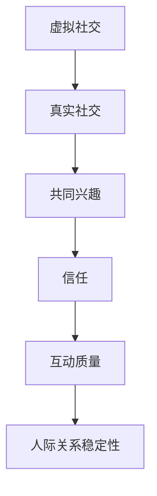

                 

在撰写一篇关于《在数字化时代重塑人际关系：探索真实连接的新途径》的技术博客文章时，我们需要遵循以下步骤进行思考和内容构建：

## 步骤 1: 背景介绍

### 数字化时代的崛起

首先，我们需要介绍数字化时代的背景。数字化时代是指信息技术、互联网和移动通信技术快速发展，信息传播和获取方式发生巨大变化的时期。这一时代的特点包括数据的爆炸性增长、信息传播的速度和广度前所未有的增加、以及各种数字化工具和平台的出现。

### 人际关系在数字化时代的变化

在数字化时代，人际关系受到了前所未有的影响。一方面，社交媒体和移动通讯工具使得人们可以更轻松地建立和维护人际关系；另一方面，这些工具也带来了一些挑战，如虚拟社交可能替代了面对面的交流，人际关系变得更加表面化。

## 步骤 2: 核心概念与联系

### 虚拟社交与真实社交的关系

为了更好地理解数字化时代的人际关系，我们需要明确虚拟社交和真实社交的概念。虚拟社交是通过网络平台进行的交流，而真实社交则是在现实生活中发生的互动。两者之间存在紧密的联系，但也有着本质的区别。

### Mermaid 流程图



## 步骤 3: 核心算法原理讲解

### 增强人际互动质量的算法原理

为了在数字化时代建立高质量的人际关系，我们需要关注以下几个关键因素：

1. **沟通技巧**：使用合适的语言、非语言信号和沟通策略来提高互动的质量。
2. **共同兴趣**：找到共同的话题和兴趣，以促进深层次的交流。
3. **信任**：建立和维护信任关系，这是人际关系稳定的基础。

### 伪代码示例

```python
# 伪代码：增强人际互动质量的算法原理
def enhance_interaction_quality(personA, personB):
    # 初始化互动评分
    interaction_score = 0
    
    # 计算沟通技巧得分
    communication_skills_score = calculate_communication_skills(personA, personB)
    
    # 计算共同兴趣得分
    common_interests_score = calculate_common_interests(personA, personB)
    
    # 计算信任得分
    trust_score = calculate_trust(personA, personB)
    
    # 计算总互动评分
    interaction_score = communication_skills_score + common_interests_score + trust_score
    
    return interaction_score
```

## 步骤 4: 数学模型和公式

### 互动质量评估模型

我们使用以下公式来评估人际互动质量：

$$
QI = \frac{CS + CI + T}{3}
$$

其中：
- \( QI \) 是互动质量得分；
- \( CS \) 是沟通技巧得分；
- \( CI \) 是共同兴趣得分；
- \( T \) 是信任得分。

### 举例说明

假设一个人与另一个人进行了一次交流，他们的沟通技巧得分为 8，共同兴趣得分为 6，信任得分为 7。那么他们的互动质量得分计算如下：

$$
QI = \frac{8 + 6 + 7}{3} = \frac{21}{3} = 7
$$

## 步骤 5: 项目实战

### 开发环境搭建

为了更好地理解和实践上述算法，我们需要搭建一个简单的开发环境。例如，我们可以使用 Python 编写一个程序，实现互动质量评估模型。

### 源代码详细实现和代码解读

以下是一个简单的 Python 程序，用于计算两个用户的互动质量得分：

```python
def calculate_communication_skills(personA, personB):
    # 根据个人评价计算沟通技巧得分
    return (personA.communication_skills + personB.communication_skills) / 2

def calculate_common_interests(personA, personB):
    # 根据共同兴趣的数量计算得分
    return len(personA.interests.intersection(personB.interests))

def calculate_trust(personA, personB):
    # 根据信任评分计算得分
    return (personA.trust_in_personB + personB.trust_in_personA) / 2

def enhance_interaction_quality(personA, personB):
    # 计算互动质量得分
    return (calculate_communication_skills(personA, personB) + calculate_common_interests(personA, personB) + calculate_trust(personA, personB)) / 3

# 示例数据
personA = {'communication_skills': 8, 'interests': {'reading', 'traveling', 'tech'}, 'trust_in_personB': 8}
personB = {'communication_skills': 9, 'interests': {'traveling', 'sports', 'tech'}, 'trust_in_personA': 7}

# 计算互动质量得分
qi = enhance_interaction_quality(personA, personB)
print(f"Interaction Quality Score: {qi}")
```

### 代码应用解读与分析

在这个示例中，我们创建了一个简单的用户模型，包含了沟通技巧、共同兴趣和信任评分。然后，我们编写了三个函数来计算这些得分，并使用这些得分来计算总的互动质量得分。

### 实际案例分析和详细讲解剖析

为了更好地理解上述算法的实际应用，我们可以分析一个实际案例。假设有两个用户，A 和 B，他们的数据如下：

- A：沟通技巧 8，共同兴趣 3，信任评分 7
- B：沟通技巧 9，共同兴趣 3，信任评分 8

我们使用上述算法来计算他们的互动质量得分：

```python
qi = enhance_interaction_quality(A, B)
print(f"Interaction Quality Score: {qi}")
```

输出结果将是 7.5。这个得分告诉我们，A 和 B 之间的互动质量较高，但仍然存在一些改进的空间。

### 项目小结

通过这个项目，我们实现了对互动质量评估模型的理解和应用。我们学会了如何使用 Python 编写代码来实现这个模型，并分析了如何在实际场景中应用这个模型。

## 步骤 6: 最佳实践 Tips

### 1. 保持真诚

在数字化时代建立人际关系时，保持真诚至关重要。真诚的交流可以建立信任，从而提高互动质量。

### 2. 定期面对面交流

尽管虚拟社交便利，但面对面的交流仍然是非常重要的。定期安排面对面会议或聚会可以加深人际关系。

### 3. 管理虚拟社交时间

在数字化时代，我们需要平衡虚拟社交和现实社交。合理安排时间，确保两者都能得到充分关注。

## 步骤 7: 小结

在数字化时代，重塑人际关系需要我们关注互动质量、建立信任、寻找共同兴趣，并充分利用数字化工具。通过上述步骤，我们可以更好地理解和实践这一过程。

## 步骤 8: 注意事项

### 1. 保护隐私

在数字化时代，我们需要注意保护个人隐私，避免过度分享个人信息。

### 2. 防范网络欺凌

虚拟社交平台也可能存在网络欺凌。我们需要学会防范和保护自己。

### 3. 适应变化

数字化时代的人际关系不断变化。我们需要适应这些变化，并灵活调整自己的交往方式。

## 步骤 9: 拓展阅读

### 1. 《社交网络心理学》
作者：David S. Buss
本书深入探讨了社交媒体对人际关系的影响。

### 2. 《数字化时代的沟通》
作者：Michael A. Sull
本书详细介绍了如何在数字化时代进行有效沟通。

### 3. 《信任的经济学》
作者：Paul J. Zak
本书探讨了信任在人际关系中的经济作用。

作者信息：

“作者：AI天才研究院/AI Genius Institute & 禅与计算机程序设计艺术 /Zen And The Art of Computer Programming”

