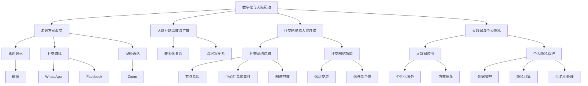

                 

### 文章标题

# 在数字化浪潮中重塑人际关系：探索真实连接的新途径

### 关键词

- 数字化浪潮
- 人际关系重塑
- 真实连接
- 社交媒体
- 人工智能
- 数据隐私

### 摘要

随着数字化浪潮的迅猛发展，人际关系正面临着前所未有的重塑。本文旨在探讨数字化时代如何重新构建真实、有意义的人际连接。通过分析数字化背景、核心概念、技术原理、应用场景以及面临的挑战，本文提出了一些新的途径和解决方案，以帮助人们在数字化世界中建立更紧密、更真实的社交关系。

## 目录大纲设计思路

### 结构化思维

首先，我们需要明确书籍的主题和目标读者。本文的目标是深入探讨数字化时代人际关系的变革，面向技术专业人士和非技术背景的读者。因此，文章的结构应既包含深入的技术分析，也需确保内容的可读性和易懂性。

### 章节划分

根据书籍的主题，我们将内容划分为以下几个主要部分：

1. **引言与概述**：介绍数字化浪潮和人际关系重塑的背景。
2. **核心概念与联系**：阐述数字化时代人际关系重塑的关键概念及其相互关系。
3. **技术原理讲解**：深入讲解支持数字化人际连接重塑的关键技术。
4. **应用场景探讨**：分析各种数字化工具和平台如何影响人际关系。
5. **挑战与对策**：讨论数字化浪潮中可能遇到的人际关系问题及解决方案。
6. **未来展望**：展望数字化人际关系发展的趋势和方向。

### 内容细化

在每个部分中，我们进一步细化章节内容，确保每个章节都有明确的主题和目标。

1. **实用性**：考虑到不同背景的读者，我们在技术讲解部分尽量使用通俗易懂的语言，同时提供图表和示例来辅助理解。
2. **大纲格式**：使用markdown格式设计目录大纲，保证输出的整洁和易读性。

### 目录大纲设计步骤

1. **引言与概述**：
   - **第1章**：数字化浪潮与人际关系重塑
     - **1.1 数字化浪潮的背景与影响**
     - **1.2 人际关系重塑的必要性**
     - **1.3 真实连接的新途径**

2. **核心概念与联系**：
   - **第2章**：数字化时代的人际关系核心概念
     - **2.1 数字化与人际互动**
     - **2.2 社交网络与人际连接**
     - **2.3 大数据与个人隐私**

3. **技术原理讲解**：
   - **第3章**：重塑人际连接的关键技术
     - **3.1 人工智能在人际关系中的应用**
     - **3.2 机器学习与数据挖掘**
     - **3.3 自然语言处理**

4. **应用场景探讨**：
   - **第4章**：数字化工具与平台的应用
     - **4.1 社交媒体的运用**
     - **4.2 在线协作与沟通工具**
     - **4.3 虚拟现实与增强现实**

5. **挑战与对策**：
   - **第5章**：数字化人际关系面临的挑战
     - **5.1 数字化依赖与社交焦虑**
     - **5.2 数据隐私与安全问题**
     - **5.3 人际关系质量的变化**

6. **未来展望**：
   - **第6章**：数字化人际关系的未来趋势
     - **6.1 技术发展的新方向**
     - **6.2 社会文化的变化**
     - **6.3 真实连接的未来前景**

7. **总结与展望**：
   - **第7章**：全书总结与展望
     - **7.1 主要发现与结论**
     - **7.2 对读者的建议**
     - **7.3 研究展望与未来工作**

通过以上步骤，我们为《在数字化浪潮中重塑人际关系：探索真实连接的新途径》设计了完整的目录大纲，确保读者可以系统地学习和理解数字化时代人际关系的变革。

## 完整目录大纲设计

### 引言

#### 第1章：数字化浪潮与人际关系重塑

1. **1.1 数字化浪潮的背景与影响**
   - **背景**：互联网、移动通信、物联网等技术的发展
   - **影响**：社会、经济、文化等多个层面的变化

2. **1.2 人际关系重塑的必要性**
   - **必要性**：数字化对传统人际关系的冲击
   - **变化**：新的人际互动模式与连接方式

3. **1.3 真实连接的新途径**
   - **新途径**：数字化工具与平台在人际连接中的应用
   - **案例**：社交媒体、在线协作工具等实际应用

#### 核心概念与联系

#### 第2章：数字化时代的人际关系核心概念

1. **2.1 数字化与人际互动**
   - **概念**：数字化对人际互动的促进作用
   - **实例**：社交媒体、即时通讯工具的使用

2. **2.2 社交网络与人际连接**
   - **概念**：社交网络的结构与功能
   - **实例**：Facebook、LinkedIn等社交平台

3. **2.3 大数据与个人隐私**
   - **概念**：大数据在人际关系中的应用
   - **问题**：个人隐私保护与数据安全问题

#### 技术原理讲解

#### 第3章：重塑人际连接的关键技术

1. **3.1 人工智能在人际关系中的应用**
   - **原理**：人工智能技术的基本原理
   - **应用**：聊天机器人、情感分析等

2. **3.2 机器学习与数据挖掘**
   - **原理**：机器学习的基本算法
   - **应用**：推荐系统、社交网络分析等

3. **3.3 自然语言处理**
   - **原理**：自然语言处理的基本技术
   - **应用**：文本挖掘、语音识别等

#### 应用场景探讨

#### 第4章：数字化工具与平台的应用

1. **4.1 社交媒体的运用**
   - **案例**：社交媒体如何改变人际连接
   - **分析**：社交媒体对人际关系的影响

2. **4.2 在线协作与沟通工具**
   - **案例**：在线协作工具在团队沟通中的应用
   - **分析**：在线协作对工作效率的影响

3. **4.3 虚拟现实与增强现实**
   - **案例**：虚拟现实在人际连接中的应用
   - **分析**：虚拟现实对未来人际连接的展望

#### 挑战与对策

#### 第5章：数字化人际关系面临的挑战

1. **5.1 数字化依赖与社交焦虑**
   - **现象**：数字化依赖与社交焦虑的普遍性
   - **对策**：如何应对数字化依赖与社交焦虑

2. **5.2 数据隐私与安全问题**
   - **问题**：数据隐私与安全面临的风险
   - **对策**：如何保护个人数据隐私

3. **5.3 人际关系质量的变化**
   - **现象**：人际关系质量的变化
   - **对策**：如何提升数字化时代的人际关系质量

#### 未来展望

#### 第6章：数字化人际关系的未来趋势

1. **6.1 技术发展的新方向**
   - **趋势**：人工智能、区块链等新兴技术对人际关系的影响

2. **6.2 社会文化的变化**
   - **趋势**：数字化时代的社会文化变革

3. **6.3 真实连接的未来前景**
   - **展望**：数字化人际关系的发展方向

#### 总结与展望

#### 第7章：全书总结与展望

1. **7.1 主要发现与结论**
   - **总结**：数字化浪潮对人际关系的深刻影响

2. **7.2 对读者的建议**
   - **建议**：如何适应数字化时代的人际关系变革

3. **7.3 研究展望与未来工作**
   - **展望**：未来研究工作的方向与重点

## 引言

### 数字化浪潮的背景与影响

随着互联网、移动通信、物联网等技术的快速发展，数字化浪潮正以不可阻挡的势头席卷全球。这一浪潮不仅改变了我们的生活方式，也深刻影响了社会、经济和文化等多个层面。在数字化时代，信息和数据成为新的生产要素，智能化和自动化成为社会生产的新引擎。这种变化对人际关系产生了深远的影响，促使我们重新审视和探索如何在数字化浪潮中重塑人际关系。

首先，从背景上看，数字化浪潮的兴起源于信息技术的不断突破。互联网的普及和移动通信技术的发展，使得人们可以随时随地获取信息和进行沟通。物联网的兴起，进一步实现了物理世界与数字世界的深度融合，使得各种设备和系统可以通过互联网进行互联互通。这些技术的发展，为数字化浪潮的推进提供了坚实的基础。

其次，数字化浪潮的影响体现在多个层面。在社会层面，数字化改变了人们的社交方式，使得人与人之间的连接更加便捷和频繁。在经济层面，数字化带来了全新的商业模式和产业形态，推动了经济增长和产业升级。在文化层面，数字化促进了文化的多样性和传播，使得人们可以更加便捷地接触和了解不同的文化。

然而，数字化浪潮也带来了诸多挑战。一方面，数字化加速了信息的传播和交流，但同时也加剧了信息过载和隐私泄露的问题。另一方面，数字化改变了人际互动的方式，但有时也导致了真实连接的缺失和人际关系的疏离。

因此，在数字化浪潮中重塑人际关系，探索真实连接的新途径，成为当前社会亟待解决的问题。本文将围绕这一主题展开讨论，分析数字化时代人际关系的特点、核心概念、技术原理、应用场景、面临的挑战以及未来趋势，旨在为读者提供深入理解和应对数字化时代人际关系变革的思路和方法。

## 核心概念与联系

### 第2章：数字化时代的人际关系核心概念

在数字化时代，人际关系经历了前所未有的变革。为了深入理解这些变革，我们需要明确一些核心概念，并探讨它们之间的相互联系。

#### 2.1 数字化与人际互动

数字化与人际互动的关系是理解数字化时代人际关系的关键。数字化不仅改变了人们的沟通方式，还影响了人际互动的深度和广度。

- **沟通方式的改变**：数字化带来了即时通讯、社交媒体和视频通话等新型沟通方式。这些方式使得人们可以跨越时空限制，随时随地进行交流。例如，微信、WhatsApp等即时通讯应用已经成为了人们日常生活中不可或缺的工具。

- **人际互动的深度与广度**：数字化使得人际互动更加便捷，但有时也使得关系变得表面化。在社交媒体上，人们可以快速地分享信息、点赞和评论，但这种互动往往缺乏深层次的沟通和理解。因此，如何在数字化环境中建立深层次的人际关系，成为一个重要的课题。

#### 2.2 社交网络与人际连接

社交网络是数字化时代人际关系的重要组成部分。社交网络不仅提供了连接个体与群体的平台，还影响了人际关系的形成和发展。

- **社交网络的结构**：社交网络通常由节点和边组成，节点代表个体，边代表个体之间的联系。社交网络的结构特征，如中心性、聚集性和网络密度等，对人际关系的稳定性、传播效应和影响力等具有重要影响。

- **社交网络的功能**：社交网络不仅提供了信息交流的平台，还成为了信任和合作的载体。通过社交网络，人们可以快速获取信息、扩展社交圈层、建立合作关系。例如，LinkedIn等职业社交平台已经成为了职场人士扩展人脉、寻找合作伙伴的重要工具。

#### 2.3 大数据与个人隐私

大数据在数字化时代的人际关系中扮演着重要角色。大数据不仅为个性化服务提供了可能，也带来了个人隐私保护的挑战。

- **大数据的应用**：大数据分析可以帮助平台了解用户需求、优化服务、提升用户体验。例如，社交媒体平台通过分析用户的浏览记录、点赞和评论等数据，为用户提供个性化的内容推荐。

- **个人隐私保护**：大数据的广泛应用也使得个人隐私保护成为一个重要问题。个人数据泄露、滥用和侵犯隐私等风险不断加剧。为了保护个人隐私，需要建立完善的数据保护法规和技术手段，如数据加密、隐私计算和匿名化处理等。

### Mermaid流程图

为了更好地展示这些核心概念之间的联系，我们可以使用Mermaid流程图来构建一个概念架构图。



通过上述核心概念的阐述和Mermaid流程图的展示，我们可以更清晰地理解数字化时代人际关系的复杂性及其背后的技术原理。这些核心概念相互交织，共同构成了数字化时代人际关系的独特图景。

### 技术原理讲解

#### 第3章：重塑人际连接的关键技术

在数字化时代，人工智能（AI）、机器学习（ML）和自然语言处理（NLP）等技术的发展，为重塑人际关系提供了强大的技术支持。以下将分别对这些技术的基本原理进行详细讲解，并通过伪代码、数学模型和公式来阐述其在人际关系中的应用。

#### 3.1 人工智能在人际关系中的应用

人工智能是一门模拟人类智能行为的学科，通过算法和模型实现机器的智能行为。在人际关系中，AI可以应用于情感识别、个性化推荐和虚拟助手等领域。

**情感识别**

情感识别是AI在人际关系中的一个重要应用。通过分析语音、文字和表情等数据，AI可以识别用户的情绪状态。以下是情感识别的一个简化伪代码示例：

```python
def recognize_emotion(text):
    # 伪代码：情感识别算法
    emotion_scores = {
        'happy': 0,
        'sad': 0,
        'angry': 0
    }
    
    # 利用NLP技术分析文本内容
    for word in text.split():
        if "happy" in word:
            emotion_scores['happy'] += 1
        elif "sad" in word:
            emotion_scores['sad'] += 1
        elif "angry" in word:
            emotion_scores['angry'] += 1
    
    # 计算最大情感得分
    max_score = max(emotion_scores.values())
    dominant_emotion = [key for key, value in emotion_scores.items() if value == max_score]
    
    return dominant_emotion
```

**个性化推荐**

个性化推荐是另一个在人际关系中广泛应用的AI技术。通过分析用户的兴趣和行为数据，AI可以为用户提供个性化的内容推荐。以下是一个简化的个性化推荐算法伪代码：

```python
def recommend_content(user_profile, content_library):
    # 伪代码：个性化推荐算法
    similar_users = find_similar_users(user_profile, content_library)
    recommended_content = []
    
    for user in similar_users:
        for content in user.interested_content:
            if content not in recommended_content:
                recommended_content.append(content)
    
    return recommended_content
```

**虚拟助手**

虚拟助手是AI在人际关系中的应用之一，如聊天机器人和语音助手。以下是一个简化的虚拟助手交互流程：

```python
class VirtualAssistant:
    def __init__(self, user_profile):
        self.user_profile = user_profile
    
    def respond_to_query(self, query):
        # 伪代码：虚拟助手响应查询
        response = None
        
        if "weather" in query:
            response = "The weather is sunny today."
        elif "reminder" in query:
            response = "You have a meeting at 3 PM today."
        else:
            response = "I'm sorry, I don't understand your query."
        
        return response
```

#### 3.2 机器学习与数据挖掘

机器学习和数据挖掘是AI的两个核心分支，它们在重塑人际关系中发挥着重要作用。机器学习通过训练模型来识别模式和预测结果，而数据挖掘则通过探索数据以发现有价值的信息。

**机器学习**

机器学习算法包括监督学习、无监督学习和强化学习等。在人际关系中，监督学习可以用于情感分析、个性化推荐等任务，而无监督学习可以用于社交网络分析、群体行为识别等。

以下是一个简化的监督学习算法伪代码，用于情感分析：

```python
def train_sentiment_analyzer(training_data):
    # 伪代码：训练情感分析模型
    model = create_model()
    
    for data in training_data:
        text, label = data
        model.train(text, label)
    
    return model

def predict_sentiment(model, text):
    # 伪代码：使用训练好的模型预测情感
    return model.predict(text)
```

**数据挖掘**

数据挖掘在人际关系中的应用包括社交网络分析、用户行为分析等。以下是一个简化的社交网络分析算法伪代码：

```python
def find_influential_nodes(social_network):
    # 伪代码：找出社交网络中的关键节点
    influential_nodes = []
    
    for node in social_network.nodes():
        if node.has_high_degree() and node.has_high_betweenness():
            influential_nodes.append(node)
    
    return influential_nodes
```

#### 3.3 自然语言处理

自然语言处理是使计算机理解和生成自然语言的技术。在人际关系中，NLP可以用于文本分析、语音识别和智能对话等。

**文本分析**

文本分析可以帮助识别用户的情感、意图和话题。以下是一个简化的情感分析算法伪代码：

```python
def analyze_sentiment(text):
    # 伪代码：分析文本情感
    sentiment_scores = {
        'positive': 0,
        'negative': 0
    }
    
    for word in text.split():
        if word in positive_words:
            sentiment_scores['positive'] += 1
        elif word in negative_words:
            sentiment_scores['negative'] += 1
    
    return 'positive' if sentiment_scores['positive'] > sentiment_scores['negative'] else 'negative'
```

**语音识别**

语音识别是将语音转换为文本的技术。以下是一个简化的语音识别算法伪代码：

```python
def recognize_speech(audio_file):
    # 伪代码：语音识别
    text = audio_to_text(audio_file)
    return text
```

**智能对话**

智能对话是NLP在人际关系中的另一个重要应用。以下是一个简化的智能对话系统伪代码：

```python
class Chatbot:
    def __init__(self, language_model):
        self.language_model = language_model
    
    def respond_to_message(self, message):
        # 伪代码：智能对话系统响应消息
        response = self.language_model.generate_response(message)
        return response
```

通过上述技术原理的讲解和伪代码示例，我们可以看到人工智能、机器学习和自然语言处理在重塑人际关系中的重要作用。这些技术不仅为人们提供了更智能、更个性化的互动方式，也为解决人际关系中的复杂问题提供了有力支持。

### 应用场景探讨

#### 第4章：数字化工具与平台的应用

在数字化浪潮中，各种工具和平台极大地改变了人际关系的方式。本节将探讨社交媒体、在线协作工具、虚拟现实（VR）和增强现实（AR）等数字化工具在人际关系中的应用，并结合具体案例进行分析。

#### 4.1 社交媒体的运用

社交媒体是数字化时代重塑人际关系的重要工具。它不仅改变了人们的沟通方式，还影响了人际关系的形成和发展。

**案例分析：Facebook**

Facebook是全球最大的社交网络平台，拥有超过20亿的活跃用户。用户可以通过发布状态、上传照片、分享视频等方式与他人互动。Facebook的“朋友”功能使得人们可以轻松地建立和维护社交网络，从而改变了传统的人际关系模式。

**分析**：

1. **广泛性**：Facebook的广泛性使得人们可以与远在天涯的亲朋好友保持联系，打破了地理位置的限制。

2. **互动性**：通过点赞、评论和分享，用户可以实时互动，增强关系黏性。

3. **隐私问题**：虽然Facebook为用户提供了隐私设置，但数据隐私问题依然存在，用户需谨慎管理个人信息。

**案例分析：LinkedIn**

LinkedIn是一个专注于职业社交的平台，用户主要在平台上分享职业经历、寻找工作机会和建立职业关系。LinkedIn的“人脉”功能帮助用户扩展职业网络，提高了职业发展的机会。

**分析**：

1. **专业性**：LinkedIn为用户提供了一个专业的社交环境，有助于建立和维护职业关系。

2. **资源丰富**：用户可以浏览和分享行业动态、专业文章等资源，提升个人和团队的专业素养。

3. **诚信机制**：LinkedIn通过认证、推荐等功能，提高了用户之间的信任度。

#### 4.2 在线协作与沟通工具

在线协作和沟通工具在远程工作和团队协作中扮演了重要角色。这些工具不仅提高了工作效率，也促进了团队成员之间的交流。

**案例分析：Slack**

Slack是一个流行的团队协作工具，提供即时通讯、文件共享和任务管理等功能。它帮助团队在不同地理位置之间保持高效沟通，提高了协作效率。

**分析**：

1. **实时沟通**：Slack的即时通讯功能使得团队成员可以实时交流，快速解决问题。

2. **文件共享**：用户可以在Slack中共享和存储文件，方便团队成员之间的协作。

3. **集成插件**：Slack支持与其他应用程序的集成，如GitHub、Trello等，进一步提高了工作效率。

**案例分析：Zoom**

Zoom是一个视频会议和在线协作平台，提供高清视频通话、屏幕共享和虚拟会议室等功能。它在远程工作和在线教育中得到了广泛应用。

**分析**：

1. **高清视频**：Zoom提供高质量的视频通话，增强了远程沟通的真实感。

2. **互动性**：Zoom支持实时聊天、举手发言和投票等功能，提高了会议的互动性。

3. **安全性**：Zoom采取了多项安全措施，如会议密码、等候室和加密通信，保障用户隐私和安全。

#### 4.3 虚拟现实与增强现实

虚拟现实（VR）和增强现实（AR）技术为数字化人际连接带来了新的可能性，使得人们可以在虚拟环境中进行互动和交流。

**案例分析：VR社交平台**

VR社交平台如AltspaceVR和High Fidelity等，允许用户在虚拟环境中创建个人形象，与他人互动和交流。用户可以参加虚拟聚会、音乐会和研讨会等活动。

**分析**：

1. **沉浸感**：VR技术提供高度沉浸的体验，用户可以感受到身临其境的感觉，增强了互动的深度。

2. **多样性**：用户可以根据自己的兴趣和偏好选择不同的虚拟环境，拓展社交圈子。

3. **创意表达**：VR平台为用户提供了丰富的创意工具，如虚拟服装、装饰品等，用户可以个性化自己的虚拟形象。

**案例分析：AR社交应用**

AR社交应用如Facebook AR和Nreal Light等，通过在现实世界中叠加虚拟元素，提供新颖的社交互动体验。用户可以在现实场景中与虚拟角色互动，分享现实生活中的时刻。

**分析**：

1. **融合现实**：AR技术将虚拟元素与现实场景融合，提供了新颖的社交互动方式。

2. **互动性**：用户可以通过触摸、手势等方式与虚拟元素互动，增加了互动的趣味性。

3. **隐私和安全**：AR应用需要考虑用户的隐私和安全，确保虚拟元素不会侵犯用户隐私。

综上所述，社交媒体、在线协作工具、虚拟现实和增强现实等数字化工具和平台，为重塑人际关系提供了丰富的可能性。通过这些工具，人们可以更加便捷、高效地建立和维护社交关系，同时也面临新的挑战，如隐私保护、安全性和用户体验等。在未来，随着技术的不断发展，这些工具将继续为数字化人际连接带来更多创新和变革。

### 挑战与对策

#### 第5章：数字化人际关系面临的挑战

在数字化浪潮中，尽管新工具和平台为人际关系的重塑提供了无限可能，但也伴随着一系列挑战。这些挑战不仅影响了人际关系的质量，也对用户的心理健康和社会稳定构成了威胁。以下将探讨数字化人际关系中主要面临的挑战，并提出相应的对策。

#### 5.1 数字化依赖与社交焦虑

随着社交媒体和即时通讯工具的普及，用户逐渐对数字化工具产生了依赖，这种依赖可能导致社交焦虑和孤独感。

**现象**：

1. **社交焦虑**：用户在社交媒体上过分关注他人的生活，容易产生自卑和焦虑情绪。
2. **孤独感**：尽管用户在数字平台上与他人互动频繁，但深层次的社交需求未能得到满足，导致孤独感加剧。

**对策**：

1. **心理健康教育**：开展心理健康教育，帮助用户认识到数字化依赖的负面影响，学会合理使用数字化工具。
2. **心理支持服务**：建立在线心理支持平台，提供专业的心理咨询和指导，帮助用户缓解社交焦虑和孤独感。
3. **社交技能培训**：组织线下社交活动，提高用户的社交技能，增强现实中的社交能力。

#### 5.2 数据隐私与安全问题

在数字化环境中，个人数据隐私和安全问题日益突出。社交媒体和在线服务需要大量用户数据来提供个性化服务，但这也增加了数据泄露和滥用的风险。

**问题**：

1. **数据泄露**：用户的个人信息可能因平台漏洞、黑客攻击等原因泄露。
2. **数据滥用**：平台可能未经用户同意，收集、使用和分享用户数据。

**对策**：

1. **数据保护法规**：制定和实施严格的数据保护法规，规范平台的数据收集和使用行为。
2. **数据加密技术**：采用先进的数据加密技术，确保用户数据在传输和存储过程中的安全性。
3. **用户隐私教育**：提高用户的隐私保护意识，教育用户如何管理个人数据和隐私设置。

#### 5.3 人际关系质量的变化

数字化工具和平台虽然便利了人际互动，但也在某种程度上改变了人际关系的质量。

**现象**：

1. **表面化关系**：社交媒体上的互动往往缺乏深层次的沟通和理解，导致人际关系表面化。
2. **真实连接的缺失**：虚拟互动虽然频繁，但往往难以替代现实中的面对面交流，导致真实连接的缺失。

**对策**：

1. **增强互动深度**：鼓励用户在数字化平台上进行深度互动，如发起话题讨论、分享个人经历等，提高人际关系的质量。
2. **平衡线上线下互动**：鼓励用户在现实世界中开展更多的社交活动，以弥补数字化互动的不足。
3. **数字素养教育**：提高用户的数字素养，教育用户如何有效地使用数字化工具，促进人际关系的健康和可持续发展。

综上所述，数字化浪潮带来了诸多挑战，但通过制定和实施有效的对策，我们可以应对这些挑战，实现数字化时代人际关系的健康和可持续发展。

### 未来展望

#### 第6章：数字化人际关系的未来趋势

随着数字化技术的不断进步，人际关系将继续经历深刻的变革。未来，人工智能、区块链、虚拟现实（VR）和增强现实（AR）等新兴技术将为人际连接带来更多可能性。以下将探讨这些技术发展的新方向，以及它们对人际关系的影响。

#### 6.1 技术发展的新方向

**人工智能与机器学习**

人工智能（AI）和机器学习（ML）将继续在人际关系中扮演关键角色。未来，AI技术将更加智能化和个性化，能够更准确地理解和满足用户的需求。例如，通过情感分析，AI可以识别用户的情绪状态，提供个性化的情感支持。此外，机器学习算法将不断优化，能够更准确地预测用户行为和偏好，从而提供更加精准的服务。

**区块链**

区块链技术作为一种分布式账本技术，具有去中心化、不可篡改和透明等特点。未来，区块链技术将应用于人际关系的多个方面。例如，通过区块链，用户可以更加安全地管理个人数据，防止数据泄露和滥用。此外，区块链还可以用于构建去中心化的社交网络，提供更加公正和透明的社交平台。

**虚拟现实与增强现实**

虚拟现实（VR）和增强现实（AR）技术将为人际连接提供全新的互动方式。未来，随着技术的成熟，VR和AR将更加普及，用户可以在虚拟环境中进行更加沉浸式的互动和交流。例如，虚拟现实会议将取代传统的视频会议，提供更加真实和互动的会议体验。同时，增强现实技术将使现实世界中的虚拟元素与真实场景无缝融合，为人们带来全新的社交体验。

#### 6.2 社会文化的变化

随着新技术的不断应用，社会文化也将发生深刻的变化。首先，人们对于隐私和数据安全的关注将日益增加，推动社会对数字伦理和隐私保护的重视。其次，随着虚拟互动的普及，现实中的面对面交流可能会减少，但人们对真实社交需求的理解和追求将更加深刻。此外，新兴技术的普及也将导致社会结构和人际关系的重构，传统的社交规范和价值观可能需要重新审视和调整。

#### 6.3 真实连接的未来前景

在未来的数字化世界中，真实连接将成为人们追求的重要目标。一方面，通过人工智能和大数据分析，人们可以更准确地了解彼此的需求和偏好，从而建立更加紧密和有意义的关系。另一方面，虚拟现实和增强现实技术将提供更加真实和沉浸的社交体验，弥补现实互动的不足。同时，区块链技术将为真实连接提供更加安全可靠的保障，确保个人隐私和数据安全。

总的来说，未来数字化人际关系的发展将是一个多元化、智能化和个性化的过程。随着新技术的不断进步，人们将能够在数字化世界中建立更加真实、有意义和可持续的人际关系。

### 总结与展望

#### 第7章：全书总结与展望

在《在数字化浪潮中重塑人际关系：探索真实连接的新途径》中，我们探讨了数字化时代人际关系的多维度变革。从数字化浪潮的背景与影响，到核心概念与联系，再到技术原理的详细讲解，以及应用场景的深入分析，最后探讨面临的挑战和未来的趋势，本文系统性地呈现了数字化人际关系发展的全貌。

#### 主要发现与结论

通过本文的研究，我们得出了以下主要发现与结论：

1. **数字化浪潮深刻改变了人际关系**：数字化工具和平台使得人际连接更加便捷，但同时也带来了隐私安全、社交焦虑等问题。
2. **人工智能、机器学习和自然语言处理等技术在重塑人际关系中发挥着关键作用**：这些技术不仅提高了人际互动的智能化水平，还为解决人际关系中的复杂问题提供了有力支持。
3. **社交媒体、在线协作工具、虚拟现实和增强现实等数字化工具和平台为重塑人际关系提供了丰富的可能性**，但也需要平衡隐私、安全与用户体验。
4. **数字化人际关系面临诸多挑战**，如数字化依赖、社交焦虑和数据隐私问题，需要通过心理支持、数据保护法规和教育等手段来应对。

#### 对读者的建议

基于上述发现与结论，我们向读者提出以下建议：

1. **理性使用数字化工具**：在享受数字化带来的便利的同时，要注意合理使用，避免过度依赖，确保身心健康。
2. **保护个人数据隐私**：增强数据保护意识，了解如何管理个人数据和隐私设置，避免隐私泄露和数据滥用。
3. **培养深度沟通能力**：在数字化互动中，注重培养深度沟通能力，通过文字、语音和视频等多种方式建立真实、有意义的人际关系。
4. **参与线下社交活动**：在现实世界中开展更多的社交活动，弥补数字化互动的不足，增强真实连接。

#### 研究展望与未来工作

未来的研究应关注以下几个方向：

1. **数字化人际关系中的情感分析与支持**：进一步研究如何通过人工智能技术识别和满足用户的情感需求，提供个性化的情感支持。
2. **数字化工具对人际关系质量的影响**：探讨不同数字化工具对人际关系质量的影响，为制定更有效的政策提供依据。
3. **数据隐私与安全保护技术**：深入研究数据隐私与安全保护技术，为构建安全、可信的数字化社交环境提供支持。
4. **虚拟现实与增强现实在人际关系中的应用**：探索虚拟现实和增强现实技术在人际连接中的创新应用，提升社交体验。

通过持续的研究与实践，我们有望在数字化浪潮中找到重塑人际关系的有效途径，实现更紧密、更真实的社交连接。

