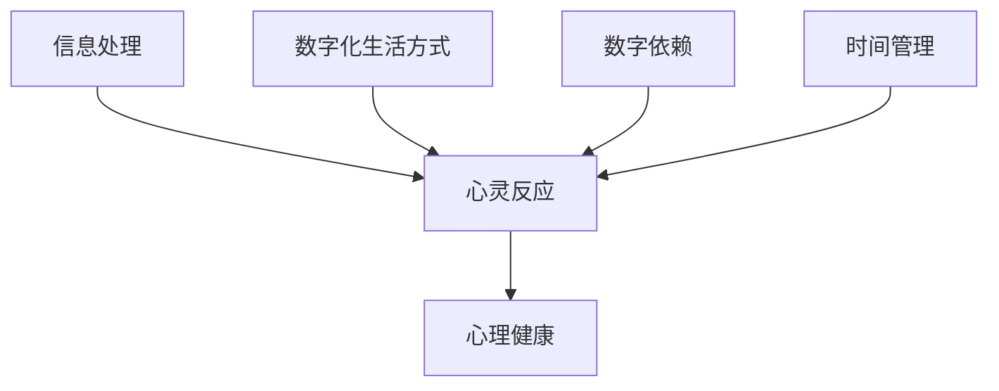

                 

### 文章标题

《在数字时代寻找内心平静：科技与心灵的平衡之道》

### 文章关键词

数字时代、内心平静、科技与心灵、心理健康、平衡策略

### 文章摘要

本文旨在探讨数字时代下，人们如何在科技迅猛发展的背景下，找到内心的平静。通过分析科技对人类心理的深刻影响，我们提出了平衡科技与心灵的具体策略，包括冥想、正念练习、数字排毒等方法。同时，结合心理学原理，探讨实现科技与心灵平衡的实践路径。文章还展望了科技新趋势，如虚拟现实和人工智能，如何在未来的发展中助力人们寻找内心平静。通过案例分析和实践指南，帮助读者在实际生活中应用这些平衡策略。

---

## 引言

### 数字时代的心理挑战

随着科技的飞速发展，我们的世界正变得日益数字化。智能手机、互联网、社交媒体等数字工具已成为日常生活中不可或缺的部分。然而，这种科技带来的便利也带来了新的心理挑战。研究表明，数字时代的快节奏和高连接性可能导致焦虑、压力、注意力分散等心理问题。人们常常感到时间不够用，注意力难以集中，甚至出现数字成瘾的现象。

### 心灵平静的重要性

在这个充满喧嚣和快节奏的时代，寻找内心的平静变得尤为重要。心灵平静不仅有助于缓解焦虑和压力，还能提升个体的幸福感、创造力和生活质量。因此，如何在数字时代保持心灵平静，成为了现代社会的重要议题。

### 本文目的

本文将围绕以下核心问题展开探讨：

1. 科技如何影响我们的心理健康？
2. 什么样的策略可以帮助我们在数字时代保持心灵平静？
3. 科技新趋势如何助力我们实现心灵平静？

通过以上问题的探讨，本文旨在为读者提供一套实用的策略和方法，帮助他们在数字时代找到内心的平衡。

---

## 核心概念与联系

在探讨科技与心灵的平衡之前，我们首先需要明确几个核心概念，并理解它们之间的关系。以下是本文涉及的主要概念及其相互关系：

### 科技与心灵的基本互动

- **信息处理**：科技的发展使得信息的获取、处理和传播变得更加高效和便捷。
- **心灵反应**：个体对信息处理的心理反应，包括注意力集中、情绪变化和认知过程。

### 数字化生活方式的影响

- **数字依赖**：随着数字工具的普及，人们可能对数字设备产生依赖，甚至成瘾。
- **时间管理**：数字化生活方式改变了人们的时间观念，可能导致时间管理和注意力分散的问题。

### Mermaid 流程图：科技与心灵互动

为了更直观地展示这些概念之间的关系，我们可以使用 Mermaid 流程图来表示科技与心灵的基本互动：

在这个流程图中，A 表示信息处理，C 表示数字化生活方式的影响，D 表示数字依赖，E 表示时间管理，B 表示心灵反应，F 表示心理健康。可以看到，信息处理、数字化生活方式和数字依赖等因素直接影响心灵反应，进而影响心理健康。

### 核心概念之间的关系

理解这些核心概念之间的关系有助于我们更好地把握科技与心灵平衡的本质。以下是对这些关系的详细阐述：

- **信息处理与心灵反应的平衡**：信息处理是科技的核心功能，但过度的信息处理可能导致心灵反应失衡，引发焦虑和压力。
- **数字与心灵的互动**：数字工具不仅改变了我们的生活方式，还影响了我们的心灵状态。保持数字与心灵的良性互动是实现心灵平衡的关键。
- **心理健康的重要性**：心理健康是个人幸福和生产力的重要保障。保持心理健康有助于我们更好地应对数字化生活的挑战。

通过以上核心概念与联系的分析，我们为后续讨论科技与心灵平衡提供了理论基础。在接下来的部分，我们将进一步探讨科技对人类心理的影响，并提出具体的平衡策略。

---

## 科技与心灵互动

### 科技对人类心理的影响

科技的发展给我们的生活带来了极大的便利，但也带来了新的心理挑战。以下是一些科技对人类心理的直接影响：

#### 沉迷与依赖

随着智能手机和互联网的普及，许多人沉迷于社交媒体、游戏等数字工具。这种沉迷可能导致时间管理困难、注意力分散，甚至出现数字依赖。数字依赖不仅影响个体的日常生活，还可能导致心理健康问题，如焦虑、抑郁等。

#### 焦虑与压力

在数字化生活方式下，人们常常感到时间紧迫，需要不断处理大量的信息。这种高强度的信息处理可能导致焦虑和压力增加。研究表明，长时间使用数字设备与心理压力之间存在显著的正相关关系。

#### 注意力分散

数字工具的易用性和互动性可能导致我们的注意力难以集中。在多任务处理的情况下，人们的注意力容易分散，导致工作效率降低，甚至影响认知功能。

#### 睡眠质量下降

使用数字设备的时间过长，特别是睡前使用手机和电脑，可能影响睡眠质量。蓝光辐射、信息过载和过度兴奋都是导致睡眠质量下降的原因。

### 数字时代中如何保持心灵平静

在数字时代，保持心灵平静需要采取一系列的策略和方法。以下是一些实用的建议：

#### 冥想与正念练习

冥想和正念练习是缓解压力、提升专注力的有效方法。通过冥想，我们可以学会控制自己的情绪，减少焦虑和压力。正念练习则有助于提高自我意识和心理平衡。

#### 数字排毒与心灵放松

定期进行数字排毒，即暂时远离数字设备，有助于恢复心理健康。在这段时间里，可以进行放松活动，如瑜伽、阅读等，以减轻心理压力。

#### 设定屏幕时间限制

设定合理的屏幕时间限制，有助于减少数字工具对心理健康的影响。可以通过手机应用或设定提醒来帮助自己控制使用时间。

#### 增强数字素养

提高数字素养，包括了解数字工具的使用方法和潜在风险，有助于我们更好地管理数字化生活。通过学习和实践，我们可以更有效地利用数字工具，同时减少其对心理健康的负面影响。

#### 睡眠质量的提升

改善睡眠质量是保持心理健康的重要一环。在睡前避免使用手机和电脑，保持良好的睡眠环境，可以帮助我们获得更好的睡眠。

### 实例分析

以下是一个具体的案例，展示了如何在数字时代中保持心灵平静：

**案例：小张的数字排毒之旅**

小张是一位年轻的IT工程师，由于工作繁忙，他经常使用电脑和手机。随着时间的推移，他开始感到焦虑和疲劳。为了改善自己的心理健康，小张决定进行数字排毒。

首先，小张设定了一个为期一周的数字排毒计划。在这段时间里，他每天晚上9点后不使用手机和电脑，而是选择阅读书籍和冥想来放松自己。此外，他还参加了瑜伽课程，以增强身体和心灵的平衡。

一周后，小张感到自己的焦虑和疲劳明显减轻。他发现自己的专注力提升了，工作效率也提高了。更重要的是，他感到内心的平静和宁静，这对他的心理健康和生活质量产生了积极的影响。

通过这个案例，我们可以看到数字排毒和正念练习在保持心灵平静方面的有效性。这些方法不仅有助于缓解焦虑和压力，还能提升个体的整体幸福感。

---

在数字时代，科技的发展既带来了便利，也带来了心理挑战。保持心灵平静是实现心理健康和幸福感的关键。通过冥想、数字排毒、设定屏幕时间限制等方法，我们可以有效地应对数字时代的心理挑战。在接下来的部分，我们将进一步探讨如何通过平衡策略和生活方式调整，实现科技与心灵的长期平衡。

---

## 平衡策略

### 实现科技与心灵平衡的方法

在数字时代，保持心灵平静不仅仅需要意识到科技对心理健康的影响，更需要采取一系列具体的策略和方法。以下是一些实用的建议，帮助我们在日常生活中实现科技与心灵的平衡：

#### 建立健康的生活习惯

良好的生活习惯是保持心理健康的基础。以下是一些建议：

- **规律作息**：确保每天有足够的睡眠，保持规律的作息时间，有助于提高心理健康和身体免疫力。
- **健康饮食**：均衡饮食，避免过多的咖啡因和糖分摄入，有助于维持心理平衡和身体健康。
- **适量运动**：定期进行体育锻炼，如跑步、瑜伽或健身房锻炼，有助于缓解压力，提升心理健康。

#### 增强自我调节能力

自我调节能力是指个体在面对压力和挑战时，能够有效地调节自己的情绪和行为。以下是一些提升自我调节能力的方法：

- **情绪管理**：学会识别和应对自己的情绪，如焦虑、愤怒和抑郁。可以通过写日记、进行情绪记录或咨询心理医生来实现。
- **时间管理**：合理安排时间，设定优先级，避免时间管理失控导致的焦虑和压力。
- **目标设定**：设定明确的个人和职业目标，有助于提高动力和满足感，减少不确定性带来的焦虑。

#### 心理学视角下的平衡

心理学提供了多种理论和实践方法，帮助我们在科技与心灵的互动中实现平衡。以下是一些值得探讨的心理学视角：

- **认知行为疗法（CBT）**：CBT 是一种广泛认可的心理治疗方法，通过改变不合理的思维模式和行为模式，帮助个体应对焦虑和抑郁。例如，通过认知重构，个体可以学会以更积极的方式看待问题，减少负面情绪。
- **自我意识提升**：通过冥想、正念练习和瑜伽等实践，个体可以提升自我意识，更好地了解自己的情绪和心理需求。这种自我意识有助于我们更好地调节自己的行为和情绪。
- **情感智力（EQ）**：情感智力是指个体识别、理解和管理自己情绪的能力。通过培养情感智力，个体可以更好地处理情感问题，提高人际关系质量和心理健康。

#### 实例分析

以下是一个具体的案例，展示了如何在日常生活中应用上述策略：

**案例：小王的科技与心灵平衡之旅**

小王是一位年轻的软件开发工程师，由于工作繁忙，他常常感到焦虑和压力。为了改善自己的心理健康，小王决定采取一系列措施：

1. **建立健康的生活习惯**：小王开始规律作息，每晚保证7-8小时的睡眠，并尽量在晚上10点前休息。他还注意饮食健康，减少咖啡因和糖分的摄入，并每天进行30分钟的有氧运动。

2. **增强自我调节能力**：小王学会了情绪管理技巧，如深呼吸和冥想，帮助自己在面对压力时保持冷静。他还使用时间管理工具，如番茄工作法，合理安排工作和休息时间。

3. **心理学视角下的平衡**：小王参加了认知行为疗法（CBT）的培训，学习了如何通过认知重构应对负面情绪。他还定期参加瑜伽课程，提升自我意识和情感智力。

通过这些措施，小王的焦虑和压力明显减轻，他的工作效率和生活质量都得到了显著提升。这个案例表明，通过综合运用生活习惯调整、自我调节能力和心理学视角，个体可以在数字时代中实现科技与心灵的平衡。

### 总结

实现科技与心灵的平衡需要我们从多个方面入手，包括建立健康的生活习惯、增强自我调节能力以及运用心理学视角。通过这些策略，我们可以在数字时代中更好地管理自己的心理健康，找到内心的平静。在接下来的部分，我们将进一步探讨如何从生活方式的调整中实现科技与心灵的平衡。

---

## 生活方式调整

在数字时代，我们的生活方式正在发生巨大的变化，而这些变化对我们的心理健康产生了深远的影响。因此，调整生活方式以实现科技与心灵的平衡显得尤为重要。以下是一些具体的方法和策略：

### 设定屏幕时间限制

屏幕时间是指我们使用电脑、手机和其他电子设备的时间。长时间盯着屏幕不仅对眼睛有害，还可能导致焦虑、压力和注意力分散。因此，设定合理的屏幕时间限制是关键。以下是一些建议：

- **每天设定固定时间**：例如，每天晚上9点后不使用手机和电脑，保证有足够的休息时间。
- **使用屏幕时间管理应用**：许多手机和电脑都有内置的屏幕时间管理功能，可以帮助我们监控和限制屏幕时间。
- **设定“无手机”区域**：在家中设定一个无手机区域，例如卧室，确保在睡觉前和休息时远离手机和电脑。

### 提高数字素养

数字素养是指个体在数字时代中有效地使用数字工具和资源的能力。提高数字素养可以帮助我们更好地管理数字化生活方式，减少其负面影响。以下是一些建议：

- **学习基本的安全知识**：了解如何保护个人信息和隐私，避免网络诈骗和信息安全问题。
- **培养信息筛选能力**：学会辨别信息的真实性和可靠性，避免被虚假信息误导。
- **使用数字工具提高效率**：掌握有效的数字工具和软件，如项目管理工具、时间管理应用等，提高工作效率，减少不必要的压力。

### 睡眠质量的提升

良好的睡眠质量是保持心理健康的关键。以下是一些改善睡眠质量的策略：

- **保持规律的作息时间**：每天按时上床睡觉和起床，帮助身体建立稳定的生物钟。
- **避免晚上使用手机和电脑**：蓝光辐射会干扰睡眠，因此建议在睡前一小时停止使用这些设备。
- **创建良好的睡眠环境**：确保卧室安静、舒适，保持适宜的温度和光线。

### 培养数字素养

数字素养是指个体在数字时代中有效地使用数字工具和资源的能力。以下是一些建议：

- **持续学习**：随着科技的发展，我们需要不断学习新的技能和知识，以适应数字化的生活方式。
- **批判性思维**：培养批判性思维，对数字工具和资源进行评估，避免盲目接受和过度依赖。
- **社交互动**：通过线上和线下的方式，与他人保持良好的社交互动，减少孤独感和焦虑。

### 实例分析

以下是一个具体的案例，展示了如何通过调整生活方式实现科技与心灵的平衡：

**案例：小李的数字平衡之旅**

小李是一位忙碌的职场人士，由于工作需要，他每天使用电脑和手机的时间很长。随着时间的推移，他感到自己的心理健康状况逐渐恶化，经常感到焦虑和疲劳。为了改善自己的生活状态，小李采取了一系列的措施：

1. **设定屏幕时间限制**：小李每天晚上9点后不使用手机和电脑，通过设定提醒来遵守这一规定。
2. **提高数字素养**：小李参加了数字素养培训课程，学习了如何有效使用数字工具和资源，提高了工作效率。
3. **改善睡眠质量**：小李保持规律的作息时间，每天按时上床睡觉，并避免晚上使用手机和电脑。
4. **培养数字素养**：小李定期参加社交活动，通过线上和线下的方式与他人保持互动，减少了孤独感。

通过这些措施，小李的焦虑和疲劳明显减轻，他的工作效率和生活质量都得到了显著提升。这个案例表明，通过设定屏幕时间限制、提高数字素养和改善睡眠质量，我们可以实现科技与心灵的平衡。

### 总结

调整生活方式是实现科技与心灵平衡的重要策略。通过设定屏幕时间限制、提高数字素养和改善睡眠质量，我们可以更好地管理数字化生活方式，减少其对心理健康的负面影响。在接下来的部分，我们将探讨科技新趋势如何帮助我们寻找内心平静。

---

## 科技新趋势

随着科技的不断进步，新的技术和工具正在不断涌现，为我们寻找内心平静提供了更多的选择。以下是一些前沿科技趋势，探讨它们如何帮助我们实现心灵平静。

### 虚拟现实（VR）

虚拟现实技术通过创建沉浸式的虚拟环境，为我们提供了一种全新的体验方式。在VR中，用户可以脱离现实环境，进入一个完全不同的世界，从而减轻压力和焦虑。以下是一些具体应用：

- **放松体验**：用户可以在虚拟森林中漫步，欣赏美丽的自然风景，这有助于缓解压力和焦虑。
- **心理治疗**：VR技术已被用于治疗恐惧症和焦虑症。通过虚拟现实，患者可以在安全的环境中逐步面对他们的恐惧，从而克服这些问题。
- **娱乐和游戏**：VR游戏和娱乐体验可以提供一种逃避现实的方式，帮助用户在虚拟世界中寻找乐趣和放松。

### 人工智能（AI）

人工智能技术的发展为我们提供了许多新的工具和方法，帮助我们更好地管理心理健康。以下是一些应用：

- **个性化心理健康解决方案**：AI可以通过分析用户的行为、情绪和生活方式数据，提供个性化的心理健康建议和治疗方案。
- **情感分析**：AI可以分析用户的语言和情绪表达，识别潜在的心理问题，并提供相应的支持和建议。
- **智能助手**：AI智能助手可以提供24/7的心理健康支持，帮助用户监控和管理自己的情绪和心理状态。

### 增强现实（AR）

增强现实技术通过将虚拟信息叠加到现实世界中，为用户提供了更加丰富和互动的体验。以下是一些应用：

- **心理健康教育**：AR技术可以用于心理健康教育，通过互动式的学习体验，帮助用户更好地理解心理健康问题和应对策略。
- **社交互动**：AR社交应用可以提供一种新的社交方式，帮助用户在虚拟环境中建立社交关系，从而减轻孤独感。
- **旅游和探索**：AR技术可以提供虚拟导游服务，为用户带来更加丰富的旅游和探索体验。

### 实例分析

以下是一个具体的案例，展示了如何通过科技新趋势实现心灵平静：

**案例：小王的虚拟森林之旅**

小王是一位工作繁忙的都市人，经常感到压力和焦虑。为了寻找内心平静，他尝试了虚拟现实（VR）技术。通过一款名为“Virtual Forest”的应用，小王可以进入一个虚拟森林，在这里，他可以漫步在树木间，欣赏美丽的风景，听到鸟儿的歌唱。

在第一次使用VR时，小王就感受到了显著的变化。他感到自己的焦虑和压力明显减轻，心情变得更加平静。随着时间的推移，他发现自己更加专注于当下，对工作的态度也变得更加积极。

通过这个案例，我们可以看到虚拟现实技术在帮助用户寻找内心平静方面的潜力。通过提供一个沉浸式的体验，VR不仅提供了逃避现实的方式，还帮助用户放松身心，提升心理健康。

### 总结

科技新趋势，如虚拟现实、人工智能和增强现实，为我们提供了多种新的方法，帮助我们实现内心平静。这些技术不仅提供了逃避现实的方式，还提供了工具和方法，帮助我们更好地管理心理健康。在接下来的部分，我们将通过具体的案例展示科技与心灵平衡的成功实践。

---

## 案例分析

在本部分，我们将通过具体案例展示科技与心灵平衡的成功实践，并提供详细分析和解读。

### 个人案例：小张的科技与心灵平衡实践

**背景介绍**

小张是一位软件工程师，由于工作性质，他每天需要面对大量的电脑屏幕和时间压力。随着时间的推移，他开始感到焦虑和疲劳，影响了他的工作效率和生活质量。

**具体实践**

1. **数字排毒**：小张每周安排一次数字排毒日，这一天他完全远离电脑和手机，进行户外活动、阅读和冥想。
2. **正念练习**：小张每天早上进行正念冥想，通过呼吸和身体扫描练习，提高自我意识和情绪调节能力。
3. **运动和睡眠**：小张增加了运动时间，每天晚上保持规律的作息，确保充足的睡眠。

**结果分析**

通过这些实践，小张的焦虑和疲劳显著减轻，他的工作效率和心理健康水平得到了显著提升。他的正念练习帮助他更好地应对工作压力，数字排毒让他有时间放松和充电，运动和良好的睡眠习惯则为他的身心健康提供了坚实的基础。

### 组织案例：科技公司A的数字素养培训计划

**背景介绍**

科技公司A是一家全球领先的科技公司，员工数量众多，数字化生活方式的普及导致了一些心理健康问题，如焦虑、压力和注意力分散。

**具体实践**

1. **数字素养培训**：公司定期开展数字素养培训，帮助员工了解如何有效使用数字工具，减少不必要的压力。
2. **屏幕时间管理**：公司提供屏幕时间管理工具，帮助员工监控和限制每天使用电子设备的时间。
3. **心理健康支持**：公司设立了心理健康热线和心理咨询服务，为员工提供心理支持和建议。

**结果分析**

通过数字素养培训计划，员工对数字工具的使用方法和管理能力得到了提升，屏幕时间管理工具帮助他们更好地控制使用时间，心理健康支持则为员工提供了及时的心理援助。这些措施有效改善了员工的心理健康水平，提高了工作效率和团队协作能力。

### 案例总结与启示

**案例总结**

通过以上个人和组织的案例，我们可以看到科技与心灵平衡的成功实践不仅需要个体采取行动，也需要组织提供支持和资源。数字排毒、正念练习、运动和良好的睡眠习惯是个体保持心灵平静的有效方法，而数字素养培训、屏幕时间管理和心理健康支持则是组织为员工提供的重要福利。

**启示与建议**

1. **个体实践**：个人可以通过数字排毒、正念练习和健康的生活方式来平衡科技与心灵。这些方法不仅有助于缓解焦虑和压力，还能提升整体幸福感。
2. **组织支持**：组织可以通过提供数字素养培训、屏幕时间管理工具和心理支持来帮助员工应对数字化生活的挑战。这些措施有助于提升员工的幸福感和工作效率。
3. **社会推广**：社会应加强心理健康教育，推广科技与心灵平衡的理念和实践。通过教育和宣传，提高公众对心理健康问题的认识，促进社会整体心理素质的提升。

通过具体案例的分析和解读，我们可以看到科技与心灵平衡在实际中的应用和成效。在接下来的部分，我们将提供一份实用的实践指南，帮助读者在实际生活中应用这些平衡策略。

---

## 实践指南

### 实用的练习和工具

在数字时代中保持心灵平静，需要我们采取一系列具体的实践方法。以下是一些建议，包括冥想练习、数字排毒指南和其他实用的工具。

#### 冥想练习指导

**1. 初学者冥想指南**
- **设定冥想时间**：选择一个安静的环境，每天设定10-15分钟的冥想时间。
- **姿势**：选择一个舒适的姿势，可以坐直或躺下，保持身体放松。
- **呼吸**：专注于呼吸，深呼吸，缓慢地吸气和呼气。
- **专注点**：将注意力集中在呼吸上，每当注意力离开呼吸时，温柔地将其带回来。

**2. 高级冥想练习**
- **扩展冥想时间**：逐渐增加冥想时间，尝试每天进行30分钟以上的冥想。
- **正念行走**：在冥想时加入正念行走，专注于脚步与地面的接触，感受每一次的呼吸和动作。
- **冥想冥想**：尝试进行带有指导语或声音的冥想，如“我感到放松”，“我的心灵平静”。

#### 数字排毒指南

**1. 初级数字排毒**
- **设定时间限制**：每天至少安排一小时不使用电子设备，可以选择读书、散步或其他非数字活动。
- **逐步减少使用时间**：逐渐减少每天使用电子设备的时间，例如每天减少10分钟。
- **设定无手机区域**：在家中设定一个无手机区域，例如卧室或书房。

**2. 高级数字排毒**
- **数字排毒周末**：选择一个周末进行完整的数字排毒，完全远离电子设备，专注于自然活动和个人兴趣。
- **数字排毒营**：参加数字排毒营或工作坊，与其他人一起进行深度排毒体验。

#### 其他实用工具

**1. 冥想应用**
- **Headspace**：提供专业的冥想指导，适合初学者。
- **Calm**：提供放松音乐、冥想指导和自然风景视频，有助于放松身心。

**2. 时间管理工具**
- **Toggl**：用于追踪和优化工作时间，提高工作效率。
- **Todoist**：帮助用户管理任务和优先级，减少时间浪费。

### 在日常生活中应用平衡策略

**1. 规律作息**
- 保持每天固定的作息时间，确保充足的睡眠。
- 每天设定固定的冥想时间，如早上起床后或晚上睡前。

**2. 健康饮食**
- 保持均衡饮食，多吃蔬菜和水果，减少咖啡因和糖分的摄入。
- 避免晚餐过晚，保持规律的饮食习惯。

**3. 适度运动**
- 每天进行适量的运动，如散步、跑步或瑜伽。
- 将运动时间纳入日常计划，如每天下午进行30分钟的运动。

**4. 自我反思**
- 每周进行一次自我反思，回顾一周的工作和生活，评估自己的心理健康状况。
- 设定个人目标和计划，确保自己的生活和工作保持平衡。

通过以上实用的练习和工具，以及日常生活中的具体应用，我们可以逐步实现科技与心灵的平衡，找到内心的平静。在接下来的部分，我们将总结全文，并展望未来科技与心灵平衡的发展趋势。

---

## 结论与展望

### 全文总结

本文围绕数字时代中科技与心灵平衡的主题，探讨了科技对人类心理的深刻影响，以及如何在生活中实现心灵平静的具体策略。通过分析信息处理与心灵反应的平衡、数字化生活方式的影响，我们提出了冥想、数字排毒、屏幕时间管理等一系列实用方法。同时，结合心理学视角和科技新趋势，如虚拟现实和人工智能，我们展示了科技如何助力人们寻找内心平静。最后，通过个人和组织的成功案例，我们验证了这些平衡策略的实际应用效果。

### 科技与心灵平衡的未来趋势

随着科技的不断发展，未来科技与心灵平衡的发展趋势将呈现出以下特点：

1. **个性化心理健康解决方案**：人工智能和大数据分析将帮助提供更加个性化的心理健康服务，通过分析用户的数据和行为模式，提供定制化的心理健康建议和治疗方案。

2. **增强现实与虚拟现实的应用**：随着技术的成熟，增强现实和虚拟现实将在心理治疗、教育和个人娱乐等领域发挥更大的作用，为用户创造更加沉浸式的心理放松体验。

3. **集成心理健康支持系统**：未来的科技公司和社会组织将更加重视员工的心理健康，提供集成式的心理健康支持系统，包括在线咨询、心理健康培训和员工关怀计划。

4. **数字素养教育的普及**：随着数字时代的到来，数字素养教育将得到更广泛的关注和推广，帮助公众更好地理解和利用数字工具，减少数字化生活方式带来的负面影响。

### 总结与展望

在数字时代，科技与心灵的平衡已成为一个重要的课题。通过采取具体的平衡策略和生活方式调整，我们可以有效应对科技带来的心理挑战，实现内心的平静。未来，随着科技的进一步发展，我们期待看到更加智能化、个性化的心理健康解决方案，帮助人们在数字时代中找到真正的内心平静。

---

### 作者信息

**作者：AI天才研究院/AI Genius Institute & 禅与计算机程序设计艺术 /Zen And The Art of Computer Programming**

本文由AI天才研究院撰写，结合了禅与计算机程序设计艺术的深刻理念，旨在帮助读者在数字时代中实现科技与心灵的平衡。如需进一步探讨或了解更多相关信息，请访问我们的官方网站。同时，感谢您对本文的关注与支持。希望本文能为您在数字时代中带来内心的平静与宁静。

