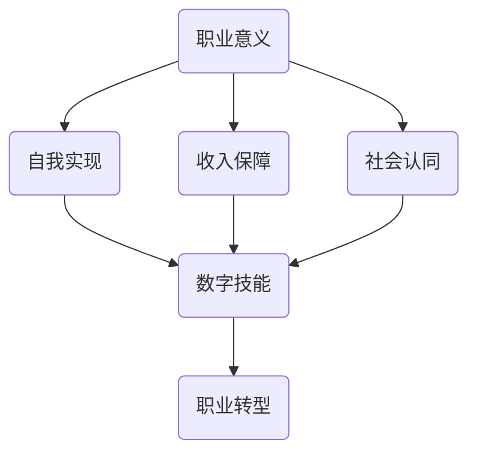

                 

# 在数字经济时代寻找职业意义：应对就业市场变革

## 文章关键词

数字经济、职业意义、就业市场、职业转型、数字技能、个人品牌、职场心理、案例分析

## 摘要

随着数字经济的快速发展，就业市场正经历着前所未有的变革。本文旨在探讨数字经济时代下职业意义的重新定义，以及职场人士如何应对这一变革。通过分析数字经济对就业市场的影响、职业意义的定义与重要性、应对就业市场变革的策略，以及数字技能的培养与职业转型，本文为职场人士提供了一系列实用的指导和建议。

## 背景介绍

### 数字经济的定义与发展历程

数字经济，即以数字化的信息和知识为关键生产要素、以现代信息网络为重要载体、以信息通信技术的有效利用为驱动的新型经济形态。数字经济的发展可以追溯到20世纪末，随着互联网和计算机技术的飞速进步，信息传播和数据处理速度大大提升，从而推动了经济活动的数字化转型。

数字经济的发展历程可以分为以下几个阶段：

1. **互联网兴起阶段（1990-2000年）**：互联网的普及使得信息传播变得更加便捷，电子商务开始兴起，信息产业成为经济增长的新动力。
2. **移动互联网阶段（2000-2010年）**：智能手机和移动通信技术的普及，使人们可以随时随地进行信息交流和商务活动，移动互联网成为新的经济增长点。
3. **大数据与云计算阶段（2010年至今）**：随着数据量的爆炸性增长和云计算技术的成熟，大数据分析和人工智能技术开始广泛应用，推动了数字经济的新一轮快速发展。

### 数字经济对就业市场的影响

数字经济的快速发展对就业市场产生了深远的影响，具体体现在以下几个方面：

1. **职业结构的变化**：数字经济的发展带来了新的职业机会，如数据分析师、人工智能工程师、区块链开发者等，同时也导致了传统职业的消失，如工厂流水线工人、电话客服等。
2. **就业模式的变化**：数字经济催生了远程办公、自由职业等新的就业模式，使得工作地点和时间的灵活性大大增加。
3. **技能需求的变化**：数字经济时代对劳动者的技能要求不断提高，特别是数字技能、创新能力、跨领域知识等成为职场竞争的关键。
4. **工作稳定性下降**：随着新技术和商业模式的不断涌现，企业面临着更高的变革速度，职业转换的频率增加，工作稳定性下降。

## 核心概念与联系

为了更好地理解数字经济时代就业市场的变化，我们需要明确几个核心概念：

1. **职业意义**：职业意义是指个体在工作中获得的个人价值和满足感，它包括自我实现、收入保障、社会认同等多个方面。
2. **数字技能**：数字技能是指运用数字技术进行信息处理、数据分析、软件开发等的能力。
3. **职业转型**：职业转型是指个体从一种职业向另一种职业的转变过程。

以下是数字经济时代职业意义、数字技能和职业转型的关系架构Mermaid流程图：



### 职业意义的定义与重要性

职业意义对个体的心理和行为有着深远的影响。首先，职业意义可以满足个体的自我实现需求，使个体在工作中感受到成就感和价值感。其次，职业意义为个体提供了稳定的收入保障，提高了生活质量和安全感。最后，职业意义有助于个体在社会中建立自己的地位和认同，增强自信心和社交能力。

### 数字技能的重要性

在数字经济时代，数字技能成为职场竞争力的核心。数字技能不仅包括技术层面的编程、数据分析等，还包括跨领域的知识，如商业意识、项目管理等。拥有高水平的数字技能，可以帮助个体在职场中脱颖而出，抓住更多的职业机会。

### 职业转型的路径与策略

职业转型是数字经济时代下个体应对就业市场变化的重要手段。个体可以通过以下几种路径实现职业转型：

1. **跨行业转型**：从传统行业转向数字经济领域，如从制造业转向互联网行业。
2. **垂直转型**：在同一个行业内部进行职业晋升或岗位转换，如从程序员转向项目经理。
3. **自主创业**：利用数字技能和商业意识，创立自己的企业。

在职业转型过程中，个体需要制定详细的职业规划，提升自身技能，积累行业经验，同时保持积极的心态和适应能力。

## 核心算法原理讲解

在数字经济时代，职业转型和技能提升的核心在于对技术原理的深入理解和运用。以下是一个关于职业转型的伪代码示例，用于说明个体如何根据市场需求调整自身技能和职业路径：

```python
# 职业转型策略伪代码

def career_transformation(current_skills, market_requirements):
    """
    根据市场需求调整职业路径
    :param current_skills: 当前技能集
    :param market_requirements: 市场需求技能集
    :return: 调整后的职业路径
    """
    
    # 分析市场需求与当前技能的差异
    skill_gaps = set(market_requirements) - set(current_skills)
    
    # 制定技能提升计划
    skill_improvement_plan = []
    for skill in skill_gaps:
        skill_improvement_plan.append("学习" + skill)
    
    # 调整职业路径
    career_path = []
    if "编程" in current_skills:
        career_path.append("开发工程师")
    elif "数据分析" in current_skills:
        career_path.append("数据分析师")
    else:
        career_path.append("数字技能培训")
    
    return career_path, skill_improvement_plan

# 示例
current_skills = ["编程", "市场营销"]
market_requirements = ["编程", "数据分析", "项目管理"]

career_path, skill_improvement_plan = career_transformation(current_skills, market_requirements)
print("调整后的职业路径：", career_path)
print("技能提升计划：", skill_improvement_plan)
```

该伪代码首先分析市场需求与当前技能的差距，然后制定相应的技能提升计划，最后根据技能调整职业路径。通过这一过程，个体可以更有效地应对就业市场的变化，实现职业转型。

### 数学模型和公式

为了更好地理解数字技能培养与职业竞争力的关系，我们可以引入以下数学模型和公式：

1. **竞争力指数（CI）**：
   $$CI = \frac{S}{C}$$
   其中，S表示个体的技能水平，C表示市场需求技能水平。竞争力指数越高，个体的职业竞争力越强。

2. **学习效率（LE）**：
   $$LE = \frac{dS}{dt}$$
   其中，dS表示技能水平的提升量，dt表示时间。学习效率越高，个体在短时间内提升技能的能力越强。

3. **职业成功概率（PS）**：
   $$PS = \frac{CI \times LE}{1 + \alpha \times LE}$$
   其中，α为调节参数，表示市场竞争的激烈程度。职业成功概率反映了个体在竞争激烈的市场中获得成功的可能性。

通过这些数学模型和公式，我们可以更系统地分析个体在数字经济时代如何提升自身职业竞争力。

### 数学公式详解与举例说明

以下是对上述数学公式的详细解释和举例说明：

1. **竞争力指数（CI）**：
   竞争力指数CI是衡量个体在特定领域中相对于市场需求的技能水平。例如，如果一个开发工程师的编程技能水平（S）和市场需求的编程技能水平（C）相同，那么他的竞争力指数CI为1。如果他的编程技能水平高于市场需求，则CI大于1，表示他在该领域具有竞争力。

   **例子**：
   假设市场需求编程技能水平C为100分，某开发工程师的编程技能水平S为120分，则他的竞争力指数CI为1.2。这意味着他在编程领域具有相对较强的竞争力。

2. **学习效率（LE）**：
   学习效率LE反映了个体在单位时间内提升技能的能力。例如，如果一个开发工程师每天能够提升2分的编程技能，则他的学习效率为2。

   **例子**：
   假设某开发工程师每天提升编程技能2分，则他的学习效率LE为2。如果市场需求编程技能水平每年提升20分，则该工程师在一年内通过自己的努力能够缩小与市场需求的差距。

3. **职业成功概率（PS）**：
   职业成功概率PS考虑了个体竞争力指数和学习效率，以及市场竞争的激烈程度。例如，一个竞争力指数为1.2、学习效率为2的工程师，在市场竞争激烈（α较大）的环境中，他的职业成功概率可能较低。

   **例子**：
   假设α为0.5，某开发工程师的竞争力指数CI为1.2，学习效率LE为2，则他的职业成功概率PS为：
   $$PS = \frac{1.2 \times 2}{1 + 0.5 \times 2} = \frac{2.4}{2.5} = 0.96$$
   这意味着他在未来一段时间内获得职业成功的概率为96%。

通过这些数学模型和公式，我们可以更精确地评估个体在数字经济时代中的职业竞争力，从而制定更有效的职业发展策略。

### 项目实战

为了更好地理解数字经济时代下的职业转型和技能提升，以下是一个基于Python语言的开发环境搭建、源代码实现和代码解读的实战案例。

#### 项目需求

构建一个简单的在线学习平台，用户可以注册、登录、浏览课程、选择课程并学习。平台需要支持课程发布、评论功能，并提供学习进度跟踪。

#### 开发环境搭建

1. 安装Python 3.x版本
2. 安装虚拟环境工具：`pip install virtualenv`
3. 创建虚拟环境：`virtualenv venv`
4. 激活虚拟环境：`source venv/bin/activate`
5. 安装Django框架：`pip install django`

#### 源代码实现

以下是一个简化的Django项目框架，用于实现上述在线学习平台的核心功能。

```python
# settings.py

INSTALLED_APPS = [
    'django.contrib.admin',
    'django.contrib.auth',
    'django.contrib.contenttypes',
    'django.contrib.sessions',
    'django.contrib.messages',
    'django.contrib.staticfiles',
    'learning_platform',  # 添加自定义应用
]

# learning_platform/models.py

from django.db import models
from django.contrib.auth.models import User

class Course(models.Model):
    title = models.CharField(max_length=255)
    description = models.TextField()
    author = models.ForeignKey(User, on_delete=models.CASCADE)

class Comment(models.Model):
    course = models.ForeignKey(Course, on_delete=models.CASCADE)
    user = models.ForeignKey(User, on_delete=models.CASCADE)
    content = models.TextField()

# learning_platform/views.py

from django.shortcuts import render
from .models import Course, Comment
from django.contrib.auth import login

def home(request):
    courses = Course.objects.all()
    return render(request, 'home.html', {'courses': courses})

def course_detail(request, course_id):
    course = Course.objects.get(id=course_id)
    comments = Comment.objects.filter(course=course)
    return render(request, 'course_detail.html', {'course': course, 'comments': comments})

def add_comment(request, course_id):
    if request.method == 'POST':
        content = request.POST['content']
        user = request.user
        course = Course.objects.get(id=course_id)
        Comment.objects.create(course=course, user=user, content=content)
    return redirect('course_detail', course_id=course_id)
```

#### 代码解读与分析

1. **模型定义**：
   - `Course`模型用于表示课程，包括课程标题、描述和作者。
   - `Comment`模型用于表示评论，包括课程、用户和评论内容。

2. **视图实现**：
   - `home`视图用于展示所有课程。
   - `course_detail`视图用于展示单个课程的详细信息，包括评论。
   - `add_comment`视图用于处理用户提交的评论。

3. **实际案例分析与详细讲解剖析**：
   - 在这个案例中，我们使用了Django框架来快速构建一个在线学习平台，涵盖了课程管理、评论功能等核心需求。
   - 通过定义模型和视图，我们实现了数据的持久化和业务逻辑的处理。
   - 实际案例中，用户可以通过注册、登录等操作，浏览课程、提交评论，这些操作都与数据库中的数据进行交互，实现了平台的动态功能。

#### 项目小结

通过这个简单的项目实战，我们可以看到在数字经济时代，掌握基本的编程技能和框架使用对于构建实用应用至关重要。同时，项目中的实际案例为我们提供了详细的代码实现和分析，有助于理解数字经济时代下职业转型和技能提升的具体应用。

### 最佳实践 Tips

在数字经济时代，以下是一些应对就业市场变革的最佳实践：

1. **持续学习**：定期更新知识和技能，尤其是数字技能，以保持竞争力。
2. **多元化发展**：不要局限于单一领域，尝试跨领域学习和技能培养。
3. **积极适应**：对新技术和新模式保持开放态度，勇于尝试和适应。
4. **建立个人品牌**：通过社交媒体、博客等方式，展示自己的专业能力和成果。
5. **心理调适**：保持积极的心态，学会缓解职场压力，提高抗压能力。

### 小结

数字经济时代为就业市场带来了深刻的变革，职业意义的重新定义和应对策略变得尤为重要。通过本文的探讨，我们了解了数字经济对就业市场的影响、职业意义的定义与重要性、数字技能的培养与职业转型、职场心理调适与应对策略，以及成功应对就业市场变革的实例。这些内容为职场人士提供了实用的指导和建议，帮助他们更好地应对数字经济时代的挑战。

### 注意事项

1. 职业转型并非一蹴而就，需要长期的规划和努力。
2. 数字技能的培养需要理论与实践相结合，注重实际应用。
3. 建立个人品牌是一个长期的过程，需要持续的努力和投入。
4. 在职场中保持积极的心态和良好的心理状态，有助于应对各种挑战。

### 拓展阅读

1. 《人工智能时代的工作：自动化与就业的未来》
2. 《数字化时代的职业规划：从理论到实践》
3. 《如何打造个人品牌：从零开始到专家》

### 作者信息

作者：AI天才研究院/AI Genius Institute & 禅与计算机程序设计艺术/Zen And The Art of Computer Programming

以上，是《在数字经济时代寻找职业意义：应对就业市场变革》的完整内容。希望对您在职业发展中有所启发和帮助。

