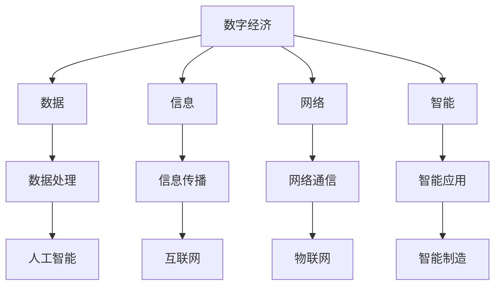
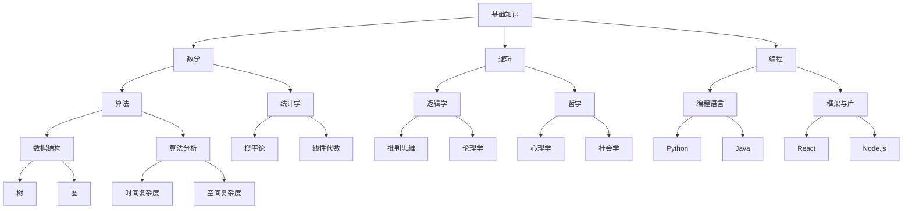

                 


# 在数字经济时代寻找职业意义：应对就业市场的变革

> 关键词：数字经济、职业意义、就业市场、技能升级、工作生活平衡、未来趋势

> 摘要：
本文将探讨在数字经济时代下，个人如何寻找职业意义并适应就业市场的变革。通过分析数字经济的核心概念、全球数字经济发展趋势、就业市场的变化、以及个人发展策略，我们旨在为读者提供一条清晰的职业发展路径，帮助他们在数字化转型的浪潮中找到自己的位置。

---

## 引言：数字经济的崛起

### 背景介绍

随着互联网、大数据、人工智能等技术的迅猛发展，全球经济正经历着深刻的数字化转型。传统行业逐步被数字化，新经济模式不断涌现，这给就业市场带来了巨大的变化。了解数字经济的核心概念和发展趋势，对于个人职业发展具有重要意义。

### 核心概念与联系

数字经济是指以数字化的信息和知识为关键生产要素、以现代信息网络为重要载体、以信息通信技术的有效利用为驱动的新型经济形态。其核心概念包括数据、信息、网络和智能。

#### Mermaid 流程图



### 全球数字经济发展趋势

#### 全球数字经济发展趋势

全球数字经济发展呈现出几个明显趋势：

1. **数字化程度的不断提高**：越来越多的国家和地区开始重视数字经济的发展，加大投资力度，推动数字化转型。
2. **新兴市场的崛起**：印度、中国等新兴市场国家在数字经济发展方面取得了显著成果，成为全球数字经济的重要推动力量。
3. **技术进步**：5G、云计算、人工智能等技术的快速发展，为数字经济提供了强有力的技术支撑。

#### 关键玩家

全球数字经济发展离不开关键玩家的推动。以下是一些在全球数字经济发展中具有重要影响力的公司和国家：

1. **美国**：以苹果、谷歌、亚马逊等科技巨头为代表的美国，在数字经济发展方面处于领先地位。
2. **中国**：阿里巴巴、腾讯、百度等中国科技企业，在电子商务、移动支付、云计算等领域取得了全球领先的地位。
3. **欧盟**：欧盟通过《数字单一市场战略》等政策，积极推动数字经济发展，提高全球竞争力。

### 对传统行业的影响

数字经济对传统行业产生了深远影响，主要体现在以下几个方面：

1. **生产方式**：数字化技术改变了传统行业的产品设计、生产、供应链管理方式，提高了生产效率。
2. **商业模式**：传统行业纷纷向线上转型，通过电子商务、移动支付等手段拓展市场。
3. **就业结构**：数字经济创造了大量新岗位，同时也淘汰了一些传统岗位，对就业结构产生了重大影响。

---

## 第二部分：理解就业市场的变化

### 历史与现状

#### 历史视角

就业市场的历史变化可以从工业革命时期开始追溯。工业革命带来了机械化生产，改变了劳动力的需求结构。随着信息技术的兴起，就业市场再次发生了重大变革。互联网的普及和电子商务的兴起，使得远程工作和自由职业成为可能。

#### 当前状态

当前的就业市场呈现出以下特点：

1. **全球化**：跨国公司和国际人才的流动加剧，就业市场日益全球化。
2. **技术驱动**：新技术的发展改变了就业市场的需求，对技能和知识提出了更高的要求。
3. **就业多元化**：自由职业、远程工作、兼职工作等多元化就业形式逐渐成为主流。

### 未来趋势

#### 技术进步

随着5G、人工智能、区块链等技术的发展，未来就业市场将呈现以下趋势：

1. **自动化与智能化**：自动化技术将取代一些重复性、低技能的工作，智能技术将提高工作效率和质量。
2. **数字化技能需求**：数据分析、人工智能、云计算等数字技能将成为求职者的核心竞争力。

#### 经济因素

经济因素也是影响就业市场变化的重要因素。以下是一些经济因素：

1. **经济增长**：经济繁荣时期，就业市场通常较为稳定，求职机会增多。
2. **通货膨胀**：通货膨胀可能导致成本上升，影响企业招聘意愿。
3. **货币政策**：货币政策的变化可能影响就业市场的流动性和稳定性。

#### 人口结构

人口结构的变化也对就业市场产生了深远影响。以下是一些人口结构因素：

1. **老龄化**：人口老龄化导致劳动力供给减少，可能引发劳动力市场的紧张。
2. **生育率下降**：生育率下降可能导致未来劳动力市场的供给不足。
3. **教育水平**：教育水平的提高有助于提升劳动力的技能水平，但同时也增加了求职的竞争压力。

---

## 第三部分：职业发展策略

### 技能升级

在数字经济时代，技能升级是职业发展的关键。以下是一些关键技能：

1. **数字技能**：包括编程、数据分析、人工智能等。
2. **软技能**：包括沟通、团队合作、解决问题的能力。
3. **跨学科知识**：结合多个领域的知识，形成独特的竞争优势。

### 知识体系构建

#### 知识体系架构

一个完整的知识体系应包括以下层次：

1. **基础知识**：包括数学、逻辑、编程等基础技能。
2. **专业领域知识**：包括所在行业的专业知识。
3. **前沿知识**：包括人工智能、区块链等新兴技术。

#### Mermaid 流程图



### 自我评估与定位

#### 自我评估

自我评估是职业发展的第一步。以下是一些自我评估的方面：

1. **技能与兴趣**：分析自己在哪些领域具有优势，哪些领域是自己感兴趣的。
2. **职业目标**：明确自己的职业目标，包括短期和长期目标。
3. **优势和劣势**：分析自己在职业发展中的优势和劣势，制定相应的策略。

### 职业规划

#### 职业规划步骤

1. **设定目标**：明确自己的职业目标，包括职位、行业等。
2. **制定计划**：根据目标，制定具体的学习和发展计划。
3. **执行与调整**：执行计划，并根据实际情况进行调整。

---

## 第四部分：技能与知识获取

### 学习资源

#### 网络学习平台

网络学习平台是获取知识和技能的重要途径。以下是一些知名的网络学习平台：

1. **Coursera**：提供全球知名大学的在线课程。
2. **Udemy**：提供各类技能培训课程。
3. **edX**：由哈佛大学和麻省理工学院共同创建，提供高质量的在线课程。

#### 书籍与教材

以下是一些在数字经济时代非常重要的书籍和教材：

1. **《Python编程：从入门到实践》**：适合初学者了解Python编程。
2. **《人工智能：一种现代方法》**：全面介绍人工智能的基本概念和方法。
3. **《深入理解计算机系统》**：深入解析计算机系统的原理和机制。

### 实践与项目

#### 实践项目

通过实践项目，可以将理论知识应用到实际工作中。以下是一些实践项目：

1. **数据可视化项目**：使用Python或R等工具进行数据可视化。
2. **机器学习项目**：使用TensorFlow或PyTorch等框架实现机器学习算法。
3. **区块链项目**：使用Solidity等语言编写智能合约。

#### 项目实战

以下是一个简单的数据可视化项目实战：

### 开发环境搭建

1. **安装Python**：在官网下载并安装Python。
2. **安装Jupyter Notebook**：通过pip命令安装Jupyter Notebook。

### 源代码实现

```python
import pandas as pd
import matplotlib.pyplot as plt

# 加载数据
data = pd.read_csv('data.csv')

# 绘制柱状图
plt.bar(data['Category'], data['Count'])
plt.xlabel('Category')
plt.ylabel('Count')
plt.title('Category Distribution')
plt.show()
```

### 代码解读与分析

- `pandas` 和 `matplotlib` 是Python的数据处理和可视化库。
- `read_csv` 方法用于加载数据。
- `bar` 方法用于绘制柱状图。

#### 实际案例分析

以下是一个使用机器学习的实际案例分析：

### 项目小结

通过这个项目，我们学会了如何使用Python进行数据可视化和机器学习。这对于我们在实际工作中应用这些技术非常有帮助。

---

## 第五部分：个人品牌建设与网络拓展

### 个人品牌建设

#### 个人品牌定位

个人品牌建设的第一步是明确自己的品牌定位。以下是一些定位策略：

1. **专业技能**：突出自己在某一领域的专业技能。
2. **独特性**：展示自己的独特性，如个人经历、兴趣爱好等。
3. **价值主张**：明确自己的价值主张，即为什么别人应该选择你。

#### 个人品牌传播

个人品牌传播的关键在于建立个人网络和发布高质量内容。以下是一些传播策略：

1. **社交媒体**：利用LinkedIn、Twitter、Facebook等社交媒体平台。
2. **博客与文章**：定期发布高质量的技术文章和博客。
3. **演讲与会议**：参加行业会议和演讲，展示自己的专业能力。

### 网络拓展

#### 网络资源

以下是一些有助于网络拓展的资源：

1. **职业社交平台**：如LinkedIn。
2. **专业社区**：如GitHub、Stack Overflow。
3. **在线课程与培训**：如Coursera、Udemy。

#### 网络拓展策略

1. **积极参与**：在社区中积极参与讨论和贡献。
2. **建立联系**：与行业内的专家和同行建立联系。
3. **分享知识**：分享自己的知识和经验，提升个人影响力。

---

## 第六部分：数字时代的工作生活平衡

### 工作方式

#### 远程工作

随着远程工作的普及，掌握远程工作技巧变得尤为重要。以下是一些建议：

1. **制定工作计划**：明确每天的工作任务和目标。
2. **保持沟通**：定期与团队成员进行沟通，确保工作进展。
3. **避免干扰**：创造一个有利于工作的环境，减少干扰。

#### 弹性工作制

弹性工作制可以帮助员工更好地平衡工作与生活。以下是一些实施策略：

1. **灵活工作时间**：允许员工根据个人需求调整工作时间。
2. **远程办公**：提供远程办公设备和技术支持。
3. **弹性休假政策**：允许员工根据需要调整休假时间。

### 生活质量

#### 健康管理

在数字时代，健康管理变得尤为重要。以下是一些健康管理的建议：

1. **定期锻炼**：保持规律的锻炼习惯，增强身体素质。
2. **饮食健康**：注意饮食健康，减少油腻和高热量食物的摄入。
3. **心理健康**：学会应对工作压力，保持积极的心态。

#### 社交与家庭

在数字时代，保持社交和家庭关系同样重要。以下是一些建议：

1. **社交活动**：参加线下和线上的社交活动，扩大人际交往。
2. **家庭时间**：合理安排家庭时间，与家人共度美好时光。
3. **情感支持**：与家人和朋友保持情感沟通，寻求情感支持。

---

## 第七部分：未来趋势与机遇

### 技术进步

#### 人工智能

人工智能是未来科技发展的核心。以下是一些人工智能的应用场景：

1. **自动化**：自动化技术将替代部分重复性工作，提高生产效率。
2. **智能决策**：人工智能可以帮助企业做出更智能的决策。
3. **个性化服务**：人工智能可以实现个性化的产品和服务。

#### 区块链

区块链技术在未来将有广泛应用。以下是一些区块链的应用场景：

1. **金融**：区块链可以用于金融交易，提高交易效率和安全性。
2. **供应链管理**：区块链可以用于供应链管理，提高透明度和效率。
3. **数字身份**：区块链可以用于建立数字身份，提高隐私保护。

### 新兴行业

#### 绿色能源

随着环保意识的提高，绿色能源将成为未来重要的发展方向。以下是一些绿色能源的应用场景：

1. **可再生能源**：太阳能、风能等可再生能源将成为主要能源来源。
2. **电动汽车**：电动汽车将成为未来主要的交通工具。
3. **智能电网**：智能电网可以提高能源利用效率，减少能源浪费。

#### 生物科技

生物科技将在医疗、农业等领域发挥重要作用。以下是一些生物科技的应用场景：

1. **基因编辑**：基因编辑可以用于治疗遗传疾病，提高人类健康水平。
2. **精准医疗**：精准医疗可以根据患者的基因信息制定个性化的治疗方案。
3. **农业生物技术**：农业生物技术可以用于提高农作物的产量和质量。

---

## 结论

在数字经济时代，职业意义和就业市场的变革给个人带来了前所未有的挑战和机遇。通过理解数字经济的核心概念、全球数字经济发展趋势、就业市场的变化，以及制定有效的职业发展策略，个人可以更好地适应数字经济时代的要求，找到自己的职业意义。同时，保持工作生活平衡，关注未来趋势和机遇，将有助于个人在数字化转型的浪潮中脱颖而出。

### 作者信息

作者：AI天才研究院/AI Genius Institute & 禅与计算机程序设计艺术 /Zen And The Art of Computer Programming

---

### 拓展阅读

1. 《数字化时代的工作与生活平衡》
2. 《人工智能：未来生活的改变》
3. 《区块链：改变未来的技术》
4. 《绿色能源：可持续发展的关键》
5. 《生物科技：未来医疗的突破》

---

[文章标题]

在数字经济时代寻找职业意义：应对就业市场的变革

---

[关键词]

数字经济、职业意义、就业市场、技能升级、工作生活平衡、未来趋势

---

[摘要]

本文探讨了在数字经济时代，个人如何寻找职业意义并适应就业市场的变革。通过分析数字经济的核心概念、全球数字经济发展趋势、就业市场的变化，以及个人发展策略，我们为读者提供了清晰的职业发展路径。文章还讨论了工作生活平衡和未来趋势，帮助读者在数字化转型的浪潮中找到自己的位置。

