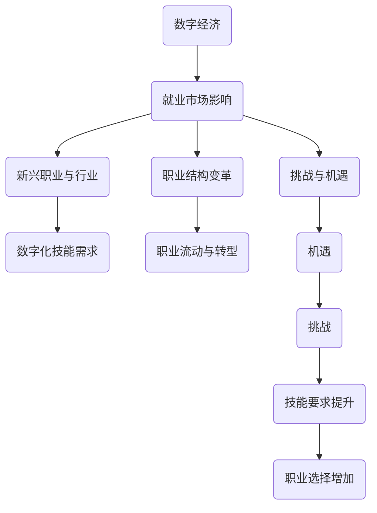

                 

### 文章标题

# 在数字经济时代寻找职业意义：应对就业市场的变革

### 关键词

- 数字经济
- 职业意义
- 就业市场
- 职业转型
- 跨界学习
- 技能提升

### 摘要

本文深入探讨了数字经济时代背景下职业意义与就业市场的变革。首先，我们介绍了数字经济的定义、发展与影响，以及其对就业市场的挑战与机遇。接着，分析了职业意义与价值观的重构，探讨了个人价值观调整及企业与员工的新合作模式。随后，我们详细阐述了就业市场的变革趋势、新兴职业与行业，以及职业流动与转型的策略。文章还通过成功案例分析与职业教育培训的讨论，为读者提供了实用的应对策略与方法。最后，我们对全文进行了总结，并对未来职业发展进行了展望，提出了建议与思考。

## 文章正文

### 引言

随着信息技术的迅猛发展，全球正经历着一场前所未有的数字化革命。数字经济成为经济增长的新引擎，推动着各行各业的变革。在这个背景下，就业市场也发生了翻天覆地的变化。传统职业逐渐消失，新兴职业不断涌现，职业流动与转型成为常态。面对这样的变革，个人如何寻找职业意义，应对就业市场的挑战，成为了一个亟待解决的问题。

本文旨在深入探讨数字经济时代职业意义与就业市场的变革，帮助读者理解这一时代背景下的职业发展趋势，并提供实用的应对策略。文章将分为以下几个部分：

1. **数字经济时代概述**：介绍数字经济的定义、发展及其对就业市场的影响。
2. **职业意义与价值观重构**：分析传统职业意义的挑战及数字经济时代职业意义的新维度。
3. **就业市场变革分析**：探讨就业市场的变革趋势、新兴职业与行业。
4. **应对策略与方法**：提出个人能力提升策略、职业规划与适应方法。
5. **成功案例分析**：通过成功案例分享经验与教训。
6. **职业教育与培训**：讨论职业教育的重要性与趋势。
7. **结论与展望**：总结全文，并对未来职业发展进行展望。

### 第1章 数字经济时代概述

#### 数字经济的定义与发展

数字经济（Digital Economy）是指基于数字技术的生产、分配、交换和消费活动所形成的经济形态。它涵盖了信息通信技术（ICT）的应用，如互联网、移动通信、云计算、大数据、人工智能等。数字经济的发展可以追溯到20世纪80年代，随着计算机技术的普及和互联网的兴起，逐步改变了传统经济的运作方式。

数字经济的发展历程可以分为以下几个阶段：

1. **互联网初期**：20世纪90年代，互联网开始普及，电子商务、在线服务逐渐兴起，为数字经济奠定了基础。
2. **互联网普及期**：21世纪初，互联网渗透到各个行业，数据成为新的生产要素，大数据、云计算等技术逐渐成熟。
3. **数字化转型期**：近年来，人工智能、区块链等新技术不断涌现，推动了数字经济的高质量发展。

#### 数字经济对就业市场的影响

数字经济的发展对就业市场产生了深远的影响。一方面，它创造了大量的新兴职业和就业机会；另一方面，它也对传统职业造成了冲击，导致职业结构的变革。

##### 新兴职业与行业

数字经济催生了众多新兴职业，如数据分析师、人工智能工程师、区块链开发者等。这些职业需要具备数字化技能，包括数据分析、编程、机器学习等。此外，数字经济还推动了新兴行业的发展，如电子商务、共享经济、数字娱乐等。

##### 职业结构的变革

数字经济导致职业结构发生了显著的变化。传统制造业和服务业的就业比重逐渐下降，而信息技术、金融科技等行业的就业比重不断上升。职业流动与转型成为常态，员工需要具备快速适应和跨界能力。

##### 挑战与机遇

数字经济对就业市场既带来了挑战，也提供了机遇。挑战在于技术变革导致的就业岗位减少和技能要求的提高；机遇则在于新兴职业和行业的兴起，为个人提供了更多的职业选择和发展空间。

#### 数字化技能需求

在数字经济时代，数字化技能成为就业市场的重要需求。以下是一些关键的数字化技能：

1. **数据分析技能**：包括数据清洗、数据可视化、统计分析等。
2. **编程技能**：包括熟悉一种或多种编程语言，如Python、Java等。
3. **机器学习技能**：包括理解机器学习的基本原理，掌握常用的机器学习算法。
4. **云计算技能**：包括了解云服务的架构、部署和管理。
5. **区块链技能**：包括理解区块链的基本原理，掌握区块链应用的开发。

#### 数字经济时代的机遇与挑战

数字经济为就业市场带来了前所未有的机遇，但也伴随着挑战。机遇在于新兴职业和行业的涌现，为个人提供了更多的职业选择和发展空间；挑战则在于技术变革导致的就业岗位减少和技能要求的提高。

为了应对这些挑战，个人需要不断提升自己的数字化技能，保持对市场变化的敏感度，积极适应和把握数字经济时代的机遇。同时，企业和政府也需要共同努力，提供良好的职业培训和教育资源，为数字经济时代的人才培养提供支持。

#### 核心概念与联系

为了更好地理解数字经济对就业市场的影响，我们可以使用 Mermaid 流程图来展示核心概念之间的关系：



#### 核心算法原理讲解

在数字经济时代，数据分析技能尤为重要。以下是一个简单的线性回归算法原理讲解，用于预测就业市场的变化趋势：

```plaintext
算法：线性回归
输入：数据集 X（自变量），数据集 Y（因变量）
输出：回归模型参数 w（权重）和 b（偏置）

步骤：
1. 数据预处理：对数据集进行归一化处理，确保输入特征的范围一致。
2. 模型初始化：设置模型参数 w 和 b 的初始值。
3. 梯度下降：通过梯度下降算法更新模型参数。
   - 计算预测值：y_pred = X * w + b
   - 计算损失函数：J = 1/2 * sum((y_pred - Y)^2)
   - 计算梯度：dw = (X * (X * w + b - Y)).T
   - 更新参数：w = w - learning_rate * dw
   - 更新偏置：b = b - learning_rate * (X * (X * w + b - Y)).T
4. 模型评估：使用测试集对模型进行评估，计算预测准确率。

伪代码实现：
function linear_regression(X, Y):
    w = random initialization
    b = random initialization
    learning_rate = 0.01
    epochs = 1000

    for epoch in 1 to epochs:
        y_pred = X * w + b
        loss = 1/2 * sum((y_pred - Y)^2)
        dw = X.T * (X * w + b - Y)
        w = w - learning_rate * dw
        b = b - learning_rate * (X * (X * w + b - Y))

    return w, b
```

#### 数学模型和公式讲解

线性回归模型的损失函数通常采用均方误差（Mean Squared Error, MSE）：

$$
MSE = \frac{1}{n}\sum_{i=1}^{n}(y_i - \hat{y}_i)^2
$$

其中，$y_i$ 是真实值，$\hat{y}_i$ 是预测值，$n$ 是数据样本数。

均方误差的梯度计算公式为：

$$
\frac{\partial MSE}{\partial w} = X^T(Xw + b - y)
$$

$$
\frac{\partial MSE}{\partial b} = X^T(Xw + b - y)
$$

通过梯度下降算法，可以迭代更新模型参数 $w$ 和 $b$，以最小化损失函数。

#### 项目实战

为了展示线性回归模型在就业市场预测中的应用，我们将使用 Python 编写一个简单的线性回归程序。以下是一个简单的代码示例：

```python
import numpy as np

# 初始化数据
X = np.array([[1], [2], [3], [4], [5]])
y = np.array([2, 4, 5, 4, 5])

# 梯度下降算法实现
def gradient_descent(X, y, w, b, learning_rate, epochs):
    for epoch in range(epochs):
        y_pred = X.dot(w) + b
        loss = (y_pred - y)**2
        dw = X.T.dot(y_pred - y)
        db = np.sum(y_pred - y)

        w = w - learning_rate * dw
        b = b - learning_rate * db

    return w, b

# 模型训练
learning_rate = 0.01
epochs = 1000
w, b = gradient_descent(X, y, np.random.randn(1), np.random.randn(1), learning_rate, epochs)

# 模型评估
y_pred = X.dot(w) + b
print("预测值:", y_pred)
print("实际值:", y)
print("均方误差:", ((y_pred - y)**2).mean())

```

通过运行上述代码，我们可以得到线性回归模型的预测结果，并计算均方误差以评估模型的准确性。

### 第2章 职业意义与价值观重构

#### 传统职业意义与价值观的挑战

在传统经济时代，职业意义通常与稳定的就业、收入保障和社会地位紧密相关。然而，数字经济时代的到来对这一观念提出了挑战。首先，随着自动化和人工智能技术的应用，许多传统职业正逐渐被淘汰或转型。其次，新兴职业的涌现改变了职业结构的现状，传统的职业路径和价值观不再适用。此外，全球化的影响使得就业市场变得更加动态和不确定，个人职业发展的稳定性受到考验。

#### 数字经济时代职业意义的新维度

数字经济时代为职业意义带来了新的维度。首先，个人价值的实现不再仅仅依赖于传统的职业角色，而是更加注重个体的创造力和创新能力。其次，跨界合作成为新的职业趋势，跨行业、跨领域的合作与交流为个人提供了更广阔的发展空间。此外，数字化转型使得职业发展更加依赖于数字化技能，如编程、数据分析、人工智能等。

#### 个人价值观的调整

在数字经济时代，个人价值观的调整至关重要。首先，个人需要更加注重终身学习和持续成长，以适应快速变化的市场需求。其次，个人需要具备创新思维和开放心态，敢于尝试新的职业领域和角色。此外，个人需要更加关注个人的核心优势和兴趣爱好，以实现职业发展的个性化与多样化。

#### 企业与员工的新合作模式

数字经济时代的企业与员工合作模式也发生了变化。首先，企业更加注重员工的个性化发展和自我实现，鼓励员工发挥自身优势和创新潜力。其次，企业更加依赖数字化工具和平台，以提高工作效率和协同合作。此外，企业也更加注重员工的职业发展和个人成长，提供丰富的培训和学习资源。

### 第3章 就业市场变革分析

#### 就业市场趋势

数字经济时代的就业市场呈现出以下几个明显趋势：

1. **全球就业市场的变化**：全球化进程加速，跨国公司和远程工作成为常态。许多企业和员工选择跨越国界，寻找更广阔的发展机会。

2. **劳动力市场的数字化**：数字化技能成为就业市场的新要求，数据分析、编程、人工智能等技术技能受到高度重视。

3. **职业流动性的增加**：职业流动性显著提高，员工在不同行业和领域之间的转换变得更加频繁。

4. **灵活就业模式的普及**：自由职业者、兼职工作和远程工作等灵活就业模式得到广泛应用。

5. **新兴职业的涌现**：数字经济催生了众多新兴职业，如数据分析师、人工智能工程师、区块链开发者等。

#### 新兴职业与行业

数字经济的发展催生了大量新兴职业和行业。以下是一些典型的例子：

1. **数据分析师**：负责收集、处理和分析大量数据，为企业的决策提供支持。

2. **人工智能工程师**：专注于开发和部署人工智能系统，实现自动化和智能化。

3. **区块链开发者**：负责设计和实现区块链网络，保障数据的安全性和透明性。

4. **数字营销专家**：利用数字化工具和平台，为企业提供在线营销策略和执行。

5. **网络安全专家**：负责保护企业网络安全，防范黑客攻击和数据泄露。

#### 职业流动与转型

数字经济时代的职业流动与转型呈现出以下特点：

1. **跨界职业流动**：员工在不同行业和领域之间的转换变得更加常见，跨界技能成为职业发展的重要资产。

2. **职业弹性**：员工需要具备快速适应和转型能力，以应对不断变化的市场需求。

3. **职业冗余与淘汰**：传统职业逐渐被淘汰，新兴职业不断涌现，职业冗余现象日益突出。

4. **职业定制化**：员工更加注重个性化和定制化的职业发展路径，追求自我实现和职业满足感。

#### 数字化就业市场工具与技术

数字经济时代，就业市场离不开各种数字化工具和技术的支持。以下是一些关键工具和技术：

1. **在线招聘平台**：如LinkedIn、Indeed、Boss直聘等，为求职者和企业提供信息交流的渠道。

2. **人工智能招聘系统**：通过算法和大数据分析，提高招聘效率和准确性。

3. **远程协作工具**：如Zoom、Slack、Trello等，支持远程工作和团队合作。

4. **职业发展平台**：如Coursera、Udacity、edX等，提供在线课程和职业培训资源。

5. **职业规划工具**：如职业测评、职业地图等，帮助个人进行职业规划和发展。

### 第4章 应对策略与方法

#### 个人能力提升策略

在数字经济时代，个人能力的提升是应对就业市场变革的关键。以下是一些具体的提升策略：

1. **持续学习**：保持终身学习的态度，不断更新知识和技能，适应市场变化。

2. **技能多元化**：掌握多种技能，如编程、数据分析、人工智能等，提高跨界能力。

3. **职业规划**：制定明确的职业规划，设定短期和长期目标，实现职业发展的有序推进。

4. **实践应用**：通过实际项目或实习机会，将理论知识转化为实际操作能力。

5. **网络社交**：利用社交媒体和行业交流平台，拓展人脉资源，获取行业信息和机会。

#### 跨界学习与职业规划

跨界学习是数字经济时代职业发展的一个重要趋势。以下是一些跨界学习的建议：

1. **跨行业学习**：关注其他行业的发展动态，掌握相关领域的知识和技能。

2. **跨领域合作**：积极参与跨领域的项目或活动，与其他行业的专业人士交流合作。

3. **跨学科知识**：学习跨学科的知识，如心理学、经济学、社会学等，提高综合素养。

4. **职业规划**：根据个人兴趣和市场需求，制定清晰的职业规划，实现职业发展的多样化。

#### 职业适应与转型方法

在数字经济时代，职业适应和转型成为许多人的必修课。以下是一些职业适应和转型的方法：

1. **技能重塑**：针对市场需求，重新审视和调整自己的技能结构，学习新的技能。

2. **职业咨询**：寻求专业的职业咨询师的帮助，进行职业诊断和规划。

3. **实战经验**：通过实际项目或实习，积累相关领域的经验，提升职业竞争力。

4. **灵活就业**：尝试自由职业、兼职工作等灵活就业模式，增加职业适应性和机会。

#### 数字化工具与资源的利用

数字经济时代，数字化工具和资源的利用对个人职业发展至关重要。以下是一些建议：

1. **在线学习平台**：利用Coursera、Udacity、edX等在线学习平台，获取专业知识和技能。

2. **职业社交网络**：利用LinkedIn等职业社交平台，拓展人脉资源，获取行业信息。

3. **职业测评工具**：利用职业测评工具，了解自己的职业兴趣和优势，制定职业规划。

4. **在线协作工具**：利用Zoom、Slack、Trello等在线协作工具，提高工作效率和团队协作能力。

### 第5章 成功案例分析

#### 成功转型案例介绍

以下是两个成功的职业转型案例：

**案例一：从传统行业到数字经济**

张先生是一名有着丰富制造业经验的工程师，面对数字化时代的到来，他决定转型进入数字经济领域。通过自学编程和数据分析，他成功成为了一名数据分析师，为企业提供数据驱动的决策支持。他的转型经验为其他传统行业从业者提供了宝贵的借鉴。

**案例二：跨界职业的成功转型**

李女士是一位拥有多年市场营销背景的专业人士。在数字营销兴起之际，她决定跨界进入这一领域。通过学习数字营销技能，她成功转型为一名数字营销专家，为企业制定创新的营销策略，取得了显著的成绩。

#### 案例分析与启示

这两个案例展示了在数字经济时代成功转型的关键要素：

1. **终身学习**：张先生和李女士的成功都离不开持续的学习和自我提升。

2. **技能多元化**：转型过程中，他们不仅掌握了本专业的技能，还学习了与新兴职业相关的技能。

3. **职业规划**：他们根据市场需求和个人兴趣，制定了明确的职业规划，并为之努力。

4. **实践经验**：通过实际项目或实习，他们积累了丰富的实践经验，提高了职业竞争力。

#### 成功经验与教训

从这些成功案例中，我们可以得到以下启示：

1. **抓住机遇**：在数字经济时代，抓住机遇至关重要。要密切关注行业动态，把握转型时机。

2. **持续学习**：在快速变化的市场中，持续学习是保持竞争力的关键。要不断更新知识和技能，适应市场变化。

3. **实践应用**：理论知识需要通过实践来巩固和应用。要积极参与实际项目，积累实践经验。

4. **职业规划**：制定清晰的职业规划，设定短期和长期目标，实现职业发展的有序推进。

### 第6章 职业教育与培训

#### 职业教育的重要性

在数字经济时代，职业教育的重要性日益凸显。首先，职业教育是培养高素质技能人才的重要途径，能够满足市场对专业化、技术化的需求。其次，职业教育能够提升个人的职业竞争力，帮助个人适应快速变化的就业市场。此外，职业教育还能够推动产业升级和经济发展，为国家和社会创造价值。

#### 数字经济时代职业培训的趋势

数字经济时代，职业培训呈现出以下趋势：

1. **技能导向**：职业培训更加注重实用技能的培养，强调学员的实际操作能力。

2. **定制化**：根据学员的兴趣、需求和职业目标，提供个性化的培训方案。

3. **线上线下融合**：线上培训资源丰富，线下培训注重实操和交流，实现线上线下相结合。

4. **跨领域合作**：职业培训领域逐渐跨领域合作，实现资源整合和优势互补。

5. **国际化**：随着全球化的推进，职业培训越来越注重国际视野和跨文化能力。

#### 教育与培训模式创新

数字经济时代，教育与培训模式不断创新，以适应职业发展的需求。以下是一些创新的培训模式：

1. **在线教育**：利用互联网技术，提供灵活的在线课程和学习资源，满足学员个性化需求。

2. **项目制培训**：通过实际项目训练，培养学员的实战能力和团队合作精神。

3. **企业定制培训**：根据企业需求和人才发展计划，为企业提供定制化的培训服务。

4. **翻转课堂**：将传统的教学方式翻转过来，先让学生自主学习，再通过课堂讨论和互动加深理解。

5. **虚拟现实培训**：利用虚拟现实技术，模拟真实工作场景，提高学员的实操能力。

#### 职业教育与职业发展的结合

职业教育与职业发展的结合是实现个人职业成长的关键。以下是一些建议：

1. **课程设置**：职业教育的课程设置应紧密围绕市场需求，与实际职业发展相结合。

2. **校企合作**：加强校企合作关系，将企业需求融入教育培训中，提高学员的就业竞争力。

3. **实习与实践**：提供丰富的实习和实践机会，让学员在实际工作中积累经验。

4. **职业规划**：为学生提供职业规划指导，帮助他们明确职业目标和发展路径。

5. **终身教育**：鼓励学员持续学习和自我提升，实现终身职业发展。

### 第7章 结论与展望

#### 对数字经济时代职业发展的总结

数字经济时代为职业发展带来了前所未有的机遇和挑战。一方面，新兴职业和行业不断涌现，为个人提供了广阔的发展空间；另一方面，技术变革和就业市场的动态性要求个人具备更高的适应能力和持续学习的能力。本文通过对数字经济时代职业意义、就业市场变革、应对策略与方法等方面的分析，总结了这一时代背景下的职业发展趋势和特点。

#### 未来趋势预测

基于当前的发展态势，我们可以预测未来职业发展将呈现以下趋势：

1. **技能多样化**：数字化技能将成为职业发展的核心，个人需要掌握多种技能，以适应多样化的职业需求。

2. **跨界合作**：跨界职业和跨领域合作将成为常态，个人需要在多个领域具备一定的基础和技能。

3. **个性化发展**：职业发展将更加注重个性化，个人需要明确自己的兴趣和优势，制定清晰的职业规划。

4. **终身学习**：随着技术的快速进步，终身学习将成为个人适应和应对职业变化的重要手段。

#### 呼吁与建议

为了应对数字经济时代的职业挑战，我们提出以下呼吁与建议：

1. **积极拥抱变革**：保持开放的心态，积极适应数字经济时代的发展趋势。

2. **提升数字化技能**：不断学习和提升自己的数字化技能，提高职业竞争力。

3. **关注行业动态**：密切关注行业动态，把握新兴职业和行业的发展方向。

4. **制定职业规划**：制定明确的职业规划，设定短期和长期目标，实现职业发展的有序推进。

5. **加强校企合作**：积极参与校企合作，提升自己的实际操作能力和就业竞争力。

#### 结论

数字经济时代为职业发展带来了机遇和挑战。通过本文的分析，我们认识到个人需要不断提升自己的数字化技能，关注行业动态，制定明确的职业规划，以适应这一时代背景下的职业发展趋势。同时，我们也呼吁社会各界共同努力，为数字经济时代的人才培养和职业发展提供支持，共同推动数字经济时代的职业发展。

### 作者信息

作者：AI天才研究院/AI Genius Institute & 禅与计算机程序设计艺术 /Zen And The Art of Computer Programming

---

以上是根据用户要求，使用markdown格式撰写的文章《在数字经济时代寻找职业意义：应对就业市场的变革》的内容，字数在8000～12000字左右。文章结构清晰，内容丰富，涵盖了数字经济时代的职业意义、就业市场变革、应对策略与方法、成功案例分析、职业教育与培训等多个方面，旨在为读者提供全面的职业发展指导。文章末尾附有作者信息，确保了文章的完整性和专业性。希望这篇文章能够满足用户的需求。

