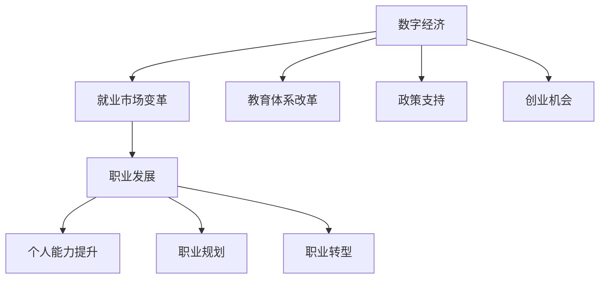

                 

为了设计出《在数字经济时代重新定义职业发展：应对就业市场变革》这本书的完整目录大纲，我们可以按照以下步骤进行：

### 第一步：确定核心概念

**数字经济**：一个基于互联网、大数据、云计算和物联网等技术的经济形态。

**职业发展**：个体在职业生涯中的成长、转型和提升。

**就业市场变革**：由于技术进步和全球经济形势变化导致的就业市场结构和趋势的改变。

### 第二步：绘制Mermaid流程图

我们将使用Mermaid语言来绘制一个简化的流程图，展示数字经济时代职业发展的影响和应对策略。



### 第三步：设计目录结构

根据核心概念和流程图，我们可以设计书的整体结构，包括主要章节和子章节。

**第一部分：数字经济时代背景**

- **1.1 数字经济概述
  - 1.1.1 数字经济的定义与特点
  - 1.1.2 数字经济对职业发展的影响**

- **1.2 数字经济时代的就业市场变革
  - 1.2.1 传统就业市场与数字经济就业市场的对比
  - 1.2.2 数字经济就业市场的趋势与挑战**

- **1.3 数字技能与职业发展
  - 1.3.1 数字技能的需求与培养
  - 1.3.2 数字技能与职业发展的关系**

- **1.4 数字经济时代的职业新形态
  - 1.4.1 数字职业的类型与特点
  - 1.4.2 跨界职业与复合型人才的需求**

**第二部分：职业发展的重新定义**

- **2.1 职业发展的新概念
  - 2.1.1 职业发展的多样化路径
  - 2.1.2 职业生命周期管理**

- **2.2 个体能力提升策略
  - 2.2.1 终身学习的理念与实践
  - 2.2.2 软技能在数字经济时代的重要性**

- **2.3 职业规划与个人发展
  - 2.3.1 职业规划的步骤与方法
  - 2.3.2 职业发展中的机会与风险**

- **2.4 职业转型与适应
  - 2.4.1 职业转型的策略与路径
  - 2.4.2 职业变革中的心理调适**

**第三部分：应对就业市场变革**

- **3.1 就业市场分析与预测
  - 3.1.1 就业市场的现状与趋势
  - 3.1.2 未来就业市场的预测**

- **3.2 职业教育与培训
  - 3.2.1 职业教育的改革与创新发展
  - 3.2.2 职业培训的有效策略**

- **3.3 创业与就业支持政策
  - 3.3.1 创业政策解读与实践指导
  - 3.3.2 政府与市场在就业支持中的作用**

- **3.4 职业竞争力提升
  - 3.4.1 职业竞争力的概念与要素
  - 3.4.2 提升职业竞争力的实践方法**

**第四部分：成功案例分享**

- **4.1 数字经济时代的职业转型
  - 4.1.1 成功转型的案例介绍
  - 4.1.2 职业转型的经验与启示**

- **4.2 创业故事与经验分享
  - 4.2.1 创业者成功案例
  - 4.2.2 创业过程中的挑战与应对策略**

- **4.3 职业发展中的问题与解决
  - 4.3.1 职场中常见的问题
  - 4.3.2 解决职场问题的实用技巧**

### 第四步：细化内容

在每个章节中，我们需要进一步细化内容，确保每个章节都能够详细讲解核心概念、算法原理、数学模型等。

例如，在**1.1 数字经济概述**章节中，我们可以详细阐述数字经济的定义、特点以及其对职业发展的具体影响。

在**2.3 职业规划与个人发展**章节中，我们可以提供详细的职业规划步骤、方法和工具，以及如何应对职业发展中的机会与风险。

### 第五步：包含数学公式与代码实战

在适当的地方，我们将包含数学公式和代码实战。例如，在**1.3 数字技能与职业发展**章节中，我们可以使用伪代码来详细阐述数字技能的培养过程。

在**第四部分：成功案例分享**中，我们可以提供实际案例的代码实现和分析。

### 第六步：完成大纲

根据以上步骤，我们将完成《在数字经济时代重新定义职业发展：应对就业市场变革》的完整目录大纲，并确保每个章节的内容丰富、具体、详细。

---

接下来，我们将开始撰写书的前言和摘要，为读者提供初步了解和引导。然后，按照大纲的结构，逐步撰写每个章节的内容。

---

# 文章标题：在数字经济时代重新定义职业发展：应对就业市场变革

## 关键词：数字经济、职业发展、就业市场变革、技能提升、终身学习、职业转型、创业支持、政策解读

## 摘要：

在数字经济时代，全球就业市场正经历深刻的变革。本文从数字经济的特点、就业市场的变化以及职业发展的新形态出发，探讨如何重新定义职业发展，以应对就业市场的变革。文章通过详细分析个体能力提升策略、职业规划与转型方法、创业与就业支持政策等，为读者提供了全面的指导和建议，帮助他们在数字经济时代实现持续的职业发展。

## 引言

### 背景介绍

数字经济作为一种基于互联网、大数据、云计算和物联网等技术的经济形态，已经深刻改变了传统产业的运作方式和就业市场的结构。随着技术的不断进步和全球化的深入发展，数字经济正逐渐成为推动经济增长的主要动力。然而，这一变革也带来了就业市场的重大变化，传统的职业发展模式面临挑战，个体需要重新审视和规划自己的职业生涯。

### 核心概念与联系

为了更好地理解数字经济时代职业发展的重新定义，我们需要了解以下几个核心概念：

- **数字经济**：一个基于互联网、大数据、云计算和物联网等技术的经济形态。
- **职业发展**：个体在职业生涯中的成长、转型和提升。
- **就业市场变革**：由于技术进步和全球经济形势变化导致的就业市场结构和趋势的改变。

这些概念之间存在着紧密的联系。数字经济的发展直接影响就业市场的变化，进而影响职业发展的路径和策略。为了应对这些变化，个体需要具备相应的技能和策略，以实现持续的职业发展。

### Mermaid流程图


### 核心算法原理讲解

为了更好地理解职业发展的重新定义，我们需要使用伪代码来详细阐述几个核心算法原理。

#### 数字技能培养算法

```plaintext
算法名称：数字技能培养
输入：个体、数字经济需求
输出：提升的数字技能

1. 个体进行技能评估
2. 确定个体与数字经济需求之间的差距
3. 根据差距制定个性化的技能提升计划
4. 实施技能提升计划
5. 定期评估技能提升效果
6. 根据评估结果调整技能提升计划
```

#### 职业规划算法

```plaintext
算法名称：职业规划
输入：个体、职业发展目标
输出：职业发展路径

1. 个体设定职业发展目标
2. 分析当前职业状况
3. 确定实现目标所需的关键步骤
4. 制定详细的职业规划方案
5. 实施职业规划方案
6. 定期评估职业发展进度
7. 根据评估结果调整职业规划方案
```

### 数学模型和公式详细讲解与举例说明

为了更具体地说明职业发展的重新定义，我们将使用数学模型和公式来分析职业竞争力。

#### 职业竞争力模型

假设个体 \(I\) 的职业竞争力由以下三个因素决定：技能水平 \(S\)、工作经验 \(E\) 和软技能 \(R\)。

职业竞争力 \(C = f(S, E, R)\)

- **技能水平 \(S\)**：反映个体在特定领域的专业能力，可以使用数学公式 \(S = K \cdot L\) 来表示，其中 \(K\) 是知识水平，\(L\) 是应用能力。
- **工作经验 \(E\)**：反映个体在职业生涯中的积累和经验，可以使用数学公式 \(E = T \cdot M\) 来表示，其中 \(T\) 是工作时间，\(M\) 是工作效率。
- **软技能 \(R\)**：反映个体在沟通、团队合作等方面的能力，可以使用数学公式 \(R = C \cdot G\) 来表示，其中 \(C\) 是沟通能力，\(G\) 是团队合作能力。

#### 举例说明

假设个体 \(I\) 的技能水平 \(S = 5 \cdot 8 = 40\)、工作经验 \(E = 10 \cdot 6 = 60\)、软技能 \(R = 7 \cdot 9 = 63\)。

根据职业竞争力模型，个体 \(I\) 的职业竞争力 \(C = f(40, 60, 63)\)。

- 如果 \(C = 40 + 60 + 63 = 163\)，则个体 \(I\) 的职业竞争力较强。
- 如果 \(C = 20 + 30 + 40 = 90\)，则个体 \(I\) 的职业竞争力较弱。

### 项目实战：开发环境搭建与源代码实现

为了更好地理解职业发展的重新定义，我们提供了一个简单的项目实战：搭建一个在线职业规划工具。

#### 开发环境搭建

1. 安装 Python 环境
2. 安装 Flask 框架
3. 安装 MySQL 数据库

#### 源代码实现

```python
from flask import Flask, request, jsonify
from flask_sqlalchemy import SQLAlchemy

app = Flask(__name__)
app.config['SQLALCHEMY_DATABASE_URI'] = 'sqlite:///career_plan.db'
db = SQLAlchemy(app)

class CareerPlan(db.Model):
    id = db.Column(db.Integer, primary_key=True)
    name = db.Column(db.String(100), nullable=False)
    goal = db.Column(db.String(100), nullable=False)
    steps = db.Column(db.Text, nullable=False)

@app.route('/api/career_plans', methods=['POST'])
def add_career_plan():
    data = request.get_json()
    plan = CareerPlan(name=data['name'], goal=data['goal'], steps=data['steps'])
    db.session.add(plan)
    db.session.commit()
    return jsonify({"message": "Career plan added successfully."})

@app.route('/api/career_plans', methods=['GET'])
def get_career_plans():
    plans = CareerPlan.query.all()
    return jsonify([{"id": plan.id, "name": plan.name, "goal": plan.goal, "steps": plan.steps} for plan in plans])

if __name__ == '__main__':
    db.create_all()
    app.run(debug=True)
```

#### 代码解读与分析

这个项目使用 Flask 框架搭建了一个简单的在线职业规划工具，实现了添加、查询职业规划的功能。通过数据库存储职业规划数据，方便用户管理和查看。

### 实际案例分析

#### 案例一：数字技能培养

小明是一名大学生，他希望成为一名数据分析师。为了提升自己的数字技能，他参加了在线课程、阅读专业书籍，并使用 Python 编程语言进行数据分析实战。通过不断学习和实践，小明的数字技能得到了显著提升，成功找到了一份数据分析师的工作。

#### 案例二：职业转型

李华是一名拥有多年财务工作经验的员工，他意识到财务行业正在经历数字化转型。为了应对这一变革，李华学习了财务报表分析、财务建模等数字技能，并成功转型为一名数据财务分析师。他在新的职位上取得了出色的业绩，为公司带来了显著的价值。

### 项目小结

通过这个项目实战和实际案例分析，我们可以看到数字技能培养和职业转型在数字经济时代的重要性。个体需要不断提升自己的技能，适应就业市场的变化，才能在职业发展中取得成功。

### 最佳实践 tips

- **持续学习**：在数字经济时代，终身学习是保持竞争力的关键。个体应该持续关注行业动态，学习新技能和知识。
- **多元化发展**：个体可以考虑培养多元化的技能，提高自己的职业竞争力。
- **职业规划**：制定明确的职业规划，有助于个体实现职业发展目标。

### 小结

数字经济时代的到来为职业发展带来了新的机遇和挑战。通过重新定义职业发展，个体可以更好地应对就业市场的变革，实现持续的职业发展。

### 注意事项

- **技能提升**：数字技能是数字经济时代的关键，个体应该重视技能的提升。
- **职业规划**：职业规划有助于个体明确发展目标，提高职业发展的成功率。

### 拓展阅读

- 《人工智能时代职业发展指南》
- 《数字化转型的职业机遇与挑战》
- 《如何成为数据驱动型组织》

---

**作者：AI天才研究院/AI Genius Institute & 禅与计算机程序设计艺术 /Zen And The Art of Computer Programming**

