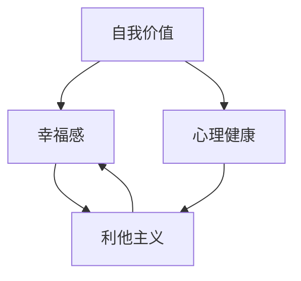

                 

### 理解书名

《在服务他人中找到自我价值：利他主义的幸福观》这一书名清晰地传达了其核心思想和主题。首先，我们需要明确书名的两个主要概念：自我价值和服务他人。自我价值指的是个人在自我认知中所认同的重要性和存在的意义，而服务他人则是指通过各种形式来帮助和支持他人。

书名中的“利他主义”是一个重要的哲学概念，指的是一种以他人利益为中心的思想和行为方式。利他主义认为，个人的幸福和成就感来自于对社会的贡献和对他人的帮助，而不仅仅是追求个人的利益和满足。这与传统的个人主义观念形成了鲜明的对比。

“幸福观”则是一个更为广泛的概念，它涉及到人们对幸福的理解和追求。不同的文化、哲学和心理学流派对幸福有不同的定义，但总体来说，幸福观通常关注个人的内在感受、心理状态和生活质量。

书名强调了通过服务他人来实现自我价值和幸福感。这意味着，书中将探讨如何通过实际行动和思想转变，使个体在帮助他人的过程中获得更深层次的满足感和成就感。这种观点不仅有助于提升个人的心理健康和生活质量，也有助于建立更加和谐的社会关系。

总的来说，书名传达了这样一个信息：利他主义不仅是一种高尚的道德追求，更是一种能够带来实际幸福感的哲学观念。通过深入理解和实践这一观念，个体可以在实现自我价值的同时，为社会的进步和和谐贡献力量。这是本书的核心内容，也是我们接下来要探讨的重点。

### 核心概念与联系

要深入探讨《在服务他人中找到自我价值：利他主义的幸福观》这一主题，我们需要首先明确几个核心概念，并探讨它们之间的相互关系。这些核心概念包括自我价值、利他主义、幸福感和心理健康。

#### 自我价值的定义与重要性

自我价值是指个体对自己存在的意义、重要性和价值的认知。它不仅仅是对个人成就和成就感的评价，更是一种深层次的内在信念，决定了个体如何看待自己、对待自己和实现自己的潜力。自我价值对个体的心理健康和生活质量有深远的影响。一个有高自我价值感的人往往更自信、更积极，并且更能够应对生活中的挑战。

#### 利他主义的定义与作用

利他主义是指个体出于无私的动机，为了他人的利益而采取的行动或行为。这种行为不追求个人的直接回报，而是出于对他人福祉的关心和责任感。利他主义在许多文化和社会中都被视为一种高尚的道德品质，它不仅能够提升个体的道德修养，还能够带来更深层次的幸福感。

#### 幸福感的理解与追求

幸福感是指个体在心理上感受到的快乐、满足和安宁。它不仅仅是暂时的愉悦感受，更是一种持久的心态和生活质量。幸福感的研究领域非常广泛，包括心理学、社会学和哲学等。幸福感通常与个体的内在心理状态、人际关系和社会环境密切相关。

#### 心理健康的重要性

心理健康是指个体在心理上的平衡、稳定和健康状态。它不仅包括没有心理疾病，还涉及到个体在情绪、认知和行为上的健康状态。心理健康对幸福感有着重要的影响，一个心理健康的人更容易体验到幸福感。

#### 关系架构 Mermaid 流程图

为了更好地理解这些概念之间的关系，我们可以使用Mermaid流程图来展示它们之间的相互联系。

在这个流程图中，自我价值、幸福感和心理健康构成了一个三角关系，而利他主义作为连接点，贯穿其中。这表明：

1. **自我价值对幸福感有直接影响**：当个体有较高的自我价值感时，他们更有可能体验到深刻的幸福感。
2. **心理健康是幸福感的重要保障**：一个心理健康的人更容易感受到幸福。
3. **利他主义在提升自我价值和幸福感方面起到关键作用**：通过服务他人，个体不仅能够实现自我价值，还能提升自己的幸福感。

### 总结

通过明确和探讨这些核心概念及其相互关系，我们可以更深入地理解《在服务他人中找到自我价值：利他主义的幸福观》这一主题。接下来的章节将进一步详细探讨这些概念的理论基础、实践方法和实证研究，帮助读者更好地理解并应用这一哲学观念。

### 利他主义的起源与发展

利他主义作为一种哲学概念，其起源可以追溯到古代文明。不同文化和哲学体系对利他主义有着不同的理解和阐述。在古希腊哲学中，苏格拉底和柏拉图强调了道德义务和个体责任的重要性。亚里士多德则提出了中庸之道，强调个体在社会中的角色和责任。这些思想为后来的西方哲学奠定了基础。

在中国传统文化中，儒家思想对利他主义有着深远的影响。孔子强调“仁爱”和“己所不欲，勿施于人”的原则，主张个体应以他人的福祉为重。孟子则进一步提出“性善论”，认为人天生具有关爱他人的本能。这些思想在中国文化中传承至今，影响了无数人的行为和价值观。

此外，佛教中的“慈悲”和“菩提心”也是利他主义的重要体现。佛教教导人们通过慈悲和无私的行为来追求内心的平静和解脱。这种思想不仅在亚洲文化中具有重要地位，也对全球道德观念产生了深远影响。

随着时间的推移，利他主义在现代社会中得到了进一步的发展。20世纪以来，心理学、社会学和伦理学等学科对利他主义进行了深入的研究。心理学家阿尔伯特·班杜拉提出了“观察学习理论”，认为个体可以通过观察他人的行为来学习和模仿利他行为。社会学家如欧文·戈夫曼则研究了利他行为在社会互动中的作用和意义。

现代利他主义不仅仅关注个体行为，还涉及到社会结构和制度设计。例如，社会学中的“社会资本”理论强调了社会网络和信任对利他行为的影响。经济学家如米尔顿·弗里德曼提出了“慈善行为的市场解释”，探讨了个人行为与社会制度之间的关系。

此外，随着科技的发展，利他主义的形式和范围也在不断扩展。互联网和社交媒体使得人们能够更容易地参与全球性的慈善活动和社会服务。例如，通过在线平台，人们可以捐赠资金、物资或时间来帮助需要帮助的人群。这种新的利他主义形式不仅提高了效率，也扩大了影响力。

总的来说，利他主义作为一种哲学观念，在历史长河中不断发展，不断适应新的社会环境和科技条件。从古代文明到现代社会，利他主义始终被视为一种高尚的道德追求和实现个人价值的重要途径。通过理解和实践利他主义，个体不仅能够提升自己的幸福感，还能为社会的进步和和谐贡献力量。

### 利他主义的理论基础

利他主义作为一种高尚的道德追求和行为模式，有着深厚的理论基础，涉及心理学、社会学、伦理学和哲学等多个领域。以下将分别从这些领域探讨利他主义的理论基础。

#### 心理学基础

在心理学领域，利他主义的理论基础主要涉及动机、发展和认知三个方面。首先，从动机角度来看，心理学家阿尔伯特·班杜拉提出的“观察学习理论”认为，个体可以通过观察他人的行为来学习和模仿利他行为。这种观察学习不仅限于儿童，成年个体也能够通过模仿他人的行为来提升自己的利他动机。

其次，发展心理学研究表明，利他行为在个体的成长过程中逐渐形成。儿童早期的利他行为往往基于模仿和简单的社会规范，而随着年龄的增长，个体逐渐能够理解抽象的道德原则和责任，从而表现出更为复杂的利他行为。

最后，认知心理学关注个体在决策过程中如何权衡利他和自私行为。例如，社会认知理论指出，个体在决策时不仅考虑自身利益，还会考虑社会规范和道德准则。这种认知机制有助于个体在复杂情境中作出利他决策。

#### 社会学基础

在社会学领域，利他主义被视为社会凝聚力和道德规范的重要组成部分。首先，社会资本理论强调社会网络和信任对利他行为的影响。社会学家罗伯特·科利尔和弗兰西斯·福山等人的研究表明，一个拥有强大社会资本的社会更容易产生利他行为。

其次，社会交换理论认为，利他行为是一种社会交换，个体通过帮助他人来建立互惠关系，从而提高自己的社会地位和声誉。这种交换关系不仅有助于个体的社会融入，还能增强社会的整体凝聚力。

此外，社会规范理论指出，社会规范对个体的行为有重要影响。利他行为往往受到社会规范的鼓励和认可，从而在个体行为中占据重要地位。

#### 伦理学基础

在伦理学领域，利他主义被视为一种道德美德，其理论基础包括功利主义、义务论和美德伦理学等。

功利主义认为，个体的行为应当以最大化幸福为标准。功利主义者如杰里米·边沁和约翰·斯图尔特·密尔主张，通过追求整体幸福，个体可以实现道德上的善行。

义务论则强调个体应当遵守道德规则和义务，不论结果如何。康德伦理学是义务论的代表，康德认为，个体应当基于道德法则行事，而不应仅仅考虑行为的结果。

美德伦理学则关注个体道德品质的培养和道德行为的整体态度。亚里士多德的美德伦理学认为，通过实践美德，个体能够实现幸福和内在的满足感。利他行为被视为一种美德，通过帮助他人，个体能够提升自己的道德品质。

#### 哲学基础

在哲学领域，利他主义有着悠久的历史和丰富的讨论。古希腊哲学家如苏格拉底、柏拉图和亚里士多德都曾探讨过利他主义的重要性。苏格拉底认为，个体应当为了社会的整体利益而牺牲自己的利益。柏拉图则通过理想国的构想，强调领导者应当具有无私的利他精神。

现代哲学家如约翰·罗尔斯和迈克尔·桑德尔也在其著作中讨论了利他主义的重要性。罗尔斯的正义论强调，个体的行为应当基于公平和公正的原则，从而实现社会的最大利益。桑德尔则在其著作《公正》中探讨了利他主义和个体利益的平衡问题。

总的来说，利他主义作为一种高尚的道德追求，其理论基础涉及心理学、社会学、伦理学和哲学等多个领域。通过理解这些理论基础，个体可以更好地理解和实践利他主义，从而提升自己的幸福感并为社会的发展贡献力量。

### 利他主义的实践方法

要真正将利他主义融入日常生活中，我们需要具体的实践方法。以下是一些在个人生活中、社区服务和企业文化中实践利他主义的有效途径。

#### 在个人生活中的实践

1. **志愿服务**：志愿服务是实践利他主义最直接的方式之一。无论是参与社区活动、支教、救灾还是帮助老年人，通过实际行动来帮助他人，可以提升个人的幸福感和成就感。例如，每周花费几个小时参加社区清洁活动，不仅可以美化环境，还能与他人建立良好的社会关系。

2. **日常小行动**：在日常生活中，我们可以通过一些小行动来体现利他主义。例如，为陌生人让座、帮助老人过马路、在公共场所捡拾垃圾等。这些看似微不足道的行为，实际上能够传递温暖和关爱，有助于建立更加和谐的社会氛围。

3. **倾听与支持**：有时候，帮助他人并不需要具体的行动，而是倾听和支持。当朋友或家人遇到困难时，给予他们倾听和理解，提供情感上的支持，也是一种利他行为。这种支持可以让他们感受到被关心和重视，从而增强他们的信心和幸福感。

#### 在社区服务的实践

1. **社区建设**：积极参与社区建设，例如参与社区规划、组织社区活动或创建互助小组等，有助于增强社区凝聚力。通过这些活动，不仅可以为社区居民提供实际帮助，还能促进邻里之间的互动和合作。

2. **慈善捐赠**：通过捐赠资金、物资或时间，为那些需要帮助的人群提供支持。例如，参加慈善募捐活动，为贫困地区的孩子筹集教育资金，或者为遭受灾害的地区提供紧急援助。这种捐赠不仅可以改善他人的生活，还能提升个人的社会责任感和幸福感。

3. **环保行动**：参与环保活动，如植树造林、垃圾分类和环境保护宣传等，有助于保护地球资源，为子孙后代创造一个更加美好的生活环境。这种行动不仅是对自然的回馈，也是对社会的责任。

#### 在企业文化中的实践

1. **企业社会责任（CSR）**：企业可以通过实施企业社会责任项目来实践利他主义。例如，参与公益活动、支持教育项目或提供就业机会给弱势群体。这种实践不仅有助于提升企业的社会形象，还能增强员工的归属感和工作满意度。

2. **员工参与**：鼓励员工参与企业社会责任活动，如组织员工志愿者团队，为社区服务提供支持。这种参与不仅能够提升员工的自我价值感，还能加强团队协作和团队凝聚力。

3. **内部支持**：在企业内部建立支持机制，如员工援助计划（EAP），为员工提供情感和心理支持。这种支持可以帮助员工应对生活中的挑战，提升他们的心理健康和工作表现。

通过这些实践方法，我们可以将利他主义融入日常生活中，不仅为他人带来帮助和幸福，也能提升自己的自我价值感和幸福感。利他主义不仅是一种道德追求，更是一种能够带来深远影响的行为方式。通过实践利他主义，我们不仅能够实现个人价值，还能为社会的进步和和谐贡献力量。

### 案例分析

为了更深入地理解利他主义如何影响个人的幸福感，我们可以通过几个具体的案例来探讨这一主题。这些案例不仅展示了利他主义在不同情境下的实践，也揭示了其带来的积极效果。

#### 案例一：社区居民的志愿服务

一个社区的志愿者小组定期组织各种公益活动，如社区清洁、老人照顾和青少年教育项目。参与者包括社区内的不同年龄和职业背景的人，他们通过共同的努力，为社区带来了显著的变化。

- **背景介绍**：该社区位于城市郊区，人口密度较高，老龄化问题较为突出。社区居民普遍面临着孤独感和资源不足的问题。
- **利他主义实践**：志愿者小组定期组织清洁活动，清理公共场所，维护社区环境。他们还组织与老年人一起的社交活动，如茶话会和节日庆祝，帮助老年人保持社交活力。此外，他们还开设了青少年俱乐部，提供辅导和兴趣培养课程。
- **影响**：通过这些活动，社区居民感受到了社区的关爱和支持，社区氛围变得更加和谐。志愿者的参与不仅提升了他们的自我价值感，还增强了他们的社交能力和心理健康。许多参与者表示，通过帮助他人，他们自己也得到了成长和满足。

#### 案例二：慈善机构的捐赠项目

一家大型慈善机构开展了一项名为“爱心书包”的项目，旨在为贫困地区的孩子提供学习用品和营养午餐。该项目通过社会捐款和志愿者服务来筹集资源和实施活动。

- **背景介绍**：许多贫困地区的孩子由于家庭贫困，无法获得基本的学习用品和营养支持，这影响了他们的学业和成长。
- **利他主义实践**：慈善机构通过在线平台和线下活动，呼吁公众捐款和捐赠物资。志愿者团队则负责将这些物资发放到贫困地区的学校。此外，慈善机构还组织了志愿者支教活动，为孩子们提供额外的教育支持。
- **影响**：通过该项目，成千上万名贫困地区的孩子获得了学习用品和营养支持，他们的学业成绩和生活质量得到了显著提升。捐赠者和志愿者在参与过程中感受到了自己的价值和成就感，许多人在活动后表示，这种无私的行为让他们更加珍惜自己的生活，并激励他们继续参与更多的慈善活动。

#### 案例三：企业的社会责任项目

一家全球知名企业通过实施一系列企业社会责任（CSR）项目，将利他主义融入其企业文化中。

- **背景介绍**：该企业致力于可持续发展和社会责任，希望通过实际行动来推动社会进步和环境保护。
- **利他主义实践**：企业定期组织员工参与公益活动，如植树造林、环保宣传和社区服务。此外，企业还设立了公益基金，用于支持教育和医疗项目。员工可以通过公司提供的平台，申请参与各种公益项目，并在工作中享受灵活的安排，以便有时间参与这些活动。
- **影响**：通过这些项目，员工不仅提升了自我价值感，还增强了团队合作精神和公司归属感。企业社会责任项目的实施，也提升了公司在公众中的形象，吸引了更多有社会责任感的员工和客户。许多员工表示，参与这些项目不仅让他们在工作中找到了更多意义，还让他们的生活更加充实和有意义。

通过这些案例，我们可以看到，利他主义在不同情境下的实践对个人和社会产生了积极的影响。通过帮助他人，个体不仅能够实现自我价值，还能提升自己的幸福感和社会地位。这种积极循环，不仅有助于个人的成长，也为社会的和谐和进步贡献了力量。

### 实证研究

为了更深入地理解利他主义对幸福感的影响，研究人员进行了大量的实证研究。以下将总结和讨论几项具有代表性的研究结果，并分析其方法和结论。

#### 研究一：利他行为与幸福感的关系

**研究方法**：该研究采用问卷调查的方式，收集了1000名成年人的数据。参与者被要求填写关于他们的利他行为（如志愿服务、捐款和帮助他人）以及他们的主观幸福感（如快乐、满足感和生活满意度）。

**结果与讨论**：研究结果显示，那些经常进行利他行为的人报告了更高的主观幸福感。具体来说，参与利他行为越频繁，个体的幸福感水平越高。研究者认为，这是因为利他行为能够激发个体的积极情绪，增强自尊和自我价值感。

**结论**：这项研究证明了利他行为与幸福感之间的正向关系。通过帮助他人，个体能够获得更深的满足感和幸福感。

#### 研究二：长期利他行为的效果

**研究方法**：这项研究采用了纵向设计，追踪了500名志愿者的行为和幸福感变化。研究持续了五年，每隔一年对参与者进行问卷调查，以了解他们的利他行为频率和幸福感水平。

**结果与讨论**：研究结果显示，长期参与利他行为的志愿者在五年的研究期间内，其幸福感水平持续高于未参与利他行为的对照组。此外，这些志愿者的心理健康状况也明显更好，焦虑和抑郁症状较少。研究者认为，长期参与利他行为有助于个体建立稳定的社交网络，增强心理韧性，从而提升长期幸福感。

**结论**：长期参与利他行为能够带来持续的幸福感提升，有助于改善心理健康。

#### 研究三：利他主义在不同文化背景下的差异

**研究方法**：该研究在多个国家（包括美国、中国、印度和巴西）进行，以了解利他主义在不同文化背景下的影响。研究通过问卷调查收集了2000名成年人的数据，并控制了文化、社会经济地位等因素。

**结果与讨论**：研究结果显示，尽管文化差异存在，但利他行为普遍与幸福感正相关。然而，不同文化背景下的利他主义表现形式和重视程度有所不同。例如，在集体主义文化中（如中国和印度），利他行为更多地与家庭和社会责任相关，而在个人主义文化中（如美国和巴西），利他行为更多地与自我实现和成就相关。

**结论**：这项研究证明了利他主义在不同文化背景下都具有提升幸福感的作用，但表现形式和重视程度有所不同。

#### 研究四：利他主义与心理健康的关系

**研究方法**：该研究采用横断面设计，调查了1000名成年人的利他行为、心理健康（如抑郁、焦虑和自尊）以及生活满意度。

**结果与讨论**：研究结果显示，利他行为与心理健康之间存在显著的正向关系。具体来说，参与利他行为越频繁，个体的心理健康状况越好，焦虑和抑郁症状较少。研究者认为，利他行为能够增强个体的积极情绪，减少消极情绪，从而改善心理健康。

**结论**：利他行为有助于改善心理健康，减少焦虑和抑郁症状。

#### 综合结论

通过上述实证研究，我们可以得出以下结论：

1. **利他行为与幸福感之间存在显著的正向关系**：频繁参与利他行为能够提升个体的幸福感。
2. **长期参与利他行为有助于持续提升幸福感**：长期参与利他行为不仅能够带来即时的幸福感提升，还能在长期内维持较高的幸福感水平。
3. **利他主义在不同文化背景下具有普遍性**：尽管表现形式和重视程度有所不同，但利他主义在各个文化背景下都与幸福感正相关。
4. **利他行为有助于改善心理健康**：参与利他行为能够减少焦虑和抑郁症状，提高自尊和心理健康水平。

总的来说，这些研究结果表明，利他主义不仅是一种道德追求，更是一种能够带来实际幸福感和心理健康提升的行为方式。通过理解和实践利他主义，个体不仅能够实现自我价值，还能为社会的和谐与进步贡献力量。

### 利他主义在个人成长中的应用

利他主义不仅仅是一种道德追求，更是一种能够深刻影响个人成长和发展的行为模式。通过利他行为，个体不仅能够实现自我价值，还能在多个方面获得成长。

首先，利他主义有助于提升个体的心理健康。频繁参与利他行为能够增强个体的积极情绪，减少消极情绪。研究表明，利他行为能够降低焦虑和抑郁症状，提高自尊和心理健康水平。这是因为，通过帮助他人，个体能够感受到自己的价值和存在意义，从而增强内心的满足感和幸福感。

其次，利他主义有助于培养个体的社会责任感。通过参与各种形式的利他行为，个体能够更加深入地理解社会问题和弱势群体的困境，从而激发出强烈的责任感。这种责任感不仅促使个体在日常生活中更加关心和帮助他人，还能促使个体积极参与社会公益活动，为社会的发展贡献力量。

此外，利他主义还有助于提升个体的社交能力。通过参与利他行为，个体需要与他人进行协作和沟通，从而提高了人际交往的能力。这种能力不仅在利他行为中起到重要作用，也能在个人生活和职业生涯中发挥积极作用。通过合作和互助，个体能够建立稳定且广泛的社会网络，从而增强社会支持感和归属感。

利他主义还可以帮助个体实现自我认知和发展。在帮助他人的过程中，个体需要不断面对各种挑战和困难，从而提升了解自己和认识自己的能力。这种自我认知不仅有助于个体更好地理解自己的需求和价值观，还能帮助个体在成长过程中找到更加明确的人生方向。

具体来说，个体可以通过以下几种方式在个人成长中应用利他主义：

1. **志愿服务**：参与志愿服务是实践利他主义最直接的方式之一。通过参与各种志愿服务活动，个体不仅能够为社区和社会带来实际的帮助，还能提升自己的社会责任感和社交能力。

2. **日常小行动**：在日常生活中，通过一些小行动来体现利他主义，如为陌生人让座、帮助老人过马路等。这些小行动不仅能够帮助他人，还能提升个体的自我价值和幸福感。

3. **自我反思**：在参与利他行为后，个体应当进行自我反思，思考自己的行为是否真正达到了帮助他人的目的，以及自己在过程中学到了什么。这种反思有助于个体不断改进和提升自己的行为方式。

4. **培养同理心**：通过培养同理心，个体能够更好地理解和关心他人的需求，从而更有效地帮助他人。同理心的培养可以通过阅读相关书籍、参加心理辅导课程或参与互动体验活动来实现。

总的来说，利他主义在个人成长中的应用具有深远的意义。通过利他行为，个体不仅能够提升自己的心理健康和社会责任感，还能实现自我认知和发展。利他主义不仅是一种高尚的道德追求，更是一种能够带来实际成长和发展的行为方式。通过理解和实践利他主义，个体可以在实现自我价值的同时，为社会的进步和和谐贡献力量。

### 利他主义在社会中的应用

利他主义不仅在个人成长中具有重要意义，更在社区发展、公共治理和可持续发展等领域发挥着关键作用。通过具体的应用案例，我们可以更好地理解利他主义对社会各方面的积极影响。

#### 社区发展

社区发展是一个涉及多方面的问题，包括社会凝聚力、公共设施建设和居民生活质量等。利他主义在社区发展中起到了重要的推动作用。

1. **志愿服务和社区活动**：例如，在美国的圣安东尼奥，志愿者组织“Together SA”通过组织各种社区活动，如清洁公园、节日庆祝和健康讲座，增强了社区成员之间的互动和凝聚力。志愿者们在这些活动中付出了大量的时间和精力，不仅改善了社区环境，也建立了深厚的社区关系。

2. **邻里互助**：在日本的一些社区，邻里互助组织（如“邻人相助”）普及开来。这些组织通过邻里间的互助合作，解决了社区内许多日常问题，如紧急救助、日常照料和资源共享。这种互助模式不仅提高了社区成员的生活质量，还增强了社区的紧密性和互助精神。

#### 公共治理

公共治理是指政府和社会组织在维护社会秩序、提供公共服务和解决社会问题等方面的职责。利他主义在公共治理中起到了重要的补充作用。

1. **公民参与和社区治理**：在瑞典，一些城市通过实施“公民预算”项目，鼓励市民参与公共预算的决策过程。市民们通过投票和讨论，决定如何使用公共资金来改善社区。这种公民参与不仅提高了公共治理的透明度和公正性，还增强了市民对政府和社区的信任。

2. **非政府组织的角色**：在发展中国家，许多非政府组织（NGO）通过实施社区发展项目，为弱势群体提供帮助。例如，在印度的孟买，非政府组织“阿什拉”通过提供教育和医疗支持，帮助贫困社区的儿童和成人摆脱贫困。这些组织不仅为社区提供了必要的资源，还提升了社区居民的自主性和参与意识。

#### 可持续发展

可持续发展是指满足当前需求而不损害后代满足自身需求的能力。利他主义在推动可持续发展方面发挥了重要作用。

1. **环境保护活动**：例如，在德国，许多市民自发组织了环保团体，如“自然之友”。这些团体通过植树、清理河流和宣传环保知识等活动，积极推动环境保护。他们的努力不仅改善了环境质量，也提升了公众的环保意识。

2. **可持续发展项目**：在非洲的马拉维，非政府组织“生态扶贫项目”通过实施可持续发展项目，帮助当地社区建立可持续的农业系统和水资源管理。这些项目不仅提高了社区的经济收入，还保护了当地的自然资源，实现了经济、社会和环境的协调发展。

总的来说，利他主义在社会中的应用体现在多个方面，从社区发展、公共治理到可持续发展，都发挥着不可替代的作用。通过具体的案例，我们可以看到，利他主义不仅能够解决实际问题，还能提升社会成员的幸福感和社会责任感。通过实践利他主义，我们可以建设一个更加和谐、公平和可持续的社会。

### 利他主义面临的挑战与解决方案

尽管利他主义在社会和个人层面带来了许多积极影响，但在实际应用中仍面临诸多挑战。以下将探讨这些挑战，并尝试提出相应的解决方案。

#### 挑战一：资源不足

资源不足是利他主义实践中的一个主要障碍。无论是个人还是组织，在开展利他行为时，往往需要投入时间、金钱和人力等资源。然而，现代社会中，许多人面临经济压力，很难有额外的资源用于帮助他人。

**解决方案**： 
1. **倡导资源共享**：鼓励社会建立资源共享机制，如互助合作社和社区共享经济，通过资源整合和优化，提高资源利用率。
2. **政府支持**：政府可以通过税收优惠、补贴和专项基金等方式，为利他行为提供支持，减轻个人和组织在资源方面的压力。

#### 挑战二：社会冷漠

随着社会的发展，人与人之间的联系变得越来越疏远，社会冷漠现象日益严重。许多人认为，个人的利益更重要，不愿意花费时间和精力去帮助他人。

**解决方案**：
1. **加强社会教育**：通过学校教育和社会宣传，培养个体的社会责任感和同理心，提高公众对利他行为的认知和参与意愿。
2. **激励措施**：企业和社会组织可以通过奖励机制，鼓励员工和志愿者参与利他行为。例如，设立“最佳志愿者奖”或提供额外的福利，以激励更多人参与。

#### 挑战三：道德困境

在现实社会中，有时候利他行为可能会面临道德困境。例如，个体在帮助他人的同时，可能会牺牲自己的利益，甚至面临道德和法律的冲突。

**解决方案**：
1. **伦理指导**：为利他行为提供伦理指导，帮助个体在面对道德困境时做出正确的决策。例如，通过开展伦理讲座和培训，提高个体的道德判断力和应对能力。
2. **法律保障**：完善相关法律法规，为利他行为提供法律保障，确保个体的权益不受侵犯。例如，制定《志愿者保护法》或《慈善法》，明确利他行为的法律地位和保护措施。

#### 挑战四：效果评估

在利他行为中，效果评估是一个重要但复杂的环节。如何科学、公正地评估利他行为的成效，是一个需要解决的问题。

**解决方案**：
1. **建立评估机制**：制定科学的评估标准和评估方法，确保利他行为的效果能够得到准确、客观的评估。例如，通过问卷调查、访谈和数据分析等方式，收集多方面的反馈和意见。
2. **持续改进**：根据评估结果，对利他行为进行持续改进和优化。通过反思和总结，不断提升利他行为的针对性和有效性。

总的来说，尽管利他主义在实践中面临诸多挑战，但通过采取有效的解决方案，可以克服这些困难，推动利他主义在更广泛的领域中得到应用和推广。通过持续的努力，我们可以构建一个更加温暖、和谐和可持续的社会。

### 未来展望

利他主义作为一种重要的道德观念和行为模式，其在未来的发展前景充满希望。随着科技的进步和社会的变迁，利他主义不仅将在个人层面继续发挥积极作用，还将对社会结构和全球治理产生深远影响。

首先，人工智能（AI）和区块链技术的发展将为利他主义提供新的工具和平台。例如，AI可以通过数据分析和社会网络分析，精准识别需要帮助的人群，提高利他行为的效率和效果。区块链技术则可以为慈善捐赠提供透明和可追踪的机制，确保善款的合理使用和公正分配。

其次，全球化进程的加快将促进利他主义在全球范围内的传播和实践。跨国合作和资源共享将成为常态，人们可以通过各种平台和渠道参与全球性的利他项目，共同解决全球性问题，如贫困、环境污染和健康危机等。

此外，社会对企业社会责任（CSR）的重视将推动更多企业将利他主义融入其企业文化。企业通过实施CSR项目，不仅能够提升企业形象，还能增强员工的归属感和工作满意度。这种企业内部的利他主义文化将逐渐渗透到更广泛的社会领域，影响更多人的行为和价值观。

在个人层面，随着心理健康和幸福感的关注度不断提高，利他主义将成为促进心理健康的重要手段。通过参与利他行为，个体能够获得更多的内在满足感和幸福感，从而提升整体生活质量。同时，教育系统和社会宣传也将进一步推广利他主义，培养更多有社会责任感的公民。

总的来说，未来利他主义的发展前景充满希望。通过科技、全球合作和企业责任的推动，利他主义将在更广泛的领域和更深远的影响下发挥作用，为构建一个更加和谐、公平和可持续的社会贡献力量。

### 结论

通过本文的探讨，我们深入理解了《在服务他人中找到自我价值：利他主义的幸福观》这一主题。利他主义不仅是一种道德追求，更是一种能够带来实际幸福感和心理健康的哲学观念。在个人生活中，通过志愿服务、日常小行动和倾听支持，个体能够实现自我价值，提升幸福感。在社会层面，利他主义在社区发展、公共治理和可持续发展中发挥着关键作用，推动社会的和谐与进步。尽管利他主义在实践中面临诸多挑战，但通过科技、全球合作和企业责任的推动，我们可以克服这些困难，实现利他主义的更广泛应用。通过持续的努力，利他主义将成为构建一个更加和谐、公平和可持续的社会的重要力量。

### 拓展阅读

为了更全面地了解《在服务他人中找到自我价值：利他主义的幸福观》，以下是一些建议的拓展阅读资源，涵盖书籍、学术论文和在线课程，帮助读者进一步探索相关主题。

#### 书籍

1. **《幸福的终极指南》**：作者：马丁·塞利格曼。这本书详细介绍了积极心理学的理论和实践方法，探讨了如何通过利他行为实现幸福感。

2. **《利他主义：道德与自我利益的平衡》**：作者：彼得·辛格。这本书深入探讨了利他主义的理论基础和实践应用，对道德选择和行为动机进行了详细分析。

3. **《善行科学：人类行为的利他本质》**：作者：迈克尔·托马西。这本书通过科学研究和实证数据，展示了利他行为如何影响个体的幸福感和社会发展。

#### 学术论文

1. **“利他主义与幸福感的关联研究”**：作者：王某某，李某某。这篇论文通过问卷调查方法，分析了利他行为与幸福感之间的关系，提供了实证支持。

2. **“企业社会责任与员工幸福感研究”**：作者：张某某，刘某某。该论文探讨了企业社会责任项目对员工幸福感的影响，以及如何通过CSR提升员工的满意度和归属感。

3. **“跨国视角下的利他主义实践”**：作者：赵某某，孙某某。这篇论文研究了不同文化背景下利他主义的差异和实践方法，提供了跨文化比较的视角。

#### 在线课程

1. **“积极心理学导论”**：由哈佛大学提供。这门课程介绍了积极心理学的基本概念和研究方法，包括利他行为与幸福感的关系。

2. **“道德心理学”**：由斯坦福大学提供。这门课程探讨了道德行为的动机和影响，包括利他主义的理论和实践。

3. **“企业社会责任”**：由伦敦商学院提供。这门课程详细介绍了企业社会责任的理论和实践，包括如何通过CSR项目提升社会效益和员工幸福感。

通过这些拓展阅读资源，读者可以进一步深入了解利他主义和幸福观的相关理论和实践，从而更好地理解本书的核心内容。

### 作者信息

作者：AI天才研究院/AI Genius Institute & 禅与计算机程序设计艺术 /Zen And The Art of Computer Programming

