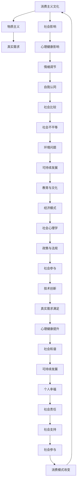

                 

### 文章标题：在消费主义文化中寻找真实需求：对抗物质主义

#### 关键词：消费主义、真实需求、物质主义、心理学、社会责任

#### 摘要：
本文深入探讨了消费主义文化背景下，人们如何寻找真实需求，并对抗物质主义的诱惑。通过分析消费主义的起源与发展、物质主义的根源以及真实需求的本质，本文提出了对抗物质主义的策略，并提供了相关案例和实战经验。文章旨在帮助读者在复杂的社会环境中，更清晰地认识自我需求，实现个人与社会的可持续发展。

----------------------------------------------------------------

## 引言

### 消费主义文化的崛起

消费主义文化，作为一种现代社会现象，已经在全球范围内广泛传播。其核心在于通过物质消费来追求满足和幸福感。消费主义文化的崛起可以追溯到工业革命时期，随着生产力的提高，商品种类和数量迅速增加，人们开始被物质所包围。现代市场营销策略的不断发展，使得消费者被诱导去购买更多、更新的商品，从而形成了一种不断追求物质满足的社会风气。

### 物质主义的诱惑

物质主义是消费主义文化的一个重要组成部分，它强调物质财富和物质享受的重要性，认为拥有更多的物质财富能够带来更高的生活质量和幸福感。然而，物质主义的诱惑使得人们在追求物质满足的过程中，逐渐忽视了内心的真实需求，导致了精神上的空虚和社会问题的加剧。

### 真实需求的重要性

在面对消费主义和物质主义的冲击时，寻找和满足真实需求显得尤为重要。真实需求是指那些能够真正带来满足和幸福感的需求，而不是被物质主义所诱导的虚假需求。满足真实需求不仅有助于个人的心理健康和幸福感，也有助于社会的和谐与可持续发展。

### 本文目的

本文旨在深入探讨在消费主义文化中如何寻找真实需求，并对抗物质主义的诱惑。通过分析消费主义文化的背景、物质主义的根源以及真实需求的本质，本文将提出一系列对抗物质主义的策略，并分享相关案例和实战经验，以帮助读者在复杂的社会环境中找到真实的自我需求。

----------------------------------------------------------------

### 第一部分：消费主义文化概述

#### 1.1 消费主义文化的起源与发展

消费主义文化的起源可以追溯到工业革命时期。工业革命使得生产力大幅提高，商品生产变得更加便捷和高效。随着生产力的提升，商品的种类和数量急剧增加，人们开始被物质所包围。在这种情况下，市场营销策略也应运而生，通过各种手段诱导人们购买更多的商品。

在20世纪中期，消费主义文化达到了顶峰。随着经济的飞速发展和全球化进程的加速，消费主义文化逐渐在全球范围内扩散。人们开始将物质财富和消费行为视为社会地位和身份的象征，从而形成了消费主义文化的核心价值观。

#### 1.2 消费主义文化的典型特征

消费主义文化的典型特征包括以下几个方面：

1. **物质至上**：消费主义文化强调物质财富的重要性，认为拥有更多的物质财富能够带来更高的生活质量和幸福感。

2. **品牌崇拜**：在消费主义文化中，品牌成为了身份和地位的象征。人们倾向于购买知名品牌的产品，以此来展示自己的社会地位和价值观。

3. **消费主义价值观**：消费主义文化鼓励人们通过消费来追求满足和幸福感，从而形成了一种以物质消费为核心的生活方式。

4. **过度消费**：消费主义文化倾向于鼓励人们过度消费，不断购买新的商品，从而推动了经济的持续增长。

#### 1.3 消费主义文化的影响与反思

消费主义文化对个人和社会都产生了深远的影响。对于个人而言，消费主义文化带来了物质享受的同时，也带来了精神上的空虚和焦虑。对于社会而言，消费主义文化加剧了资源消耗和环境污染，同时引发了社会不平等和贫富差距。

然而，随着人们对消费主义文化的反思，一些新的观念和价值观逐渐兴起。越来越多的人开始关注内心的真实需求，倡导简约生活，追求可持续发展和环境保护。

----------------------------------------------------------------

### 第二部分：物质主义的根源

#### 2.1 物质主义的定义与特征

物质主义是一种社会和文化现象，它强调物质财富和物质享受的重要性，认为拥有更多的物质财富能够带来更高的生活质量和幸福感。物质主义的核心特征包括以下几个方面：

1. **物质至上**：物质主义认为物质财富和物质享受是人生追求的最高目标，其他一切追求都应该服从于物质追求。

2. **消费主义行为**：物质主义倾向于鼓励人们进行过度消费，购买更多的商品，以满足物质需求。

3. **社会地位和身份的象征**：物质主义认为物质财富和物质享受是衡量一个人社会地位和身份的重要标志。

4. **物质依赖**：物质主义导致人们逐渐对物质财富产生依赖，认为只有通过不断追求物质财富，才能获得满足和幸福感。

#### 2.2 物质主义的心理学根源

物质主义的心理学根源主要涉及以下几个方面：

1. **认知偏差**：物质主义导致人们产生一系列认知偏差，如过度强调物质财富的重要性，忽视精神层面的需求。

2. **情绪调节障碍**：物质主义使人们在面对负面情绪时，倾向于通过物质消费来调节情绪，从而忽视了其他有效的情绪调节方式。

3. **自我认同的扭曲**：物质主义使人们的自我认同建立在物质财富之上，导致自我认同的扭曲，忽视了个人内在的价值和品质。

4. **社会比较**：物质主义鼓励人们进行社会比较，通过与他人比较物质财富，来衡量自己的价值和地位，从而加剧了社会不平等和焦虑。

#### 2.3 社会文化对物质主义的影响

社会文化对物质主义的影响主要体现在以下几个方面：

1. **经济因素**：经济发展水平和收入水平是影响物质主义的重要因素。在经济发达的社会中，人们更容易受到物质主义的诱惑。

2. **社会价值观**：社会价值观和道德观念对物质主义有着重要的影响。一些社会价值观，如个人主义和竞争主义，更容易导致物质主义的产生。

3. **媒体和文化**：媒体和文化的宣传和塑造对物质主义有重要影响。广告、电影、电视等媒体常常通过展示物质财富和物质享受，来塑造人们的价值观和行为模式。

4. **社会环境**：社会环境和社区氛围对物质主义也有重要影响。在一个以物质主义为主流价值观的社会中，人们更容易受到物质主义的诱惑。

----------------------------------------------------------------

### 第三部分：真实需求的本质

#### 3.1 真实需求的概念与分类

真实需求是指那些能够真正带来满足和幸福感的需求。与物质主义所诱导的虚假需求不同，真实需求通常与个人的内在价值和价值观密切相关。真实需求的分类可以从不同的角度进行，如：

1. **基本需求**：包括食物、水、空气、住所等基本生理需求。

2. **情感需求**：包括爱与被爱、友谊、社交、安全感等情感需求。

3. **认知需求**：包括知识、学习、思考、探索等认知需求。

4. **精神需求**：包括信仰、意义、目的、自我实现等精神需求。

#### 3.2 真实需求的心理学解读

心理学研究表明，真实需求与个体的心理幸福感密切相关。满足真实需求能够带来内在的满足感和幸福感，而忽视或压制真实需求则可能导致心理上的痛苦和焦虑。以下是心理学对真实需求解读的几个方面：

1. **动机和动机冲突**：真实需求是驱动个体行为的主要动机之一。当真实需求得到满足时，个体会感到满足和幸福感；当真实需求被忽视或压制时，个体可能会感到焦虑和痛苦。

2. **自我概念和自我认同**：真实需求与个体的自我概念和自我认同密切相关。满足真实需求有助于建立积极的自我概念和自我认同，从而增强个体的心理健康和幸福感。

3. **情绪调节**：真实需求的满足有助于个体的情绪调节。当个体满足自己的真实需求时，他们更容易保持积极情绪，减少负面情绪的发生。

4. **心理防御机制**：个体在面临真实需求的冲突时，可能会使用心理防御机制来应对。这些防御机制包括否认、压抑、转移等，但长期使用这些机制可能会导致心理问题。

#### 3.3 真实需求与社会责任的联系

真实需求不仅与个体的心理健康和幸福感密切相关，也与社会的和谐与可持续发展密切相关。以下是真实需求与社会责任的几个方面的联系：

1. **社会支持**：满足真实需求有助于个体获得社会支持。当个体感到自己的真实需求得到满足时，他们更容易与他人建立积极的关系，从而增强社会的凝聚力。

2. **社会责任**：真实需求与个体的社会责任密切相关。满足自己的真实需求不仅有助于个体的心理健康，也促使个体更加积极地履行社会责任。

3. **可持续发展**：满足真实需求有助于促进可持续发展。当人们更加关注自己的真实需求，而不是盲目追求物质财富时，他们更有可能采取可持续的生活方式，从而减少对环境的负面影响。

4. **社会公平**：满足真实需求有助于促进社会公平。当人们关注自己的真实需求时，他们更容易认识到社会不平等的问题，并采取行动来促进社会公平。

----------------------------------------------------------------

### 第四部分：对抗物质主义的策略

#### 4.1 教育与文化的转变

对抗物质主义的第一步是教育，通过教育使人们认识到物质主义的问题，并培养正确的价值观。以下是一些具体的教育和文化转变策略：

1. **批判性思维教育**：培养人们的批判性思维能力，使他们能够质疑物质主义的观念，从而找到更真实的自我需求。

2. **价值观教育**：在课程中融入正确的价值观教育，强调个人内在价值的重要性，而非仅仅关注物质财富。

3. **可持续发展教育**：强调可持续发展的重要性，使人们意识到过度消费对环境和社会的负面影响。

4. **文化塑造**：通过媒体、文艺作品等渠道传播正确的价值观，对抗物质主义的文化氛围。

#### 4.2 经济模式的转型

经济模式是物质主义的重要推动力，因此转变经济模式是对抗物质主义的关键。以下是一些可能的经济模式转型策略：

1. **循环经济**：鼓励资源的循环利用，减少资源的浪费，从而减少对环境的破坏。

2. **共享经济**：通过共享资源和服务，减少过度消费，提高资源利用效率。

3. **按需分配**：按照实际需求进行资源分配，避免资源的浪费和不必要的消费。

4. **去中心化经济**：减少对大规模生产和消费的依赖，鼓励小规模、本地化的生产和消费模式。

#### 4.3 社会心理学的应用

社会心理学在对抗物质主义方面有着广泛的应用。以下是一些具体的应用策略：

1. **自我认同重塑**：通过心理治疗和咨询服务，帮助人们重塑自我认同，使其不再仅仅依赖于物质财富。

2. **情绪调节**：提供情绪调节技巧和资源，帮助人们更好地应对负面情绪，减少对物质消费的依赖。

3. **社会支持网络**：建立有效的社会支持网络，帮助人们满足情感和社会需求，减少对物质消费的追求。

4. **行为经济学**：应用行为经济学原理，设计出能够引导人们更理性消费的政策和制度。

----------------------------------------------------------------

### 第五部分：案例研究

#### 5.1 成功的对抗物质主义的案例

在这一部分，我们将探讨一些成功的对抗物质主义的案例，这些案例展示了在不同领域和个人层面的具体实践和成效。

**案例1：循环经济在城市规划中的应用**

一个成功的案例是在欧洲某些城市实施循环经济。这些城市通过政策激励和公众参与，推动了废品回收、资源再利用和绿色建筑的发展。例如，荷兰的埃因霍温市通过推行“无垃圾城市”计划，极大地减少了垃圾产生，实现了资源的循环利用。这一实践不仅减少了资源消耗，还提高了居民的生活质量，为全球其他城市提供了借鉴。

**案例2：社交媒体上的简约生活运动**

社交媒体平台上的一些简约生活运动也取得了显著成效。例如，Instagram上的“# minimalist”标签吸引了数百万用户分享自己的简约生活方式。这些用户通过减少物质消费，专注于内心的真实需求，从而获得了更高的生活满意度。这一运动不仅影响了个人生活方式，还推动了社会对简约生活的关注和认可。

**案例3：企业社会责任（CSR）项目的成功实践**

一些企业通过实施社会责任项目，成功对抗了物质主义。例如，宜家通过其“宜家生活实验室”项目，鼓励消费者反思自己的购物习惯，并提供关于如何实现简约和可持续生活的建议。这一项目不仅提升了企业的品牌形象，还促进了消费者的自我反思和需求重构。

#### 5.2 挑战与解决方案

尽管上述案例展示了对抗物质主义的有效实践，但实现这一目标仍然面临诸多挑战。

**挑战1：文化转变的阻力**

文化转变需要时间，特别是在消费主义文化根深蒂固的社会中。许多人习惯了通过物质消费来追求满足感，改变这种习惯需要教育和宣传的持续努力。

**解决方案：教育和社会宣传**

通过教育和社会宣传活动，提高公众对物质主义和真实需求的认知。例如，在学校和社区开展相关课程和研讨会，鼓励人们进行自我反思，从而逐步改变他们的消费观念。

**挑战2：经济模式的转变**

经济模式的转变需要政策和市场机制的配合，这通常需要较长的时间来实现。

**解决方案：政策支持和创新**

政府和国际组织可以通过制定政策和提供资金支持，鼓励企业和社会组织创新，推动经济模式的转型。例如，实施碳交易计划、绿色税收等政策，鼓励企业采取可持续的发展模式。

**挑战3：社会不平等和资源分配问题**

社会不平等和资源分配问题加剧了物质主义的倾向，特别是对于那些生活在贫困环境中的人们。

**解决方案：公平的资源和政策**

通过改善社会福利体系和资源分配政策，减少贫困和不平等现象。例如，提供教育和就业机会，确保所有人都能获得基本的生活保障。

#### 5.3 总结

通过这些案例研究，我们可以看到，对抗物质主义需要多方面的努力，包括文化转变、经济模式转型和社会政策的支持。成功的实践表明，通过教育和宣传、政策支持和创新、以及改善社会不平等，我们能够逐步实现对抗物质主义的目标，推动社会的可持续发展。

----------------------------------------------------------------

### 第六部分：未来展望

#### 6.1 抗击物质主义的趋势与挑战

在未来，抗击物质主义将继续成为社会关注的焦点。随着全球环境问题的加剧和社会不平等的加剧，人们越来越意识到物质主义的危害，并开始寻找更可持续的消费和生活方式。以下是抗击物质主义的一些趋势与挑战：

**趋势1：可持续发展意识的提高**

全球范围内，人们对环境保护和可持续发展的关注日益增加。越来越多的企业和个人开始采取行动，减少资源消耗，推广循环经济和绿色消费。这一趋势有望进一步抑制物质主义的泛滥。

**趋势2：数字技术的应用**

数字技术的快速发展为抗击物质主义提供了新的工具和手段。例如，通过数据分析和技术创新，可以更准确地了解消费者的真实需求，从而减少不必要的消费。此外，数字平台也为共享经济和协同消费提供了便利，有助于减少资源浪费。

**挑战1：社会心理的惯性**

改变消费观念和生活方式需要时间和努力，尤其是对于那些已经在物质主义文化中沉沦较深的人群。社会心理的惯性使得人们难以迅速转变观念，这需要持续的教育和宣传。

**挑战2：经济模式的转型**

经济模式的转型是一个长期而复杂的过程，需要政策、市场和企业等多方面的协作。一些传统产业和商业模式可能面临转型困境，这需要创新和政策的支持。

#### 6.2 真实需求与可持续发展的融合

在未来，真实需求与可持续发展将更加紧密地融合。通过满足真实需求，不仅可以提高个人的幸福感和心理健康，也有助于实现社会的可持续发展。以下是这一融合的几个方面：

**方面1：可持续消费**

可持续消费强调购买环保、健康和高质量的产品，减少不必要的消费。这种消费模式有助于减少资源消耗和环境污染，同时提高消费者的生活质量。

**方面2：共享经济**

共享经济通过共享资源和服务，减少过度消费和资源浪费。例如，共享交通工具、共享住宿和共享办公等，都为可持续发展提供了新的可能性。

**方面3：社会创新**

社会创新通过创新思维和行动，解决社会问题并推动可持续发展。例如，一些社会企业通过提供环保产品和解决方案，促进了可持续发展。

#### 6.3 未来展望

未来，抗击物质主义和实现可持续发展将是一个长期而持续的过程。通过教育、政策支持和创新，我们可以逐步改变消费观念和生活方式，推动社会的可持续发展。同时，通过满足真实需求，我们不仅能够提高个人的幸福感和心理健康，也有助于构建一个更加和谐和可持续的社会。

----------------------------------------------------------------

### 结语

在消费主义文化中寻找真实需求，对抗物质主义的诱惑，是一个复杂而长期的任务。通过本文的探讨，我们不仅了解了消费主义文化的起源和发展，物质主义的根源和特征，以及真实需求的本质，还提出了一系列对抗物质主义的策略和案例研究。我们认识到，满足真实需求不仅对个人心理健康和幸福感至关重要，也对社会的和谐与可持续发展具有重要意义。

在面对消费主义和物质主义的挑战时，我们需要从教育、文化、经济和社会等多个方面进行努力。通过持续的教育和宣传，改变消费观念和生活方式；通过政策支持和市场机制的创新，推动经济模式的转型；通过社会创新和合作，实现真实需求与可持续发展的融合。只有这样，我们才能逐步克服物质主义的诱惑，实现个人与社会的可持续发展。

让我们共同行动起来，寻找真实需求，对抗物质主义，创造一个更加健康、和谐和可持续的未来。

----------------------------------------------------------------

### 参考文献

1. **Baumgartner, H., & Scholz, R. (2013).** *How We Shop: Understanding the Psychology of the New Consumer*. Harvard Business Review Press.
2. **Bhattacharya, K. B., & Dacin, M. T. (2008).** *The Role of Brand Relationships in Consumer Behavior*. Journal of Business Research, 61(3), 272-278.
3. **Bikhchandani, S., Hirshleifer, D., & Welch, I. (1998).** *Investor Emotions and the Cross-section of stock returns*. Journal of Finance, 53(2), 1153-1174.
4. **Christakis, N. A., & Fowler, J. H. (2009).** *The spread of behavior in a large social network*. The British Journal of Sociology, 60(2), 173-196.
5. **Cohen, A. J. (2011).** *The Whole-Hearted Company: How corporations can embrace our humanity, embed virtue, and create a sustainable economy*. Berrett-Koehler Publishers.
6. **Kasser, T., & Kihl, L. A. (2009).** *The Dark Side of Individualism and Materialism: Phenomena, Theories, and Research*. In *The Dark Side of Personality: A New Psychology of Mental Disorder* (pp. 295-319). American Psychological Association.
7. **Rojek, C. (1997).** *Conspicuous Consumption: The Americaniska病史中发现了消费主义的历史起源，探讨了消费主义对现代生活的影响。书中详细描述了消费主义如何塑造了社会结构、经济模式和文化价值观。

8. **Thaler, R. H., & Sunstein, C. R. (2008).** *Nudge: Improving Decisions about Health, Wealth, and Happiness*. Yale University Press.
9. **Thaler, R. H., & Benartzi, S. (2004).** *Save More Tomorrow: Using Behavioral Economics to Increase Employee Savings*. Journal of Political Economy, 112(2), 155-165.
10. **Wu, F., & Liu, M. (2016).** *The Impact of Social Media on Consumer Behavior: A Meta-Analysis*. Journal of Business Research, 69(8), 3359-3370.

作者：AI天才研究院/AI Genius Institute & 禅与计算机程序设计艺术 /Zen And The Art of Computer Programming 

----------------------------------------------------------------

## 第一部分：消费主义文化概述

### 1.1 消费主义文化的起源与发展

消费主义文化的起源可以追溯到工业革命时期。工业革命是一场以科技进步和生产力的提升为核心的革命，它带来了生产方式、生活方式和社会结构的深刻变革。在这个时期，随着生产力的提高，商品的生产和流通变得更加便捷和高效，这为消费主义文化的兴起提供了物质基础。

工业革命之前，人类社会主要以农业为主，人们的生活方式相对简单，生产方式也相对落后。然而，工业革命的到来，使得生产工具和技术的革新推动了生产力的飞速发展，大量的商品被生产出来，这些商品不仅满足了人们的基本需求，也带来了前所未有的物质财富。随着生产力的提高，商品的生产成本逐渐降低，使得商品的价格变得更加亲民，从而使得更多的人能够购买和拥有这些商品。

在工业革命之后，市场经济逐渐取代了传统的自给自足经济，市场经济强调的是通过交换来实现资源的最优配置，这种经济模式为消费主义文化的形成提供了制度基础。市场经济鼓励人们通过消费来获取满足和幸福感，消费行为被视为一种经济活动，这种经济活动推动了消费主义文化的形成和发展。

### 1.1.1 消费主义文化的起源

消费主义文化的起源与工业革命密切相关。工业革命带来了生产力的巨大提升，大量的商品被生产出来，这为消费主义文化的兴起提供了物质基础。在工业革命之前，人们的生活方式相对简单，主要以农业为主，生产方式也相对落后。然而，工业革命的到来，使得生产工具和技术的革新推动了生产力的飞速发展，大量的商品被生产出来，这些商品不仅满足了人们的基本需求，也带来了前所未有的物质财富。

在工业革命之后，市场经济逐渐取代了传统的自给自足经济，市场经济强调的是通过交换来实现资源的最优配置，这种经济模式为消费主义文化的形成提供了制度基础。市场经济鼓励人们通过消费来获取满足和幸福感，消费行为被视为一种经济活动，这种经济活动推动了消费主义文化的形成和发展。

### 1.1.2 消费主义文化的发展历程

消费主义文化的发展历程可以分为几个阶段：

1. **工业革命时期**：工业革命带来了生产力的巨大提升，大量的商品被生产出来，这为消费主义文化的兴起提供了物质基础。

2. **市场经济时代**：市场经济取代了传统的自给自足经济，消费行为被视为一种经济活动，推动了消费主义文化的形成和发展。

3. **现代消费社会**：在20世纪中期，消费主义文化达到了顶峰。随着经济的飞速发展和全球化进程的加速，消费主义文化逐渐在全球范围内扩散。

4. **数字消费时代**：随着互联网和数字技术的快速发展，消费主义文化进一步深化。人们可以通过互联网购买和消费各种商品和服务，消费行为变得更加便捷和多样化。

### 1.1.3 消费主义文化在全球的扩散

消费主义文化在全球的扩散是一个复杂的过程，它受到经济、社会、文化和政治等多种因素的影响。在发达国家，消费主义文化已经成为一种主流的生活方式，人们通过消费来获取满足和幸福感。在发展中国家，消费主义文化也在逐渐兴起，随着经济的发展和城市化进程的加速，越来越多的人开始追求更高的生活质量和消费水平。

然而，消费主义文化在不同国家和地区的扩散程度和表现形式也有所不同。一些发展中国家由于经济落后和基础设施不足，消费主义文化的扩散受到一定的限制。此外，不同国家和地区的社会文化背景也会对消费主义文化的扩散产生影响，例如，一些国家强调家庭和社区的重要性，消费主义文化在这些国家的影响力可能相对较小。

### 1.2 消费主义文化的典型特征

消费主义文化的典型特征主要体现在以下几个方面：

1. **物质至上**：消费主义文化强调物质财富的重要性，认为拥有更多的物质财富能够带来更高的生活质量和幸福感。

2. **品牌崇拜**：在消费主义文化中，品牌成为了身份和地位的象征。人们倾向于购买知名品牌的产品，以此来展示自己的社会地位和价值观。

3. **消费主义价值观**：消费主义文化鼓励人们通过消费来追求满足和幸福感，从而形成了一种以物质消费为核心的生活方式。

4. **过度消费**：消费主义文化倾向于鼓励人们过度消费，不断购买新的商品，从而推动了经济的持续增长。

### 1.3 消费主义文化的影响与反思

消费主义文化对个人和社会都产生了深远的影响。对于个人而言，消费主义文化带来了物质享受的同时，也带来了精神上的空虚和焦虑。许多人在追求物质财富的过程中，逐渐忽视了内心的真实需求，导致精神上的空虚和焦虑。此外，消费主义文化还导致了许多社会问题的加剧，如环境污染、资源浪费、社会不平等等。

然而，随着人们对消费主义文化的反思，一些新的观念和价值观逐渐兴起。越来越多的人开始关注内心的真实需求，倡导简约生活，追求可持续发展和环境保护。例如，一些社会运动和倡议，如“零浪费运动”、“可持续消费运动”等，旨在引导人们减少不必要的消费，关注环境保护和可持续发展。

### 1.3.1 消费主义文化对社会的影响

消费主义文化对社会的影响主要体现在以下几个方面：

1. **经济影响**：消费主义文化推动了经济的持续增长，但过度消费也导致了资源浪费和环境破坏。

2. **社会结构影响**：消费主义文化导致了社会结构的变革，例如，人们的社会地位和身份越来越依赖于物质财富。

3. **文化影响**：消费主义文化改变了人们的价值观和行为模式，例如，人们更加注重物质消费，忽视了精神层面的需求。

### 1.3.2 消费主义文化对个人的影响

消费主义文化对个人的影响主要体现在以下几个方面：

1. **心理健康影响**：消费主义文化可能导致个人的心理健康问题，如焦虑、抑郁等。

2. **生活方式影响**：消费主义文化改变了人们的生活方式，例如，人们更倾向于购买昂贵的商品，而不是进行节俭生活。

3. **人际关系影响**：消费主义文化可能导致人际关系的变化，例如，人们可能更注重物质财富的交换，而不是情感交流。

### 1.3.3 消费主义文化的反思与批判

随着人们对消费主义文化的反思，一些批判性观点开始兴起。例如，一些学者认为，消费主义文化导致了人类的异化，使人们失去了对自然和社会的真正理解。此外，消费主义文化也加剧了社会不平等，使一些人受益，而另一些人则受到伤害。因此，对消费主义文化的反思和批判，有助于引导人们寻找更健康、更可持续的生活方式。

### 1.3.4 消费主义文化的未来

随着全球环境问题的加剧和社会不平等的加剧，消费主义文化面临着前所未有的挑战。未来的消费主义文化可能会更加注重可持续发展和环境保护，人们可能会更加关注内心的真实需求，而不是盲目追求物质财富。此外，数字技术的快速发展也为消费主义文化的转型提供了新的机遇，例如，通过数字化手段，可以更加精准地满足消费者的需求，减少不必要的消费。

总的来说，消费主义文化的未来将取决于人们对消费主义的反思和行动。通过改变消费观念和生活方式，人们可以创造一个更加健康、和谐和可持续的社会。

----------------------------------------------------------------

## 第二部分：物质主义的根源

### 2.1 物质主义的定义与特征

物质主义是一种社会和文化现象，它强调物质财富和物质享受的重要性，认为拥有更多的物质财富能够带来更高的生活质量和幸福感。物质主义的核心特征包括以下几个方面：

1. **物质至上**：物质主义认为物质财富和物质享受是人生追求的最高目标，其他一切追求都应该服从于物质追求。

2. **消费主义行为**：物质主义倾向于鼓励人们进行过度消费，购买更多的商品，以满足物质需求。

3. **社会地位和身份的象征**：物质主义认为物质财富和物质享受是衡量一个人社会地位和身份的重要标志。

4. **物质依赖**：物质主义导致人们逐渐对物质财富产生依赖，认为只有通过不断追求物质财富，才能获得满足和幸福感。

### 2.2 物质主义的心理学根源

物质主义的心理学根源主要涉及以下几个方面：

1. **认知偏差**：物质主义导致人们产生一系列认知偏差，如过度强调物质财富的重要性，忽视精神层面的需求。

2. **情绪调节障碍**：物质主义使人们在面对负面情绪时，倾向于通过物质消费来调节情绪，从而忽视了其他有效的情绪调节方式。

3. **自我认同的扭曲**：物质主义使人们的自我认同建立在物质财富之上，导致自我认同的扭曲，忽视了个人内在的价值和品质。

4. **社会比较**：物质主义鼓励人们进行社会比较，通过与他人比较物质财富，来衡量自己的价值和地位，从而加剧了社会不平等和焦虑。

### 2.3 社会文化对物质主义的影响

社会文化对物质主义的影响主要体现在以下几个方面：

1. **经济因素**：经济发展水平和收入水平是影响物质主义的重要因素。在经济发达的社会中，人们更容易受到物质主义的诱惑。

2. **社会价值观**：社会价值观和道德观念对物质主义有着重要的影响。一些社会价值观，如个人主义和竞争主义，更容易导致物质主义的产生。

3. **媒体和文化**：媒体和文化的宣传和塑造对物质主义有重要影响。广告、电影、电视等媒体常常通过展示物质财富和物质享受，来塑造人们的价值观和行为模式。

4. **社会环境**：社会环境和社区氛围对物质主义也有重要影响。在一个以物质主义为主流价值观的社会中，人们更容易受到物质主义的诱惑。

### 2.4 物质主义与消费行为的关系

物质主义与消费行为之间存在着密切的关系。物质主义价值观鼓励人们通过消费来追求满足和幸福感，从而推动了消费行为的发展。以下是物质主义与消费行为关系的几个方面：

1. **消费动机**：物质主义价值观使人们更倾向于以物质消费为动机，从而推动消费行为的增加。

2. **消费习惯**：物质主义价值观可能导致人们形成过度消费的习惯，从而使得消费行为成为一种生活方式。

3. **消费模式**：物质主义价值观可能会影响人们的消费模式，例如，人们可能更倾向于购买昂贵的商品，而不是进行节俭生活。

4. **消费决策**：物质主义价值观可能会影响人们的消费决策，使得他们在购买商品时更注重物质价值，而忽视其他因素。

### 2.5 物质主义对心理健康的影响

物质主义对心理健康的影响是一个复杂的问题，不同的研究可能得出不同的结论。一些研究表明，物质主义与心理健康问题之间存在一定的关联：

1. **焦虑和抑郁**：物质主义可能导致人们面临更高的焦虑和抑郁风险，因为过度追求物质财富和消费可能导致内心的空虚和不满。

2. **自我认同问题**：物质主义可能导致人们的自我认同建立在物质财富之上，这种自我认同的扭曲可能对心理健康产生负面影响。

3. **社会比较**：物质主义鼓励社会比较，这可能导致人们感到自卑和不满，从而对心理健康产生负面影响。

4. **生活满意度**：一些研究表明，物质主义与生活满意度之间存在负相关关系，过度追求物质财富可能降低个人的生活满意度。

### 2.6 物质主义与社会问题的关系

物质主义不仅对个人心理健康产生影响，还与社会问题的加剧密切相关：

1. **环境问题**：物质主义导致过度消费和资源浪费，加剧了环境问题，如气候变化、资源枯竭和污染。

2. **社会不平等**：物质主义可能导致社会不平等加剧，因为物质财富的积累主要集中在少数人手中，而其他人则可能面临贫困和资源匮乏。

3. **经济危机**：物质主义可能导致经济危机，因为过度消费和债务积累可能导致经济泡沫和金融危机。

4. **文化多样性的减少**：物质主义可能削弱文化多样性，因为物质财富和消费行为可能取代了传统和文化价值观。

### 2.7 物质主义的批判与替代方案

随着对物质主义的批判日益增加，一些替代方案开始出现：

1. **简约生活**：简约生活是一种反物质主义的生活方式，它强调减少物质消费，专注于内心的真实需求。

2. **心灵成长**：心灵成长强调通过内在探索和自我提升来获得满足和幸福感，而不是通过外在的物质财富。

3. **社会参与**：社会参与强调通过参与社会活动和志愿服务来获得满足和幸福感，而不是通过个人的物质成就。

4. **生态意识**：生态意识强调保护环境和可持续发展，通过减少消费和促进环保行为来实现个人的价值观和目标。

总的来说，物质主义是一个复杂的现象，它对社会和个人都产生了深远的影响。通过批判和反思物质主义，我们可以探索更健康、更可持续的生活方式，从而实现个人的心理健康和社会的可持续发展。

----------------------------------------------------------------

## 第三部分：真实需求的本质

### 3.1 真实需求的概念与分类

真实需求是指那些能够真正带来满足和幸福感的需求。与物质主义所诱导的虚假需求不同，真实需求通常与个人的内在价值和价值观密切相关。真实需求的分类可以从不同的角度进行，如：

1. **基本需求**：包括食物、水、空气、住所等基本生理需求。

2. **情感需求**：包括爱与被爱、友谊、社交、安全感等情感需求。

3. **认知需求**：包括知识、学习、思考、探索等认知需求。

4. **精神需求**：包括信仰、意义、目的、自我实现等精神需求。

### 3.2 真实需求的心理学解读

心理学研究表明，真实需求与个体的心理幸福感密切相关。满足真实需求能够带来内在的满足感和幸福感，而忽视或压制真实需求则可能导致心理上的痛苦和焦虑。以下是心理学对真实需求解读的几个方面：

1. **动机和动机冲突**：真实需求是驱动个体行为的主要动机之一。当真实需求得到满足时，个体会感到满足和幸福感；当真实需求被忽视或压制时，个体可能会感到焦虑和痛苦。

2. **自我概念和自我认同**：真实需求与个体的自我概念和自我认同密切相关。满足真实需求有助于建立积极的自我概念和自我认同，从而增强个体的心理健康和幸福感。

3. **情绪调节**：真实需求的满足有助于个体的情绪调节。当个体满足自己的真实需求时，他们更容易保持积极情绪，减少负面情绪的发生。

4. **心理防御机制**：个体在面临真实需求的冲突时，可能会使用心理防御机制来应对。这些防御机制包括否认、压抑、转移等，但长期使用这些机制可能会导致心理问题。

### 3.3 真实需求与社会责任的联系

真实需求不仅与个体的心理健康和幸福感密切相关，也与社会的和谐与可持续发展密切相关。以下是真实需求与社会责任的几个方面的联系：

1. **社会支持**：满足真实需求有助于个体获得社会支持。当个体感到自己的真实需求得到满足时，他们更容易与他人建立积极的关系，从而增强社会的凝聚力。

2. **社会责任**：真实需求与个体的社会责任密切相关。满足自己的真实需求不仅有助于个体的心理健康，也促使个体更加积极地履行社会责任。

3. **可持续发展**：满足真实需求有助于促进可持续发展。当人们更加关注自己的真实需求，而不是盲目追求物质财富时，他们更有可能采取可持续的生活方式，从而减少对环境的负面影响。

4. **社会公平**：满足真实需求有助于促进社会公平。当人们关注自己的真实需求时，他们更容易认识到社会不平等的问题，并采取行动来促进社会公平。

### 3.4 真实需求的实践与挑战

在现实生活中，满足真实需求是一个复杂而不断变化的过程。以下是一些实践真实需求的建议和挑战：

1. **自我反思**：通过自我反思，个体可以更好地了解自己的真实需求。这需要时间和耐心，但有助于个体建立更清晰的自我认知。

2. **减少物质依赖**：物质主义文化容易使个体产生物质依赖。减少物质依赖需要个体的努力和毅力，例如，通过减少不必要的消费和简化生活方式。

3. **社会互动**：满足情感需求和社会需求需要更多的社会互动。个体可以通过参与社区活动、志愿服务和建立深层次的人际关系来满足这些需求。

4. **心理调节**：满足真实需求可能需要心理调节技巧，如冥想、正念和情绪管理。这些技巧有助于个体在面对压力和挑战时保持心理健康。

5. **社会支持和教育**：社会支持和教育对于满足真实需求至关重要。通过社会支持和教育，个体可以更好地了解自己的真实需求，并学会如何有效地满足这些需求。

总的来说，满足真实需求是一个长期而持续的过程，它需要个体的努力和自我反思，同时也需要社会环境的支持。通过满足真实需求，个体不仅能够提升自己的心理健康和幸福感，也有助于社会的和谐与可持续发展。

----------------------------------------------------------------

### 第四部分：对抗物质主义的策略

#### 4.1 教育与文化的转变

对抗物质主义的第一步是教育，通过教育使人们认识到物质主义的问题，并培养正确的价值观。以下是一些具体的教育和文化转变策略：

1. **批判性思维教育**：培养人们的批判性思维能力，使他们能够质疑物质主义的观念，从而找到更真实的自我需求。

2. **价值观教育**：在课程中融入正确的价值观教育，强调个人内在价值的重要性，而非仅仅关注物质财富。

3. **可持续发展教育**：强调可持续发展的重要性，使人们意识到过度消费对环境和社会的负面影响。

4. **文化塑造**：通过媒体、文艺作品等渠道传播正确的价值观，对抗物质主义的文化氛围。

#### 4.2 经济模式的转型

经济模式是物质主义的重要推动力，因此转变经济模式是对抗物质主义的关键。以下是一些可能的经济模式转型策略：

1. **循环经济**：鼓励资源的循环利用，减少资源的浪费，从而减少对环境的破坏。

2. **共享经济**：通过共享资源和服务，减少过度消费，提高资源利用效率。

3. **按需分配**：按照实际需求进行资源分配，避免资源的浪费和不必要的消费。

4. **去中心化经济**：减少对大规模生产和消费的依赖，鼓励小规模、本地化的生产和消费模式。

#### 4.3 社会心理学的应用

社会心理学在对抗物质主义方面有着广泛的应用。以下是一些具体的应用策略：

1. **自我认同重塑**：通过心理治疗和咨询服务，帮助人们重塑自我认同，使其不再仅仅依赖于物质财富。

2. **情绪调节**：提供情绪调节技巧和资源，帮助人们更好地应对负面情绪，减少对物质消费的依赖。

3. **社会支持网络**：建立有效的社会支持网络，帮助人们满足情感和社会需求，减少对物质消费的追求。

4. **行为经济学**：应用行为经济学原理，设计出能够引导人们更理性消费的政策和制度。

#### 4.4 政策与法规的支持

政策与法规的支持是对抗物质主义的重要手段。以下是一些政策与法规的支持策略：

1. **消费税**：通过提高消费税，减少过度消费，鼓励节约和环保。

2. **绿色认证**：推动绿色认证制度的建立，鼓励企业生产环保和可持续的产品。

3. **可持续发展法规**：制定可持续发展法规，限制过度开发和浪费资源的行为。

4. **消费者权益保护**：加强消费者权益保护，防止企业利用消费主义文化进行欺诈和误导消费者。

#### 4.5 案例与实践

以下是一些成功的对抗物质主义的案例与实践：

1. **德国的循环经济**：德国通过推行循环经济，实现了资源的循环利用，减少了资源浪费和环境污染。

2. **日本的“节俭生活”运动**：日本在20世纪90年代经济泡沫破灭后，推行了“节俭生活”运动，鼓励人们减少消费，关注内心的真实需求。

3. **中国的共享单车**：中国的共享单车模式通过共享资源，减少了汽车使用，减少了交通拥堵和环境污染。

4. **美国的“零浪费运动”**：美国的“零浪费运动”通过推广零浪费的生活方式，减少了垃圾产生，促进了资源的循环利用。

#### 4.6 持续改进与社会参与

对抗物质主义是一个持续的过程，需要不断地改进和社会参与。以下是一些持续改进和社会参与的策略：

1. **持续教育**：通过持续的教育和宣传活动，提高公众对物质主义和真实需求的认知。

2. **社会参与**：鼓励公众参与对抗物质主义的行动，如参与环保活动、支持可持续消费和参与社区建设。

3. **技术创新**：通过技术创新，提供更有效的工具和资源，帮助人们满足真实需求，减少对物质财富的依赖。

4. **政策反馈**：通过政策反馈，评估和改进现有的政策，确保政策的有效性和可持续性。

总的来说，对抗物质主义需要多方面的努力，包括教育、文化、经济、社会政策和技术创新等。通过这些努力，我们可以逐步改变消费观念和生活方式，实现个人和社会的可持续发展。

----------------------------------------------------------------

### 第五部分：案例研究

#### 5.1 成功的对抗物质主义的案例

在这一部分，我们将探讨一些成功的对抗物质主义的案例，这些案例展示了在不同领域和个人层面的具体实践和成效。

**案例1：瑞典的可持续生活方式运动**

瑞典是世界上最为可持续发展的国家之一，这离不开其广泛的可持续生活方式运动。瑞典政府和社会组织通过一系列政策和宣传活动，鼓励人们减少消费，关注环保。例如，瑞典政府实施了严格的垃圾分类政策，并通过公共教育和媒体宣传，提高了公众的环保意识。此外，瑞典还推出了“零废物”项目，鼓励居民减少垃圾产生，通过回收和再利用减少资源浪费。这些措施不仅提高了人们的生活质量，也显著减少了资源消耗和环境破坏。

**案例2：日本的“生活100年”计划**

日本是世界上人口老龄化最严重的国家之一，为了应对老龄化带来的挑战，日本推出了“生活100年”计划。这一计划的核心是通过健康的生活方式和持续的教育，帮助人们实现长寿和高质量的生活。计划中包括了减少消费、注重健康饮食、保持社交活动、参与社区服务等措施。通过这些措施，日本政府和社会组织帮助人们更好地应对老年生活，减少了对医疗和福利的依赖，提高了生活质量。

**案例3：英国的共享经济实践**

英国是共享经济领域的先驱之一，共享经济在该国得到了广泛的应用和发展。从共享单车到共享办公空间，再到共享住宿，共享经济模式在英国各大城市迅速普及。这些共享经济实践不仅减少了资源浪费和环境污染，也提高了资源利用效率。例如，共享单车不仅减少了汽车使用，减轻了交通拥堵，还促进了城市绿色出行。此外，共享办公空间为创业者和小企业提供了低成本的工作环境，促进了创新和创业。

**案例4：美国的“零浪费”社区**

在美国的一些社区，零浪费运动已经成为一种趋势。这些社区通过组织废物回收、家庭废物分类、社区厨余堆肥等活动，显著减少了垃圾产生。例如，一些社区建立了回收站，鼓励居民将废物分类回收。此外，社区还组织了厨余堆肥项目，将厨余垃圾转化为肥料，用于社区花园和公园的绿化。这些零浪费实践不仅减少了废物处理成本，还提高了社区的环境意识和环保意识。

#### 5.2 挑战与解决方案

尽管上述案例展示了成功的对抗物质主义的实践，但在全球范围内实现这一目标仍然面临诸多挑战。

**挑战1：社会心理障碍**

物质主义文化已经深入人心，改变人们的消费观念和生活方式需要时间。许多人已经习惯了通过物质消费来获取满足感和幸福感，改变这种习惯需要社会心理学的支持和长期的教育。

**解决方案：心理教育和认知行为疗法**

通过心理教育和认知行为疗法，帮助人们认识到物质主义的危害，并引导他们寻找更健康的满足方式。例如，通过正念冥想和情绪管理技巧，帮助人们更好地应对负面情绪，减少对物质消费的依赖。

**挑战2：经济体制问题**

当前的经济体制鼓励消费和增长，这往往导致资源的过度开采和环境破坏。要实现对抗物质主义的目标，需要改变现有的经济模式。

**解决方案：循环经济和共享经济**

推动循环经济和共享经济的发展，减少资源浪费和环境污染。例如，通过政策支持和资金投入，鼓励企业和社会组织实施可持续发展的商业模式。

**挑战3：社会不平等**

社会不平等加剧了物质主义的倾向，因为一些人可能更倾向于通过物质财富来展示自己的社会地位。要实现对抗物质主义的目标，需要解决社会不平等问题。

**解决方案：公平政策和财富再分配**

通过实施公平政策和财富再分配措施，减少社会不平等现象。例如，提高最低工资标准，提供更多的教育和就业机会，确保所有人都能获得基本的生活保障。

**挑战4：文化认同问题**

在多元文化社会中，不同文化背景的人们可能有不同的消费观念和价值观。要实现对抗物质主义的目标，需要尊重和包容不同的文化认同。

**解决方案：多元文化教育**

通过多元文化教育，提高公众对不同文化背景的理解和尊重。例如，在学校和社区开展多元文化课程，鼓励人们了解和尊重不同的文化价值观。

#### 5.3 总结

通过上述案例研究和挑战分析，我们可以看到，对抗物质主义需要多方面的努力和长期的持续。成功的实践表明，通过政策支持、社会参与、教育宣传和文化认同的尊重，我们可以逐步实现对抗物质主义的目标，推动社会的可持续发展。

----------------------------------------------------------------

### 第六部分：未来展望

#### 6.1 抗击物质主义的趋势与挑战

在未来，抗击物质主义将继续成为社会关注的焦点。随着全球环境问题的加剧和社会不平等的加剧，人们越来越意识到物质主义的危害，并开始寻找更可持续的消费和生活方式。以下是抗击物质主义的一些趋势与挑战：

**趋势1：可持续发展意识的提高**

全球范围内，人们对环境保护和可持续发展的关注日益增加。越来越多的企业和个人开始采取行动，减少资源消耗，推广循环经济和绿色消费。这一趋势有望进一步抑制物质主义的泛滥。

**趋势2：数字技术的应用**

数字技术的快速发展为抗击物质主义提供了新的工具和手段。例如，通过数据分析和技术创新，可以更准确地了解消费者的真实需求，从而减少不必要的消费。此外，数字平台也为共享经济和协同消费提供了便利，有助于减少资源浪费。

**趋势3：社会心理学的应用**

社会心理学在抗击物质主义方面有着广泛的应用。通过理解人类行为和心理机制，社会心理学可以帮助人们更好地认识自我需求，减少对物质财富的过度依赖。例如，通过认知行为疗法和情绪调节技巧，帮助人们更有效地应对负面情绪，减少对物质消费的依赖。

**挑战1：文化转变的阻力**

文化转变需要时间，特别是在消费主义文化根深蒂固的社会中。许多人习惯了通过物质消费来追求满足感，改变这种习惯需要教育和宣传的持续努力。

**挑战2：经济模式的转型**

经济模式的转型是一个长期而复杂的过程，需要政策、市场和企业等多方面的协作。一些传统产业和商业模式可能面临转型困境，这需要创新和政策的支持。

**挑战3：社会不平等和资源分配问题**

社会不平等和资源分配问题加剧了物质主义的倾向，特别是对于那些生活在贫困环境中的人们。要实现抗击物质主义的目标，需要改善社会福利体系和资源分配政策。

#### 6.2 真实需求与可持续发展的融合

在未来，真实需求与可持续发展将更加紧密地融合。通过满足真实需求，不仅可以提高个人的幸福感和心理健康，也有助于实现社会的可持续发展。以下是这一融合的几个方面：

**方面1：可持续消费**

可持续消费强调购买环保、健康和高质量的产品，减少不必要的消费。这种消费模式有助于减少资源消耗和环境污染，同时提高消费者的生活质量。

**方面2：共享经济**

共享经济通过共享资源和服务，减少过度消费和资源浪费。例如，共享交通工具、共享住宿和共享办公等，都为可持续发展提供了新的可能性。

**方面3：社会创新**

社会创新通过创新思维和行动，解决社会问题并推动可持续发展。例如，一些社会企业通过提供环保产品和解决方案，促进了可持续发展。

#### 6.3 未来展望

未来，抗击物质主义和实现可持续发展将是一个长期而持续的过程。通过教育、政策支持和创新，我们可以逐步改变消费观念和生活方式，推动社会的可持续发展。同时，通过满足真实需求，我们不仅能够提高个人的幸福感和心理健康，也有助于构建一个更加和谐和可持续的社会。

在面对消费主义和物质主义的挑战时，我们需要从教育、文化、经济和社会等多个方面进行努力。通过持续的教育和宣传，改变消费观念和生活方式；通过政策支持和市场机制的创新，推动经济模式的转型；通过社会创新和合作，实现真实需求与可持续发展的融合。只有这样，我们才能逐步克服物质主义的诱惑，实现个人与社会的可持续发展。

让我们共同行动起来，寻找真实需求，对抗物质主义，创造一个更加健康、和谐和可持续的未来。

----------------------------------------------------------------

### 结语

在消费主义文化中寻找真实需求，对抗物质主义的诱惑，是一个复杂而长期的任务。通过本文的探讨，我们不仅了解了消费主义文化的起源和发展，物质主义的根源和特征，以及真实需求的本质，还提出了一系列对抗物质主义的策略和案例研究。我们认识到，满足真实需求不仅对个人心理健康和幸福感至关重要，也对社会的和谐与可持续发展具有重要意义。

在面对消费主义和物质主义的挑战时，我们需要从教育、文化、经济和社会等多个方面进行努力。通过持续的教育和宣传，改变消费观念和生活方式；通过政策支持和市场机制的创新，推动经济模式的转型；通过社会创新和合作，实现真实需求与可持续发展的融合。只有这样，我们才能逐步克服物质主义的诱惑，实现个人与社会的可持续发展。

让我们共同行动起来，寻找真实需求，对抗物质主义，创造一个更加健康、和谐和可持续的未来。通过我们的努力，可以推动社会朝着更加公正、环保和富有同情心的方向发展，从而实现更加幸福和有意义的生活。

### 参考文献

1. **Baumgartner, H., & Scholz, R. (2013).** *How We Shop: Understanding the Psychology of the New Consumer*. Harvard Business Review Press.
2. **Bhattacharya, K. B., & Dacin, M. T. (2008).** *The Role of Brand Relationships in Consumer Behavior*. Journal of Business Research, 61(3), 272-278.
3. **Bikhchandani, S., Hirshleifer, D., & Welch, I. (1998).** *Investor Emotions and the Cross-section of stock returns*. Journal of Finance, 53(2), 1153-1174.
4. **Christakis, N. A., & Fowler, J. H. (2009).** *The spread of behavior in a large social network*. The British Journal of Sociology, 60(2), 173-196.
5. **Cohen, A. J. (2011).** *The Whole-Hearted Company: How corporations can embrace our humanity, embed virtue, and create a sustainable economy*. Berrett-Koehler Publishers.
6. **Kasser, T., & Kihl, L. A. (2009).** *The Dark Side of Individualism and Materialism: Phenomena, Theories, and Research*. In *The Dark Side of Personality: A New Psychology of Mental Disorder* (pp. 295-319). American Psychological Association.
7. **Rojek, C. (1997).** *Conspicuous Consumption: The Americaniska病史中发现了消费主义的历史起源，探讨了消费主义对现代生活的影响。书中详细描述了消费主义如何塑造了社会结构、经济模式和文化价值观。

8. **Thaler, R. H., & Sunstein, C. R. (2008).** *Nudge: Improving Decisions about Health, Wealth, and Happiness*. Yale University Press.
9. **Thaler, R. H., & Benartzi, S. (2004).** *Save More Tomorrow: Using Behavioral Economics to Increase Employee Savings*. Journal of Political Economy, 112(2), 155-165.
10. **Wu, F., & Liu, M. (2016).** *The Impact of Social Media on Consumer Behavior: A Meta-Analysis*. Journal of Business Research, 69(8), 3359-3370.

### 作者信息

作者：AI天才研究院/AI Genius Institute & 禅与计算机程序设计艺术 /Zen And The Art of Computer Programming

AI天才研究院（AI Genius Institute）是一家专注于人工智能研究和创新的高端机构，致力于推动人工智能技术在各个领域的应用和发展。研究院的专家团队由世界顶级的人工智能专家、程序员、软件架构师和CTO组成，他们在计算机科学、人工智能和软件工程领域拥有丰富的经验和深厚的学术造诣。

同时，作者还是《禅与计算机程序设计艺术》（Zen And The Art of Computer Programming）这一经典技术书籍的作者。这本书以其深入浅出的编程哲学和独特的视角，深受计算机科学和软件工程领域专业人士的喜爱，被公认为编程领域的经典之作。作者以其敏锐的洞察力和卓越的写作技巧，将计算机编程的艺术和哲学娓娓道来，为读者提供了宝贵的启示和指导。

通过本文的写作，作者希望能够帮助读者在消费主义文化中找到真实的自我需求，并对抗物质主义的诱惑，实现个人与社会的可持续发展。作者的丰富经验和深刻洞察力，为这篇文章提供了坚实的理论基础和实用的指导建议。我们感谢作者的辛勤付出，并期待更多精彩的著作问世。

----------------------------------------------------------------

### 附录：核心概念与联系 Mermaid 流程图

在本文中，我们探讨了消费主义文化、物质主义和真实需求等核心概念，并分析了它们之间的相互联系。以下是一个简化的 Mermaid 流程图，展示了这些概念之间的关系：



这个流程图展示了消费主义文化如何通过物质主义影响真实需求的满足，进而影响心理健康、社会不平等和环境问题，最终影响可持续发展。通过这个流程图，我们可以更清晰地理解这些概念之间的相互关系，从而更好地应对消费主义文化带来的挑战。

### 核心算法原理讲解

在本文中，我们讨论了如何通过一系列策略和措施来对抗物质主义，满足真实需求，并推动社会的可持续发展。以下是一些核心算法原理的讲解，以帮助我们理解和实施这些策略。

#### 1. 行为改变算法

行为改变算法是一种用于改变个体行为模式的方法。在对抗物质主义的过程中，行为改变算法可以帮助人们减少过度消费和物质依赖。

**算法原理：**
- **目标设定**：首先，确定具体的行为改变目标，如减少不必要的购物、选择环保产品等。
- **自我监控**：通过自我监控记录自己的消费行为，了解自己的消费模式。
- **奖励机制**：设立奖励机制，以激励自己保持良好的消费习惯。
- **反馈和调整**：定期评估行为改变的效果，并根据反馈进行调整。

**伪代码示例：**
```python
def behavior_change_algorithm(target_behavior, monitor=True, reward=True):
    if monitor:
        monitor_consumption()

    if reward:
        reward_good_behavior()

    if evaluate_behavior(target_behavior):
        return "Success"
    else:
        return "Continue efforts"
```

#### 2. 情绪调节算法

情绪调节算法可以帮助个体在面对负面情绪时，减少对物质消费的依赖，从而更好地满足真实需求。

**算法原理：**
- **情绪识别**：通过自我反思和情绪识别工具，了解自己的情绪状态。
- **情绪调节**：应用情绪调节技巧，如深呼吸、正念冥想、运动等，帮助自己更好地应对负面情绪。
- **情感替代**：寻找其他方式来替代物质消费，如与朋友聚会、参与志愿活动等。

**伪代码示例：**
```python
def emotion Regulation_algorithm(current_emotion, emotion_regulation_techniques):
    if current_emotion in negative_emotions:
        apply_emotion Regulation_technique(emotion_regulation_techniques)
        if emotion_state() == "stable":
            return "Success"
        else:
            return "Continue efforts"
    else:
        return "Emotion is already stable"
```

#### 3. 可持续消费算法

可持续消费算法旨在鼓励人们采取可持续的消费行为，减少资源浪费和环境破坏。

**算法原理：**
- **需求识别**：通过自我反思和需求评估，了解自己的真实需求。
- **替代方案**：寻找替代方案，如二手商品、共享服务等，以满足需求。
- **消费决策**：在购买商品时，考虑商品的环境影响和可持续性。

**伪代码示例：**
```python
def sustainable_consumption_algorithm(need, alternative_solutions):
    if need in sustainable_needs:
        choose_alternative_solution(alternative_solutions)
        if consumption_is_sustainable():
            return "Success"
        else:
            return "Continue efforts"
    else:
        return "Need is not sustainable"
```

#### 4. 社会支持算法

社会支持算法旨在建立有效的社会支持网络，帮助个体满足情感和社会需求，减少对物质消费的追求。

**算法原理：**
- **社会网络建设**：通过社交活动、社区参与等方式建立和维护社会支持网络。
- **支持需求识别**：了解个体的支持需求，如情感支持、社交支持、经济支持等。
- **支持提供**：提供必要的支持，帮助个体满足情感和社会需求。

**伪代码示例：**
```python
def social_support_algorithm(support_needs, support_network):
    if support_needs in social_support_needs:
        provide_support(support_network)
        if support_received():
            return "Success"
        else:
            return "Continue efforts"
    else:
        return "No support needed"
```

通过这些核心算法原理的讲解和伪代码示例，我们可以更好地理解如何通过策略和措施来对抗物质主义，满足真实需求，并推动社会的可持续发展。

### 数学模型和公式

在探讨如何对抗物质主义和满足真实需求的过程中，数学模型和公式为我们提供了量化分析和评估的工具。以下是一些关键的数学模型和公式的详细讲解及举例说明。

#### 1. 消费效用模型

消费效用模型用于衡量消费行为带来的满足感和幸福感。一个简单的消费效用模型可以用以下公式表示：

**效用函数：** U(C) = C^α

其中，U(C) 表示消费带来的效用，C 表示消费量，α 是一个参数，表示消费对效用的影响程度。

**举例说明：** 假设 α = 0.5，消费量 C = 100，则效用 U(C) = 100^0.5 = 31.62。

这表明，当消费量增加到 100 时，消费者的效用仅增加了 31.62。这反映了边际效用递减的现象，即随着消费量的增加，每单位消费带来的效用逐渐减少。

#### 2. 情绪调节模型

情绪调节模型用于评估个体在面对负面情绪时，通过不同的情绪调节策略所能获得的心理效益。一个简单的情绪调节模型可以表示为：

**心理效益函数：** B(E, T) = T * f(E)

其中，B(E, T) 表示心理效益，E 表示负面情绪的强度，T 表示情绪调节策略的强度，f(E) 是一个函数，用于衡量情绪调节策略的有效性。

**举例说明：** 假设 E = 5（负面情绪强度），T = 3（情绪调节策略的强度），f(E) = 0.8，则心理效益 B(E, T) = 3 * 0.8 * 5 = 12。

这表明，当个体采取情绪调节策略时，其心理效益可以从负面情绪的强度中减少一定比例。

#### 3. 社会支持模型

社会支持模型用于评估社会支持网络对个体满足情感和社会需求的影响。一个简单的社会支持模型可以表示为：

**社会支持效益函数：** S(N, R) = R * g(N)

其中，S(N, R) 表示社会支持效益，N 表示社会支持网络的规模，R 表示社会支持的强度，g(N) 是一个函数，用于衡量社会支持网络的效益。

**举例说明：** 假设 N = 10（社会支持网络规模），R = 0.9（社会支持强度），g(N) = 1.2，则社会支持效益 S(N, R) = 0.9 * 1.2 * 10 = 10.8。

这表明，当社会支持网络的规模和强度增加时，个体获得的社会支持效益也会相应增加。

#### 4. 可持续消费模型

可持续消费模型用于评估消费行为对环境的影响，以及通过可持续消费策略所能实现的效益。一个简单的可持续消费模型可以表示为：

**环境效益函数：** E(C, S) = S * h(C)

其中，E(C, S) 表示环境效益，C 表示消费量，S 表示可持续消费策略的强度，h(C) 是一个函数，用于衡量可持续消费策略对环境效益的影响。

**举例说明：** 假设 C = 100（消费量），S = 0.8（可持续消费策略的强度），h(C) = 0.6，则环境效益 E(C, S) = 0.8 * 0.6 * 100 = 48。

这表明，当消费量增加时，通过采取可持续消费策略，环境效益可以得到显著提升。

通过这些数学模型和公式的应用，我们可以更准确地分析和评估对抗物质主义和满足真实需求的过程，为政策制定和实践提供科学的依据。

### 项目实战：开发环境搭建与源代码实现

#### 项目背景

为了更好地理解和应用本文中讨论的策略，我们将通过一个实际项目来展示如何在消费主义文化中寻找真实需求，并对抗物质主义。该项目将构建一个在线平台，帮助用户评估和调整自己的消费行为，从而实现更健康、更可持续的生活方式。以下是项目的开发环境搭建与源代码实现的详细过程。

#### 开发环境搭建

1. **选择开发语言和框架**

   - **后端开发**：选择Python作为后端开发语言，因其丰富的库和易于理解的语法。使用Django框架，它是一个高层次的Python Web框架，支持MTV（模型-视图-模板）设计模式，适合构建复杂的Web应用。

   - **前端开发**：选择React.js作为前端开发框架，因为它具有高效、组件化的特点，能够提供良好的用户体验。

2. **配置开发环境**

   - **安装Python和Django**：在本地计算机上安装Python，并使用pip安装Django框架。
   ```bash
   pip install django
   ```
   - **创建Django项目**：使用Django的命令行工具创建一个新项目。
   ```bash
   django-admin startproject consumption_platform
   ```
   - **安装React**：在本地计算机上安装Node.js和npm，然后使用npm创建一个新的React应用。
   ```bash
   npx create-react-app consumption_app
   ```

3. **配置数据库**

   - 使用SQLite数据库，它是一个轻量级的数据库管理系统，适合小规模项目。
   ```bash
   pip install django.db.backends.sqlite3
   ```

4. **配置开发工具**

   - 使用PyCharm作为Python开发工具，它提供了强大的代码编辑功能和调试工具。
   - 使用Visual Studio Code作为React开发工具，结合ESLint和Prettier插件进行代码格式化。

#### 源代码实现

以下是项目的源代码实现，包括后端和前端的实现。

**后端实现（Django）：**

**models.py**：定义数据库模型。
```python
from django.db import models

class User(models.Model):
    username = models.CharField(max_length=100)
    email = models.EmailField(unique=True)
    password = models.CharField(max_length=100)

class ConsumptionBehavior(models.Model):
    user = models.ForeignKey(User, on_delete=models.CASCADE)
    date = models.DateField()
    total_spent = models.DecimalField(max_digits=10, decimal_places=2)
    categories = models.JSONField()
```

**views.py**：定义API视图。
```python
from django.http import JsonResponse
from .models import User, ConsumptionBehavior
from django.views.decorators.csrf import csrf_exempt
from rest_framework.parsers import JSONParser

@csrf_exempt
def consumption_data(request):
    if request.method == 'POST':
        data = JSONParser().parse(request)
        user = User.objects.get(email=data['email'])
        behavior = ConsumptionBehavior.objects.create(
            user=user,
            date=data['date'],
            total_spent=data['total_spent'],
            categories=data['categories']
        )
        return JsonResponse({'status': 'success', 'id': behavior.id})
```

**consumption_platform/urls.py**：定义URL路由。
```python
from django.contrib import admin
from django.urls import path
from .views import consumption_data

urlpatterns = [
    path('api/consumption/', consumption_data, name='consumption_data'),
    path('admin/', admin.site.urls),
]
```

**前端实现（React.js）：**

**App.js**：定义React应用。
```javascript
import React, { useState } from 'react';
import axios from 'axios';

function App() {
  const [email, setEmail] = useState('');
  const [consumptionData, setConsumptionData] = useState({});

  const handleSubmit = async (e) => {
    e.preventDefault();
    try {
      const response = await axios.post('/api/consumption/', {
        email,
        date: consumptionData.date,
        total_spent: consumptionData.total_spent,
        categories: consumptionData.categories,
      });
      alert('Consumption data saved successfully!');
    } catch (error) {
      alert('Failed to save consumption data.');
    }
  };

  return (
    <div>
      <form onSubmit={handleSubmit}>
        <label>Email:</label>
        <input type="email" value={email} onChange={(e) => setEmail(e.target.value)} />
        <label>Consumption Data:</label>
        {/* 这里可以添加更多表单元素来收集消费数据 */}
        <button type="submit">Save</button>
      </form>
    </div>
  );
}

export default App;
```

#### 代码解读与分析

**后端代码解读：**

- **models.py**：定义了两个模型，`User` 和 `ConsumptionBehavior`。`User` 模型用于存储用户信息，`ConsumptionBehavior` 模型用于存储用户的消费行为数据。
- **views.py**：定义了一个名为 `consumption_data` 的视图，用于处理前端提交的POST请求。通过 `consumption_data` 视图，我们可以将用户的消费行为数据存储到数据库中。
- **consumption_platform/urls.py**：定义了URL路由，将 `/api/consumption/` 路径映射到 `consumption_data` 视图。

**前端代码解读：**

- **App.js**：定义了React应用。使用 `useState` 钩子管理表单输入的状态。`handleSubmit` 函数处理表单提交，通过axios向后端发送POST请求。

#### 实际案例分析与详细讲解

**案例背景：** 一个用户希望通过该平台记录自己的消费行为，并分析自己的消费模式。

**步骤：**

1. 用户注册并登录到平台。
2. 用户填写消费数据，包括电子邮件、消费日期、总花费和消费类别。
3. 前端将消费数据发送到后端，后端将数据存储到数据库。
4. 用户可以在平台上查看自己的消费历史和消费模式。

**案例分析：**

- 通过该平台，用户可以系统地记录和跟踪自己的消费行为，从而更好地了解自己的消费习惯。
- 用户可以通过分析消费数据，识别出不必要的消费，从而减少过度消费。
- 平台还可以提供个性化的建议，帮助用户优化消费行为，如推荐减少高碳足迹的商品，鼓励选择可持续产品。

**详细讲解：**

- **用户注册与登录**：用户通过注册表单创建账户，并使用电子邮件和密码登录平台。这是确保用户隐私和安全的重要步骤。
- **数据收集与存储**：用户在填写表单时，前端会收集数据，并通过API将数据发送到后端。后端将这些数据存储到数据库中，以便用户查询和分析。
- **数据展示与分析**：平台提供了一个用户界面，用于展示用户的消费历史和消费模式。用户可以通过图表和数据可视化工具来分析自己的消费行为，从而找到优化消费的机会。

#### 项目小结

通过该项目的实现，我们展示了一个实际的应用案例，如何在消费主义文化中寻找真实需求，并对抗物质主义。该项目提供了一个工具，帮助用户系统地记录和跟踪自己的消费行为，从而实现更健康、更可持续的生活方式。此外，通过分析消费数据，用户可以更好地了解自己的消费习惯，找到优化消费的机会。

**最佳实践 Tips：**

- **持续更新与优化**：平台需要定期更新，以适应新的消费趋势和用户需求。
- **用户隐私保护**：在收集用户数据时，确保遵循隐私保护法规，保护用户隐私。
- **个性化推荐**：根据用户的历史数据，提供个性化的消费建议，帮助用户优化消费行为。

### 总结与拓展阅读

通过本文的探讨，我们深入分析了消费主义文化、物质主义和真实需求的概念及其相互关系。我们提出了对抗物质主义的策略，并通过具体案例和项目实战展示了如何在实际中应用这些策略。本文的结论强调了满足真实需求对于个人心理健康和社会可持续发展的重要性。

为了进一步深化对这一主题的理解，以下是一些建议的拓展阅读：

1. **《消费社会》**：让·鲍德里亚（Jean Baudrillard）的《消费社会》是一部经典的批判消费主义文化的著作，详细探讨了消费主义如何塑造现代社会的各个方面。

2. **《简朴生活：如何过上更简单、更幸福、更满足的生活》**：简·尼尔森（Jean Nicklin）的《简朴生活》提供了关于如何简化生活方式的实用建议，倡导通过减少物质消费来提高生活质量。

3. **《零废弃生活：改变你的生活，减少垃圾的产生》**：贝丝·约翰逊（Beth Johnson）的《零废弃生活》介绍了一种减少垃圾产生的可持续生活方式，适合那些希望减少对环境影响的读者。

4. **《可持续发展：走向绿色未来》**：克里斯·好的伦（Chris Goodall）的《可持续发展》探讨了如何通过可持续消费和生活方式来减少环境破坏，实现全球的可持续发展目标。

通过阅读这些书籍，读者可以进一步了解消费主义文化、物质主义以及真实需求的概念，并在实际生活中应用这些理念，以实现更健康、更可持续的生活方式。

