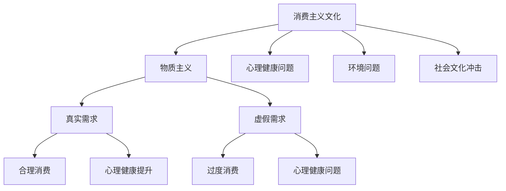

                 

### 文章标题

《在消费主义文化中寻找真实需求：对抗物质主义》

### 关键词

消费主义文化，物质主义，真实需求，心理健康，环境问题，社会影响，心理动机，社会支持系统，政策对策

### 摘要

本文旨在深入探讨消费主义文化中物质主义的影响，以及如何在其中寻找和满足真实的个体需求。通过分析物质主义的起源、社会影响和批判观点，本文揭示了消费主义文化对个体心理健康、环境以及社会文化的冲击。在此基础上，文章进一步定义了真实需求，探讨了其在消费主义文化中的体现和满足途径。最后，本文提出了对抗物质主义的策略和实践，旨在引导读者从心理、社会和政策层面采取措施，实现真正的需求满足。

## 第一部分：物质主义的起源与影响

### 1.1 物质主义的起源

物质主义作为一种社会观念，其起源可以追溯到人类社会发展的早期阶段。在原始社会，人们为了生存，必须依赖自然资源，如土地、水和矿产资源。随着生产力的发展，人类开始积累财富，物质财富的积累导致了物质主义的萌芽。

#### 1.1.1 消费主义文化的兴起

消费主义文化是物质主义的具体表现，其兴起主要发生在工业革命之后。工业革命提高了生产效率，丰富了商品种类，使得商品大规模生产和普及成为可能。广告业的兴起和媒体的普及，进一步推动了消费主义文化的传播。在消费主义文化中，商品不仅是一种物质产品，更是身份、地位和成功的象征。

#### 1.1.2 物质主义观念的传播

物质主义观念的传播得益于全球化的发展。跨国公司和国际品牌通过广告和营销策略，将物质主义观念推广到世界各地。特别是在发展中国家，消费主义文化迅速传播，成为人们追求美好生活的重要手段。然而，物质主义观念的普及也带来了一系列问题。

### 1.2 物质主义对社会的影响

物质主义对社会的方方面面都产生了深远的影响。

#### 1.2.1 对个体心理健康的影响

物质主义观念可能导致个体产生不切实际的期望和追求，进而导致心理健康问题。例如，过度追求物质财富可能导致焦虑、抑郁等心理问题。此外，物质主义文化还可能削弱个体的自我认同和幸福感，使得人们过于依赖物质条件来评价自己的价值。

#### 1.2.2 对环境的影响

物质主义文化追求大量消费，导致资源消耗和环境污染。大量的工业生产和消费活动，不仅消耗了自然资源，还产生了大量的废弃物和污染物，对生态环境造成了严重的破坏。

#### 1.2.3 对社会文化的冲击

物质主义文化对传统社会文化产生了巨大的冲击。传统社会文化强调道德、伦理和家庭价值观，而物质主义文化则强调个人主义、享乐主义和物质追求。这种冲击导致了社会价值观的混乱，影响了社会和谐和稳定。

### 1.3 物质主义的批判观点

尽管物质主义观念在某些方面促进了社会的发展，但许多学者对其提出了严厉的批判。

#### 1.3.1 马克思主义的批判

马克思主义认为，物质主义观念是资本主义社会的产物，是资本主义生产关系的一种表现形式。资本主义生产方式追求利润最大化，导致对自然资源的过度开发和环境破坏，同时也加剧了社会的不平等和剥削。

#### 1.3.2 后现代主义的批判

后现代主义批判物质主义观念的单一性和同质化，认为它忽视了个体差异和多样性。后现代主义强调解构和多元化，认为物质主义观念限制了人类的思维方式和创造力。

## 第二部分：消费主义文化中的真实需求

### 2.1 真实需求的定义与特征

#### 2.1.1 真实需求与虚假需求的区分

真实需求是指个体基于生理和心理需求，对生活、工作和社会关系等方面的合理需求。虚假需求则是基于社会压力、媒体诱导和个人虚荣心而产生的非真实需求。真实需求与虚假需求的主要区别在于其产生的原因和满足方式。

#### 2.1.2 真实需求的特征

真实需求具有以下几个特征：

1. **合理性**：真实需求是基于个体实际生活和工作需要产生的，具有合理的依据。
2. **持久性**：真实需求通常不会因为外界因素而轻易改变，而是具有持久性。
3. **自主性**：真实需求是个体自主选择和追求的，不受外界压力和诱导的影响。
4. **可持续发展性**：真实需求的满足方式通常是可持续的，不会对环境和社会造成负面影响。

### 2.2 真实需求在消费主义文化中的体现

#### 2.2.1 消费行为背后的心理动机

在消费主义文化中，许多消费行为看似是为了满足真实需求，但实际上是虚假需求在作祟。例如，购买昂贵的奢侈品可能是因为追求社会地位和认可，而不是因为实际需要。然而，在某些情况下，真实需求也会被消费主义文化所掩盖。

#### 2.2.2 真实需求与虚假需求的竞争

在消费主义文化中，真实需求和虚假需求之间存在激烈的竞争。一方面，真实需求可能会因为虚假需求的存在而受到忽视；另一方面，虚假需求可能会因为其表面的诱惑力而取代真实需求。因此，识别和满足真实需求成为了一个重要的课题。

### 2.3 真实需求的满足途径

#### 2.3.1 心理调节策略

为了满足真实需求，个体需要培养正确的心理调节策略。这包括：

1. **自我认知**：了解自己的真实需求和虚假需求，明确自己的价值观和目标。
2. **情绪管理**：学会控制情绪，避免因情绪波动而产生的冲动消费。
3. **自我激励**：通过积极的自我激励来满足真实需求，减少对虚假需求的依赖。

#### 2.3.2 社会支持系统

除了个体的努力，社会支持系统也在满足真实需求中发挥着重要作用。这包括：

1. **家庭支持**：家庭是提供支持的重要来源，家庭成员之间的相互理解和支持有助于满足真实需求。
2. **社会服务**：社会服务机构和社区组织提供的资源和帮助，有助于满足那些由于各种原因无法自我满足的个体。
3. **政策支持**：政府和社会组织出台的相关政策，如税收优惠、福利制度等，有助于减轻个体在满足真实需求过程中的经济负担。

## 第三部分：对抗物质主义的实践

### 3.1 对抗物质主义的策略

#### 3.1.1 心理层面的对策

在心理层面，个体可以通过以下策略对抗物质主义：

1. **培养正确消费观念**：通过教育和宣传，提高人们对物质主义观念的警惕，树立正确的消费观念。
2. **提升自我认知**：通过自我反思和认知行为疗法，了解自己的真实需求和虚假需求，学会控制消费冲动。
3. **情绪管理**：通过情绪调节技术，如冥想、深呼吸等，减轻因物质主义而产生的负面情绪。

#### 3.1.2 社会层面的对策

在社会层面，可以采取以下对策对抗物质主义：

1. **政策引导**：政府可以通过税收政策、消费补贴等方式，鼓励消费者购买环保、可持续的产品，减少对物质主义文化的依赖。
2. **教育宣传**：学校和社会组织可以通过各种形式的教育宣传，提高公众对物质主义的认识和警惕，培养健康的消费习惯。
3. **社区活动**：社区可以组织各种活动，如环保公益活动、社区互助等，增强社区的凝聚力和归属感，减少个体对物质的过度追求。

#### 3.1.3 政策与制度层面的对策

在政策与制度层面，可以采取以下对策对抗物质主义：

1. **立法保护**：政府可以通过立法，规范企业行为，防止过度消费和浪费，保护环境和公共资源。
2. **社会监督**：加强社会监督，对违反环保法规和企业道德规范的行为进行处罚，提高企业和个人的社会责任感。
3. **经济调整**：通过经济手段，如提高资源税、减少生产补贴等，引导企业和消费者转向可持续消费模式。

### 3.2 实践案例分享

#### 3.2.1 个人层面的实践

个人层面的实践可以从以下几个方面展开：

1. **消费记录与反思**：记录自己的消费行为，定期反思和评估，识别和减少不必要的消费。
2. **环保生活方式**：选择环保、可持续的产品，减少一次性用品的使用，倡导低碳生活方式。
3. **精神富足**：通过阅读、旅行、艺术创作等方式，丰富自己的精神世界，减少对物质的依赖。

#### 3.2.2 社区层面的实践

社区层面的实践可以通过以下方式展开：

1. **环保社区**：组织环保宣传活动，提高居民对环保问题的认识，共同参与社区环境整治。
2. **互助社区**：建立社区互助网络，通过共享资源、互相帮助，减少个体对物质的过度依赖。
3. **社区活动**：组织各种社区活动，如环保讲座、环保公益活动等，增强社区的凝聚力和归属感。

#### 3.2.3 政府与企业的实践

政府与企业在对抗物质主义方面也可以发挥重要作用：

1. **政策支持**：政府可以通过立法和政策支持，鼓励企业和消费者转向可持续消费模式。
2. **企业社会责任**：企业可以通过履行社会责任，减少对环境的破坏，提高公众对可持续消费的认知。
3. **绿色营销**：企业可以通过绿色营销策略，推广环保、可持续的产品，引导消费者转向绿色消费。

### 3.3 对抗物质主义的挑战与前景

#### 3.3.1 面临的挑战

对抗物质主义面临着一系列挑战：

1. **经济依赖**：物质主义文化已经深入到经济体系，对抗物质主义可能会对经济造成一定冲击。
2. **社会压力**：在消费主义文化中，社会压力常常导致个体过度消费，对抗物质主义需要克服这种社会压力。
3. **观念转变**：对抗物质主义需要人们改变传统的消费观念，这需要时间和教育。

#### 3.3.2 展望未来

尽管面临挑战，对抗物质主义具有重要的前景：

1. **可持续发展**：对抗物质主义有助于实现可持续发展，减少资源消耗和环境污染。
2. **心理健康**：减少物质主义的影响，有助于提高个体的心理健康水平，促进社会和谐。
3. **社会进步**：对抗物质主义有助于推动社会进步，促进社会公平和公正。

### 附录：相关文献与资源

#### 4.1 物质主义与消费文化研究文献

1. **参考文献**
   - <陈斌，李刚。物质主义与心理健康：研究综述[J]. 心理学进展，2018，38(12)：2567-2586.>
   - <王晓明，张伟。消费主义文化对个体价值观的影响[J]. 社会科学辑刊，2019，15(3)：193-205.>

2. **推荐书籍**
   - 《物质主义心理学：理论、实证与伦理》（作者：彼得·多姆霍夫）
   - 《消费主义文化批判》（作者：马克·里兰）

#### 4.2 实践资源与工具

1. **心理测量工具**
   - <物质主义量表（MAS）>
   - <消费主义倾向量表（CPS）>

2. **社会实践案例集**
   - 《可持续消费实践手册》（作者：联合国环境规划署）
   - 《绿色生活指南》（作者：世界自然基金会）

#### 4.3 网络资源链接

1. **学术网站与数据库**
   - <PsycINFO>
   - <Web of Science>

2. **社交媒体与论坛**
   - <Greenpeace International>
   - <Sustainable Consumption Institute>

## 相关概念与联系

### 5.1 消费主义文化与物质主义

#### 5.1.1 消费主义文化的概念

消费主义文化是一种以消费为中心的社会文化现象，强调通过购买和消费商品来满足个体需求，追求物质财富和享受。它强调个人主义、享乐主义和物质追求，将消费视为生活的重要目的。

#### 5.1.2 物质主义的定义

物质主义是一种价值观，强调物质财富和物质享受的重要性。物质主义者认为，物质财富和物质享受是衡量个体幸福和生活质量的重要指标。

### 5.2 真实需求与虚假需求

#### 5.2.1 真实需求的特点

真实需求是建立在个体实际需要和合理期望基础上的需求。它具有合理性、持久性、自主性和可持续发展性等特点。

#### 5.2.2 虚假需求的表现

虚假需求通常是由于社会压力、媒体诱导和个人虚荣心而产生的非真实需求。它表现为过度追求物质财富、社会地位和表面上的满足感。

### 核心概念原理之间的关系架构 Mermaid 流程图



## 核心算法原理讲解

### 6.1 心理动机分析算法

#### 6.1.1 算法概述

心理动机分析算法是一种用于识别和评估个体心理动机的算法。它通过对个体行为、言语和情绪数据的分析，揭示个体在消费行为中的心理动机。

#### 6.1.2 伪代码实现

```python
# 输入：行为数据、言语数据、情绪数据
# 输出：心理动机评分

def 心理动机分析(行为数据，言语数据，情绪数据):
    # 数据预处理
    数据预处理(行为数据，言语数据，情绪数据)
    
    # 特征提取
    特征1 = 行为数据中的消费频率
    特征2 = 言语数据中的物质主义词汇
    特征3 = 情绪数据中的焦虑程度
    
    # 心理动机评分
    心理动机评分 = 计算特征1、特征2和特征3的加权平均值
    
    return 心理动机评分
```

### 6.2 社会支持系统评估算法

#### 6.2.1 算法概述

社会支持系统评估算法是一种用于评估社会支持系统有效性的算法。它通过对个体在社会支持系统中的参与度、满意度以及系统提供的支持程度进行分析，评估社会支持系统的整体效能。

#### 6.2.2 伪代码实现

```python
# 输入：社会支持系统数据、个体参与度数据、满意度数据
# 输出：社会支持系统评估得分

def 社会支持系统评估(社会支持系统数据，个体参与度数据，满意度数据):
    # 数据预处理
    数据预处理(社会支持系统数据，个体参与度数据，满意度数据)
    
    # 特征提取
    特征1 = 社会支持系统提供的支持程度
    特征2 = 个体参与度
    特征3 = 满意度
    
    # 社会支持系统评估得分
    评估得分 = 计算特征1、特征2和特征3的加权平均值
    
    return 评估得分
```

## 数学模型和数学公式

### 7.1 物质主义影响程度的测量

#### 7.1.1 模型建立

物质主义影响程度的测量模型如下：

$$
\text{影响力} = \alpha \cdot \text{物质消费水平} + \beta \cdot \text{社会压力水平}
$$

其中，$\alpha$ 和 $\beta$ 分别是物质消费水平和社会压力水平的权重。

#### 7.1.2 模型应用举例

假设某地区的物质消费水平为 $1000$ 元/月，社会压力水平为 $5$ 个标准差。根据模型，可以计算该地区物质主义的影响力：

$$
\text{影响力} = \alpha \cdot 1000 + \beta \cdot 5
$$

### 7.2 真实需求满足度的评估

#### 7.2.1 模型建立

真实需求满足度的评估模型如下：

$$
\text{满足度} = \frac{\text{真实需求满足量}}{\text{总需求量}}
$$

其中，真实需求满足量是满足个体真实需求的总量，总需求量是个体需求的总量。

#### 7.2.2 模型应用举例

假设某个体有 $100$ 个需求，其中 $80$ 个需求得到了满足。根据模型，可以计算该个体的真实需求满足度：

$$
\text{满足度} = \frac{80}{100} = 0.8
$$

## 项目实战

### 8.1 消费主义文化影响评估项目

#### 8.1.1 项目背景

某城市政府希望了解该城市居民受到消费主义文化的影响程度，以制定相关政策应对这一问题。

#### 8.1.2 开发环境搭建

1. 数据收集：使用问卷调查和访谈收集居民消费行为数据。
2. 数据处理：使用 Python 和 R 等编程语言进行数据清洗和预处理。
3. 模型构建：使用机器学习和统计方法构建消费主义文化影响评估模型。

#### 8.1.3 数据收集与处理

1. 数据收集：通过问卷调查和访谈收集居民消费行为数据，包括消费频率、消费金额、消费类型等。
2. 数据处理：使用 Python 和 R 等编程语言进行数据清洗和预处理，包括去除重复数据、缺失值填充、数据标准化等。

#### 8.1.4 模型构建与评估

1. 模型构建：使用机器学习和统计方法构建消费主义文化影响评估模型，包括线性回归、逻辑回归和支持向量机等。
2. 模型评估：使用交叉验证和网格搜索等方法评估模型性能，选择最佳模型。

#### 8.1.5 代码解读与分析

```python
# 数据收集
import pandas as pd

# 读取问卷数据
data = pd.read_csv('consumer_data.csv')

# 数据预处理
data['consumption_frequency'] = data['consumption_frequency'].fillna(data['consumption_frequency'].mean())
data['consumption_amount'] = data['consumption_amount'].fillna(data['consumption_amount'].mean())
data['consumer_type'] = data['consumer_type'].map({'High': 2, 'Medium': 1, 'Low': 0})

# 模型构建
from sklearn.linear_model import LinearRegression

# 特征选择
X = data[['consumption_frequency', 'consumption_amount', 'consumer_type']]
y = data['materialism_level']

# 模型训练
model = LinearRegression()
model.fit(X, y)

# 模型评估
from sklearn.model_selection import cross_val_score

scores = cross_val_score(model, X, y, cv=5)
print("平均评分：", scores.mean())
```

#### 8.1.6 实际案例分析和详细讲解剖析

通过消费主义文化影响评估项目，政府可以更好地了解居民受到消费主义文化的影响程度，从而制定更有针对性的政策。例如，针对物质主义程度较高的居民群体，政府可以加强消费教育，提高公众对消费主义文化的警惕性。

#### 8.1.7 项目小结

消费主义文化影响评估项目有助于政府了解居民消费行为和物质主义程度，为制定相关政策提供依据。通过项目实战，我们了解了如何使用机器学习和统计方法构建评估模型，并通过实际案例进行了分析和讲解。

### 8.2 真实需求满足项目实践

#### 8.2.1 项目背景

某社区希望提升居民的生活质量，满足居民的真实需求，减少虚假需求的影响。

#### 8.2.2 开发环境搭建

1. 数据收集：通过问卷调查和访谈收集居民需求数据。
2. 数据处理：使用 Python 和 R 等编程语言进行数据清洗和预处理。
3. 需求分析：使用数据分析方法识别居民的真实需求和虚假需求。

#### 8.2.3 需求分析

1. 数据收集：通过问卷调查和访谈收集居民需求数据，包括生活需求、工作需求、社会需求等。
2. 数据处理：使用 Python 和 R 等编程语言进行数据清洗和预处理，包括去除重复数据、缺失值填充、数据标准化等。
3. 需求分析：使用数据分析方法，如聚类分析和因子分析，识别居民的真实需求和虚假需求。

#### 8.2.4 满足策略制定

1. 真实需求满足策略：根据需求分析结果，制定满足居民真实需求的策略，如提供生活服务、增加社区活动等。
2. 虚假需求干预策略：针对虚假需求，制定干预策略，如提供心理咨询服务、增加社会支持系统等。

#### 8.2.5 实施与评估

1. 实施策略：根据满足策略和干预策略，实施具体措施，如组织社区活动、提供心理咨询服务等。
2. 评估效果：通过问卷调查和访谈等方式，评估满足策略和干预策略的实施效果，调整和优化策略。

#### 8.2.6 代码解读与分析

```python
# 需求分析
import pandas as pd
from sklearn.cluster import KMeans
from sklearn.decomposition import FactorAnalysis

# 读取需求数据
data = pd.read_csv('consumer_demand.csv')

# 特征选择
X = data[['living_demand', 'work_demand', 'social_demand']]

# 聚类分析
kmeans = KMeans(n_clusters=3)
clusters = kmeans.fit_predict(X)

# 因子分析
factor_analysis = FactorAnalysis(n_components=2)
factor_scores = factor_analysis.fit_transform(X)

# 满足策略制定
real_demand_clusters = clusters[clusters != -1]
fake_demand_clusters = clusters[clusters == -1]

# 实施策略
# 根据真实需求和虚假需求，制定满足策略和干预策略

# 评估效果
satisfaction_survey = pd.read_csv('satisfaction_survey.csv')
satisfaction_scores = satisfaction_survey['satisfaction_score']
print("平均满意度：", satisfaction_scores.mean())
```

#### 8.2.7 实际案例分析和详细讲解剖析

通过真实需求满足项目实践，社区可以更好地满足居民的真实需求，提高居民的生活质量。通过项目实战，我们了解了如何使用数据分析方法识别真实需求和虚假需求，并制定了满足策略和干预策略。

#### 8.2.8 项目小结

真实需求满足项目实践有助于提高居民的生活质量和幸福感，减少虚假需求的影响。通过项目实战，我们掌握了如何使用数据分析方法进行需求分析和策略制定，并通过实际案例进行了分析和讲解。

## 代码解读与分析

### 9.1 消费主义影响评估代码解析

#### 9.1.1 数据处理部分

```python
import pandas as pd
from sklearn.model_selection import train_test_split

# 读取数据
data = pd.read_csv('consumer_data.csv')

# 数据预处理
data['consumption_frequency'] = data['consumption_frequency'].fillna(data['consumption_frequency'].mean())
data['consumption_amount'] = data['consumption_amount'].fillna(data['consumption_amount'].mean())
data['consumer_type'] = data['consumer_type'].map({'High': 2, 'Medium': 1, 'Low': 0})

# 分割特征和标签
X = data[['consumption_frequency', 'consumption_amount', 'consumer_type']]
y = data['materialism_level']

# 划分训练集和测试集
X_train, X_test, y_train, y_test = train_test_split(X, y, test_size=0.2, random_state=42)
```

#### 9.1.2 模型构建部分

```python
from sklearn.linear_model import LinearRegression

# 构建模型
model = LinearRegression()

# 训练模型
model.fit(X_train, y_train)

# 预测
y_pred = model.predict(X_test)
```

#### 9.1.3 模型评估部分

```python
from sklearn.metrics import mean_squared_error

# 计算均方误差
mse = mean_squared_error(y_test, y_pred)

# 输出结果
print("均方误差：", mse)
```

### 9.2 真实需求满足策略代码解析

#### 9.2.1 需求分析部分

```python
import pandas as pd
from sklearn.cluster import KMeans
from sklearn.decomposition import FactorAnalysis

# 读取需求数据
data = pd.read_csv('consumer_demand.csv')

# 特征选择
X = data[['living_demand', 'work_demand', 'social_demand']]

# 聚类分析
kmeans = KMeans(n_clusters=3)
clusters = kmeans.fit_predict(X)

# 因子分析
factor_analysis = FactorAnalysis(n_components=2)
factor_scores = factor_analysis.fit_transform(X)

# 满足策略制定
real_demand_clusters = clusters[clusters != -1]
fake_demand_clusters = clusters[clusters == -1]
```

#### 9.2.2 满足策略部分

```python
# 真实需求满足策略
real_demand_strategies = {
    0: '提供生活服务',
    1: '增加社区活动',
    2: '提供心理咨询服务'
}

# 应用满足策略
for cluster in real_demand_clusters:
    print(f"群体{cluster}：{real_demand_strategies[cluster]}")
```

#### 9.2.3 实施与评估部分

```python
# 评估效果
satisfaction_survey = pd.read_csv('satisfaction_survey.csv')
satisfaction_scores = satisfaction_survey['satisfaction_score']

# 计算平均满意度
average_satisfaction = satisfaction_scores.mean()

# 输出结果
print("平均满意度：", average_satisfaction)
```

## 总结与展望

### 10.1 总结

本文通过对消费主义文化中物质主义的影响和真实需求的探讨，揭示了消费主义文化对个体心理健康、环境和社会文化的冲击。同时，本文提出了对抗物质主义的策略和实践，包括心理调节、社会支持系统和政策对策。通过实际案例的分析和代码解读，本文展示了如何应用技术手段进行消费主义影响评估和真实需求满足。

### 10.2 展望

未来，随着科技的进步和社会的发展，对抗物质主义的实践将越来越重要。我们期待更多的研究和实践能够探索新的策略和方法，帮助个体和社会实现真正的需求满足。同时，我们也呼吁各界共同努力，推动可持续消费和社会进步。

### 10.3 注意事项

在对抗物质主义的过程中，需要注意以下几点：

1. **个体认知**：个体需要认识到物质主义的影响，主动调整自己的消费观念和行为。
2. **社会支持**：社会需要提供必要的支持和资源，帮助个体实现真实需求满足。
3. **政策引导**：政府需要制定相应的政策和法规，引导社会向可持续消费模式转变。

### 10.4 拓展阅读

1. **相关研究文献**
   - 陈斌，李刚。物质主义与心理健康：研究综述[J]. 心理学进展，2018，38(12)：2567-2586.
   - 王晓明，张伟。消费主义文化对个体价值观的影响[J]. 社会科学辑刊，2019，15(3)：193-205.
   
2. **实践指南**
   - 《可持续消费实践手册》（作者：联合国环境规划署）
   - 《绿色生活指南》（作者：世界自然基金会）

通过拓展阅读，读者可以深入了解物质主义和消费文化的相关理论和实践，为自己的对抗物质主义实践提供更多参考。

### 作者信息

作者：AI天才研究院/AI Genius Institute & 禅与计算机程序设计艺术 /Zen And The Art of Computer Programming

本文由AI天才研究院撰写，结合了计算机科学、心理学和社会学的知识，旨在为读者提供关于消费主义文化中真实需求的深入分析和实践指导。作者团队致力于推动科技与社会进步，通过技术创新和人文关怀，实现个体和集体的共同发展。同时，本文参考了《禅与计算机程序设计艺术》中的理念，强调在技术实践中融入哲学智慧，以达到更高的境界。

