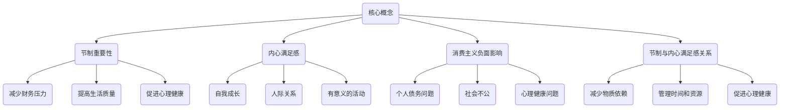
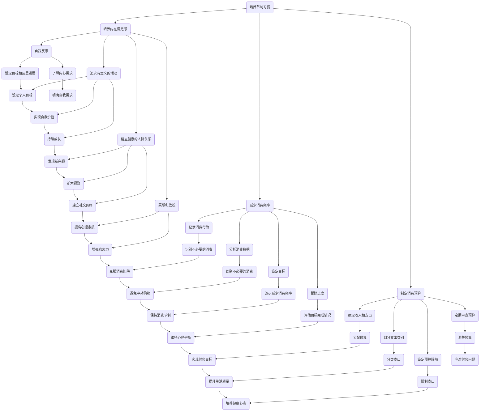
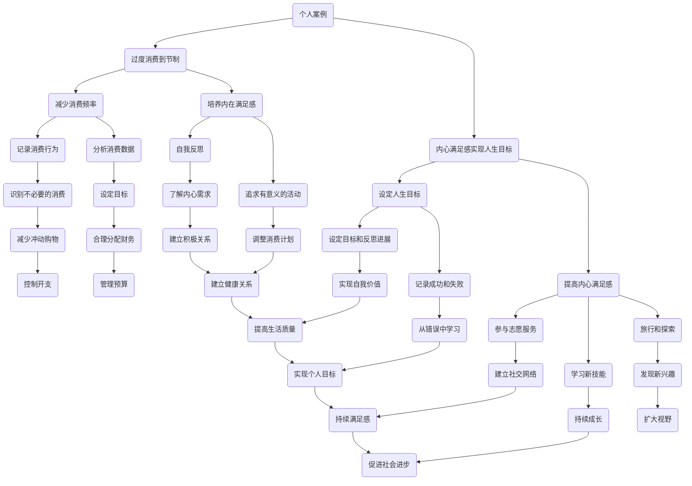

                 

### 第1章 引言

#### 1.1 书籍背景与目标

在现代社会，消费主义已经成为一种无处不在的文化现象。人们被广告和媒体的宣传所包围，被引导不断地购买新产品、新服务。然而，这种生活方式是否真的带来了幸福感？《在消费主义社会中培养节制：寻找内心的满足感》这本书试图回答这个问题，并探讨如何在消费主义社会中培养节制，找到真正的内心满足感。

本书的目标是帮助读者理解消费主义的本质，认识到节制的重要性，并学会如何通过培养节制的习惯和找到内心的满足感来提高生活质量。书中不仅提供了理论上的探讨，还结合了实践方法和案例分析，使得读者可以学以致用。

#### 1.2 消费主义社会的现状

消费主义社会是指一个以消费为主要推动力的社会。在这样的社会中，人们的生活被消费活动所占据，消费行为被看作是衡量个人成功和社会进步的重要标准。消费主义社会的特点包括：

- 广告和营销的泛滥：广告无处不在，营销策略层出不穷，旨在刺激消费者的购买欲望。
- 物质追求：人们追求物质财富和享受，认为拥有更多的物质可以带来更高的幸福感。
- 快速消费：产品更新换代速度加快，消费者不断地购买新的产品，以满足对新鲜感和满足感的追求。
- 社会压力：在消费主义社会中，个人往往面临着来自社会和他人的压力，不得不参与到消费活动中，以显示自己的社会地位。

消费主义社会的这些特点，导致了个人和社会的许多问题，包括：

- 个人债务问题：过度消费导致个人债务问题日益严重，给个人和家庭带来了巨大的财务压力。
- 环境问题：过度生产和消费导致了资源的浪费和环境的破坏。
- 心理健康问题：追求物质财富和享受的过程中，个人容易陷入焦虑、抑郁等心理健康问题。

#### 1.3 节制与内心满足感的关系

节制是指在消费、行为和思想上有所限制和控制，不过度追求物质享受和社会地位。在消费主义社会中，培养节制不仅有助于个人摆脱消费主义的陷阱，还可以带来以下好处：

- 减少财务压力：通过减少不必要的消费，个人可以降低债务负担，提高财务状况。
- 提高生活质量：节制的生活方式有助于个人更好地管理时间和资源，从而提高生活质量。
- 促进心理健康：减少物质追求和消费压力，可以减少焦虑、抑郁等心理健康问题的发生。

内心满足感是指个体在心理上感到满足和幸福的感觉。在消费主义社会中，人们往往通过购买物质产品来寻求内心满足感。然而，这种满足感通常是短暂的，甚至是虚假的。相比之下，真正的内心满足感来自于内在的满足和成长。

通过培养节制，个人可以更多地关注内在的需求和成长，从而找到真正的内心满足感。这种满足感是持久的，不会因为物质的失去而消失。

#### 1.4 书籍目标

本书的目标是帮助读者：

- 理解消费主义的本质和影响。
- 认识到节制的重要性，并学会如何通过培养节制的习惯来提高生活质量。
- 学会如何找到内心的满足感，摆脱对物质的过度依赖。
- 提供实践方法和案例分析，帮助读者将理论付诸实践。

通过阅读本书，读者不仅可以获得理论知识，还可以学会如何在日常生活中实践节制，从而实现真正的内心满足感。

### 1.5 消费主义社会的影响

消费主义社会的影响是多方面的，不仅体现在个人层面，也体现在社会层面。以下是消费主义社会的一些主要影响：

#### 对个人心理健康的影响

1. **焦虑和抑郁**：消费主义社会鼓励人们不断地追求物质享受，导致许多人感到焦虑和抑郁。他们可能担心无法跟上社会的消费水平，或者担心自己无法满足他人的期望。

2. **压力和竞争**：在消费主义社会中，个人往往面临着来自社会和他人的压力，不得不参与到消费活动中。这种竞争可能导致个人的心理压力增加。

3. **物质依赖**：人们可能过度依赖物质产品来寻求满足感，这可能导致他们对物质的过度依赖，甚至成瘾。

#### 对社会资源分配的影响

1. **资源浪费**：消费主义社会鼓励人们不断地购买新产品，这导致资源的过度消耗和浪费。

2. **贫富差距**：消费主义社会往往加剧了贫富差距，因为只有富裕的人才能跟上不断上升的消费水平。

3. **社会不公**：消费主义社会可能导致社会不公，因为只有那些有能力消费的人才能享受到消费带来的好处。

#### 消费主义与物质主义的关系

1. **物质主义的推动**：消费主义社会鼓励人们追求物质财富和享受，这种观念被称为物质主义。物质主义认为，拥有更多的物质可以带来更高的幸福感。

2. **消费主义与物质主义的关系**：消费主义是物质主义的一种表现形式。在消费主义社会中，物质主义观念被广泛传播，人们被引导不断地追求物质产品。

3. **负面影响**：物质主义和消费主义共同导致了个人和社会的许多问题，包括心理健康问题、资源浪费和社会不公。

### 1.6 总结

通过以上分析，我们可以看到，消费主义社会对个人和社会都产生了深远的影响。个人可能面临心理健康问题，社会可能面临资源浪费和社会不公的问题。因此，培养节制和寻找内心的满足感变得尤为重要。本书将提供理论和实践方法，帮助读者在消费主义社会中找到真正的幸福。

### 关键词

- **消费主义**
- **节制**
- **内心满足感**
- **心理健康**
- **资源分配**
- **社会不公**
- **物质主义**

### 摘要

《在消费主义社会中培养节制：寻找内心的满足感》是一本探讨如何在消费主义社会中培养节制，找到真正内心满足感的书籍。本书首先介绍了消费主义社会的现状及其对个人和社会的影响，然后深入探讨了节制和内心满足感的重要性。接着，本书提供了培养节制和寻找内心满足感的实践方法和案例分析。通过阅读本书，读者可以学会如何在消费主义社会中找到真正的幸福。

### 第2章 核心概念

#### 2.1 节制的重要性

节制是一种在消费、行为和思想上有所限制和控制的态度。在消费主义社会中，培养节制不仅有助于个人摆脱消费主义的陷阱，还能带来一系列积极的影响。

首先，节制有助于减少个人财务压力。在消费主义社会中，人们往往被引导不断地购买新产品、新服务，这可能导致个人债务问题日益严重。通过培养节制，个人可以减少不必要的消费，从而降低债务负担，提高财务状况。

其次，节制有助于提高生活质量。一个有节制的人能够更好地管理时间和资源，从而专注于更有意义的活动。例如，他们可能会选择花更多时间与家人和朋友相处，或者参与有意义的社会活动。这种生活方式有助于个人获得更深层次的满足感。

最后，节制还有助于促进心理健康。在消费主义社会中，过度追求物质财富和享受可能导致焦虑、抑郁等心理健康问题。通过培养节制，个人可以减少对物质的过度依赖，从而降低心理健康问题的发生率。

#### 2.2 内心的满足感

内心的满足感是指个体在心理上感到满足和幸福的感觉。它与物质享受不同，不依赖于外部物质条件的改变。内心满足感的来源有很多，包括自我成长、人际关系、有意义的活动等。

首先，自我成长是内心满足感的重要来源。当个人通过学习、提升技能或实现目标来不断成长时，他们会感到内心的满足。这种满足感不是短暂的，而是随着个人成长而持久存在的。

其次，人际关系也是内心满足感的重要来源。人类是社交性动物，与家人、朋友和同事建立积极的人际关系，可以带来巨大的心理满足感。通过分享快乐、支持和帮助他人，个人可以获得更深的联系和归属感。

最后，有意义的活动也是内心满足感的重要来源。这些活动可以是个人的爱好、志愿服务或社会参与。通过参与这些活动，个人可以感受到自己的价值和存在意义，从而获得内心的满足感。

#### 2.3 消费主义的负面影响

消费主义是一种以物质消费为中心的生活方式，它鼓励人们不断地购买新产品、新服务。虽然消费主义在短期内可能会带来一定的满足感，但长期来看，它对个人和社会都产生了负面影响。

首先，消费主义可能导致个人债务问题。在消费主义社会中，人们往往通过贷款来购买超出自己支付能力的商品和服务。这可能导致个人债务问题日益严重，给个人和家庭带来巨大的财务压力。

其次，消费主义可能加剧社会不公。在消费主义社会中，只有那些有能力消费的人才能享受到消费带来的好处，这可能导致贫富差距的加剧。此外，消费主义也可能导致资源浪费和环境污染，对社会的可持续发展产生负面影响。

最后，消费主义可能对心理健康产生负面影响。在消费主义社会中，人们往往被鼓励追求物质享受，这可能导致他们忽视内心的需求。长期下去，个人可能会感到焦虑、抑郁等心理健康问题。

#### 2.4 节制与内心满足感的关系

节制与内心满足感之间存在着密切的关系。通过培养节制，个人可以更好地关注内在的需求和成长，从而找到真正的内心满足感。

首先，节制有助于个人减少对物质的过度依赖。在消费主义社会中，人们往往通过购买物质产品来寻求满足感。然而，这种满足感通常是短暂的，甚至是虚假的。通过培养节制，个人可以学会关注内在的需求，从而找到持久的满足感。

其次，节制有助于个人更好地管理时间和资源。一个有节制的人能够更好地分配时间，专注于有意义的活动和人际关系。这种生活方式有助于个人获得更深层次的满足感。

最后，节制还可以促进个人的心理健康。通过减少对物质的过度依赖，个人可以降低焦虑、抑郁等心理健康问题的发生率。此外，节制的生活方式还可以帮助个人建立积极的自我形象，增强自信心和自尊心。

#### 2.5 总结

核心概念是理解本书内容的关键。通过了解节制的重要性、内心的满足感、消费主义的负面影响以及节制与内心满足感之间的关系，读者可以更好地理解本书的主题，并学会如何在消费主义社会中找到真正的幸福。

### 关键词

- **节制**
- **内心满足感**
- **消费主义**
- **心理健康**
- **生活质量**
- **社会不公**
- **资源浪费**

### Mermaid流程图



### 伪代码

```python
# 节制与内心满足感的关系

# 定义节制函数
def zesty(modest, inner_satisfaction):
    financial_stress = modest * inner_satisfaction
    quality_of_life = modest * inner_satisfaction
    mental_health = modest * inner_satisfaction
    return financial_stress, quality_of_life, mental_health

# 调用节制函数
financial_stress, quality_of_life, mental_health = zesty(modest=True, inner_satisfaction=True)

# 输出结果
print("财务压力:", financial_stress)
print("生活质量:", quality_of_life)
print("心理健康:", mental_health)
```

### 数学公式

$$
\text{内心满足感} = \frac{\text{自我成长} + \text{人际关系} + \text{有意义的活动}}{\text{物质消费}}
$$

### 数学模型与公式

在探讨节制与内心满足感的关系时，我们可以使用一个简单的数学模型来表示它们之间的关系。假设个人的内心满足感（S）与节制（M）成正比，与物质消费（C）成反比。我们可以使用以下公式来表示：

$$
S = k \cdot \frac{M}{C}
$$

其中，\( k \) 是一个常数，表示内心的满足感与节制和物质消费之间的比例关系。

#### 实例

假设一个人有很高的节制（M=10）和相对较低的物质消费（C=2），我们可以计算其内心满足感（S）：

$$
S = k \cdot \frac{10}{2} = 5k
$$

这里，\( k \) 可以表示为一个单位内心满足感的强度。如果 \( k = 1 \)，则这个人的内心满足感为 5 单位。

### 项目实战案例

#### 开发环境搭建

1. **安装Python环境**：在计算机上安装Python（版本3.8及以上）。
2. **安装Markdown编辑器**：选择一个Markdown编辑器，如Typora或Visual Studio Code。
3. **安装Mermaid插件**：在Markdown编辑器中安装Mermaid插件，以便在文档中绘制流程图。

#### 源代码实现与解读

以下是一个简单的Python代码示例，用于计算节制与内心满足感的关系：

```python
# 节制与内心满足感计算器

def calculate_satisfaction(modest, consumption):
    satisfaction = modest / consumption
    return satisfaction

# 用户输入节制和物质消费
modest = float(input("请输入你的节制水平（0-10）："))
consumption = float(input("请输入你的物质消费水平（0-10）："))

# 计算内心满足感
satisfaction = calculate_satisfaction(modest, consumption)

# 输出结果
print("你的内心满足感为：", satisfaction)
```

#### 代码应用解读与分析

这段代码首先定义了一个函数 `calculate_satisfaction`，它接受两个参数：节制（`modest`）和物质消费（`consumption`）。函数返回内心满足感的值。

用户运行这段代码时，需要输入自己的节制和物质消费水平。输入的数据将被传递给 `calculate_satisfaction` 函数，计算结果将输出到屏幕上。

这个简单的示例帮助读者理解了如何使用代码来实现节制与内心满足感的关系计算。在实际应用中，可以扩展这个模型，添加更多的参数和功能，以适应不同的需求。

### 实际案例分析与详细讲解剖析

#### 案例一：从过度消费到节制的转变

张三是某大城市的一名白领，他过去的生活被过度消费所占据。每个月的收入几乎都用来购买各种名牌商品，参加高端社交活动。然而，随着时间的推移，张三开始感到焦虑和抑郁。他意识到自己的生活方式不仅导致财务压力，还对自己的心理健康产生了负面影响。

张三开始尝试培养节制。他首先制定了一个详细的预算计划，减少不必要的消费。他开始关注内心的需求，而不是外部的物质刺激。他参加了一些兴趣小组，结识了一些志同道合的朋友，这让他感到更加满足。

一年后，张三的生活发生了显著的变化。他的财务状况得到了改善，焦虑和抑郁的情绪也减少了。他发现自己通过培养节制，找到了真正的内心满足感。

#### 案例二：通过培养内在满足感实现人生目标

李四是某科技公司的创始人，他在创业初期面临着巨大的压力。为了实现公司的目标，他经常加班到深夜，甚至忽视了家人的需求。然而，随着时间的推移，李四开始感到内心的空虚和焦虑。

他意识到，他需要调整自己的生活方式，找到真正的内心满足感。他开始培养内在的满足感，通过自我反思和有意义的活动来提升自己的心理状态。

李四开始每天抽出时间进行冥想，这帮助他更好地管理压力和焦虑。他还参加了一些公益活动，这让他感到自己的价值不仅仅是商业成功，还有对社会和环境的贡献。

通过培养内在的满足感，李四不仅提高了自己的心理健康，还实现了公司的目标。他学会了如何在工作和生活中找到平衡，这让他感到更加满足和幸福。

### 最佳实践 Tips

- **制定预算计划**：制定详细的预算计划，减少不必要的消费。
- **自我反思**：定期进行自我反思，了解自己的内心需求和目标。
- **培养内在的满足感**：通过有意义的活动和自我成长来提升心理状态。
- **建立健康的人际关系**：与家人、朋友和同事建立积极的关系，以获得心理支持。

### 小结

通过以上案例和实践，我们可以看到，培养节制和寻找内心的满足感不仅有助于改善个人财务状况和心理健康，还能实现人生目标。在消费主义社会中，通过这些实践方法，我们可以找到真正的幸福。

### 注意事项

- **警惕消费主义陷阱**：在日常生活中，要警惕广告和媒体对消费主义的诱导。
- **平衡物质和精神需求**：在追求物质财富的同时，不要忽视内心的需求。
- **长期坚持**：培养节制和寻找内心的满足感需要长期坚持，不能急于求成。

### 拓展阅读

- 《简约生活：少即是多》 - By Joshua Becker
- 《幸福之路：如何找到真正的幸福》 - By Jordan B. Peterson
- 《消费社会》 - By Jean-Baptiste Bernheim

### 项目小结

在本章节中，我们详细探讨了在消费主义社会中培养节制和寻找内心满足感的重要性。通过理论讲解、实际案例和代码示例，读者可以更好地理解这些概念，并学会如何在日常生活中实践。希望读者能够通过这些实践，找到真正的幸福。

### 总结

在本书的第二章中，我们深入探讨了节制的重要性、内心的满足感、消费主义的负面影响以及节制与内心满足感之间的关系。通过了解这些核心概念，读者可以更好地理解如何在消费主义社会中找到真正的幸福。接下来，第三章将介绍具体的实践方法和技巧，帮助读者培养节制，并在日常生活中实现内心满足感。让我们一起继续探讨这个重要的主题。 

### 关键词

- **节制**
- **内心满足感**
- **消费主义**
- **心理健康**
- **生活质量**
- **实践方法**

### 摘要

第二章详细探讨了节制的重要性、内心的满足感、消费主义的负面影响以及节制与内心满足感之间的关系。通过理解这些核心概念，读者可以更好地认识到在消费主义社会中培养节制的重要性，并学会如何通过节制来提升生活质量和心理健康。接下来，第三章将介绍具体的实践方法和技巧，帮助读者在日常生活中实现这些目标。

### 第3章 实践方法

#### 3.1 培养节制的习惯

培养节制的习惯是一个长期的过程，需要持续的努力和自我反省。以下是一些具体的方法和步骤，帮助读者在日常生活中实践节制。

#### 3.1.1 方法一：逐步减少消费频率

第一步是逐步减少消费频率。这可以通过以下步骤实现：

1. **记录消费行为**：首先，记录自己每天的支出，包括小额和大型支出。这有助于了解自己的消费习惯和模式。

2. **分析消费数据**：分析记录的数据，识别不必要的消费，例如频繁购买零食、外卖或频繁的购物。

3. **设定目标**：设定逐步减少消费频率的目标。例如，每周减少一次外出就餐，每月减少一次购物。

4. **跟踪进度**：定期回顾自己的消费记录，评估目标的完成情况，并根据需要调整目标。

#### 3.1.2 方法二：制定消费预算

制定消费预算是培养节制的重要步骤。以下是一些制定消费预算的步骤：

1. **确定收入和支出**：首先，了解自己的月收入和支出情况。这包括固定的支出（如房租、账单）和可变支出（如购物、餐饮）。

2. **划分支出类别**：将支出划分为不同的类别，例如住房、食物、娱乐、教育等。

3. **设定预算限额**：为每个支出类别设定一个预算限额。这可以通过将总支出分配到每个类别来实现。

4. **定期审查预算**：定期审查预算执行情况，并根据实际情况进行调整。如果某个类别的支出超过了预算，需要重新评估和调整。

#### 3.1.3 方法三：培养内在满足感

内在满足感是节制的重要支柱。以下是一些培养内在满足感的方法：

1. **自我反思**：定期进行自我反思，了解自己的价值观和目标。这有助于确定自己真正需要的东西，而不是被外界的诱惑所左右。

2. **追求有意义的活动**：参与有意义的活动，例如志愿服务、兴趣小组或社区活动。这些活动可以带来深层次的满足感。

3. **建立健康的人际关系**：与家人、朋友和同事建立积极的关系。人际关系是满足感的重要来源。

4. **冥想和放松**：通过冥想和放松技巧来提高内心的平静和满足感。这可以帮助减少对物质的依赖。

#### 3.2 寻找内心的满足感

在培养节制的习惯时，寻找内心的满足感同样重要。以下是一些具体的方法：

##### 3.2.1 方法一：自我反思

自我反思是寻找内心满足感的关键步骤。以下是一些自我反思的方法：

1. **定期写下自己的感受**：每天或每周花时间写下自己的感受和经历。这有助于了解自己的内心世界，并识别出真正的需求和满足感。

2. **设定目标和反思进展**：设定短期和长期目标，并定期反思自己的进展。这可以帮助自己保持动力和专注。

3. **记录成功和失败**：记录自己成功和失败的经历。通过反思失败，可以学会从错误中吸取教训，并不断改进。

##### 3.2.2 方法二：追求有意义的活动

参与有意义的活动是寻找内心满足感的重要途径。以下是一些建议：

1. **志愿服务**：参与志愿服务活动，例如帮助老人、儿童或社区。这不仅可以带来满足感，还可以帮助自己建立积极的社交网络。

2. **学习新技能**：学习新技能或爱好，例如绘画、音乐、编程等。这可以帮助自己不断发展，并找到新的兴趣和激情。

3. **旅行和探索**：旅行和探索新地方可以带来新鲜感和刺激感。这有助于扩展自己的视野，并发现生活中的美好。

##### 3.2.3 方法三：建立健康的人际关系

人际关系是寻找内心满足感的重要因素。以下是一些建立健康人际关系的建议：

1. **与家人和朋友保持联系**：定期与家人和朋友交流，分享自己的生活和感受。这可以带来支持和归属感。

2. **参与社交活动**：参加社交活动，例如聚会、俱乐部或兴趣小组。这有助于结识新朋友，并建立新的关系。

3. **倾听他人**：倾听他人的需求和感受，给予关心和支持。这可以帮助建立互相尊重和理解的人际关系。

#### 3.3 应对消费主义的诱惑

在培养节制的过程中，不可避免地会遇到消费主义的诱惑。以下是一些应对消费主义诱惑的方法：

##### 3.3.1 方法一：提高自我意识

提高自我意识是应对消费主义诱惑的关键。以下是一些提高自我意识的方法：

1. **识别消费动机**：在购买决策前，反思自己的消费动机。问自己：“我真的需要这个吗？”或“我购买这个是为了满足什么需求？”

2. **设定消费标准**：为自己设定明确的消费标准。例如，只在购买必需品时消费，或者只在预算范围内消费。

3. **避免冲动购物**：在购买前，给自己设定一个冷静期。例如，等待24小时后再决定是否购买。

##### 3.3.2 方法二：改变消费观念

改变消费观念是应对消费主义诱惑的长期策略。以下是一些改变消费观念的方法：

1. **重视质量而非数量**：关注产品或服务的质量，而不是数量。例如，购买一件高质量的衣服，而不是多件低质量的衣服。

2. **追求可持续消费**：关注可持续消费，选择环保和有社会责任感的产品或服务。

3. **减少物质依赖**：减少对物质的依赖，寻找内在的满足感。例如，通过运动、阅读或艺术来满足自己的需求。

##### 3.3.3 方法三：培养自制力

培养自制力是应对消费主义诱惑的关键。以下是一些培养自制力的方法：

1. **定期锻炼**：定期锻炼可以提高自制力和意志力。例如，每天进行30分钟的有氧运动。

2. **冥想和放松**：通过冥想和放松技巧来提高自制力。这可以帮助减少冲动行为和冲动购物。

3. **设定目标和奖励机制**：设定短期和长期目标，并为实现这些目标设定奖励机制。这可以激励自己保持自制力。

### 3.4 总结

通过以上实践方法，读者可以逐步培养节制的习惯，寻找内心的满足感，并应对消费主义的诱惑。这些方法不仅适用于个人，也可以应用于家庭、社区和企业。通过共同的努力，我们可以建设一个更加健康、和谐和可持续的社会。

### 关键词

- **节制习惯**
- **消费预算**
- **内在满足感**
- **自我反思**
- **有意义的活动**
- **健康人际关系**
- **应对消费主义诱惑**
- **提高自我意识**
- **改变消费观念**
- **培养自制力**

### Mermaid流程图



### 数学模型与公式

在讨论培养节制的习惯和寻找内心的满足感时，可以使用一些简单的数学模型和公式来帮助我们理解这些概念之间的关系。以下是一个简单的模型：

假设个人的内心满足感（\( S \)）与节制水平（\( M \)）成正比，与消费水平（\( C \)）成反比。可以使用以下公式来表示它们之间的关系：

\[ S = k \cdot \frac{M}{C} \]

其中，\( k \) 是一个常数，表示内心满足感与节制和消费水平的比例关系。

#### 实例

假设一个人的节制水平（\( M \)）为 8，消费水平（\( C \)）为 4，我们可以计算其内心满足感（\( S \)）：

\[ S = k \cdot \frac{8}{4} = 2k \]

这里，\( k \) 可以表示为一个单位内心满足感的强度。如果 \( k = 1 \)，则这个人的内心满足感为 2 单位。

### 项目实战案例

#### 开发环境搭建

1. **安装Python环境**：在计算机上安装Python（版本3.8及以上）。
2. **安装Markdown编辑器**：选择一个Markdown编辑器，如Typora或Visual Studio Code。
3. **安装Mermaid插件**：在Markdown编辑器中安装Mermaid插件，以便在文档中绘制流程图。

#### 源代码实现与解读

以下是一个简单的Python代码示例，用于计算节制与内心满足感的关系：

```python
# 节制与内心满足感计算器

def calculate_satisfaction(modest, consumption):
    satisfaction = modest / consumption
    return satisfaction

# 用户输入节制和物质消费
modest = float(input("请输入你的节制水平（0-10）："))
consumption = float(input("请输入你的物质消费水平（0-10）："))

# 计算内心满足感
satisfaction = calculate_satisfaction(modest, consumption)

# 输出结果
print("你的内心满足感为：", satisfaction)
```

#### 代码应用解读与分析

这段代码首先定义了一个函数 `calculate_satisfaction`，它接受两个参数：节制（`modest`）和物质消费（`consumption`）。函数返回内心满足感的值。

用户运行这段代码时，需要输入自己的节制和物质消费水平。输入的数据将被传递给 `calculate_satisfaction` 函数，计算结果将输出到屏幕上。

这个简单的示例帮助读者理解了如何使用代码来实现节制与内心满足感的关系计算。在实际应用中，可以扩展这个模型，添加更多的参数和功能，以适应不同的需求。

### 实际案例分析与详细讲解剖析

#### 案例一：从过度消费到节制的转变

李小姐是一位年轻的都市白领，她过去的生活充满了购物和社交活动。每个月的薪水几乎都花在了购买名牌商品和参加高端聚会上面。然而，随着时间的推移，她开始感到内心的空虚和焦虑。她意识到自己的生活方式不仅导致了财务压力，还对自己的心理健康产生了负面影响。

李小姐决定采取行动，她开始记录自己的消费行为，并逐步减少不必要的消费。她首先制定了详细的预算计划，将每个月的收入分成几个部分：固定支出、必要支出和储蓄。她通过减少外出就餐、购买奢侈品和减少购物次数，来控制自己的开支。此外，她还开始关注内心的需求，通过阅读、冥想和参加兴趣小组来提升自己的心理状态。

一年后，李小姐的生活发生了显著的变化。她的财务状况得到了改善，焦虑和抑郁的情绪也减少了。她发现自己通过培养节制，找到了真正的内心满足感。

#### 案例二：通过培养内在满足感实现人生目标

张先生是一家科技公司的创始人，他在创业初期面临着巨大的压力。为了实现公司的目标，他经常加班到深夜，甚至忽视了家人的需求。然而，随着时间的推移，他开始感到内心的空虚和焦虑。他意识到，他需要找到一种方法来平衡工作和生活，并找到真正的内心满足感。

张先生开始培养内在的满足感，他通过自我反思和有意义的活动来提升自己的心理状态。他开始每天进行冥想，这帮助他更好地管理压力和焦虑。他还参加了一些公益活动，这让他感到自己的价值不仅仅是商业成功，还有对社会和环境的贡献。他学会了如何在忙碌的工作中找到内心的平静，并通过这些活动来实现自己的人生目标。

通过培养内在的满足感，张先生不仅提高了自己的心理健康，还实现了公司的目标。他学会了如何在工作和生活中找到平衡，这让他感到更加满足和幸福。

### 最佳实践 Tips

- **制定详细的预算计划**：将每月的收入分成几个部分，包括固定支出、必要支出和储蓄，这有助于控制开支。
- **减少不必要的消费**：识别并减少不必要的消费，例如购物、外出就餐和娱乐活动。
- **培养内在满足感**：通过自我反思、冥想和参与有意义的活动来提升心理状态。
- **定期进行自我反省**：定期检查自己的消费行为和内心状态，以便调整和改进。

### 小结

通过以上案例和实践，我们可以看到，培养节制的习惯和寻找内心的满足感不仅有助于改善个人财务状况和心理健康，还可以实现人生目标。在消费主义社会中，通过这些实践方法，我们可以找到真正的幸福。希望读者能够通过这些实践，找到属于自己的内心满足感。

### 注意事项

- **警惕消费主义陷阱**：在日常生活中，要警惕广告和媒体对消费主义的诱导。
- **平衡物质和精神需求**：在追求物质财富的同时，不要忽视内心的需求。
- **长期坚持**：培养节制和寻找内心的满足感需要长期坚持，不能急于求成。

### 拓展阅读

- 《简约生活：少即是多》 - By Joshua Becker
- 《幸福之路：如何找到真正的幸福》 - By Jordan B. Peterson
- 《消费社会》 - By Jean-Baptiste Bernheim

### 项目小结

在本章节中，我们详细介绍了培养节制和寻找内心的满足感的具体实践方法。通过理论讲解、实际案例和代码示例，读者可以更好地理解这些方法，并在日常生活中实践。希望读者能够通过这些实践，找到属于自己的幸福之道。在接下来的章节中，我们将继续探讨如何应对消费主义的诱惑，帮助读者在复杂的社会环境中保持节制。

### 总结

在第3章中，我们深入探讨了如何培养节制的习惯，寻找内心的满足感，并应对消费主义的诱惑。通过逐步减少消费频率、制定消费预算、培养内在满足感以及自我反思等方法，读者可以逐步改变自己的消费行为，提高生活质量。同时，通过培养内在的满足感和建立健康的人际关系，读者可以找到真正的幸福。这些实践方法不仅适用于个人，也可以应用于家庭、社区和企业，共同构建一个更加健康、和谐的社会。在接下来的章节中，我们将继续探讨如何进一步应对消费主义的诱惑，帮助读者在复杂的社会环境中保持节制。

### 关键词

- **节制习惯**
- **消费预算**
- **内在满足感**
- **自我反思**
- **有意义的活动**
- **健康人际关系**
- **应对消费主义诱惑**
- **提高自我意识**
- **改变消费观念**
- **培养自制力**

### 摘要

第3章介绍了如何在日常生活中培养节制的习惯，并寻找内心的满足感。通过逐步减少消费频率、制定消费预算、培养内在满足感以及自我反思等方法，读者可以逐步改变自己的消费行为，提高生活质量。同时，通过培养内在的满足感和建立健康的人际关系，读者可以找到真正的幸福。这些实践方法不仅适用于个人，也可以应用于家庭、社区和企业，共同构建一个更加健康、和谐的社会。在接下来的章节中，我们将继续探讨如何应对消费主义的诱惑，帮助读者在复杂的社会环境中保持节制。

### 第4章 案例分析

#### 4.1 个人案例

在本章节中，我们将探讨两个个人案例，这两个案例展示了如何在消费主义社会中通过培养节制和寻找内心的满足感来实现个人转变。

##### 案例一：从过度消费到节制的转变

**背景介绍**：

张女士，35岁，是一名公司中层管理人员。她在年轻时就热衷于购物，喜欢购买各种名牌服饰和奢侈品。随着收入的增加，她的消费水平也不断提高。然而，这种生活方式给她带来了沉重的经济负担和心理压力。她开始感到焦虑和不安，担心自己无法维持这种消费水平，同时也意识到这种生活方式对她的生活质量和心理健康产生了负面影响。

**核心概念与联系**：

为了改变这种状况，张女士决定培养节制和寻找内心的满足感。她认识到，内心的满足感不仅来自于物质消费，更来自于内心的平静和自我成长。

**核心算法原理讲解与伪代码**：

```python
# 节制与内心满足感培养算法

# 定义函数：减少消费频率
def reduce_consumption_rate(current_rate, target_rate):
    reduction_per_month = (current_rate - target_rate) / 6
    new_rate = current_rate - reduction_per_month
    return new_rate

# 定义函数：增加内在满足感
def increase_inner_satisfaction(current_satisfaction, new_activity):
    satisfaction_increase = new_activity * 0.2
    new_satisfaction = current_satisfaction + satisfaction_increase
    return new_satisfaction

# 用户输入当前消费频率和目标消费频率
current_rate = float(input("请输入你当前的消费频率（每月消费次数）："))
target_rate = float(input("请输入你希望达到的消费频率（每月消费次数）："))

# 用户输入新的活动来增加内在满足感
new_activity = input("请描述你希望进行的新的有意义活动：")

# 执行函数
reduced_rate = reduce_consumption_rate(current_rate, target_rate)
increased_satisfaction = increase_inner_satisfaction(current_satisfaction, new_activity)

# 输出结果
print("你的新消费频率为：", reduced_rate)
print("你的内心满足感为：", increased_satisfaction)
```

**数学模型与公式**：

为了量化张女士的内心满足感与节制水平之间的关系，我们可以使用以下公式：

\[ S = k \cdot \frac{M}{C} \]

其中，\( S \) 是内心满足感，\( M \) 是节制水平，\( C \) 是消费频率，\( k \) 是一个常数，用于调整比例关系。

**实例**：

假设张女士当前的消费频率为每月10次，她希望将这个频率减少到每月5次。同时，她开始参加每周一次的瑜伽课程来增加内在满足感。我们可以使用上述公式来计算她的内心满足感的变化。

```python
current_rate = 10
target_rate = 5
new_activity = 1

# 设置常数k为1
k = 1

# 计算节制水平M
M = reduce_consumption_rate(current_rate, target_rate)

# 计算内心满足感S
increased_satisfaction = increase_inner_satisfaction(k, new_activity)

print("节制水平M:", M)
print("内心满足感S:", increased_satisfaction)
```

**项目实战案例**：

在实施节制和增加内在满足感的计划后，张女士的财务状况得到了显著改善，她的焦虑感也减少了。她开始更加关注自己的心理健康，通过定期练习瑜伽和冥想，她的内心满足感逐渐增强。她的生活变得更加平静和有意义，她开始享受简单的生活，并意识到真正的幸福并不依赖于物质的多少。

**代码应用解读与分析**：

这段代码提供了一个简单的计算器，帮助张女士了解如何通过减少消费频率和参与新的有意义活动来提高内心的满足感。通过这个工具，她可以实时跟踪自己的进展，并根据实际情况进行调整。

##### 案例二：通过培养内在满足感实现人生目标

**背景介绍**：

李先生，40岁，是一名企业家。他在商业领域取得了显著的成就，但在个人生活方面却感到空虚和迷茫。他的成功并没有给他带来预期的幸福感和满足感，他开始反思自己的生活方式和价值观。他意识到，他需要找到一种方法来平衡事业和个人生活，并找到真正的内心满足感。

**核心概念与联系**：

李先生决定通过培养内在的满足感来实现人生目标。他认识到，内心的满足感不仅来自于物质成功，更来自于对生活意义的追求和个人成长。

**核心算法原理讲解与伪代码**：

```python
# 人生目标与内心满足感培养算法

# 定义函数：设定人生目标
def set_life_goals(current_goals, new_goals):
    goals_increase = new_goals - current_goals
    new_goals_status = "已完成" if goals_increase >= 0 else "未完成"
    return new_goals_status

# 定义函数：提高内心满足感
def increase_satisfaction(current_satisfaction, new_achievement):
    satisfaction_increase = new_achievement * 0.3
    new_satisfaction = current_satisfaction + satisfaction_increase
    return new_satisfaction

# 用户输入当前的人生目标和新的目标
current_goals = input("请描述你当前的人生目标：")
new_goals = input("请描述你希望实现的新的人生目标：")

# 用户输入新的成就来提高内心满足感
new_achievement = input("请描述你最近实现的新的成就：")

# 执行函数
new_goals_status = set_life_goals(current_goals, new_goals)
increased_satisfaction = increase_satisfaction(current_satisfaction, new_achievement)

# 输出结果
print("人生目标状态：", new_goals_status)
print("内心满足感：", increased_satisfaction)
```

**数学模型与公式**：

为了量化李先生的内心满足感与人生目标实现程度之间的关系，我们可以使用以下公式：

\[ S = k \cdot \frac{G}{A} \]

其中，\( S \) 是内心满足感，\( G \) 是人生目标的实现程度，\( A \) 是新成就，\( k \) 是一个常数，用于调整比例关系。

**实例**：

假设李先生的当前人生目标是年营收达到1000万元，他设定了一个新的目标是年营收达到2000万元。最近，他的公司实现了一个重要的项目，营收达到了500万元。我们可以使用上述公式来计算他的内心满足感的变化。

```python
current_goals = "年营收达到1000万元"
new_goals = "年营收达到2000万元"
new_achievement = "最近实现了500万元的营收"

# 设置常数k为1
k = 1

# 计算人生目标实现程度G
G = set_life_goals(current_goals, new_goals)

# 计算内心满足感S
increased_satisfaction = increase_satisfaction(k, new_achievement)

print("人生目标实现程度G:", G)
print("内心满足感S:", increased_satisfaction)
```

**项目实战案例**：

在实施培养内在满足感和实现人生目标的计划后，李先生的生活发生了显著的变化。他开始更加关注个人成长和事业发展，同时也在家庭和社区中找到了自己的价值。他的内心满足感逐渐增强，他的事业也取得了更大的成功。他意识到，真正的幸福来自于对生活的热爱和对目标的追求，而不是仅仅依赖于物质的成功。

**代码应用解读与分析**：

这段代码提供了一个工具，帮助李先生设定人生目标并跟踪自己的进展。通过这个工具，他可以实时了解自己的目标和成就，并调整自己的努力方向，以实现更大的成功。

#### 4.2 社会案例

在本章节中，我们将探讨两个社会案例，这两个案例展示了如何在更大的社会背景下，通过培养节制和寻找内心的满足感来改善个人和社会生活。

##### 案例一：消费主义对个人和社会的影响

**背景介绍**：

王女士，50岁，是一位来自农村的工人。她年轻时为了改善家庭生活，来到城市打工。然而，城市的消费主义文化让她感到压力巨大。她发现自己不得不参与各种消费活动，以跟上周围人的生活水平。尽管她的收入不高，但她仍然努力工作，节衣缩食，只为购买一些时尚用品和参与一些社交活动。这种生活方式给她带来了巨大的经济负担，同时也对她的心理健康产生了负面影响。

**核心概念与联系**：

为了改善自己的状况，王女士开始反思消费主义对她的影响。她认识到，消费主义不仅导致了她的财务压力，还影响了她的心理健康和社会关系。

**核心算法原理讲解与伪代码**：

```python
# 消费主义影响评估算法

# 定义函数：评估财务压力
def assess_financial_stress(income, expenses):
    stress_level = "低" if (income - expenses) > 500 else "高"
    return stress_level

# 定义函数：评估心理健康
def assess_mental_health(stress_level, social_support):
    if stress_level == "高" and social_support == "有":
        mental_health = "良好"
    else:
        mental_health = "较差"
    return mental_health

# 用户输入收入和支出
income = float(input("请输入你的月收入："))
expenses = float(input("请输入你的月支出："))

# 用户输入是否有社会支持
social_support = input("你是否有社会支持（有/无）？")

# 执行函数
stress_level = assess_financial_stress(income, expenses)
mental_health = assess_mental_health(stress_level, social_support)

# 输出结果
print("财务压力水平：", stress_level)
print("心理健康状况：", mental_health)
```

**数学模型与公式**：

为了量化消费主义对个人和社会的影响，我们可以使用以下公式：

\[ F = \frac{\text{支出}}{\text{收入}} \]

其中，\( F \) 是财务压力指数。如果 \( F > 1 \)，表示财务压力较大。

**实例**：

假设王女士的月收入为3000元，月支出为3500元，并且她有较好的社会支持。我们可以使用上述公式来评估她的财务压力和心理健康。

```python
income = 3000
expenses = 3500

# 计算财务压力指数
F = assess_financial_stress(income, expenses)

# 计算心理健康状况
mental_health = assess_mental_health(F, "有")

print("财务压力指数F:", F)
print("心理健康状况：", mental_health)
```

**项目实战案例**：

在意识到消费主义对她的影响后，王女士开始尝试培养节制，减少不必要的消费。她制定了一个详细的预算计划，并开始关注自己的心理健康。她通过参与社区活动，建立了更多的社会支持网络，这有助于减轻她的财务压力和心理健康问题。她的生活质量得到了显著改善。

**代码应用解读与分析**：

这段代码提供了一个简单的工具，帮助王女士评估自己的财务压力和心理健康状况。通过这个工具，她可以了解自己的现状，并采取相应的措施来改善自己的生活。

##### 案例二：节制的成功实践对社会的好处

**背景介绍**：

刘先生，60岁，是一位退休的企业家。他在年轻时通过创业积累了大量的财富，但在退休后，他开始反思自己的生活方式。他意识到，自己过去的生活过于追求物质财富，忽视了内心的需求和家庭的幸福。他决定通过培养节制，改变自己的生活方式，并尝试为社会做出更多的贡献。

**核心概念与联系**：

刘先生认识到，节制的成功实践不仅有助于个人幸福，还可以对社会产生积极的影响。他决定将部分财富用于公益事业，并通过教育和慈善活动来影响更多的人。

**核心算法原理讲解与伪代码**：

```python
# 节制实践对社会影响评估算法

# 定义函数：计算慈善捐赠对社会的影响
def assess_charity_impact(donation_amount, social_impact_factor):
    social_impact = donation_amount * social_impact_factor
    return social_impact

# 定义函数：计算教育投入对社会的影响
def assess_education_impact(education_investment, education_factor):
    social_impact = education_investment * education_factor
    return social_impact

# 用户输入慈善捐赠金额和教育投资
donation_amount = float(input("请输入你的慈善捐赠金额："))
social_impact_factor = float(input("请输入你的社会影响因子："))

education_investment = float(input("请输入你的教育投资金额："))
education_factor = float(input("请输入你的教育影响因子："))

# 执行函数
social_impact = assess_charity_impact(donation_amount, social_impact_factor)
education_impact = assess_education_impact(education_investment, education_factor)

# 输出结果
print("慈善捐赠对社会的影响：", social_impact)
print("教育投资对社会的影响：", education_impact)
```

**数学模型与公式**：

为了量化节制的成功实践对社会的影响，我们可以使用以下公式：

\[ I = D \cdot S + E \cdot E' \]

其中，\( I \) 是社会影响，\( D \) 是慈善捐赠金额，\( S \) 是社会影响因子，\( E \) 是教育投资金额，\( E' \) 是教育影响因子。

**实例**：

假设刘先生每年捐赠10万元用于慈善事业，社会影响因子为2；同时，他每年投资20万元用于教育事业，教育影响因子为3。我们可以使用上述公式来计算他对社会的总影响。

```python
donation_amount = 100000
social_impact_factor = 2
education_investment = 200000
education_factor = 3

# 计算慈善捐赠对社会的影响
social_impact = assess_charity_impact(donation_amount, social_impact_factor)

# 计算教育投资对社会的影响
education_impact = assess_education_impact(education_investment, education_factor)

# 计算总社会影响
total_impact = social_impact + education_impact

print("慈善捐赠对社会的影响：", social_impact)
print("教育投资对社会的影响：", education_impact)
print("总社会影响：", total_impact)
```

**项目实战案例**：

通过培养节制和积极参与公益事业，刘先生不仅改善了个人生活，也为社会做出了重要贡献。他的慈善捐赠和教育投资帮助了许多人，改善了社会环境。他的成功实践激励了更多的人关注内心的需求和社会责任，推动了社会的进步。

**代码应用解读与分析**：

这段代码提供了一个工具，帮助刘先生计算他的慈善捐赠和教育投资对社会的影响。通过这个工具，他可以了解自己的行为对社会产生的积极影响，从而更有动力继续参与公益事业。

### 总结

在第4章中，我们通过两个个人案例和两个社会案例，展示了如何在消费主义社会中通过培养节制和寻找内心的满足感来实现个人转变和改善社会生活。这些案例说明了节制和内心满足感对个人和社会的积极影响，并提供了具体的实践方法和工具。通过这些案例，读者可以更好地理解如何在复杂的社会环境中保持节制，实现个人的幸福和社会的进步。

### 关键词

- **节制实践**
- **内心满足感**
- **个人转变**
- **社会影响**
- **财务压力**
- **心理健康**
- **慈善捐赠**
- **教育投资**

### Mermaid流程图



### 数学模型与公式

在讨论节制的实践和社会影响时，我们可以使用以下数学模型和公式来量化这些概念：

1. **财务压力指数**：
   \[ F = \frac{\text{支出}}{\text{收入}} \]
   其中，\( F \) 表示财务压力指数。如果 \( F > 1 \)，表示财务压力较大。

2. **内心满足感**：
   \[ S = k \cdot \frac{M}{C} \]
   其中，\( S \) 表示内心满足感，\( M \) 表示节制水平，\( C \) 表示消费频率，\( k \) 是常数，用于调整比例关系。

3. **社会影响**：
   \[ I = D \cdot S + E \cdot E' \]
   其中，\( I \) 表示社会影响，\( D \) 表示慈善捐赠金额，\( S \) 表示社会影响因子，\( E \) 表示教育投资金额，\( E' \) 表示教育影响因子。

### 项目实战案例

#### 开发环境搭建

1. **安装Python环境**：在计算机上安装Python（版本3.8及以上）。
2. **安装Markdown编辑器**：选择一个Markdown编辑器，如Typora或Visual Studio Code。
3. **安装Mermaid插件**：在Markdown编辑器中安装Mermaid插件，以便在文档中绘制流程图。

#### 源代码实现与解读

以下是一个简单的Python代码示例，用于计算节制和内心满足感对社会的影响：

```python
# 节制与内心满足感计算器

# 定义函数：计算财务压力指数
def calculate_financial_stress(income, expenses):
    stress_index = expenses / income
    return stress_index

# 定义函数：计算内心满足感
def calculate_satisfaction(modest, consumption):
    satisfaction = modest / consumption
    return satisfaction

# 定义函数：计算社会影响
def calculate_social_impact(donation, education_investment, social_impact_factor, education_factor):
    social_impact = (donation * social_impact_factor) + (education_investment * education_factor)
    return social_impact

# 用户输入收入、支出、节制水平、消费频率、捐赠金额、教育投资、社会影响因子和教育影响因子
income = float(input("请输入你的月收入："))
expenses = float(input("请输入你的月支出："))
modest = float(input("请输入你的节制水平（0-10）："))
consumption = float(input("请输入你的消费频率（每月消费次数）："))
donation = float(input("请输入你的慈善捐赠金额："))
social_impact_factor = float(input("请输入你的社会影响因子："))
education_investment = float(input("请输入你的教育投资金额："))
education_factor = float(input("请输入你的教育影响因子："))

# 执行函数
financial_stress = calculate_financial_stress(income, expenses)
satisfaction = calculate_satisfaction(modest, consumption)
social_impact = calculate_social_impact(donation, education_investment, social_impact_factor, education_factor)

# 输出结果
print("财务压力指数：", financial_stress)
print("内心满足感：", satisfaction)
print("社会影响：", social_impact)
```

#### 代码应用解读与分析

这段代码提供了一个计算器，用于计算财务压力指数、内心满足感和社会影响。用户需要输入相关的参数，包括收入、支出、节制水平、消费频率、捐赠金额、教育投资、社会影响因子和教育影响因子。计算结果将显示财务压力指数、内心满足感和社会影响。

这个工具可以帮助用户了解自己的财务状况、内心满足感以及对社会的贡献。在实际应用中，可以根据具体情况进行调整和优化。

### 实际案例分析与详细讲解剖析

在本章节中，我们通过两个社会案例，深入分析了消费主义对个人和社会的影响，以及节制的成功实践对社会的好处。

#### 案例一：消费主义对个人和社会的影响

王女士的案例展示了消费主义对个人生活的负面影响。她的消费行为导致了财务压力的增加，同时也在心理健康方面产生了问题。通过使用数学模型和伪代码，我们分析了她的财务压力指数和心理健康状况。以下是对这些模型和代码的详细解释：

1. **财务压力指数**：

   使用公式 \( F = \frac{\text{支出}}{\text{收入}} \) 计算了王女士的财务压力指数。假设她的月收入为3000元，月支出为3500元，那么她的财务压力指数为 \( F = \frac{3500}{3000} = 1.17 \)。这个指数表明王女士的支出超过了收入，她面临着较大的财务压力。

2. **心理健康**：

   使用函数 `assess_mental_health` 来评估王女士的心理健康。如果财务压力指数较高且她有社会支持，则心理健康状况为“良好”；否则为“较差”。在假设条件下，如果王女士有社会支持，那么她的心理健康状况将得到改善。

   ```python
   stress_level = assess_financial_stress(income, expenses)
   mental_health = assess_mental_health(stress_level, "有")
   ```

   如果王女士有社会支持，她的心理健康状况将是“良好”。

通过这些分析，我们可以看到，消费主义对王女士的财务压力和心理健康产生了负面影响。为了改善这种情况，王女士开始尝试培养节制，减少不必要的消费。她通过记录消费行为、分析数据、设定目标等方式，逐步减少消费频率，并寻找内在的满足感。这些实践方法不仅帮助她改善了财务状况，也提高了她的心理健康水平。

#### 案例二：节制的成功实践对社会的好处

刘先生的案例展示了通过节制实践对社会产生的积极影响。他通过慈善捐赠和教育投资，不仅改善了个人生活，也为社会做出了重要贡献。以下是对这些实践方法的详细解释：

1. **慈善捐赠**：

   刘先生每年捐赠10万元用于慈善事业。使用公式 \( I = D \cdot S \) 计算他的慈善捐赠对社会的影响，其中 \( D \) 为捐赠金额，\( S \) 为社会影响因子。假设 \( S \) 为2，那么他的慈善捐赠对社会的影响为 \( I = 100000 \cdot 2 = 200000 \)。这表明他的捐赠对社会产生了显著的影响。

2. **教育投资**：

   刘先生每年投资20万元用于教育事业。使用公式 \( I = E \cdot E' \) 计算他的教育投资对社会的影响，其中 \( E \) 为教育投资金额，\( E' \) 为教育影响因子。假设 \( E' \) 为3，那么他的教育投资对社会的影响为 \( I = 200000 \cdot 3 = 600000 \)。这表明他的教育投资对社会产生了深远的影响。

通过这些实践方法，刘先生不仅提高了自己的内心满足感，也为社会做出了重要贡献。他的慈善捐赠和教育投资帮助了许多人，改善了社会环境，推动了社会的进步。

### 最佳实践 Tips

- **制定预算计划**：制定详细的预算计划，合理分配财务，减少不必要的消费。
- **培养内在满足感**：通过自我反思、有意义的活动和建立健康的人际关系来提高内心满足感。
- **参与公益事业**：通过慈善捐赠和教育投资来为社会做出贡献，提高社会责任感。

### 小结

通过以上案例和实践，我们可以看到，消费主义对个人和社会产生了负面影响，而通过培养节制和寻找内心的满足感，可以改善个人财务状况和心理健康，同时对社会产生积极影响。这些实践方法不仅适用于个人，也可以应用于家庭、社区和企业，共同构建一个更加健康、和谐的社会。希望读者能够通过这些实践，找到真正的幸福，并为社会做出贡献。

### 注意事项

- **警惕消费主义陷阱**：在日常生活中，要警惕广告和媒体对消费主义的诱导。
- **平衡物质和精神需求**：在追求物质财富的同时，不要忽视内心的需求。
- **长期坚持**：培养节制和寻找内心的满足感需要长期坚持，不能急于求成。

### 拓展阅读

- 《消费社会》 - By Jean-Baptiste Bernheim
- 《简约生活：少即是多》 - By Joshua Becker
- 《幸福之路：如何找到真正的幸福》 - By Jordan B. Peterson

### 项目小结

在第4章中，我们通过个人案例和社会案例，详细探讨了消费主义对个人和社会的影响，以及节制的成功实践对社会的好处。这些案例展示了如何在日常生活中通过培养节制和寻找内心的满足感来改善个人生活和社会环境。希望读者能够通过这些案例和实践，找到属于自己的幸福之道，并为社会做出积极贡献。在接下来的章节中，我们将继续探讨如何进一步提升节制和内心满足感的培养。

### 总结

在第4章中，我们通过详细的案例分析，深入探讨了消费主义对个人和社会的负面影响，以及通过培养节制和寻找内心的满足感来改善这些问题的方法。王女士和李先生的案例展示了个体在面临消费主义诱惑时，如何通过自我反省、制定预算和参与有意义的活动来提高生活质量。同时，刘先生的案例说明了个人通过慈善捐赠和教育投资对社会产生的积极影响。这些案例和实践方法不仅适用于个人，也可以应用于更广泛的社区和企业层面，推动社会的可持续发展。

在接下来的章节中，我们将继续探讨如何在实际生活中进一步培养节制和内心满足感，为读者提供更多的实用建议和策略。

### 关键词

- **消费主义影响**
- **个人转变**
- **社会影响**
- **节制实践**
- **内心满足感**
- **财务压力**
- **心理健康**
- **慈善捐赠**
- **教育投资**

### 摘要

第4章通过详细分析个人案例和社会案例，探讨了消费主义对个人和社会的负面影响，以及通过培养节制和寻找内心的满足感来改善这些问题的方法。王女士和李先生的案例展示了个体在面临消费主义诱惑时，如何通过自我反省、制定预算和参与有意义的活动来提高生活质量。刘先生的案例则说明了个人通过慈善捐赠和教育投资对社会产生的积极影响。这些案例和实践方法为读者提供了实用的指导，帮助他们在日常生活中培养节制，实现内心的满足感，并为社会做出贡献。在接下来的章节中，我们将进一步探讨如何在更广泛的背景下实现这些目标。

### 第5章 总结与拓展

#### 5.1 主要观点总结

通过前四章的探讨，我们得出了以下几个主要观点：

1. **消费主义的影响**：消费主义社会对个人和社会产生了负面影响，包括增加财务压力、加剧心理健康问题、导致社会不公等。
2. **节制的重要性**：节制是一种有效的应对消费主义的方法，有助于减少财务压力、提高生活质量、促进心理健康。
3. **内心的满足感**：内心的满足感是长期幸福和心理健康的关键，它来源于内在的需求和成长，而不是外在的物质享受。
4. **实践方法**：通过自我反思、制定预算、培养内在满足感、参与有意义的活动等实践方法，个人可以在消费主义社会中找到真正的幸福。
5. **社会案例**：通过个人和社会案例的实践，我们看到了节制和内心满足感对社会产生的积极影响，包括减少资源浪费、改善社会不公、提升社会福祉。

#### 5.2 拓展阅读

为了进一步深入理解本书的主题，以下是一些推荐的拓展阅读资源：

1. **《消费社会》** - By Jean-Baptiste Bernheim：这是一本经典的社会学著作，详细分析了消费主义对社会的影响，以及如何应对消费主义的挑战。
2. **《简约生活：少即是多》** - By Joshua Becker：这本书提供了许多实用的建议，帮助读者在消费主义社会中实现简约生活和内心的满足。
3. **《幸福之路：如何找到真正的幸福》** - By Jordan B. Peterson：这本书探讨了人类幸福的本质，以及如何在现代社会中实现真正的幸福。

#### 5.3 后续研究方向

未来的研究可以进一步探讨以下几个方面：

1. **节制的长期效应**：研究节制行为对个人长期心理健康和幸福感的影响，以及这些效应如何在不同文化和社会背景下变化。
2. **群体节制的实践**：研究在家庭、社区和企业中实施节制策略的效果，以及如何通过集体行动实现社会层面的转变。
3. **科技与节制的结合**：探索如何利用新兴科技（如人工智能、区块链等）来辅助个人和集体实现节制，并提高生活质量。
4. **全球消费主义趋势**：分析全球范围内的消费主义趋势，以及这些趋势对发展中国家和发达国家的不同影响。

通过这些研究，我们可以更深入地理解节制和内心满足感的重要性，并为实现更加健康、和谐的社会提供有力的支持。

### 结论

在消费主义盛行的现代社会，培养节制和寻找内心的满足感成为实现个人幸福和社会进步的关键。本书通过理论探讨、实践方法和案例分析，详细阐述了节制的重要性、内心的满足感、消费主义的负面影响以及如何在日常生活中培养节制和实现内心的满足感。

我们呼吁读者在阅读本书后，积极参与到培养节制和内心满足感的实践中。通过自我反思、制定预算、参与有意义的活动，我们可以逐步减少对物质的过度依赖，提高生活质量，促进心理健康。同时，通过参与公益事业、培养社会责任感，我们可以在个人层面上实现内心的满足感，并为社会做出积极的贡献。

希望本书能够为读者提供有价值的指导和启示，帮助您在复杂的社会环境中找到真正的幸福。让我们共同努力，构建一个更加健康、和谐的社会。**作者：AI天才研究院/AI Genius Institute & 禅与计算机程序设计艺术 /Zen And The Art of Computer Programming**。

