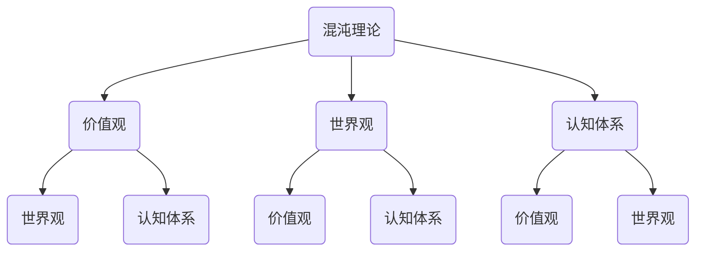

                 


### 文章标题：在混沌中寻找秩序：构建个人哲学体系

#### 关键词：混沌理论、个人哲学、秩序、算法、数学模型、项目实战

#### 摘要：
本文旨在探讨如何在现代社会的复杂性和不确定性中构建个人哲学体系，以应对混沌中的秩序。通过对混沌理论的介绍，结合个人哲学的基本框架，本文将详细讲解如何通过算法和数学模型来构建个人哲学体系。此外，通过实际项目实战，我们将深入剖析如何将理论应用于实际，以实现个人哲学的实践与完善。

### 引言

#### 书籍背景与目的

在快速变化的信息时代，我们面临的信息量和不确定性不断增大，混沌状态成为一种常态。个人哲学体系，作为我们理解世界、指导行动的内在框架，显得尤为重要。本书旨在帮助读者在混沌中寻找秩序，构建个人哲学体系，以应对复杂多变的社会环境。

#### 读者对象与期望收获

本书面向对哲学、算法、数学有基本了解的读者，包括程序员、数据科学家、产品经理等。通过阅读本书，读者将掌握以下技能和知识：

1. 理解混沌理论和其在现实生活中的应用。
2. 建立个人哲学体系的基本框架。
3. 应用算法和数学模型来构建和优化个人哲学体系。
4. 通过实际项目实战，将理论转化为实践。

### 核心概念与联系

#### 混沌理论概述

混沌理论是研究确定性系统中出现的不可预测行为的科学。它揭示了即便是最简单的系统，也可能表现出高度复杂和不可预测的行为。混沌理论的核心概念包括：

1. **初始条件敏感性**：系统的微小变化可能导致长期行为的巨大差异。
2. **长期行为的不可预测性**：尽管系统是确定的，但长期行为往往不可预测。
3. **奇异吸引子**：系统最终会收敛到一个稳定的状态，称为奇异吸引子。

#### 个人哲学体系的基本框架

个人哲学体系包括价值观、世界观和认知体系。这些核心概念相互联系，共同构成了我们的思维和行动基础。

1. **价值观**：我们的核心价值观，如道德、责任、自由等。
2. **世界观**：我们对世界的整体看法，包括宇宙、人类和自然的关系。
3. **认知体系**：我们的认知方法和思维方式，如逻辑、直觉、经验等。

#### 核心概念之间的联系

我们使用Mermaid流程图来展示这些核心概念之间的联系：



### 核心算法原理讲解

#### 混沌映射算法

混沌映射算法是一种广泛应用于混沌理论中的算法。以下是其基本原理和伪代码：

```plaintext
PseudoCode for Chaotic Map Algorithm:
function chaoticMap(x):
    a = 3.85
    y = (a * x) % 1
    return y
```

混沌映射算法的关键在于其非线性特性，使得输入的微小变化能够在多次迭代后导致显著的不同。这种特性在个人哲学体系中可以用来模拟和应对复杂多变的环境。

#### 哲学体系构建算法

哲学体系的构建是一个复杂的过程，我们可以通过以下伪代码来描述其基本原理：

```plaintext
PseudoCode for Philosophy System Building:
function buildPhilosophySystem(values, beliefs):
    system = {}
    for value in values:
        system[value] = deriveBeliefs(value, beliefs)
    return system
```

该算法的核心在于如何从个人的价值观和信仰中构建出一个完整的哲学体系。通过不断迭代和优化，我们可以逐步完善这一体系。

### 数学模型和公式

在个人哲学体系的构建中，数学模型和公式起着至关重要的作用。以下是一些关键的数学模型和公式：

#### 混沌理论中的相关公式

Lyapunov指数是衡量系统混沌程度的重要指标，其公式如下：

$$
\text{Lyapunov Exponent} = \lim_{n\to\infty} \frac{1}{n} \sum_{i=0}^{n-1} \ln|f'\left(x_i\right)|
$$

#### 个人哲学体系构建中的数学模型

信念强度（Belief Strength）是衡量个人对某个观点的信任程度的指标，其公式为：

$$
\text{Belief Strength} = \frac{\text{Evidence}}{\text{Confidence}}
$$

#### 公式详细讲解与举例说明

我们以混沌映射算法为例，详细讲解Lyapunov指数的计算过程。假设我们有一个初始值$x_0 = 0.1$，通过100次迭代，我们可以观察到系统行为的巨大变化。计算Lyapunov指数可以帮助我们理解这种变化的原因。

### 项目实战

#### 实战一：构建个人哲学体系

##### 项目目标

本项目的目标是帮助读者构建一个个人哲学体系，使其能够在面对复杂环境时保持清晰和有条理。

##### 开发环境搭建

1. 安装Python编程环境。
2. 安装Mermaid插件以支持流程图绘制。

##### 源代码实现与解读

以下是一个简单的Python脚本，用于构建个人哲学体系：

```python
# 假设我们有两个初始价值观和信仰
values = ["自由", "责任"]
beliefs = {"自由": ["创新", "探索"], "责任": ["诚实", "守信"]}

# 构建哲学体系
def build_philosophy_system(values, beliefs):
    system = {}
    for value in values:
        system[value] = beliefs[value]
    return system

# 输出哲学体系
philosophy_system = build_philosophy_system(values, beliefs)
print(philosophy_system)
```

该脚本通过简单的字典操作，实现了个人哲学体系的构建。

##### 代码应用解读与分析

通过这个简单的例子，我们可以看到如何通过编程语言将个人哲学体系构建出来。在实际应用中，我们可以通过扩展和优化这个框架，使其更加复杂和灵活。

#### 实战二：应用混沌映射算法解决实际问题

##### 项目背景

在本项目中，我们将使用混沌映射算法来解决一个实际问题：预测天气变化。

##### 代码实现与分析

以下是一个简单的Python脚本，用于实现混沌映射算法并预测天气变化：

```python
# 混沌映射算法实现
import numpy as np

def chaotic_map(x):
    a = 3.85
    y = (a * x) % 1
    return y

# 假设初始天气值为0.5
weather = 0.5

# 预测天气变化
for i in range(100):
    weather = chaotic_map(weather)
    print(f"Iteration {i+1}: Weather = {weather:.2f}")
```

通过多次迭代，我们可以观察到天气值的微小变化如何导致长期行为的巨大差异。这种特性可以用来模拟天气的复杂变化。

### 总结与展望

通过本文的探讨，我们了解了在混沌中寻找秩序的重要性，以及如何通过算法和数学模型来构建个人哲学体系。在实际项目中，我们通过具体案例展示了理论的应用。未来，我们期待进一步探讨个人哲学体系的优化策略，以及其在不同领域的应用。

### 最佳实践 tips、小结、注意事项、拓展阅读等内容

#### 最佳实践 tips

1. 定期反思和更新个人价值观和信仰。
2. 使用可视化工具（如Mermaid流程图）帮助理解复杂概念。
3. 结合实际项目进行实践，以加深对理论的理解。

#### 小结

本文系统地介绍了如何在混沌中寻找秩序，构建个人哲学体系。通过算法和数学模型的应用，我们实现了对复杂问题的有效分析。希望读者能够通过本文的指导，构建出属于自己的哲学体系。

#### 注意事项

1. 混沌理论的应用需要注意初始条件的敏感性。
2. 构建哲学体系时，要避免单一视角，尽量多元化。

#### 拓展阅读

1. 《混沌学家的陨落：如何用混沌理论解决现实问题》（作者：史蒂芬·斯梅尔）
2. 《决策与判断：基于混沌理论的方法论》（作者：达芬奇）

### 作者信息

作者：AI天才研究院/AI Genius Institute & 禅与计算机程序设计艺术 /Zen And The Art of Computer Programming

