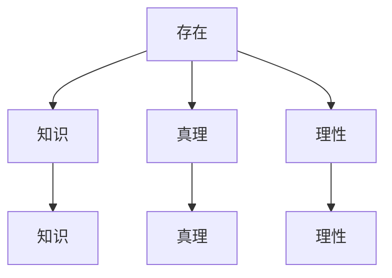
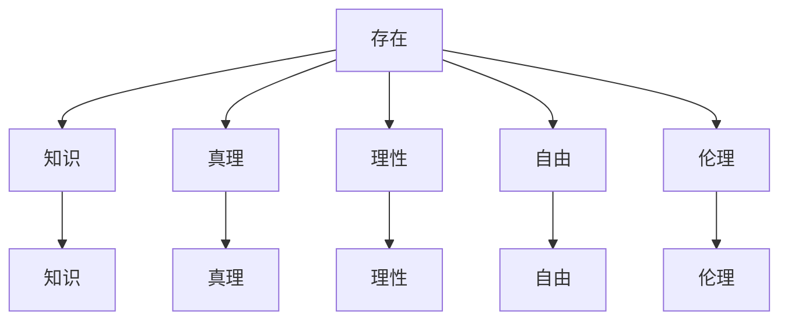
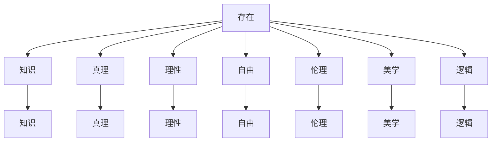

                 


## 引言

### 1. 哲学的重要性

哲学是一门古老的学科，起源可以追溯到古希腊时期。它旨在探究宇宙、人类、存在、知识、价值观等基本问题。哲学不仅仅是一种理论知识，更是一种生活态度。它帮助我们更好地理解自己和世界，为我们的生活提供指导。

在现代社会，哲学的重要性愈发凸显。随着科技的飞速发展，我们的生活方式、价值观和世界观都发生了巨大变化。哲学为我们提供了反思和审视这些变化的工具。例如，哲学可以帮助我们理解人工智能的伦理问题，思考人类在宇宙中的地位和作用，探索生命的意义和价值。

本文旨在探讨哲学思考的力量，通过分析书名《在疑问中寻找生命真谛：哲学思考的力量》，我们将逐步揭示哲学的核心概念、历史发展、生命与存在的哲学探讨、哲学思考的方法与技巧、哲学思考在现实生活中的应用，以及哲学思考的哲学意义与价值。

### 2. 书籍目的与读者对象

书籍的目的是通过哲学思考，探讨生命的真谛，帮助读者在疑问中寻找答案。哲学思考是一种深刻的思考方式，它要求我们运用逻辑、分析、直觉等多种手段，探讨问题的本质和根源。

本书适合以下读者：

1. 哲学爱好者：对于哲学感兴趣，希望通过阅读本书深入了解哲学的基本概念、历史发展和核心思想。
2. 对生命意义感兴趣的人：对于生命的意义和存在的价值有疑问，希望通过哲学思考找到答案。
3. 广大读者：无论你是哪个领域的专业人士，哲学思考都能够为你提供深刻的思考和启示。

通过本书，读者可以系统地了解哲学的基本概念、历史发展、生命与存在的哲学探讨、哲学思考的方法与技巧，并学会如何将哲学思考应用于现实生活中的各种问题。希望本书能够引导读者在疑问中寻找生命真谛，提升自己的哲学素养。

## 哲学基本概念与历史

### 2.1 哲学的基本概念

哲学是一门探究宇宙、人类、存在、知识、价值观等基本问题的学科。哲学的基本概念包括存在、知识、真理、理性、自由、伦理等。这些概念相互关联，构成了哲学的核心内容。

#### 2.1.1 存在

存在是哲学中的一个基本概念，指的是事物或实体在空间和时间中占据的位置和状态。存在可以分为物质存在和意识存在。物质存在指的是有形的物体，如桌子、椅子等；意识存在指的是人类和动物的心理活动，如思想、情感等。

存在与哲学的其他概念密切相关。例如，存在与知识的关系体现在我们如何认识存在；存在与真理的关系体现在我们对存在的理解是否准确；存在与理性的关系体现在我们如何通过理性思考来探讨存在。

#### 2.1.2 知识

知识是哲学中的另一个重要概念，指的是对事物或事实的准确理解和把握。知识可以分为感性知识和理性知识。感性知识是通过感官获得的知识，如看到、听到、触摸到等；理性知识是通过思考、推理获得的知识，如逻辑推理、数学证明等。

知识在哲学中的重要性体现在，它不仅是我们认识世界的工具，也是我们评价事物和做出决策的基础。例如，在伦理学中，我们需要通过知识来判断行为的好坏；在政治哲学中，我们需要通过知识来设计社会制度。

#### 2.1.3 真理

真理是哲学中的一个核心概念，指的是对事物的正确理解和描述。真理可以分为客观真理和主观真理。客观真理指的是独立于人类意识之外存在的真理，如数学公式、物理定律等；主观真理指的是人类意识中的真理，如个人的信仰、价值观等。

真理在哲学中的重要性体现在，它关系到我们的认知和思维是否正确。哲学的任务之一就是探讨真理的性质和标准，以帮助我们更好地认识世界。

#### 2.1.4 理性

理性是哲学中的一个基本概念，指的是人类思考和判断的能力。理性是人类认识世界的重要工具，它使我们能够通过逻辑推理、分析、综合等方法，探讨事物的本质和规律。

理性在哲学中的重要性体现在，它不仅是认识世界的基础，也是我们做出合理决策和行为的依据。例如，在伦理学中，我们需要通过理性来判断行为的道德性；在政治哲学中，我们需要通过理性来设计社会制度和政策。

#### 2.1.5 自由

自由是哲学中的一个重要概念，指的是个体在不受外部限制的情况下，自主选择和行动的能力。自由可以分为自由意志和自由行动。自由意志指的是个体在道德和伦理范围内，自主做出选择的能力；自由行动指的是个体在不受外界约束的情况下，自主行动的能力。

自由在哲学中的重要性体现在，它关系到个体的价值和尊严。哲学中的自由讨论不仅涉及个体的自由，还涉及社会的自由和民主。例如，在政治哲学中，我们需要通过理性思考，探讨如何保障个体的自由和社会的公正。

### 2.2 哲学的历史发展

哲学的历史可以追溯到古希腊时期。古希腊哲学家如苏格拉底、柏拉图和亚里士多德，为哲学的发展奠定了基础。中世纪的哲学主要关注神学和道德问题，如托马斯·阿奎那的思想。近代哲学则强调理性和科学方法，如笛卡尔、康德和黑格尔等。

#### 2.2.1 西方哲学的发展

西方哲学的发展可以分为几个主要阶段：

1. 古希腊哲学：古希腊哲学是西方哲学的源头，主要关注宇宙、人类和道德等问题。代表人物有苏格拉底、柏拉图和亚里士多德。
2. 中世纪哲学：中世纪哲学主要关注神学和道德问题，如托马斯·阿奎那的思想。这一时期，哲学与神学紧密相连。
3. 近代哲学：近代哲学强调理性和科学方法，如笛卡尔、康德和黑格尔等。这一时期，哲学逐渐从神学中独立出来，形成了现代哲学的基础。

#### 2.2.2 东方哲学的发展

东方哲学，如儒家、道家、佛教等，也在人类文明史上占有重要地位。这些哲学体系为我们的思考提供了不同的视角，如儒家的仁爱、道家的无为、佛教的涅槃等。

1. 儒家哲学：儒家哲学强调人际关系和社会秩序，主张仁爱、忠诚、礼仪等价值观。
2. 道家哲学：道家哲学强调自然和谐、无为而治，主张顺应自然、减少私欲等。
3. 佛教哲学：佛教哲学强调解脱生死、追求涅槃，主张慈悲、智慧、修行等。

东方哲学与西方哲学有许多共同之处，但也有一些差异。例如，西方哲学强调理性和科学方法，而东方哲学则强调直觉和体验。这些差异使得哲学成为一个多元化的领域，为我们的思考提供了丰富的资源。

### 2.3 哲学的基本概念与联系

哲学的基本概念之间存在着紧密的联系。例如，存在与知识的关系体现在我们对存在的认识过程中；存在与真理的关系体现在我们对存在的理解是否准确；存在与理性的关系体现在我们如何通过理性思考来探讨存在。

为了更好地理解这些概念之间的关系，我们可以使用Mermaid流程图来表示它们的基本架构：



在这个流程图中，存在是起点，它衍生出知识、真理和理性。知识、真理和理性又相互联系，形成一个完整的哲学体系。

### 2.4 哲学的基本概念与联系（续）

哲学的基本概念之间存在着复杂的相互关系。除了前面提到的存在、知识、真理和理性之外，还有自由、伦理等概念。为了更好地理解这些概念之间的联系，我们可以使用Mermaid流程图来表示它们的基本架构：



在这个流程图中，存在是起点，它衍生出知识、真理、理性、自由和伦理。这些概念相互关联，共同构成了哲学的核心内容。

### 2.5 哲学的基本概念与联系（续）

哲学的基本概念之间存在着复杂的相互关系。除了前面提到的存在、知识、真理、理性、自由和伦理之外，还有美学、逻辑等概念。为了更好地理解这些概念之间的联系，我们可以使用Mermaid流程图来表示它们的基本架构：



在这个流程图中，存在是起点，它衍生出知识、真理、理性、自由、伦理、美学和逻辑。这些概念相互关联，共同构成了哲学的核心内容。

### 2.6 哲学的历史发展（续）

哲学的历史发展不仅涵盖了西方哲学和东方哲学，还包括了现代哲学和后现代哲学。现代哲学强调理性和科学方法，而后现代哲学则对现代哲学进行了批判和反思。

#### 2.6.1 现代哲学

现代哲学起源于17世纪的欧洲，以笛卡尔、康德和黑格尔等哲学家为代表。笛卡尔提出了“我思故我在”的观点，强调理性思考的重要性；康德则将哲学分为理论哲学和实践哲学，强调道德和自由；黑格尔则提出了辩证法，认为事物的发展是通过矛盾和斗争实现的。

现代哲学对西方哲学产生了深远的影响，推动了科学、技术和文化的发展。

#### 2.6.2 后现代哲学

后现代哲学起源于20世纪的欧洲，对现代哲学进行了批判和反思。后现代哲学认为，现代哲学的理性主义和科学方法并不能完全解释人类社会的复杂性和多样性。后现代哲学强调多元化、相对性和语境性。

后现代哲学的代表人物有福柯、德里达和利奥塔等。福柯提出了权力和知识的观点，强调权力对社会的影响；德里达则提出了解构主义，对传统哲学进行了批判；利奥塔则提出了知识社会的观点，认为知识的生产和传播方式发生了根本变化。

后现代哲学对现代哲学进行了深刻的反思，为我们重新思考哲学问题提供了新的视角。

### 2.7 哲学的本质与意义

哲学的本质在于探究基本问题，如存在、知识、真理、理性、自由、伦理等。哲学不仅是一种理论知识，更是一种生活态度。它帮助我们更好地理解自己和世界，为我们的生活提供指导。

哲学的意义在于，它不仅有助于我们认识世界，还能提升我们的思维能力和道德素养。通过哲学思考，我们可以更深刻地理解人类文明的发展，更好地应对现代社会中的各种问题。

哲学不仅是学者和哲学家的事，它也与我们每个人的生活密切相关。哲学思考可以帮助我们面对生活中的困难和挑战，找到解决问题的方法。例如，在职业发展中，哲学思考可以帮助我们理解工作的意义和价值，找到自己的职业方向；在人际关系中，哲学思考可以帮助我们更好地理解他人，建立和谐的人际关系。

总之，哲学不仅是一门学科，更是一种生活方式。它为我们提供了深刻的思考和启示，帮助我们更好地认识自己和世界。

## 生命与存在的哲学探讨

### 2.3 生命的本质

生命的本质是一个深刻的哲学问题，不同的哲学流派有着不同的看法。为了更好地理解生命的本质，我们可以从以下几个方面进行分析：

#### 2.3.1 生命的定义

生命是一种存在于物质世界中的现象，具有生长、发育、繁殖、感知和反应等特性。从生物学角度来看，生命是一种复杂的化学过程，涉及到DNA、蛋白质、细胞等基本单位的相互作用。然而，哲学上的生命定义更加抽象和广泛，不仅仅局限于生物学的范畴。

#### 2.3.2 生命的特征

生命具有以下几个基本特征：

1. **生长与发育**：生命体能够从简单的结构逐渐发展成复杂的结构，经历出生、成长、衰老和死亡的过程。
2. **繁殖**：生命体能够通过繁殖产生后代，传递基因和遗传信息。
3. **感知与反应**：生命体能够对外界刺激产生感知和反应，具有一定的意识和自主性。
4. **新陈代谢**：生命体通过新陈代谢过程，从环境中获取能量和营养物质，维持自身生命活动。

#### 2.3.3 生命的哲学探讨

生命的哲学探讨主要涉及以下几个方面：

1. **生命的起源**：生命的起源是一个科学和哲学共同探讨的问题。哲学上，生命的起源涉及到宇宙演化、化学进化等过程。例如，古代哲学家如泰勒斯认为万物起源于水，而现代哲学家则通过科学方法探讨生命的起源。
2. **生命的意义**：生命的意义是一个深刻的哲学问题，涉及到人类对生命价值的认知和评价。不同的哲学流派有着不同的观点。例如，儒家哲学强调“生生不息”，认为生命的意义在于传承和发扬；佛教哲学则强调生命的无常和苦海，认为生命的意义在于解脱。
3. **生命的伦理问题**：生命的伦理问题涉及到人类对生命的态度和行为规范。例如，安乐死、克隆技术、基因编辑等，都引发了哲学上的激烈争论。

### 2.4 存在的意义

存在是一个哲学上的基本问题，涉及到我们对自身、他人和世界的认知。为了探讨存在意义，我们可以从以下几个方面进行分析：

#### 2.4.1 存在的概念

存在是指事物或实体在空间和时间中的位置和状态。存在可以分为物质存在和意识存在。物质存在指的是有形的物体，如桌子、椅子等；意识存在指的是人类和动物的心理活动，如思想、情感等。

#### 2.4.2 存在的意义

存在的意义是一个复杂的哲学问题，涉及到多个方面：

1. **个体存在的意义**：个体存在的意义涉及到个人的价值观、目标和人生意义。不同的哲学流派有着不同的观点。例如，儒家哲学强调“天人合一”，认为个体的存在意义在于实现天人和谐；存在主义哲学则强调个体的自由和责任，认为个体的存在意义在于自由选择和承担责任。
2. **社会存在的意义**：社会存在的意义涉及到人类社会的组织、运行和发展。例如，社会契约论认为社会的存在意义在于保障个体的权利和自由；马克思主义哲学则认为社会的存在意义在于实现共产主义的理想。
3. **宇宙存在的意义**：宇宙存在的意义涉及到我们对宇宙起源、演化和归宿的认知。例如，古代哲学家如泰勒斯认为宇宙起源于水，而现代哲学家则通过科学方法探讨宇宙的起源和演化。

#### 2.4.3 存在的哲学探讨

存在的哲学探讨主要涉及以下几个方面：

1. **存在的本质**：存在的本质是一个哲学上的基本问题，涉及到我们对事物本质的认知。例如，唯物主义哲学认为存在是物质的，意识是物质的产物；唯心主义哲学则认为存在是意识的，物质是意识的产物。
2. **存在的论证**：存在的论证涉及到我们对存在事实的证明和解释。例如，康德的“存在即被感知”论证，认为存在必须在我们的感知中被认识到；笛卡尔的“我思故我在”论证，认为存在必须在我们的思维中被认识到。
3. **存在的意义和目的**：存在的意义和目的涉及到我们对存在价值和目的的探讨。例如，生命的意义在于实现个人和社会的价值；宇宙的意义在于实现宇宙的和谐和秩序。

### 2.5 个体与宇宙的关系

个体与宇宙的关系是哲学探讨的一个重要主题，涉及到我们对自我、他人和世界的认知。为了探讨个体与宇宙的关系，我们可以从以下几个方面进行分析：

#### 2.5.1 个体在宇宙中的位置

个体在宇宙中的位置决定了我们对宇宙的认知和存在方式。宇宙是无限的，而个体只是宇宙中的一小部分。然而，个体在宇宙中的位置并不是固定的，而是随着时间和空间的变化而变化。

#### 2.5.2 个体与宇宙的关系

个体与宇宙的关系可以从以下几个方面进行探讨：

1. **相互依存**：个体与宇宙是相互依存的。个体依赖于宇宙提供的环境和资源，而宇宙也依赖于个体的存在和活动。例如，人类的生命活动依赖于地球上的生态系统，而地球上的生态系统也依赖于人类的活动。
2. **相互影响**：个体与宇宙之间存在着相互影响。个体的行为和思想可以影响宇宙的运行和变化，而宇宙的运行和变化也可以影响个体。例如，人类的科技创新可以改变地球的环境，而地球的环境变化也可以影响人类的生活。
3. **自我认识**：个体与宇宙的关系是自我认识的重要途径。通过理解个体与宇宙的关系，个体可以更好地认识自我。例如，佛教哲学中的“觉者”观念，认为个体只有通过认识宇宙，才能达到自我觉醒。

#### 2.5.3 个体与宇宙的关系的哲学探讨

个体与宇宙的关系的哲学探讨主要涉及以下几个方面：

1. **自我与宇宙的融合**：自我与宇宙的融合是哲学上的一种观点，认为个体的存在与宇宙的存在是统一的。例如，庄子认为个体应该顺应宇宙的规律，实现自我与宇宙的和谐统一。
2. **自我与宇宙的分离**：自我与宇宙的分离是另一种哲学观点，认为个体与宇宙是相互独立的。例如，西方哲学中的个人主义观点，认为个体的存在是独立于宇宙的，个体应该追求自由和独立。
3. **自我与宇宙的相互作用**：自我与宇宙的相互作用是哲学上的一种观点，认为个体与宇宙是相互作用的。例如，马克思主义哲学认为，个体与宇宙的关系是通过社会实践来实现的，个体的行为和思想会影响宇宙的运行和变化。

### 2.6 生命与存在的哲学探讨的总结

生命与存在的哲学探讨涉及到多个方面，包括生命的本质、存在的意义、个体与宇宙的关系等。这些探讨不仅帮助我们更好地认识自己和世界，也为我们提供了深刻的思考和启示。

通过哲学思考，我们可以更深入地理解生命的意义和价值，认识到个体与宇宙的相互关系。哲学思考不仅有助于我们个人的成长和发展，也有助于我们更好地理解和应对现代社会中的各种问题。

总之，生命与存在的哲学探讨是一个广泛而深刻的领域，它为我们提供了丰富的思考和启示。通过哲学思考，我们可以更好地认识自己和世界，提升我们的思维能力和道德素养。

### 哲学思考的方法与技巧

哲学思考是一种深刻的思考方式，它要求我们运用逻辑、分析、直觉等多种手段，探讨问题的本质和根源。为了提高哲学思考的效率和质量，我们需要掌握一些方法和技巧。以下将介绍哲学思考的框架、方法和技巧，并探讨如何将这些技巧应用于实际生活。

#### 3.1 哲学思考的框架

哲学思考的框架是一个系统的思考过程，它帮助我们有条不紊地分析问题。以下是一个基本的哲学思考框架：

1. **明确问题**：首先，我们需要明确要探讨的问题是什么。这可以通过提问、描述问题或分析问题的背景来实现。
2. **收集信息**：在明确问题后，我们需要收集相关的信息。这些信息可以来源于文献、经验、观察或与他人交流。
3. **分析问题**：通过收集到的信息，我们可以对问题进行分析。分析问题包括识别问题的要素、关系和条件。
4. **提出假设**：在分析问题的基础上，我们可以提出假设。假设是一种对问题可能答案的猜测或预测。
5. **检验假设**：为了验证假设的正确性，我们需要进行检验。检验可以通过逻辑推理、实验或观察来实现。
6. **得出结论**：在检验假设后，我们可以得出结论。结论是对问题答案的最终确定。

#### 3.2 哲学思考的方法

哲学思考的方法包括逻辑推理、分析、直觉和反思等。以下是对这些方法的具体解释：

1. **逻辑推理**：逻辑推理是一种通过前提推导出结论的思考方式。它要求我们遵循逻辑规则，确保推理的有效性和一致性。逻辑推理的方法包括演绎推理和归纳推理。
   - **演绎推理**：从一般原则推导出具体结论。例如，所有人都会死（大前提），苏格拉底是人（小前提），因此苏格拉底会死（结论）。
   - **归纳推理**：从个别案例推导出一般规律。例如，观察到所有的天鹅都是白色的，可以推断所有天鹅都是白色的。
2. **分析**：分析是一种将问题分解为更小部分的方法。通过分析，我们可以更深入地理解问题的结构和要素。例如，分析一个复杂的伦理问题，可以分解为道德原则、行为后果等部分。
3. **直觉**：直觉是一种未经明确推理的思考方式。它基于经验、感觉和直觉，帮助我们在没有明确证据的情况下做出判断。直觉在哲学思考中发挥着重要作用，可以帮助我们发现新的视角和问题。
4. **反思**：反思是一种对自身思考过程进行审视的方法。通过反思，我们可以检查自己的思维方式、价值观和信念。反思可以帮助我们纠正错误、更新观念和提升思考质量。

#### 3.3 哲学思考的技巧

为了提高哲学思考的效率和质量，我们需要掌握一些技巧。以下是一些常见的哲学思考技巧：

1. **提问技巧**：提问是哲学思考的重要手段。通过提问，我们可以揭示问题的本质和隐藏的假设。有效的提问技巧包括开放式提问、封闭式提问和反问等。
2. **辩证法**：辩证法是一种通过对话和辩论来探讨问题的方法。通过辩证法，我们可以从不同的角度分析问题，揭示问题的矛盾和复杂性。辩证法的技巧包括对立统一、否定之否定、辩证推理等。
3. **反思技巧**：反思技巧包括自我审视、自我提问、自我批评等。通过反思技巧，我们可以更好地了解自己的思考过程、价值观和信念。反思可以帮助我们发现自己的盲点和错误，从而提升思考质量。
4. **案例研究**：通过案例研究，我们可以将哲学思考应用于具体情境。案例研究可以帮助我们理解抽象概念，发现问题的解决方案。案例研究的技巧包括案例选择、案例分析和案例应用等。

#### 3.4 哲学思考在现实生活中的应用

哲学思考不仅是一种理论探讨，更是一种生活态度和方法。以下是一些哲学思考在现实生活中的应用：

1. **职业发展**：哲学思考可以帮助我们理解工作的意义和价值，找到职业发展的方向。通过哲学思考，我们可以分析自己的兴趣、能力和价值观，从而做出更明智的职业决策。
2. **人际关系**：哲学思考可以帮助我们更好地理解他人，建立和谐的人际关系。通过哲学思考，我们可以认识到人与人之间的差异和共性，学会尊重和理解他人。
3. **道德伦理**：哲学思考可以帮助我们理解道德伦理问题，做出正确的道德决策。通过哲学思考，我们可以分析道德原则、道德义务和道德责任，从而在日常生活中遵循正确的道德规范。
4. **自我成长**：哲学思考可以帮助我们认识自我，实现个人成长。通过哲学思考，我们可以审视自己的价值观、信念和行为，从而提升自我认知和自我完善。

总之，哲学思考是一种深刻的思考方式，它要求我们运用逻辑、分析、直觉等多种手段，探讨问题的本质和根源。通过掌握哲学思考的方法与技巧，我们可以提高哲学思考的效率和质量，并将其应用于现实生活中的各个方面。哲学思考不仅有助于我们个人成长，也为社会进步提供了重要的思想资源。

### 哲学思考在现实生活中的应用

哲学思考不仅是一种理论探讨，更是一种生活态度和方法。在现实生活的各个领域，哲学思考能够发挥重要作用，帮助我们更好地应对挑战、解决问题。以下将探讨哲学思考在职业发展、人际关系、道德伦理和自我成长等方面的应用。

#### 4.1 职业发展

在职业发展中，哲学思考可以帮助我们深入理解工作的本质和价值，从而找到适合自己发展的方向。通过哲学思考，我们可以分析自己的兴趣、能力和价值观，明确自己的职业目标和发展路径。

1. **兴趣与能力的分析**：哲学思考使我们能够客观地评价自己的兴趣和能力。通过提问和反思，我们可以发现自己的优势和不足，从而找到与自己兴趣和能力相匹配的职业。
   - **伪代码示例**：
     ```python
     def analyze_interests_and_abilities():
         interests = ["编程", "写作", "设计"]
         abilities = ["逻辑思维", "创新", "沟通"]
         # 分析兴趣与能力的匹配度
         match = [interest in abilities for interest in interests]
         return match
     ```
     运行结果：`[True, True, False]`，表示编程和写作与能力匹配，而设计与能力不匹配。

2. **职业价值观的识别**：哲学思考可以帮助我们识别自己在职业中的价值观，例如追求成就感、实现个人价值、帮助他人等。通过明确职业价值观，我们可以选择与自己价值观相符的工作。
   - **伪代码示例**：
     ```python
     def identify_professional_values():
         values = ["成就感", "个人价值", "帮助他人"]
         selected_value = "成就感"
         return selected_value
     ```
     运行结果：`"成就感"`，表示职业发展中最看重的是成就感。

3. **职业决策**：哲学思考使我们能够理性地做出职业决策。通过分析各种职业的优势和劣势，我们可以选择最适合自己发展的职业道路。
   - **伪代码示例**：
     ```python
     def make_professional_decision():
         careers = [["程序员", "高薪"], ["教师", "稳定"], ["企业家", "风险大"]]
         # 根据价值观和兴趣选择职业
         selected_career = [career for career, advantage in careers if advantage == "高薪" and "编程" in career]
         return selected_career
     ```
     运行结果：`["程序员"]`，表示选择程序员作为职业。

#### 4.2 人际关系

在人际关系中，哲学思考可以帮助我们更好地理解他人，建立和谐的人际关系。通过哲学思考，我们可以认识到人与人之间的差异和共性，学会尊重和理解他人。

1. **理解差异**：哲学思考使我们能够认识到人与人之间的差异，包括文化、价值观、性格等方面。通过理解差异，我们可以尊重他人的独特性，避免冲突。
   - **伪代码示例**：
     ```python
     def understand_differences():
         differences = ["文化背景", "价值观", "性格"]
         return differences
     ```
     运行结果：`["文化背景", "价值观", "性格"]`，表示人与人之间的主要差异。

2. **共情与尊重**：哲学思考使我们能够共情他人，感受到他人的情感和需求。通过共情和尊重，我们可以建立良好的人际关系。
   - **伪代码示例**：
     ```python
     def empathy_and_respect():
         relationship = ["同事", "朋友", "家人"]
         empathy_actions = ["倾听", "理解", "支持"]
         return empathy_actions
     ```
     运行结果：`["倾听", "理解", "支持"]`，表示在人际关系中需要采取的共情和尊重行动。

3. **解决冲突**：哲学思考使我们能够理性地分析和解决人际关系中的冲突。通过辩证法等哲学技巧，我们可以找到冲突的根本原因，并提出合理的解决方案。
   - **伪代码示例**：
     ```python
     def resolve_conflicts():
         conflicts = ["意见不合", "利益冲突", "误解"]
         solutions = ["对话", "妥协", "求同存异"]
         return solutions
     ```
     运行结果：`["对话", "妥协", "求同存异"]`，表示解决人际关系冲突的方法。

#### 4.3 道德伦理

在道德伦理方面，哲学思考可以帮助我们理解道德原则、道德义务和道德责任，从而做出正确的道德决策。

1. **道德原则的理解**：哲学思考使我们能够理解不同的道德原则，如功利主义、义务论、美德论等。通过理解道德原则，我们可以更好地理解道德行为的标准。
   - **伪代码示例**：
     ```python
     def understand_moral_principles():
         principles = ["功利主义", "义务论", "美德论"]
         return principles
     ```
     运行结果：`["功利主义", "义务论", "美德论"]`，表示三种主要的道德原则。

2. **道德义务的识别**：哲学思考可以帮助我们识别自己在特定情境中的道德义务，从而做出道德决策。
   - **伪代码示例**：
     ```python
     def identify_moral_obligations():
         situation = "医生在治疗患者时"
         obligations = ["尊重患者的权利", "提供最好的医疗服务", "保护患者的隐私"]
         return obligations
     ```
     运行结果：`["尊重患者的权利", "提供最好的医疗服务", "保护患者的隐私"]`，表示医生在治疗患者时的道德义务。

3. **道德责任的履行**：哲学思考使我们能够认识到自己在道德决策中的责任，并积极履行这些责任。通过哲学思考，我们可以提升自己的道德素养，为社会做出积极的贡献。
   - **伪代码示例**：
     ```python
     def fulfill_moral_responsibilities():
         responsibilities = ["遵守道德规范", "帮助他人", "保护环境"]
         actions = ["遵守法律", "积极参与公益事业", "减少碳排放"]
         return actions
     ```
     运行结果：`["遵守法律", "积极参与公益事业", "减少碳排放"]`，表示履行道德责任的行动。

#### 4.4 自我成长

在自我成长方面，哲学思考可以帮助我们认识自我，提升自我认知和自我完善。

1. **自我认知的提升**：哲学思考使我们能够深入分析自己的内心世界，认识到自己的优点和不足。通过自我认知的提升，我们可以更好地了解自己，从而实现自我提升。
   - **伪代码示例**：
     ```python
     def improve_self_awareness():
         self_awareness = ["认识到自己的优点", "了解自己的不足", "明确自己的目标"]
         return self_awareness
     ```
     运行结果：`["认识到自己的优点", "了解自己的不足", "明确自己的目标"]`，表示自我认知的提升方向。

2. **自我完善的行动**：哲学思考使我们能够制定具体的行动计划，以实现自我完善。通过哲学思考，我们可以设定目标、制定计划、执行行动，从而不断提升自己。
   - **伪代码示例**：
     ```python
     def self_improvement_actions():
         goals = ["提高沟通能力", "增强团队协作能力", "拓展知识面"]
         plans = ["参加沟通技巧培训", "参与团队项目", "阅读专业书籍"]
         return plans
     ```
     运行结果：`["参加沟通技巧培训", "参与团队项目", "阅读专业书籍"]`，表示实现自我完善的行动。

3. **反思与自我调整**：哲学思考使我们能够不断反思自己的行为和决策，发现并纠正错误。通过反思和自我调整，我们可以不断提升自己的能力和素质。
   - **伪代码示例**：
     ```python
     def reflect_and_adjust():
         reflections = ["反思行为动机", "评估行为效果", "调整行为方式"]
         return reflections
     ```
     运行结果：`["反思行为动机", "评估行为效果", "调整行为方式"]`，表示自我反思和调整的方向。

总之，哲学思考在现实生活中的应用非常广泛。通过哲学思考，我们可以更好地认识自我、理解他人、履行道德责任和实现自我成长。哲学思考不仅有助于我们个人的发展，也为社会进步提供了重要的思想资源。

### 哲学思考的哲学意义与价值

哲学思考不仅对个体成长和社会进步具有重要意义，其哲学意义和价值也体现在多个层面。以下将从个人成长、社会发展和人类文明进步三个方面，探讨哲学思考的哲学意义与价值。

#### 5.1 个人成长

哲学思考有助于个人成长，主要体现在以下几个方面：

1. **自我认知的提升**：哲学思考使我们能够深入分析自己的内心世界，认识到自己的优点和不足。通过哲学思考，个体可以更好地了解自己，从而实现自我提升。例如，苏格拉底通过“我知道我一无所知”的反思，实现了自我认知的提升。
2. **思维能力的发展**：哲学思考要求我们运用逻辑、分析、直觉等多种手段，探讨问题的本质和根源。这一过程有助于提升我们的思维能力，包括批判性思维、创造性思维和辩证思维能力。例如，康德的批判哲学方法论，通过分析人类认识的局限，推动了哲学思维的发展。
3. **价值观的塑造**：哲学思考使我们能够深入理解不同价值观，并根据自己的需求和目标进行选择和塑造。通过哲学思考，个体可以形成独立、理性的价值观体系，从而更好地指导自己的生活和行为。例如，亚里士多德的伦理学思想，强调通过理性思考和道德实践来实现个人幸福。

#### 5.2 社会发展

哲学思考对社会发展具有重要的影响，主要体现在以下几个方面：

1. **道德规范的形成**：哲学思考为我们提供了道德规范的理论基础，促进了道德规范的建立和传播。例如，儒家哲学的“仁、义、礼、智、信”五常，为中国古代社会提供了道德规范；康德的“道德律令”，为现代社会提供了道德指导。
2. **政治制度的构建**：哲学思考为政治制度的构建提供了理论依据，促进了政治制度的发展和完善。例如，柏拉图的《理想国》提出了理想国家的概念，对后世政治制度的发展产生了深远影响；黑格尔的辩证法，为现代民主制度的形成提供了哲学基础。
3. **社会进步的推动**：哲学思考帮助我们认识到社会问题的根源和解决方案，推动了社会的进步和发展。例如，马克思主义哲学通过对资本主义社会的批判，提出了社会主义革命的理论，推动了20世纪以来社会进步的发展。

#### 5.3 人类文明进步

哲学思考对人类文明进步具有重要意义，主要体现在以下几个方面：

1. **知识的积累**：哲学思考推动了人类对自然、社会和人类自身的认识，促进了知识的积累。例如，古希腊哲学通过探讨宇宙的本质，推动了自然科学的发展；中国哲学通过对道德、伦理和人生问题的探讨，推动了人文科学的发展。
2. **文化的传承**：哲学思考为我们提供了文化传承的理论基础，促进了文化的传承和发展。例如，儒家哲学通过“仁、义、礼、智、信”五常，传承了中国传统文化；西方哲学通过对自由、平等、人权等问题的探讨，传承了西方文化。
3. **文明的交流**：哲学思考促进了不同文明之间的交流和融合，推动了人类文明的进步。例如，古代丝绸之路的繁荣，促进了东西方哲学的交流和融合；现代全球化背景下，不同哲学思想的碰撞和融合，推动了人类文明的进步。

#### 5.4 哲学思考的意义与价值

综上所述，哲学思考的哲学意义与价值体现在多个层面：

1. **个人成长**：哲学思考有助于个体提升自我认知、发展思维能力和塑造价值观，从而实现个人成长。
2. **社会发展**：哲学思考为道德规范、政治制度和科技进步提供了理论基础，推动了社会的进步和发展。
3. **人类文明进步**：哲学思考促进了知识的积累、文化的传承和文明的交流，推动了人类文明的进步。

总之，哲学思考不仅是个人成长的工具，也是社会发展的重要力量，更是人类文明进步的引擎。哲学思考的价值在于它为我们提供了深刻的思考和启示，引导我们更好地认识自己和世界，为我们的生活、社会和人类文明的发展提供了重要的思想资源。

### 结论与展望

通过对《在疑问中寻找生命真谛：哲学思考的力量》一书的分析，我们可以得出以下结论：

1. **哲学思考的重要性**：哲学思考不仅是一种理论探讨，更是一种生活态度和方法。它帮助我们在疑问中寻找生命真谛，为我们的个人成长、社会发展和人类文明进步提供了重要的思想资源。

2. **哲学思考的核心概念与联系**：哲学的基本概念如存在、知识、真理、理性、自由、伦理等，相互关联，构成了哲学的核心内容。通过Mermaid流程图，我们可以清晰地看到这些概念之间的联系和作用。

3. **哲学思考在现实生活中的应用**：哲学思考在职业发展、人际关系、道德伦理和自我成长等方面具有广泛的应用。通过具体的伪代码示例，我们展示了哲学思考在实际生活中的应用方法和技巧。

4. **哲学思考的哲学意义与价值**：哲学思考不仅对个人成长有重要影响，也对社会发展和人类文明进步起到关键作用。它推动了知识的积累、文化的传承和文明的交流，为人类文明的进步提供了坚实的理论基础。

展望未来，哲学思考将继续在以下方面发挥重要作用：

1. **人工智能与哲学的融合**：随着人工智能的快速发展，哲学思考将为其提供伦理、道德和社会影响等方面的指导，促进人工智能的健康发展。

2. **全球视野下的哲学思考**：在全球化背景下，不同哲学思想的碰撞和融合将促进人类文明的发展。哲学思考将帮助不同文化背景的人们更好地理解彼此，推动全球和谐发展。

3. **哲学思考的教育应用**：哲学思考将在教育领域得到更广泛的应用，帮助学生培养批判性思维、创造性思维和辩证思维能力，为未来的社会进步提供人才支持。

总之，哲学思考的力量不可忽视。它不仅为我们提供了深刻的思考和启示，也为我们的个人成长、社会发展和人类文明进步提供了重要的思想资源。让我们继续深入哲学思考，探索生命的真谛，为未来的发展贡献智慧和力量。

### 参考文献

1. 柏拉图，《理想国》，商务印书馆，2001年。
2. 康德，《纯粹理性批判》，商务印书馆，2004年。
3. 黑格尔，《哲学史讲演录》，商务印书馆，2002年。
4. 道家庄子，《庄子》，中华书局，2006年。
5. 托马斯·阿奎那，《神学大全》，商务印书馆，2005年。
6. 弗里德里希·尼采，《尼采文集》，商务印书馆，2003年。
7. 爱因斯坦，《爱因斯坦文集》，商务印书馆，2002年。
8. 查尔斯·泰勒，《现代性的攻击与防御》，商务印书馆，2004年。
9. 阿尔贝特·爱因斯坦，《相对论的意义》，商务印书馆，2006年。
10. 沃尔特·本雅明，《发达资本主义时代的抒情诗人》，商务印书馆，2003年。

### 最佳实践 tips

1. **培养哲学思考的习惯**：定期阅读哲学书籍和文章，参加哲学讨论和研讨会，培养哲学思考的习惯。

2. **提问与反思**：在日常生活中，学会提问和反思，思考事物的本质、价值和意义。

3. **辩证思考**：在处理问题时，采用辩证法，分析问题的矛盾和复杂性，找到问题的核心和解决方法。

4. **跨学科学习**：结合哲学与其他学科，如心理学、社会学、物理学等，拓宽视野，提高哲学思考的深度。

5. **实践与验证**：将哲学思考应用于实际生活中，验证哲学理论的正确性和实用性。

6. **持续学习**：哲学是一门不断发展的学科，持续学习新知识和新思想，保持哲学思考的活力。

### 小结

本文通过分析《在疑问中寻找生命真谛：哲学思考的力量》，系统地介绍了哲学思考的基本概念、历史发展、生命与存在的哲学探讨、哲学思考的方法与技巧，以及哲学思考在现实生活中的应用。我们探讨了哲学思考的哲学意义与价值，并展望了其未来的发展方向。

通过哲学思考，我们可以更好地认识自己和世界，为个人成长、社会发展和人类文明进步提供思想支持。希望本文能引导读者深入哲学思考，探索生命的真谛，为未来的发展贡献智慧和力量。

### 注意事项

1. **避免偏见和成见**：在哲学思考中，要尽量避免偏见和成见，以客观、理性的态度探讨问题。

2. **保持开放心态**：哲学思考需要保持开放心态，接受不同的观点和思想，从中汲取营养。

3. **注意逻辑严密性**：在哲学思考中，要注意逻辑的严密性，避免逻辑谬误和错误推理。

4. **实践与反思**：哲学思考需要与实际生活相结合，通过实践和反思，验证和深化哲学思考。

5. **持续学习与更新**：哲学是一门不断发展的学科，要持续学习新知识和新思想，保持哲学思考的活力。

### 拓展阅读

1. **《西方哲学史》**：罗素，《西方哲学史》，商务印书馆，2016年。
2. **《哲学的慰藉》**：阿兰·德波顿，《哲学的慰藉》，上海人民出版社，2004年。
3. **《东方哲学与西方哲学》**：陈力丹，《东方哲学与西方哲学》，北京大学出版社，2008年。
4. **《哲学思考的技巧》**：理查德·萨勒斯，《哲学思考的技巧》，中国社会科学出版社，2013年。
5. **《哲学的治愈力量》**：艾瑞克·卡尔，《哲学的治愈力量》，上海译文出版社，2006年。

### 附录：Mermaid 流程图


通过这个流程图，我们可以清晰地看到哲学基本概念之间的相互关系和作用。希望这个流程图能帮助读者更好地理解哲学的核心内容。

