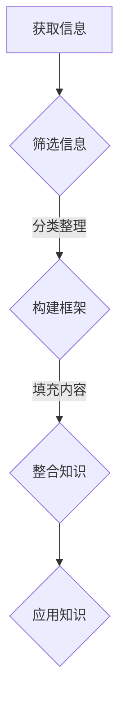
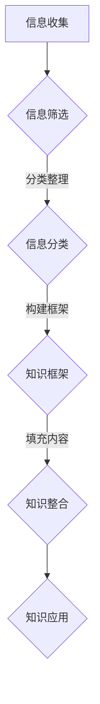

                 

### 碎片化时代的背景

#### 1.1 信息爆炸与知识传播的变革

随着互联网和移动通信技术的迅猛发展，信息已经进入了一个前所未有的爆炸时代。每天，海量的信息通过各种渠道不断涌现，从新闻、社交媒体到专业博客和在线课程，信息传播的速度和广度前所未有。人们可以在瞬间获取到全球的实时动态，各类知识也变得触手可及。然而，这种信息爆炸带来的不仅仅是便利，更多的是对人类注意力和时间的巨大挑战。

在传统时代，知识的获取和传播相对缓慢，人们可以通过书籍、课堂和专家指导来系统地学习。然而，在碎片化时代，信息的碎片化特点使得知识不再是系统性的，而是零散的、片段化的。这种碎片化信息充斥着人们的日常生活，导致学习过程变得支离破碎，难以形成系统的知识体系。

#### 1.2 碎片化信息的特征

碎片化信息具有以下几个显著特征：

1. **短平快**：信息以简短、直接的方式呈现，往往是几句话、一个短视频或一张图片。这种短平快的信息传播方式虽然高效，但往往缺乏深度。

2. **多样性**：信息来源多样，涵盖了各种领域，从科技、文化到娱乐、生活无所不包。这使得人们可以在短时间内接触到各种知识，但也容易导致学习兴趣的分散。

3. **即时性**：信息传播速度快，人们可以实时获取最新的动态。这种即时性满足了人们对于时效性的需求，但也使得知识更新迅速，难以形成长期的知识积累。

4. **孤立性**：碎片化信息往往缺乏上下文，信息之间缺乏系统的联系。这使得信息孤立存在，难以形成整体的知识结构。

#### 1.3 碎片化信息的挑战

碎片化信息的普及给个人学习和知识构建带来了前所未有的挑战：

1. **注意力分散**：人们很容易在碎片化信息中迷失，难以集中注意力进行深度学习。

2. **信息过载**：海量的信息使人眼花缭乱，难以筛选出真正有价值的内容。

3. **知识碎片化**：碎片化信息容易导致知识的碎片化，人们难以构建系统的知识体系。

4. **技能固化**：在碎片化信息环境中，人们往往只关注某一方面的知识，容易导致技能的单一化，缺乏综合能力。

#### 1.4 重建知识体系的必要性

面对碎片化时代的挑战，重建知识体系显得尤为重要。一个系统的知识体系不仅可以整合碎片化信息，提高学习效率，还能培养综合能力，适应快速变化的社会环境。以下是重建知识体系的必要性：

1. **整合知识**：通过系统的知识体系，可以将零散的信息进行整合，形成有结构、有条理的知识网络。

2. **提高学习效率**：系统的知识体系有助于学习者快速定位所需信息，提高学习效率。

3. **培养综合能力**：知识体系不仅涵盖专业知识，还包括跨学科的知识，有助于培养综合能力。

4. **适应变化**：在快速变化的社会环境中，一个灵活的知识体系可以迅速适应新的需求，提高应变能力。

总之，碎片化时代的背景对个人学习和知识构建提出了新的要求，重建知识体系成为应对这些挑战的有效途径。在接下来的章节中，我们将进一步探讨如何在实际操作中实现这一目标。

### 核心概念与联系

#### 2.1 碎片化时代的定义

“碎片化时代”指的是一个信息高度分散、传播速度快、内容形式多样，且个体接收和处理信息方式碎片化的社会现象。这一概念最早由社会学家Manuel Castells在其著作《网络社会的崛起》中提出。碎片化时代的主要特征包括信息爆炸、传播渠道多样化、信息传播速度快、个体注意力分散等。

在碎片化时代，信息的传播不再受时间和空间的限制。无论是通过社交媒体、新闻网站还是专业博客，信息可以在瞬间传达到全球各地。然而，这种高效的信息传播也带来了信息的碎片化。信息的碎片化意味着每一份知识或信息都可能是零散的、片段化的，缺乏上下文和系统性。

#### 2.2 知识体系的定义

知识体系是一个系统化的知识结构，它由一系列相互关联的知识单元组成，每个知识单元都与其他单元相互联系，形成一个有机整体。知识体系不仅包括专业知识，还涵盖跨学科的知识，旨在构建一个全面、系统的知识网络。

一个完整的知识体系通常包括以下几个方面：

1. **基础知识**：这是知识体系的基础，是学习其他复杂知识的前提。基础知识通常是广泛而深厚的，涵盖了学科的基本概念、原理和框架。

2. **核心知识**：这是知识体系的核心，是学习者需要重点掌握的知识点。核心知识通常与学习者所从事的专业领域密切相关，是实际应用的基础。

3. **扩展知识**：这是知识体系的补充，包括与核心知识相关但非必需的知识。扩展知识有助于拓宽学习者的视野，提高综合素质。

4. **应用知识**：这是知识体系的应用层，将理论知识转化为实际操作能力。应用知识通常涉及到实践中的具体问题和解决方案。

#### 2.3 知识体系与碎片化时代的关系

在碎片化时代，知识体系与碎片化信息之间存在着密切的联系。一方面，碎片化信息使得知识获取变得更加容易，但也更加分散和复杂。另一方面，一个系统的知识体系可以在这种复杂的环境中提供指导，帮助个体更好地整合和利用碎片化信息。

**2.3.1 知识体系对碎片化信息的整合作用**

知识体系可以有效地整合碎片化信息，使其变得有条理和系统化。具体来说，知识体系可以通过以下方式实现整合：

1. **结构化**：通过将碎片化信息按照一定的结构和逻辑进行组织，形成一个有层次的知识网络。这样，学习者可以更容易地理解和掌握信息。

2. **分类**：将碎片化信息按照主题、领域或类型进行分类，使其变得更加有序。分类有助于快速定位所需信息，提高学习效率。

3. **联系**：通过发现碎片化信息之间的联系，将其整合到已有的知识体系中。这种联系不仅有助于加深对知识的理解，还能促进创新思维。

**2.3.2 知识体系对碎片化信息利用的指导作用**

一个完善的知识体系可以为个体提供清晰的指导，帮助其有效地利用碎片化信息。具体来说，知识体系可以通过以下方式实现指导：

1. **目标设定**：通过知识体系，个体可以明确自己的学习目标，从而更有针对性地获取和利用信息。

2. **方法指导**：知识体系提供了学习的方法和技巧，如如何快速获取信息、如何处理和存储信息等，帮助个体更高效地学习和工作。

3. **问题解决**：在遇到问题时，知识体系可以提供解决方案的线索，帮助个体迅速找到相关知识和信息，从而解决问题。

**2.3.3 Mermaid流程图：构建知识体系流程**

以下是一个简化的Mermaid流程图，展示如何在不同碎片化信息中构建知识体系：



在这个流程中，首先从各种渠道获取信息，然后对这些信息进行筛选和分类，接着构建一个知识框架，将分类后的信息填充到框架中，最后整合形成系统的知识体系。

总之，在碎片化时代，知识体系不仅是一个组织和管理知识的工具，更是应对信息过载和知识碎片化的重要策略。通过建立和完善知识体系，个体可以在复杂多变的信息环境中保持清晰和有条不紊，从而实现高效的个人学习和持续的专业成长。

#### 2.3.1 知识体系对碎片化信息的整合作用

在碎片化时代，知识体系对于整合碎片化信息具有至关重要的作用。以下是几个关键步骤，说明知识体系如何帮助整合这些零散的信息：

1. **信息收集**：首先，个体需要从各种来源（如书籍、网站、讲座、视频等）收集信息。在这一阶段，需要保持开放的心态，尽量多地获取可能相关的信息。这一过程类似于“信息收割”，目的是尽可能多地收集原始素材。

2. **信息筛选**：接下来，对收集到的信息进行筛选，去除重复、过时或无关紧要的内容。筛选的标准可以是信息的质量、相关性、权威性等。这一步骤类似于“信息过滤”，目的是保留最核心、最有价值的信息。

3. **信息分类**：将筛选后的信息按照主题、领域或类型进行分类。分类可以帮助信息变得更加有序，有助于后续的处理和整合。例如，可以将信息分为技术类、管理类、人文类等不同类别。

4. **构建框架**：在分类的基础上，构建一个知识框架。这个框架应该能够涵盖所有分类的信息，并展示它们之间的联系。例如，可以使用思维导图或大纲形式来构建框架。这一步骤类似于“知识建模”，目的是为信息提供结构化的表达。

5. **填充内容**：在知识框架的基础上，将分类后的信息填充到相应的位置。这一过程需要确保信息的准确性和完整性，同时保持框架的一致性。例如，在技术类的知识框架中，可以填充具体的编程语言、算法或数据库技术等。

6. **整合知识**：将填充后的信息进行整合，形成一个完整的知识体系。整合的过程包括发现信息之间的联系、消除信息冗余、优化信息结构等。这一步骤类似于“知识整合”，目的是将零散的信息形成一个有机的整体。

7. **应用知识**：最后，将整合后的知识体系应用到实际工作中或学习中。应用的过程不仅可以帮助巩固所学知识，还能发现知识体系的不足之处，从而进一步优化和完善。

**Mermaid流程图示例：**



通过上述步骤和流程图，可以清晰地看到知识体系如何帮助整合碎片化信息。这种系统化的方法不仅提高了信息处理的效率，还使得知识变得更加有条理和易用。

### 2.3.2 知识体系对碎片化信息利用的指导作用

在碎片化时代，知识体系不仅帮助整合信息，还发挥着指导信息利用的重要作用。以下是知识体系在指导信息利用方面的几个关键点：

1. **目标设定**：知识体系为个体提供了明确的学习目标。通过了解自身的职业发展或学习目标，个体可以更有针对性地选择和利用信息。例如，一个希望成为数据科学家的学习者，会关注机器学习、数据分析、统计学等领域的信息，而不会在无关领域浪费时间和精力。

2. **方法指导**：知识体系提供了系统化的学习方法，帮助个体更高效地获取、处理和存储信息。例如，通过使用阅读笔记、思维导图、概念图等工具，个体可以更好地理解和记忆所学的知识。此外，知识体系还提供了如何将理论知识转化为实践能力的指导，例如通过项目实践、案例分析等方式。

3. **问题解决**：知识体系为个体提供了解决问题的工具和方法。当个体遇到问题时，可以快速查找相关知识点，找到可能的解决方案。例如，在一个软件开发项目中，如果遇到了性能瓶颈，知识体系可以帮助个体快速定位相关算法、优化策略等，从而解决问题。

**应用案例：**

假设一位软件开发工程师在项目中遇到了数据库性能问题，他可以按照以下步骤利用知识体系解决问题：

1. **目标设定**：明确目标是提升数据库性能。

2. **方法指导**：查找与数据库性能优化相关的知识点，例如查询优化、索引优化、缓存策略等。

3. **问题解决**：通过知识体系，工程师可以快速定位到相关的优化策略，并进行实际操作。例如，他可能会调整查询语句，添加索引，优化数据库配置等。

通过这个案例，我们可以看到知识体系在目标设定、方法指导和问题解决方面的指导作用。这种指导不仅提高了解决问题的效率，还帮助工程师建立了系统的知识框架，从而更好地应对未来的挑战。

### 个人学习的方法论

在碎片化时代，个人学习的方法论显得尤为重要。以下是几种高效利用碎片时间的个人学习方法：

#### 3.1 利用碎片时间学习

1. **多任务并行处理**：将学习任务分解成小块，例如将学习视频分割成多个短片段，每次利用几分钟的时间观看一个片段。

2. **时间规划**：合理安排每天的学习时间，将碎片时间纳入整体时间规划中。例如，在通勤途中、午餐时间或睡前阅读一些专业书籍。

3. **刻意练习**：利用碎片时间进行刻意练习，例如编程练习、写作练习等。刻意练习有助于巩固知识，提高技能。

#### 3.2 高效学习的技巧

1. **主动学习**：主动学习比被动学习更有效。例如，通过提问、讨论、做笔记等方式主动参与学习过程。

2. **深度阅读**：选择高质量的书籍或文章进行深度阅读，避免浅尝辄止。深度阅读有助于深入理解知识。

3. **信息筛选**：学会筛选高质量的信息，避免在低质量信息中浪费时间和精力。

#### 3.3 自我评估与调整

1. **定期评估**：定期对自己的学习效果进行评估，例如通过考试、项目实践等方式。

2. **反馈机制**：建立反馈机制，例如与导师、同行或学习小组交流，获取他们的反馈。

3. **调整策略**：根据评估结果和反馈，调整学习策略和方法，例如改变阅读材料、增加实践项目等。

通过这些方法论，个人可以在碎片化时代高效地学习，构建系统的知识体系。

### 知识管理的工具与方法

在碎片化时代，有效地管理和利用知识是构建知识体系的关键。以下是几种常用的知识管理工具和方法，帮助个人进行有效的知识管理。

#### 4.1 知识管理工具概述

**4.1.1 文档管理工具**

文档管理工具如Google Docs、Microsoft Word、Notepad++等，可以用于创建、编辑、存储和共享文档。这些工具通常支持云存储，方便多设备同步，便于团队协作。

**4.1.2 个人知识库**

个人知识库如Evernote、OneNote等，能够帮助个人整理和存储各类信息。它们通常支持文本、图片、音频等多种格式，并提供强大的搜索功能，便于快速查找所需信息。

**4.1.3 项目管理工具**

项目管理工具如Trello、JIRA、Asana等，不仅可以用于项目管理，还能帮助个人跟踪学习进度、规划任务，确保学习目标的实现。

**4.1.4 学习管理系统（LMS）**

学习管理系统如Moodle、Canvas等，提供了在线课程管理、学习进度跟踪等功能，适合于系统的学习和知识管理。

#### 4.2 知识管理方法

**4.2.1 信息分类与标签化**

信息分类与标签化是知识管理的基础。通过将信息按照主题、领域或类型进行分类，并使用标签进行标识，可以方便快速地检索和利用知识。

**4.2.2 主动收集与积累**

主动收集与积累是知识管理的重要环节。个人可以通过阅读书籍、参加研讨会、浏览专业网站等方式，不断积累新的知识和信息。

**4.2.3 信息处理与整合**

信息处理与整合是指对收集到的信息进行筛选、提炼和整合，形成一个有机的知识体系。例如，可以使用思维导图或大纲形式来组织信息。

**4.2.4 知识共享与协作**

知识共享与协作是知识管理的高级阶段。个人可以通过团队讨论、在线论坛等方式，与他人分享知识和经验，实现知识的增值。

#### 4.3 工具与方法的实践

**4.3.1 使用文档管理工具**

假设个人需要整理一个关于机器学习的文档，可以使用Google Docs进行创建和编辑。将文档存储在Google Drive上，实现多设备同步。同时，邀请团队成员共同编辑和评论，实现团队协作。

**4.3.2 使用个人知识库**

以Evernote为例，个人可以创建不同的笔记本，分别用于存储技术文档、阅读笔记、项目总结等。每个笔记可以使用标签进行分类，便于快速查找。例如，将关于机器学习的笔记标签为“机器学习”、“算法”、“深度学习”等。

**4.3.3 使用项目管理工具**

假设个人需要管理一个编程项目，可以使用Trello来规划项目进度。创建不同的看板（Board），每个看板代表一个项目阶段，如需求分析、设计、编码、测试等。使用卡片（Card）来记录具体任务，每个卡片包含任务的详细描述、截止日期和责任人等信息。

**4.3.4 使用学习管理系统**

以Moodle为例，个人可以注册在线课程，通过学习管理系统跟踪学习进度、参与课程讨论、提交作业等。Moodle还提供了丰富的学习资源和工具，帮助个人进行系统化的学习。

通过这些工具和方法的实践，个人可以有效地进行知识管理，构建和优化自己的知识体系。

### 知识体系的构建框架

构建一个系统的知识体系是应对碎片化信息的关键步骤。以下是一个详细的知识体系构建框架，包括原则、步骤和实际操作。

#### 5.1 知识体系构建的原则

1. **系统性与层次性**：知识体系应具备系统性和层次性，从基础知识到高级知识，形成一个有机的整体。

2. **灵活性与适应性**：知识体系应具备灵活性，能够根据个人需求和外部环境的变化进行及时调整。

3. **实用性与可扩展性**：知识体系应紧密贴合实际应用，同时具有可扩展性，能够容纳新的知识和技能。

4. **交叉与整合**：知识体系应鼓励不同领域和学科之间的交叉与整合，形成多元化的知识网络。

5. **持续性与迭代性**：知识体系需要不断更新和完善，以适应快速变化的知识环境。

#### 5.2 知识体系构建的步骤

1. **需求分析**：明确个人的学习目标、职业发展方向和兴趣点，这是构建知识体系的基础。

2. **信息收集**：广泛收集与目标相关的书籍、论文、课程、博客等资源。确保信息的多样性和质量。

3. **信息筛选**：对收集到的信息进行筛选和整理，去除重复和低质量的内容，保留最核心的知识点。

4. **框架构建**：根据需求分析，构建知识框架。这个框架应涵盖基础知识、核心知识和扩展知识，并展示各知识单元之间的联系。

5. **内容填充**：在知识框架的基础上，填充具体的内容。这一过程需要确保内容的准确性和完整性。

6. **整合与优化**：将碎片化的信息进行整合，形成一个有机的整体。通过反复迭代和优化，提升知识体系的系统性和实用性。

7. **应用与实践**：将知识体系应用到实际工作中或学习中，通过实践验证和调整知识体系，确保其有效性。

#### 5.3 知识体系构建的伪代码

以下是一个简化的伪代码，用于描述知识体系构建的过程：

```python
def build_knowledge_system():
    # 步骤1：需求分析
    analyze_requirements()
    
    # 步骤2：信息收集
    collect_information()
    
    # 步骤3：信息筛选
    filter_information()
    
    # 步骤4：框架构建
    construct_knowledge_frame()
    
    # 步骤5：内容填充
    fill_content_in_frame()
    
    # 步骤6：整合与优化
    integrate_and_optimize()
    
    # 步骤7：应用与实践
    apply_knowledge_practice()

def analyze_requirements():
    # 分析学习目标、职业发展方向和兴趣点
    pass

def collect_information():
    # 广泛收集相关书籍、论文、课程、博客等资源
    pass

def filter_information():
    # 筛选和整理信息，去除重复和低质量的内容
    pass

def construct_knowledge_frame():
    # 构建知识框架，涵盖基础知识、核心知识和扩展知识
    pass

def fill_content_in_frame():
    # 填充具体的内容，确保准确性和完整性
    pass

def integrate_and_optimize():
    # 整合碎片化信息，形成有机的整体，进行迭代和优化
    pass

def apply_knowledge_practice():
    # 将知识体系应用到实际工作中或学习中
    pass
```

通过这个伪代码，可以清晰地看到知识体系构建的步骤和逻辑。在实际操作中，可以根据具体情况进行调整和优化，确保知识体系的构建过程高效且系统。

### 实践案例分享

#### 6.1 案例一：通过碎片化学习提升专业技能

**案例背景**：张三是一名软件开发工程师，他的日常工作非常繁忙，很难抽出大量时间进行系统学习。然而，他意识到随着技术的快速更新，必须不断提升自己的专业技能，以保持竞争力。

**解决方案**：

1. **利用碎片时间**：张三开始利用每天上下班的通勤时间、午休时间和晚上睡前的时间进行学习。他使用手机上的学习应用，如Coursera和Udemy，观看技术课程的视频。

2. **主题化学习**：他将学习内容主题化，例如选择特定的编程语言、框架或算法进行深入学习。这样，他可以集中精力在一个主题上，避免分散注意力。

3. **刻意练习**：张三通过编写代码实现所学知识，并进行实际项目中的应用。例如，在学习完Python编程语言的基础后，他开始编写简单的程序，解决工作中遇到的问题。

**效果**：经过几个月的碎片化学习，张三不仅掌握了新技能，还通过实际应用巩固了所学知识。他的工作效率和项目质量显著提高，得到了领导和同事的认可。

#### 6.2 案例二：利用知识体系解决实际问题

**案例背景**：李四是一名数据分析师，他的工作涉及到大量的数据处理和模型构建。然而，随着数据的复杂性和多样性的增加，他经常感到力不从心。

**解决方案**：

1. **构建知识体系**：李四开始构建自己的知识体系，涵盖数据处理、统计分析、机器学习等多个领域。他使用思维导图工具将知识点进行分类和整合。

2. **持续学习**：李四定期参加专业培训课程和研讨会，不断更新和扩展自己的知识体系。他还在LinkedIn上关注了一些知名数据科学家的博客和文章，保持对行业动态的敏感。

3. **问题导向学习**：李四遇到问题时，不是简单地查找解决方案，而是通过自己的知识体系进行思考和分析。例如，在处理一个大型的数据集时，他首先回顾相关知识，确定合适的处理方法。

**效果**：通过构建知识体系和问题导向的学习方法，李四能够更加高效地解决工作中的问题。他的分析报告质量提高，工作效率大幅提升，得到了公司的表彰。

#### 6.3 案例三：跨界学习与知识整合

**案例背景**：王五是一名产品经理，他希望在团队中提升技术能力，以更好地与开发人员沟通和协作。

**解决方案**：

1. **跨界学习**：王五开始学习编程语言和开发框架，如Java和Spring Boot。他利用业余时间参加在线课程和编程社区，不断积累技术知识。

2. **知识整合**：王五不仅学习编程技术，还关注产品设计和用户体验。他通过阅读相关书籍、参加研讨会和与行业内专家交流，整合不同领域的知识。

3. **实际应用**：王五将所学技术应用到实际产品中，例如改进产品架构、优化用户体验等。他在项目中担任技术指导角色，与开发人员共同解决技术难题。

**效果**：通过跨界学习和知识整合，王五不仅提高了技术能力，还增强了团队协作能力。他的产品在市场中的竞争力显著提升，为公司带来了可观的收益。

这三个案例展示了如何在不同场景中应用知识体系，提升个人能力和工作效率。通过碎片化学习和知识整合，个人可以在快速变化的环境中保持竞争力，实现持续的成长和发展。

### 总结与展望

#### 7.1 全书内容总结

本文《在碎片化时代重建知识体系：个人学习的革命》系统地探讨了在信息爆炸和知识碎片化的背景下，如何重建个人知识体系。文章首先介绍了碎片化时代的背景和挑战，阐述了重建知识体系的必要性。随后，详细解释了知识体系的定义及其与碎片化时代的关系，并通过Mermaid流程图展示了知识体系构建的步骤。

文章进一步探讨了个人学习的方法论，包括如何利用碎片时间学习、高效学习的技巧以及自我评估与调整。此外，介绍了知识管理的工具与方法，帮助个人进行有效的知识管理。最后，通过三个实践案例，展示了如何在不同场景中应用知识体系，提升个人能力和工作效率。

#### 7.2 未来的学习趋势

未来，学习趋势将继续向个性化、智能化和跨界整合方向发展。以下是几个关键趋势：

1. **个性化学习**：随着大数据和人工智能技术的发展，个性化学习将更加普及。通过分析个体的学习行为和兴趣，提供个性化的学习内容和路径，帮助个体实现高效学习。

2. **终身学习**：在知识更新速度不断加快的背景下，终身学习将成为必备能力。个体需要不断更新知识，适应不断变化的社会环境。

3. **跨界整合**：跨学科的知识整合将变得越来越重要。个体不仅需要精通某一领域的知识，还需要具备跨领域的视野和综合能力，以应对复杂的问题。

4. **智能化学习工具**：智能化学习工具，如虚拟现实（VR）、增强现实（AR）和人工智能（AI）辅助学习系统，将大大提升学习体验和效果。

#### 7.3 对读者的寄语

在碎片化时代，重建知识体系是个人学习的重要任务。希望每一位读者都能从本文中汲取灵感，积极构建自己的知识体系，提升个人竞争力。面对快速变化的世界，持续学习和自我提升是保持领先的关键。祝愿每一位读者在未来的学习道路上取得优异的成绩，实现个人和职业的全面发展。

**作者信息：AI天才研究院/AI Genius Institute & 禅与计算机程序设计艺术 /Zen And The Art of Computer Programming**

