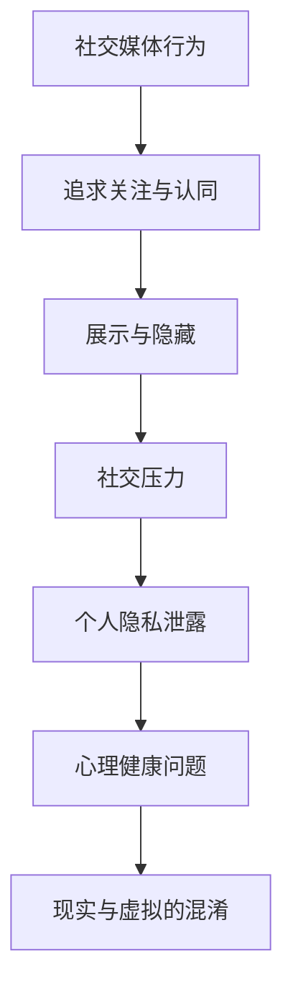
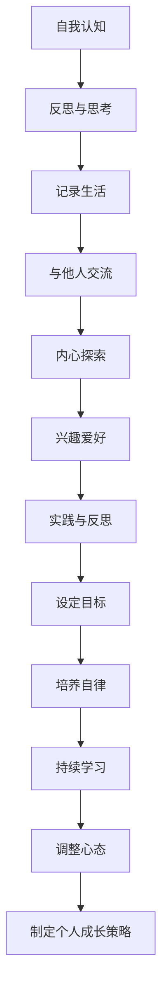
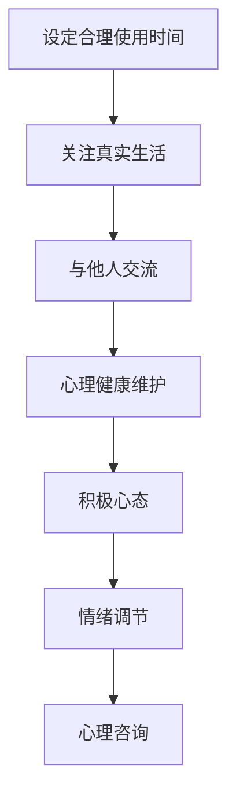
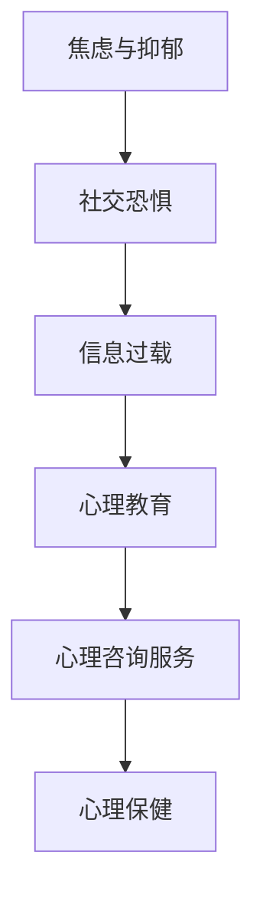
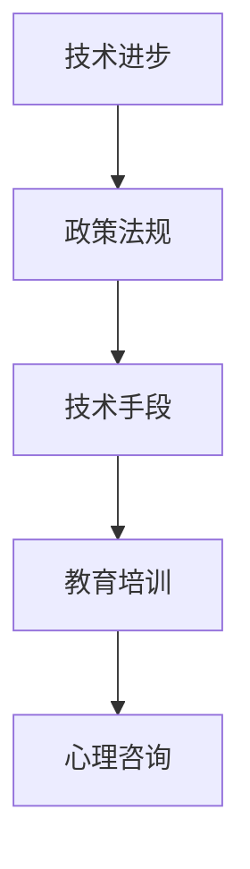

                 

### 文章标题

# 在社交媒体时代寻找真我：克服虚拟身份带来的困扰

### 文章关键词

- 社交媒体
- 虚拟身份
- 真我
- 心理健康
- 个人成长
- 数字生活

### 摘要

在社交媒体时代，虚拟身份的泛滥让人们在现实与网络世界中迷失了自我。本文从背景介绍、核心概念联系、算法原理讲解、数学模型和公式、项目实战等方面，深入探讨了如何在这个数字化世界中寻找真我，克服虚拟身份带来的困扰。通过分析社交媒体的特点、虚拟身份的影响以及寻找真我和心理健康的方法，我们提出了具体的解决方案，帮助读者在数字生活中找回自我。

### 文章正文

## 引言

随着互联网和社交媒体的迅速发展，人们的社交方式发生了翻天覆地的变化。从最初的脸书（Facebook）、推特（Twitter）等社交平台的兴起，到如今微信、抖音、微博等多元化社交媒体的普及，社交媒体已经成为了人们日常生活中不可或缺的一部分。然而，在这个虚拟世界中，人们不得不面对一个严峻的问题：虚拟身份的泛滥。

### 虚拟身份的概念与影响

虚拟身份，指的是在数字世界中，人们通过头像、昵称、个人简介等表现出的形象和性格特点。虚拟身份可以让人们在网络世界中自由地展示自我，摆脱现实世界的束缚。然而，虚拟身份的滥用和泛滥，却给人们带来了诸多困扰。

#### 1. 社交媒体行为分析

在社交媒体上，人们的行为模式具有一定的规律性。通过对社交媒体用户行为的分析，可以发现以下几点：

- **追求关注与认同**：人们普遍希望在社交媒体上获得关注和认同，因此会通过发布内容、点赞、评论等方式来增加自己的影响力。
- **展示与隐藏**：在虚拟身份的掩护下，人们可以展示自己理想中的形象，同时隐藏现实中的不足和困境。
- **社交压力**：由于虚拟身份的存在，人们在社交媒体上面临的社交压力增大，可能导致心理问题。

#### 2. 虚拟身份的影响

虚拟身份对人们的生活产生了深远的影响：

- **个人隐私泄露**：虚拟身份的滥用可能导致个人隐私泄露，给人们的生活带来不便和困扰。
- **心理健康问题**：虚拟身份的泛滥可能导致人们沉迷于数字世界，影响现实生活中的心理健康。
- **现实与虚拟的混淆**：长期生活在虚拟身份中，可能导致人们在现实与虚拟之间产生混淆，影响个人成长。

#### 3. 社交媒体行为分析流程图

## 寻找真我的方法与策略

在社交媒体时代，寻找真我成为了许多人面临的重要课题。以下是一些寻找真我的方法和策略：

#### 1. 自我认知的重要性

自我认知是寻找真我的第一步。只有真正了解自己，才能找到真实的自我。以下是一些建议：

- **反思与思考**：定期进行自我反思，思考自己的优点、缺点、兴趣和价值观。
- **记录生活**：通过记录自己的生活、感受和想法，了解自己的内心世界。
- **与他人交流**：与亲友、同事、心理医生等进行深入交流，获取他人的观点和建议。

#### 2. 寻找真我的方法

以下是一些具体的寻找真我的方法：

- **内心探索**：通过冥想、瑜伽等静心方式，探索自己的内心世界。
- **兴趣爱好**：发掘自己的兴趣爱好，通过参与活动、学习新技能来提升自我。
- **实践与反思**：通过实际行动来验证自己的想法和观点，并在实践中不断反思和调整。

#### 3. 制定个人成长策略

为了更好地寻找真我，我们需要制定个人成长策略。以下是一些建议：

- **设定目标**：明确自己的目标和方向，制定具体的行动计划。
- **培养自律**：培养自律习惯，坚持每天进行自我成长。
- **持续学习**：学习新知识、新技能，提升自己的综合素质。
- **调整心态**：保持积极的心态，面对生活中的挑战和困难。

#### 4. 寻找真我的流程图

## 克服虚拟身份带来的困扰

虚拟身份的泛滥给人们的生活带来了诸多困扰。以下是一些克服虚拟身份困扰的策略：

#### 1. 虚拟身份的负面影响

虚拟身份的负面影响主要包括：

- **个人隐私泄露**：虚拟身份的滥用可能导致个人隐私泄露，给人们的生活带来不便和困扰。
- **心理健康问题**：虚拟身份的泛滥可能导致人们沉迷于数字世界，影响现实生活中的心理健康。
- **现实与虚拟的混淆**：长期生活在虚拟身份中，可能导致人们在现实与虚拟之间产生混淆，影响个人成长。

#### 2. 克服虚拟身份困扰的策略

以下是一些克服虚拟身份困扰的策略：

- **设定合理使用时间**：合理安排社交媒体使用时间，避免沉迷于虚拟世界。
- **关注真实生活**：将注意力转移到现实生活中的事物，培养现实生活中的兴趣爱好。
- **与他人交流**：与亲友、同事等进行深入交流，获取现实世界的支持和帮助。
- **心理健康维护**：关注自己的心理健康，通过冥想、瑜伽等方式进行心理调节。

#### 3. 心理健康的重要性

心理健康是寻找真我、克服虚拟身份困扰的关键。以下是一些建议：

- **积极心态**：保持积极的心态，面对生活中的挑战和困难。
- **情绪调节**：学会调节情绪，避免情绪波动过大。
- **心理咨询**：在遇到心理困扰时，寻求专业的心理咨询帮助。

#### 4. 心理健康维护流程图

## 社交媒体时代的心理健康

在社交媒体时代，心理健康问题日益突出。以下是一些社交媒体时代的心理健康问题和解决方案：

#### 1. 社交媒体时代的心理健康问题

- **焦虑与抑郁**：社交媒体上的竞争和压力可能导致焦虑和抑郁。
- **社交恐惧**：虚拟身份的存在可能导致人们在现实生活中产生社交恐惧。
- **信息过载**：社交媒体上的信息过多，可能导致人们产生信息过载。

#### 2. 解决方案

- **心理教育**：加强心理健康教育，提高人们对心理问题的认识和处理能力。
- **心理咨询服务**：提供便捷的心理咨询服务，帮助人们解决心理困扰。
- **心理保健**：推广心理保健方法，如冥想、瑜伽等，帮助人们保持心理健康。

#### 3. 社交媒体时代的心理健康流程图

## 未来展望与解决方案

随着社交媒体的不断发展，虚拟身份带来的困扰将越来越严重。为了解决这个问题，我们需要从多个方面入手：

#### 1. 未来发展趋势

- **技术进步**：人工智能和大数据技术的进步，将有助于更好地了解和分析人们的行为，提供个性化的解决方案。
- **政策法规**：政府和企业需要加强监管，制定相关政策法规，规范虚拟身份的使用。

#### 2. 解决方案

- **技术手段**：利用人工智能和大数据技术，对虚拟身份进行识别和监管，防止滥用。
- **教育培训**：加强心理健康教育和虚拟身份教育，提高人们的认知能力和自我保护意识。
- **心理咨询**：提供便捷的心理咨询服务，帮助人们解决虚拟身份带来的心理困扰。

#### 3. 未来展望与解决方案流程图

## 最佳实践 Tips、小结、注意事项、拓展阅读

### 最佳实践 Tips

1. **合理安排社交媒体使用时间**：设定每天社交媒体使用的时间限制，避免沉迷于虚拟世界。
2. **关注真实生活**：培养现实生活中的兴趣爱好，积极参与社交活动，提高现实生活的质量。
3. **心理健康维护**：关注自己的心理健康，定期进行心理调节，遇到心理困扰时及时寻求专业帮助。

### 小结

在社交媒体时代，寻找真我、克服虚拟身份带来的困扰是一个长期而艰巨的任务。通过自我认知、心理教育、技术手段等多方面的努力，我们可以逐渐找到真实的自我，提高心理健康水平。

### 注意事项

1. **保护个人隐私**：在使用社交媒体时，要注意保护个人隐私，避免泄露敏感信息。
2. **合理安排时间**：避免沉迷于社交媒体，合理安排时间，确保身心健康。

### 拓展阅读

1. 《数字化生存：数字化时代的社会心理学研究》
2. 《社交媒体心理学：虚拟世界中的心理现象》
3. 《虚拟身份与真实自我：社交媒体时代的心理探索》

### 作者信息

作者：AI天才研究院/AI Genius Institute & 禅与计算机程序设计艺术 /Zen And The Art of Computer Programming

## 结束语

在社交媒体时代，寻找真我、克服虚拟身份带来的困扰，已成为我们不得不面对的课题。通过本文的探讨，我们希望读者能够认识到虚拟身份的负面影响，学会寻找真我和维护心理健康的方法。在数字生活中，让我们共同努力，找回真实的自我。

