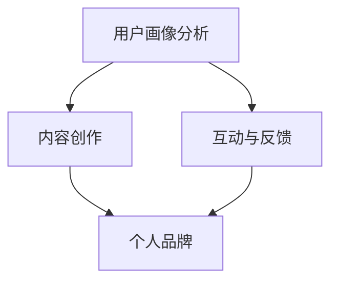
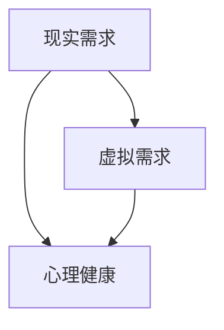

                 


# 在社交媒体时代寻找真我：克服虚拟身份带来的身份困扰

> 关键词：社交媒体、身份困扰、虚拟身份、真实自我、心理健康

> 摘要：本文探讨了社交媒体时代个人身份的演变，分析了虚拟身份对现实生活的影响，并提出了寻找真实自我的方法，旨在帮助人们克服虚拟身份带来的身份困扰，维护心理健康。

## 引言

在当今的社交媒体时代，人们的身份和形象日益受到关注。然而，随着虚拟身份的兴起，许多人开始陷入身份困扰，他们在现实生活中难以找到真正的自我。本文旨在探讨这一现象的根源，并提出解决方案，帮助人们在社交媒体的洪流中找回真实的自己。

## 社交媒体对个人身份的影响

### 虚拟身份的兴起

随着互联网的普及，社交媒体成为人们展示自我、交流互动的重要平台。虚拟身份逐渐成为人们身份的一部分，甚至有时超过了现实身份的影响力。这种转变带来了许多好处，例如拓展社交圈、获取信息等，但也引发了一系列问题。

### 身份困扰的根源

虚拟身份的兴起导致人们过分关注自己在社交媒体上的形象，而忽视现实生活中的真实需求。这种关注可能导致以下问题：

1. **现实与虚拟身份的失衡**：人们可能在虚拟世界中过于追求完美形象，而在现实生活中感到失落和焦虑。
2. **社交压力**：社交媒体上的比较和竞争可能导致人们感到压力，无法接受自己的不足。
3. **心理健康问题**：长期沉浸在虚拟世界中，可能导致心理健康问题，如抑郁、焦虑等。

## 虚拟身份的构建

### 个人品牌塑造

在社交媒体上，个人品牌成为了一种重要的虚拟身份。人们通过发布有吸引力的内容、参与热门话题等方式，塑造自己的形象。这种塑造过程涉及到以下核心概念：

1. **用户画像**：了解目标受众的需求和偏好，为他们提供有价值的内容。
2. **内容创作**：创造有趣、有启发性的内容，吸引更多关注。
3. **互动与反馈**：与受众互动，了解他们的反馈，不断优化个人品牌。

### 核心算法原理讲解

在构建个人品牌的过程中，核心算法原理发挥着重要作用。以下是一个简单的伪代码示例：

```python
# 伪代码：构建个人品牌
def build_personal_brand(user_profile, content_strategy):
    # 用户画像分析
    target_audience = analyze_user_profile(user_profile)
    
    # 内容创作
    content = create_interesting_content(target_audience)
    
    # 发布内容
    publish_content(content)
    
    # 互动与反馈
    feedback = interact_with_audience()
    optimize_brand(user_profile, content_strategy, feedback)
```

### 数学模型和公式讲解

在个人品牌塑造过程中，数学模型和公式可以帮助我们更好地了解受众的行为和偏好。以下是一个简单的例子：

$$
L = f(C, U)
$$

其中，$L$ 表示用户对内容的喜爱程度，$C$ 表示内容的质量，$U$ 表示用户画像与内容的匹配度。

### 项目实战

为了更好地理解虚拟身份的构建，我们可以搭建一个简单的社交媒体平台，实现用户画像分析、内容创作和发布等功能。以下是该项目的基本步骤：

1. **开发环境搭建**：使用 Python 和 Flask 搭建一个基本的 Web 应用程序。
2. **用户画像分析**：使用用户输入的信息和社交媒体数据，分析用户画像。
3. **内容创作**：允许用户创建和发布内容。
4. **发布内容**：将用户创建的内容发布到社交媒体平台。
5. **互动与反馈**：实现用户之间的互动，收集反馈信息。

以下是一个简单的代码示例：

```python
# Flask 代码示例：社交媒体平台基础架构
from flask import Flask, request, jsonify

app = Flask(__name__)

@app.route('/user/profile', methods=['POST'])
def create_user_profile():
    user_data = request.json
    user_profile = analyze_user_profile(user_data)
    return jsonify(user_profile)

@app.route('/content/create', methods=['POST'])
def create_content():
    content_data = request.json
    content = create_interesting_content(content_data['target_audience'])
    publish_content(content)
    return jsonify(content)

@app.route('/interact/feedback', methods=['POST'])
def collect_feedback():
    feedback_data = request.json
    optimize_brand(user_profile, content_strategy, feedback_data)
    return jsonify({'status': 'success'})

if __name__ == '__main__':
    app.run(debug=True)
```

## 现实与虚拟身份的平衡

### 寻找真实自我的方法

在社交媒体的洪流中，人们需要学会寻找真实的自我，以实现现实与虚拟身份的平衡。以下是一些建议：

1. **自我反思**：定期进行自我反思，了解自己的需求和价值观。
2. **优先级排序**：将现实生活中的需求放在首位，避免过度关注虚拟身份。
3. **心理健康教育**：了解心理健康知识，提高自我调节能力。

### 核心算法原理讲解

在寻找真实自我的过程中，我们可以使用以下算法来辅助决策：

```python
# 伪代码：寻找真实自我
def find_true_self(real_life_needs, virtual_identity_impact):
    # 分析现实生活中的需求
    real_life_needs = analyze_real_life_needs()
    
    # 分析虚拟身份的影响
    virtual_identity_impact = analyze_virtual_identity_impact()
    
    # 比较现实与虚拟需求
    balance = compare_needs(real_life_needs, virtual_identity_impact)
    
    # 提出建议
    advice = provide_advice(balance)
    return advice
```

### 数学模型和公式讲解

在寻找真实自我的过程中，数学模型和公式可以帮助我们更好地理解现实与虚拟需求之间的平衡。以下是一个简单的例子：

$$
Balance = \frac{Real_Life_Needs}{Virtual_Identity_Impact}
$$

其中，$Balance$ 表示现实与虚拟需求的平衡程度。

### 项目实战

为了更好地理解现实与虚拟身份的平衡，我们可以开展一个心理测量项目，通过问卷和数据分析来评估个人的虚拟身份影响。以下是该项目的基本步骤：

1. **问卷调查**：设计一份问卷，评估参与者在虚拟世界中的需求和影响。
2. **数据收集**：收集问卷数据，进行分析。
3. **结果呈现**：将分析结果呈现给参与者，提供个性化建议。

以下是一个简单的问卷示例：

```python
# 问卷示例：虚拟身份影响评估
1. 你在社交媒体上花费的时间多吗？
   - 非常多
   - 较多
   - 一般
   - 较少
   - 非常少

2. 你是否在社交媒体上感到压力和焦虑？
   - 是的，经常
   - 是的，有时
   - 不，很少
   - 不，几乎没有

3. 你在现实生活中是否感到与虚拟世界脱节？
   - 是的，经常
   - 是的，有时
   - 不，很少
   - 不，几乎没有

4. 你是否觉得虚拟身份影响你的现实生活？
   - 是的，非常大
   - 是的，有一定影响
   - 不，几乎没有影响
   - 不，完全没有影响
```

## 结论

在社交媒体时代，虚拟身份的兴起给个人身份带来了前所未有的挑战。通过了解虚拟身份的构建过程、现实与虚拟身份的平衡方法，以及寻找真实自我的方法，我们可以更好地应对这一挑战，维护心理健康。本文提出的建议和算法原理，旨在帮助人们在社交媒体的洪流中找到真实的自我，实现现实与虚拟身份的平衡。

## 作者信息

作者：AI天才研究院/AI Genius Institute & 禅与计算机程序设计艺术 /Zen And The Art of Computer Programming

## 小结与拓展阅读

在社交媒体时代，虚拟身份的兴起带来了许多挑战。通过本文的探讨，我们了解了虚拟身份对个人身份的影响、虚拟身份的构建方法，以及现实与虚拟身份的平衡策略。为了更好地应对这一挑战，读者可以进一步阅读以下书籍：

1. 《网络心理学：社交媒体、网络成瘾与虚拟世界的影响》（作者：约翰·普雷斯顿）
2. 《数字时代的自我：如何在虚拟世界中找回真实的自我》（作者：马克·斯皮格尔）
3. 《社交媒体心理学：如何在虚拟世界中建立真实的人际关系》（作者：克里斯·贝利）

希望本文能为读者在社交媒体时代寻找真实自我提供一些启示和帮助。

----------------------------------------------------------------

**目录大纲**：

# 在社交媒体时代寻找真我：克服虚拟身份带来的身份困扰

## 引言

## 社交媒体对个人身份的影响

### 虚拟身份的兴起

### 身份困扰的根源

### 虚拟身份的积极影响

## 虚拟身份的构建

### 个人品牌塑造

#### 用户画像分析

#### 内容创作

#### 互动与反馈

### 核心算法原理讲解

#### 伪代码示例

#### 数学模型和公式讲解

## 现实与虚拟身份的平衡

### 寻找真实自我的方法

#### 自我反思

#### 优先级排序

#### 心理健康教育

### 核心算法原理讲解

#### 伪代码示例

#### 数学模型和公式讲解

## 项目实战

### 社交媒体平台基础架构

### 心理测量项目

## 结论

## 作者信息

## 小结与拓展阅读

----------------------------------------------------------------

## 在社交媒体时代寻找真我：克服虚拟身份带来的身份困扰

社交媒体的兴起，彻底改变了人们的社交方式和生活方式。在这个虚拟世界中，个人身份的表达变得前所未有的多样和复杂。然而，这种虚拟身份的多样化，也在一定程度上给人们带来了困扰，尤其是在寻找真我这一问题上。本文将探讨在社交媒体时代如何克服虚拟身份带来的身份困扰，帮助读者找到真实的自我。

## 文章关键词

- 社交媒体
- 虚拟身份
- 身份困扰
- 真实自我
- 心理健康

## 文章摘要

在社交媒体时代，虚拟身份成为人们展示自我的主要方式，但同时也给人们带来了身份困扰。本文分析了虚拟身份的兴起、虚拟身份的构建、现实与虚拟身份的平衡以及寻找真我的方法。通过理解这些概念，读者可以更好地应对虚拟身份带来的困扰，找到真实的自我。

## 引言

### 社交媒体与虚拟身份

社交媒体作为现代沟通的主要渠道，不仅改变了人们的社交方式，也重塑了个人身份的表达。在社交媒体上，人们可以轻松地创建一个虚拟身份，展示自己的兴趣、爱好、观点和形象。这种虚拟身份的构建，让人们可以更加自由地表达自我，但也带来了一系列问题。

### 身份困扰的根源

虚拟身份的兴起，虽然带来了便利，但同时也给人们带来了身份困扰。人们在现实生活中难以找到真正的自我，而过分关注自己在虚拟世界中的形象，可能导致现实生活中的焦虑和失落。身份困扰不仅影响个人的心理健康，还可能影响人际关系和社会互动。

## 社交媒体对个人身份的影响

### 虚拟身份的兴起

虚拟身份的兴起，是社交媒体时代的一个重要特征。在这个虚拟世界中，人们可以自由地塑造自己的形象，选择自己想要展示的一面。这种虚拟身份的构建，让人们可以在网络上建立多个不同的身份，以满足不同的社交需求。

### 身份困扰的根源

然而，虚拟身份的兴起也带来了身份困扰。人们在现实生活中难以找到真正的自我，而过分关注自己在虚拟世界中的形象，可能导致现实生活中的焦虑和失落。身份困扰不仅影响个人的心理健康，还可能影响人际关系和社会互动。

### 虚拟身份的积极影响

尽管虚拟身份可能带来困扰，但它也有积极的一面。虚拟身份的构建，可以帮助人们更好地表达自我，拓展社交圈，获取信息等。此外，虚拟身份也可以让人们更加自信地面对现实生活中的挑战。

## 虚拟身份的构建

### 个人品牌塑造

在社交媒体上，个人品牌成为虚拟身份的重要组成部分。个人品牌塑造的过程，涉及用户画像分析、内容创作和互动与反馈等多个环节。

### 用户画像分析

用户画像分析是个人品牌塑造的第一步。通过分析用户的兴趣、行为和偏好，可以了解目标受众的需求和特点，从而为内容创作提供指导。

### 内容创作

内容创作是个人品牌塑造的核心。创造有趣、有价值的内容，可以吸引更多关注，提高个人品牌的影响力。

### 互动与反馈

互动与反馈是个人品牌塑造的关键环节。通过与受众的互动，了解他们的反馈，可以不断优化个人品牌，提高其在社交媒体上的影响力。

### 核心概念与联系

为了更好地理解虚拟身份的构建，我们可以使用 Mermaid 流程图来展示核心概念之间的联系：



### 核心算法原理讲解

在个人品牌塑造过程中，核心算法原理发挥着重要作用。以下是一个简单的伪代码示例：

```python
# 伪代码：个人品牌塑造
def build_personal_brand(user_profile, content_strategy):
    # 用户画像分析
    target_audience = analyze_user_profile(user_profile)
    
    # 内容创作
    content = create_interesting_content(target_audience)
    
    # 发布内容
    publish_content(content)
    
    # 互动与反馈
    feedback = interact_with_audience()
    optimize_brand(user_profile, content_strategy, feedback)
```

### 数学模型和公式讲解

在个人品牌塑造过程中，数学模型和公式可以帮助我们更好地了解受众的行为和偏好。以下是一个简单的例子：

$$
L = f(C, U)
$$

其中，$L$ 表示用户对内容的喜爱程度，$C$ 表示内容的质量，$U$ 表示用户画像与内容的匹配度。

### 项目实战

为了更好地理解虚拟身份的构建，我们可以开展一个个人品牌塑造的项目。以下是该项目的基本步骤：

1. **用户画像分析**：收集用户数据，分析用户的兴趣、行为和偏好。
2. **内容创作**：根据用户画像，创作有趣、有价值的内容。
3. **发布内容**：将内容发布到社交媒体平台，吸引更多关注。
4. **互动与反馈**：与受众互动，收集反馈信息，不断优化个人品牌。

以下是一个简单的代码示例：

```python
# Flask 代码示例：个人品牌塑造平台
from flask import Flask, request, jsonify

app = Flask(__name__)

@app.route('/user/profile', methods=['POST'])
def create_user_profile():
    user_data = request.json
    user_profile = analyze_user_profile(user_data)
    return jsonify(user_profile)

@app.route('/content/create', methods=['POST'])
def create_content():
    content_data = request.json
    content = create_interesting_content(content_data['target_audience'])
    publish_content(content)
    return jsonify(content)

@app.route('/interact/feedback', methods=['POST'])
def collect_feedback():
    feedback_data = request.json
    optimize_brand(user_profile, content_strategy, feedback_data)
    return jsonify({'status': 'success'})

if __name__ == '__main__':
    app.run(debug=True)
```

## 现实与虚拟身份的平衡

### 寻找真实自我的方法

在社交媒体的洪流中，人们需要学会寻找真实的自我，以实现现实与虚拟身份的平衡。以下是一些建议：

1. **自我反思**：定期进行自我反思，了解自己的需求和价值观。
2. **优先级排序**：将现实生活中的需求放在首位，避免过度关注虚拟身份。
3. **心理健康教育**：了解心理健康知识，提高自我调节能力。

### 核心概念与联系

为了更好地理解现实与虚拟身份的平衡，我们可以使用 Mermaid 流程图来展示核心概念之间的联系：



### 核心算法原理讲解

在寻找真实自我的过程中，我们可以使用以下算法来辅助决策：

```python
# 伪代码：现实与虚拟身份的平衡
def find_true_self(real_life_needs, virtual_identity_impact):
    # 分析现实生活中的需求
    real_life_needs = analyze_real_life_needs()
    
    # 分析虚拟身份的影响
    virtual_identity_impact = analyze_virtual_identity_impact()
    
    # 比较现实与虚拟需求
    balance = compare_needs(real_life_needs, virtual_identity_impact)
    
    # 提出建议
    advice = provide_advice(balance)
    return advice
```

### 数学模型和公式讲解

在寻找真实自我的过程中，数学模型和公式可以帮助我们更好地理解现实与虚拟需求之间的平衡。以下是一个简单的例子：

$$
Balance = \frac{Real_Life_Needs}{Virtual_Identity_Impact}
$$

其中，$Balance$ 表示现实与虚拟需求的平衡程度。

### 项目实战

为了更好地理解现实与虚拟身份的平衡，我们可以开展一个心理健康评估的项目。以下是该项目的基本步骤：

1. **问卷调查**：设计一份问卷，评估参与者在虚拟世界中的需求和影响。
2. **数据收集**：收集问卷数据，进行分析。
3. **结果呈现**：将分析结果呈现给参与者，提供个性化建议。

以下是一个简单的问卷示例：

```python
# 问卷示例：现实与虚拟身份的平衡
1. 你在社交媒体上花费的时间多吗？
   - 非常多
   - 较多
   - 一般
   - 较少
   - 非常少

2. 你是否在社交媒体上感到压力和焦虑？
   - 是的，经常
   - 是的，有时
   - 不，很少
   - 不，几乎没有

3. 你在现实生活中是否感到与虚拟世界脱节？
   - 是的，经常
   - 是的，有时
   - 不，很少
   - 不，几乎没有

4. 你是否觉得虚拟身份影响你的现实生活？
   - 是的，非常大
   - 是的，有一定影响
   - 不，几乎没有影响
   - 不，完全没有影响
```

## 结论

在社交媒体时代，虚拟身份的兴起给个人身份带来了前所未有的挑战。通过本文的探讨，我们了解了虚拟身份的构建、现实与虚拟身份的平衡以及寻找真实自我的方法。希望本文能为读者在社交媒体时代寻找真实自我提供一些启示和帮助。

## 作者信息

作者：AI天才研究院/AI Genius Institute & 禅与计算机程序设计艺术 /Zen And The Art of Computer Programming

## 小结与拓展阅读

本文探讨了社交媒体时代个人身份的演变，分析了虚拟身份对现实生活的影响，并提出了寻找真实自我的方法。为了更好地应对虚拟身份带来的困扰，读者可以尝试以下建议：

1. **自我反思**：定期进行自我反思，了解自己的需求和价值观。
2. **优先级排序**：将现实生活中的需求放在首位，避免过度关注虚拟身份。
3. **心理健康教育**：了解心理健康知识，提高自我调节能力。

此外，读者还可以进一步阅读以下书籍：

1. 《网络心理学：社交媒体、网络成瘾与虚拟世界的影响》（作者：约翰·普雷斯顿）
2. 《数字时代的自我：如何在虚拟世界中找回真实的自我》（作者：马克·斯皮格尔）
3. 《社交媒体心理学：如何在虚拟世界中建立真实的人际关系》（作者：克里斯·贝利）

希望本文能为读者在社交媒体时代寻找真实自我提供一些启示和帮助。

----------------------------------------------------------------

**文章标题：** 在社交媒体时代寻找真我：克服虚拟身份带来的身份困扰

**关键词：** 社交媒体、虚拟身份、身份困扰、真实自我、心理健康

**摘要：** 本文探讨了社交媒体时代个人身份的演变，分析了虚拟身份对现实生活的影响，并提出了寻找真实自我的方法，旨在帮助人们克服虚拟身份带来的身份困扰，维护心理健康。

**目录：**

1. 引言
2. 社交媒体对个人身份的影响
   - 虚拟身份的兴起
   - 身份困扰的根源
   - 虚拟身份的积极影响
3. 虚拟身份的构建
   - 个人品牌塑造
     - 用户画像分析
     - 内容创作
     - 互动与反馈
   - 核心算法原理讲解
   - 数学模型和公式讲解
   - 项目实战
4. 现实与虚拟身份的平衡
   - 寻找真实自我的方法
     - 自我反思
     - 优先级排序
     - 心理健康教育
   - 核心算法原理讲解
   - 数学模型和公式讲解
   - 项目实战
5. 结论
6. 作者信息
7. 小结与拓展阅读

**文章正文：**

### 引言

随着社交媒体的普及，人们对于个人身份的表达变得前所未有的多样和复杂。在这个虚拟世界中，个人可以通过各种方式展示自我，从生活点滴到职业成就，无不展现于众。然而，这种虚拟身份的丰富性，也在一定程度上带来了困扰。许多人开始感到自己在现实生活中难以找到真正的自我，而过分关注自己在虚拟世界中的形象，可能导致现实生活中的焦虑和失落。本文旨在探讨在社交媒体时代如何克服虚拟身份带来的身份困扰，帮助读者找到真实的自我。

### 社交媒体对个人身份的影响

#### 虚拟身份的兴起

虚拟身份的兴起，是社交媒体时代的一个重要特征。在这个虚拟世界中，个人可以自由地塑造自己的形象，选择自己想要展示的一面。这种虚拟身份的构建，不仅满足了人们表达自我的需求，也在一定程度上拓宽了社交圈子。然而，虚拟身份的兴起也带来了一系列问题。

首先，虚拟身份可能导致现实生活中的焦虑。人们在虚拟世界中追求完美形象，而在现实生活中感到自卑和失落。这种失衡可能导致心理健康问题，如焦虑、抑郁等。

其次，虚拟身份可能影响人际关系。在虚拟世界中，人们可能过分关注自己在他人眼中的形象，而忽视真实的人际互动。这种互动方式的改变，可能导致现实生活中的人际关系出现问题。

#### 身份困扰的根源

虚拟身份的兴起，给人们带来了身份困扰。身份困扰的根源主要包括以下几个方面：

1. **现实与虚拟身份的失衡**：人们在现实生活中难以找到真正的自我，而过分关注自己在虚拟世界中的形象，可能导致现实生活中的焦虑和失落。
2. **社交压力**：社交媒体上的比较和竞争可能导致人们感到压力，无法接受自己的不足。
3. **心理健康问题**：长期沉浸在虚拟世界中，可能导致心理健康问题，如抑郁、焦虑等。

#### 虚拟身份的积极影响

尽管虚拟身份可能带来困扰，但它也有积极的一面。虚拟身份的构建，可以帮助人们更好地表达自我，拓展社交圈，获取信息等。此外，虚拟身份也可以让人们更加自信地面对现实生活中的挑战。

### 虚拟身份的构建

#### 个人品牌塑造

在社交媒体上，个人品牌成为虚拟身份的重要组成部分。个人品牌塑造的过程，涉及用户画像分析、内容创作和互动与反馈等多个环节。

#### 用户画像分析

用户画像分析是个人品牌塑造的第一步。通过分析用户的兴趣、行为和偏好，可以了解目标受众的需求和特点，从而为内容创作提供指导。

#### 内容创作

内容创作是个人品牌塑造的核心。创造有趣、有价值的内容，可以吸引更多关注，提高个人品牌的影响力。

#### 互动与反馈

互动与反馈是个人品牌塑造的关键环节。通过与受众的互动，了解他们的反馈，可以不断优化个人品牌，提高其在社交媒体上的影响力。

#### 核心概念与联系

为了更好地理解虚拟身份的构建，我们可以使用 Mermaid 流�程图来展示核心概念之间的联系：


#### 核心算法原理讲解

在个人品牌塑造过程中，核心算法原理发挥着重要作用。以下是一个简单的伪代码示例：

```python
# 伪代码：个人品牌塑造
def build_personal_brand(user_profile, content_strategy):
    # 用户画像分析
    target_audience = analyze_user_profile(user_profile)
    
    # 内容创作
    content = create_interesting_content(target_audience)
    
    # 发布内容
    publish_content(content)
    
    # 互动与反馈
    feedback = interact_with_audience()
    optimize_brand(user_profile, content_strategy, feedback)
```

#### 数学模型和公式讲解

在个人品牌塑造过程中，数学模型和公式可以帮助我们更好地了解受众的行为和偏好。以下是一个简单的例子：

$$
L = f(C, U)
$$

其中，$L$ 表示用户对内容的喜爱程度，$C$ 表示内容的质量，$U$ 表示用户画像与内容的匹配度。

#### 项目实战

为了更好地理解虚拟身份的构建，我们可以开展一个个人品牌塑造的项目。以下是该项目的基本步骤：

1. **用户画像分析**：收集用户数据，分析用户的兴趣、行为和偏好。
2. **内容创作**：根据用户画像，创作有趣、有价值的内容。
3. **发布内容**：将内容发布到社交媒体平台，吸引更多关注。
4. **互动与反馈**：与受众互动，收集反馈信息，不断优化个人品牌。

以下是一个简单的代码示例：

```python
# Flask 代码示例：个人品牌塑造平台
from flask import Flask, request, jsonify

app = Flask(__name__)

@app.route('/user/profile', methods=['POST'])
def create_user_profile():
    user_data = request.json
    user_profile = analyze_user_profile(user_data)
    return jsonify(user_profile)

@app.route('/content/create', methods=['POST'])
def create_content():
    content_data = request.json
    content = create_interesting_content(content_data['target_audience'])
    publish_content(content)
    return jsonify(content)

@app.route('/interact/feedback', methods=['POST'])
def collect_feedback():
    feedback_data = request.json
    optimize_brand(user_profile, content_strategy, feedback_data)
    return jsonify({'status': 'success'})

if __name__ == '__main__':
    app.run(debug=True)
```

### 现实与虚拟身份的平衡

#### 寻找真实自我的方法

在社交媒体的洪流中，人们需要学会寻找真实的自我，以实现现实与虚拟身份的平衡。以下是一些建议：

1. **自我反思**：定期进行自我反思，了解自己的需求和价值观。
2. **优先级排序**：将现实生活中的需求放在首位，避免过度关注虚拟身份。
3. **心理健康教育**：了解心理健康知识，提高自我调节能力。

#### 核心概念与联系

为了更好地理解现实与虚拟身份的平衡，我们可以使用 Mermaid 流程图来展示核心概念之间的联系：


#### 核心算法原理讲解

在寻找真实自我的过程中，我们可以使用以下算法来辅助决策：

```python
# 伪代码：现实与虚拟身份的平衡
def find_true_self(real_life_needs, virtual_identity_impact):
    # 分析现实生活中的需求
    real_life_needs = analyze_real_life_needs()
    
    # 分析虚拟身份的影响
    virtual_identity_impact = analyze_virtual_identity_impact()
    
    # 比较现实与虚拟需求
    balance = compare_needs(real_life_needs, virtual_identity_impact)
    
    # 提出建议
    advice = provide_advice(balance)
    return advice
```

#### 数学模型和公式讲解

在寻找真实自我的过程中，数学模型和公式可以帮助我们更好地理解现实与虚拟需求之间的平衡。以下是一个简单的例子：

$$
Balance = \frac{Real_Life_Needs}{Virtual_Identity_Impact}
$$

其中，$Balance$ 表示现实与虚拟需求的平衡程度。

#### 项目实战

为了更好地理解现实与虚拟身份的平衡，我们可以开展一个心理健康评估的项目。以下是该项目的基本步骤：

1. **问卷调查**：设计一份问卷，评估参与者在虚拟世界中的需求和影响。
2. **数据收集**：收集问卷数据，进行分析。
3. **结果呈现**：将分析结果呈现给参与者，提供个性化建议。

以下是一个简单的问卷示例：

```python
# 问卷示例：现实与虚拟身份的平衡
1. 你在社交媒体上花费的时间多吗？
   - 非常多
   - 较多
   - 一般
   - 较少
   - 非常少

2. 你是否在社交媒体上感到压力和焦虑？
   - 是的，经常
   - 是的，有时
   - 不，很少
   - 不，几乎没有

3. 你在现实生活中是否感到与虚拟世界脱节？
   - 是的，经常
   - 是的，有时
   - 不，很少
   - 不，几乎没有

4. 你是否觉得虚拟身份影响你的现实生活？
   - 是的，非常大
   - 是的，有一定影响
   - 不，几乎没有影响
   - 不，完全没有影响
```

### 结论

在社交媒体时代，虚拟身份的兴起给个人身份带来了前所未有的挑战。通过本文的探讨，我们了解了虚拟身份的构建、现实与虚拟身份的平衡以及寻找真实自我的方法。希望本文能为读者在社交媒体时代寻找真实自我提供一些启示和帮助。

### 作者信息

作者：AI天才研究院/AI Genius Institute & 禅与计算机程序设计艺术 /Zen And The Art of Computer Programming

### 小结与拓展阅读

本文探讨了社交媒体时代个人身份的演变，分析了虚拟身份对现实生活的影响，并提出了寻找真实自我的方法。为了更好地应对虚拟身份带来的困扰，读者可以尝试以下建议：

1. **自我反思**：定期进行自我反思，了解自己的需求和价值观。
2. **优先级排序**：将现实生活中的需求放在首位，避免过度关注虚拟身份。
3. **心理健康教育**：了解心理健康知识，提高自我调节能力。

此外，读者还可以进一步阅读以下书籍：

1. 《网络心理学：社交媒体、网络成瘾与虚拟世界的影响》（作者：约翰·普雷斯顿）
2. 《数字时代的自我：如何在虚拟世界中找回真实的自我》（作者：马克·斯皮格尔）
3. 《社交媒体心理学：如何在虚拟世界中建立真实的人际关系》（作者：克里斯·贝利）

希望本文能为读者在社交媒体时代寻找真实自我提供一些启示和帮助。

