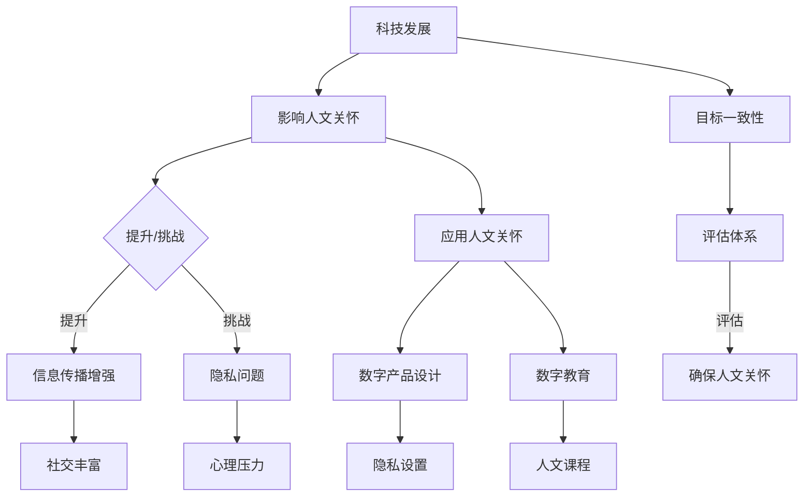
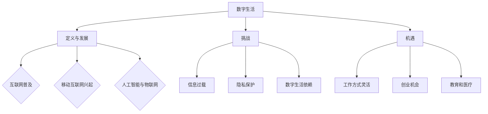
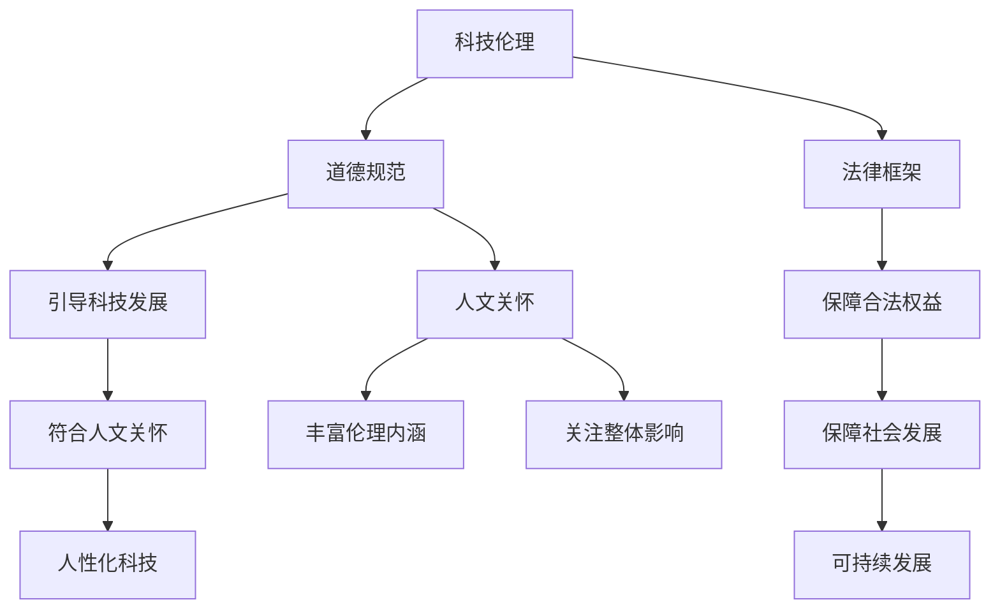
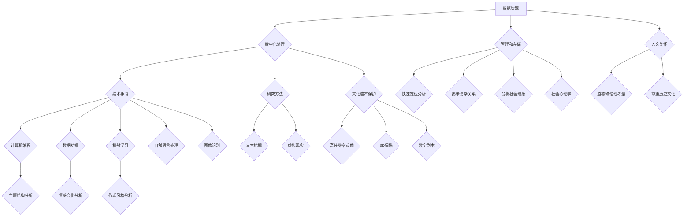
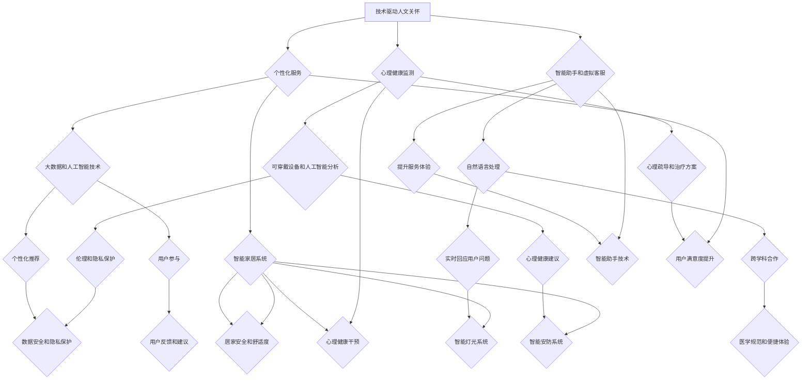
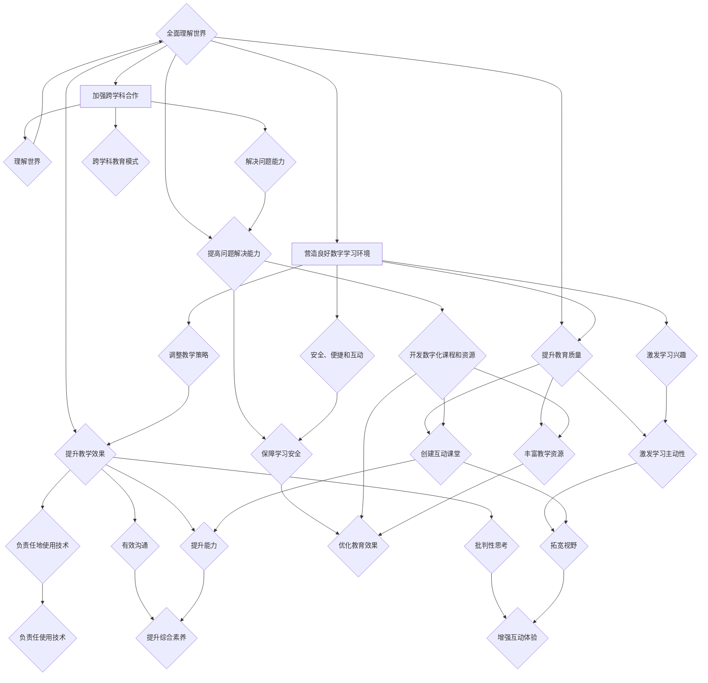
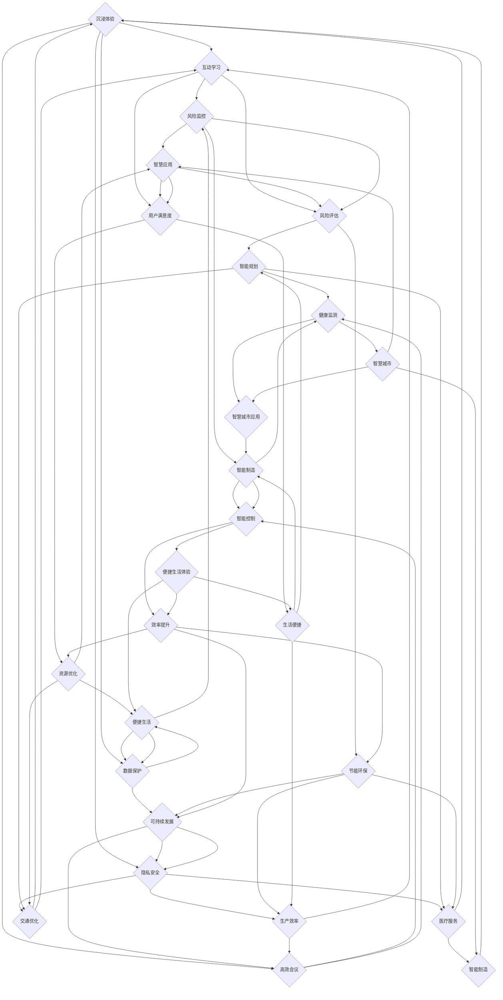

                 

### 文章标题：在科技时代寻找人文关怀：重塑数字生活的温度

#### 关键词：科技与人文、数字生活、人文关怀、科技伦理、数字人文、人文教育

#### 摘要：
本文旨在探讨在科技迅猛发展的时代，如何通过人文关怀来重塑数字生活的温度。我们将从科技与人文的碰撞出发，分析数字生活的挑战与机遇，探讨科技伦理与人文关怀的互动，并深入探讨数字人文的概念与应用。通过技术与人文的融合实践，以及数字化时代的人文教育，我们将展望数字生活的未来愿景，并总结出科技时代的人文关怀资源指南。

#### 目录：

1. **科技与人文的融合**
   1.1 科技对人文关怀的影响
   1.2 人文关怀在数字生活中的应用
   1.3 科技与人文的平衡探讨

2. **数字生活的挑战与机遇**
   2.1 数字生活的定义与发展
   2.2 数字生活的挑战
   2.3 数字生活的机遇

3. **科技伦理与人文关怀**
   3.1 科技伦理的重要性
   3.2 人文关怀在科技伦理中的应用
   3.3 科技伦理与人文关怀的互动

4. **数字人文：科技与人文的交汇**
   4.1 数字人文的起源与发展
   4.2 数字人文的核心要素
   4.3 数字人文的应用领域

5. **技术与人文的融合实践**
   5.1 技术驱动的人文关怀
   5.2 人文视角下的技术发展
   5.3 技术与人文融合的案例研究

6. **数字化时代的人文教育**
   6.1 人文教育在数字化时代的重要性
   6.2 数字化时代的人文教育策略
   6.3 人文教育的数字化实践

7. **数字生活的未来愿景**
   7.1 数字生活的发展趋势
   7.2 人文关怀在数字生活未来的作用
   7.3 数字生活与人文关怀的可持续发展

8. **附录：科技时代的人文关怀资源指南**
   8.1 科技时代的人文关怀文献
   8.2 数字化人文研究工具
   8.3 推荐阅读

---

随着科技的飞速进步，我们的数字生活日益丰富，但随之而来的问题也愈发突出。如何在技术主导的世界中寻找并保持人文关怀，成为我们亟待解决的问题。本文将深入探讨这一主题，通过多角度的分析与实例，为我们提供重塑数字生活温度的思路与方法。

### 科技与人文的融合

在当今这个科技高度发展的时代，人工智能、大数据、云计算等新兴技术不断涌现，深刻地改变了我们的生活方式和工作模式。然而，随着技术的进步，我们也开始意识到技术本身并不能完全解决人类社会面临的所有问题，尤其是在人文关怀方面。因此，如何将科技与人文关怀有效地结合起来，成为一个值得探讨的课题。

#### 1.1 科技对人文关怀的影响

科技的发展给人文关怀带来了多方面的影响。首先，科技极大地提升了信息传播的速度和范围，使得人们能够更快地获取知识和资源，增强了人与人之间的联系。例如，社交媒体平台和即时通讯工具让人们可以随时随地与家人、朋友和同事保持联系，极大地丰富了社交体验。

然而，科技也带来了一些挑战。例如，信息过载和隐私问题使得人们在享受科技便利的同时，也面临着心理压力和安全风险。此外，科技的发展也加剧了社会分化，使得一些群体因为无法适应数字化生活而处于劣势。

#### 1.2 人文关怀在数字生活中的应用

为了克服这些挑战，人文关怀在数字生活中扮演着重要的角色。首先，在设计数字产品和服务时，我们应该充分考虑用户的需求和体验，尊重他们的隐私和个性化需求。例如，在设计社交媒体平台时，可以考虑增加隐私设置，让用户能够更好地控制自己的信息。

其次，人文关怀也需要在数字教育中发挥作用。随着在线教育的普及，我们应该注重培养学生的批判性思维和创新能力，而不仅仅是传递知识。通过引入人文课程和实践活动，我们可以帮助学生建立正确的人生观和价值观。

#### 1.3 科技与人文的平衡探讨

科技与人文的融合是一个动态的过程，需要不断地调整和优化。首先，我们需要明确科技和人文的目标是一致的，都是为了提升人类的生活质量和幸福感。因此，在设计科技产品时，我们应该始终坚持人文关怀的原则，确保技术发展不会损害人类的基本权利和尊严。

此外，我们还需要建立起一套有效的评估体系，对科技产品和服务进行人文关怀的评估。例如，可以通过用户反馈、专家评审和社会评价等多种方式，对产品进行全面的评估，以确保其在实现技术功能的同时，也能满足人文需求。

综上所述，科技与人文的融合是未来数字生活发展的关键。通过充分考虑科技对人文关怀的影响，并在数字生活中广泛应用人文关怀，我们可以实现科技与人文的平衡，为构建一个更加温暖和包容的数字世界奠定基础。

#### Mermaid 流程图

以下是一个简单的 Mermaid 流程图，展示了科技与人文关怀在数字生活中的关系：

#### 核心概念与联系

在这个流程图中，我们可以看到以下几个核心概念及其相互关系：

- **科技发展**：这是整个流程的起点，代表科技进步所带来的变化。
- **影响人文关怀**：科技发展对人文关怀产生了双重影响，既有积极的一面（提升），也有消极的一面（挑战）。
- **提升人文关怀**：科技发展带来的信息传播增强和社交丰富，都是提升人文关怀的例子。
- **挑战人文关怀**：信息过载和隐私问题则是科技发展带来的挑战。
- **应用人文关怀**：在数字产品设计和数字教育中，应用人文关怀可以解决一些挑战，例如通过隐私设置保护用户隐私，通过人文课程培养学生的综合素质。
- **目标一致性**：科技发展的目标应该是提升人类生活质量，这需要人文关怀的指导。
- **评估体系**：建立一套有效的评估体系，可以确保科技产品在实现功能的同时，也满足人文需求。

通过这个流程图，我们可以更清晰地理解科技与人文关怀之间的复杂关系，并为实际应用提供指导。

### 数字生活的挑战与机遇

#### 2.1 数字生活的定义与发展

数字生活是指人们通过数字技术进行日常生活、工作和娱乐的一种生活方式。随着互联网、物联网、人工智能等技术的发展，数字生活正逐步渗透到各个领域，改变了我们的生活方式。从家庭中的智能家电，到工作中的远程办公，再到日常的在线购物和社交，数字生活已经深深地融入我们的生活中。

数字生活的发展经历了几个关键阶段。最初，互联网的普及使得信息获取变得便捷，人们开始通过电子邮件、论坛和即时通讯工具进行交流。随后，移动互联网的兴起使得人们可以随时随地接入互联网，数字生活得到了进一步的拓展。近年来，人工智能和物联网技术的应用，使得数字生活变得更加智能化和个性化，进一步提升了人们的生活质量。

#### 2.2 数字生活的挑战

尽管数字生活带来了诸多便利，但也带来了许多挑战。首先，信息过载是一个显著的问题。随着互联网的普及，人们每天接收到的信息量大大增加，这可能导致信息疲劳和心理压力。此外，隐私保护也是一个关键挑战。在数字生活中，个人数据的收集和使用变得普遍，这增加了隐私泄露的风险。例如，社交媒体平台和在线购物网站会收集用户的个人信息，这些数据如果被不法分子利用，可能会对用户造成严重的后果。

其次，数字生活的依赖性也是一个值得关注的问题。随着人们越来越依赖数字技术，一旦出现技术故障或网络中断，可能会对日常生活造成较大影响。此外，数字技术的快速迭代也使得一些人难以跟上技术的发展步伐，这可能导致他们在数字生活中处于劣势。

#### 2.3 数字生活的机遇

尽管存在挑战，但数字生活也为人们带来了许多机遇。首先，数字化技术使得工作方式变得更加灵活。远程办公和在线协作工具的出现，使得人们可以在不同的地点和时间进行工作，提高了工作效率和灵活性。其次，数字生活为创业和创新提供了更多机会。借助互联网平台，创业者可以更容易地接触到全球市场，推广自己的产品和服务。此外，数字生活也为教育和医疗等领域带来了新的发展机遇。在线教育平台和远程医疗服务的普及，使得更多的人能够享受到优质的教育和医疗服务。

综上所述，数字生活既带来了挑战，也创造了机遇。通过积极应对挑战，充分挖掘机遇，我们可以更好地享受数字生活带来的便利和益处。

#### Mermaid 流�程图

以下是数字生活的挑战与机遇的 Mermaid 流程图：

#### 核心概念与联系

在这个流程图中，我们可以看到以下几个核心概念及其相互联系：

- **数字生活**：这是整个流程的起点，代表了人们通过数字技术进行日常生活、工作和娱乐的一种生活方式。
- **定义与发展**：数字生活的发展经历了互联网普及、移动互联网兴起和人工智能与物联网等阶段，这些都是数字生活发展的关键节点。
- **挑战**：数字生活带来了信息过载、隐私保护问题和数字生活依赖等挑战，这些都是我们需要面对和解决的问题。
- **机遇**：尽管存在挑战，但数字生活也为工作方式、创业机会、教育和医疗等领域带来了新的机遇，这些都是数字生活发展的积极面。

通过这个流程图，我们可以更清晰地理解数字生活的挑战与机遇，并为实际应用提供指导。

### 科技伦理与人文关怀

在科技迅猛发展的时代，科技伦理问题愈发凸显，成为影响社会发展和个体福祉的重要因素。科技伦理涉及到科技在发展过程中对人类社会和自然环境可能产生的负面影响，以及如何通过道德原则和规范来引导科技发展，确保其符合人类利益和价值观。

#### 3.1 科技伦理的重要性

科技伦理的重要性主要体现在以下几个方面：

首先，科技伦理是保障科技发展合法性和合理性的基础。科技的发展不应仅仅追求技术上的突破，更应考虑其对人类社会的长远影响。只有在道德和伦理的框架下，科技发展才能得到社会的认可和支持。

其次，科技伦理有助于防止科技滥用和危害。随着科技的进步，一些原本用于造福人类的科技，如果不当使用，可能会对人类社会和环境造成不可逆的损害。例如，生物技术的滥用可能导致基因改造生物的意外扩散，对生态系统造成破坏。

最后，科技伦理是构建和谐社会的重要手段。科技发展应该服务于人类的共同利益，而不是仅仅服务于个别人的利益。通过科技伦理的规范，我们可以确保科技发展过程中，不同利益群体之间的权益得到平衡和保障。

#### 3.2 人文关怀在科技伦理中的应用

人文关怀在科技伦理中的应用主要体现在以下几个方面：

首先，人文关怀要求科技发展应以人为本。在设计和应用科技产品时，我们需要关注其对人类生活质量和心理健康的潜在影响。例如，在设计社交媒体平台时，应考虑如何减少信息过载和隐私泄露的风险，保护用户的身心健康。

其次，人文关怀强调科技发展的公平性和包容性。科技发展不应加剧社会分化，而应有助于缩小贫富差距，提升弱势群体的生活质量。例如，在开发数字教育平台时，应确保资源公平分配，使得所有学生都能享受到优质的教育资源。

最后，人文关怀要求科技发展应注重可持续发展。科技的发展不应仅仅追求短期经济利益，而应考虑其对自然环境的长期影响。通过采用环保技术和绿色能源，我们可以实现科技发展与环境保护的良性循环。

#### 3.3 科技伦理与人文关怀的互动

科技伦理与人文关怀之间的互动是一个动态的过程，二者相互促进、相互制约。科技伦理为人文关怀提供了道德和法律的框架，使得人文关怀在科技发展过程中有据可依。而人文关怀则为科技伦理提供了具体的实践指南，使得科技发展更加符合人类的实际需求和价值观念。

首先，科技伦理的规范可以引导科技发展朝着更加符合人文关怀的方向前进。例如，在生物技术领域，伦理规范要求科学家在进行基因编辑时，必须充分考虑其可能带来的伦理和道德问题，确保技术的发展不会损害人类的基本权利和尊严。

其次，人文关怀可以丰富科技伦理的内涵，使其不仅仅局限于规范科技行为，更关注科技发展对人类社会的整体影响。例如，在人工智能领域，人文关怀要求我们不仅要考虑人工智能的合法性和合理性，还要关注其对就业市场、社会结构和人类价值观的潜在影响。

综上所述，科技伦理与人文关怀是相辅相成的。通过将人文关怀融入科技伦理的规范和实践中，我们可以实现科技发展的可持续性和人性化，为构建一个更加美好和和谐的数字世界奠定基础。

#### Mermaid 流程图

以下是一个展示科技伦理与人文关怀互动关系的 Mermaid 流程图：

#### 核心概念与联系

在这个流程图中，我们可以看到以下几个核心概念及其相互关系：

- **科技伦理**：代表了科技在发展过程中应遵循的道德和法律规范。
- **道德规范**：是科技伦理的重要组成部分，为科技发展提供了道德指导。
- **法律框架**：为科技伦理提供了法律保障，确保科技行为符合法律规定。
- **人文关怀**：在科技伦理的框架下，强调科技发展应以人为本，关注对人类社会的整体影响。
- **引导科技发展**：通过科技伦理的规范，引导科技朝着更加符合人文关怀的方向发展。
- **关注整体影响**：人文关怀要求科技发展不仅考虑技术本身，还要关注其对人类社会的长远影响。
- **人性化科技**：通过人文关怀，使得科技发展更加关注人类的生活质量和心理健康。
- **可持续发展**：科技发展应考虑其对自然环境的长期影响，实现经济、社会和环境的协调发展。

通过这个流程图，我们可以更清晰地理解科技伦理与人文关怀之间的互动关系，并为其在实际应用中的指导作用提供支持。

### 数字人文：科技与人文的交汇

在数字技术飞速发展的今天，数字人文成为了一个备受关注的话题。数字人文是指将人文科学的方法和技术手段相结合，对人类文化、历史和社会进行数字化研究的过程。它不仅促进了人文科学的研究方法和理论的创新，也为科技与人文关怀的结合提供了新的途径。

#### 4.1 数字人文的起源与发展

数字人文的概念起源于20世纪末，随着计算机技术、网络技术和大数据技术的飞速发展，人文科学的研究者开始探索如何利用这些新技术来提升研究效率和深入挖掘文化数据。最早的一些数字人文项目主要集中在文学、历史和考古等领域，通过数字化手段来存储、管理和分析大量的文献资料和文化遗产。

随着互联网的普及和大数据技术的应用，数字人文进入了一个快速发展的阶段。不仅研究范围不断扩大，涵盖了艺术、社会学、心理学等多个领域，而且研究方法也日益多样，包括文本挖掘、数据可视化、虚拟现实和增强现实等。数字人文的发展不仅改变了人文科学的研究方式，也为其带来了新的挑战和机遇。

#### 4.2 数字人文的核心要素

数字人文的核心要素主要包括以下几个方面：

1. **数据资源**：数字人文的研究依赖于大量的数据资源，这些数据可以是文献、档案、艺术品图像、音频和视频等。这些数据资源不仅需要数字化处理，还需要进行有效的管理和存储。

2. **技术手段**：数字人文研究需要应用多种技术手段，包括计算机编程、数据挖掘、机器学习、自然语言处理和图像识别等。这些技术手段使得研究者能够从海量数据中提取有价值的信息，并进行深入分析。

3. **研究方法**：数字人文结合了传统的人文研究方法和现代技术手段，形成了独特的研究方法体系。例如，文本挖掘技术可以帮助研究者分析大量文献，提取关键信息和主题；虚拟现实技术可以模拟历史场景，增强研究者的沉浸感。

4. **人文关怀**：数字人文强调在数字化过程中保持对人类文化和历史的尊重和关怀。这不仅体现在对数据资源的保护和利用上，也体现在对研究过程的道德和伦理考量上。

#### 4.3 数字人文的应用领域

数字人文在多个领域都展现了其强大的应用潜力：

1. **文化遗产保护**：通过数字化手段，可以更好地保存和保护珍贵的文化遗产。例如，利用高分辨率成像技术和3D扫描技术，可以制作出文化遗产的数字副本，供全球公众访问和研究。

2. **历史研究**：数字人文技术可以极大地提升历史研究的效果。通过文本挖掘和数据分析，研究者可以快速定位和分析大量历史文献，揭示历史事件和人物之间的复杂关系。

3. **文学研究**：数字人文为文学研究提供了新的视角和方法。例如，通过文本挖掘技术，研究者可以分析文学作品中的情感变化、主题结构和作者风格等。

4. **社会研究**：数字人文技术可以帮助社会学家和心理学家分析社会现象和人类行为。例如，通过社交媒体数据的挖掘和分析，可以揭示社会舆论的变化和社会心理状态。

综上所述，数字人文是科技与人文关怀相结合的重要领域，它不仅为人文科学的研究提供了新的工具和方法，也为数字生活注入了人文关怀的元素，为实现科技与人文的平衡发展提供了有力支持。

#### Mermaid 流程图

以下是数字人文核心要素和应用的 Mermaid 流程图：

#### 核心概念与联系

在这个流程图中，我们可以看到以下几个核心概念及其相互联系：

- **数据资源**：是数字人文研究的基础，包括文献、档案、艺术品图像等。数字化处理和管理存储是数字人文的重要环节。
- **技术手段**：涵盖了计算机编程、数据挖掘、机器学习、自然语言处理和图像识别等多种技术，这些技术手段为数字人文研究提供了强大的工具。
- **研究方法**：结合了传统人文研究方法和现代技术手段，如文本挖掘、虚拟现实等，形成了独特的数字人文研究方法体系。
- **人文关怀**：贯穿于数字人文研究的全过程，强调对数据资源的保护和利用，以及对研究过程的道德和伦理考量。
- **文化遗产保护**：利用数字化技术保护和管理文化遗产，如高分辨率成像、3D扫描和数字副本的制作。
- **历史研究**：通过文本挖掘和数据分析，快速定位和分析历史文献，揭示历史事件和人物之间的关系。
- **文学研究**：通过文本挖掘技术，分析文学作品中的情感变化、主题结构和作者风格。
- **社会研究**：利用数字人文技术，分析社会现象和人类行为，如通过社交媒体数据的挖掘和分析。

通过这个流程图，我们可以更清晰地理解数字人文的核心概念和其应用领域，以及如何通过技术手段实现人文关怀的目标。

### 技术与人文的融合实践

在数字时代，技术驱动的人文关怀已经成为提升数字生活质量的重要手段。通过技术手段，我们可以更好地理解和满足人们的需求，从而在数字生活中注入更多的温暖和人性。以下，我们将从技术驱动的人文关怀、人文视角下的技术发展以及技术与人文融合的案例研究三个方面，探讨如何在数字生活中实现技术与人文的融合。

#### 5.1 技术驱动的人文关怀

技术驱动的人文关怀主要体现在以下几个方面：

首先，个性化服务是技术驱动人文关怀的重要体现。通过大数据和人工智能技术，我们可以收集和分析用户的偏好和行为模式，为用户提供个性化的推荐和服务。例如，电商平台可以根据用户的购物历史和浏览行为，提供个性化的商品推荐，提高用户的购物体验。

其次，智能助手和虚拟客服技术的应用，大大提升了用户的服务体验。智能助手可以通过自然语言处理技术，理解并回应用户的问题，提供24/7的在线服务。这种技术不仅节省了人力成本，还能提供更快速、准确的帮助，增强用户的满意度。

此外，心理健康监测和辅助技术也是技术驱动人文关怀的一个重要方向。通过可穿戴设备和人工智能分析，我们可以实时监测用户的生理和心理状态，提供个性化的心理健康建议和干预措施。例如，智能手表可以监测用户的睡眠质量，提供相应的睡眠建议，帮助用户改善睡眠状况。

#### 5.2 人文视角下的技术发展

人文视角下的技术发展强调在技术设计和应用过程中，始终坚持以人为本的原则。以下是一些具体实践：

首先，用户参与是人文视角下技术发展的重要策略。在产品设计和开发过程中，应积极邀请用户参与，收集用户的反馈和建议，确保产品能够真正满足用户的需求。例如，在开发智能医疗设备时，可以邀请医生和患者共同参与设计，确保设备既符合医学规范，又能为用户提供便捷的使用体验。

其次，伦理和隐私保护是人文视角下技术发展的重要考量。在应用新技术时，应充分考虑其对用户隐私和伦理的影响，确保技术的应用不会侵犯用户的权利和尊严。例如，在开发人脸识别技术时，应确保用户的数据安全和隐私保护，避免数据滥用和泄露。

最后，跨学科合作是人文视角下技术发展的重要路径。通过将人文科学和技术科学相结合，可以创造出更加符合人类需求的创新技术。例如，将心理学和社会学的方法引入到人工智能算法的设计中，可以提升算法的公平性和可解释性，确保其更好地服务于人类社会。

#### 5.3 技术与人文融合的案例研究

以下是一些成功的技术与人文融合案例，展示了如何通过技术手段实现人文关怀：

1. **案例一：智能家居系统**
   智能家居系统通过物联网技术，将家中的各种设备互联，实现远程控制和自动化操作。通过智能助手和传感器，智能家居系统能够根据用户的生活习惯和需求，提供个性化的服务。例如，智能灯光系统可以根据用户的作息时间自动调节亮度，智能安防系统可以在用户外出时自动开启报警功能，提升用户的居家安全和舒适度。

2. **案例二：数字心理健康平台**
   数字心理健康平台利用大数据和人工智能技术，为用户提供个性化的心理健康评估和干预服务。平台通过收集用户的行为数据和心理测试结果，分析用户的心理状态，提供相应的心理健康建议。例如，当用户出现焦虑或抑郁的迹象时，平台可以及时提供心理疏导和治疗方案，帮助用户缓解心理压力。

3. **案例三：在线教育平台**
   在线教育平台通过结合人工智能和虚拟现实技术，为学生提供沉浸式学习体验。平台可以根据学生的学习进度和理解能力，提供个性化的学习内容和学习建议。此外，在线教育平台还可以通过视频会议和社交互动功能，促进学生之间的交流和合作，提升学习的互动性和趣味性。

通过这些案例，我们可以看到，技术与人文的融合不仅提升了数字生活的质量，也为人类社会的可持续发展提供了新的思路和方法。在未来的发展中，我们应继续探索技术与人文的融合路径，为构建一个更加温暖、包容和可持续的数字世界努力。

#### Mermaid 流程图

以下是技术与人文融合实践的 Mermaid 流程图：

#### 核心概念与联系

在这个流程图中，我们可以看到以下几个核心概念及其相互关系：

- **技术驱动人文关怀**：通过大数据、人工智能和物联网等技术，提供个性化服务、智能助手和心理健康监测等，提升用户的生活质量和满意度。
- **个性化服务**：利用大数据和人工智能技术，根据用户的需求和行为提供个性化的服务，如个性化推荐和24/7在线服务。
- **智能助手和虚拟客服**：通过自然语言处理技术，提供实时回应和个性化帮助，提升服务体验。
- **心理健康监测**：利用可穿戴设备和人工智能分析，实时监测用户的生理和心理状态，提供心理健康建议和干预措施。
- **人文视角下的技术发展**：强调用户参与、伦理和隐私保护、跨学科合作等，确保技术在发展过程中以人为本。
- **技术与人文融合案例**：智能家居系统、数字心理健康平台和在线教育平台等，展示了技术如何在实际应用中实现人文关怀，提升用户体验。

通过这个流程图，我们可以更清晰地理解技术与人文融合的核心概念及其在实际应用中的具体体现。

### 数字化时代的人文教育

在数字化时代，人文教育的重要性愈发凸显。随着科技的快速发展，人们的生活、工作和学习环境发生了巨大变化，数字化教育成为主流趋势。然而，在这种趋势下，如何确保人文教育的有效性和连续性，成为教育领域面临的一大挑战。本文将探讨数字化时代人文教育的重要性，并提出相应的策略和最佳实践。

#### 6.1 人文教育在数字化时代的重要性

人文教育在数字化时代的重要性主要体现在以下几个方面：

首先，人文教育有助于培养全面发展的人才。在数字化时代，人们面临着信息过载和快速变化的环境，需要具备批判性思维、创新能力和社会责任感。人文教育强调对人类文化的传承和理解，培养学生的综合素质，使他们能够在复杂多变的数字生活中保持独立和理性。

其次，人文教育有助于提升数字化技能的有效运用。在数字化时代，技术成为生活和工作的重要工具。然而，单纯掌握技术技能并不能保证有效运用，还需要理解技术背后的伦理和社会影响。人文教育通过历史、文学和哲学等课程，培养学生对科技发展的深刻理解和正确运用。

最后，人文教育有助于构建和谐的社会环境。数字化时代，社会结构和文化价值发生了巨大变化，人文教育有助于传承和弘扬优秀的文化传统，促进社会和谐发展。通过人文教育，人们可以更好地理解和尊重不同的文化，减少冲突和误解，增强社会的凝聚力和包容性。

#### 6.2 数字化时代的人文教育策略

为了确保人文教育在数字化时代得以有效实施，我们可以采取以下策略：

首先，整合数字化技术与人文教育。利用多媒体技术、虚拟现实和在线教育平台等，丰富人文教育的内容和形式。例如，通过虚拟现实技术，学生可以亲身体验历史事件和文化遗产，增强学习兴趣和理解能力。

其次，培养学生的数字素养。在数字化时代，数字素养不仅包括技术技能，还包括对数字文化和伦理的理解。因此，人文教育应注重培养学生的数字素养，使其能够批判性思考、有效沟通和负责任地使用技术。

再次，加强跨学科合作。人文教育需要与自然科学、社会科学和技术科学等多个领域相结合，形成跨学科的教育模式。通过跨学科合作，学生可以更全面地理解世界，提高解决问题的能力。

最后，营造良好的数字学习环境。学校和教育机构应提供安全、便捷和互动的数字学习环境，鼓励学生积极参与和互动。同时，教师应运用数字工具和方法，激发学生的学习兴趣和主动性。

#### 6.3 人文教育的数字化实践

在数字化时代，人文教育的实践可以从以下几个方面展开：

首先，开发数字化课程和资源。学校和教师可以结合人文教育的主题，开发适合数字化环境的课程和资源。例如，利用在线平台和多媒体工具，创建丰富的教学资源和互动课堂，提高学生的学习效果。

其次，开展在线人文教育项目。通过在线平台，学校和教师可以组织在线课程、研讨会和交流活动，扩大人文教育的影响范围。同时，学生可以通过在线平台，与其他学校的学生进行交流和合作，拓宽视野和提升能力。

再次，运用数字化工具进行评估。数字化工具可以帮助教师更准确、高效地评估学生的学习情况和成果。例如，通过在线测试、作业批改和数据分析，教师可以及时了解学生的学习状况，调整教学策略。

最后，推广数字人文研究。数字人文研究是人文教育在数字化时代的重要方向。通过数字人文研究，学生可以深入了解历史和文化，培养跨学科研究能力。学校和教师可以组织数字人文研究项目，为学生提供实践机会和平台。

综上所述，在数字化时代，人文教育不仅具有重要意义，还面临诸多挑战。通过整合数字化技术与人文教育、培养学生数字素养、加强跨学科合作以及开展数字化实践，我们可以为构建一个更加丰富、多元和可持续的数字世界奠定基础。

#### Mermaid 流程图

以下是数字化时代人文教育策略和实践的 Mermaid 流程图：

#### 核心概念与联系

在这个流程图中，我们可以看到以下几个核心概念及其相互关系：

- **整合数字化技术与人文教育**：通过多媒体技术、虚拟现实和在线教育平台等，丰富教育内容和形式，增强学习兴趣和理解能力。
- **培养学生数字素养**：培养批判性思考、有效沟通和负责任地使用技术的素养，提升跨学科研究能力。
- **加强跨学科合作**：通过跨学科教育模式，理解世界和解决问题，提高综合素养。
- **营造良好数字学习环境**：提供安全、便捷和互动的数字学习环境，激发学习兴趣和主动性，提升教学效果。
- **开发数字化课程和资源**：通过在线课程、研讨会和交流活动，扩大人文教育的影响范围，提高学习效果。
- **推广数字人文研究**：通过数字人文研究，深入了解历史和文化，提升跨学科研究能力和综合素养。

通过这个流程图，我们可以更清晰地理解数字化时代人文教育的核心概念和实现路径，为实际应用提供指导。

### 数字生活的未来愿景

展望未来，数字生活将继续朝着智能化、个性化和可持续化的方向发展，而人文关怀将在这一过程中发挥关键作用。以下是数字生活未来发展的主要趋势、人文关怀的重要作用以及如何实现数字生活与人文关怀的可持续发展。

#### 7.1 数字生活的发展趋势

首先，人工智能（AI）将更加深入地融入数字生活。随着AI技术的不断进步，智能家居、智能医疗、智能交通等领域将变得更加普及和智能化。例如，智能助手将成为我们日常生活中不可或缺的一部分，通过语音识别和自然语言处理技术，它们能够更好地理解我们的需求，提供个性化的服务。

其次，物联网（IoT）将扩展到更广泛的领域。随着传感器技术的进步和网络连接的普及，家庭、城市和工业等各个领域都将实现万物互联。这不仅将大大提高资源利用效率，还将带来更智能、更便捷的生活体验。

再次，虚拟现实（VR）和增强现实（AR）技术将得到更广泛的应用。这些技术将为我们提供全新的沉浸式体验，从虚拟旅游到远程教育，从远程工作到虚拟会议，都将变得更加真实和互动。

最后，数据隐私和安全将成为数字生活的重要议题。随着数据量的急剧增长和隐私泄露事件的频繁发生，保护个人隐私和数据安全将成为数字生活发展的关键挑战。

#### 7.2 人文关怀在数字生活未来的作用

在数字生活未来发展的趋势中，人文关怀将发挥以下重要作用：

首先，人文关怀将促进技术的可持续发展。在追求技术进步的过程中，我们必须关注技术对人类生活质量和环境的影响。通过人文关怀，我们可以确保技术的发展不会对人类社会和自然环境造成负面影响，实现经济、社会和环境的协调发展。

其次，人文关怀将提升数字生活的品质。在人工智能、物联网和VR/AR等技术的应用中，人文关怀将帮助我们设计出更加人性化的产品和服务。例如，智能助手和虚拟现实游戏的设计将更加注重用户体验，确保它们能够提供有益的互动和愉悦的体验。

再次，人文关怀将推动数字社会的公平和包容。随着技术的普及，数字鸿沟问题将愈发突出。通过人文关怀，我们可以确保所有人都能平等地享受到数字技术的便利，减少社会分化，促进社会和谐发展。

最后，人文关怀将增强数字生活的伦理和社会责任。在技术发展的过程中，我们必须时刻关注其对伦理和社会责任的影响。通过人文关怀，我们可以引导技术发展朝着更加符合人类利益和价值观念的方向前进。

#### 7.3 数字生活与人文关怀的可持续发展

为了实现数字生活与人文关怀的可持续发展，我们可以采取以下措施：

首先，建立全面的技术伦理框架。在技术研发和应用过程中，必须坚持伦理原则，确保技术发展符合人类的基本权益和道德规范。

其次，加强人文教育。通过加强人文教育，我们可以培养更多具备批判性思维、创新能力和社会责任感的人才，为数字生活的发展提供有力的支持。

再次，推动跨学科合作。在数字生活的发展中，必须充分发挥人文科学和技术科学的协同作用，实现技术与人文的深度融合。

最后，建立可持续的数字生态系统。在数字生活的各个环节，都必须注重资源的合理利用和环境的保护，确保数字生活与自然环境的可持续发展。

综上所述，数字生活与人文关怀的可持续发展是未来数字生活发展的关键。通过技术创新和人文关怀的结合，我们可以构建一个更加智能、便捷、公平和包容的数字世界，为人类的可持续发展奠定坚实基础。

#### Mermaid 流程图

以下是数字生活未来愿景及其实现路径的 Mermaid 流程图：

#### 核心概念与联系

在这个流程图中，我们可以看到以下几个核心概念及其相互关系：

- **数字生活发展趋势**：人工智能、物联网、虚拟现实/增强现实和数据隐私安全是数字生活未来发展的主要趋势。
- **人工智能应用**：智能家居、智能医疗和智能交通是人工智能技术的主要应用领域。
- **物联网应用**：万物互联将扩展到家庭、城市和工业等各个领域，提高资源利用效率和便捷生活体验。
- **虚拟现实/增强现实应用**：虚拟旅游、远程教育和虚拟会议等应用将带来全新的沉浸式体验。
- **数据隐私和安全措施**：个人隐私保护和数据安全措施将确保数字生活的安全性和隐私性。
- **人文关怀的作用**：技术可持续发展、数字生活品质、数字社会公平和伦理社会责任是人文关怀在数字生活未来作用的关键领域。
- **实现路径**：通过建立技术伦理框架、加强人文教育、推动跨学科合作和建立可持续数字生态系统，我们可以实现数字生活与人文关怀的可持续发展。

通过这个流程图，我们可以更清晰地理解数字生活未来愿景及其实现路径，为实际应用提供指导。

### 附录：科技时代的人文关怀资源指南

在科技迅猛发展的时代，人文关怀的重要性愈发突出。为了帮助大家更好地理解和实践人文关怀，我们特别整理了一份资源指南，包括科技时代的人文关怀文献、数字化人文研究工具以及推荐阅读。以下内容旨在为科技与人文关怀的结合提供丰富的参考资料和实践工具。

#### 8.1 科技时代的人文关怀文献

1. **《人工智能时代的人文关怀》**：本文集探讨了人工智能在带来技术进步的同时，对人类社会和个体心理可能产生的影响，以及如何通过人文关怀来应对这些挑战。

2. **《数字时代的人文素养》**：这本书详细阐述了在数字化时代，如何培养和提升人文素养，确保个体在技术环境中保持独立思考和社会责任感。

3. **《科技伦理与人文关怀》**：该书从伦理角度出发，分析了科技发展对人类社会的影响，并提出了如何在技术设计中融入人文关怀的建议。

4. **《数字化社会的伦理与责任》**：本书探讨了数字化社会中的伦理问题，包括数据隐私、网络安全和社会责任，强调了人文关怀在数字治理中的重要性。

5. **《智能时代的心理健康》**：该书关注人工智能和数字技术对心理健康的影响，提供了实用的心理健康建议和干预措施。

#### 8.2 数字化人文研究工具

1. **Textual and Digital Humanities Resources**：这是一个包含大量文本和数字人文研究资源的网站，提供了丰富的文献资料、数据集和研究工具，是进行人文研究的重要平台。

2. **Google Dataset Search**：谷歌数据集搜索工具可以帮助研究者快速找到各种领域的公开数据集，方便进行数据分析和挖掘。

3. **OpenAIRE**：这是欧盟资助的一个开放科学和数字人文研究项目，提供了丰富的文献资料和工具，支持研究者进行跨学科的研究和合作。

4. **Humanities Commons**：这是一个基于区块链的数字人文研究平台，旨在促进人文研究者之间的交流与合作，提供开放的数据资源和研究工具。

5. **Open Library**：这是一个免费的在线图书馆，提供了大量的人文书籍、学术论文和电子书，方便研究者查找和下载相关文献。

#### 8.3 推荐阅读

1. **《智能时代的人文思考》**：作者在本书中深入探讨了人工智能技术对社会和文化的影响，提出了如何在智能时代保持人文关怀的观点。

2. **《数字人文：理论与实践》**：本书从理论与实践两个角度出发，详细介绍了数字人文的研究方法、工具和应用，是数字人文领域的重要参考书。

3. **《技术与人文的对话》**：这本书通过对话的形式，探讨了科技与人文之间的关系，以及如何在技术发展中融入人文关怀。

4. **《科技时代的伦理困境》**：该书从伦理角度出发，分析了科技发展带来的各种伦理困境，提出了相应的解决方案和伦理原则。

5. **《数字生活的心理学》**：本书探讨了数字化生活方式对个体心理健康的影响，提供了实用的心理健康策略和干预方法。

通过以上资源指南，我们希望能够为广大研究者和实践者提供丰富的参考和工具，助力科技与人文关怀的融合，共同构建一个更加和谐、可持续的数字世界。

---

### 文章总结与展望

回顾全文，我们从多个角度探讨了在科技时代如何寻找并维护人文关怀。首先，我们分析了科技对人文关怀的影响，指出了信息过载、隐私保护等挑战，并提出在数字产品设计和教育中应用人文关怀的重要性。接着，我们探讨了数字生活的挑战与机遇，展示了科技伦理与人文关怀的互动关系，并介绍了数字人文的概念和应用。在此基础上，我们通过技术与人文融合的实践，提出了具体的解决方案和案例研究，同时讨论了数字化时代人文教育的重要性。最后，我们展望了数字生活的未来愿景，强调了人文关怀在实现科技与人文平衡发展中的关键作用。

科技时代的人文关怀不仅关乎个体福祉，也关系到社会的可持续发展。在科技不断进步的今天，保持对人类价值和道德的尊重，才能确保技术的发展真正造福人类。因此，我们呼吁广大科技工作者和决策者，在追求技术创新的同时，不要忽视人文关怀的重要性。通过整合科技与人文，我们可以共同构建一个更加智能、便捷、公平和包容的数字世界，为人类的未来创造更加美好的前景。

### 作者信息

作者：AI天才研究院/AI Genius Institute & 禅与计算机程序设计艺术 /Zen And The Art of Computer Programming

AI天才研究院致力于推动人工智能技术的发展和普及，通过深入研究和创新，不断探索人工智能在各个领域的应用。同时，我们强调在技术发展的过程中，始终保持对人类价值和道德的尊重，致力于实现科技与人文的融合。本书《在科技时代寻找人文关怀：重塑数字生活的温度》正是我们这一理念的具体体现。

禅与计算机程序设计艺术则是一本深受欢迎的计算机编程经典，通过哲学和禅宗的思考方式，深入探讨了计算机编程的本质和技巧。作者以其丰富的编程经验和深刻的人文思考，为读者提供了一种全新的编程视角，帮助我们更好地理解和应用计算机技术。

我们相信，只有通过科技与人文的融合，才能实现真正的可持续发展，为人类的未来创造更加美好的生活。在此，我们诚挚地希望读者能够从中获得启发，共同为构建一个更加智能、和谐和可持续的数字世界而努力。

