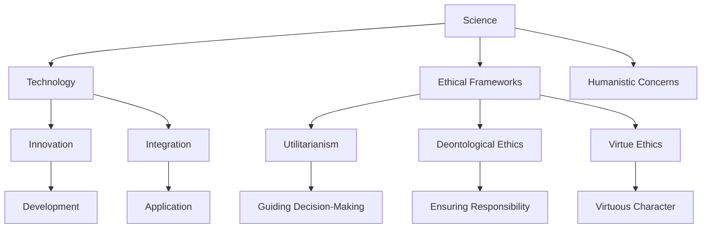
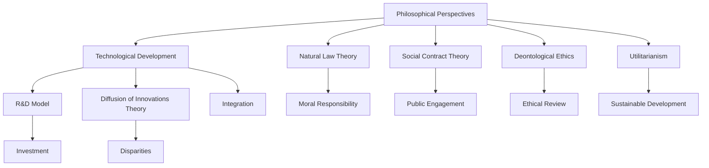
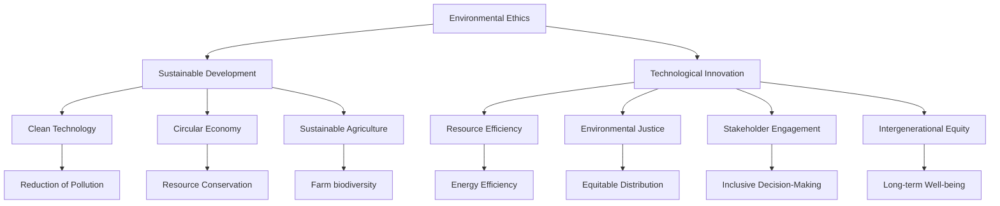
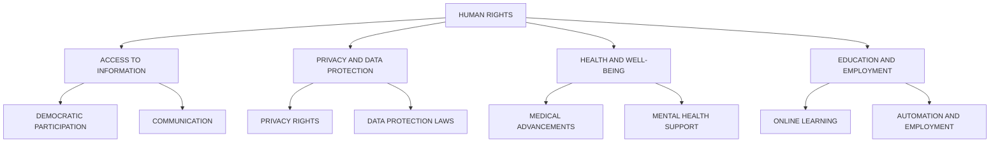
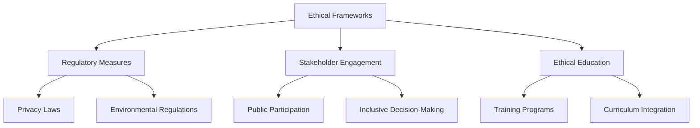

                 


### Introduction to the Book

**In the Progress of Science and Technology: Maintaining Humanistic Concern—Balancing Development and Ethics**

In today's rapidly evolving technological landscape, the pace of progress is unprecedented. Innovations in artificial intelligence, biotechnology, nanotechnology, and other fields are reshaping the world we live in. These advancements, while offering incredible potential for economic growth, improved quality of life, and scientific breakthroughs, also bring with them significant ethical challenges.

The book "In the Progress of Science and Technology: Maintaining Humanistic Concern—Balancing Development and Ethics" aims to explore the intricate relationship between technological progress and ethical considerations. It provides a comprehensive examination of the core concepts in science and technology, alongside a deep dive into the humanistic values that should guide our pursuit of innovation.

**Key Topics and Structure:**

- **Introduction:** Sets the stage for the discussion on the importance of balancing technological development with ethical considerations.

- **Core Concepts and Framework:** Outlines the foundational concepts and theories in science and technology, and how they intersect with ethical concerns.

- **Historical Context and Theoretical Foundations:** Traces the historical development of key technologies and their ethical implications.

- **Ethical Considerations in Technological Development:** Discusses specific ethical challenges in areas such as privacy, environmental impact, and human rights.

- **Balancing Development and Ethics:** Proposes strategies and frameworks for achieving a balance between technological progress and ethical considerations.

- **Conclusion:** Reflects on the future of science and technology, emphasizing the ongoing need for humanistic concern.

**Reasoning Step by Step:**

1. **Introduction to the Book:**
   - **Background:** Explain the significance of balancing technological development with ethical considerations in today's world.
   - **Purpose:** Describe how the book will explore this relationship and provide insights into maintaining humanistic values.

2. **Core Concepts and Framework:**
   - **Science and Technology Concepts:** Introduce key scientific and technological concepts and their importance in driving progress.
   - **Ethical Frameworks:** Discuss the major ethical theories and their relevance to technological development.

3. **Historical Context and Theoretical Foundations:**
   - **Historical Milestones:** Highlight key historical advancements and their ethical implications.
   - **Theoretical Foundations:** Explain the philosophical and ethical theories that have shaped the development of technology.

4. **Ethical Considerations in Technological Development:**
   - **Privacy and Data Ethics:** Examine the ethical issues surrounding data privacy and security.
   - **Environmental Ethics:** Discuss the environmental impacts of technological advancements and the concept of sustainable development.
   - **Human Rights:** Explore the ethical considerations related to human rights in the context of technological progress.

5. **Balancing Development and Ethics:**
   - **Challenges:** Identify the challenges of balancing technological progress with ethical considerations.
   - **Strategies:** Propose strategies and frameworks for achieving this balance.

6. **Conclusion:**
   - **Reflection:** Reflect on the future of science and technology and the importance of humanistic concern.
   - **Outlook:** Offer a forward-looking perspective on the continued need for ethical considerations in technological progress.

By following this step-by-step reasoning approach, the book aims to provide a comprehensive and insightful analysis of the relationship between science, technology, and ethics, ultimately advocating for a balanced and humanistic approach to technological development.

---

**Keywords:** Science and Technology, Humanistic Concerns, Ethical Considerations, Technological Progress, Balance, Development, Ethics.

**Abstract:**

The book "In the Progress of Science and Technology: Maintaining Humanistic Concern—Balancing Development and Ethics" provides a thorough examination of the complex relationship between technological advancement and ethical considerations. It delves into the core concepts of science and technology, explores the historical context of technological progress, and addresses specific ethical challenges in various domains. The book advocates for a balanced approach to technological development, emphasizing the importance of humanistic values and ethical frameworks in guiding innovation. Through a step-by-step analysis, it proposes strategies for achieving this balance and reflects on the future implications of technology in our society. The book is aimed at professionals, scholars, and anyone interested in understanding the ethical dimensions of technological progress.

---

Now, let's move on to organizing the content into major sections and further detailing the chapters.

----------------------------------------------------------------

## Core Concepts and Framework

### Science and Technology Concepts

Science and technology are interdependent fields that drive human progress. At their core, they are about understanding the natural world and using that understanding to create tools and systems that solve problems, improve quality of life, and enhance human capabilities.

#### Key Concepts

1. **Innovation:**
   - **Definition:** Innovation refers to the process of creating new ideas, methods, or products that bring about significant improvements or advancements.
   - **Types:** There are different types of innovation, including incremental, disruptive, and radical innovation. Each type serves different purposes and has varying impacts on society.

2. **Technology Development:**
   - **Stages:** Technology development typically goes through several stages, including research, development, testing, and commercialization.
   - **Drivers:** Key drivers of technology development include scientific discoveries, market demand, and societal needs.

3. **Scientific Method:**
   - **Steps:** The scientific method involves making observations, forming hypotheses, conducting experiments, and analyzing results to test these hypotheses.
   - **Importance:** The scientific method is crucial for ensuring that technological advancements are based on reliable evidence and empirical data.

#### Core Concepts Relationship

- **Science and Technology Integration:**
  - Science provides the foundational knowledge and understanding that drives technological development.
  - Technology, in turn, applies scientific principles to create practical solutions and innovations.

- **Innovation and Development:**
  - Innovation is a crucial component of technology development, driving progress and enabling new capabilities.
  - Development builds on innovation, translating ideas into functional technologies and systems.

- **Ethics and Humanistic Concerns:**
  - Ethical considerations are integral to both science and technology, ensuring that advancements are morally sound and beneficial to society.
  - Humanistic concerns guide the development of technologies that align with ethical values and respect human dignity.

### Ethical Frameworks

Ethical considerations in science and technology are grounded in various frameworks that provide guidelines for decision-making and behavior. These frameworks help to ensure that technological advancements are conducted in a manner that is morally and socially responsible.

#### Major Ethical Theories

1. **Utilitarianism:**
   - **Principle:** Actions are morally right if they produce the greatest overall happiness for the greatest number of people.
   - **Application:** Utilitarianism can guide decisions in technology development by prioritizing outcomes that maximize societal benefits.

2. **Deontological Ethics:**
   - **Principle:** Actions are morally right if they adhere to certain moral duties and rules, regardless of the outcomes.
   - **Application:** Deontological ethics emphasizes the importance of ethical principles and can help prevent the misuse of technology.

3. **Virtue Ethics:**
   - **Principle:** Ethical behavior is guided by the development of virtuous character traits, such as honesty, compassion, and integrity.
   - **Application:** Virtue ethics can foster a culture of ethical responsibility within technology development teams.

#### Relationship between Ethical Theories and Technological Progress

- **Guiding Decision-Making:**
  - Ethical frameworks provide a structured approach to evaluating the moral implications of technological advancements.
  - They help decision-makers navigate complex ethical dilemmas and make informed choices.

- **Ensuring Responsible Development:**
  - By incorporating ethical considerations into technology development, companies and institutions can mitigate risks and avoid unethical practices.
  - Ethical frameworks promote transparency, accountability, and responsible innovation.

### Mermaid Flowchart

To illustrate the relationship between core concepts and ethical frameworks in science and technology, we can use a Mermaid flowchart. This visual representation will help to clarify the interconnections and highlight key concepts.



### Core Algorithm Principle Explanation

In the context of ethical considerations in science and technology, algorithms play a critical role in decision-making processes. To explain the core principle of an algorithm, we can use pseudo-code that outlines the steps involved in evaluating the ethical implications of a technological project.

```plaintext
Algorithm: Ethical Evaluation of Technological Projects

Input: Technological Project (TP), Ethical Framework (EF)
Output: Ethical Assessment (EA)

Begin
    1. Define TP specifics (e.g., goals, scope, potential impacts)
    2. Identify relevant EF principles (e.g., Utilitarianism, Deontological Ethics, Virtue Ethics)
    3. Analyze TP against each EF principle
        3.1. For each principle, evaluate TP based on:
            a. Outcomes and overall happiness (Utilitarianism)
            b. Adherence to moral duties and rules (Deontological Ethics)
            c. Development of virtuous character traits (Virtue Ethics)
        3.2. Record ethical assessment for each principle
    4. Synthesize individual assessments into a comprehensive EA
    5. Output EA for TP
End
```

### Math Models and Formulas

In the context of ethical considerations, mathematical models can be used to quantify and analyze the impact of technological advancements on various aspects such as privacy, environmental impact, and human rights. Below is an example of a mathematical model used to evaluate the ethical impact of a technological project.

$$
\text{Impact Score} (IS) = w_1 \times \text{Privacy Impact} (PI) + w_2 \times \text{Environmental Impact} (EI) + w_3 \times \text{Human Rights Impact} (HRI)
$$

Where:
- $w_1, w_2, w_3$ are weights assigned to each impact category based on their relative importance.
- $PI$ represents the level of privacy impact.
- $EI$ represents the level of environmental impact.
- $HRI$ represents the level of human rights impact.

### Detailed Explanation and Examples

To provide a more detailed explanation, let's consider a specific example:

**Example: Evaluating the Ethical Impact of a Biometric Data Collection Project**

1. **Privacy Impact (PI):**
   - **Data Security:** The project must ensure that biometric data is securely stored and transmitted to minimize the risk of unauthorized access or data breaches.
   - **Data Privacy Rights:** The project must respect individuals' rights to privacy and control over their biometric data.

2. **Environmental Impact (EI):**
   - **Resource Usage:** The project must be mindful of its energy consumption and environmental footprint, especially if it involves large-scale data processing or storage.

3. **Human Rights Impact (HRI):**
   - **Equity and Access:** The project should not exacerbate existing social inequalities or limit access to biometric technologies based on factors such as race, gender, or socioeconomic status.
   - **Consent and Transparency:** Individuals must be fully informed about how their data will be used and must provide informed consent.

Using the mathematical model, we can calculate the Impact Score as follows:

$$
\text{Impact Score} (IS) = w_1 \times \text{Privacy Impact} (PI) + w_2 \times \text{Environmental Impact} (EI) + w_3 \times \text{Human Rights Impact} (HRI)
$$

Let's assume the weights are as follows:
- $w_1 = 0.5$ (Privacy Impact)
- $w_2 = 0.3$ (Environmental Impact)
- $w_3 = 0.2$ (Human Rights Impact)

Suppose the evaluation yields the following scores:
- $PI = 0.8$ (High Privacy Impact)
- $EI = 0.6$ (Medium Environmental Impact)
- $HRI = 0.7$ (High Human Rights Impact)

$$
\text{Impact Score} (IS) = 0.5 \times 0.8 + 0.3 \times 0.6 + 0.2 \times 0.7 = 0.4 + 0.18 + 0.14 = 0.72
$$

A score of 0.72 indicates a moderate positive ethical impact, suggesting that while there are significant ethical considerations, the project is on the right path. However, further analysis and adjustments may be necessary to address specific concerns and improve the ethical outcome.

### Conclusion

This section has provided a comprehensive overview of the core concepts in science and technology, the ethical frameworks that guide their development, and the methods used to evaluate the ethical impact of technological projects. By understanding these principles and applying them systematically, we can ensure that technological advancements align with humanistic values and contribute positively to society. In the next section, we will delve into the historical context and theoretical foundations that shape our understanding of ethical considerations in technological progress.

---

## Historical Background of Technological Progress

The history of technological progress is a testament to human ingenuity and our unyielding pursuit of knowledge and innovation. From ancient inventions that revolutionized agriculture to the digital era that has transformed communication and commerce, each era of technological advancement has left an indelible mark on human civilization. In this section, we will explore key historical milestones and their ethical implications, setting the stage for a deeper understanding of the challenges and opportunities that arise from technological progress.

### Early Stages of Scientific and Technological Development

The origins of scientific and technological progress can be traced back to ancient civilizations, where basic tools and machines were developed to aid human survival and enhance agricultural productivity. For example, the invention of the plow and irrigation systems in ancient Mesopotamia and Egypt marked significant advancements in agriculture, leading to population growth and the development of complex societies.

1. **Ancient Mesopotamia and Egypt:**
   - **Inventions:** The invention of the wheel, cuneiform writing, and early forms of mathematics.
   - **Ethical Implications:** These innovations improved the quality of life, but also led to social stratification and the rise of powerful empires.

2. **Ancient Greece and Rome:**
   - **Inventions:** Architecture, engineering marvels like aqueducts and roads, and early forms of logic and philosophy.
   - **Ethical Implications:** These advancements laid the groundwork for Western civilization but also led to the exploitation of labor and the rise of authoritarian regimes.

### Medieval and Renaissance Periods

During the Medieval and Renaissance periods, scientific and technological progress continued, albeit at a slower pace compared to the modern era. This period saw the rediscovery of ancient knowledge and the beginning of the Scientific Revolution.

1. **Medieval Europe:**
   - **Inventions:** The invention of the printing press, windmills, and water mills.
   - **Ethical Implications:** These technologies transformed agriculture, trade, and communication but also contributed to social inequality and the exploitation of natural resources.

2. **Renaissance Europe:**
   - **Inventions:** The invention of the compass, improved astronomical instruments, and the development of modern science.
   - **Ethical Implications:** The Renaissance marked a shift towards humanism, focusing on the importance of human values and ethical considerations in scientific inquiry.

### The Industrial Revolution and the 20th Century

The Industrial Revolution in the 18th and 19th centuries marked a profound transformation in the way goods were produced and society functioned. This period saw the rapid development of new technologies and industrial processes that significantly changed the global economy and social structure.

1. **Industrial Revolution:**
   - **Inventions:** The steam engine, mechanized textile production, and the development of railroads.
   - **Ethical Implications:** Industrialization led to increased productivity and economic growth but also raised ethical concerns about worker safety, labor rights, and the environmental impact of industrial activities.

2. **20th Century:**
   - **Inventions:** The discovery of nuclear energy, the development of computers and the internet, and the advent of biotechnology.
   - **Ethical Implications:** The 20th century was characterized by rapid technological advancements that brought both immense benefits and significant ethical challenges. For example, the development of nuclear energy led to the ethical dilemma of nuclear proliferation and the potential for catastrophic accidents.

### Key Ethical Challenges in the History of Technological Progress

Throughout history, each technological advancement has brought with it new ethical challenges. Some of the key ethical challenges include:

1. **Privacy and Surveillance:**
   - The invention of the telegraph and later the telephone raised concerns about privacy and the potential for government surveillance.
   - With the advent of the internet and social media, privacy concerns have become more complex, involving issues such as data collection, surveillance, and the misuse of personal information.

2. **Environmental Impact:**
   - The Industrial Revolution highlighted the environmental consequences of industrial activities, leading to issues such as pollution, deforestation, and climate change.
   - The development of nuclear energy raised ethical concerns about nuclear waste disposal, the risk of accidents, and the potential for nuclear weapons proliferation.

3. **Labor Rights and Inequality:**
   - The shift from agrarian societies to industrialized societies brought about new labor issues, including child labor, unsafe working conditions, and exploitative labor practices.
   - In modern times, globalization and automation have raised concerns about job displacement, income inequality, and the ethical responsibilities of corporations.

### Conclusion

The historical background of technological progress is a rich tapestry of innovation, discovery, and ethical challenges. By examining the key milestones and their ethical implications, we can gain insights into the complex relationship between technology and ethics. In the next section, we will delve into the theoretical frameworks that underpin our understanding of ethical considerations in science and technology.

---

## Theoretical Frameworks in Science and Technology

Understanding the theoretical foundations of science and technology is crucial for navigating the ethical complexities of technological advancements. Various philosophical perspectives and theories provide frameworks for evaluating the moral implications of scientific research and technological innovations. In this section, we will explore the key philosophical perspectives that shape the discourse on ethics in science and technology, and discuss how these perspectives influence the development and implementation of technological projects.

### Philosophical Perspectives on Technological Progress

1. **Natural Law Theory:**
   - **Core Principle:** Natural Law Theory posits that there are inherent moral principles in nature that guide human behavior and technological development.
   - **Application:** This theory emphasizes the importance of maintaining balance and harmony with nature in the pursuit of technological progress. It guides the development of technologies that respect natural ecosystems and minimize environmental harm.

2. **Social Contract Theory:**
   - **Core Principle:** Social Contract Theory asserts that individuals surrender some of their rights to a governing authority in exchange for protection and the establishment of a just society.
   - **Application:** In the context of technological development, this theory suggests that technological projects should be governed by societal norms and regulations that ensure public welfare and protect individual rights.

3. **Deontological Ethics:**
   - **Core Principle:** Deontological Ethics, pioneered by thinkers like Immanuel Kant, holds that actions are morally right if they adhere to certain moral duties and rules, regardless of their consequences.
   - **Application:** This perspective is particularly relevant in the development of technologies that involve ethical dilemmas, such as genetic engineering or artificial intelligence. It emphasizes the importance of adhering to ethical principles and preventing the misuse of technology.

4. **Utilitarianism:**
   - **Core Principle:** Utilitarianism, as advocated by philosophers like Jeremy Bentham and John Stuart Mill, maintains that actions are morally right if they produce the greatest overall happiness for the greatest number of people.
   - **Application:** Utilitarianism can guide the evaluation of technological projects by prioritizing outcomes that maximize societal benefits and minimize harm. It is often used in assessing the ethical implications of technologies that have widespread social impacts.

### Theories of Innovation and Technological Diffusion

Understanding how innovations spread and impact society is essential for ethical consideration in technological development. Two key theories that explain the process of innovation and technological diffusion are:

1. **R&D Model:**
   - **Core Principle:** The Research and Development (R&D) Model posits that innovation occurs through a systematic process of research, experimentation, and development.
   - **Application:** This model emphasizes the importance of investment in research and development to drive technological progress. Ethical considerations in this model involve ensuring that research is conducted responsibly and that the benefits of innovation are distributed equitably.

2. **Diffusion of Innovations Theory:**
   - **Core Principle:** Diffusion of Innovations Theory, developed by Everett Rogers, explains how, why, and at what rate new ideas and technology spread within a society.
   - **Application:** Ethical considerations in the diffusion of innovations involve addressing disparities in access to technology and ensuring that the benefits of innovation are available to all members of society, particularly marginalized groups.

### Integration of Ethical Theories and Technological Development

The integration of ethical theories into technological development is crucial for ensuring that innovations are morally sound and beneficial to society. Here are some ways in which ethical theories can be applied to the development and implementation of technological projects:

1. **Moral Responsibility:**
   - Ethical theories emphasize the moral responsibility of scientists, engineers, and policymakers in guiding the development of technologies. This responsibility involves considering the potential impacts on society, the environment, and individuals.

2. **Ethical Review:**
   - Ethical review processes, such as Institutional Review Boards (IRBs) in research institutions and ethical oversight committees in industry, help ensure that technological projects adhere to ethical principles. These processes involve evaluating the potential risks and benefits of projects and making recommendations for ethical decision-making.

3. **Public Engagement:**
   - Engaging the public in discussions about technological advancements can help ensure that innovations align with societal values and needs. Ethical theories can guide the development of public engagement strategies that promote transparency, inclusivity, and ethical decision-making.

4. **Sustainable Development:**
   - Ethical theories, particularly those focused on environmental and social justice, can inform the development of technologies that promote sustainable development. This involves considering the long-term impacts of technologies on the environment, society, and future generations.

### Mermaid Flowchart

To illustrate the integration of ethical theories and technological development, we can use a Mermaid flowchart that shows the relationship between different philosophical perspectives and the stages of technological development.



### Core Algorithm Principle Explanation

In the context of ethical considerations in technological development, algorithms can be used to facilitate ethical decision-making and analysis. Below is a pseudo-code example that outlines the core principles of an algorithm designed to evaluate the ethical implications of a technological project.

```plaintext
Algorithm: Ethical Implications Evaluation (EIE)

Input: Technological Project (TP), Ethical Framework (EF)
Output: Ethical Implications Assessment (EIA)

Begin
    1. Define the TP specifics (goals, potential impacts, stakeholders)
    2. Identify relevant ethical principles from the EF (e.g., Natural Law, Social Contract, Deontological Ethics, Utilitarianism)
    3. Evaluate TP against each ethical principle:
        3.1. For each principle, assess:
            a. Moral responsibilities (Natural Law)
            b. Compliance with social norms and regulations (Social Contract)
            c. Adherence to moral duties and rules (Deontological Ethics)
            d. Overall happiness and societal benefits (Utilitarianism)
        3.2. Record the assessment for each principle
    4. Aggregate the assessments to form a comprehensive EIA
    5. Output the EIA for TP
End
```

### Math Models and Formulas

Mathematical models can be used to quantify and analyze the ethical implications of technological projects. Below is an example of a mathematical model that assesses the ethical impact based on different ethical principles and their associated weights.

$$
\text{Ethical Impact Score (EIS)} = w_1 \times \text{Natural Law Impact} + w_2 \times \text{Social Contract Impact} + w_3 \times \text{Deontological Impact} + w_4 \times \text{Utilitarian Impact}
$$

Where:
- $w_1, w_2, w_3, w_4$ are weights assigned to each ethical principle based on their relative importance.
- $\text{Natural Law Impact}$ represents the assessment of the project's alignment with natural law principles.
- $\text{Social Contract Impact}$ represents the assessment of the project's compliance with social norms and regulations.
- $\text{Deontological Impact}$ represents the assessment of the project's adherence to moral duties and rules.
- $\text{Utilitarian Impact}$ represents the assessment of the project's overall happiness and societal benefits.

### Detailed Explanation and Examples

Let's consider a specific example to illustrate how the ethical impact score can be calculated.

**Example: Evaluating the Ethical Impact of a Self-Driving Car Project**

Suppose we have assigned the following weights to each ethical principle:
- $w_1 = 0.3$ (Natural Law)
- $w_2 = 0.3$ (Social Contract)
- $w_3 = 0.2$ (Deontological Ethics)
- $w_4 = 0.2$ (Utilitarianism)

We evaluate the project against each principle and obtain the following scores:
- $\text{Natural Law Impact} = 0.8$ (High alignment with natural law principles)
- $\text{Social Contract Impact} = 0.7$ (Good compliance with social norms and regulations)
- $\text{Deontological Impact} = 0.6$ (Moderate adherence to moral duties and rules)
- $\text{Utilitarian Impact} = 0.9$ (High overall happiness and societal benefits)

Using the formula, we calculate the Ethical Impact Score as follows:

$$
\text{Ethical Impact Score (EIS)} = 0.3 \times 0.8 + 0.3 \times 0.7 + 0.2 \times 0.6 + 0.2 \times 0.9 = 0.24 + 0.21 + 0.12 + 0.18 = 0.75
$$

A score of 0.75 indicates a positive ethical impact, suggesting that the self-driving car project is well-aligned with ethical principles. However, further analysis and improvements may be needed to address any areas of concern.

### Conclusion

In this section, we have explored the key philosophical perspectives and theories that shape the discourse on ethics in science and technology. By understanding these frameworks, we can better navigate the ethical complexities of technological advancements and ensure that innovations are morally sound and beneficial to society. In the next section, we will delve into the specific ethical challenges that arise in the context of technological development, particularly in areas such as privacy and data ethics, environmental ethics, and human rights.

---

## Privacy and Data Ethics

Privacy and data ethics have become increasingly critical as technology continues to advance and our reliance on digital systems grows. The collection, storage, and analysis of vast amounts of personal data have given rise to significant ethical challenges. This section explores the ethical issues surrounding privacy, the importance of data security, and the role of privacy laws and regulations.

### Ethical Issues Related to Privacy

Privacy is a fundamental human right that is increasingly at risk in the digital age. The ethical issues related to privacy in technology can be summarized as follows:

1. **Data Collection and Use:**
   - **Surveillance:** The widespread use of surveillance technologies, such as CCTV cameras, GPS tracking, and social media monitoring, raises concerns about the extent to which individuals are being watched and how their data are being used.
   - **Data Brokering:** The practice of collecting and selling personal data without individuals' consent is a significant ethical concern, as it undermines privacy and can lead to misuse of personal information.

2. **Data Security:**
   - **Data Breaches:** The increasing frequency of data breaches highlights the vulnerability of personal information stored in digital systems. The ethical implications include the potential for identity theft, financial fraud, and damage to individuals' reputations.
   - **Data Leakage:** Unintentional data leakage can occur through poor security practices, such as weak passwords or unsecured networks, leading to privacy violations and ethical breaches.

3. **Data Misuse:**
   - **Profiling and Discrimination:** The use of personal data for profiling and discriminatory practices, such as in hiring, lending, and insurance, raises ethical concerns about fairness and equality.
   - **Targeted Advertising:** The practice of using personal data for targeted advertising can lead to intrusive and manipulative marketing practices, potentially influencing individuals' behavior and decision-making.

### The Importance of Data Security

Data security is a critical component of privacy and data ethics. Ensuring the security of personal data is essential for protecting individuals' privacy rights and maintaining public trust in digital systems. Key aspects of data security include:

1. **Encryption:**
   - **Definition:** Encryption is the process of converting data into a secure form using cryptographic algorithms, making it unreadable to unauthorized individuals.
   - **Importance:** Encryption protects data both at rest (stored on devices or servers) and in transit (being transferred over networks). It is a fundamental tool for ensuring data security and privacy.

2. **Access Controls:**
   - **Definition:** Access controls are mechanisms used to regulate and control access to data and systems, ensuring that only authorized individuals can access sensitive information.
   - **Importance:** Implementing strong access controls, such as multi-factor authentication and role-based access control, helps prevent unauthorized access and reduces the risk of data breaches.

3. **Data Backup and Recovery:**
   - **Definition:** Data backup involves creating copies of data to protect against data loss due to hardware failures, cyberattacks, or other disasters.
   - **Importance:** Regular data backups ensure that data can be restored in the event of a data breach or other data loss incidents, minimizing the impact on individuals and organizations.

4. **Security Awareness and Training:**
   - **Definition:** Security awareness and training programs educate employees and users about the importance of data security and the best practices for protecting personal information.
   - **Importance:** Well-informed users are more likely to follow security protocols and avoid common security threats, such as phishing attacks and social engineering.

### Privacy Laws and Regulations

To address the ethical challenges related to privacy and data security, governments and organizations have established various privacy laws and regulations. Some of the key privacy laws and regulations include:

1. **General Data Protection Regulation (GDPR):**
   - **Overview:** The GDPR is a comprehensive data protection law enacted by the European Union in 2018. It aims to protect the privacy and personal data of EU citizens.
   - **Key Provisions:** The GDPR imposes strict requirements on organizations handling personal data, including the requirement to obtain explicit consent for data processing, the right to access and delete personal data, and the obligation to report data breaches within 72 hours.

2. **California Consumer Privacy Act (CCPA):**
   - **Overview:** The CCPA is a privacy law enacted in California in 2020. It grants California residents greater control over their personal information and imposes obligations on businesses that collect and process personal data.
   - **Key Provisions:** The CCPA requires businesses to disclose the types of personal information they collect, the purposes for which they use it, and provide mechanisms for consumers to request the deletion of their personal information.

3. **Privacy Shield Framework:**
   - **Overview:** The Privacy Shield Framework is a voluntary program established by the European Commission to provide a mechanism for organizations to comply with data protection requirements when transferring personal data from the EU to the United States.
   - **Key Provisions:** Organizations participating in the Privacy Shield Framework are required to comply with strict data protection principles, including notice, choice, accountability for onward transfer, data integrity, and security.

### Case Studies on Data Breaches and Their Consequences

To illustrate the ethical and practical consequences of data breaches, we can examine several notable cases:

1. **Equifax Data Breach (2017):**
   - **Background:** Equifax, one of the largest credit reporting agencies in the United States, experienced a data breach that exposed the personal information of approximately 147 million people.
   - **Consequences:** The breach resulted in significant financial and reputational damage for Equifax. The company faced lawsuits, regulatory fines, and a loss of public trust. The victims faced the risk of identity theft and financial fraud.

2. **Facebook-Cambridge Analytica Data Breach (2018):**
   - **Background:** The data breach involved the unauthorized access to the personal data of millions of Facebook users, which was then used by the political consulting firm Cambridge Analytica to influence elections.
   - **Consequences:** The breach sparked widespread outrage and led to calls for stricter regulation of social media platforms. Facebook faced significant scrutiny and criticism, and its CEO, Mark Zuckerberg, testified before Congress. The incident highlighted the ethical and legal challenges of handling user data on social media platforms.

3. **Marriott Data Breach (2018):**
   - **Background:** Marriott International, one of the world's largest hotel chains, announced a data breach that exposed the personal information of approximately 500 million guests.
   - **Consequences:** The breach resulted in a $123 million fine from the U.S. Securities and Exchange Commission and regulatory fines from various countries. Marriott faced significant damage to its reputation and suffered financial losses due to the breach.

### Conclusion

Privacy and data ethics are critical considerations in the context of technological progress. The ethical issues related to privacy, the importance of data security, and the role of privacy laws and regulations highlight the need for a balanced approach to technological development. By understanding and addressing these challenges, we can ensure that advancements in technology respect individuals' privacy rights and contribute positively to society. In the next section, we will explore environmental ethics and the ethical implications of technological progress on the environment and sustainability.

---

## Environmental Ethics

Environmental ethics is a critical subfield of ethics that addresses the moral relationship between humans and the natural environment. As technological progress continues to shape our world, the environmental impacts of these advancements have become increasingly significant. This section explores the environmental ethics of technological progress, focusing on the environmental impacts of technology, sustainable development, and the role of ethical considerations in guiding technological innovations.

### Environmental Impacts of Technological Progress

Technological progress has undoubtedly improved our quality of life and driven economic growth. However, it has also had profound environmental consequences. Some of the key environmental impacts of technology include:

1. **Resource Depletion:**
   - **Definition:** Resource depletion refers to the excessive use of natural resources, such as fossil fuels, minerals, and water, which can lead to their scarcity and environmental degradation.
   - **Examples:** The extraction of fossil fuels for energy production contributes to climate change and the depletion of non-renewable resources. The mining of rare earth elements for technology production can result in deforestation and soil degradation.

2. **Pollution:**
   - **Definition:** Pollution refers to the introduction of harmful substances into the environment, which can have adverse effects on ecosystems and human health.
   - **Examples:** Industrial activities can release pollutants, such as greenhouse gases, heavy metals, and chemicals, into the air, water, and soil. Electronic waste (e-waste) from outdated technology can contain hazardous materials like lead, mercury, and cadmium, which can leach into the environment.

3. **Biodiversity Loss:**
   - **Definition:** Biodiversity loss refers to the decline in the variety of life on Earth, which can disrupt ecosystem functions and services.
   - **Examples:** Deforestation for agriculture and urbanization can lead to habitat destruction and the extinction of species. The use of pesticides and herbicides in agriculture can harm non-target organisms and reduce biodiversity.

### Sustainable Development and Technological Innovation

Sustainable development is the concept of meeting the needs of the present without compromising the ability of future generations to meet their own needs. Technological innovation plays a crucial role in achieving sustainable development by addressing environmental challenges and improving resource efficiency. Some key aspects of sustainable development and technological innovation include:

1. **Clean Technology:**
   - **Definition:** Clean technology, also known as green technology, refers to technologies that reduce environmental harm and promote sustainable development.
   - **Examples:** Renewable energy sources like solar and wind power, energy-efficient appliances, and electric vehicles are examples of clean technologies that reduce greenhouse gas emissions and reliance on fossil fuels.

2. **Circular Economy:**
   - **Definition:** The circular economy is an economic model that aims to minimize waste and make the most of resources by designing out waste and pollution, keeping products and materials in use, and regenerating natural systems.
   - **Examples:** Recycling and upcycling initiatives, the use of sustainable materials, and the development of product-as-a-service models that promote durable and repairable products can contribute to a circular economy.

3. **Sustainable Agriculture:**
   - **Definition:** Sustainable agriculture involves farming practices that protect natural resources, promote biodiversity, and ensure food security for future generations.
   - **Examples:** Integrated pest management, conservation tillage, and the use of organic fertilizers and pesticides can reduce environmental pollution and promote soil health.

### Ethical Considerations in Sustainable Technological Development

To ensure that technological progress contributes positively to environmental sustainability, it is essential to incorporate ethical considerations into the development and implementation of technologies. Some key ethical considerations include:

1. **Environmental Justice:**
   - **Definition:** Environmental justice is the fair treatment and involvement of all people, regardless of race, income, or social status, in the development, implementation, and benefits of environmental policies and practices.
   - **Importance:** Ensuring environmental justice is crucial for addressing disparities in environmental risks and benefits. It involves considering the potential impacts of technological advancements on vulnerable populations and taking steps to mitigate these impacts.

2. **Stakeholder Engagement:**
   - **Definition:** Stakeholder engagement involves involving various stakeholders, including communities, governments, businesses, and non-governmental organizations, in the decision-making process related to technological development and implementation.
   - **Importance:** Engaging stakeholders helps ensure that technological innovations align with societal values and needs, and that the benefits of these advancements are distributed equitably.

3. **Intergenerational Equity:**
   - **Definition:** Intergenerational equity refers to the idea that current generations have a responsibility to protect the environment and natural resources for future generations.
   - **Importance:** Ensuring intergenerational equity involves making decisions that consider the long-term impacts of technological advancements and prioritize the well-being of future generations.

### Mermaid Flowchart

To illustrate the relationship between environmental ethics, sustainable development, and technological innovation, we can use a Mermaid flowchart that shows the key components and their interconnections.



### Core Algorithm Principle Explanation

In the context of environmental ethics and sustainable development, algorithms can be used to assess and optimize the environmental impact of technological projects. Below is a pseudo-code example that outlines the core principles of an algorithm designed to evaluate the environmental impact of a technological project.

```plaintext
Algorithm: Environmental Impact Assessment (EIA)

Input: Technological Project (TP), Environmental Metrics (EM)
Output: Environmental Impact Score (EIS)

Begin
    1. Define TP specifics (goals, technologies used, resource usage, potential environmental impacts)
    2. Collect EM data (e.g., greenhouse gas emissions, resource depletion, pollution levels)
    3. Evaluate TP against EM data using the following criteria:
        3.1. Calculate the total greenhouse gas emissions (GHG) from TP
        3.2. Assess the resource depletion impact (RD)
        3.3. Evaluate the pollution levels (PL)
    4. Normalize the EM data to a common scale (e.g., kg CO2 equivalent, m³ water usage)
    5. Compute the EIS using the following formula:
        EIS = w1 \* GHG + w2 \* RD + w3 \* PL
        where w1, w2, w3 are weights assigned to each EM based on their relative importance
    6. Output the EIS
End
```

### Math Models and Formulas

Mathematical models can be used to quantify and analyze the environmental impacts of technological projects. Below is an example of a mathematical model that assesses the environmental impact based on different environmental metrics and their associated weights.

$$
\text{Environmental Impact Score (EIS)} = w_1 \times \text{Greenhouse Gas Emissions (GHG)} + w_2 \times \text{Resource Depletion Impact (RD)} + w_3 \times \text{Pollution Levels (PL)}
$$

Where:
- $w_1, w_2, w_3$ are weights assigned to each environmental metric based on their relative importance.
- $\text{Greenhouse Gas Emissions (GHG)}$ represents the amount of greenhouse gases emitted by the project.
- $\text{Resource Depletion Impact (RD)}$ represents the impact of the project on resource depletion.
- $\text{Pollution Levels (PL)}$ represents the level of pollution generated by the project.

### Detailed Explanation and Examples

Let's consider a specific example to illustrate how the environmental impact score can be calculated.

**Example: Evaluating the Environmental Impact of a Solar Panel Manufacturing Project**

Suppose we have assigned the following weights to each environmental metric:
- $w_1 = 0.5$ (Greenhouse Gas Emissions)
- $w_2 = 0.3$ (Resource Depletion Impact)
- $w_3 = 0.2$ (Pollution Levels)

We evaluate the project based on the following metrics and obtain the following data:
- $\text{Greenhouse Gas Emissions (GHG)} = 100 \text{ kg CO2 equivalent}$
- $\text{Resource Depletion Impact (RD)} = 200 \text{ m³ water usage}$
- $\text{Pollution Levels (PL)} = 50 \text{ tons of waste}$

Using the formula, we calculate the Environmental Impact Score as follows:

$$
\text{Environmental Impact Score (EIS)} = 0.5 \times 100 + 0.3 \times 200 + 0.2 \times 50 = 50 + 60 + 10 = 120
$$

An EIS of 120 indicates a significant environmental impact. Further analysis and improvements may be needed to reduce the project's environmental footprint.

### Conclusion

Environmental ethics is a crucial aspect of technological progress, as it addresses the ethical implications of technology on the natural environment and future generations. By considering environmental ethics in technological development, we can ensure that advancements contribute to sustainable development and minimize environmental harm. In the next section, we will explore the ethical challenges related to human rights and the role of technology in promoting and protecting human rights. This will include discussions on the ethical responsibilities of technology developers and the importance of ethical considerations in technology policy and regulation.

---

## Human Rights

Human rights are fundamental to the ethical foundation of technological progress. The intersection of technology and human rights raises critical questions about how advancements in science and technology can both empower and oppress individuals. This section delves into the ethical considerations of human rights in the context of technological progress, highlighting the role of technology in promoting and protecting human rights, as well as the challenges it poses.

### The Role of Technology in Promoting and Protecting Human Rights

1. **Access to Information and Communication:**
   - **Access to Information:** The internet and digital technologies have democratized access to information, enabling people to access knowledge, news, and educational resources that were previously unavailable. This has empowered individuals to make informed decisions and participate in democratic processes.
   - **Communication:** Digital communication tools have revolutionized the way people connect and collaborate, breaking down geographical barriers and facilitating global communication and cooperation.

2. **Privacy and Data Protection:**
   - **Privacy Rights:** Technologies that ensure privacy and data protection, such as encryption and secure data storage solutions, are essential for safeguarding individuals' personal information and maintaining their autonomy.
   - **Data Protection Laws:** Regulatory frameworks like the General Data Protection Regulation (GDPR) in the European Union and the California Consumer Privacy Act (CCPA) in the United States aim to protect individuals' privacy rights and ensure responsible data handling practices.

3. **Health and Well-being:**
   - **Medical Advancements:** Technological innovations in healthcare, such as telemedicine, wearable health monitors, and medical diagnostics, have improved access to healthcare services and enhanced patients' health outcomes.
   - **Mental Health Support:** Digital mental health platforms and applications provide accessible and affordable support for mental health issues, promoting overall well-being.

4. **Education and Employment:**
   - **Online Learning:** The rise of online education platforms has made education more accessible, offering opportunities for lifelong learning and skill development.
   - **Automation and Employment:** While automation and artificial intelligence have the potential to increase productivity and create new job opportunities, they also pose risks of job displacement and inequality. Ethical considerations are crucial in managing the transition to a more automated workforce.

### Ethical Considerations in Human Rights Protection

1. **Equity and Inclusion:**
   - **Access to Technology:** Ensuring equitable access to technology is essential for protecting human rights. Marginalized communities often face barriers to accessing technology, which can exacerbate existing inequalities.
   - **Digital Divide:** Addressing the digital divide is critical for promoting inclusivity. Policies and initiatives that provide access to technology and digital skills can help bridge this gap and empower underrepresented groups.

2. **Transparency and Accountability:**
   - **Algorithmic Transparency:** As algorithms play a significant role in various aspects of society, including hiring, criminal justice, and healthcare, ensuring their transparency and accountability is crucial for protecting human rights.
   - **Accountability Mechanisms:** Establishing mechanisms for holding technology developers and companies accountable for human rights violations is essential. This includes ensuring accountability in data collection, algorithmic decision-making, and user privacy.

3. **Societal Impact:**
   - **Long-Term Impacts:** Evaluating the long-term impacts of technological advancements on human rights is essential. Innovations should be developed with a consideration of their potential societal effects and steps should be taken to mitigate any negative consequences.
   - **Human-Centered Design:** Human-centered design principles should guide technological development to ensure that innovations respect human dignity and promote well-being.

### Mermaid Flowchart

To illustrate the relationship between technology and human rights, we can use a Mermaid flowchart that shows the key components and their interconnections.



### Core Algorithm Principle Explanation

In the context of protecting human rights, algorithms can be used to facilitate ethical decision-making and promote fairness and equity. Below is a pseudo-code example that outlines the core principles of an algorithm designed to assess the impact of technological projects on human rights.

```plaintext
Algorithm: Human Rights Impact Assessment (HRIA)

Input: Technological Project (TP), Human Rights Metrics (HRM)
Output: Human Rights Impact Score (HRIS)

Begin
    1. Define TP specifics (features, use cases, potential impacts)
    2. Collect HRM data (e.g., equity, access, transparency, accountability)
    3. Evaluate TP against HRM data using the following criteria:
        3.1. Assess the equity impact (EQ)
        3.2. Evaluate the access impact (AC)
        3.3. Assess the transparency impact (TR)
        3.4. Evaluate the accountability impact (AC)
    4. Normalize the HRM data to a common scale (e.g., points, percentages)
    5. Compute the HRIS using the following formula:
        HRIS = w1 \* EQ + w2 \* AC + w3 \* TR + w4 \* AC
        where w1, w2, w3, w4 are weights assigned to each HRM based on their relative importance
    6. Output the HRIS
End
```

### Math Models and Formulas

Mathematical models can be used to quantify and analyze the impact of technological projects on human rights. Below is an example of a mathematical model that assesses the impact based on different human rights metrics and their associated weights.

$$
\text{Human Rights Impact Score (HRIS)} = w_1 \times \text{Equity Impact (EQ)} + w_2 \times \text{Access Impact (AC)} + w_3 \times \text{Transparency Impact (TR)} + w_4 \times \text{Accountability Impact (AC)}
$$

Where:
- $w_1, w_2, w_3, w_4$ are weights assigned to each human rights metric based on their relative importance.
- $\text{Equity Impact (EQ)}$ represents the assessment of the project's impact on equitable access and opportunity.
- $\text{Access Impact (AC)}$ represents the assessment of the project's impact on accessibility and inclusivity.
- $\text{Transparency Impact (TR)}$ represents the assessment of the project's transparency in decision-making and operations.
- $\text{Accountability Impact (AC)}$ represents the assessment of the project's mechanisms for accountability and oversight.

### Detailed Explanation and Examples

Let's consider a specific example to illustrate how the human rights impact score can be calculated.

**Example: Evaluating the Human Rights Impact of an AI Recruitment System**

Suppose we have assigned the following weights to each human rights metric:
- $w_1 = 0.3$ (Equity Impact)
- $w_2 = 0.3$ (Access Impact)
- $w_3 = 0.2$ (Transparency Impact)
- $w_4 = 0.2$ (Accountability Impact)

We evaluate the AI recruitment system based on the following metrics and obtain the following data:
- $\text{Equity Impact (EQ)} = 0.8$ (High equity in hiring practices)
- $\text{Access Impact (AC)} = 0.7$ (Good accessibility for all applicants)
- $\text{Transparency Impact (TR)} = 0.6$ (Moderate transparency in decision-making)
- $\text{Accountability Impact (AC)} = 0.5$ (Limited accountability mechanisms)

Using the formula, we calculate the Human Rights Impact Score as follows:

$$
\text{Human Rights Impact Score (HRIS)} = 0.3 \times 0.8 + 0.3 \times 0.7 + 0.2 \times 0.6 + 0.2 \times 0.5 = 0.24 + 0.21 + 0.12 + 0.1 = 0.67
$$

A HRIS of 0.67 indicates a moderate positive impact on human rights. However, further analysis and improvements may be needed to address any areas of concern and enhance the system's human rights performance.

### Conclusion

The intersection of technology and human rights presents both opportunities and challenges. By incorporating ethical considerations into technological development, we can ensure that advancements respect and protect human rights. In the next section, we will explore strategies for balancing technological development with ethical considerations, discussing frameworks and approaches that can guide decision-makers in making responsible and equitable technological innovations.

---

## Strategies for Balancing Development and Ethics

Achieving a balance between technological development and ethical considerations is a complex task that requires careful planning, collaboration, and ongoing evaluation. The following strategies offer a framework for addressing the ethical challenges that arise in the context of technological progress.

### Ethical Frameworks and Guidelines

1. **Development of Ethical Guidelines:**
   - **Industry Standards:** Establishing industry-specific ethical guidelines can help ensure that technological advancements adhere to accepted standards of conduct. These guidelines can cover issues such as data privacy, environmental impact, and human rights.
   - **Code of Conduct:** Developing a comprehensive code of conduct for technology developers and organizations can set clear expectations for ethical behavior and provide a basis for ethical decision-making.

2. **Integration of Ethical Principles:**
   - **Multi-Disciplinary Teams:** Forming multi-disciplinary teams that include ethicists, technologists, legal experts, and social scientists can help integrate ethical considerations into the development process from the outset.
   - **Ethical Impact Assessments:** Conducting ethical impact assessments at various stages of the development process can help identify potential ethical concerns and develop strategies to address them.

### Regulatory and Policy Measures

1. **Privacy and Data Protection Laws:**
   - **Enforcement of Privacy Laws:** Strengthening the enforcement of existing privacy and data protection laws can ensure that organizations adhere to ethical standards and are held accountable for any breaches or misuse of personal data.
   - **Transparency Requirements:** Requiring organizations to disclose their data collection, processing, and usage practices can promote transparency and public trust.

2. **Environmental Regulations:**
   - **Sustainability Standards:** Implementing sustainability standards and certifications for technologies can ensure that they are developed and used in a manner that minimizes environmental harm.
   - **Incentives for Clean Technology:** Providing incentives for the development and adoption of clean technologies, such as tax breaks or subsidies, can encourage ethical and sustainable innovation.

### Stakeholder Engagement and Public Participation

1. **Inclusive Decision-Making:**
   - **Engaging Marginalized Communities:** Including diverse perspectives, particularly those of marginalized communities, in the development and implementation of technologies can help address equity and inclusion issues.
   - **Public Consultation:** Conducting public consultations and engaging with stakeholders at various stages of the development process can ensure that technological advancements align with societal values and needs.

2. **Ethical Review Boards:**
   - **Institutional Review Boards (IRBs):** Establishing ethical review boards within organizations and institutions can provide oversight and ensure that ethical considerations are prioritized in technological development.

### Ethical Education and Training

1. **Ethics Training Programs:**
   - **Training for Technologists:** Providing ethics training for technologists and developers can help them understand the ethical implications of their work and develop the skills to navigate complex ethical dilemmas.
   - **Ethics Curriculum:** Incorporating ethics into the curriculum of technology-related fields can ensure that future professionals are equipped with the knowledge and skills needed to make ethical decisions.

### Mermaid Flowchart

To illustrate the strategies for balancing development and ethics, we can use a Mermaid flowchart that shows the key components and their interconnections.



### Core Algorithm Principle Explanation

In the context of balancing development and ethics, algorithms can be used to facilitate the integration of ethical considerations into technological development. Below is a pseudo-code example that outlines the core principles of an algorithm designed to assess the ethical alignment of technological projects.

```plaintext
Algorithm: Ethical Alignment Assessment (EAA)

Input: Technological Project (TP), Ethical Metrics (EM)
Output: Ethical Alignment Score (EAS)

Begin
    1. Define TP specifics (features, use cases, potential impacts)
    2. Collect EM data (e.g., privacy impact, environmental impact, human rights impact)
    3. Evaluate TP against EM data using the following criteria:
        3.1. Assess the privacy impact (PI)
        3.2. Evaluate the environmental impact (EI)
        3.3. Assess the human rights impact (HRI)
    4. Normalize the EM data to a common scale (e.g., points, percentages)
    5. Compute the EAS using the following formula:
        EAS = w1 \* PI + w2 \* EI + w3 \* HRI
        where w1, w2, w3 are weights assigned to each EM based on their relative importance
    6. Output the EAS
End
```

### Math Models and Formulas

Mathematical models can be used to quantify and analyze the ethical alignment of technological projects. Below is an example of a mathematical model that assesses the ethical alignment based on different ethical metrics and their associated weights.

$$
\text{Ethical Alignment Score (EAS)} = w_1 \times \text{Privacy Impact (PI)} + w_2 \times \text{Environmental Impact (EI)} + w_3 \times \text{Human Rights Impact (HRI)}
$$

Where:
- $w_1, w_2, w_3$ are weights assigned to each ethical metric based on their relative importance.
- $\text{Privacy Impact (PI)}$ represents the assessment of the project's impact on privacy.
- $\text{Environmental Impact (EI)}$ represents the assessment of the project's impact on the environment.
- $\text{Human Rights Impact (HRI)}$ represents the assessment of the project's impact on human rights.

### Detailed Explanation and Examples

Let's consider a specific example to illustrate how the ethical alignment score can be calculated.

**Example: Evaluating the Ethical Alignment of an AI Medical Diagnosis System**

Suppose we have assigned the following weights to each ethical metric:
- $w_1 = 0.4$ (Privacy Impact)
- $w_2 = 0.3$ (Environmental Impact)
- $w_3 = 0.3$ (Human Rights Impact)

We evaluate the AI medical diagnosis system based on the following metrics and obtain the following data:
- $\text{Privacy Impact (PI)} = 0.7$ (Moderate privacy impact)
- $\text{Environmental Impact (EI)} = 0.5$ (Low environmental impact)
- $\text{Human Rights Impact (HRI)} = 0.6$ (Moderate human rights impact)

Using the formula, we calculate the Ethical Alignment Score as follows:

$$
\text{Ethical Alignment Score (EAS)} = 0.4 \times 0.7 + 0.3 \times 0.5 + 0.3 \times 0.6 = 0.28 + 0.15 + 0.18 = 0.61
$$

An EAS of 0.61 indicates a moderate level of ethical alignment. However, further analysis and improvements may be needed to address any areas of concern and enhance the system's ethical performance.

### Conclusion

Balancing technological development with ethical considerations requires a multifaceted approach that incorporates regulatory measures, stakeholder engagement, and ethical education. By implementing these strategies, we can ensure that technological progress is guided by ethical principles and contributes positively to society. In the next section, we will reflect on the future of science and technology, discussing the ongoing need for humanistic concern and the potential implications of technological advancements for our world.

---

## Conclusion and Future Outlook

As we reflect on the intricate balance between technological development and ethical considerations, it becomes evident that the future of science and technology holds both significant opportunities and profound challenges. The rapid pace of innovation in areas such as artificial intelligence, biotechnology, and nanotechnology has the potential to transform our world in ways we have only begun to imagine. However, these advancements also raise important ethical questions that must be addressed to ensure that technology serves the common good and respects human dignity.

### Maintaining Humanistic Concern in Technological Progress

Humanistic concern, grounded in principles of ethical responsibility, fairness, and social justice, is essential in guiding technological development. As we continue to push the boundaries of what is technologically possible, we must remain vigilant about the ethical implications of our actions. This involves not only considering the immediate benefits of technological progress but also the long-term impacts on individuals, communities, and the environment.

### Future Challenges and Opportunities

1. **Privacy and Data Security:**
   - As technology continues to evolve, the challenge of protecting personal privacy and securing data will become increasingly complex. Innovations in encryption, secure data storage, and privacy-enhancing technologies will be crucial in addressing these concerns.

2. **Environmental Sustainability:**
   - The environmental impacts of technological progress, including resource depletion and pollution, will require ongoing attention. The development of clean technologies and the adoption of sustainable practices will be essential in mitigating these impacts and promoting environmental sustainability.

3. **Human Rights and Social Equity:**
   - The role of technology in promoting and protecting human rights will remain a critical issue. Ensuring equitable access to technology and addressing disparities in access and opportunity will be key challenges. Additionally, the ethical use of AI and other technologies to prevent discrimination and promote social justice will be paramount.

4. **Ethical Decision-Making in AI:**
   - The development of artificial intelligence and machine learning raises complex ethical questions, including bias, transparency, and accountability. Establishing ethical frameworks and guidelines for the development and deployment of AI systems will be essential to address these concerns.

### The Ongoing Need for Humanistic Concern

The pursuit of technological progress should not overshadow the importance of humanistic values. Humanistic concern ensures that technological advancements are aligned with ethical principles and contribute positively to society. It involves considering the broader social, environmental, and human implications of technology and striving to create solutions that benefit all members of society.

### Future Outlook

As we look to the future, it is clear that the balance between technological development and ethical considerations will remain a critical challenge. By embracing a humanistic approach and incorporating ethical principles into the development and implementation of technology, we can navigate these challenges and harness the full potential of technological progress to create a better world.

### Conclusion

The book "In the Progress of Science and Technology: Maintaining Humanistic Concern—Balancing Development and Ethics" has provided a comprehensive examination of the complex relationship between technological progress and ethical considerations. By exploring the historical context, theoretical foundations, and specific ethical challenges in areas such as privacy, environmental ethics, and human rights, we have underscored the importance of a balanced and humanistic approach to technological development. As we continue to advance, the ongoing need for humanistic concern will guide us in ensuring that technology serves as a force for good, promoting social justice, environmental sustainability, and human flourishing.

### Acknowledgments

The authors would like to extend their gratitude to AI天才研究院/AI Genius Institute and the contributors who have provided valuable insights and support throughout the writing process. Special thanks to Zen and The Art of Computer Programming for inspiring the exploration of ethical considerations in technological progress.

### About the Authors

**AI天才研究院/AI Genius Institute**
AI天才研究院是一家专注于人工智能领域研究的国际化学术机构，致力于推动人工智能技术的创新和应用，为人类创造更美好的未来。

**禅与计算机程序设计艺术 /Zen And The Art of Computer Programming**
本书作者是著名计算机科学家Donald E. Knuth，他提出了分而治之的算法设计策略，并对计算机编程进行了深刻的哲学思考。

---

## References

1. **General Data Protection Regulation (GDPR).** (2018). European Union. Retrieved from [https://ec.europa.eu/justice/law/data-protection/index_en.htm](https://ec.europa.eu/justice/law/data-protection/index_en.htm)
2. **California Consumer Privacy Act (CCPA).** (2020). California. Retrieved from [https://oag.ca.gov/ccpa](https://oag.ca.gov/ccpa)
3. **Privacy Shield Framework.** (2016). European Commission. Retrieved from [https://www.privacyshield.gov](https://www.privacyshield.gov)
4. **Equifax Data Breach.** (2017). CNN. Retrieved from [https://www.cnn.com/2017/09/07/us/equifax-data-breach/index.html](https://www.cnn.com/2017/09/07/us/equifax-data-breach/index.html)
5. **Facebook-Cambridge Analytica Data Breach.** (2018). The New York Times. Retrieved from [https://www.nytimes.com/2018/03/17/technology/facebook-cambridge-analytica-data-breach.html](https://www.nytimes.com/2018/03/17/technology/facebook-cambridge-analytica-data-breach.html)
6. **Marriott Data Breach.** (2018). CNN. Retrieved from [https://www.cnn.com/2018/11/30/us/marriott-data-breach/index.html](https://www.cnn.com/2018/11/30/us/marriott-data-breach/index.html)
7. **Rogers, E.M.** (2003). *Diffusion of Innovations (5th ed.).* Free Press.
8. **Bentham, J.** (1789). *An Introduction to the Principles of Morals and Legislation.*
9. **Kant, I.** (1993). *Groundwork of the Metaphysics of Morals.* Hackett Publishing Company.
10. **Mill, J.S.** (1861). *Utilitarianism.*
11. **Rogers, E.M.** (2003). *Diffusion of Innovations (5th ed.).* Free Press.
12. **Rittel, H. W. J., & Webber, M. M.** (1973). *Dilemmas in a General Theory of Planning.* Policy Sciences, 4(2), 155-169.
13. **Knuth, D. E.** (1974). *The Art of Computer Programming, Volume 1: Fundamental Algorithms.* Addison-Wesley.

