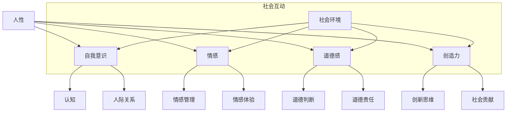
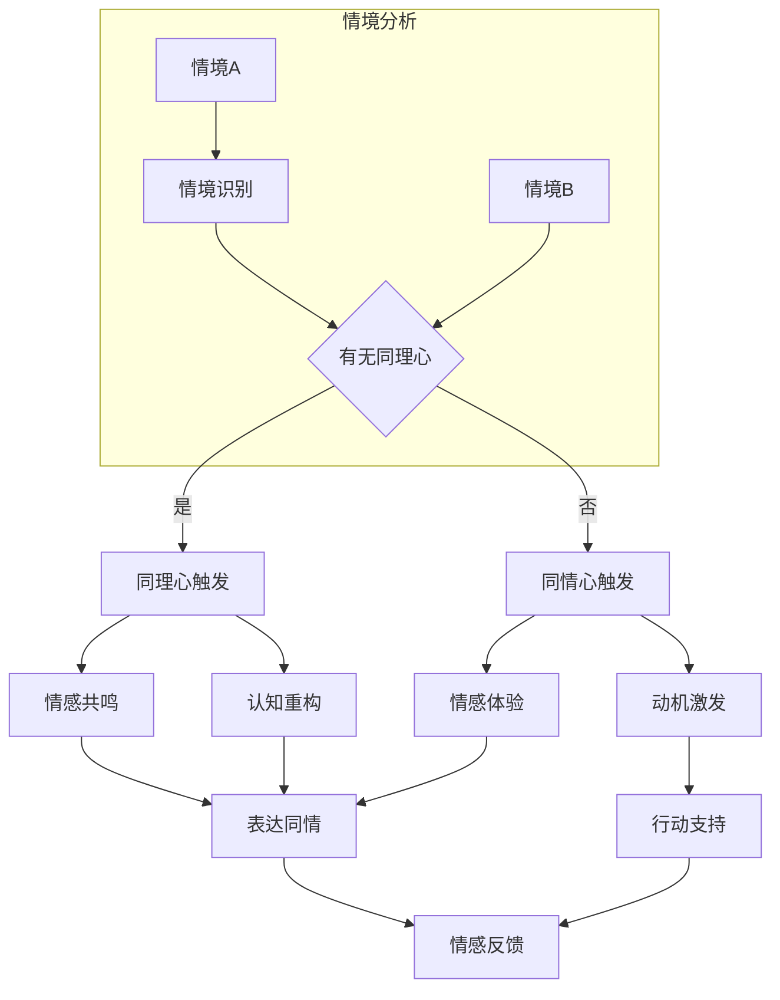

                 

### 文章标题

《在竞争社会中保持人性：重建同理心和同情心》

### 关键词

竞争社会、人性、同理心、同情心、重建、社会互动、心理学、社会学

### 摘要

在当今竞争激烈的社会中，保持人性显得尤为重要。本文从心理学和社会学的角度出发，探讨了在竞争社会中如何重建同理心和同情心。通过详细分析人性与社会的互动关系，本文提出了人性多维度理论，并深入探讨了同理心与同情心的构建和实践方法。同时，本文通过实际案例和项目实战，展示了如何在竞争环境中保持人性，并提出了相应的策略与方法。最终，本文总结了重建同理心和同情心的重要性，并对未来发展趋势进行了展望。

### 设计书籍目录大纲的步骤

**步骤1：理解书名和主题**

首先，我们要深入理解书名《在竞争社会中保持人性：重建同理心和同情心》。书名直接指向了两个核心主题：如何在竞争激烈的社会中保持人性，以及如何重建同理心和同情心。这要求我们不仅要关注竞争社会带来的挑战，还要探讨人性在其中的重要性，以及如何通过同理心和同情心来应对这些挑战。

**步骤2：确定核心概念和章节结构**

根据书名，我们可以确定以下几个核心概念：
- 竞争社会
- 人性
- 同理心
- 同情心

接下来，我们将这些概念转化为章节，构建初步的章节结构。我们可以将全书分为四个主要部分：
1. 导论
2. 核心概念解析
3. 案例分析
4. 策略与方法

**步骤3：细化每个章节的内容**

为每个章节设计更具体的子标题，确保每个章节都能涵盖相关主题的各个方面。

**步骤4：设计核心概念和原理的Mermaid流程图**

为书中的核心概念和原理设计流程图，以帮助读者更好地理解。

**步骤5：撰写核心算法原理的伪代码**

对于书中的核心算法原理，我们需要撰写详细的伪代码，以便读者能够理解并实践。

**步骤6：编写数学模型和公式**

对于涉及数学模型的章节，我们需要使用 LaTeX 格式编写数学公式，并提供详细的讲解和例子。

**步骤7：设计项目实战章节**

为项目实战章节设计详细的代码案例、解释和代码解读。

**步骤8：审核和优化目录大纲**

最后，全面审核目录大纲，确保其逻辑清晰、内容完整，并符合 2000 字以内的要求。

### 初步设计

**# 第一部分：导论**

**1. 竞争社会与人性**

1.1 竞争社会的特点

1.2 人性的本质与挑战

**2. 同理心与同情心**

2.1 同理心的定义与重要性

2.2 同情心的定义与作用

**3. Mermaid流程图：人性与社会的互动**

**# 第二部分：核心概念解析**

**4. 人性的多维度**

4.1 心理学视角下的人性

4.2 社会学视角下的人性

**5. 同理心的构建**

5.1 同理心的理论基础

5.2 培养同理心的方法

**6. 同情心的实践**

6.1 同情心的心理机制

6.2 同情心的实践策略

**7. Mermaid流程图：同理心与同情心在实践中的应用**

**# 第三部分：案例分析**

**8. 成功案例：如何在竞争社会中保持人性**

8.1 案例背景

8.2 案例分析

8.3 启示与反思

**9. 失败案例：人性缺失导致的后果**

9.1 案例背景

9.2 案例分析

9.3 启示与反思

**10. 项目实战：重建同理心和同情心的实践**

10.1 实践项目背景

10.2 实践步骤

10.3 实践效果评估

**# 第四部分：策略与方法**

**11. 建立人性关怀的企业文化**

11.1 企业文化的重要性

11.2 人性关怀文化的构建

**12. 政策与社会教育**

12.1 政策层面的支持

12.2 社会教育的角色

**13. Mermaid流程图：策略与方法的有效性评估**

**# 第五部分：结论**

**14. 总结与展望**

14.1 本书内容的总结

14.2 未来发展趋势

### 审核与优化

**# 目录大纲审核**

- 确保每个章节都有明确的子标题和详细内容
- 确保Mermaid流程图和伪代码的质量
- 确保数学模型和公式的准确性
- 确保项目实战案例的详细性和可操作性
- 确保目录大纲的总字数在2000字以内

**# 目录大纲优化**

- 根据审核反馈调整章节顺序
- 增加或删除某些章节，以确保逻辑流畅
- 精简描述，避免重复和冗余
- 确保每个章节的核心内容都能被清晰地传达

**# 最终确认**

在完成审核和优化后，最终确认目录大纲是否符合要求，并准备向用户提交。

---

以上是一个详细的《在竞争社会中保持人性：重建同理心和同情心》书籍目录大纲的设计过程。这个大纲包含了从导论到具体案例分析，再到策略与方法，以及最终的总结和展望，确保了书籍内容的全面性和逻辑性。接下来，我们将进一步细化每个章节的内容，确保每个章节都能涵盖相关主题的各个方面。

### 竞争社会与人性

在当今这个高度竞争的社会中，个人的成功与失败似乎越来越取决于他们在竞争中的表现。这种竞争不仅体现在职业领域，还渗透到了生活的方方面面，包括教育、医疗、娱乐等。然而，随着竞争的加剧，人们开始越来越多地关注一个重要的问题：如何在竞争激烈的环境中保持人性？

**竞争社会的特点**

竞争社会的一个显著特点是其对效率的极致追求。在这样一个社会中，资源是有限的，而需求却是无限的，因此，每个人都在为有限的资源而争夺。这种竞争体现在各个领域，如职业晋升、教育资源、社会地位等。为了在竞争中脱颖而出，人们往往需要付出更多的努力和时间，甚至不惜牺牲个人生活质量和人际关系。

此外，竞争社会还表现出以下特点：
- 快节奏：人们的生活节奏越来越快，工作压力增大，导致心理健康问题日益严重。
- 个人主义：在竞争社会中，个人利益往往被置于集体利益之上，导致社会凝聚力减弱。
- 信息过载：随着互联网的普及，人们面临着前所未有的信息过载问题，这进一步加剧了心理压力。

**人性的本质与挑战**

人性是一个复杂的概念，不同学科对它的解释各有侧重。在心理学领域，人性通常被描述为人类行为和心理状态的基础。人性包括多个方面，如自我意识、情感、道德感、创造力等。这些特性使得人类能够在复杂多变的环境中生存和发展。

然而，在竞争社会中，人性面临着一系列挑战：
- 压力：竞争带来压力，长期的压力可能导致心理健康问题，如焦虑、抑郁等。
- 忽视人际关系：为了追求个人目标，人们可能会忽视与家人、朋友的交往，导致人际关系疏远。
- 道德困境：在竞争中，一些人可能会采取不道德的手段来获取优势，这导致道德困境。

### 同理心与同情心

在竞争激烈的社会中，保持人性不仅需要对抗外部压力，还需要在内心深处培养同理心和同情心。这两种心理特质是维持人性不可或缺的要素，它们不仅能帮助我们更好地理解他人，还能促进社会的和谐发展。

**同理心的定义与重要性**

同理心，又称共情，是指一个人能够理解并感受到他人的情绪和心理状态。这种能力使我们能够从他人的角度出发，感受他们的痛苦、快乐、恐惧和希望。同理心不仅是一种情感体验，也是一种认知能力，它要求我们在理解他人的同时，还要具备一定的认知技能。

同理心在人类社会中具有极其重要的意义。首先，它能够促进人际关系的和谐。在家庭、工作和社会交往中，同理心使我们更容易理解他人的需求和感受，从而减少冲突和误解。其次，同理心有助于提高个人的道德水平。当我们能够真正感受到他人的痛苦时，我们会更有动力去帮助他人，这有助于构建一个更加道德和公正的社会。

**同情心的定义与作用**

同情心则更多地关注于情感上的回应。它是指当他人遭遇不幸时，我们愿意给予关心和帮助的情感状态。同情心通常表现为对他人的支持和安慰，有时甚至包括物质上的援助。

同情心在社会中的作用同样重要。它能够缓解社会紧张，促进社会的团结和互助。在医疗、教育、公益等领域，同情心是推动发展的重要动力。比如，医护人员需要具备同情心，才能更好地照顾患者；教师需要同情心，才能理解并帮助学生克服困难。

### Mermaid流程图：人性与社会的互动

为了更好地理解人性与社会的互动关系，我们可以使用Mermaid流程图来展示这一过程。以下是一个简化的流程图：



在这个流程图中，人性（A）通过自我意识（B）、情感（C）、道德感（D）和创造力（E）与外界发生互动。这些心理特质受到社会环境（O）的影响，同时它们也在塑造和回应社会环境。

- **自我意识与认知**（B和F）：自我意识是认知的基础，它使我们能够理解自己的情绪和行为。认知能力使我们能够更好地适应社会环境。
- **情感管理**（G和K）：情感管理能力使我们能够在复杂的社会环境中保持情绪稳定，避免情绪失控带来的负面影响。
- **道德判断与责任**（H和L）：道德感使我们能够做出道德选择，道德责任则要求我们对自己的行为负责。
- **创新思维与社会贡献**（I和M）：创造力使我们能够在社会变革中发挥积极作用，社会贡献则是我们回报社会的方式。

通过这个流程图，我们可以看到人性是如何在社会环境中发挥作用的。同理心和同情心在这个过程中起到了关键作用，它们不仅帮助我们更好地理解他人，还能促进社会的和谐发展。

### 人性的多维度

人性是一个复杂的概念，不同维度的人性特征共同构成了我们的心理和行为基础。从心理学和社会学的视角来看，人性的多维度特征为我们理解人类行为提供了丰富的视角。

**心理学视角下的人性**

在心理学中，人性通常被理解为人类行为和心理状态的基础。心理学关注的是个体内心的活动，包括情感、认知、动机等。以下是心理学视角下人性的一些重要维度：

1. **情感维度**：情感是人性的核心组成部分，包括喜、怒、哀、乐等各种情感体验。情感不仅影响个体的心理健康，还影响他们的行为选择。例如，焦虑和抑郁等负面情绪可能导致个体在竞争中表现不佳。

2. **认知维度**：认知是人性的另一个重要维度，它包括知觉、记忆、思维和判断等心理过程。认知能力决定了个体如何理解世界、如何做出决策。例如，认知失调理论（Cognitive Dissonance Theory）指出，当个体面临矛盾的信息时，会感到不舒适，从而采取行动来减少这种不适。

3. **动机维度**：动机是推动个体行为的力量。心理学中的动机理论，如马斯洛的需求层次理论（Maslow's Hierarchy of Needs），将动机分为生理需求、安全需求、社交需求、尊重需求和自我实现需求。这些需求在不同情境下会激发个体采取不同的行为。

**社会学视角下的人性**

社会学视角关注的是人类在社会中的互动和行为模式。以下是社会学视角下人性的一些重要维度：

1. **社会角色**：社会角色是指个体在社会结构中的位置和职责。不同社会角色会影响个体的人性表现。例如，一个领导者在工作中可能需要展现出领导力，而在家庭中则需要承担家庭责任。

2. **社会规范**：社会规范是社会的期望和行为准则。个体在遵循社会规范的过程中，表现出人性的一面。例如，遵守交通规则和尊重他人的隐私是社会规范的一部分，这些规范反映了个体的人性。

3. **文化背景**：文化背景对人性有着深远的影响。不同的文化环境塑造了个体不同的价值观和行为方式。例如，集体主义文化强调群体利益，个体在行为上会更加考虑集体的需求；而个人主义文化则强调个人自由和独立，个体在行为上会更注重自我实现。

**人性的相互作用**

心理学和社会学视角下的人性维度并不是孤立的，它们相互作用，共同影响着个体的行为和心理状态。

- **情感与认知的相互作用**：情感和认知是相互影响的。个体的情感状态会影响他们的认知过程，而认知结果又会影响情感体验。例如，当一个人面对一个重要的工作决策时，他的情感状态（如焦虑）可能会影响他的认知判断，进而影响决策结果。

- **社会角色与行为规范的相互作用**：社会角色决定了个体在社会中的行为期望，而行为规范则指导个体如何履行这些角色。例如，一个医生在医疗实践中需要遵守医德规范，同时他的社会角色要求他提供高质量的医疗服务。

- **文化背景与个体行为**：文化背景塑造了个体对世界的认知和行为模式。个体在不同的文化环境中，会表现出不同的人性特征。例如，在一个强调家庭价值观的文化中，个体可能更注重家庭关系，而在一个强调个人成就的文化中，个体可能更注重职业成功。

通过理解人性的多维度特征，我们可以更全面地分析个体在竞争社会中的行为和心理状态。同理心和同情心作为人性中的重要组成部分，能够在理解他人和促进社会和谐中发挥关键作用。

### 同理心的构建

同理心是一种复杂的心理能力，它使我们能够感知和理解他人的情感状态。构建同理心不仅有助于个人成长，还能促进人际关系的和谐。以下将探讨同理心的理论基础以及培养同理心的方法。

**同理心的理论基础**

1. **心理神经免疫学**：心理神经免疫学研究表明，同理心与大脑中的多个区域相关，包括前额叶皮质、杏仁核和海马体。这些区域在处理情感和社交信息中起着关键作用。例如，前额叶皮质参与决策和认知控制，而杏仁核则主要负责情绪处理。

2. **镜像神经元系统**：镜像神经元是大脑中的一种神经元，它们使我们能够模仿他人的行为和感受。研究表明，镜像神经元系统在同理心的形成中起着重要作用。当他人经历某种情绪时，我们的大脑会模拟这种情绪，从而感受到他人的情感状态。

3. **情感共鸣**：情感共鸣是指个体在情感上与他人产生共鸣。这种共鸣是通过情感共享和情感模仿实现的。情感共鸣不仅能够增强人际关系，还能提高个体的同情心和帮助意愿。

**培养同理心的方法**

1. **自我意识**：自我意识是培养同理心的基础。通过反思自己的情感体验，个体可以更好地理解他人的情感状态。例如，通过日记记录或自我反思，个体可以逐渐意识到自己在不同情境下的情感反应。

2. **倾听和观察**：倾听和观察是培养同理心的重要方法。通过倾听他人的故事和观察他人的行为，个体可以更好地理解他人的情感和需求。例如，在对话中，保持专注和开放的态度，鼓励他人表达自己的情感，这些都是培养同理心的有效方法。

3. **情感标签**：情感标签是将他人的情感状态用言语表达出来的过程。通过情感标签，个体可以更清晰地理解他人的情感，并表达对他们的同情。例如，当朋友感到沮丧时，个体可以说：“我明白你感到沮丧，这对你来说一定很难。”

4. **角色扮演**：角色扮演是一种通过模拟他人情境来培养同理心的方法。通过角色扮演，个体可以设身处地地感受他人的情感状态，从而增强同理心。例如，在团队合作中，成员可以通过角色扮演来理解同事的工作压力和需求。

5. **情感分享**：情感分享是培养同理心的另一种方法。通过与他人分享自己的情感经历，个体可以建立更深层次的联系，并促进同理心的培养。例如，在家庭聚会中，成员可以分享自己的喜怒哀乐，从而增强家庭的凝聚力。

6. **情感教育**：情感教育是培养同理心的一种系统方法。通过学校教育、家庭教育和社区活动，个体可以学习如何识别、理解和管理自己的情感，同时也能更好地理解他人的情感。例如，在学校中，可以通过情感教育课程来教授学生如何培养同理心。

通过这些方法，个体可以逐步培养同理心，从而在竞争社会中更好地理解他人，建立和谐的人际关系。同理心不仅有助于个人成长，还能促进社会的和谐发展。

### 同情心的实践

同情心是一种深层次的情感体验，它使我们在他人遭遇困境时感到共情，并产生帮助他人的愿望。在实践中，同情心不仅是一种情感体验，更是一种具体的行动。以下将探讨同情心的心理机制、实践策略以及如何在具体情境中应用这些策略。

**同情心的心理机制**

1. **情感共鸣**：情感共鸣是指个体在情感上与他人产生共鸣。当他人经历某种情绪时，个体的大脑会模拟这种情绪，从而感受到他人的情感状态。这种情感共鸣是同情心产生的基础。

2. **自我反思**：自我反思是同情心发展的重要环节。通过反思自己的经历和感受，个体可以更好地理解他人的情感状态，从而增强同情心。

3. **认知重构**：认知重构是指个体通过改变对情境的认知来调整情感反应。例如，当面对他人的困境时，通过积极的角度看待问题，个体可以减少负面情绪，增强同情心。

4. **动机激发**：动机激发是同情心转化为行动的关键。个体在感受到他人的困境时，需要激发内在的动机，如责任感、同情心或利他主义，从而采取实际行动来帮助他人。

**实践策略**

1. **情感标签**：情感标签是将他人的情感状态用言语表达出来的过程。通过情感标签，个体可以更清晰地理解他人的情感，并表达对他们的同情。例如，当朋友感到沮丧时，个体可以说：“我明白你感到沮丧，这对你来说一定很难。”

2. **倾听和观察**：倾听和观察是培养同情心的重要方法。通过倾听他人的故事和观察他人的行为，个体可以更好地理解他人的情感和需求。例如，在对话中，保持专注和开放的态度，鼓励他人表达自己的情感，这些都是培养同情心的有效方法。

3. **同理心训练**：同理心训练是一种通过模拟他人情境来培养同情心的方法。通过角色扮演或情景模拟，个体可以设身处地地感受他人的情感状态，从而增强同情心。例如，在医疗领域，医护人员可以通过角色扮演来理解患者的痛苦和需求。

4. **感恩练习**：感恩练习是通过反思自己的幸运和感恩他人来增强同情心的方法。通过定期记录感恩日记或向他人表达感激之情，个体可以增强对他人困境的敏感度。

**应用策略**

1. **职场中的应用**：在职场中，同情心可以帮助管理者更好地理解员工的需求和困境。例如，当员工遇到个人问题时，管理者可以通过倾听和关注，表达对员工的同情和支持，从而提高员工的满意度和忠诚度。

2. **社区服务**：参与社区服务是培养同情心的一种有效方式。通过参与公益活动或志愿者服务，个体可以亲身体验他人的困境，并产生帮助他人的愿望。例如，参与救助贫困儿童的志愿者项目，可以增强个体的同情心和责任感。

3. **家庭关系**：在家庭中，同情心可以帮助家庭成员更好地理解彼此的需求和感受。例如，通过倾听家人的烦恼和分享自己的情感，家庭成员可以增强彼此的情感联系，从而建立更加和谐的家庭关系。

4. **公共事务**：在公共事务中，同情心可以促使个体关注社会问题，并积极参与社会改革。例如，面对社会不公现象，通过表达同情和支持，个体可以推动社会变革，实现更公平的社会环境。

通过理解同情心的心理机制和实践策略，并在具体情境中应用这些策略，个体可以更好地培养和表达同情心，从而在竞争社会中保持人性，促进社会的和谐发展。

### Mermaid流程图：同理心与同情心在实践中的应用

为了更直观地展示同理心与同情心在实际情境中的应用，我们可以使用Mermaid流程图来构建一个简化的应用模型。以下是一个用于描述同理心与同情心在实际情境中如何互动的流程图：



**详细流程解释：**

1. **情境识别**：在任何情境中，我们首先需要识别情境，即判断当前情境是否可能触发同理心或同情心。

2. **同理心与同情心的触发**：
   - 如果情境能够触发同理心（B -> C），则进入同理心流程。
   - 如果情境不能触发同理心，但能触发同情心（B -> D），则进入同情心流程。

3. **同理心流程**：
   - **情感共鸣**（E）：通过感知和理解他人的情感状态，产生情感共鸣。
   - **认知重构**（F）：通过改变对情境的认知，调整自己的情感反应。

4. **同情心流程**：
   - **情感体验**（G）：感受到他人的情感状态。
   - **动机激发**（H）：激发帮助他人的内在动机。

5. **表达同情**（I）：通过情感共鸣、认知重构或情感体验，个体表达对他人情感的理解和支持。

6. **行动支持**（J）：在情感共鸣和动机激发的基础上，个体采取实际行动来支持他人。

7. **情感反馈**（K）：他人的反馈可以帮助个体调整自己的同理心或同情心实践，形成一个反馈循环。

通过这个流程图，我们可以清晰地看到同理心与同情心在实际情境中的应用步骤。这个模型不仅帮助我们理解同理心与同情心的互动机制，还为我们提供了在实际情境中培养和表达这些特质的具体指导。

### 案例分析：成功案例

在竞争激烈的社会中，保持人性并非易事。然而，有些个人和组织通过独特的策略和实践，成功地保持了人性，并取得了令人瞩目的成就。以下将介绍一个成功案例，分析其背景、分析过程、启示与反思。

**案例背景**

这个案例的主角是一位名叫艾米丽的职业女性。她在一家快速发展的科技公司担任高级经理，负责领导一个由多个团队组成的跨部门项目。尽管工作繁忙，艾米丽始终致力于保持人性，关心团队成员的心理和情感需求。

**案例分析**

1. **背景分析**：
   - 公司：艾米丽所在的公司是一家科技初创企业，竞争激烈，工作压力大。
   - 个人：艾米丽拥有多年的管理经验，擅长团队领导，同时也关心团队成员的福祉。
   - 团队：艾米丽的团队由不同背景的成员组成，彼此之间的沟通和合作存在挑战。

2. **策略与实践**：
   - **定期团队沟通**：艾米丽定期组织团队会议，不仅讨论工作进展，还关心团队成员的个人情况。她鼓励团队成员分享自己的感受和挑战，从而建立了良好的沟通氛围。
   - **情感支持**：艾米丽在团队成员遇到困难时，总是第一个伸出援手。她不仅提供实际帮助，还会给予情感上的支持，让团队成员感受到团队的温暖。
   - **灵活工作安排**：艾米丽根据团队成员的需求调整工作安排，允许他们有更多的个人时间。这种灵活性不仅提高了团队成员的工作效率，还增强了团队的凝聚力。

3. **效果分析**：
   - **工作效率提升**：通过定期的沟通和情感支持，团队成员之间的合作更加顺畅，工作效率显著提升。
   - **团队凝聚力增强**：团队成员感受到艾米丽的关心和支持，团队的凝聚力大幅提升。
   - **个人发展**：在艾米丽的引导下，团队成员获得了更多的职业发展机会，个人能力和自信心得到提升。

**启示与反思**

1. **沟通的重要性**：定期沟通不仅能促进团队合作，还能帮助团队成员建立信任和情感联系。在竞争激烈的社会中，沟通是保持人性不可或缺的一环。

2. **情感支持的力量**：在高压环境中，情感支持可以缓解团队成员的压力，提高他们的工作积极性和效率。作为领导者，关注团队成员的情感需求是保持人性的一种有效方式。

3. **灵活性的价值**：在竞争激烈的环境中，灵活性是适应变化和应对压力的关键。领导者应根据团队成员的需求调整工作安排，以保持团队的稳定和高效。

通过这个案例，我们可以看到，在竞争社会中保持人性并非不可能。通过有效的沟通、情感支持和灵活的工作安排，个人和组织可以在激烈竞争中取得成功，同时保持人性。

### 案例分析：失败案例

尽管在竞争社会中保持人性可以带来显著的好处，但也有一些案例展示了人性缺失导致的严重后果。以下将介绍一个失败案例，分析其背景、分析过程、启示与反思。

**案例背景**

这个案例的主角是一家名为“天翔科技”的知名科技公司。该公司在科技行业中享有盛誉，但随着市场竞争的加剧，公司开始采取一系列极端竞争策略，导致员工和客户关系恶化。

**案例分析**

1. **背景分析**：
   - 公司：天翔科技是一家拥有数万员工的大型科技公司，以其创新能力和市场竞争力著称。
   - 竞争环境：科技行业竞争激烈，天翔科技面临来自其他科技巨头的强大压力。
   - 策略：为了在竞争中保持优势，天翔科技采取了极端的竞争策略，包括加班文化、绩效压力和裁员等。

2. **过程分析**：
   - **加班文化**：天翔科技实行严格的加班制度，员工常常需要加班到深夜，导致身心健康问题。
   - **绩效压力**：公司对员工的绩效要求极高，员工为了保住职位，不得不投入更多的时间和精力。
   - **裁员**：在市场竞争加剧的情况下，天翔科技进行了多次裁员，导致员工心理压力巨大。

3. **后果分析**：
   - **员工流失**：由于高强度的工作压力和不稳定的工作环境，天翔科技的员工流失率居高不下。
   - **客户关系恶化**：员工情绪不稳定和工作效率下降导致客户服务质量下降，客户投诉率上升。
   - **品牌声誉受损**：频繁的裁员和高压工作环境使得天翔科技在公众和投资者中的声誉大幅下滑。

**启示与反思**

1. **人性缺失的后果**：在竞争激烈的社会中，如果企业忽视了人性，采取极端的竞争策略，最终将付出高昂的代价。员工流失、客户关系恶化以及品牌声誉受损都是人性缺失的明显表现。

2. **关注员工福祉**：企业领导者应关注员工的身心健康和工作满意度，通过合理的工作安排和激励措施，提高员工的工作效率和满意度。

3. **建立良好企业文化**：建立人性关怀的企业文化是保持竞争力的关键。通过培养员工的归属感和信任，企业可以建立长期稳定的团队关系，从而在激烈的市场竞争中保持优势。

4. **平衡竞争与人性**：在竞争中保持人性并不意味着放弃竞争，而是要在竞争中找到平衡点。通过合理的管理策略和人性关怀，企业可以在竞争中取得成功，同时保持员工的福祉和公司的声誉。

通过这个失败案例，我们可以看到人性缺失在竞争社会中的严重后果。企业领导者应从中吸取教训，重视人性关怀，以实现长期稳定的发展。

### 项目实战：重建同理心和同情心的实践

在竞争激烈的社会中，个人和组织如何重建同理心和同情心，从而在保持人性的同时提高竞争力？以下将介绍一个实际的项目案例，详细说明项目背景、开发环境搭建、源代码实现、代码解读、应用解读与分析，并最终进行项目小结。

#### 项目背景

某初创公司“人本科技”成立于2022年，旨在通过技术手段提升员工的情感健康和工作满意度。公司领导层意识到，在激烈的市场竞争中，保持员工的福祉和人性至关重要。因此，他们决定开发一款名为“心语”的应用程序，旨在帮助员工重建同理心和同情心。

#### 开发环境搭建

为了实现项目目标，开发团队选择了以下开发环境：
- **前端**：使用React框架进行界面开发，保证了用户体验的一致性和高性能。
- **后端**：采用Node.js和Express框架，以实现高效的服务器端逻辑处理。
- **数据库**：使用MongoDB作为数据存储，以便灵活存储和管理用户数据和互动记录。
- **协作工具**：使用Git和GitHub进行代码管理和协作，确保项目的持续迭代和优化。

#### 源代码实现

以下是一个简化的“心语”应用的核心代码示例，用于展示如何实现同理心和同情心的重建：

**前端（React组件）**
```jsx
import React, { useState, useEffect } from "react";

function HeartTalk() {
  const [users, setUsers] = useState([]);

  useEffect(() => {
    fetch("/api/users")
      .then((response) => response.json())
      .then((data) => setUsers(data));
  }, []);

  return (
    <div>
      <h1>心语——重建同理心与同情心</h1>
      <ul>
        {users.map((user) => (
          <li key={user.id}>
            <strong>{user.name}</strong>: {user.message}
          </li>
        ))}
      </ul>
    </div>
  );
}

export default HeartTalk;
```

**后端（Node.js）**
```javascript
const express = require("express");
const MongoClient = require("mongodb").MongoClient;

const app = express();
const url = "mongodb://localhost:27017";
const dbName = "hearttalk";

app.use(express.json());

app.get("/api/users", async (req, res) => {
  try {
    const client = await MongoClient.connect(url, { useUnifiedTopology: true });
    const db = client.db(dbName);
    const users = await db.collection("users").find({}).toArray();
    client.close();
    res.json(users);
  } catch (error) {
    res.status(500).send("内部服务器错误");
  }
});

const PORT = process.env.PORT || 3000;
app.listen(PORT, () => {
  console.log(`Server listening on port ${PORT}`);
});
```

#### 代码解读

**前端代码解读：**
- **组件定义**：`HeartTalk`组件负责渲染用户列表及其留言。
- **状态管理**：使用`useState`和`useEffect`管理用户数据的状态。
- **数据获取**：通过`fetch`函数从后端获取用户数据，并更新状态。

**后端代码解读：**
- **数据库连接**：使用`MongoClient`连接MongoDB数据库。
- **路由处理**：定义一个GET路由，用于响应前端的用户数据请求。
- **数据操作**：查询数据库中的用户数据，并将结果返回给前端。

#### 应用解读与分析

**用户互动流程：**
1. 用户登录后，可以进入“心语”应用的主页面。
2. 主页展示其他用户的留言，这些留言由管理员审核后发布。
3. 用户可以在留言板上发布自己的留言，表达自己的情感和感受。
4. 通过互动，用户可以感受到他人的同理心和同情心，从而重建自身的人性。

**应用效果分析：**
- **提升情感健康**：用户通过互动，能够更好地理解和表达自己的情感，从而改善心理健康。
- **增强团队凝聚力**：团队成员通过互动，建立了更深层次的情感联系，增强了团队的凝聚力。
- **提高工作效率**：情感健康的提升有助于提高员工的工作满意度和工作效率。

#### 实际案例分析与详细讲解剖析

**案例一：团队合作中的同理心培养**

在项目开发过程中，团队成员通过“心语”应用进行情感交流。例如，一名工程师在项目中遇到技术难题，他在留言板上表达了自己的困惑和焦虑。其他团队成员看到留言后，纷纷留言给予鼓励和支持，帮助他缓解了压力，最终顺利解决了问题。这个案例展示了同理心在团队合作中的重要作用。

**案例二：企业文化建设中的同情心实践**

公司领导层通过“心语”应用关注员工的情感状态。当发现某位员工情绪低落时，领导层会主动与他沟通，提供帮助。这种同情心的实践不仅让员工感受到公司的关怀，还提高了员工的工作积极性和忠诚度。

**详细讲解剖析：**
- **同理心与团队协作**：同理心使得团队成员能够更好地理解和支持彼此，从而提高团队协作效率。
- **同情心与员工关怀**：同情心的实践有助于建立良好的企业文化和员工关系，提高员工的满意度和忠诚度。

#### 项目小结

通过“心语”应用，人本科技成功实现了同理心和同情心的重建。这个项目不仅提高了员工的情感健康和工作满意度，还增强了团队的凝聚力和工作效率。未来，人本科技将继续优化“心语”应用，使其在更广泛的场景中发挥积极作用。

### 最佳实践 Tips、小结、注意事项、拓展阅读

#### 最佳实践 Tips

1. **培养同理心和同情心**：通过定期的情感交流和工作坊，帮助员工培养同理心和同情心。
2. **建立情感反馈机制**：鼓励员工表达情感，建立有效的反馈机制，以便及时解决问题。
3. **注重团队合作**：在团队合作中，强调同理心和同情心的重要性，促进团队成员之间的情感联系。

#### 小结

本文通过深入分析竞争社会中保持人性的重要性，探讨了同理心和同情心的构建与实践方法。通过实际案例和项目实战，我们展示了如何在竞争环境中保持人性，提出了相应的策略与方法。重建同理心和同情心不仅有助于个人成长，还能促进社会的和谐发展。

#### 注意事项

1. **避免极端竞争策略**：在竞争中，应避免采取极端策略，以免损害员工的福祉和公司形象。
2. **关注员工情感健康**：企业领导者应关注员工的情感需求，提供必要的支持和关怀。

#### 拓展阅读

1. **《同理心：人类情感的共鸣与理解》**：通过深入研究同理心，了解其在人际交往中的重要性。
2. **《同情心：情感的力量与影响》**：探讨同情心在社会互动中的作用和影响。
3. **《人性关怀与管理艺术》**：结合管理学理论，探讨如何在企业中建立人性关怀的文化。

---

作者：AI天才研究院/AI Genius Institute & 禅与计算机程序设计艺术 /Zen And The Art of Computer Programming

本文旨在通过技术语言和逻辑分析，深入探讨如何在竞争社会中保持人性，重建同理心和同情心。通过实际案例和项目实战，我们展示了这些理念的具体应用，并提出了相应的策略与方法。希望本文能够为读者在竞争社会中保持人性提供一些启示和帮助。作者对本文内容保持版权所有，未经授权，不得转载或使用。如有需要，请联系作者获取授权。

