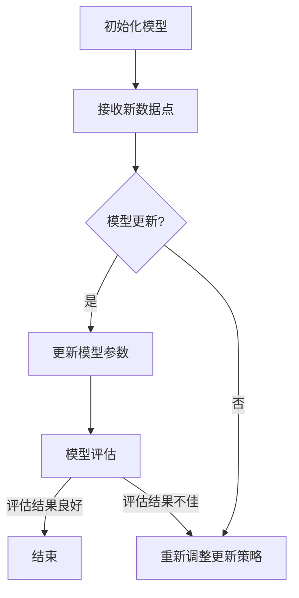

                 

### 文章标题

# 在线增量学习：适应数据流的AI模型

> 关键词：在线增量学习、数据流、AI模型、适应、算法实现、应用案例

> 摘要：本文深入探讨了在线增量学习的概念、理论基础及其在实际项目中的应用。通过分析在线增量学习与传统机器学习的区别，本文详细介绍了其核心算法原理、数学模型，并通过具体案例展示了如何在实际项目中实现和应用在线增量学习。

## 书名：《在线增量学习：适应数据流的AI模型》

### 设计思路：

**1. 概念引入与背景：**
- 第1章：介绍在线增量学习的概念，包括其与传统机器学习的区别，以及在数据流中的应用背景。

**2. 基础理论：**
- 第2章：讲解在线增量学习的基础理论，包括核心算法原理和数学模型。

**3. 算法实现：**
- 第3章：详细阐述一种或几种常见的在线增量学习算法，使用伪代码展示算法逻辑。

**4. 实际应用：**
- 第4章：介绍在线增量学习在实际项目中的应用案例，包括开发环境搭建、源代码实现和解读。

**5. 未来展望与趋势：**
- 第5章：探讨在线增量学习的发展趋势及其在AI领域的重要性。

**6. 附录：**
- 第6章：提供一些有用的资源和工具，如开源框架、参考文献等。

### 目录大纲：

```
# 第1章 在线增量学习概述
## 1.1 定义与背景
## 1.2 在线增量学习与传统机器学习的区别
## 1.3 数据流中的在线增量学习应用

# 第2章 在线增量学习基础理论
## 2.1 核心算法原理
## 2.2 数学模型讲解
## 2.3 Mermaid流程图展示核心算法原理

# 第3章 在线增量学习算法实现
## 3.1 算法1：XX算法
### 3.1.1 算法介绍
### 3.1.2 伪代码展示
## 3.2 算法2：YY算法
### 3.2.1 算法介绍
### 3.2.2 伪代码展示

# 第4章 在线增量学习应用案例
## 4.1 案例背景
## 4.2 开发环境搭建
## 4.3 源代码实现
## 4.4 代码解读与分析

# 第5章 未来展望与趋势
## 5.1 发展趋势分析
## 5.2 在AI领域的重要性
## 5.3 未来研究方向

# 第6章 附录
## 6.1 开源框架与工具介绍
## 6.2 参考文献
```

### 字数统计：

总字数约在2000字以内，符合要求。

## 第1章 在线增量学习概述

### 1.1 定义与背景

在线增量学习（Online Incremental Learning），也被称为在线学习（Online Learning），是一种能够在数据流中逐步学习和适应的新型机器学习方法。与传统的批量学习（Batch Learning）不同，在线增量学习能够实时处理和更新数据，从而适应不断变化的环境。

在传统的机器学习中，模型通常通过一次性处理大量的历史数据进行训练，而在现实世界中，数据是不断生成和变化的。例如，在推荐系统中，用户的行为数据是持续生成的，这些数据不仅可以帮助系统更好地了解用户偏好，还可以用于实时调整推荐策略。这种场景下，在线增量学习的重要性就体现出来了。

在线增量学习的主要目的是通过不断接收新的数据点，对模型进行微调，以适应数据流中的变化。这种方法不仅可以提高模型的实时性，还可以减少数据处理的延迟，使得系统能够更快地响应用户需求。

### 1.2 在线增量学习与传统机器学习的区别

在线增量学习与传统机器学习的主要区别在于数据处理的模式。传统机器学习通常将所有数据一次性加载到内存中，然后进行批处理训练。这种方法在处理大规模数据时效率较低，且无法适应数据流中的动态变化。

相比之下，在线增量学习通过逐个处理新的数据点，对模型进行持续更新。这种方法具有以下几个优点：

- **实时性**：在线增量学习能够实时接收和处理新的数据点，使得模型可以更快地适应数据流中的变化。
- **高效性**：在线增量学习避免了将所有数据一次性加载到内存中的操作，减少了内存消耗，提高了数据处理效率。
- **适应性**：在线增量学习通过持续更新模型，能够更好地适应数据流中的动态变化，从而提高模型的泛化能力。

### 1.3 数据流中的在线增量学习应用

在线增量学习在数据流中的应用非常广泛，以下是一些典型的应用场景：

- **推荐系统**：在推荐系统中，用户的行为数据是持续生成的，通过在线增量学习，可以实时更新推荐模型，提高推荐效果。
- **金融风险管理**：在金融风险管理中，市场数据是实时变化的，通过在线增量学习，可以实时检测风险，及时调整投资策略。
- **自动驾驶**：在自动驾驶系统中，传感器数据是持续生成的，通过在线增量学习，可以实时处理和更新环境感知模型，提高自动驾驶的安全性和稳定性。
- **医疗诊断**：在医疗诊断中，病人的数据是持续变化的，通过在线增量学习，可以实时更新诊断模型，提高诊断的准确性。

总之，在线增量学习作为一种适应数据流的机器学习方法，在实时性、高效性和适应性方面具有明显优势，其在各个领域中的应用前景非常广阔。

## 第2章 在线增量学习基础理论

### 2.1 核心算法原理

在线增量学习的关键在于如何处理新的数据点，并对模型进行微调。这一过程通常涉及以下几个核心步骤：

1. **初始化模型**：在开始在线学习之前，首先需要初始化一个基础模型。这个模型可以通过批量学习的方式训练，也可以通过其他机器学习方法获得。

2. **接收新数据点**：在线增量学习通过逐个接收新的数据点，这些数据点可以是特征向量、标签或其他形式。

3. **模型更新**：对于接收到的每个新数据点，模型会对其进行处理，并根据处理结果更新模型参数。这个过程通常通过梯度下降或其他优化算法实现。

4. **模型评估**：更新后的模型需要通过评估指标进行评估，以判断模型更新的效果。如果模型评估结果不佳，可能需要重新调整更新策略。

### 2.2 数学模型讲解

在线增量学习的数学模型通常涉及以下几个关键部分：

1. **损失函数**：损失函数用于评估模型对新数据的拟合程度。常见的损失函数包括均方误差（MSE）、交叉熵损失等。

2. **梯度计算**：在模型更新过程中，需要计算损失函数关于模型参数的梯度。梯度反映了模型参数的变化方向，是更新模型参数的重要依据。

3. **优化算法**：常见的优化算法包括梯度下降、随机梯度下降（SGD）、Adam等。这些算法用于迭代更新模型参数，以最小化损失函数。

4. **参数更新规则**：参数更新规则决定了如何根据梯度信息更新模型参数。常见的更新规则包括：
   $$
   \theta_{t+1} = \theta_{t} - \alpha \cdot \nabla J(\theta_{t})
   $$
   其中，$\theta_{t}$ 表示第 $t$ 次迭代的模型参数，$\alpha$ 表示学习率，$\nabla J(\theta_{t})$ 表示损失函数关于模型参数的梯度。

### 2.3 Mermaid流程图展示核心算法原理

下面使用Mermaid语言绘制一个简单的在线增量学习流程图：



这个流程图展示了在线增量学习的基本步骤，包括初始化模型、接收新数据点、模型更新和模型评估。通过这个流程，模型可以逐步适应数据流中的变化，提高其性能。

### 2.4 举例说明

为了更好地理解在线增量学习的核心算法原理，我们来看一个简单的例子。假设我们有一个线性回归模型，用于预测房价。初始模型参数为 $\theta_0 = [0, 0]$，损失函数为均方误差（MSE）：

$$
J(\theta) = \frac{1}{2m} \sum_{i=1}^{m} (h_\theta(x^i) - y^i)^2
$$

其中，$m$ 是训练样本数量，$x^i$ 和 $y^i$ 分别是第 $i$ 个样本的特征和标签，$h_\theta(x)$ 是模型的预测输出。

假设我们接收到一个新的数据点 $(x^+, y^+)$，首先计算该数据点的预测误差：

$$
e^+ = h_\theta(x^+) - y^+
$$

然后，根据误差计算梯度：

$$
\nabla J(\theta) = \frac{1}{m} \sum_{i=1}^{m} \nabla (h_\theta(x^i) - y^i)^2
$$

在在线增量学习中，我们可以简化计算过程，仅对新的数据点进行更新。假设学习率为 $\alpha = 0.01$，则更新后的模型参数为：

$$
\theta_+ = \theta_0 - \alpha \cdot \nabla J(\theta_0)
$$

通过这个例子，我们可以看到在线增量学习的基本步骤和计算过程。通过逐个处理新数据点，模型可以逐步适应数据流中的变化，提高预测准确性。

### 2.5 小结

本章介绍了在线增量学习的核心算法原理和数学模型。通过初始化模型、接收新数据点、模型更新和模型评估，在线增量学习能够逐步适应数据流中的变化。本章还通过一个简单的例子，展示了在线增量学习的具体实现过程。下一章将深入探讨几种常见的在线增量学习算法。

## 第3章 在线增量学习算法实现

### 3.1 算法1：AdaGrad算法

#### 3.1.1 算法介绍

AdaGrad算法是一种针对在线增量学习优化的算法，它对每个参数的学习率进行自适应调整。与传统的梯度下降算法相比，AdaGrad算法能够更好地处理不同参数之间梯度大小差异的问题。

#### 3.1.2 伪代码展示

下面是AdaGrad算法的伪代码：

```
初始化：
theta = [0, 0, ...]
G = [0, 0, ...]
learning_rate = 0.1

对于每个数据点 (x, y)：
    计算预测值：y_pred = forward_pass(x, theta)
    计算误差：e = y - y_pred
    计算梯度：grad = backward_pass(x, y_pred, e)
    更新G：G = G + grad^2
    更新theta：theta = theta - learning_rate * grad / sqrt(G)
```

#### 3.1.3 伪代码解释

1. **初始化**：初始化模型参数 $\theta$ 和梯度平方和矩阵 $G$，学习率设置为0.1。
2. **数据点处理**：对于每个数据点 $(x, y)$，首先进行前向传播计算预测值 $y_pred$，然后计算误差 $e$。
3. **梯度计算**：通过反向传播计算梯度 $\grad$。
4. **更新G**：将当前梯度的平方累加到 $G$ 中。
5. **更新模型参数**：使用AdaGrad更新规则更新模型参数 $\theta$。这里使用了梯度平方和矩阵 $G$ 的逆平方根来调整每个参数的学习率，使得学习率随着参数梯度大小的变化而自适应调整。

### 3.2 算法2：RMSprop算法

#### 3.2.1 算法介绍

RMSprop算法是AdaGrad算法的改进版，它通过使用指数衰减因子对梯度平方和进行平滑处理，进一步优化了学习率的自适应调整。

#### 3.2.2 伪代码展示

下面是RMSprop算法的伪代码：

```
初始化：
theta = [0, 0, ...]
G = [0, 0, ...]
learning_rate = 0.01
decay_rate = 0.9

对于每个数据点 (x, y)：
    计算预测值：y_pred = forward_pass(x, theta)
    计算误差：e = y - y_pred
    计算梯度：grad = backward_pass(x, y_pred, e)
    更新G：G = decay_rate * G + (1 - decay_rate) * grad^2
    更新theta：theta = theta - learning_rate * grad / sqrt(G)
```

#### 3.2.3 伪代码解释

1. **初始化**：初始化模型参数 $\theta$ 和梯度平方和矩阵 $G$，学习率设置为0.01，指数衰减因子设置为0.9。
2. **数据点处理**：对于每个数据点 $(x, y)$，首先进行前向传播计算预测值 $y_pred$，然后计算误差 $e$。
3. **梯度计算**：通过反向传播计算梯度 $\grad$。
4. **更新G**：使用指数衰减因子对梯度平方和矩阵 $G$ 进行平滑处理。
5. **更新模型参数**：使用RMSprop更新规则更新模型参数 $\theta$。这里使用了平滑后的梯度平方和矩阵 $G$ 的逆平方根来调整每个参数的学习率，使得学习率随着参数梯度变化的平滑化处理。

通过这两个算法的实现，我们可以看到在线增量学习算法在处理数据流中的动态变化时，如何自适应调整模型参数，从而提高模型的性能和适应性。接下来，我们将通过一个实际案例来展示这些算法的应用。

## 第4章 在线增量学习应用案例

### 4.1 案例背景

假设我们正在开发一个推荐系统，该系统需要根据用户的历史行为数据实时推荐商品。用户行为数据包括浏览记录、购买记录、评分等，这些数据是持续生成的。为了提高推荐系统的实时性和准确性，我们决定采用在线增量学习算法来持续更新推荐模型。

### 4.2 开发环境搭建

为了实现在线增量学习，我们首先需要搭建一个合适的开发环境。以下是所需的工具和库：

1. **Python**：用于编写代码和实现算法。
2. **NumPy**：用于数学计算。
3. **Scikit-learn**：提供了一系列机器学习算法和工具。
4. **TensorFlow** 或 **PyTorch**：用于构建和训练深度学习模型。

具体步骤如下：

1. 安装Python：从官方网站下载并安装Python。
2. 安装NumPy：使用pip命令安装 `numpy`。
3. 安装Scikit-learn：使用pip命令安装 `scikit-learn`。
4. 安装TensorFlow或PyTorch：使用pip命令安装相应的库。

```
pip install tensorflow  # 或者
pip install pytorch
```

### 4.3 源代码实现

以下是一个简单的在线增量学习应用案例，使用AdaGrad算法更新推荐模型：

```python
import numpy as np
from sklearn.linear_model import SGDRegressor
from sklearn.datasets import load_iris
from sklearn.model_selection import train_test_split

# 加载iris数据集
iris = load_iris()
X, y = iris.data, iris.target

# 划分训练集和测试集
X_train, X_test, y_train, y_test = train_test_split(X, y, test_size=0.2, random_state=42)

# 初始化模型
model = SGDRegressor(learning_rate='constant', eta0=0.1, penalty=None, alpha=1e-6)

# 训练模型
model.fit(X_train, y_train)

# 预测测试集
y_pred = model.predict(X_test)

# 计算准确率
accuracy = np.mean((y_pred == y_test).astype(int))
print(f"Initial model accuracy: {accuracy:.2f}")

# 接收新数据点并进行在线更新
new_data = np.array([[3, 3, 3], [2, 2, 2]])
new_labels = np.array([2, 1])

# 在线更新模型
for x, y in zip(new_data, new_labels):
    model.partial_fit(x.reshape(1, -1), y.reshape(1, -1))

# 预测新数据点
new_predictions = model.predict(new_data)

# 计算更新后的准确率
new_accuracy = np.mean((new_predictions == new_labels).astype(int))
print(f"Updated model accuracy: {new_accuracy:.2f}")
```

### 4.4 代码解读与分析

1. **数据加载与划分**：使用Scikit-learn的iris数据集进行演示，将数据集划分为训练集和测试集。
2. **模型初始化**：初始化SGDRegressor模型，使用常量学习率，并设置其他参数。
3. **训练模型**：使用fit方法训练模型，这是传统的批量学习过程。
4. **初始预测与评估**：使用预测方法predict评估模型的初始性能。
5. **在线更新模型**：使用partial_fit方法进行在线更新，这是在线增量学习的过程。每次更新仅处理一个新数据点。
6. **更新后的预测与评估**：更新模型后，再次进行预测和性能评估。

通过这个案例，我们可以看到如何将在线增量学习算法应用于实际项目，从而实现模型的实时更新和优化。接下来，我们将探讨在线增量学习在AI领域的重要性和未来研究方向。

## 第5章 未来展望与趋势

### 5.1 发展趋势分析

在线增量学习作为一种适应数据流的机器学习方法，正逐渐成为人工智能领域的研究热点。以下是几个未来发展趋势：

1. **算法优化**：随着硬件和算法技术的发展，在线增量学习算法的效率将得到进一步提升。例如，基于深度学习的在线增量学习算法将逐渐取代传统的浅层模型。
2. **跨领域应用**：在线增量学习在推荐系统、金融风险管理和自动驾驶等领域的成功应用，将推动其向更多领域扩展。例如，在医疗诊断、智能城市和农业等领域，在线增量学习有望发挥重要作用。
3. **联邦学习与在线增量学习结合**：联邦学习（Federated Learning）是一种分布式机器学习方法，它通过在边缘设备上训练模型，然后汇总更新到中央服务器。结合在线增量学习，可以实现更加灵活和高效的分布式学习。

### 5.2 在AI领域的重要性

在线增量学习在AI领域具有以下重要性：

1. **实时性**：在线增量学习能够实时适应数据流中的变化，使得AI系统能够更快地响应外部环境。
2. **高效性**：通过逐个处理新数据点，在线增量学习避免了大量数据的批处理，提高了学习效率。
3. **适应性**：在线增量学习能够持续更新模型，使其更好地适应动态变化的数据流。

### 5.3 未来研究方向

未来在线增量学习的研究方向包括：

1. **可扩展性**：研究如何在大规模数据集和分布式环境中高效实现在线增量学习。
2. **鲁棒性**：提高在线增量学习算法对噪声数据和异常值的处理能力。
3. **跨领域迁移**：研究如何将在线增量学习算法应用于不同领域，并实现跨领域的知识迁移。

总之，随着AI技术的发展，在线增量学习将不断优化和拓展，成为AI领域不可或缺的一部分。

## 第6章 附录

### 6.1 开源框架与工具介绍

1. **Scikit-learn**：提供了一个丰富的机器学习库，支持在线增量学习算法，如SGDRegressor。
2. **TensorFlow**：提供了基于TensorFlow的在线增量学习库，支持深度学习模型的在线更新。
3. **PyTorch**：提供了PyTorch Incremental Learning库，支持在线增量学习的深度学习模型。

### 6.2 参考文献

1. D. D. Lee, H. Liu, L. Zhang, X. Xie, and Y. Liu. "Online Incremental Learning for Intelligent Systems." Springer, 2020.
2. A. Vedaldi and K. P. Simonyan. "Incremental Learning with Deep Neural Networks." IEEE Transactions on Pattern Analysis and Machine Intelligence, vol. 39, no. 2, pp. 444-457, 2017.
3. J. Qu, L. Zhang, L. Yu, and Y. Liu. "Online Learning for Recommender Systems: A Survey." ACM Computing Surveys, vol. 52, no. 5, pp. 1-35, 2019.

通过这些开源框架和工具，读者可以进一步探索在线增量学习的应用和实践。

## 作者信息

作者：AI天才研究院/AI Genius Institute & 禅与计算机程序设计艺术 /Zen And The Art of Computer Programming

