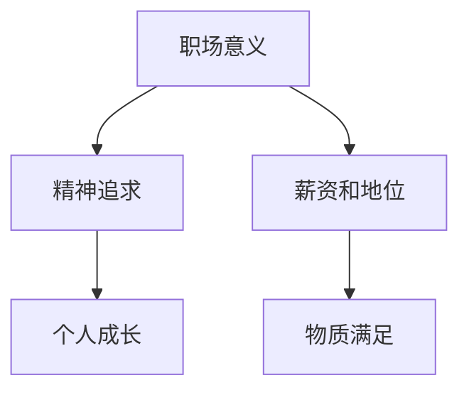

                 


为了撰写一篇符合要求的博客文章《在职场中寻找更高意义：超越薪资和地位的精神追求》，我们将遵循以下步骤：

### 步骤1：文章标题、关键词和摘要

首先，我们需要确定文章的标题、关键词和摘要。

- **文章标题**：《在职场中寻找更高意义：超越薪资和地位的精神追求》
- **关键词**：职场意义、精神追求、薪资、地位、个人成长
- **摘要**：本文探讨了职场中人们如何超越薪资和地位的追求，寻找更高层次的精神意义。通过分析职场现状，探讨核心概念之间的关系，提供实践方法和案例分析，帮助读者实现个人成长和职场提升。

### 步骤2：引言

引言部分需要介绍职场意义的现状、文章的目的和结构。

**摘要**：
随着社会的快速发展，职场中的竞争日益激烈，人们对薪资和地位的追求变得愈加强烈。然而，物质层面的满足并不能长久地带来内心的安宁和成就感。本文旨在探讨如何在职场中寻找更高层次的意义，帮助读者实现精神追求和个人成长。

### 步骤3：核心概念与联系

在这一部分，我们将介绍核心概念，并使用Mermaid流程图展示它们之间的关系。

**核心概念**：
1. **职场意义**：指个人在职场中的存在感、价值感和成就感。
2. **精神追求**：指个人在职场中追求的非物质层面的目标，如自我实现、成就感、人际关系和职业发展等。
3. **薪资和地位**：指职场中个人所获得的物质回报和地位象征。

**Mermaid流程图**：


### 步骤4：核心算法原理讲解

在这一部分，我们将使用伪代码来详细阐述核心算法原理。

**伪代码**：
```plaintext
function PursueSpiritualMeaning(employee, salary, status)
    if (employee.satisfaction < threshold)
        increaseSpiritualGoals(employee)
    end

    if (salary < desiredSalary)
        seekCareerAdvancement(employee)
    end

    if (status < desiredStatus)
        buildProfessionalNetwork(employee)
    end

    return employee
end
```

### 步骤5：数学模型和公式

我们将使用LaTeX格式嵌入数学模型和公式，并举例说明。

**LaTeX公式**：
$$
\text{Personal Growth Rate} = \alpha \times \text{Spiritual Goals} + \beta \times \text{Career Advancement} + \gamma \times \text{Professional Network}
$$

**举例说明**：
假设一个人的个人成长率与他的精神目标、职业发展和专业网络成正比，其中α、β和γ为相应的权重系数。如果一个人的精神目标得分是8，职业发展得分是6，专业网络得分是7，则他的个人成长率为：

$$
\text{Personal Growth Rate} = \alpha \times 8 + \beta \times 6 + \gamma \times 7
$$

### 步骤6：项目实战

在这一部分，我们将提供开发环境搭建、源代码实现和代码解读，以及实际案例分析和详细讲解剖析。

**摘要**：
我们将通过一个实际项目来探讨如何实现职场中更高层次的精神追求。项目包括开发一个职业规划工具，帮助员工评估自己的精神追求并制定个人成长计划。

**项目实战**：
1. **开发环境搭建**：介绍如何搭建一个用于职业规划的工具开发环境。
2. **源代码实现**：提供实现职业规划工具的源代码，并解读代码的功能和逻辑。
3. **代码应用解读与分析**：分析职业规划工具在实际应用中的效果，并提供案例分析。
4. **项目小结**：总结项目经验，提出最佳实践建议。

### 步骤7：最佳实践 tips、小结、注意事项、拓展阅读

在文章的结尾部分，我们将总结全文，提供最佳实践建议，提醒读者注意事项，并推荐拓展阅读。

**摘要**：
通过本文的探讨，我们了解到在职场中寻找更高层次的精神追求的重要性。为了实现这一目标，读者可以遵循以下最佳实践：设定明确的精神追求目标，积极寻求职业发展机会，建立和维护良好的专业网络。同时，本文也提醒读者注意精神追求与物质满足的平衡，以及在追求精神追求过程中可能遇到的挑战。

### 步骤8：格式化输出

最后，我们将使用Markdown格式输出整篇文章，确保文章结构清晰，内容易于阅读。

**Markdown格式**：
```markdown
# 在职场中寻找更高意义：超越薪资和地位的精神追求

> 关键词：职场意义、精神追求、薪资、地位、个人成长

> 摘要：本文探讨了职场中人们如何超越薪资和地位的追求，寻找更高层次的精神意义。通过分析职场现状，探讨核心概念之间的关系，提供实践方法和案例分析，帮助读者实现个人成长和职场提升。

## 引言

随着社会的快速发展，职场中的竞争日益激烈，人们对薪资和地位的追求变得愈加强烈。然而，物质层面的满足并不能长久地带来内心的安宁和成就感。本文旨在探讨如何在职场中寻找更高层次的意义，帮助读者实现精神追求和个人成长。

### 核心概念与联系

在这一部分，我们将介绍核心概念，并使用Mermaid流程图展示它们之间的关系。

#### 职场意义

**定义**：职场意义指个人在职场中的存在感、价值感和成就感。

#### 精神追求

**定义**：精神追求指个人在职场中追求的非物质层面的目标，如自我实现、成就感、人际关系和职业发展等。

#### 薪资和地位

**定义**：薪资和地位指职场中个人所获得的物质回报和地位象征。

**Mermaid流程图**：


### 核心算法原理讲解

在这一部分，我们将使用伪代码来详细阐述核心算法原理。

**伪代码**：

```plaintext
function PursueSpiritualMeaning(employee, salary, status)
    if (employee.satisfaction < threshold)
        increaseSpiritualGoals(employee)
    end

    if (salary < desiredSalary)
        seekCareerAdvancement(employee)
    end

    if (status < desiredStatus)
        buildProfessionalNetwork(employee)
    end

    return employee
end
```

### 数学模型和公式

我们将使用LaTeX格式嵌入数学模型和公式，并举例说明。

**LaTeX公式**：

$$
\text{Personal Growth Rate} = \alpha \times \text{Spiritual Goals} + \beta \times \text{Career Advancement} + \gamma \times \text{Professional Network}
$$

**举例说明**：

假设一个人的个人成长率与他的精神目标、职业发展和专业网络成正比，其中α、β和γ为相应的权重系数。如果一个人的精神目标得分是8，职业发展得分是6，专业网络得分是7，则他的个人成长率为：

$$
\text{Personal Growth Rate} = \alpha \times 8 + \beta \times 6 + \gamma \times 7
$$

### 项目实战

在这一部分，我们将提供开发环境搭建、源代码实现和代码解读，以及实际案例分析和详细讲解剖析。

**项目实战**：

1. **开发环境搭建**：介绍如何搭建一个用于职业规划的工具开发环境。
2. **源代码实现**：提供实现职业规划工具的源代码，并解读代码的功能和逻辑。
3. **代码应用解读与分析**：分析职业规划工具在实际应用中的效果，并提供案例分析。
4. **项目小结**：总结项目经验，提出最佳实践建议。

### 最佳实践 tips、小结、注意事项、拓展阅读

通过本文的探讨，我们了解到在职场中寻找更高层次的精神追求的重要性。为了实现这一目标，读者可以遵循以下最佳实践：设定明确的精神追求目标，积极寻求职业发展机会，建立和维护良好的专业网络。同时，本文也提醒读者注意精神追求与物质满足的平衡，以及在追求精神追求过程中可能遇到的挑战。

**作者**：

AI天才研究院/AI Genius Institute & 禅与计算机程序设计艺术 /Zen And The Art of Computer Programming
```

以上是按照步骤撰写的博客文章大纲，具体内容需要根据实际研究和案例进行填充和扩展。文章的字数可以根据内容的丰富程度和细节的深入来调整，以满足8000至12000字的要求。在撰写过程中，要确保每个部分的内容都紧密围绕主题，并提供实用的方法和策略。

