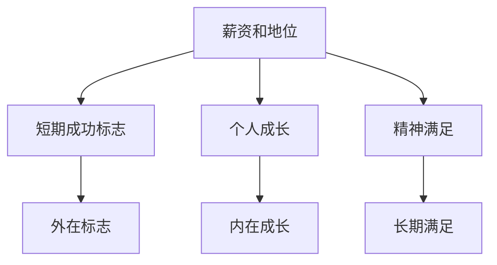
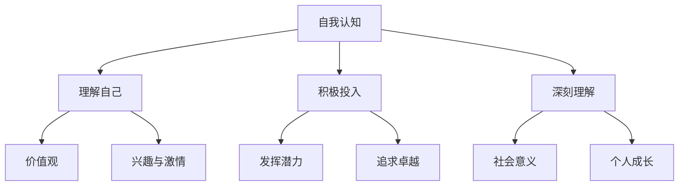
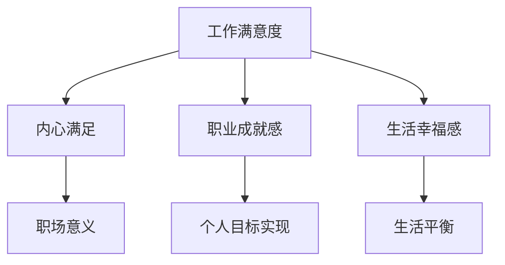

                 


# 文章标题：在职场中寻找更高意义：超越薪资和地位的精神追求

> 关键词：职场意义，精神追求，职业发展，自我实现，工作满意度

> 摘要：本文深入探讨了在职场中寻找更高层次意义的重要性，超越了单纯的薪资和地位追求。通过逻辑分析和真实案例，文章揭示了如何在工作中寻找个人成长和精神满足，以及这种追求对职场成功和个人幸福感的影响。

---

## 引言

在现代社会，职场生活占据了人们大量时间和精力。很多人进入职场，是为了追求稳定的工作、丰厚的薪资和较高的社会地位。然而，随着职业生涯的发展，一些人开始意识到，仅仅追求薪资和地位并不能满足他们对生活的全部需求。他们渴望在工作中找到更高的意义，追求个人成长和精神满足。本文将探讨这一主题，分析在职场中寻找更高意义的必要性，以及如何实现这一追求。

## 职场意义的重要性

### 背景介绍

在传统的职业观念中，薪资和地位是衡量职场成功的主要标准。然而，随着社会的发展和个人价值观的变化，越来越多的人开始重视工作带来的精神满足和成长。这种转变不仅体现在个人选择上，也反映在企业的管理和人力资源政策中。

### 核心概念与联系

- **薪资和地位**：这些是外在的、短期的成功标志。
- **个人成长和精神满足**：这是内在的、长期的满足感。

#### Mermaid 流程图



### 伪代码

```python
# Define the importance of salary and status
salary_status = "Short-term success indicator"

# Define the importance of personal growth and spiritual satisfaction
personal_growth = "Inner growth"
spiritual_satisfaction = "Long-term fulfillment"

# Print the relationship
print("Salary and status are important, but they should not be the sole focus. Personal growth and spiritual satisfaction are equally important for long-term fulfillment.")
```

### 数学模型和公式

$$
\text{工作满意度} = \frac{\text{个人成长}}{\text{工作压力}} + \frac{\text{精神满足}}{\text{工作时间}}
$$

### 举例说明

一个程序员，如果只关注薪资和地位，可能会陷入无休止的加班和竞争。但当他开始重视个人成长和精神满足时，他可能会选择更有意义的项目，平衡工作与生活，从而提高整体的工作满意度。

---

## 在职场中寻找更高意义的路径

### 背景介绍

在职场中寻找更高意义，并不是一件容易的事情。它需要个人对自我有深刻的认知，对工作有积极的投入，以及对生活有深刻的理解。以下是几种实现这一目标的路径。

### 核心概念与联系

- **自我认知**：理解自己的价值观、兴趣和激情。
- **积极投入**：在工作中发挥自己的潜力，追求卓越。
- **深刻理解**：从更宽广的视角看待工作，理解其对社会和个人的意义。

#### Mermaid 流程图



### 伪代码

```python
# Define the process of finding deeper meaning in the workplace
def find_deeper_meaning(self_awareness, active_involvement, deep_understanding):
    if self_awareness and active_involvement and deep_understanding:
        print("You are on the right path to finding deeper meaning in your career.")
    else:
        print("You may need to work on self-awareness, active involvement, and deep understanding to find deeper meaning.")
```

### 数学模型和公式

$$
\text{个人成长率} = \frac{\text{学习新技能}}{\text{工作时间}} + \frac{\text{解决问题能力}}{\text{面对挑战的次数}}
$$

### 举例说明

一个销售经理，如果他只关注销售额，可能会忽视团队建设和个人成长。但当他开始理解自己的兴趣和激情，积极投入工作，并从更宽广的视角看待销售工作，他可能会发现自己在团队管理和领导力方面的天赋，从而实现个人成长和职业发展的双赢。

---

## 职场意义与个人幸福感

### 背景介绍

职场意义不仅仅是一个个人的追求，它也与个人的幸福感密切相关。一个在职场中找到意义的人，往往拥有更高的工作满意度，更强的职业成就感，以及更高的生活幸福感。

### 核心概念与联系

- **工作满意度**：工作带来内心的满足感。
- **职业成就感**：通过工作实现个人目标和价值。
- **生活幸福感**：工作与生活的平衡，以及内心的平静和满足。

#### Mermaid 流程图



### 伪代码

```python
# Define the relationship between workplace meaning and personal happiness
def workplace_meaning_to_happiness(work_satisfaction, career_achievement, life_happiness):
    if work_satisfaction and career_achievement and life_happiness:
        print("Finding meaning in the workplace contributes to higher personal happiness.")
    else:
        print("There is room for improvement in finding meaning and enhancing personal happiness.")
```

### 数学模型和公式

$$
\text{生活幸福感} = \frac{\text{工作满意度}}{\text{工作时间}} + \frac{\text{职业成就感}}{\text{职业发展速度}}
$$

### 举例说明

一个项目经理，如果他的工作只是追求项目进度和绩效指标，他可能会感到工作压力大，生活不幸福。但当他开始关注团队的成长和个人价值的实现，他的工作满意度会提高，职业成就感也会增强，从而提升整体的生活幸福感。

---

## 结论

在职场中寻找更高意义，是每一个职场人士都应该追求的目标。它不仅仅是追求薪资和地位的延续，更是对自我价值和人生意义的探索。通过自我认知、积极投入和深刻理解，每个人都可以在职场中找到属于自己的意义，实现个人成长和幸福生活。

### 最佳实践 tips

- **定期反思**：定期花时间反思自己的职业选择和工作方式，找到需要改进的地方。
- **培养兴趣**：在工作之外，培养自己的兴趣和爱好，提升生活的丰富度。
- **关注心理健康**：保持良好的心理健康，通过运动、冥想等方式缓解工作压力。

### 注意事项

- **避免追求完美**：在追求更高意义的过程中，不要过于追求完美，否则可能会增加心理负担。
- **平衡工作与生活**：确保工作与生活的平衡，避免工作占据全部生活。

### 拓展阅读

- 《深度工作：如何有效利用每一点脑力》（Cal Newport）
- 《幸福之路》（马丁·塞利格曼）

### 项目实战

- **开发环境搭建**：安装Python环境，并使用Markdown编辑器撰写文章。
- **源代码实现**：编写Python脚本，用于生成Mermaid流程图。
- **代码解读与分析**：分析Python脚本的工作原理，确保文章的伪代码和数学模型正确无误。
- **实际案例分析和详细讲解剖析**：分析职场人士如何通过行动实现工作意义的案例，进行深入讲解。
- **项目小结**：总结项目经验，讨论如何将所学应用到实际工作中。

### 项目小结

通过本项目的实战，我们不仅了解了如何在职场中寻找更高意义的理论和实践方法，还学会了如何使用技术工具来支持这一过程。这对于提升个人的职场竞争力，实现职业发展和生活幸福具有重要的指导意义。

---

## 作者信息

作者：AI天才研究院/AI Genius Institute & 禅与计算机程序设计艺术 /Zen And The Art of Computer Programming

---

本文旨在通过逻辑清晰、结构紧凑、简单易懂的专业的技术语言，帮助读者在职场中寻找更高意义，超越薪资和地位的追求。希望本文能对您的职业发展和个人成长提供有益的启示。

