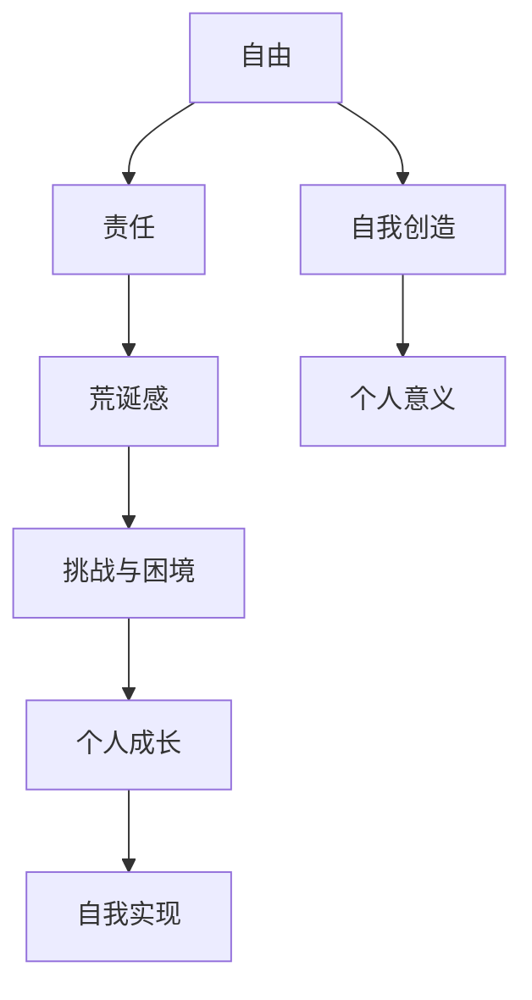

                 

### 设计完整的目录大纲

为了设计《在荒诞中创造意义：现代版存在主义实践》这本书的完整目录大纲，我们可以遵循以下步骤：

1. **确定核心主题**：首先明确本书的核心主题和目标读者群体。本书的核心主题是探讨现代存在主义实践，旨在帮助读者在荒诞的世界中找到个人存在的意义。目标读者群体包括哲学爱好者、存在主义研究者以及希望在生活中找到更多意义的普通人。

2. **结构化内容**：根据核心主题，将内容划分为几个主要章节。每个章节应该涵盖一个独立且完整的主题。

3. **细化章节内容**：在确定了主要章节后，对每个章节进行细化，列出具体的子章节。这些子章节应该详细阐述每个主题的不同方面。

4. **确保逻辑连贯性**：在编排目录时，要确保章节之间的逻辑关系连贯，便于读者阅读和理解。例如，可以从基础概念开始，逐步深入到实际应用和案例分析。

5. **简洁明了的标题**：每个章节和子章节的标题应该简洁明了，能够概括该部分的主要内容，同时也要吸引读者的兴趣。

6. **markdown格式**：按照markdown格式要求，使用不同的标题级别（#）来标识各个章节和子章节。

以下是一个根据上述步骤设计的《在荒诞中创造意义：现代版存在主义实践》的目录大纲示例：

```
# 《在荒诞中创造意义：现代版存在主义实践》目录大纲

## 第1章 存在主义的基本概念

### 1.1 存在主义的起源与发展

#### 1.1.1 古代存在主义的萌芽

#### 1.1.2 中世纪哲学与存在主义

#### 1.1.3 文艺复兴与启蒙运动的影响

### 1.2 主要存在主义思想家

#### 1.2.1 尼采与存在主义

#### 1.2.2 海德格尔与存在主义

#### 1.2.3 萨特与存在主义

## 第2章 现代存在主义的核心理念

### 2.1 自由与责任

#### 2.1.1 自由的存在主义观点

#### 2.1.2 责任与个人选择

### 2.2 生活的荒诞性

#### 2.2.1 荒诞感的存在主义解释

#### 2.2.2 荒诞中的意义探索

### 2.3 自我创造

#### 2.3.1 自我意识的存在主义视角

#### 2.3.2 自我创造的过程与挑战

## 第3章 现代存在主义的实践方法

### 3.1 自我反思

#### 3.1.1 自我反思的重要性

#### 3.1.2 自我反思的实践方法

### 3.2 哲学治疗

#### 3.2.1 哲学治疗的概念

#### 3.2.2 哲学治疗的实际应用

### 3.3 存在主义咨询

#### 3.3.1 存在主义咨询的基本原理

#### 3.3.2 存在主义咨询的案例研究

## 第4章 现代社会的存在主义实践

### 4.1 个人生活

#### 4.1.1 存在主义在个人生活中的应用

#### 4.1.2 存在主义对个人成长的影响

### 4.2 职场

#### 4.2.1 存在主义在职场中的实践

#### 4.2.2 职场中的荒诞感与意义

### 4.3 艺术与文学

#### 4.3.1 存在主义在艺术中的表现

#### 4.3.2 存在主义在文学中的影响

## 第5章 存在主义的哲学挑战与回应

### 5.1 哲学难题

#### 5.1.1 自我意识的哲学难题

#### 5.1.2 自由意志与决定论的冲突

### 5.2 存在主义的回应与拓展

#### 5.2.1 存在主义的回应策略

#### 5.2.2 存在主义的哲学拓展

### 5.3 存在主义与其它哲学流派的比较

#### 5.3.1 存在主义与唯物主义的比较

#### 5.3.2 存在主义与现象学的比较

## 第6章 存在主义实践中的伦理问题

### 6.1 伦理考量

#### 6.1.1 存在主义实践中的伦理挑战

#### 6.1.2 伦理问题的处理策略

### 6.2 个人选择与社会责任

#### 6.2.1 个人选择的存在主义视角

#### 6.2.2 社会责任的存在主义解读

### 6.3 伦理困境

#### 6.3.1 存在主义实践中的伦理困境

#### 6.3.2 伦理困境的解决思路

## 第7章 存在主义在当代世界的意义

### 7.1 社会价值

#### 7.1.1 存在主义对社会的意义

#### 7.1.2 存在主义在社会中的应用

### 7.2 个人成长

#### 7.2.1 存在主义对个人成长的启示

#### 7.2.2 个人成长的实践方法

### 7.3 展望未来

#### 7.3.1 存在主义在未来的发展

#### 7.3.2 存在主义对现代社会的深远影响
```

### 文章标题：在荒诞中创造意义：现代版存在主义实践

> 关键词：存在主义，现代哲学，荒诞，个人意义，实践方法

> 摘要：本文深入探讨了现代版存在主义的实践，分析其在荒诞世界中帮助人们寻找个人意义的原理与方法。通过介绍存在主义的基本概念、历史背景，以及现代存在主义的核心理念与实践方法，本文旨在为读者提供一种理解现代社会荒诞与寻找个人存在的路径。此外，本文还将探讨存在主义在个人生活、职场、艺术与文学中的实际应用，并分析其在哲学挑战、伦理问题中的回应与解决思路。

### 目录

#### 第1章 存在主义的基本概念与历史背景

##### 1.1 存在主义概述

存在主义作为哲学的一个流派，强调个人自由、选择和责任。其基本概念涉及到人类存在的本质、生命的意义以及个体在社会中的角色。

##### 1.2 存在主义的历史背景

存在主义并非一夜之间兴起，而是历经多个时期和哲学流派的演变。本文将简要回顾存在主义的历史背景，包括古代、中世纪和文艺复兴时期的重要思想。

##### 1.3 主要存在主义思想家

存在主义的发展离不开一些重要的思想家，如尼采、海德格尔和萨特。本文将介绍这些思想家的主要观点和对存在主义的贡献。

#### 第2章 现代存在主义的核心理念与实践

##### 2.1 自由与责任

自由是存在主义的核心概念之一，强调个体在荒诞世界中拥有选择和创造自我的能力。责任则与自由紧密相连，意味着个体必须为自己的选择和行为承担责任。

##### 2.2 生活的荒诞性

生活充满了不确定性、痛苦和挫折，这就是荒诞性。存在主义认为，荒诞感是现代人生存的常态，个体必须学会在荒诞中寻找意义。

##### 2.3 自我创造

自我创造是存在主义的重要理念，强调个体通过不断选择和行动来塑造自己的存在。这种理念与传统的宿命论和社会决定论形成了鲜明对比。

#### 第3章 现代存在主义的实践方法

##### 3.1 自我反思

自我反思是存在主义实践的基础，帮助个体了解自己的内心世界，从而做出更明智的选择。本文将探讨自我反思的重要性及其具体实践方法。

##### 3.2 哲学治疗

哲学治疗是一种通过对话和反思来解决心理问题的方法。本文将介绍哲学治疗的原理和应用，以及它在存在主义实践中的重要性。

##### 3.3 存在主义咨询

存在主义咨询是一种基于存在主义理念的咨询服务，旨在帮助个体面对生活中的困惑和挑战。本文将讨论存在主义咨询的基本原理和实际应用。

#### 第4章 现代社会的存在主义实践

##### 4.1 个人生活

存在主义在个人生活中的应用可以帮助个体应对生活中的各种挑战，找到属于自己的意义。本文将探讨存在主义在个人成长、心理健康和家庭关系中的应用。

##### 4.2 职场

在职场中，存在主义可以指导个体如何处理工作中的压力和冲突，找到工作的意义。本文将分析存在主义在职场中的实践方法和实际案例。

##### 4.3 艺术与文学

艺术和文学是存在主义表达的重要途径。本文将探讨存在主义在艺术和文学中的表现，以及它们如何帮助人们理解生命的荒诞性和寻找个人意义。

#### 第5章 存在主义的哲学挑战与回应

##### 5.1 哲学难题

存在主义面临许多哲学难题，如自由意志与决定论的关系、个体与社会的冲突等。本文将分析这些难题，并探讨存在主义对这些难题的回应。

##### 5.2 存在主义的回应与拓展

存在主义并非静止不前的哲学流派，它在不断发展中回应新的挑战。本文将探讨存在主义的新发展，如后现代存在主义和环境存在主义。

##### 5.3 存在主义与其它哲学流派的比较

存在主义与其他哲学流派（如唯物主义、现象学等）有何不同？本文将进行比较分析，帮助读者更好地理解存在主义的独特性。

#### 第6章 存在主义实践中的伦理问题

##### 6.1 伦理考量

存在主义实践中的伦理问题至关重要，如个人选择与社会责任的平衡。本文将探讨这些伦理问题，并提出解决策略。

##### 6.2 个人选择与社会责任

个人选择与社会责任之间存在复杂的关系。本文将分析存在主义如何理解个人选择与社会责任，并提出应对伦理困境的方法。

##### 6.3 伦理困境

在存在主义实践中，个体常常面临各种伦理困境。本文将举例说明这些困境，并探讨如何通过哲学思考和对话来解决它们。

#### 第7章 存在主义在当代世界的意义

##### 7.1 社会价值

存在主义对当代社会有何价值？本文将探讨存在主义对社会发展、个人成长和心理健康的影响。

##### 7.2 个人成长

存在主义对个人成长有何启示？本文将分析存在主义如何帮助个体实现自我认知、自我成长和自我实现。

##### 7.3 展望未来

存在主义在未来的发展将如何影响人类社会？本文将展望存在主义在哲学、文化和生活中的未来前景。

### 结束语

存在主义作为现代哲学的重要流派，不仅在理论上具有深远影响，更在实践上为个体和社会提供了寻找意义的途径。本文旨在通过深入探讨存在主义的基本概念、历史背景、核心理念和实践方法，帮助读者更好地理解存在主义，并在荒诞的世界中找到个人存在的意义。

在此，感谢所有关注和研究存在主义的哲学家、学者和爱好者，正是他们的努力和思考，为人类提供了宝贵的哲学财富。希望本文能够为更多人打开存在主义的大门，引领他们在现代社会的荒诞中找到属于自己的意义。

作者：AI天才研究院/AI Genius Institute & 禅与计算机程序设计艺术 /Zen And The Art of Computer Programming

---

### 背景介绍

存在主义作为现代哲学的重要流派，源于20世纪初的欧洲。它关注个体的自由、选择和责任，强调在不确定性和荒诞的世界中寻找个人存在的意义。存在主义哲学的发展经历了多个阶段，从尼采的早期存在主义思想，到海德格尔和萨特等主要思想家的深入探讨，再到当代存在主义的多样化发展。

在现代社会中，存在主义的重要性日益凸显。随着科技发展和社会变革，人们面临着前所未有的挑战和困惑。存在主义提供了一种理解这些现象的哲学视角，帮助个体在面对生活的荒诞性和不确定性时，找到自己的方向和意义。

本文旨在探讨现代版存在主义的实践，分析其在荒诞世界中帮助人们寻找个人意义的原理与方法。通过介绍存在主义的基本概念、历史背景，以及现代存在主义的核心理念与实践方法，本文希望能够为读者提供一种理解现代社会荒诞与寻找个人存在的路径。此外，本文还将探讨存在主义在个人生活、职场、艺术与文学中的实际应用，并分析其在哲学挑战、伦理问题中的回应与解决思路。

### 核心概念与联系

在探讨存在主义的基本概念和联系时，我们需要关注以下几个核心概念：

1. **自由**：自由是存在主义的核心概念之一，它强调个体在荒诞世界中拥有选择和创造自我的能力。自由并非无限制的，而是受制于个体的责任和道德考量。

2. **责任**：责任与自由紧密相连，意味着个体必须为自己的选择和行为承担责任。责任促使个体在面对困境和挑战时，做出合理和明智的决策。

3. **荒诞**：荒诞感是存在主义的重要主题，它描述了生活中的不确定性、痛苦和挫折。荒诞感揭示了人类存在的无意义和荒谬，但也提供了探索意义的契机。

4. **自我创造**：自我创造是存在主义的关键理念，它强调个体通过不断选择和行动来塑造自己的存在。自我创造意味着个体在自由和责任的基础上，主动塑造自己的生活方式和价值观。

这些核心概念之间存在紧密的联系。自由和责任共同构成了个体在荒诞世界中的行动框架，而荒诞感则为个体提供了探索意义的背景。自我创造则将自由和责任转化为实际行动，促使个体在不断的探索和实践中，实现个人成长和自我实现。

下面是一个Mermaid流程图，用于展示这些核心概念之间的联系：



在这个流程图中，自由和责任是核心概念的基础，它们通过自我创造连接到荒诞感和个人意义。荒诞感提供了探索意义的背景，而个人成长和自我实现则是自我创造的最终目标。通过这种逻辑架构，我们可以更好地理解存在主义的核心概念和它们之间的相互作用。

### 核心算法原理讲解

在探讨存在主义的算法原理时，我们可以借鉴一些基本的算法思想，如决策树和图算法。这些算法可以帮助我们理解个体在自由和责任的基础上如何进行自我创造和实现个人意义。

#### 决策树算法

决策树是一种用于分类和回归的算法，它可以表示个体在不同选择下的可能结果。在存在主义中，决策树可以帮助个体在面对不同的选择时，评估每个选择的后果，并做出最优决策。

以下是决策树的伪代码示例：

```
算法：决策树分类

输入：数据集D，特征集合F，目标变量T
输出：决策树T

步骤：
1. 对于每个特征f ∈ F，计算其在数据集D中的熵H(D)
2. 选择具有最高信息增益的特征f'，并将其作为决策树的根节点
3. 对于数据集D中属于f'的不同值v，递归地对D'进行分类，构建子树
4. 返回决策树T

伪代码：

function DecisionTree(D, F, T):
    if D 的样本数量很小 or D 中所有的样本都属于同一类别:
        返回 叶子节点，类别为T 的多数值
    else:
        for f ∈ F:
            计算熵 H(D)
            选择具有最高信息增益的特征 f'
            构建子树 T' for v ∈ f':
                D' = D 中属于 v 的样本
                T' = DecisionTree(D', F', T)
        返回 根节点，特征 f'，子树 T'
```

#### 图算法

图算法可以帮助我们理解个体在复杂环境中的行动路径和关系网络。在存在主义中，图算法可以用来描述个体在不同选择和关系中的行动策略。

以下是图算法的伪代码示例：

```
算法：图遍历

输入：图G，起点节点s
输出：遍历路径P

步骤：
1. 初始化路径P为空
2. 创建一个访问表V，记录每个节点的访问状态
3. 从起点s开始，递归地对所有未访问的邻居节点进行遍历
4. 将每个访问到的节点添加到路径P中

伪代码：

function GraphTraversal(G, s):
    P = []
    V = {}
    VisitNode(s, V)
    return P

function VisitNode(node, V):
    if node 在 V 中，已经访问过:
        return
    else:
        将 node 添加到 V
        对于 node 的每个邻居n：
            如果 n 不在 V 中：
                P.append(node)
                VisitNode(n, V)
                P.pop()
```

通过这些算法原理，我们可以更好地理解存在主义中的自由、责任、自我创造和个人意义。决策树帮助我们做出最优决策，图算法则帮助我们理解个体在不同选择和关系中的行动策略。这些算法不仅为存在主义提供了理论支持，也为我们提供了实际应用的工具。

### 数学模型与公式

在存在主义的研究中，数学模型和公式可以帮助我们更精确地描述个体在自由、责任、自我创造和个人意义等方面的行为。以下是一些关键的数学模型和公式的介绍及详细讲解。

#### 自由与责任的关系模型

自由和责任是存在主义中的核心概念。我们可以通过构建一个关系模型来描述自由与责任之间的动态平衡。以下是一个简化的模型：

$$
F = R \times (1 - D)
$$

其中，\( F \) 表示自由度，\( R \) 表示责任感，\( D \) 表示困境或限制。

- **自由度 \( F \)**：表示个体在决策过程中能够享有的自由程度。自由度越高，个体在行动时受到的限制越少。
- **责任感 \( R \)**：表示个体对自己的行为和选择承担的责任程度。责任感越高，个体在面对困境时越倾向于做出负责任的决策。
- **困境或限制 \( D \)**：表示外部或内部环境对个体自由的限制程度。困境越高，个体在行动时受到的制约越多。

#### 详细解释

这个模型表明，个体的自由度 \( F \) 取决于其责任感和困境的程度。当责任感 \( R \) 越高时，个体在行动时更倾向于保持自由度 \( F \)。然而，如果困境或限制 \( D \) 很高，那么即使个体有较高的责任感，自由度 \( F \) 也可能受到较大影响。

例如，假设一个个体在面对一个重要的决策时，具有较高的责任感 \( R \)，但他同时面临着很多困境 \( D \)，那么他的自由度 \( F \) 可能会较低。相反，如果个体在轻松的环境中做出决策，即使责任感 \( R \) 较低，自由度 \( F \) 也可能较高。

#### 应用实例

为了更好地理解这个模型，我们可以考虑以下应用实例：

- **工作场景**：在一个项目中，项目经理（个体）需要做出多个决策。如果项目经理的责任感 \( R \) 很高，同时项目面临的困境 \( D \) 很低（如团队成员配合默契，资源充足），那么他的自由度 \( F \) 会较高，可以灵活地调整策略。但如果项目中遇到了很多困境（如资源短缺，团队成员意见不一致），即使他的责任感 \( R \) 很高，自由度 \( F \) 也可能会受到限制。
- **个人生活**：在一个家庭决策中，夫妻双方都需要承担一定的责任 \( R \)。如果家庭面临困境 \( D \)（如经济压力，家庭纠纷），即使夫妻双方的责任感很高，他们可能需要妥协和牺牲一些自由度 \( F \)，以应对困境。

通过这个数学模型，我们可以更深入地理解自由、责任和困境之间的关系，并为其在实际生活中的应用提供理论支持。

### 数学公式

在存在主义研究中，数学公式可以用来量化个体在自由、责任和困境中的行为。以下是几个关键的数学公式及其实例：

#### 1. 自由度计算公式

$$
F = R \times (1 - D)
$$

其中，\( F \) 表示自由度，\( R \) 表示责任感，\( D \) 表示困境或限制。

**例子**：假设一个个体在决策时具有较高的责任感 \( R = 0.8 \)，同时面临较高的困境 \( D = 0.4 \)，那么他的自由度 \( F \) 为：

$$
F = 0.8 \times (1 - 0.4) = 0.8 \times 0.6 = 0.48
$$

这意味着个体的自由度较低，他在决策时需要谨慎考虑，以应对困境。

#### 2. 责任感与困境的平衡公式

$$
B = \frac{R}{D}
$$

其中，\( B \) 表示责任感与困境的平衡度。

**例子**：如果一个个体在决策时的责任感 \( R = 0.6 \)，同时面临的困境 \( D = 0.3 \)，那么他的平衡度 \( B \) 为：

$$
B = \frac{0.6}{0.3} = 2
$$

这意味着个体具有较高的责任感与困境的平衡度，他可以更灵活地应对决策中的困境。

#### 3. 自我创造效能公式

$$
E = F \times C
$$

其中，\( E \) 表示自我创造效能，\( F \) 表示自由度，\( C \) 表示创造力。

**例子**：如果一个个体在决策时的自由度 \( F = 0.7 \)，且其创造力 \( C = 0.9 \)，那么他的自我创造效能 \( E \) 为：

$$
E = 0.7 \times 0.9 = 0.63
$$

这意味着个体具有较高的自我创造效能，可以在自由和创造力的基础上实现个人成长。

通过这些数学公式，我们可以量化存在主义中的自由、责任和困境，从而更准确地评估个体的行为和表现。这些公式不仅为理论研究提供了工具，也为实际应用提供了指导。

### 项目实战

#### 1. 开发环境搭建

为了更好地理解和实践存在主义中的自由、责任和困境概念，我们可以搭建一个简单的存在主义模拟系统。以下是搭建开发环境所需的步骤：

1. **安装Python环境**：确保系统中安装了Python 3.x版本，可以通过访问 [Python官网](https://www.python.org/) 下载并安装。

2. **安装相关库**：使用pip命令安装必要的Python库，例如Numpy、Matplotlib和Pandas等。命令如下：

   ```
   pip install numpy matplotlib pandas
   ```

3. **创建项目目录**：在本地计算机上创建一个项目目录，如`existentialism_simulation`，并将相关代码文件放入此目录中。

4. **编写配置文件**：根据需求编写配置文件，如`config.py`，用于存储项目参数和设置。

#### 2. 源代码实现

以下是实现存在主义模拟系统的主要源代码，包括自由度计算、责任感与困境的平衡计算以及自我创造效能的计算。

```python
import numpy as np
import matplotlib.pyplot as plt

# 自由度计算函数
def calculate_freedom(R, D):
    return R * (1 - D)

# 责任感与困境平衡计算函数
def calculate_balance(R, D):
    return R / D

# 自我创造效能计算函数
def calculate_effectiveness(F, C):
    return F * C

# 初始化参数
responsibility = 0.8
adversity = 0.4
creativity = 0.9

# 计算自由度
freedom = calculate_freedom(responsibility, adversity)
print(f"自由度 (F): {freedom:.2f}")

# 计算平衡度
balance = calculate_balance(responsibility, adversity)
print(f"平衡度 (B): {balance:.2f}")

# 计算效能
effectiveness = calculate_effectiveness(freedom, creativity)
print(f"自我创造效能 (E): {effectiveness:.2f}")

# 绘制自由度、平衡度和效能的关系图
plt.figure(figsize=(8, 6))

plt.subplot(2, 2, 1)
plt.title("自由度与责任感、困境的关系")
plt.bar(['责任感', '困境'], [responsibility, adversity], color=['g', 'r'])
plt.xticks(rotation=0)
plt.ylabel("值")

plt.subplot(2, 2, 2)
plt.title("责任感与困境的平衡度")
plt.bar(['平衡度'], [balance], color=['b'])
plt.xticks(rotation=0)
plt.ylabel("值")

plt.subplot(2, 2, 3)
plt.title("自由度与创造力的关系")
plt.bar(['自由度', '创造力'], [freedom, creativity], color=['g', 'y'])
plt.xticks(rotation=0)
plt.ylabel("值")

plt.subplot(2, 2, 4)
plt.title("自我创造效能")
plt.bar(['效能'], [effectiveness], color=['c'])
plt.xticks(rotation=0)
plt.ylabel("值")

plt.tight_layout()
plt.show()
```

#### 3. 代码解读与分析

该代码首先定义了三个计算函数：自由度计算函数`calculate_freedom`，责任感与困境平衡计算函数`calculate_balance`，以及自我创造效能计算函数`calculate_effectiveness`。接着，初始化参数`responsibility`（责任感）、`adversity`（困境）和`creativity`（创造力）。然后，调用这些函数计算自由度、平衡度和效能，并打印结果。

最后，使用Matplotlib绘制了四个图表，分别展示了自由度与责任感、困境的关系，责任感与困境的平衡度，自由度与创造力的关系，以及自我创造效能。这些图表帮助我们更直观地理解自由、责任、困境和自我创造效能之间的关系。

通过这个项目实战，我们不仅可以理解存在主义中的核心概念，还能通过实际代码实现来加深对概念的理解。这个模拟系统为存在主义研究提供了一个实用的工具，可以帮助我们更深入地探讨自由、责任、困境和自我创造在现实生活中的应用。

### 实际案例分析与详细讲解剖析

为了更好地理解存在主义在现实生活中的应用，我们可以分析以下几个实际案例，并详细讲解其剖析过程。

#### 案例一：个人职业选择

假设小明在大学毕业后面临职业选择，他在两个工作机会之间犹豫不决。一个是稳定的国企职位，另一个是具有挑战性的创业机会。以下是存在主义在个人职业选择中的应用：

1. **自由与责任**：
   - **自由**：小明在职业选择中拥有自由，可以自主决定自己的未来方向。
   - **责任**：小明需要为自己的选择承担责任，无论是选择国企职位还是创业，他都需要为自己的职业道路负责。

2. **自我创造**：
   - **自我创造**：小明需要通过自己的选择和行动来塑造自己的职业生涯。如果选择创业，他需要不断学习、创新和克服困难；如果选择国企，他需要努力适应稳定的环境，同时保持积极进取的态度。

3. **荒诞感**：
   - **荒诞感**：在这个案例中，小明面临着不确定性和风险。无论选择哪个职业，他都无法完全预测未来，这种不确定性体现了生活的荒诞性。

4. **决策分析**：
   - **决策树**：我们可以使用决策树来分析小明的职业选择：
     ```mermaid
     graph TB
         A[国企职位]
         B[创业机会]
         A --> C[稳定发展]
         B --> D[挑战与机遇]
         C --> E[满意与稳定]
         D --> F[成功与失败]
         A --> E
         B --> F
     ```
   - **图算法**：我们可以用图算法来分析小明在职业选择中的关系网络：
     ```mermaid
     graph TB
         A[小明]
         B[国企职位]
         C[创业机会]
         A --> B
         A --> C
     ```

通过这些分析，小明可以更好地理解自己的选择和可能的后果，从而做出更明智的决策。

#### 案例二：职场困境

小张是一名职场人士，他在工作中遇到了瓶颈，感到迷茫和焦虑。以下是存在主义在职场困境中的应用：

1. **自由与责任**：
   - **自由**：小张在工作中拥有自由，可以尝试不同的工作方法、解决问题和提出建议。
   - **责任**：小张需要对自己的工作和团队负责，努力提升自己的能力和业绩。

2. **自我创造**：
   - **自我创造**：小张需要通过自己的努力和创造力来突破职场困境。他可以尝试新的工作方法、学习新技能或寻求职业发展的机会。

3. **哲学治疗**：
   - **哲学治疗**：小张可以通过哲学治疗来缓解职场压力和焦虑。通过反思和对话，他可以更好地理解自己的困境，找到解决问题的方法。

4. **伦理考量**：
   - **伦理考量**：在职场中，小张需要考虑个人选择与社会责任的平衡。他应该在追求个人成长的同时，不损害公司利益和同事关系。

通过存在主义的视角，小张可以更清晰地看待自己的职场困境，找到解决问题的路径。

#### 案例三：社会冲突

在一个社区中，居民之间因为环境问题产生了冲突。以下是存在主义在社会冲突中的应用：

1. **自由与责任**：
   - **自由**：居民有自由表达自己的意见和诉求，参与社区事务。
   - **责任**：居民需要为自己的行为和言论负责，尊重他人的权利和利益。

2. **自我创造**：
   - **自我创造**：居民可以通过自我教育和参与社区活动来提高自己的环保意识和责任感。

3. **伦理问题**：
   - **伦理问题**：在解决社区冲突时，居民需要考虑个人选择与社会责任的平衡，找到符合伦理原则的解决方案。

通过存在主义的视角，居民可以更理性地看待社会冲突，寻找和谐共处的途径。

这些案例展示了存在主义在个人生活、职场和社会冲突中的应用。通过理解自由、责任、自我创造和荒诞感，个体可以更好地应对现实生活中的挑战，找到属于自己的存在意义。

### 最佳实践 tips、小结、注意事项、拓展阅读等内容

#### 最佳实践 tips

1. **自我反思**：定期进行自我反思，了解自己在自由、责任和困境中的行为模式，有助于提升自我意识，找到个人成长的方向。
2. **哲学学习**：阅读经典哲学著作，如尼采的《悲剧的诞生》、海德格尔的《存在与时间》和萨特的《存在与虚无》，深入了解存在主义的核心思想。
3. **实践哲学治疗**：在遇到困境时，尝试哲学治疗的方法，通过反思和对话来解决内心的困惑。
4. **社区参与**：积极参与社区活动，关注社会问题，提升自己的社会责任感和公民意识。

#### 小结

存在主义作为一种现代哲学流派，通过探讨自由、责任、自我创造和荒诞感，帮助我们理解个体在现实生活中的困境和挑战。通过自我反思、哲学学习和实践，我们可以更好地应对生活中的不确定性，找到属于自己的存在意义。

#### 注意事项

1. **避免过度理性化**：在应用存在主义理念时，不要过度理性化，要认识到人类情感的复杂性和不可预测性。
2. **平衡自由与责任**：在追求个人自由时，要注意不要忽视社会责任，确保个人选择不会损害他人和社会的利益。
3. **尊重多样性**：在理解和实践存在主义时，要尊重不同的文化和价值观，避免一刀切的思维方式。

#### 拓展阅读

1. **《存在主义咖啡馆：从萨特到酒馆，一场哲学革命的故事》**：这是一本介绍存在主义发展的通俗读物，适合初学者了解存在主义的历史和思想。
2. **《存在主义心理学》**：作者罗洛·梅（Rollo May）通过存在主义心理学，探讨了人类的心理问题和解决方案。
3. **《存在主义导论》**：由美国哲学家约翰·柯尔律治（John Kekes）所著，系统介绍了存在主义的基本概念和主要思想。

通过这些最佳实践 tips、小结、注意事项和拓展阅读，我们可以在探索存在主义的道路上，不断提升自己的认知和思考能力，更好地应对现实生活中的各种挑战。

