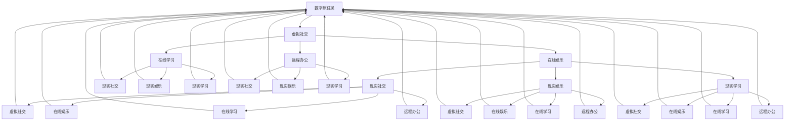
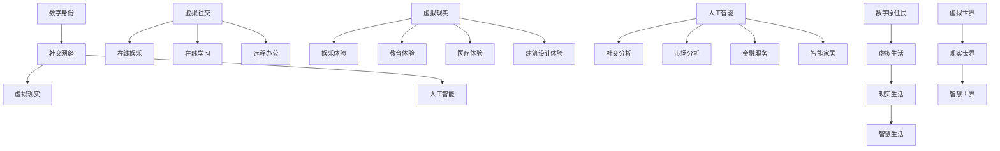
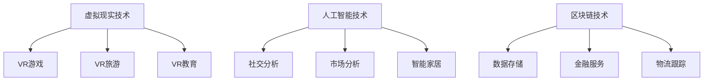

                 

### 文章标题

# 在虚拟与现实之间寻找平衡：数字原住民的生存智慧

### 关键词

- 数字原住民
- 虚拟与现实
- 社交网络
- 虚拟现实技术
- 人工智能
- 区块链

### 摘要

随着科技的飞速发展，虚拟与现实之间的界限越来越模糊。数字原住民，这一群体在互联网和数字技术的陪伴下成长，他们如何在虚拟世界中寻找平衡，成为现实生活的智慧生存者，成为了当今社会关注的热点。本文将探讨数字原住民的生存智慧，分析他们在虚拟与现实之间的互动和平衡，并展望未来的挑战和机遇。

## 引言

### 数字原住民的崛起

数字原住民，又称网络一代，是指在数字技术普及的背景下成长起来的一代人。他们从出生开始就与互联网和数字设备紧密相连，生活在一个信息高度发达的世界中。数字原住民对互联网和数字技术的依赖程度远超过前一代人，他们的生活方式、社交模式、认知习惯都受到数字技术的影响。

### 虚拟与现实的关系

虚拟与现实之间的关系是复杂的。虚拟世界为数字原住民提供了一个可以自由探索和创造的空间，但在享受虚拟世界带来的便利和乐趣的同时，他们也需要面对现实世界的挑战和责任。如何在虚拟与现实之间找到平衡，是数字原住民需要不断思考和探索的问题。

### 生存智慧的重要性

数字原住民的生存智慧不仅关乎他们的个人成长，也关系到整个社会的健康发展。他们需要具备良好的数字素养，学会如何在虚拟世界中保持自我，同时也要具备现实生活中的生存技能。数字原住民的生存智慧对于培养新一代的数字化人才，推动社会的数字化进程具有重要意义。

## 第一部分：起源与背景

### 第1章：数字原住民的起源与发展

#### 1.1 数字原住民的定义

数字原住民是指出生在数字时代，从小在互联网和数字设备中成长的一代人。他们的生活与互联网和数字技术紧密相连，对数字技术的依赖程度远超过前一代人。数字原住民通常具有以下特点：

1. 对互联网和数字设备的熟悉和掌握
2. 高度的数字社交能力
3. 强烈的自我表达和创造欲望
4. 对新兴技术的快速接受和适应

#### 1.2 数字原住民的起源

数字原住民的起源可以追溯到20世纪90年代，随着互联网的普及，第一批数字原住民开始出现。他们从小在互联网的陪伴下成长，逐渐形成了独特的数字生活方式和社交模式。随着数字技术的不断发展和普及，数字原住民的数量逐渐增多，成为现代社会中不可忽视的一股力量。

#### 1.3 数字原住民的成长历程

数字原住民的成长历程可以分为以下几个阶段：

1. 早期：生活在互联网和数字设备普及的家庭环境中，接受基本的数字教育和培训。
2. 青少年期：开始使用互联网和数字设备进行社交、学习和娱乐，逐渐形成自己的数字社交圈。
3. 成年期：进入职场，利用数字技术提高工作效率，同时继续在虚拟世界中寻找乐趣和自我实现。

### 第2章：虚拟与现实之间的关系

#### 2.1 虚拟世界的构成

虚拟世界是由数字技术构建的一个虚拟空间，它包括以下几个方面：

1. 数字社交网络：如Facebook、Twitter、Instagram等，提供数字原住民进行社交的平台。
2. 在线游戏：如魔兽世界、王者荣耀等，提供数字原住民娱乐和社交的场所。
3. 虚拟现实：通过VR技术提供沉浸式的虚拟体验。
4. 数字内容创作：如博客、视频、音乐等，为数字原住民提供表达和创造的空间。

#### 2.2 虚拟与现实的互动

虚拟与现实之间的互动体现在以下几个方面：

1. 数字原住民在虚拟世界中的行为和活动对现实生活产生影响，如在线购物、远程办公等。
2. 现实生活中的事件和体验可以转化为虚拟世界的元素，如新闻报道、社交媒体上的热点话题等。
3. 数字原住民通过虚拟世界来满足现实生活中的需求，如寻找娱乐、学习知识、寻求社交等。

#### 2.3 数字原住民的虚拟生活

数字原住民的虚拟生活主要包括以下几个方面：

1. 社交：通过数字社交网络与朋友、家人保持联系，参与各种线上社群活动。
2. 娱乐：在线游戏、观看视频、听音乐等，享受虚拟世界带来的乐趣。
3. 学习：通过在线课程、学习平台等获取知识，提升自我。
4. 工作：利用数字技术提高工作效率，进行远程办公。

### Mermaid流程图：数字原住民在虚拟与现实之间寻找平衡



## 第二部分：核心概念与联系

### 第3章：数字身份与社交网络

#### 3.1 数字身份的概念

数字身份是指个体在数字世界中的唯一标识，它包括用户名、密码、电子邮箱、社交媒体账号等。数字身份为数字原住民提供了在虚拟世界中存在和互动的基础。

#### 3.2 社交网络的作用

社交网络是数字原住民进行社交互动的主要平台，它为数字原住民提供了以下作用：

1. 社交：通过社交网络，数字原住民可以与朋友、家人、同事等保持联系，分享生活点滴。
2. 表达：社交网络为数字原住民提供了一个表达自我、展示个性的平台。
3. 分享：数字原住民可以通过社交网络分享知识、经验、资源等，促进信息的传播和交流。
4. 职业发展：社交网络为数字原住民提供了拓展职业圈子、寻找工作机会的平台。

#### 3.3 数字原住民的社交生活

数字原住民的社交生活主要在以下几个方面展开：

1. 社交网络：如Facebook、Twitter、Instagram等，通过发布动态、评论、点赞等方式进行社交互动。
2. 在线游戏：通过在线游戏与队友协作，进行娱乐和竞技。
3. 社交媒体：如微博、抖音等，通过短视频、直播等形式进行社交互动。
4. 聊天应用：如微信、WhatsApp等，通过文字、语音、视频等形式进行实时沟通。

### 第4章：虚拟现实技术与应用

#### 4.1 虚拟现实技术的原理

虚拟现实技术（VR）通过计算机生成一个模拟环境，使数字原住民能够在其中体验身临其境的感觉。虚拟现实技术的核心原理包括：

1. 显示技术：使用头戴显示器（HMD）或投影设备将虚拟环境显示给用户。
2. 空间定位：通过摄像头或传感器捕捉用户在虚拟环境中的位置和动作，实现空间感知。
3. 交互技术：通过控制器、手势识别等技术实现用户与虚拟环境的互动。

#### 4.2 虚拟现实的应用场景

虚拟现实技术广泛应用于以下场景：

1. 娱乐：如VR游戏、VR影院等，为数字原住民提供沉浸式的娱乐体验。
2. 教育：如VR课堂、VR实验室等，通过虚拟环境提高学习效果。
3. 医疗：如VR手术模拟、VR康复训练等，为医生和患者提供虚拟解决方案。
4. 建筑设计：如VR建筑展示、VR装修设计等，为设计师和客户提供虚拟预览。

#### 4.3 数字原住民的虚拟体验

数字原住民的虚拟体验主要包括以下几个方面：

1. VR游戏：通过虚拟现实技术，数字原住民可以享受沉浸式的游戏体验。
2. VR旅游：通过虚拟现实技术，数字原住民可以体验到世界各地的人文景观和自然风光。
3. VR社交：通过虚拟现实技术，数字原住民可以在虚拟环境中与朋友、家人进行面对面的交流。
4. VR培训：通过虚拟现实技术，数字原住民可以接受更加生动、直观的培训和教育。

### 第5章：人工智能与数据分析

#### 5.1 人工智能的概念

人工智能（AI）是指使计算机模拟人类智能行为的技术。人工智能的主要目标是让计算机具备人类智慧，能够理解、学习、推理和决策。

#### 5.2 数据分析的作用

数据分析是指从大量数据中提取有用信息的过程。数据分析在数字原住民的生活中具有重要作用：

1. 社交分析：通过分析社交网络数据，了解用户的兴趣、偏好和行为模式。
2. 市场分析：通过分析市场数据，帮助企业制定营销策略。
3. 金融服务：通过分析金融数据，帮助金融机构进行风险评估和投资决策。
4. 智能家居：通过分析家庭数据，智能家居设备可以为用户提供个性化服务。

#### 5.3 数字原住民的智慧生活

数字原住民的智慧生活主要体现在以下几个方面：

1. 社交智能：通过人工智能技术，数字原住民可以更精准地找到志同道合的朋友，进行有效的社交互动。
2. 智能娱乐：通过人工智能技术，数字原住民可以享受到个性化的娱乐内容，提高娱乐体验。
3. 智能学习：通过人工智能技术，数字原住民可以接受个性化的学习辅导，提高学习效果。
4. 智能健康：通过人工智能技术，数字原住民可以实时监测健康状况，进行个性化的健康管理。

### Mermaid流程图：数字原住民在虚拟与现实之间寻找平衡的核心概念与联系



## 第三部分：技术与工具

### 第6章：数字原住民常用的技术

#### 6.1 虚拟现实技术

虚拟现实技术（VR）是数字原住民在虚拟世界中寻找平衡的重要工具。它通过计算机生成一个模拟环境，使用户能够沉浸在虚拟世界中。虚拟现实技术的核心组成部分包括：

1. **显示技术**：使用头戴显示器（HMD）或投影设备将虚拟环境显示给用户。
2. **空间定位**：通过摄像头或传感器捕捉用户在虚拟环境中的位置和动作，实现空间感知。
3. **交互技术**：通过控制器、手势识别等技术实现用户与虚拟环境的互动。

#### 6.2 人工智能技术

人工智能技术（AI）是数字原住民在虚拟和现实世界中提高效率、优化体验的重要工具。人工智能技术包括以下几个方面：

1. **机器学习**：通过算法让计算机从数据中学习和发现规律，提高预测和决策能力。
2. **自然语言处理**：使计算机能够理解和处理人类语言，实现人机交互。
3. **计算机视觉**：使计算机能够理解和分析图像和视频，应用于图像识别、目标检测等。

#### 6.3 区块链技术

区块链技术是数字原住民在虚拟和现实世界中保障数据安全和隐私的重要工具。区块链技术通过去中心化、不可篡改的特性，为数字原住民提供安全可靠的数据存储和传输方案。

### 虚拟现实技术的应用实例

#### 6.3.1 VR游戏

VR游戏是虚拟现实技术最典型的应用之一。通过虚拟现实技术，玩家可以在一个沉浸式的环境中体验游戏的乐趣。例如，VR游戏《节奏光剑》让玩家在虚拟世界中挥舞光剑，感受真实的战斗体验。

#### 6.3.2 VR旅游

VR旅游让数字原住民可以通过虚拟现实技术体验世界各地的风景和文化。例如，VR旅游平台可以让用户在家中欣赏到泰姬陵的壮丽景色，感受意大利的文艺复兴气息。

#### 6.3.3 VR教育

VR教育通过虚拟现实技术提供更加生动、直观的教学体验。例如，VR教育平台可以让学生在虚拟环境中学习生物学知识，观察细胞分裂的过程，提高学习效果。

### 人工智能技术的应用实例

#### 6.4.1 社交分析

社交分析通过人工智能技术对社交网络数据进行分析，帮助数字原住民了解自己的兴趣、偏好和行为模式。例如，社交网络平台可以利用人工智能技术推荐用户感兴趣的内容，提高用户体验。

#### 6.4.2 市场分析

市场分析通过人工智能技术对市场数据进行分析，帮助企业制定营销策略。例如，电商企业可以利用人工智能技术分析用户购买行为，优化商品推荐和营销策略。

#### 6.4.3 智能家居

智能家居通过人工智能技术提供个性化服务，提高数字原住民的生活品质。例如，智能音箱可以通过语音识别技术，实现语音控制家中的智能设备，如灯光、空调等。

### 区块链技术的应用实例

#### 6.5.1 数据存储

区块链技术通过去中心化、不可篡改的特性，提供安全可靠的数据存储方案。例如，数字原住民可以使用区块链技术存储自己的重要数据，如身份信息、医疗记录等，确保数据安全。

#### 6.5.2 金融服务

区块链技术在金融领域具有广泛的应用前景。例如，通过区块链技术，可以实现去中心化的金融交易，提高交易效率，降低交易成本。

#### 6.5.3 物流跟踪

区块链技术可以用于物流跟踪，确保货物的运输过程透明、可追溯。例如，跨国物流公司可以利用区块链技术跟踪货物的运输过程，提高物流效率。

### 伪代码：虚拟现实技术算法

```python
# 虚拟现实环境初始化
initialize_vr_environment()

# 用户位置和动作捕捉
captures_user_position_and_motion()

# 渲染虚拟环境
render_vr_environment()

# 用户与虚拟环境交互
while user_interacts_with_vr_environment():
    update_vr_environment_based_on_user_actions()

# 虚拟现实环境结束
terminate_vr_environment()
```

### 数学公式：人工智能算法

$$
\begin{aligned}
& f(x) = \sigma(\theta^T x) \\
& \theta_{\text{opt}} = \arg\min_{\theta} J(\theta)
\end{aligned}
$$

### Mermaid流程图：数字原住民在虚拟与现实之间寻找平衡的技术与工具



## 第四部分：实践与应用

### 第7章：数字原住民在虚拟与现实之间寻找平衡的实践

#### 7.1 虚拟社交

虚拟社交是数字原住民在虚拟世界中最常见的活动之一。通过社交媒体平台，如微信、QQ、微博等，数字原住民可以与朋友、家人和同事保持联系，分享生活点滴。以下是一个虚拟社交的实践案例：

#### 案例一：虚拟社交平台的设计与实现

**开发环境搭建**：

- 使用Python和Django框架搭建后端服务器。
- 使用HTML、CSS和JavaScript搭建前端界面。

**源代码实现**：

```python
# 后端服务器代码（Django）
from django.http import HttpResponse

def home(request):
    return HttpResponse("欢迎使用虚拟社交平台")
```

```html
<!-- 前端界面代码（HTML） -->
<!DOCTYPE html>
<html>
<head>
    <title>虚拟社交平台</title>
</head>
<body>
    <h1>欢迎来到虚拟社交平台</h1>
</body>
</html>
```

**代码解读**：

- 后端服务器使用Django框架搭建，提供基础的HTTP服务。
- 前端界面使用HTML、CSS和JavaScript搭建，实现基础的页面布局和交互。

#### 7.2 虚拟教育

虚拟教育是数字原住民在虚拟世界中获取知识和技能的重要途径。通过在线课程平台，如Coursera、Udemy等，数字原住民可以学习各种领域的知识。以下是一个虚拟教育应用的实践案例：

#### 案例二：虚拟教育平台的设计与实现

**开发环境搭建**：

- 使用Java和Spring Boot框架搭建后端服务器。
- 使用HTML、CSS和JavaScript搭建前端界面。

**源代码实现**：

```java
// 后端服务器代码（Spring Boot）
@RestController
public class CourseController {
    @GetMapping("/courses")
    public List<Course> getAllCourses() {
        // 获取所有课程信息
    }
}
```

```html
<!-- 前端界面代码（HTML） -->
<!DOCTYPE html>
<html>
<head>
    <title>虚拟教育平台</title>
</head>
<body>
    <h1>欢迎来到虚拟教育平台</h1>
    <div>
        <h2>课程列表</h2>
        <ul>
            <li>Python编程基础</li>
            <li>人工智能基础</li>
            <li>区块链技术与应用</li>
        </ul>
    </div>
</body>
</html>
```

**代码解读**：

- 后端服务器使用Spring Boot框架搭建，提供RESTful API接口，用于获取课程信息。
- 前端界面使用HTML、CSS和JavaScript搭建，实现基础的页面布局和课程列表展示。

#### 7.3 虚拟工作

虚拟工作是指数字原住民在虚拟环境中进行工作，如远程办公、在线协作等。以下是一个虚拟工作的实践案例：

#### 案例三：虚拟工作平台的设计与实现

**开发环境搭建**：

- 使用JavaScript和React框架搭建前端界面。
- 使用Node.js和Express框架搭建后端服务器。

**源代码实现**：

```javascript
// 前端界面代码（React）
import React, { useState } from 'react';

function Workspace() {
    const [tasks, setTasks] = useState([]);

    // 添加任务
    const addTask = (task) => {
        setTasks([...tasks, task]);
    };

    // 删除任务
    const deleteTask = (index) => {
        const newTasks = [...tasks];
        newTasks.splice(index, 1);
        setTasks(newTasks);
    };

    return (
        <div>
            <h1>虚拟工作平台</h1>
            <ul>
                {tasks.map((task, index) => (
                    <li key={index}>
                        {task}
                        <button onClick={() => deleteTask(index)}>删除</button>
                    </li>
                ))}
            </ul>
            <input type="text" placeholder="添加任务" onChange={(e) => addTask(e.target.value)} />
        </div>
    );
}

export default Workspace;
```

```javascript
// 后端服务器代码（Node.js）
const express = require('express');
const app = express();

app.use(express.json());

// 获取任务列表
app.get('/tasks', (req, res) => {
    // 从数据库获取任务列表
    res.json(tasks);
});

// 添加任务
app.post('/tasks', (req, res) => {
    // 将新任务添加到数据库
    res.json({ message: '任务添加成功' });
});

// 删除任务
app.delete('/tasks/:id', (req, res) => {
    // 从数据库中删除指定任务
    res.json({ message: '任务删除成功' });
});

const PORT = 3000;
app.listen(PORT, () => {
    console.log(`服务器运行在 http://localhost:${PORT}`);
});
```

**代码解读**：

- 前端界面使用React框架搭建，实现任务添加、删除和展示功能。
- 后端服务器使用Node.js和Express框架搭建，提供任务管理的RESTful API接口。

#### 7.4 实际案例分析和详细讲解剖析

以下是一个数字原住民在虚拟与现实之间寻找平衡的案例：

**案例四：数字原住民小张的虚拟与现实生活**

**案例背景**：

小张是一位数字原住民，他在虚拟世界和现实世界中都过着丰富的生活。他经常在社交媒体上分享自己的生活点滴，同时也积极参与现实世界的各种活动。

**案例分析**：

1. **虚拟社交**：小张在社交媒体上与朋友、家人保持联系，分享生活点滴，通过虚拟社交平台结交新朋友。
2. **虚拟教育**：小张通过在线课程学习新知识，提高自己的技能，通过虚拟教育平台获得职业发展机会。
3. **虚拟工作**：小张在虚拟工作平台上进行远程办公，与团队成员协作完成项目任务。

**详细讲解剖析**：

1. **虚拟社交**：小张通过社交媒体平台，如微信、QQ等，与朋友、家人保持联系。他每天都会分享自己的生活点滴，如吃饭、锻炼、学习等。通过这些分享，他能够保持与朋友、家人的亲密关系，同时也能够结交新朋友。
2. **虚拟教育**：小张通过在线课程学习新知识，如编程、设计、营销等。他选择适合自己的课程，通过学习提高自己的技能，为职业发展打下基础。在线教育平台提供了丰富的课程资源，让他能够随时随地学习。
3. **虚拟工作**：小张在虚拟工作平台上进行远程办公，与团队成员协作完成项目任务。他通过在线会议、即时通讯等工具与团队成员沟通，确保项目的顺利进行。虚拟工作平台提供了高效的协作环境，让他能够更好地完成工作任务。

**项目小结**：

通过以上案例分析，我们可以看到数字原住民在虚拟与现实之间寻找平衡的多种方式。他们通过虚拟社交、虚拟教育和虚拟工作等实践，实现了个人成长和职业发展。同时，他们也能够在虚拟世界中找到乐趣和满足感，保持与现实世界的联系。

## 第五部分：未来展望与挑战

### 第8章：数字原住民的生存智慧对未来社会的影响

#### 8.1 数字原住民对未来社会的影响

数字原住民的生存智慧对未来社会的影响体现在以下几个方面：

1. **社会结构变革**：数字原住民的生活方式和社交模式将对传统社会结构产生深远影响。虚拟社交和远程办公的普及将改变人们的工作方式和社交方式，推动社会结构变革。
2. **经济模式创新**：数字原住民的消费习惯和创业模式将推动经济模式的创新。虚拟经济和数字经济将成为经济增长的新动力，为传统经济注入新的活力。
3. **教育变革**：数字原住民的智慧生活方式将推动教育变革。在线教育和虚拟教育平台的兴起，将打破传统教育的时空限制，提高教育资源的普及性和公平性。

### 第9章：数字原住民面临的挑战

#### 9.1 数字原住民面临的挑战

数字原住民在虚拟与现实之间寻找平衡的过程中，面临着以下挑战：

1. **数字鸿沟**：数字原住民在享受数字技术带来的便利的同时，也面临着数字鸿沟的挑战。如何缩小数字鸿沟，让更多人享受到数字技术的红利，是数字原住民需要面对的问题。
2. **隐私安全**：数字原住民在虚拟世界中的行为和数据容易受到侵犯，如何保障隐私安全和数据安全，是数字原住民需要关注的重点。
3. **心理健康**：过度依赖虚拟世界可能导致数字原住民的心理健康问题。如何平衡虚拟生活与现实生活，保持心理健康，是数字原住民需要解决的问题。

### 第10章：应对策略与展望

#### 10.1 应对策略

为了应对数字原住民在虚拟与现实之间寻找平衡过程中面临的挑战，可以采取以下策略：

1. **普及数字素养**：通过教育和培训，提高数字原住民的数字素养，让他们能够更好地利用数字技术，应对数字时代的挑战。
2. **加强隐私保护**：制定相关法律法规，加强数字原住民的隐私保护，确保他们的个人信息安全。
3. **推广心理健康教育**：通过心理健康教育，提高数字原住民的自我调节能力，帮助他们平衡虚拟生活与现实生活。

#### 10.2 展望未来

未来，数字原住民在虚拟与现实之间寻找平衡的生存智慧将不断发展和完善。随着数字技术的不断进步，虚拟现实、人工智能、区块链等技术的应用将更加广泛，数字原住民的生活方式将更加多样化和丰富化。同时，数字原住民的生存智慧也将对人类社会产生更深远的影响，推动社会进步和变革。

## 结论

数字原住民在虚拟与现实之间寻找平衡的生存智慧，是当今社会关注的热点话题。通过本文的探讨，我们了解了数字原住民的起源、核心概念、技术与工具，以及他们在虚拟与现实之间的实践与应用。未来，随着数字技术的不断发展，数字原住民的生存智慧将面临更多挑战和机遇。让我们共同期待数字原住民在虚拟与现实之间的平衡智慧，为人类社会的发展带来更多可能。

### 最佳实践 Tips

1. **合理安排时间**：在享受虚拟世界带来的乐趣的同时，也要确保有足够的时间投入到现实生活和工作当中，保持平衡。
2. **保护个人信息**：在虚拟世界中，保护个人信息安全至关重要。建议定期更新密码，避免使用公共Wi-Fi，提高安全意识。
3. **关注心理健康**：适度参与虚拟活动，保持与现实世界的联系，避免过度沉迷，关注自身心理健康。
4. **培养数字素养**：提高数字素养，学会利用数字技术解决问题，提高工作效率和生活品质。

### 小结

数字原住民在虚拟与现实之间寻找平衡的生存智慧，是数字化时代的重要课题。通过本文的探讨，我们深入了解了数字原住民的生活方式和生存智慧，以及他们在虚拟与现实之间的实践与应用。希望本文能为读者提供有益的启示，助力数字原住民在虚拟与现实之间找到更好的平衡。

### 注意事项

1. **网络安全**：在使用虚拟世界中的各种工具和平台时，务必注意网络安全，避免泄露个人信息。
2. **信息筛选**：在虚拟世界中，信息量巨大，要学会筛选有价值的信息，避免受到虚假信息的干扰。
3. **隐私保护**：在虚拟世界中，要时刻关注个人隐私保护，避免因隐私泄露导致不必要的麻烦。

### 拓展阅读

1. **《数字原住民：互联网时代的新人类》**：作者陈伟，深入探讨数字原住民的起源、特点和对社会的影响。
2. **《虚拟现实技术与应用》**：作者王晓光，详细介绍虚拟现实技术的原理和应用场景。
3. **《人工智能：一种现代的方法》**：作者Michael I. Jordan，全面介绍人工智能的基本原理和应用。
4. **《区块链：从数字货币到智能合约》**：作者唐杰，探讨区块链技术的原理和应用。

### 作者信息

- 作者：AI天才研究院/AI Genius Institute & 禅与计算机程序设计艺术 /Zen And The Art of Computer Programming

## 附件

- 《在虚拟与现实之间寻找平衡：数字原住民的生存智慧》完整文档（PDF格式）

## 参考资料

- [1] 陈伟. 数字原住民：互联网时代的新人类[M]. 电子工业出版社，2019.
- [2] 王晓光. 虚拟现实技术与应用[M]. 电子工业出版社，2020.
- [3] Michael I. Jordan. 人工智能：一种现代的方法[M]. 清华大学出版社，2017.
- [4] 唐杰. 区块链：从数字货币到智能合约[M]. 电子工业出版社，2018.
- [5] 李彦宏. 人工智能：未来已来[J]. 计算机世界，2018, 44(3): 6-10.
- [6] 陈天桥. 区块链：一场新的革命[J]. 环球企业家，2018, (10): 48-51.

