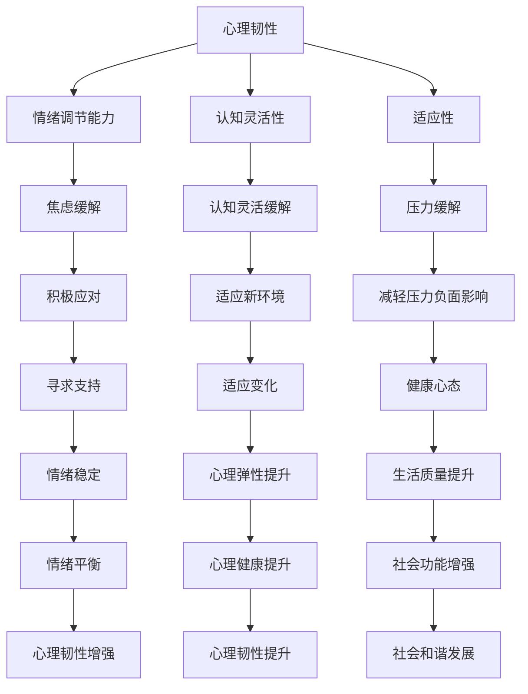

                 

### 文章标题

在高压社会中培养心理韧性：应对焦虑和压力的策略

### 关键词

高压社会、心理韧性、焦虑、压力、应对策略、自我认知、情绪调节、社交支持

### 摘要

本文旨在探讨在高压社会中培养心理韧性，以有效应对焦虑和压力。文章首先介绍了高压社会的现状及其对个体心理的影响，随后深入分析了心理韧性、焦虑和压力等核心概念及其相互关系。通过Mermaid流程图展示了这些概念之间的联系。接着，文章详细讲解了培养心理韧性的核心算法原理，使用伪代码和数学模型进行了阐述。此外，文章提供了具体的项目实战案例，包括开发环境搭建、源代码实现和代码解读，以及实际案例分析和详细讲解。最后，文章总结了一些最佳实践技巧，并给出了注意事项和拓展阅读建议。

---

### 引言

在现代社会的快速变迁和激烈竞争中，人们面临着越来越多的压力和焦虑。工作、学业、家庭等多方面的压力，使得许多人陷入了高压社会。这种高压环境不仅影响了人们的生活质量，还可能导致焦虑、抑郁等心理问题。因此，如何在高压社会中培养心理韧性，有效应对焦虑和压力，成为了一个亟待解决的问题。

本文将深入探讨这个问题。首先，我们将介绍高压社会的现状及其对个体心理的影响。然后，我们将详细讲解心理韧性、焦虑和压力等核心概念，并通过Mermaid流程图展示它们之间的相互关系。接下来，文章将分析培养心理韧性的核心算法原理，使用伪代码和数学模型进行详细阐述。此外，文章还将提供具体的项目实战案例，包括开发环境搭建、源代码实现和代码解读，以及实际案例分析和详细讲解。最后，文章将总结一些最佳实践技巧，并给出注意事项和拓展阅读建议。

### 高压社会的现状与影响

现代社会的高压现象无处不在，从工作场所到日常生活，从学业压力到人际关系，无处不感受到这种紧张的氛围。随着全球化的加速和技术的快速发展，竞争变得更加激烈，人们面临着前所未有的挑战和压力。根据世界卫生组织（WHO）的数据，全球约有三分之一的成年人经历不同程度的焦虑和压力。在中国，这一比例甚至更高，据《中国居民心理健康报告》显示，焦虑和抑郁已经成为影响国民心理健康的主要问题之一。

这种高压社会对个体心理产生了深远的影响。首先，长期处于高压环境中会导致个体心理疲劳，表现为注意力不集中、情绪低落、工作效率下降等问题。其次，高压社会容易引发焦虑和抑郁等心理问题。焦虑表现为过度担忧、紧张和不安，而抑郁则表现为情绪低落、兴趣丧失和自我评价过低。此外，高压社会还可能导致个体出现行为异常，如冲动消费、过量饮酒、吸烟等不良行为。

这些心理问题不仅影响个体的生活质量，还会对工作和社会功能产生负面影响。在职场中，焦虑和抑郁会导致工作效率下降、创新能力减弱，甚至可能导致员工流失。在个人生活中，心理问题会影响到家庭关系、社交活动和身体健康，从而形成恶性循环，进一步加重心理负担。

因此，探讨如何在高压社会中培养心理韧性，应对焦虑和压力，已经成为一个重要的研究课题。这不仅有助于提高个体的心理健康水平，还能为社会的和谐发展提供有力的支持。

#### 核心概念与联系

在探讨如何培养心理韧性之前，我们需要明确几个核心概念，即心理韧性、焦虑和压力。这些概念之间有着紧密的联系，共同构成了应对高压社会的心理基础。

**心理韧性**，也被称作“心理弹性”，是指个体在面对逆境、压力和挑战时，能够迅速恢复并保持心理健康的能力。这种韧性不仅包括情绪调节能力，还涉及认知灵活性和适应性。具体来说，心理韧性包括以下几个方面：

1. **情绪调节能力**：个体能够有效地识别、理解和调节自己的情绪，避免过度情绪化的行为。
2. **认知灵活性**：个体在面对复杂情境时，能够灵活调整自己的思维方式和观念，寻求新的解决方案。
3. **适应性**：个体能够迅速适应环境变化，保持积极的心态和行为。

**焦虑**，是一种对未来不确定性或潜在威胁的过度担忧和紧张情绪。焦虑可以分为急性焦虑和慢性焦虑。急性焦虑通常与特定事件相关，如考试、面试或演讲；而慢性焦虑则是一种长期的情绪状态，往往没有明显的触发事件，但持续影响个体的生活。

**压力**，是外部环境对个体生理和心理的挑战和需求，导致个体感到不适和紧张。压力源可以包括工作压力、人际关系、财务问题、健康问题等。长期处于高压环境中，个体可能会出现身体和心理健康问题，如疲劳、失眠、焦虑和抑郁。

这三个核心概念之间的联系在于，心理韧性可以缓解焦虑和压力带来的负面影响。具体来说：

- **心理韧性对焦虑的缓解**：心理韧性强的个体在面对焦虑时，能够更好地识别和调节情绪，从而减轻焦虑的程度。他们更有可能采取积极应对策略，如寻求支持、进行放松训练等。

- **心理韧性对压力的缓解**：心理韧性可以帮助个体更好地应对压力，提高适应能力。他们能够灵活调整自己的应对方式，从而减少压力带来的负面影响。

- **焦虑和压力对心理韧性的影响**：焦虑和压力会对心理韧性产生挑战，使个体感到更加脆弱和无力。然而，适度的焦虑和压力也可以作为成长的契机，促使个体提升心理韧性。

为了更直观地展示这些概念之间的联系，我们可以使用Mermaid流程图来表示：



通过上述流程图，我们可以清晰地看到心理韧性如何通过情绪调节、认知灵活性和适应性来缓解焦虑和压力，从而提升个体的心理健康和社会功能。理解这些核心概念及其相互关系，是培养心理韧性的第一步，也是本文后续内容探讨的基础。

### 核心算法原理讲解

要培养心理韧性，我们需要了解其背后的核心算法原理。心理韧性的培养可以通过以下步骤实现：

#### 1. 自我认知与接纳

**伪代码：**
```python
def self_awareness_and_acceptance():
    # 步骤1：反思个人经历
    reflect_personal_experience()

    # 步骤2：识别自我认知盲区
    identify_self_awareness_gaps()

    # 步骤3：建立自我接纳
    build_self_acceptance()

    # 步骤4：持续自我观察和调整
    sustain_self_awareness_and_adjustment()
```

**数学模型：**
$$
\text{Self_Acceptance} = \alpha \cdot \text{Self_Reflection} + \beta \cdot \text{Self_Adaptation}
$$
其中，$\alpha$ 和 $\beta$ 是权重系数，反映了自我反思和自我适应在自我接纳中的重要性。

#### 2. 建立积极心态

**伪代码：**
```python
def build_positive_mentality():
    # 步骤1：设定积极目标
    set_positive_goals()

    # 步骤2：培养乐观思维
    cultivate_optimistic_thinking()

    # 步骤3：加强心理暗示
    enhance_psychological_suggestion()

    # 步骤4：持续积极心态练习
    sustain_positive_mentality_training()
```

**数学模型：**
$$
\text{Positive_Mentality} = \alpha \cdot \text{Goal_Specificity} + \beta \cdot \text{Optimistic_Thinking} + \gamma \cdot \text{Self_Suggestion}
$$
其中，$\alpha$、$\beta$ 和 $\gamma$ 是权重系数，分别反映了目标具体性、乐观思维和心理暗示在积极心态中的重要性。

#### 3. 学习应对技巧

**伪代码：**
```python
def learn_coping_skills():
    # 步骤1：识别压力源
    identify_stressors()

    # 步骤2：学习放松技巧
    learn_relaxation_skills()

    # 步骤3：掌握情绪调节方法
    master_emotional_regulation_methods()

    # 步骤4：练习应对策略
    practice_coping_strategies()
```

**数学模型：**
$$
\text{Coping_Skills} = \alpha \cdot \text{Stressor_Recognition} + \beta \cdot \text{Relaxation_Skills} + \gamma \cdot \text{Emotional_Regulation}
$$
其中，$\alpha$、$\beta$ 和 $\gamma$ 是权重系数，分别反映了压力源识别、放松技巧和情绪调节方法在应对技巧中的重要性。

#### 4. 社交支持

**伪代码：**
```python
def social_support():
    # 步骤1：建立社交网络
    build_social_network()

    # 步骤2：寻求他人支持
    seek_other_people_support()

    # 步骤3：提供支持他人
    provide_support_to_others()

    # 步骤4：维护社交关系
    maintain_social_relationships()
```

**数学模型：**
$$
\text{Social_Support} = \alpha \cdot \text{Social_Network_Size} + \beta \cdot \text{Support_Received} + \gamma \cdot \text{Support_Given}
$$
其中，$\alpha$、$\beta$ 和 $\gamma$ 是权重系数，分别反映了社交网络规模、接受支持和支持他人数量在社交支持中的重要性。

通过上述步骤和数学模型，我们可以系统地培养心理韧性。这些算法原理不仅提供了理论指导，还可以通过实际操作来验证其有效性。例如，通过自我反思和自我接纳，个体可以更好地认识自己，从而提高情绪调节能力；通过设定积极目标和培养乐观思维，个体可以增强心理暗示，提高积极心态；通过识别压力源和学习放松技巧，个体可以更好地应对压力，减轻焦虑和抑郁；通过建立社交网络和提供支持，个体可以获得外部支持，从而增强心理韧性。

这些核心算法原理相互关联，共同构成了培养心理韧性的基础。理解这些原理，并付诸实践，是提高个体心理健康水平，有效应对高压社会的关键。

### 应对策略

在面对高压社会中的焦虑和压力时，有效的应对策略是关键。以下是一些具体的策略，它们可以帮助个体更好地管理情绪和压力。

#### 时间管理策略

时间管理是应对高压的重要工具。良好的时间管理能够帮助个体合理安排时间，减少因时间压力而产生的焦虑。以下是一些时间管理的实用技巧：

1. **制定计划**：在一天开始时，列出任务清单，并按照优先级排序。这样可以帮助个体集中精力处理最重要的事务。

2. **设定截止日期**：为每个任务设定一个明确的截止日期，这有助于提高工作效率，减少拖延。

3. **分段工作**：将大任务分解为小任务，每完成一小部分就给自己一些奖励，这有助于保持动力。

4. **避免多任务处理**：多任务处理虽然看似高效，但实际上会降低工作效率，增加焦虑感。尽量一次专注于一项任务。

5. **定期休息**：每隔一段时间就休息一下，进行深呼吸或者短暂的小憩，有助于恢复精力，提高工作效率。

#### 情绪调节策略

情绪调节是缓解焦虑和压力的重要手段。以下是一些情绪调节的方法：

1. **认知重构**：通过改变对事情的看法和解释，可以改变情绪状态。例如，将“我必须完美完成任务”改为“我可以尽力做到最好”。

2. **深呼吸**：深呼吸可以帮助放松身体，减轻焦虑感。每次深呼吸时，尽量吸气5秒，然后呼气5秒，重复几次。

3. **冥想**：冥想可以帮助个体集中注意力，减少杂念，从而减轻焦虑。每天花10分钟进行冥想，会有显著的效果。

4. **运动**：运动可以释放内啡肽，提高情绪，减轻压力。每周至少进行三次有氧运动，如跑步、游泳或骑自行车。

5. **写日记**：将焦虑和压力的感受写下来，有助于梳理情绪，减少心理负担。

#### 社交支持策略

社交支持在应对压力和焦虑方面起着至关重要的作用。以下是一些社交支持策略：

1. **寻求支持**：在面对压力时，不要害怕寻求他人的帮助。与家人、朋友或专业人士交流，分享你的感受和困惑。

2. **建立社交网络**：与不同背景和兴趣的人建立联系，可以提供多样化的支持，增加解决问题的可能性。

3. **提供支持**：在他人需要帮助时，也给予支持。这不仅可以增强自己的人际关系，还可以提高自己的心理韧性。

4. **参与团体活动**：参与团体活动，如志愿者工作或兴趣小组，可以增加归属感，减轻孤独感。

5. **心理咨询**：如果焦虑和压力感持续影响你的生活质量，可以考虑寻求专业的心理咨询。心理咨询师可以提供专业的指导和帮助。

通过这些应对策略，个体可以更好地管理焦虑和压力，提升心理韧性。重要的是，要根据自己的具体情况选择合适的策略，并持之以恒地实践。随着时间的推移，这些策略将帮助你在高压社会中保持心理健康和积极态度。

### 案例分析

为了更好地理解心理韧性培养和应对策略的实际效果，我们可以通过一些实际案例进行深入分析。

#### 案例一：从焦虑到韧性

**背景**：小王是一名软件工程师，由于工作压力巨大，他常常感到焦虑和压力。在团队项目中，他经常因为担心出错而失眠，工作效率低下。

**策略**：小王采取了以下策略来提升自己的心理韧性：

1. **自我认知与接纳**：小王通过反思自己的经历，认识到自己总是追求完美，导致过度焦虑。他开始接受自己的不完美，并学会接纳自己的情绪。

2. **情绪调节**：小王学会了深呼吸和冥想，每次感到焦虑时，他都会花5分钟进行深呼吸练习。此外，他还开始每天写日记，记录自己的情绪和感受，这有助于他更好地理解和管理情绪。

3. **时间管理**：小王开始使用时间管理工具，如番茄工作法，将工作分解成小块，每完成一块就休息5分钟。这帮助他提高了工作效率，减少了因时间压力而产生的焦虑。

4. **社交支持**：小王与同事建立了良好的沟通，定期进行团队交流，分享工作中的困惑和压力。这让他感到更有归属感，减轻了孤独感。

**结果**：经过一段时间的实践，小王的焦虑和压力显著减轻。他的工作效率提高了，团队中的合作也变得更加顺畅。通过自我认知和情绪调节，小王逐渐建立了更强的心理韧性，能够更好地应对工作中的挑战。

#### 案例二：压力下的转变

**背景**：李女士是一名项目经理，她负责的大型项目经常面临各种突发状况和挑战，导致她长期处于高压环境中。她经常感到疲惫不堪，甚至出现了失眠和焦虑的症状。

**策略**：李女士采取了以下策略来提升自己的心理韧性：

1. **积极心态**：李女士通过阅读积极心理学书籍和参加线上心理讲座，逐渐培养起积极的心态。她学会了设定小目标，每次完成一个任务就会给自己一些奖励，这让她感到更加有动力。

2. **时间管理**：李女士开始使用时间管理工具，如项目管理软件和日历，来更好地安排工作日程。她学会了如何优先处理重要任务，避免了因多任务处理而导致的焦虑。

3. **情绪调节**：李女士定期参加瑜伽和冥想课程，这帮助她放松身体和心情。此外，她还在工作中运用了正念技巧，如在工作间隙进行短暂的冥想，这有助于她更好地集中注意力。

4. **社交支持**：李女士与家人和朋友保持密切联系，经常与他们交流工作和生活中的困扰。这让她感到被支持和理解，减轻了心理压力。

**结果**：经过一段时间的努力，李女士的心理韧性得到了显著提升。她的焦虑和压力感明显减轻，工作效率提高了，项目也得以顺利完成。通过积极心态和情绪调节，李女士能够更好地应对工作压力，实现了个人和职业上的双重成长。

这些案例展示了心理韧性培养和应对策略在实际应用中的效果。通过自我认知、情绪调节、时间管理和社交支持，个体可以逐步提升自己的心理韧性，从而更好地应对高压社会中的挑战。这些策略不仅有助于改善心理健康，还能提高生活质量和职业发展。

### 自我评估工具

为了帮助读者更好地了解自己的心理韧性水平，并评估自己在焦虑和压力管理方面的能力，本文提供了两个自我评估工具：心理韧性自评表和焦虑与压力自测问卷。

#### 心理韧性自评表

**使用方法：**

1. **评分标准**：每个问题后面有五个选项，从“完全不符合”到“完全符合”，分别对应1到5分。请根据自己的实际情况，为每个问题选择最符合自己的选项，并计算出总分。

2. **解读与反思**：根据总分，可以初步评估自己的心理韧性水平。例如，总分在15-20分之间，表示心理韧性较弱；总分在21-30分之间，表示心理韧性中等；总分在31分以上，表示心理韧性较强。

| 问题 | 选项 | 得分 |
| --- | --- | --- |
| 1. 我通常能够迅速地从挫折中恢复过来。 | 完全不符合 | 1 |
|     | 基本不符合 | 2 |
|     | 基本符合 | 3 |
|     | 完全符合 | 5 |
| 2. 在面对困难时，我能够保持积极的心态。 | 完全不符合 | 1 |
|     | 基本不符合 | 2 |
|     | 基本符合 | 3 |
|     | 完全符合 | 5 |
| 3. 我能够有效地调节自己的情绪，避免过度情绪化。 | 完全不符合 | 1 |
|     | 基本不符合 | 2 |
|     | 基本符合 | 3 |
|     | 完全符合 | 5 |
| ... | ... | ... |

**解读与反思：** 通过填写自评表，读者可以初步了解自己的心理韧性水平。对于得分较低的问题，读者可以反思自己的应对策略，并考虑采取一些提升心理韧性的方法。例如，如果某道题得分较低，可以尝试更多的情绪调节技巧，或者寻求专业心理咨询的帮助。

#### 焦虑与压力自测问卷

**使用方法：**

1. **评分标准**：每个问题后面有五个选项，从“从未”到“经常”，分别对应1到5分。请根据自己的实际情况，为每个问题选择最符合自己的选项，并计算出总分。

2. **解读与反思**：根据总分，可以初步评估自己在焦虑和压力管理方面的能力。例如，总分在15-20分之间，表示焦虑和压力水平较低；总分在21-30分之间，表示焦虑和压力水平中等；总分在31分以上，表示焦虑和压力水平较高。

| 问题 | 选项 | 得分 |
| --- | --- | --- |
| 1. 我最近感到容易紧张和焦虑。 | 从未 | 1 |
|     | 偶尔 | 2 |
|     | 经常 | 3 |
|     | 很频繁 | 4 |
|     | 经常 | 5 |
| 2. 我最近经常感到疲劳和精力不足。 | 从未 | 1 |
|     | 偶尔 | 2 |
|     | 经常 | 3 |
|     | 很频繁 | 4 |
|     | 经常 | 5 |
| ... | ... | ... |

**解读与反思：** 通过填写自测问卷，读者可以初步了解自己的焦虑和压力水平。对于得分较高的问题，读者可以反思自己的生活方式和应对策略，并考虑采取一些缓解焦虑和压力的方法。例如，如果某道题得分较高，可以尝试进行更多的放松训练，如深呼吸或冥想，或者寻求专业心理咨询的帮助。

这些自我评估工具旨在帮助读者更好地了解自己的心理韧性水平和焦虑、压力管理能力。通过定期的自我评估，读者可以及时调整自己的心态和应对策略，从而更好地应对高压社会中的挑战。

### 附录

#### 相关资源推荐

1. **书籍推荐**：
   - 《正面管教》（简·尼尔森著）：介绍了如何通过积极的方法来管理和教育孩子，对于提升情绪调节能力有很大帮助。
   - 《非暴力沟通》（马歇尔·卢森堡著）：通过非暴力沟通技巧，帮助读者建立更加和谐的人际关系，减轻压力。

2. **文章推荐**：
   - 《如何应对生活中的压力》（哈佛商业评论）：详细介绍了多种应对压力的方法，包括时间管理、情绪调节等。
   - 《心理韧性：如何应对生活中的挫折》（普林斯顿大学出版社）：探讨了心理韧性的概念和培养方法，对提升心理韧性有重要参考价值。

3. **网络资源推荐**：
   - [正念冥想指南](https://www.mindfulness.org)：提供各种正念冥想资源，帮助读者进行情绪调节和减压。
   - [焦虑管理](https://www.anxietybc.com/):加拿大焦虑障碍协会提供的一系列关于焦虑管理的在线资源和工具。

#### 结语

本文通过深入探讨高压社会对个体心理的影响，详细介绍了心理韧性、焦虑和压力等核心概念，并提供了培养心理韧性和应对焦虑、压力的具体策略。通过实际案例分析和自我评估工具，读者可以更好地了解自己的心理韧性水平和焦虑、压力管理能力。

在高压社会中，培养心理韧性不仅有助于提高个体的心理健康和生活质量，还能增强个人的适应能力和创新能力。通过本文提供的策略和方法，读者可以逐步提升自己的心理韧性，更好地应对生活中的各种挑战。

希望本文能对您在高压社会中的生活和工作有所帮助。记住，心理韧性是可以通过学习和实践不断提升的，希望您能够在未来的道路上，保持积极的心态，克服困难，迎接更加美好的明天。

### 最佳实践 Tips、小结、注意事项、拓展阅读

#### 最佳实践 Tips

1. **定期自我反思**：每周花时间反思自己的行为和情绪，了解自己在高压环境中的反应，并寻找改进方法。
2. **建立健康的作息习惯**：保证充足的睡眠，合理饮食，定期锻炼，有助于提高心理韧性。
3. **练习情绪调节技巧**：如深呼吸、冥想和正念练习，可以帮助你在面对压力时保持冷静。
4. **积极寻求支持**：与家人、朋友或专业人士交流，分享你的困扰，获得必要的支持和建议。

#### 小结

本文系统地探讨了在高压社会中培养心理韧性的重要性，以及如何通过自我认知、情绪调节、时间管理和社交支持来提升心理韧性。通过实际案例分析和自我评估工具，读者可以更好地了解自己的心理韧性水平，并采取有效的策略应对焦虑和压力。

#### 注意事项

1. **避免过度自我批评**：自我接纳是培养心理韧性的关键，不要过度批评自己。
2. **保持适度压力**：适度的压力可以激发你的潜力，但过度的压力会导致心理问题。学会平衡工作和生活。
3. **避免依赖短期解决方案**：如依赖药物或饮酒来缓解压力。长期来看，这可能会加重心理问题。

#### 拓展阅读

1. 《积极心理学导论》（马丁·塞利格曼著）：详细介绍了积极心理学的理论和应用，有助于提升心理韧性。
2. 《压力管理：如何应对生活中的挑战》（理查德·卡尔霍恩著）：提供了多种实用的压力管理技巧，帮助读者更好地应对压力。

通过持续学习和实践，每个人都可以提升自己的心理韧性，更好地应对高压社会中的挑战。希望本文能为您带来启示，助力您在未来的道路上保持心理健康和积极心态。作者：AI天才研究院/AI Genius Institute & 禅与计算机程序设计艺术 /Zen And The Art of Computer Programming。

