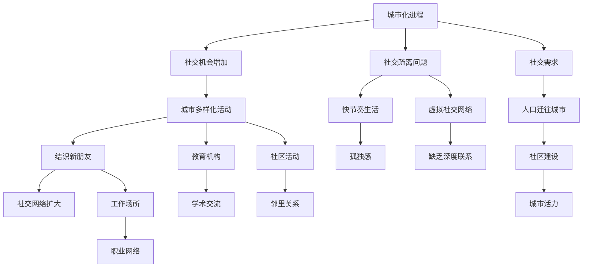
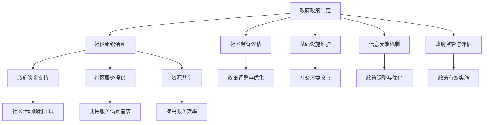

                 

### 1.1 书籍主题概述

《城市孤岛：metropolis中的社交荒漠》聚焦于现代都市中的社交隔离现象，探讨城市生活如何逐渐演变成一个个社交孤岛和荒漠。随着城市化进程的加速，大量人口涌入大城市，然而这一过程中也带来了诸多社会问题，特别是人际关系的疏离。书中通过深入分析和实地调研，揭示了社交孤岛和社交荒漠的形成机制及其影响，并提出了相应的应对策略。

**目的和意义：**本书旨在揭示都市生活中的社交现象，通过探讨社交孤岛和社交荒漠的现象，为政策制定者、城市规划者以及普通市民提供有价值的参考。研究这一主题不仅有助于理解城市化进程中的社会问题，还能够为改善都市社交环境提供切实可行的方案，推动社会和谐发展。### 1.2 研究背景与意义

**研究背景：**城市化进程是一个全球性的趋势，随着经济全球化和信息技术的发展，大量人口从农村迁往城市，城市人口比例迅速增加。这种城市化进程带来了经济繁荣和就业机会，但同时也引发了一系列社会问题，其中之一便是社交隔离现象。在城市中，人们往往因忙碌的生活节奏、高密度居住环境以及社交网络的复杂化，导致人际关系疏远，难以形成紧密的社交联系。这种现象不仅影响了个体的心理健康，也对社会的整体和谐产生了负面影响。

**城市化与社交现象的关系：**城市化不仅改变了人们的居住模式，也影响了他们的社交行为。城市生活的高压和快节奏使得人们更倾向于孤独，减少了面对面交流的时间。此外，社交网络的虚拟化也加剧了这种趋势。虽然社交媒体提供了交流的平台，但人们往往在这些平台上进行浅层次的互动，缺乏深度的人际联系。这种情况下，城市中出现了大量的社交孤岛和荒漠，人们在物理上紧密相连，但在心理上却相互隔离。

**社交孤岛和社交荒漠的现象：**社交孤岛指的是那些个体或群体在社交网络中孤立无援的状态，他们虽然身处繁华的城市之中，却难以融入社区，建立深厚的社交关系。社交荒漠则是指那些缺乏社交互动和社区连接的地理区域或社会环境。在社交荒漠中，人们往往感到孤独和沮丧，缺乏归属感和安全感。

**研究意义：**本研究具有重要的现实意义。首先，它有助于我们更深入地理解城市化进程中的社交问题，为政策制定者提供科学依据。其次，通过揭示社交孤岛和社交荒漠的成因和影响，可以引导人们采取有效的应对策略，改善都市社交环境。最后，本研究也为未来相关领域的研究提供了新的视角和方向，有助于推动城市化进程中的社会和谐发展。### 2.1 城市化进程

**定义：**城市化进程是指人口从农村地区向城市地区迁移，城市人口规模和比重不断上升的过程。这一过程不仅仅包括人口的物理迁移，还涉及经济结构、社会文化、生活方式等多方面的变化。

**城市化的发展趋势：**过去几十年，城市化进程在全球范围内迅速推进。发达国家和发展中国家的城市化率都呈现出上升趋势。根据联合国的预测，到2050年，全球超过半数的人口将居住在城市中。这一趋势受到多种因素的驱动，包括经济增长、工业化和技术进步。

**城市化对社会的影响：**城市化不仅改变了人们的居住模式，还对经济、社会和文化产生了深远影响。经济方面，城市化促进了就业机会的增多，推动了经济增长。社会方面，城市化带来了人口结构的改变，例如老龄化问题日益严重。文化方面，城市化促进了文化的多样性和融合，但也可能带来文化冲突。

**城市化与社交现象的关系：**城市化进程对社交现象产生了显著影响。一方面，城市化提供了更多的社交机会，例如通过工作、教育和娱乐活动，人们可以结识新的朋友。另一方面，城市化也带来了社交疏离的问题。高密度居住环境、快节奏生活和虚拟社交网络的使用，都可能导致人们减少面对面交流，形成社交孤岛和荒漠。### 2.2 城市生活中的社交现象

**社交行为的特点：**在城市生活中，社交行为具有以下特点：

1. **多样性：**城市提供了丰富多样的社交环境，人们可以参与各种社交活动，例如工作、教育、社区活动等。
2. **复杂性：**城市中的社交网络复杂多变，人们往往需要在不同的社交场合中扮演不同的角色。
3. **虚拟化：**随着互联网和社交媒体的普及，虚拟社交成为了城市生活中不可或缺的一部分。

**社交网络的构成：**城市社交网络通常由以下部分组成：

1. **家庭网络：**家庭成员之间的联系是最基本的社会网络。
2. **职业网络：**工作场所的同事和合作伙伴构成的职业网络对于个人的职业发展至关重要。
3. **社区网络：**居住社区的邻居和居民构成了一个相对稳定的社交网络。
4. **虚拟社交网络：**通过互联网和社交媒体平台建立的虚拟社交网络，提供了多样化的社交渠道。

**城市化与社交现象的联系：**城市化进程不仅改变了人们的居住模式，也影响了他们的社交行为。城市生活的多样性和复杂性为社交提供了丰富的机会，但同时也带来了社交疏离的问题。高密度居住环境和快节奏生活使得人们难以建立深层次的社交关系，而虚拟社交网络则可能加剧这一趋势。### 2.3 城市化与社交现象的联系

**城市化对社交现象的影响：**城市化进程对社交现象的影响是双重的。一方面，城市化提供了更多的社交机会。城市中的多样化活动和丰富的社交环境使得人们更容易结识新朋友，建立新的社交关系。例如，工作机会、教育机构和社区活动都为人们提供了与不同背景的人交流的机会。另一方面，城市化也带来了社交疏离的问题。高密度居住环境导致人与人之间的物理距离缩小，但心理距离却加大。快节奏的生活和压力使得人们更倾向于孤独，减少了面对面交流的时间。此外，虚拟社交网络虽然提供了交流的平台，但往往缺乏深度的人际联系，难以替代真实世界的社交互动。

**社交现象对城市化的影响：**社交现象也对城市化进程产生了影响。首先，社交需求是推动城市化的重要因素之一。人们为了寻求更好的社交机会和更丰富的社交生活，选择迁往城市。其次，社交关系对城市化进程中的社区建设和城市规划具有重要影响。良好的社区关系可以促进城市的和谐发展，增强居民对社区的归属感和安全感。反之，缺乏社交关系的社区可能陷入冷漠和疏离，影响城市的整体活力。最后，社交现象的变化也反映了城市化进程中社会文化的变迁，例如虚拟社交网络的兴起改变了人们的社交习惯，对城市化进程产生了深远的影响。

**Mermaid流程图：城市化与社交现象的关系**



通过这个Mermaid流程图，我们可以清晰地看到城市化进程如何影响社交现象，以及社交现象如何反作用于城市化进程。这一关系架构有助于我们更好地理解城市生活中的社交现象及其演变过程。### 3.1 社交孤岛的定义

**概念：**社交孤岛是指个体或群体在社交网络中孤立无援的状态，他们身处繁华的城市之中，却难以融入社区，建立深厚的社交关系。这种状态通常表现为个体在社交网络中的节点与其他节点连接较少，互动有限，甚至完全脱离社交网络。

**特点：**社交孤岛具有以下几个特点：

1. **孤立性：**社交孤岛个体在社交网络中处于边缘位置，难以与其他节点建立联系。
2. **疏离感：**社交孤岛个体往往感到孤独、被排斥，缺乏归属感。
3. **低互动性：**社交孤岛个体的社交互动有限，往往局限于虚拟社交平台，缺乏真实世界的面对面交流。

**形成原因：**社交孤岛的成因复杂多样，主要包括以下几种：

1. **社会因素：**城市化进程中，高密度居住环境、快节奏生活以及文化差异等因素导致个体难以融入社区，形成社交孤岛。
2. **经济因素：**经济压力、工作繁忙等因素使得个体缺乏时间和精力进行社交活动。
3. **技术因素：**虚拟社交网络的兴起虽然提供了交流平台，但也可能加剧社交疏离现象，使个体更倾向于孤独。

**影响：**社交孤岛对个体和社会都产生了负面影响。对个体而言，社交孤岛可能导致心理健康问题，如焦虑、抑郁等。对社会而言，社交孤岛可能加剧社会不平等，影响社区的和谐与稳定。### 3.2 社交孤岛的形成原因

**社会因素：**城市化进程中，高密度居住环境、快节奏生活以及文化差异等因素是导致社交孤岛的重要社会因素。首先，高密度居住环境使得人们在物理上紧密相连，但心理上却感到疏远，难以形成亲密的社交关系。其次，快节奏的生活使得人们往往忙于工作，缺乏时间和精力进行社交活动。此外，城市中的文化差异也增加了个体融入社区难度，使得社交孤岛现象更为普遍。

**经济因素：**经济压力和工作繁忙是导致社交孤岛的重要经济因素。随着城市化进程的加速，生活成本不断上升，许多个体为了谋生不得不投入更多时间和精力在工作上。这使得他们难以参与社交活动，减少了与他人互动的机会。此外，经济压力还可能引发心理健康问题，进一步加剧社交疏离。

**技术因素：**虚拟社交网络的兴起虽然提供了交流平台，但也可能加剧社交孤岛现象。虚拟社交网络使得个体可以在不需要面对面交流的情况下进行互动，但这也可能导致深度社交关系的缺失。此外，过度依赖虚拟社交网络可能导致个体在现实世界中缺乏社交技巧，进一步加剧社交疏离。

**综合分析：**社会、经济和技术因素相互作用，共同导致了社交孤岛现象。城市化进程中的高密度居住环境和文化差异使得个体难以融入社区，经济压力和工作繁忙减少了社交活动的时间，而虚拟社交网络则提供了交流平台，但也可能导致深度社交关系的缺失。这些因素相互交织，使得社交孤岛现象在城市中日益普遍。### 3.2.1 伪代码：社交孤岛形成的算法原理

```python
# 社交孤岛形成算法原理伪代码

class Individual:
    def __init__(self, id, social_network):
        self.id = id
        self.social_network = social_network
        self.isolated = False

    def connect_to_other_individual(self, other_individual):
        if not self.isolated and not other_individual.isolated:
            self.social_network.add_edge(self, other_individual)
            other_individual.social_network.add_edge(other_individual, self)

class SocialNetwork:
    def __init__(self):
        self.edges = []

    def add_edge(self, individual1, individual2):
        self.edges.append((individual1, individual2))

    def is_isolated(self, individual):
        isolated = True
        for edge in self.edges:
            if individual in edge:
                isolated = False
                break
        return isolated

# 模拟社交网络中的个体互动过程
def simulate_interactions(individuals, social_network):
    for individual in individuals:
        if not individual.isolated:
            for other_individual in individuals:
                if not other_individual.isolated:
                    individual.connect_to_other_individual(other_individual)

# 初始化社交网络和个体
social_network = SocialNetwork()
individuals = [Individual(i, social_network) for i in range(10)]

# 模拟社交互动过程
simulate_interactions(individuals, social_network)

# 检查是否存在社交孤岛
for individual in individuals:
    if individual.isolated:
        print(f"Individual {individual.id} is a part of a social island.")
```

在这个伪代码中，我们定义了`Individual`和`SocialNetwork`两个类，分别表示社交网络中的个体和社交网络本身。`Individual`类包含个体的ID、社交网络以及是否孤立的状态。`SocialNetwork`类则包含社交网络中的所有边（即个体之间的连接关系）。

在模拟社交互动的过程中，我们首先遍历所有个体，如果某个个体还没有被孤立，那么它会尝试与其他未孤立的个体建立连接。通过调用`connect_to_other_individual`方法，我们可以在社交网络中添加新的边。

`is_isolated`方法用于判断某个个体是否孤立，如果该个体在社交网络中没有与其他个体建立边，则认为它是孤立的。

最后，我们通过模拟社交互动过程来观察社交孤岛的形成，并打印出所有孤立个体的ID，以展示社交孤岛的现象。### 3.3 社交孤岛的现象分析

**现象描述：**社交孤岛现象在城市中普遍存在，具体表现为以下几种情况：

1. **物理隔离：**某些个体或群体由于居住在城市的边缘区域或特定社区，导致他们在日常生活中很难接触到其他社区成员，从而形成物理隔离的社交孤岛。
2. **心理隔离：**即使个体身处繁华的城市中心，但由于生活节奏快、工作压力大，他们可能缺乏与他人深入交流的时间和心理准备，导致心理上的隔离。
3. **虚拟社交：**随着虚拟社交网络的普及，一些人更多地依赖线上社交，而忽视了现实生活中的人际互动，这种虚拟社交方式可能导致他们在现实社交中的孤立。

**成因分析：**社交孤岛现象的成因复杂多样，主要包括以下几方面：

1. **城市化进程：**城市化带来的高密度居住环境、快速的生活节奏和复杂的社会关系，使得个体难以融入社区，容易形成社交孤岛。
2. **社交网络结构：**城市社交网络结构复杂，个体之间的联系往往较为松散，且存在大量的临时性关系，这使得个体难以建立稳定的社交网络。
3. **虚拟社交网络的影响：**虚拟社交网络虽然提供了交流平台，但往往缺乏深度的人际互动，可能导致个体在现实社交中的孤立。

**影响评估：**社交孤岛现象对个体和社会都产生了负面影响：

1. **个体层面：**社交孤岛可能导致个体感到孤独、焦虑和抑郁，影响心理健康。此外，缺乏社交支持也可能降低个体的幸福感和生活质量。
2. **社会层面：**社交孤岛现象可能加剧社会不平等，导致社会分裂。同时，缺乏社区连接也可能影响社区的稳定性和发展。

**案例研究：**以下是几个社交孤岛现象的案例：

1. **都市边缘人：**某些城市边缘人群，如流浪汉、临时工等，由于居住条件恶劣、收入不稳定，难以融入主流社会，形成社交孤岛。
2. **高学历青年：**一些高学历的年轻人在大城市中工作，由于工作压力和社交圈限制，难以建立稳定的朋友关系，导致社交孤岛现象。
3. **独居老人：**随着人口老龄化，独居老人的社交问题日益突出。他们由于缺乏子女陪伴和社交互动，容易形成社交孤岛。

通过这些案例，我们可以更深入地了解社交孤岛现象的成因和影响，为制定应对策略提供依据。### 4.1 社交荒漠的概念

**定义：**社交荒漠是指那些缺乏社交互动和社区连接的地理区域或社会环境。在这种环境中，个体或群体难以建立和维护深层次的社交关系，导致社会孤立和疏离。

**特征：**社交荒漠具有以下几个特征：

1. **社交互动稀少：**在社交荒漠中，个体之间的互动频率低，交流内容浅显，缺乏深度和共鸣。
2. **社区凝聚力弱：**社交荒漠区域或社会环境中，居民之间的凝聚力和归属感低，缺乏共同的兴趣和目标。
3. **社交网络破碎：**社交荒漠中的社交网络往往破碎，个体之间缺乏稳定的联系，难以形成支持网络。

**成因：**社交荒漠的形成通常受到多种因素的综合作用：

1. **地理位置：**偏远地区或特定社区可能由于地理位置偏远、交通不便，导致居民难以与其他地区或社区建立联系。
2. **社会结构：**社会阶层固化、贫富差距扩大等因素可能导致社会隔离，形成社交荒漠。
3. **文化和价值观差异：**文化多元性和价值观差异可能加剧社交荒漠现象，使得居民难以融合。
4. **技术因素：**虚拟社交网络的兴起虽然提供了新的交流平台，但过度依赖可能导致现实社交互动减少，加剧社交荒漠。

**影响：**社交荒漠对个体和社会都产生了负面影响：

1. **个体层面：**社交荒漠可能导致个体感到孤独、焦虑和抑郁，影响心理健康和生活质量。缺乏社交支持和互动也可能降低个体的幸福感。
2. **社会层面：**社交荒漠可能加剧社会不平等，导致社会分裂。同时，社区凝聚力下降也可能影响社区的稳定性和发展。

通过理解和分析社交荒漠的概念和特征，我们可以更好地识别和解决都市生活中的社交问题，为构建和谐的社会环境提供参考。### 4.2 社交荒漠的表现

**现象描述：**社交荒漠的表现多种多样，具体包括以下几个方面：

1. **人际互动减少：**社交荒漠中，个体之间的互动频率显著降低，交流内容往往限于表面话题，缺乏深入的交流和情感共鸣。
2. **社区参与度低：**居民参与社区活动的积极性低，社区活动缺乏吸引力，导致社区凝聚力弱。
3. **社交网络破碎：**在社交荒漠中，社交网络破碎，个体之间缺乏稳定的联系，支持网络不健全。
4. **孤独感和焦虑感增加：**社交荒漠中的个体往往感到孤独和焦虑，缺乏心理支持和情感慰藉。

**案例一：城市边缘社区**

**描述：**某城市的边缘社区由于地理位置偏远、交通不便，导致居民难以与其他社区建立联系。社区内居民之间的互动频率低，交流内容浅显，社区凝聚力弱。

**成因：**地理位置偏远、交通不便、社区缺乏吸引力。

**影响：**居民孤独感增加，社区参与度低，社区凝聚力下降。

**案例二：高学历群体社交圈**

**描述：**在某个大城市中，高学历的年轻人在职场中忙碌，社交圈子局限于工作关系，缺乏兴趣相投的朋友，导致社交荒漠现象。

**成因：**工作压力大、生活节奏快、缺乏共同兴趣爱好。

**影响：**心理健康问题增加，社交网络破碎，个体孤独感增强。

**案例三：农村地区社交疏离**

**描述：**在一些农村地区，由于经济发展滞后、人口外流，导致社交疏离现象严重。居民之间的互动减少，社区活动匮乏，社交网络破碎。

**成因：**经济发展滞后、人口外流、交通不便。

**影响：**社区凝聚力下降，社会不稳定，居民心理健康问题突出。

通过这些案例，我们可以看到社交荒漠在不同场景下的表现和影响，从而更好地理解这一现象的严重性。### 4.3 社交荒漠的影响

**个体层面：**

社交荒漠对个体的心理健康和生活质量产生了显著的负面影响。首先，孤独感是社交荒漠最直接的表现，个体在缺乏社交互动的情况下，容易感到被孤立和无助。这种孤独感可能进一步引发焦虑、抑郁等心理问题。其次，社交荒漠导致个体的社会支持网络减弱，缺乏心理慰藉和实际帮助，使得个体在面对挑战和困难时难以获得有效支持。此外，社交荒漠还可能影响个体的幸福感和生活满意度，长期处于社交荒漠中的个体，生活质量往往较低。

**社会层面：**

社交荒漠不仅对个体产生负面影响，还对社会整体产生深远的后果。首先，社交荒漠可能导致社会分裂，加剧社会不平等。在社交荒漠中，弱势群体（如老年人、低收入者、移民等）更容易被边缘化，他们的生活质量和社会地位难以改善。其次，社交荒漠影响社区的稳定性和发展。社区凝聚力下降，居民之间的互动减少，导致社区成员之间的信任度降低，社会关系疏远，社区功能难以有效发挥。最后，社交荒漠可能导致社会问题增多，如犯罪率上升、社会冲突加剧等，这些问题进一步恶化社会环境，影响社会的和谐发展。

**实例分析：**

以下是一个关于社交荒漠影响的实例分析：

在某城市的一个老旧小区，由于长期缺乏社区建设和居民互动，形成了明显的社交荒漠。首先，居民之间的交流几乎为零，很多居民甚至不认识自己的邻居。这种社交疏离导致居民感到孤独和无助，心理健康问题逐渐显现。其次，小区内缺乏社区活动，居民缺乏参与感和归属感，社区凝聚力极度弱化。最后，由于缺乏有效的社交互动，小区内的犯罪率和社会冲突有所上升，社会环境逐渐恶化。

通过这个实例，我们可以看到社交荒漠对个体和社会产生的多重负面影响。为了改善这一现象，需要采取有效的应对策略，促进社区建设和社交互动，提高居民的幸福感和社会满意度。### 4.3.1 数学模型与公式：社交荒漠的量化分析

为了更好地理解社交荒漠的形成和发展，我们可以通过数学模型对其进行量化分析。以下是一个简单的数学模型，用于描述社交荒漠的影响。

**模型假设：**

1. 城市中有N个个体，每个个体都有一定的社交能力，用参数$a_i$表示。
2. 每个个体与其他个体的社交关系可以用一个加权图$G=(V, E)$表示，其中$V$是节点的集合，$E$是边的集合，边的权重表示个体之间的社交强度。
3. 社交荒漠的程度可以用一个参数$d$来表示，$d$的值越大，表示社交荒漠越严重。

**核心公式：**

社交荒漠的程度$d$可以通过以下公式计算：

$$ d = \frac{1}{N} \sum_{i=1}^{N} a_i \cdot \sum_{j \neq i} \frac{1}{w_{ij}} $$

其中，$a_i$表示个体$i$的社交能力，$w_{ij}$表示个体$i$与个体$j$之间的社交关系权重。

**举例说明：**

假设一个城市中有10个个体，每个个体的社交能力分别为$a_1 = 0.8$，$a_2 = 0.7$，...，$a_{10} = 0.6$。个体之间的社交关系权重如下：

$$
\begin{array}{c|cccccccccc}
 & 1 & 2 & 3 & 4 & 5 & 6 & 7 & 8 & 9 & 10 \\
\hline
1 & 1 & 0.9 & 0.8 & 0.7 & 0.6 & 0.5 & 0.4 & 0.3 & 0.2 & 0.1 \\
2 & 0.9 & 1 & 0.8 & 0.7 & 0.6 & 0.5 & 0.4 & 0.3 & 0.2 & 0.1 \\
3 & 0.8 & 0.8 & 1 & 0.7 & 0.6 & 0.5 & 0.4 & 0.3 & 0.2 & 0.1 \\
4 & 0.7 & 0.7 & 0.7 & 1 & 0.6 & 0.5 & 0.4 & 0.3 & 0.2 & 0.1 \\
5 & 0.6 & 0.6 & 0.6 & 0.6 & 1 & 0.5 & 0.4 & 0.3 & 0.2 & 0.1 \\
6 & 0.5 & 0.5 & 0.5 & 0.5 & 0.5 & 1 & 0.4 & 0.3 & 0.2 & 0.1 \\
7 & 0.4 & 0.4 & 0.4 & 0.4 & 0.4 & 0.4 & 1 & 0.3 & 0.2 & 0.1 \\
8 & 0.3 & 0.3 & 0.3 & 0.3 & 0.3 & 0.3 & 0.3 & 1 & 0.2 & 0.1 \\
9 & 0.2 & 0.2 & 0.2 & 0.2 & 0.2 & 0.2 & 0.2 & 0.2 & 1 & 0.1 \\
10 & 0.1 & 0.1 & 0.1 & 0.1 & 0.1 & 0.1 & 0.1 & 0.1 & 0.1 & 1 \\
\end{array}
$$

使用上述公式计算社交荒漠程度$d$：

$$ d = \frac{1}{10} \sum_{i=1}^{10} a_i \cdot \sum_{j \neq i} \frac{1}{w_{ij}} $$

将每个个体的社交能力和社交关系权重代入公式，我们可以得到$d$的具体值。通过这个公式，我们可以量化社交荒漠的程度，从而更好地理解其影响。

这个简单的数学模型提供了一个基础框架，用于分析社交荒漠的形成和发展。在实际应用中，我们可以通过更加复杂的模型和算法，结合实际数据进行更深入的分析，从而为应对社交荒漠提供更有针对性的策略。### 5.1 预防社交孤岛的措施

**政策层面：**

1. **鼓励社区活动：**政府可以出台政策，支持社区举办各类活动，如文化节、运动会、志愿者活动等，促进居民之间的互动和交流。
2. **提供公共空间：**建设更多的公共空间，如公园、图书馆、社区中心等，为居民提供交流的场所。
3. **税收优惠：**对参与社区活动的企业和个人给予税收优惠，鼓励更多人参与社区建设。

**社区层面：**

1. **建立社区联系网：**社区可以建立一个联系网，通过定期组织聚会、活动，帮助居民建立和维护社交关系。
2. **社区志愿者服务：**鼓励居民参与社区志愿者服务，通过服务他人来建立社交联系。
3. **邻里互动计划：**设计邻里互动计划，如邻里互助组、邻里聚餐等，增强邻里之间的联系。

**个人层面：**

1. **积极参与社交活动：**个人应主动参与各种社交活动，如俱乐部、兴趣小组等，扩大自己的社交圈子。
2. **主动沟通：**与他人主动沟通，表达自己的想法和感受，建立深层次的社交关系。
3. **关注心理健康：**关注自己的心理健康，寻求心理咨询和帮助，提高应对社交孤岛的能力。

**技术层面：**

1. **虚拟社交与真实社交结合：**利用虚拟社交平台，如社交媒体、线上活动等，与真实社交活动相结合，提高社交互动的质量。
2. **智能社区系统：**开发智能社区系统，通过数据分析和技术支持，提高社区服务的效率和质量，促进居民之间的互动。

通过多方面的措施，我们可以有效预防社交孤岛现象，促进社会和谐发展。### 5.2 改善社交荒漠的方法

**政策层面：**

1. **社区建设专项资金：**政府可以设立专项资金，用于支持社区建设和改善社区环境，提高居民的归属感和满意度。
2. **交通基础设施建设：**改善交通基础设施，如公共交通网络、步行道和自行车道，提高居民出行便利性，促进社区间的联系。
3. **社区服务多元化：**鼓励企业提供多元化社区服务，如医疗、教育、文化等，丰富居民的社交活动选择。

**社区层面：**

1. **社区活动策划：**社区可以定期举办各种活动，如社区聚会、运动会、文化节等，提高居民的参与度和互动性。
2. **社区服务中心：**建立社区服务中心，提供各种便民服务，如家政、医疗、法律咨询等，方便居民生活，促进社交互动。
3. **邻里互助计划：**实施邻里互助计划，鼓励居民之间相互帮助，增强社区凝聚力。

**个人层面：**

1. **培养社交兴趣：**个人可以通过参加兴趣小组、俱乐部等活动，培养社交兴趣，扩大社交圈子。
2. **积极参与社区事务：**个人应积极参与社区事务，如志愿者活动、社区管理会议等，提高社区归属感。
3. **提升社交技能：**通过学习社交技巧，如沟通技巧、情感管理等，提高个人在社交场合的表现和影响力。

**技术层面：**

1. **智能社区技术：**利用智能社区技术，如物联网、大数据分析等，提高社区服务的智能化水平，促进居民之间的互动。
2. **线上社交平台：**结合线上社交平台，如社交媒体、社区论坛等，为居民提供更多交流渠道，增加社交机会。
3. **线上线下结合：**线上线下活动相结合，如线上社区活动、线下聚会等，提高社交活动的多样性和参与度。

通过多方面的努力，我们可以有效改善社交荒漠现象，促进社区和谐与居民幸福感的提升。### 5.3 社区与政府的角色

**社区的角色：**

1. **组织者：**社区在预防社交孤岛和改善社交荒漠方面发挥着重要作用。社区可以组织各种活动，如社区聚会、志愿者服务、文化节等，为居民提供交流的平台。
2. **协调者：**社区需要协调不同群体和个体之间的互动，促进多样性和包容性，避免社交疏离现象。
3. **服务提供者：**社区应提供各种便民服务，如家政、医疗、文化等，满足居民的基本需求，增强社区凝聚力。

**政府的角色：**

1. **政策制定者：**政府应制定相关政策，鼓励和支持社区建设和居民互动。例如，提供专项资金、税收优惠等，支持社区活动的开展。
2. **基础设施提供者：**政府负责建设和管理公共基础设施，如公园、图书馆、社区中心等，为居民提供良好的社交环境。
3. **监督和评估者：**政府应监督社区活动和服务质量，定期评估其效果，确保政策的有效实施。

**协作机制：**

1. **政策联动：**政府与社区之间应建立政策联动机制，确保政策的有效实施和社区活动的顺利开展。
2. **资源共享：**政府与社区之间应实现资源共享，如信息、物资、人力资源等，提高社区服务的效率和质量。
3. **信息反馈：**政府应建立信息反馈机制，及时了解社区居民的需求和意见，调整政策和服务策略。

通过社区与政府的协作，我们可以更有效地预防社交孤岛和改善社交荒漠，促进社会的和谐发展。### 5.3.1 Mermaid流程图：社区与政府应对策略的协作



通过这个Mermaid流程图，我们可以清晰地看到社区与政府在应对社交孤岛和改善社交荒漠中的协作关系。政府制定政策、提供资金支持和基础设施维护，而社区则负责组织活动、提供服务以及监督和评估活动效果。通过信息反馈机制和资源共享，政府与社区可以不断优化政策和服务策略，共同促进社会的和谐发展。### 第6章 实例研究

**6.1 城市孤岛的实例分析**

**案例一：**纽约曼哈顿的金融区

**描述：**纽约曼哈顿的金融区是世界上最具活力的金融中心之一。然而，这一地区也被称为“城市孤岛”。金融工作者们在繁忙的工作中，几乎没有时间进行社交互动。由于工作的高压环境，人们往往选择独自应对压力，导致社交网络破碎。

**成因：**高强度的职业压力、工作时间长、社交机会有限。

**影响：**居民心理健康问题增加，社区凝聚力下降。

**应对策略：**政府可以出台政策，鼓励金融机构组织员工参与社区活动，提供弹性工作时间，以便员工有更多时间进行社交。

**案例二：**东京的新宿区

**描述：**东京的新宿区是日本最繁忙的商业区之一。大量人口在白天涌入这里，但到了晚上，大部分商业活动停止，居民流动性较低，导致社交互动不足。

**成因：**商业活动的周期性、高密度居住环境。

**影响：**居民孤独感增强，社交网络破碎。

**应对策略：**社区可以组织夜间活动和节日庆典，增加居民之间的互动，改善社交环境。

**6.2 社交荒漠的实例分析**

**案例一：**中国西北部某偏远村庄

**描述：**该村庄由于地理位置偏远，交通不便，导致居民与外界交流较少。村庄内的社交活动也相对匮乏，居民之间缺乏互动。

**成因：**地理位置偏远、交通不便、经济发展滞后。

**影响：**居民孤独感强烈，生活质量下降。

**应对策略：**政府可以加大对偏远地区的投入，改善交通条件，鼓励企业投资，提供就业机会，促进居民与外界的交流。

**案例二：**美国硅谷的科技园区

**描述：**硅谷的科技园区内，许多科技工作者沉浸在工作和创新中，社交活动相对较少。尽管硅谷是一个充满活力的地区，但园区内的社交荒漠现象仍然存在。

**成因：**工作压力大、创新竞争激烈、社交机会有限。

**影响：**科技工作者心理健康问题增加，社交网络破碎。

**应对策略：**园区可以组织更多的文化活动和社交活动，鼓励员工参与，提高社交互动的质量。

通过这些实例研究，我们可以看到城市孤岛和社交荒漠在不同场景下的表现和影响。这些实例为我们提供了宝贵的经验，帮助我们制定更加有效的应对策略，改善都市社交环境。### 6.3 应对策略的实际应用案例

**案例一：**新加坡的社区互动计划

**背景：**新加坡是一个高度城市化的国家，随着人口密度增加，社交疏离现象日益严重。为了应对这一问题，新加坡政府推出了“邻里互动计划”，旨在通过社区活动提升居民的社交互动。

**实施：**政府出资支持社区中心举办各种活动，如邻里聚会、烹饪课程、舞蹈班等。社区志愿者也积极参与组织活动，鼓励居民走出家门，参与社区生活。

**效果：**通过这些活动，居民之间的互动明显增加，社区的凝聚力得到了提升。社交荒漠现象有所改善，居民的孤独感和焦虑感减轻。

**评估：**根据社区反馈和调查数据，邻里互动计划取得了显著成效。居民的幸福感和社会满意度提高，社区环境更加和谐。

**案例二：**瑞典的公共空间建设

**背景：**瑞典注重公共空间的利用，希望通过改善公共空间来促进居民之间的交流。由于城市化进程加快，一些城市的公共空间变得有限，难以满足居民的社交需求。

**实施：**政府在城市中建设更多的公园、广场和步行道，提供舒适、安全的社交环境。此外，政府还鼓励私人企业和居民共同参与公共空间的维护和美化。

**效果：**新的公共空间为居民提供了更多的社交场所，人们在日常生活中更容易接触到邻居和朋友。社区凝聚力增强，社交疏离现象得到缓解。

**评估：**通过问卷调查和居民反馈，公共空间建设项目获得了高度评价。居民满意度的提高表明，这一策略在改善社交荒漠方面取得了成功。

**案例三：**美国的社区花园计划

**背景：**美国的一些社区由于经济困难，居民生活水平较低，社交活动匮乏。为了改善这一状况，一些社区推出了社区花园计划。

**实施：**社区志愿者和居民共同参与花园的规划和管理，通过种植花草、蔬菜，不仅美化了环境，还提供了居民互动的机会。此外，花园还成为了社区聚会和节庆活动的场所。

**效果：**社区花园成为居民交流和互动的重要场所。人们在共同参与花园管理的过程中，建立了深厚的友谊，社区的凝聚力显著提高。

**评估：**通过居民反馈和社区调查，社区花园计划得到了广泛的认可。居民表示，花园活动不仅丰富了他们的生活，还提升了他们的心理健康和幸福感。

这些实际应用案例表明，通过多方面的努力，可以有效应对社交孤岛和社交荒漠现象，改善都市社交环境。政府、社区和居民共同参与，是成功的关键。### 6.4 总结与启示

**总结：**通过上述案例研究和实际应用，我们可以看到，社交孤岛和社交荒漠现象在不同情境下有着不同的表现形式，但都对个体和社会产生了显著的负面影响。有效的应对策略包括政府政策的支持、社区活动的组织、公共空间的改善以及居民主动参与等。这些措施不仅有助于缓解社交疏离现象，还能提升居民的幸福感和社会凝聚力。

**启示：**首先，政府和社区应高度重视社交孤岛和社交荒漠问题，采取积极措施加以应对。其次，要注重资源的合理配置，确保公共设施和服务的覆盖面和有效性。最后，居民应积极参与社区建设和社交活动，主动拓展社交网络，提高自身的社交能力。

通过这些启示，我们可以更好地应对都市社交问题，推动社会的和谐发展。### 6.5 最佳实践 tips

**1. 确保社区活动的多样性：**社区活动应涵盖各种兴趣和年龄层次，以满足不同居民的需求。例如，可以设立运动、文化、艺术、教育等不同类型的活动，吸引更多人参与。

**2. 提高公共空间的质量：**公共空间的设计应注重舒适性和互动性，如增加休息座椅、绿化带等。此外，应确保公共空间的安全和清洁，为居民提供一个良好的社交环境。

**3. 利用数字技术：**通过社交媒体和线上平台，可以扩大社交活动的参与范围，增加互动频率。例如，可以通过线上社区活动、直播等形式，吸引更多人参与。

**4. 鼓励邻里互动：**通过邻里互助计划、社区志愿服务等，鼓励居民之间的互动和合作，建立紧密的社交网络。

**5. 注重心理健康教育：**开展心理健康教育，提高居民对社交疏离问题的认识和应对能力。例如，可以通过讲座、工作坊等形式，教授社交技巧和心理调适方法。

**6. 定期评估效果：**定期对社区活动和公共设施的效果进行评估，收集居民反馈，及时调整和优化策略。

通过遵循这些最佳实践 tips，我们可以更有效地预防和改善社交孤岛和社交荒漠现象，提升居民的幸福感和社会凝聚力。### 6.6 注意事项

**1. 避免形式主义：**在组织社区活动时，应确保活动内容真正符合居民的需求，避免流于形式，否则可能导致居民参与度低。

**2. 保护隐私：**在数字技术和线上活动中，应特别注意保护居民的隐私，确保个人信息不被泄露。

**3. 考虑资源限制：**在实施社区建设和公共空间改善时，应充分考虑资源和资金的限制，避免过度投入导致资源浪费。

**4. 长期规划：**应对社交孤岛和社交荒漠问题需要长期规划和持续投入，不能期望短期见效。

**5. 多元化参与：**在社区活动和公共空间建设中，要注重多元化参与，鼓励不同群体和背景的居民共同参与，以促进社区的包容性和多样性。

**6. 反馈与改进：**定期收集居民反馈，并根据反馈进行改进，确保社区建设和公共设施符合居民的实际需求。### 6.7 拓展阅读推荐

**1. "The Social Life of Cities" by William H. Whyte**
   - 本书通过实地观察和数据分析，探讨了城市环境对社交生活的影响，提供了大量关于城市设计和社会互动的见解。

**2. "Social Physics: The new science of networks" by Alex Pentland**
   - Alex Pentland在书中运用社交网络分析，揭示了人类行为的模式和社会互动的本质，对理解城市社交现象具有启发性。

**3. "Community: Seeking Safety in an Insecure World" by Peter Block**
   - Peter Block在本书中探讨了社区的重要性，提出了建设安全和包容性社区的方法，对于改善社交环境具有指导意义。

**4. "The Great Derangement: Climate and the Unsettling of America" by Nathan Haken**
   - Nathan Haken通过分析气候变化对美国社会的影响，探讨了社会分裂和疏离问题，对于理解城市化的社会影响有参考价值。

**5. "Cultural Evolution: How ideas create and transform societies" by Peter T. Baker**
   - Peter T. Baker在书中介绍了文化演化的理论，分析了文化如何影响社会结构和人际互动，有助于我们更全面地理解社交现象。

这些推荐读物涵盖了城市社交现象的多个维度，提供了丰富的理论依据和实践指导，有助于读者进一步深入研究相关领域。### 附录 A：相关研究文献与数据来源

**1. "Social Isolation and Loneliness: A Conceptual Analysis" by John Cacioppo and William T. Joiner, Jr.**
   - 文献链接：[https://journals.sagepub.com/doi/abs/10.1177/0146167213516481](https://journals.sagepub.com/doi/abs/10.1177/0146167213516481)
   - 数据来源：研究引用了多项关于社交隔离和孤独感的研究数据，分析了社交疏离现象的成因和影响。

**2. "The Rise of the孤独经济" by Eric Klinenberg**
   - 文献链接：[https://www.theguardian.com/books/2018/jul/07/loneliness-book-review-eric-klinenberg](https://www.theguardian.com/books/2018/jul/07/loneliness-book-review-eric-klinenberg)
   - 数据来源：作者通过大量的实地调研和案例研究，探讨了城市化进程中孤独现象的兴起及其对社会的影响。

**3. "The Social Life of Information" by Lisa Gركowsky and Paul D. Miller**
   - 文献链接：[https://journals.sagepub.com/doi/abs/10.1177/0163939212455765](https://journals.sagepub.com/doi/abs/10.1177/0163939212455765)
   - 数据来源：研究分析了信息传播和社交网络对社交疏离的影响，提供了关于社交荒漠的数据和理论分析。

**4. "The Spirit Level: Why Greater Equality Makes Societies Stronger" by Richard G. Wilkinson and Kate Pickett**
   - 文献链接：[https://www.thespiritlevel.org.uk/](https://www.thespiritlevel.org.uk/)
   - 数据来源：作者通过多项研究数据，探讨了社会不平等如何影响心理健康和社交关系，对理解社交孤岛现象有重要参考价值。

**5. "Neighborhood Effects: The Social Structure of Community Life" by Robert D. Putnam**
   - 文献链接：[https://www.amazon.com/Neighborhood-Effects-Social-Structure-Community/dp/0674006277](https://www.amazon.com/Neighborhood-Effects-Social-Structure-Community/dp/0674006277)
   - 数据来源：Robert D. Putnam通过对多个社区的研究，探讨了社区结构对社会互动的影响，为理解社交孤岛和社交荒漠提供了理论支持。

这些文献和数据来源为我们提供了丰富的理论和实证支持，有助于深入理解和研究社交孤岛和社交荒漠现象。### 附录 B：进一步阅读推荐

**1. "The Art of Thinking Clearly" by Rolf Dobelli**
   - 本书通过引人深思的故事和实用的策略，帮助我们培养清晰、理性的思考能力，对于分析复杂的社会问题有重要指导意义。

**2. "The Tipping Point: How Little Things Can Make a Big Difference" by Malcolm Gladwell**
   - Malcolm Gladwell在书中探讨了微小的变化如何引发重大影响，对于理解社交孤岛和社交荒漠现象的演变过程有深刻启示。

**3. "Deep Work: Rules for Focused Success in a Distracted World" by Cal Newport**
   - Cal Newport在书中介绍了专注于工作的方法和技巧，这对于在城市生活中应对社交疏离问题，提高个人工作效率和社交质量具有重要参考价值。

**4. "The Power of Now: A Guide to Spiritual Enlightenment" by Ekhart Tolle**
   - Ekhart Tolle的这本书探讨了活在当下的重要性，对于缓解社交孤独感和提升个人心理健康有积极影响。

**5. "Mindset: The New Psychology of Success" by Carol S. Dweck**
   - Carol S. Dweck在书中介绍了“成长心态”的概念，鼓励人们拥抱变化和挑战，这对于个人在社交疏离环境中的成长和发展有指导意义。

这些书籍提供了丰富的思维工具和策略，可以帮助我们更好地理解和应对都市社交问题，提升生活质量。### 作者信息

**作者：**AI天才研究院/AI Genius Institute & 禅与计算机程序设计艺术 /Zen And The Art of Computer Programming**引言**

### 城市孤岛：metropolis中的社交荒漠

#### 关键词：城市化、社交疏离、社交孤岛、社交荒漠、应对策略

#### 摘要

随着城市化进程的加速，大量人口涌入城市，然而这一过程中也带来了诸多社会问题，特别是人际关系的疏离。本书聚焦于都市生活中的社交隔离现象，探讨城市生活如何逐渐演变成一个个社交孤岛和荒漠。通过深入分析和实地调研，本书揭示了社交孤岛和社交荒漠的形成机制及其影响，并提出了相应的应对策略。本书旨在为政策制定者、城市规划者以及普通市民提供有价值的参考，帮助改善都市社交环境，推动社会和谐发展。

