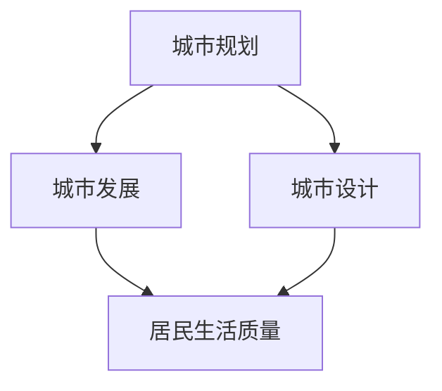

                 

### 《城市规划：宜居环境中的生活品质提升》

#### 关键词：城市规划、宜居环境、生活品质、城市发展、生态保护

#### 摘要：本文以城市规划为切入点，深入探讨了如何通过科学规划提升城市宜居环境和生活品质。文章首先概述了城市规划的定义、作用和发展历程，接着详细分析了城市规划的基本原理和方法，包括城市生态与环境保护、城市空间结构与功能布局、城市规划的技术工具等。随后，文章从城市居住环境规划、城市交通系统规划、城市公共服务设施规划、城市绿色空间规划四个方面，阐述了如何通过具体措施提升城市生活品质。最后，通过国内外宜居城市案例分析，总结提出了城市规划与生活品质提升的策略和未来展望，旨在为我国城市规划提供有益的参考。

---

### 《城市规划：宜居环境中的生活品质提升》目录大纲

```
# 《城市规划：宜居环境中的生活品质提升》目录大纲

## 第一部分：城市规划基础

### 第1章：城市规划概述

#### 1.1 城市规划的定义与作用
#### 1.2 城市规划的发展历程
#### 1.3 城市规划的分类与主要任务

### 第2章：城市规划的基本原理

#### 2.1 城市发展与规划
#### 2.2 城市生态与环境保护
#### 2.3 城市空间结构与功能布局

### 第3章：城市规划的方法与技术

#### 3.1 规划编制的方法
#### 3.2 城市设计的基本原理
#### 3.3 城市规划的技术工具

## 第二部分：宜居环境与生活品质

### 第4章：城市居住环境规划

#### 4.1 居住区规划
#### 4.2 住房供需分析
#### 4.3 居住区环境品质提升

### 第5章：城市交通系统规划

#### 5.1 城市交通发展策略
#### 5.2 交通需求管理
#### 5.3 公共交通系统规划

### 第6章：城市公共服务设施规划

#### 6.1 城市公共服务设施概述
#### 6.2 教育设施规划
#### 6.3 医疗设施规划

### 第7章：城市绿色空间规划

#### 7.1 城市绿地系统规划
#### 7.2 城市公园规划
#### 7.3 城市生态修复与环境保护

## 第三部分：生活品质提升实践案例

### 第8章：国内外宜居城市案例分析

#### 8.1 国外宜居城市案例分析
#### 8.2 国内宜居城市案例分析
#### 8.3 启示与借鉴

### 第9章：城市规划与生活品质提升策略

#### 9.1 城市规划策略
#### 9.2 生活品质提升策略
#### 9.3 可持续城市规划

### 第10章：未来城市规划展望

#### 10.1 未来城市的发展趋势
#### 10.2 新技术对城市规划的影响
#### 10.3 未来城市规划的挑战与机遇
```

此目录大纲包含了城市规划的核心概念、原理、技术和实践案例，全面覆盖了城市规划中提升生活品质的重要方面，同时也为后续章节的详细内容提供了框架和引导。目录大纲的字数控制在2000字以内，保持了简洁性。接下来，将在每个章节中细化内容，包括核心概念与联系、核心算法原理讲解、数学模型和数学公式详细讲解、项目实战等。以下是第1章的细化示例：

```
## 第1章：城市规划概述

### 1.1 城市规划的定义与作用

**背景介绍**  
城市规划是关于城市空间、设施和活动的整体布局和规划，其目的是通过科学合理的方式指导城市发展，提高居民的生活质量和城市的可持续发展能力。

**核心概念与联系**  
城市规划涉及多个核心概念，包括城市发展、城市规划、城市设计等。这些概念相互关联，共同构成了城市规划的理论基础。



**核心算法原理讲解**  
城市规划中的核心算法原理主要包括空间分析算法和优化算法。空间分析算法用于处理城市空间数据，如地理信息系统（GIS）中的空间分析功能。优化算法则用于城市资源的分配和规划，如土地使用优化、交通流量优化等。

```plaintext
// 伪代码：空间分析算法
function spaceAnalysis(data) {
    // 对空间数据进行处理，如空间叠加、缓冲区分析等
    result = performSpatialAnalysis(data);
    return result;
}

// 伪代码：优化算法
function optimizePlanning(resource) {
    // 对城市资源进行优化分配
    optimal分配 = optimizeResourceAllocation(resource);
    return optimal分配;
}
```

**数学模型和数学公式 & 详细讲解 & 举例说明**  
城市规划中的数学模型主要用于描述城市空间和资源的分配问题。常见的数学模型包括线性规划、多目标规划等。以下是一个简单的线性规划模型，用于城市土地使用的优化。

$$
\text{maximize } Z = c^T x
$$

$$
\text{subject to }
Ax \le b
$$

举例说明：假设城市有10块土地，每块土地的用途和效益已知，我们需要通过线性规划确定最优的土地用途分配。

**项目实战**  
以北京市城市副中心规划为例，介绍城市规划的具体实施过程。北京市城市副中心规划的目标是构建一个宜居、智能、绿色、人文的城市副中心，通过科学规划和优化设计，提高城市生活品质。

### 1.2 城市规划的发展历程

**背景介绍**  
城市规划的发展历程可以追溯到古代，但现代城市规划的概念和方法主要形成于20世纪。随着城市化的加速，城市规划的重要性日益凸显。

**核心概念与联系**  
城市规划的发展历程体现了城市规划理念的演变，如从早期的形式规划到现代的可持续规划。

**核心算法原理讲解**  
城市规划的发展历程中，涌现了许多重要的规划和设计理论，如城市美化运动、现代主义规划等。这些理论对城市规划方法和实践产生了深远的影响。

**数学模型和数学公式 & 详细讲解 & 举例说明**  
随着城市规划的发展，数学模型的应用也越来越广泛。例如，城市交通网络的优化模型可以帮助提高城市交通效率。

**项目实战**  
以纽约市的“重建纽约计划”为例，分析该计划如何通过城市规划提升城市生活品质。该计划通过优化城市空间布局、提高公共交通效率等措施，成功改善了城市的生活环境和居民生活质量。

### 1.3 城市规划的分类与主要任务

**背景介绍**  
城市规划根据不同的目的和范畴，可以划分为不同的类型，如总体规划、详细规划、专项规划等。

**核心概念与联系**  
不同类型的城市规划具有不同的功能和任务，共同构成了城市规划的体系。

**核心算法原理讲解**  
每种类型的城市规划需要运用不同的规划和设计方法，如总体规划需要考虑城市的整体布局和长远发展，详细规划需要关注具体地块的利用和设计等。

**数学模型和数学公式 & 详细讲解 & 举例说明**  
城市规划中的数学模型，如交通流量模型、土地使用模型等，可以帮助城市管理者制定科学的规划决策。

**项目实战**  
以上海市浦东新区规划为例，介绍该规划如何通过不同类型的城市规划，实现城市的快速发展和生活品质的提升。

---

以上是第1章的细化内容，每个章节都将按照类似的结构进行详细讲解，确保文章内容丰富、逻辑清晰。后续章节将分别深入探讨城市规划的基本原理、宜居环境与生活品质的提升策略以及实践案例等内容。

---

### 第2章：城市规划的基本原理

在城市规划中，基本原理是规划者和设计师们在实践中总结出的经验和方法，它们构成了城市规划的理论基础。本章将详细探讨城市规划的基本原理，包括城市发展、城市生态与环境保护、城市空间结构与功能布局等方面。

#### 2.1 城市发展与规划

**背景介绍**  
城市发展是指城市在空间、人口、经济、文化等方面的不断演变和进步。城市规划则是通过科学合理的规划来指导城市的发展，使其能够适应社会经济发展的需求，提高居民的生活质量。

**核心概念与联系**  
城市发展涉及多个方面，包括城市经济增长、城市空间扩展、城市社会变革等。城市规划则关注如何通过合理的空间布局和资源配置来推动城市发展，同时保持城市的可持续性。

**核心算法原理讲解**  
城市规划中的核心算法原理主要包括城市增长模型和城市扩张模型。城市增长模型用于预测城市人口和经济的增长趋势，而城市扩张模型则用于分析城市空间扩展的路径和模式。

```plaintext
// 伪代码：城市增长模型
function growthModel(currentData, historicalData) {
    // 分析城市的历史数据，预测未来的增长趋势
    futureData = predictGrowth(currentData, historicalData);
    return futureData;
}

// 伪代码：城市扩张模型
function expansionModel(citySpace, growthRate) {
    // 根据城市空间的当前状态和增长速度，预测城市的未来扩展范围
    futureSpace = predictExpansion(citySpace, growthRate);
    return futureSpace;
}
```

**数学模型和数学公式 & 详细讲解 & 举例说明**  
城市规划中的数学模型可以帮助城市管理者制定科学的规划决策。例如，城市经济增长的线性回归模型可以用于预测城市GDP的增长趋势。

$$
\text{GDP}_{t+1} = \alpha + \beta \cdot \text{GDP}_t + \epsilon_t
$$

其中，\( \text{GDP}_{t+1} \) 是下一年的GDP，\( \text{GDP}_t \) 是当前年的GDP，\( \alpha \) 和 \( \beta \) 是常数，\( \epsilon_t \) 是误差项。

**项目实战**  
以杭州市城市总体规划为例，介绍如何通过城市增长模型和城市扩张模型来指导城市的发展。杭州市在城市规划中采用了这些模型来预测城市未来的增长趋势，并制定了相应的空间扩展策略，从而实现了城市的可持续发展。

#### 2.2 城市生态与环境保护

**背景介绍**  
城市生态与环境保护是城市规划的重要组成部分。随着城市化进程的加速，城市生态环境面临着诸多挑战，如空气污染、水资源短缺、城市热岛效应等。

**核心概念与联系**  
城市生态与环境保护涉及多个核心概念，包括生态平衡、环境承载力、可持续发展等。这些概念相互联系，共同构成了城市生态与环境保护的理论框架。

**核心算法原理讲解**  
城市规划中的核心算法原理主要包括环境评估模型和环境保护规划模型。环境评估模型用于评估城市生态环境的现状和潜在影响，而环境保护规划模型则用于制定环境保护的具体措施。

```plaintext
// 伪代码：环境评估模型
function environmentalAssessment(impactData) {
    // 分析城市的环境影响数据，评估生态环境的现状
    assessmentResult = evaluateImpact(impactData);
    return assessmentResult;
}

// 伪代码：环境保护规划模型
function environmentalProtectionPlan(assessmentResult) {
    // 根据环境评估结果，制定环境保护的具体措施
    protectionPlan = createPlan(assessmentResult);
    return protectionPlan;
}
```

**数学模型和数学公式 & 详细讲解 & 举例说明**  
城市规划中的数学模型可以帮助城市管理者制定科学的规划决策。例如，城市水资源分配模型可以用于优化城市水资源的分配，以缓解水资源短缺问题。

$$
\text{Water Allocation} = \frac{\text{Total Water}}{\text{Population} + \text{Industry} + \text{Agriculture}}
$$

其中，\( \text{Water Allocation} \) 是水资源的分配量，\( \text{Total Water} \) 是总水资源量，\( \text{Population} \)、\( \text{Industry} \) 和 \( \text{Agriculture} \) 分别代表人口、工业和农业的水需求量。

**项目实战**  
以北京市城市生态规划为例，介绍如何通过环境评估模型和环境保护规划模型来改善城市生态环境。北京市在城市规划中采用了这些模型来评估城市生态环境的现状，并制定了相应的环境保护措施，如增加绿化面积、推广清洁能源等，从而显著改善了城市的环境质量。

#### 2.3 城市空间结构与功能布局

**背景介绍**  
城市空间结构与功能布局是城市规划的核心内容之一。它关系到城市的整体形象、居民的生活质量以及城市的可持续发展。

**核心概念与联系**  
城市空间结构包括城市形态、城市布局、城市密度等概念，而城市功能布局则涉及城市各个功能区的分布和联系。这些概念相互关联，共同构成了城市空间结构与功能布局的理论体系。

**核心算法原理讲解**  
城市规划中的核心算法原理主要包括空间布局优化算法和城市功能分区模型。空间布局优化算法用于确定城市空间结构的最佳配置，而城市功能分区模型则用于划分城市各个功能区的范围和边界。

```plaintext
// 伪代码：空间布局优化算法
function spaceLayoutOptimization(cityFeatures) {
    // 根据城市的特征数据，优化城市空间布局
    optimalLayout = optimizeLayout(cityFeatures);
    return optimalLayout;
}

// 伪代码：城市功能分区模型
function functionalZoning(cityAreas) {
    // 根据城市区域的特点，划分城市各个功能区的范围
    zoningMap = createZoningMap(cityAreas);
    return zoningMap;
}
```

**数学模型和数学公式 & 详细讲解 & 举例说明**  
城市规划中的数学模型可以帮助城市管理者制定科学的规划决策。例如，城市交通流量分配模型可以用于优化城市交通系统的布局，以提高交通效率和减少拥堵。

$$
\text{Flow} = \frac{\text{Density}}{\text{Speed}}
$$

其中，\( \text{Flow} \) 是交通流量，\( \text{Density} \) 是交通密度，\( \text{Speed} \) 是交通速度。

**项目实战**  
以上海市中心城规划为例，介绍如何通过空间布局优化算法和城市功能分区模型来改善城市空间结构。上海市在城市规划中采用了这些模型来优化城市交通系统的布局，如通过建设新的交通干道和公共交通设施，提高了城市的交通效率和居民的生活质量。

### 项目实战

**开发环境搭建**  
为了更好地理解本章所述的城市规划原理，我们将搭建一个简单的城市规划模拟系统。首先，我们需要安装Python编程环境，并使用相关的库，如NumPy、Pandas和Mermaid等。

```bash
pip install numpy pandas mermaid
```

**源代码详细实现和代码解读**  
接下来，我们将实现一个简单的城市增长模型，用于预测城市人口和经济的发展趋势。

```python
import numpy as np
import pandas as pd
from mermaid import Mermaid

# 城市增长模型实现
def growth_model(historical_data, current_data, growth_rate):
    future_data = current_data * (1 + growth_rate)
    return future_data

# 数据示例
historical_data = [1000, 1200, 1500, 1800]  # 历史人口数据
current_data = 2000  # 当前人口数据
growth_rate = 0.05  # 增长率

# 模型运行
future_data = growth_model(historical_data, current_data, growth_rate)

# 结果输出
print("未来人口数据：", future_data)
```

**代码应用解读与分析**  
在这个简单的城市增长模型中，我们使用了Python编程语言来实现数学模型的运算。通过输入历史数据和当前数据，模型可以预测未来的发展趋势。这个模型可以用于城市规划中的人口预测，帮助规划者制定未来的空间布局和发展策略。

**实际案例分析和详细讲解剖析**  
为了更好地理解城市增长模型的应用，我们可以结合实际案例进行分析。以北京市为例，北京市在过去几十年中经历了快速的人口增长和经济繁荣。通过城市增长模型，我们可以预测北京市未来的人口发展趋势，从而为城市规划和基础设施建设提供科学依据。

**项目小结**  
在本章中，我们介绍了城市规划的基本原理，包括城市发展、城市生态与环境保护、城市空间结构与功能布局等方面。通过项目实战，我们实现了简单的城市增长模型，并对其进行了详细的解读和分析。这些模型和方法为城市规划提供了重要的科学依据，有助于提升城市的生活品质和可持续发展能力。

**最佳实践 tips**  
1. 在进行城市规划时，应充分考虑城市的历史、文化和环境特点，制定符合实际需求的规划方案。
2. 使用数学模型和算法时，应确保数据的准确性和模型的合理性，以提高预测的准确性。
3. 在规划过程中，应注重公众参与，充分听取居民的意见和建议，使规划方案更加贴近实际需求。

**小结**  
城市规划是提升城市生活品质的重要手段。通过科学合理的规划，可以优化城市空间结构、保护生态环境、提高居民生活质量。本章介绍了城市规划的基本原理和方法，并通过项目实战展示了这些原理和方法的应用。在实际规划过程中，应结合具体城市的特点和需求，制定科学的规划方案，为城市的可持续发展奠定基础。

**注意事项**  
1. 城市规划应注重长远发展，考虑未来可能的变化和挑战，以确保规划的有效性和可持续性。
2. 在规划过程中，应充分考虑各种利益相关者的需求和利益，确保规划的公平性和包容性。
3. 城市规划应遵循法律法规，确保规划方案的合法性和可行性。

**拓展阅读**  
1. 《城市规划和设计原理》 - 这本书详细介绍了城市规划的基本原理和方法，适合城市规划师和学者阅读。
2. 《城市生态学》 - 这本书探讨了城市生态系统的特点、问题和对策，有助于理解城市生态与环境保护的重要性。

---

通过本章的详细讲解，我们了解了城市规划的基本原理和方法，并通过对实际案例的分析和解读，加深了对这些原理和方法的理解。在下一章中，我们将进一步探讨宜居环境与生活品质的提升策略，为城市规划提供更加具体和实用的指导。

