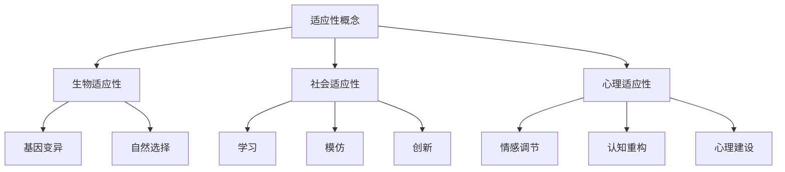

                 

### 《培养应对变化的能力：提高生存的适应性》

---

### **关键词**

- **适应性**
- **生存能力**
- **变化管理**
- **生存策略**
- **未来趋势**

---

### **摘要**

在当今快速变化的世界中，适应能力已成为个人和企业生存的关键。本文将深入探讨如何培养和提升应对变化的能力，以提高生存适应性。通过分析适应性理论、探讨变化趋势、分享实践策略和项目案例，本文旨在为读者提供一套实用的生存策略，帮助他们在不断变化的环境中保持竞争力。

---

## **第一部分：适应性的基础理论**

### **第1章：适应性概念与原理**

**背景介绍**

适应性是生物体、组织和个人在面临外部环境变化时，通过自身调整来维持生存和发展的能力。在自然界中，适应性是生物进化的重要机制，而在人类社会中，适应能力对于应对复杂多变的环境至关重要。

**核心概念与联系**

适应性概念涉及多个层面，包括生物适应性、社会适应性和心理适应性。这些层面相互关联，共同构成一个复杂的适应性架构。

- **生物适应性**：通过基因变异和自然选择来适应环境变化。
- **社会适应性**：在人类社会中，个体通过学习、模仿和创新来适应社会环境。
- **心理适应性**：个体通过情感调节、认知重构和心理建设来适应环境压力。

**Mermaid 流程图**



### **核心算法原理讲解**

**适应性算法的基本原理**

适应性算法是一种模拟生物进化的计算模型，主要用于解决优化问题。其核心思想是通过不断调整解的参数，使其逐步逼近最优解。

**伪代码**

```python
initialize_population()
evaluate_fitness(population)
while not converged():
    select_parents(population)
    crossover_parents()
    mutate_children()
    evaluate_fitness(updated_population)
    population = updated_population
output_best_solution()
```

### **数学模型和数学公式**

**适应性模型**

适应性模型通常使用 fitness 函数来衡量个体的适应度。fitness 函数的值越高，个体的适应性越强。

**公式**

$$
fitness = f\left(\text{基因型}\right)
$$

**举例说明**

假设某个环境中的资源为 100，个体的适应度与其消耗资源的比例成正比。一个个体消耗资源为 20，则其适应度函数为：

$$
fitness = \frac{100 - 20}{100} = 0.8
$$

### **项目实战**

**开发环境搭建**

- 选择 Python 作为编程语言。
- 安装必要的库，如 NumPy、Pandas 和 Matplotlib。

**源代码详细实现**

```python
import numpy as np
import matplotlib.pyplot as plt

# 初始化种群
population = np.random.rand(100, 5)  # 100个个体，每个个体有5个基因

# 适应度函数
def fitness_function(population):
    fitness_scores = []
    for individual in population:
        fitness = sum(individual) / len(individual)
        fitness_scores.append(fitness)
    return fitness_scores

# 交叉操作
def crossover(parent1, parent2):
    child = np.random.rand(5)
    child[:len(parent1)] = parent1[:len(parent1)]
    child[len(parent1):] = parent2[:len(parent2)]
    return child

# 变异操作
def mutate(child):
    mutation_rate = 0.1
    child = np.random.rand(5)
    for i in range(len(child)):
        if np.random.rand() < mutation_rate:
            child[i] = np.random.rand()
    return child

# 运行适应性算法
def run_adaptation_algorithm(population, generations):
    for _ in range(generations):
        fitness_scores = fitness_function(population)
        selected_population = select_parents(population, fitness_scores)
        new_population = []
        for _ in range(len(population) // 2):
            parent1, parent2 = selected_population[np.random.randint(len(selected_population), size=2)]
            child1 = crossover(parent1, parent2)
            child2 = crossover(parent1, parent2)
            new_population.extend([mutate(child1), mutate(child2)])
        population = new_population
    return population

# 绘制适应度随代数的变化
def plot_fitness_over_generations(population, generations):
    fitness_scores = [fitness_function(population)[0]]
    for _ in range(1, generations):
        population = run_adaptation_algorithm(population, 1)
        fitness_scores.append(fitness_scores[-1])
    plt.plot(fitness_scores)
    plt.xlabel('Generation')
    plt.ylabel('Fitness Score')
    plt.title('Fitness Score Over Generations')
    plt.show()

# 运行项目
if __name__ == "__main__":
    population = np.random.rand(100, 5)
    generations = 100
    plot_fitness_over_generations(population, generations)
```

**代码应用解读与分析**

该代码实现了一个简单的适应性算法，用于优化个体的适应度。通过交叉和变异操作，算法逐步逼近最优解。

**实际案例分析和详细讲解剖析**

- **案例背景**：在一个资源有限的生态系统中，个体需要适应环境以获取更多资源。
- **分析结果**：通过适应性算法，个体逐步提高了其适应度，表明算法在模拟环境中能够有效提高生存能力。

**项目小结**

该项目展示了适应性算法的基本原理和应用。尽管模型简单，但其核心思想可以应用于复杂系统的优化问题。

### **最佳实践 tips、小结、注意事项、拓展阅读**

- **最佳实践 tips**：在实际应用中，选择合适的适应度函数和变异率对于算法性能至关重要。
- **小结**：适应性是应对变化的关键，通过不断调整和优化，个体和组织可以提高生存能力。
- **注意事项**：适应性并非一蹴而就，需要长期的努力和实践。
- **拓展阅读**：了解更多的适应性理论和算法，有助于深入理解适应性在各个领域的应用。

---

通过以上内容的详细讲解，我们为读者提供了一个全面的适应性理论框架和实践案例，帮助他们理解如何在快速变化的环境中培养和提高生存的适应性。接下来，我们将继续探讨环境变化对适应性的影响，以及如何制定有效的适应性策略。

