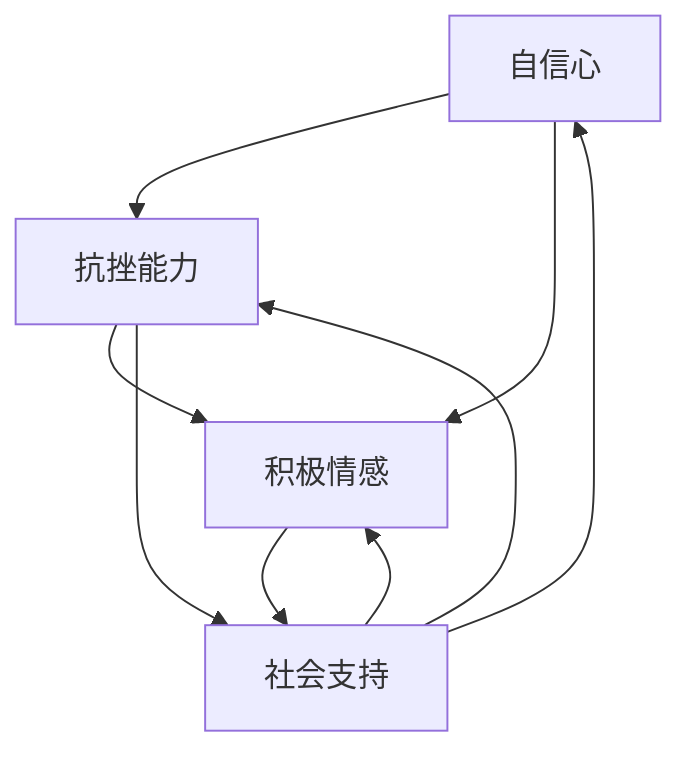

                 

### 文章标题

# 培养心理韧性：增强面对挫折的内在力量

### 关键词

- 心理韧性
- 挫折应对
- 自我提升
- 心理健康
- 策略与实践

### 摘要

在快节奏的现代生活中，面对挫折和压力已成为不可避免的现象。本文深入探讨了心理韧性的概念、重要性以及如何通过科学的方法和策略来培养和增强心理韧性。文章从基础理论出发，通过核心概念与联系、数学模型和公式、实践方法等多个角度，系统地阐述了提升心理韧性的方法，并提供了具体可行的建议和案例。希望本文能帮助读者更好地应对生活中的挑战，增强内在力量，追求更加积极健康的生活方式。

---

### 引言

在信息技术高速发展的时代，面对瞬息万变的环境和日益激烈的社会竞争，个人承受的压力越来越大。挫折、失败、不确定性和焦虑成为常见的心理挑战。面对这些挑战，如何保持积极的心态，增强心理韧性，成为每个人都需要思考和解决的问题。心理韧性，即“心理弹性”，是指个体在面对压力、挫折和逆境时，能够迅速适应、恢复并成长的能力。增强心理韧性不仅有助于提高生活质量，还能提高工作效率和团队协作能力。

本文旨在通过系统化的分析和详细的阐述，帮助读者了解心理韧性的基本概念、重要性和培养方法。我们将从理论到实践，结合实际案例，提供一套完整的心理韧性提升方案。希望通过本文的阅读，读者能够掌握提升心理韧性的科学方法，在日常生活中更好地应对各种挑战，提升自身的心理素质。

### 心理韧性的定义与重要性

心理韧性（Resilience）是个体在面对压力、困难和逆境时，能够保持心理平衡、迅速适应和恢复的能力。这一概念最早由心理学家Norman Garmezy在20世纪70年代提出，主要用于描述儿童在面对逆境时的适应能力。随着研究的深入，心理韧性被广泛应用于各个领域，如心理学、教育学、医学等。

心理韧性的基本概念可以从以下几个方面来理解：

1. **抗压能力**：心理韧性强的人能够有效地应对压力，不仅不会因为压力而崩溃，反而能够从中获得成长和进步。
2. **适应性**：面对变化和不确定性，心理韧性强的人能够迅速适应新环境和新要求，找到新的平衡点。
3. **恢复力**：遭受挫折或失败后，心理韧性强的人能够较快地从负面情绪中恢复过来，重新投入到生活和工作中。

心理韧性不仅是个人心理健康的基石，还具有以下几个重要作用：

1. **促进心理健康**：心理韧性有助于降低焦虑、抑郁等心理问题的发生，提升整体心理健康水平。
2. **提高生活质量**：具有高心理韧性的人在面对生活中的挑战时，能够保持积极的心态，从而提高生活质量。
3. **增强社会功能**：心理韧性有助于提升个体的社会适应能力，改善人际关系，增强社会功能。
4. **职业发展**：在职场中，心理韧性是关键的职业素养之一。具备高心理韧性的人能够在工作中更好地应对压力和挑战，提高工作效率和绩效。

总之，心理韧性是个体在逆境中展现出的宝贵品质，它不仅对心理健康有重要影响，还对个人的生活质量和职业发展起到积极作用。因此，了解和培养心理韧性对于每个人来说都具有重要意义。

### 心理韧性的核心概念与联系

为了更好地理解心理韧性，我们需要探讨其核心概念和它们之间的联系。心理韧性并不仅仅是单一的能力，而是由多个相互关联的要素构成的一个复杂系统。以下是几个关键概念及其相互关系：

1. **自信心**：自信心是心理韧性的重要组成部分。一个自信的人相信自己有能力应对挑战，即使面临失败也能从中吸取经验并继续前进。自信心可以通过积极的自我认知和成就感的积累来培养。
   
2. **抗挫能力**：抗挫能力是指个体在面对挫折和失败时的应对能力。具有高抗挫能力的人能够迅速从挫折中恢复过来，并将其视为成长的机会，而不是无法逾越的障碍。

3. **积极情感**：积极情感包括乐观、希望和快乐等，这些情感有助于提升个体的心理韧性。积极的情感状态能够增强个体的心理能量，使其在面对逆境时更加坚定和乐观。

4. **社会支持**：社会支持是心理韧性的重要外部因素。一个拥有强大社会支持系统的人，在遇到困难时能够获得家人、朋友或同事的鼓励和支持，从而增强心理韧性。

为了更直观地展示这些概念之间的联系，我们可以使用Mermaid流程图来描述心理韧性的核心要素及其相互关系：

这个流程图展示了自信心、抗挫能力、积极情感和社会支持之间的动态互动。自信心和抗挫能力是心理韧性的内在基础，而积极情感和社会支持则是外部助力。通过这个流程图，我们可以清晰地看到，心理韧性不是单一维度的能力，而是多个要素协同作用的结果。

### 心理韧性的数学模型与公式

在心理韧性的研究和应用中，数学模型和公式起到了重要的指导作用。这些模型和公式不仅可以帮助我们量化心理韧性，还能提供科学的评估方法和提升策略。以下将介绍几个关键的心理韧性数学模型和公式，并详细解释其应用和计算过程。

#### 1. 心理韧性评分公式

心理韧性评分公式是衡量个体心理韧性水平的常用方法。该公式将自信心、抗挫能力、积极情感和社会支持四个维度综合起来，计算出一个综合的心理韧性评分。

$$
\text{心理韧性评分} = \frac{C + A + P + S}{4}
$$

其中：
- \(C\) 代表自信心评分
- \(A\) 代表抗挫能力评分
- \(P\) 代表积极情感评分
- \(S\) 代表社会支持评分

每个维度评分可以通过标准化的问卷或量表进行评估。例如，自信心评分可以通过5点量表（1-非常低，5-非常高）来衡量，每个评分乘以其权重后相加，再除以4得到综合评分。

#### 2. 心理韧性提升公式

心理韧性提升公式用于计算通过特定干预措施提升心理韧性的预期效果。这个公式可以帮助研究者或咨询师制定个性化的提升策略。

$$
\text{预期提升效果} = \Delta C + \Delta A + \Delta P + \Delta S
$$

其中：
- \(\Delta C\) 代表自信心提升量
- \(\Delta A\) 代表抗挫能力提升量
- \(\Delta P\) 代表积极情感提升量
- \(\Delta S\) 代表社会支持提升量

提升量可以通过干预前后问卷评分的差异来计算。例如，如果干预措施显著提升了个体的自信心评分，那么\(\Delta C\) 将是一个正值，表示自信心的提升。

#### 3. 数学模型在心理韧性测量中的应用

数学模型在心理韧性的测量中具有重要作用。一个常见的应用是构建心理韧性的预测模型，该模型可以预测个体在面对特定逆境时的心理韧性水平。

假设我们有一个基于历史数据的心理韧性预测模型，其公式为：

$$
\text{心理韧性预测评分} = \omega_0 + \omega_1 \cdot C + \omega_2 \cdot A + \omega_3 \cdot P + \omega_4 \cdot S
$$

其中：
- \(\omega_0\) 是常数项
- \(\omega_1, \omega_2, \omega_3, \omega_4\) 分别是自信心、抗挫能力、积极情感和社会支持的权重系数

这个模型可以通过最小化预测误差来训练得到。具体步骤如下：
1. 收集大量个体心理韧性的数据，包括他们的自信心、抗挫能力、积极情感和社会支持评分。
2. 将这些数据输入到线性回归模型中，计算每个特征的权重系数。
3. 使用交叉验证方法评估模型的预测性能，并调整参数以优化预测效果。

通过这样的数学模型，我们可以更准确地预测个体在面对特定逆境时的心理韧性水平，从而为干预措施的制定提供科学依据。

### 实践中的心理韧性培养

心理韧性不仅是一个理论概念，更需要通过实际操作来培养和提升。以下是一些具体的实践方法和策略，帮助个体在面对挫折时保持积极心态，增强心理韧性。

#### 1. 视角转换

视角转换是一种有效的心理策略，通过改变对事件的看法和解释，来调整个体的情绪和应对方式。具体方法包括：

- **积极重构**：将挫折视为一个学习和成长的机会，而不是失败或打击。例如，当遇到项目失败时，可以思考：“这次失败让我发现了哪些问题和不足，下次我可以如何改进？”
- **情境比较**：将自己置于其他人的处境中，理解他们的感受和挑战。这有助于降低自我中心的负面情绪，增加对逆境的适应能力。

#### 2. 情绪调节

情绪调节是提升心理韧性的关键技巧，通过有效管理情绪，个体可以更好地应对压力和挫折。以下是一些情绪调节的方法：

- **认知重构**：改变负面思维模式，用更积极、客观的观点来替代。例如，将“我无法胜任这项任务”改为“我可以尝试不同的方法来解决这个问题”。
- **放松训练**：通过深呼吸、冥想、瑜伽等放松技巧，减轻紧张和焦虑情绪。研究表明，放松训练能够显著提升心理韧性，帮助个体更好地应对压力。

#### 3. 自我接纳

自我接纳是心理韧性的基础，意味着接受自己的优点和不足，而不进行无谓的自我批评。具体方法包括：

- **正向肯定**：每天对自己说一些正面肯定的话，如“我很努力”，“我有能力克服困难”等，增强自信心和积极情感。
- **感恩练习**：每天记录三件让自己感激的事情，这有助于提升积极情绪，增强心理韧性。

#### 4. 建立支持系统

社会支持是增强心理韧性的重要外部因素。建立和维护一个强大的支持系统，有助于个体在面临挑战时获得帮助和支持。以下是一些建立支持系统的策略：

- **建立亲密关系**：与家人、朋友和同事保持良好的关系，定期沟通和交流，获得情感上的支持和鼓励。
- **参与社区活动**：参与社区或兴趣小组的活动，结识志同道合的朋友，增强社会归属感和支持感。

通过这些实践方法，个体可以逐步提升自己的心理韧性，更好地应对生活中的各种挑战和压力。

### 心理韧性训练案例

为了更好地理解心理韧性的培养过程，我们来看一个具体的训练案例。这个案例将详细描述一个个体如何通过心理韧性训练，从面对挫折时感到无助和沮丧，逐渐提升到能够积极应对并从挫折中恢复和成长的过程。

#### 案例背景

张伟是一名软件工程师，工作压力大，经常面临项目延迟、技术难题等挑战。由于心理韧性不足，他经常在遇到问题时感到无助和沮丧，影响工作效率和生活质量。

#### 训练过程

1. **评估现状**：
   - 张伟首先通过心理韧性评估问卷，了解自己的心理韧性水平，评估结果显示他在自信心、抗挫能力、积极情感和社会支持等方面均有待提升。

2. **制定计划**：
   - 根据评估结果，张伟制定了个性化的心理韧性提升计划，包括定期进行视角转换、情绪调节、自我接纳和支持系统建设等练习。

3. **视角转换**：
   - 张伟开始用积极重构的方法，将每次项目失败视为学习和成长的机会。例如，在一次项目延误后，他反思了项目管理和团队合作中存在的问题，并制定了改进措施。

4. **情绪调节**：
   - 张伟通过深呼吸和冥想练习来缓解紧张和焦虑情绪。他每天早晨花15分钟进行深呼吸练习，晚上进行10分钟的冥想，这帮助他更好地管理情绪，保持积极心态。

5. **自我接纳**：
   - 张伟开始每天对自己进行正向肯定，例如在镜子前对自己说：“你很努力，你一定可以克服这些困难。”同时，他每天记录三件让自己感激的事情，这增加了他的积极情感。

6. **建立支持系统**：
   - 张伟积极与家人和朋友保持联系，定期交流，获得情感支持。他还加入了公司的一个技术兴趣小组，结识了许多志同道合的朋友，增强了社会支持感。

#### 训练结果

经过一段时间的训练，张伟的心理韧性显著提升。他在面对项目挑战时，不再感到无助和沮丧，而是能够积极应对，从失败中学习和成长。具体表现为：

- 自信心增强：他能够相信自己有能力解决技术难题，对项目成功充满信心。
- 抗挫能力提升：面对挫折时，他能够保持冷静，分析问题，并寻找解决方案。
- 积极情感增加：他每天都感到积极和快乐，对工作和生活充满热情。
- 社会支持增强：他建立了强大的支持系统，得到了家人、朋友和同事的鼓励和支持。

通过这个案例，我们可以看到，心理韧性并非一蹴而就，而是一个逐步培养和提升的过程。通过科学的方法和持续的实践，个体可以显著提升自己的心理韧性，更好地应对生活中的各种挑战。

### 面对挫折的心理策略

在面对挫折时，有效的心理策略能够帮助个体保持冷静、积极应对，从而减少负面情绪的影响。以下是一些常用的心理策略，包括应对挫折的常见策略、这些策略的效果评估以及如何评估策略的效果。

#### 1. 应对挫折的常见策略

- **情绪调节**：通过深呼吸、冥想、瑜伽等放松技巧来缓解紧张和焦虑情绪。情绪调节策略有助于个体保持心理平衡，避免情绪失控。
- **积极重构**：将挫折视为一个学习和成长的机会，而不是失败或打击。通过重新解释和看待挫折，个体可以从中找到积极的意义，提升应对能力。
- **认知重构**：改变负面思维模式，用更积极、客观的观点来替代。例如，将“我无法胜任这项任务”改为“我可以尝试不同的方法来解决这个问题”。
- **目标再设定**：在遇到挫折时，重新设定短期和长期目标，制定可行的计划和行动步骤。目标再设定有助于个体保持动力和方向，逐步克服困难。
- **寻求支持**：与家人、朋友或专业人士交流，获得情感上的支持和建议。寻求支持能够缓解个体的心理压力，增强应对能力。

#### 2. 策略的效果评估

为了评估这些策略的效果，可以采用以下方法：

- **自我评估问卷**：设计一套包含不同策略的评估问卷，让个体在遇到挫折时填写，评估其在使用这些策略时的感受和效果。
- **行为观察**：通过观察个体在面对挫折时的行为和反应，评估策略的实际效果。例如，记录个体在面对项目失败时的情绪变化和应对方式。
- **心理测评**：使用标准化的心理测评工具，如焦虑量表、抑郁量表等，评估个体在实施心理策略前后的心理状态变化。

#### 3. 如何评估策略的效果

- **短期效果评估**：在策略实施后的短期内，评估个体在情绪调节、自信心、抗挫能力等方面的提升情况。可以通过自我评估问卷和行为观察来实现。
- **长期效果评估**：在策略实施后的较长一段时间内，评估个体在心理韧性、生活质量、职业发展等方面的提升情况。长期效果评估需要更多的数据和观察时间。
- **量化指标**：使用量化指标来评估策略的效果，例如情绪调节前后焦虑程度的降低、挫折应对成功率的提高等。
- **反馈机制**：建立反馈机制，让个体在实施策略后提供反馈，了解其感受和建议。通过反馈，可以不断优化和调整策略，提高其效果。

通过科学的评估方法和持续的实践，个体可以更好地了解和提升自己的心理韧性，从而更有效地应对挫折和压力。

### 增强心理韧性的社会支持

社会支持是心理韧性培养的重要组成部分，能够在个体面临压力和挫折时提供情感和实际上的帮助，增强其心理恢复能力。以下将探讨社会支持对心理韧性的作用、社会支持的来源以及如何建立和维护支持网络。

#### 社会支持对心理韧性的作用

社会支持在增强心理韧性方面发挥着至关重要的作用，主要体现在以下几个方面：

1. **情感支持**：社会支持能够为个体提供情感上的安慰和鼓励，使其在面对挫折时感到不是独自一人。这种情感上的慰藉有助于减轻焦虑和抑郁情绪，提升心理韧性。

2. **信息支持**：社会支持系统能够提供有关应对策略和解决方案的信息，帮助个体更好地理解和应对挫折。例如，朋友或家人可能会分享他们面对类似挑战的经验和成功案例，为个体提供宝贵的启示。

3. **实际帮助**：社会支持不仅包括情感上的支持，还包括实际帮助，如物质援助、时间支持等。这种实际帮助能够缓解个体的压力，使其有更多时间和精力专注于恢复和成长。

4. **社会归属感**：社会支持系统能够增强个体的社会归属感，使其感到自己是被接纳和尊重的。这种社会归属感有助于提升自尊和自我价值感，从而增强心理韧性。

#### 社会支持的来源

社会支持可以来自多种渠道，包括家人、朋友、同事、社区以及专业机构等。以下是一些常见的社会支持来源：

1. **家庭支持**：家庭是提供社会支持的重要来源。家庭成员之间的亲密关系和相互支持能够为个体提供坚实的后盾，帮助其应对生活中的各种挑战。

2. **朋友支持**：朋友是另一个重要的支持来源。朋友之间的信任和互助能够为个体提供情感上的支持和实际帮助，帮助其度过难关。

3. **同事支持**：在工作中，同事的支持也非常重要。同事之间的团队合作和支持能够提升工作满意度，减轻工作压力，从而增强心理韧性。

4. **社区支持**：社区支持包括邻里之间的互助和社区组织的活动。社区支持系统能够为个体提供丰富的社交活动和情感交流机会，增强其社会归属感。

5. **专业机构支持**：包括心理咨询师、社工等专业人士的支持也是重要的社会支持来源。专业人士能够提供专业的心理评估和干预服务，帮助个体提升心理韧性。

#### 如何建立和维护支持网络

为了有效建立和维护支持网络，以下是一些建议：

1. **建立亲密关系**：与家人、朋友保持良好的关系，定期沟通和交流。通过亲密关系的建立和维护，可以为个体提供稳定的情感支持。

2. **加入社交团体**：参加兴趣小组或社区活动，结识志同道合的朋友。这些社交团体不仅能够提供情感支持，还能为个体提供实际帮助。

3. **寻求专业帮助**：在面临严重的心理困扰时，寻求专业的心理咨询师或社工的帮助。专业人士能够提供专业的评估和干预服务，帮助个体提升心理韧性。

4. **主动提供支持**：在他人需要帮助时，主动提供支持和援助。通过互助，可以增强彼此的支持网络，共同提升心理韧性。

5. **定期维护**：定期与支持网络中的成员沟通，了解彼此的生活和需求，保持关系的活力。通过定期的维护，支持网络可以更加稳固和有效。

通过有效的社会支持，个体可以增强心理韧性，更好地应对生活中的各种挑战。

### 心理韧性的评估方法

评估心理韧性是培养和提升心理韧性过程中的重要一环，它不仅可以帮助个体了解自身的心理韧性水平，还可以为制定个性化的提升策略提供科学依据。以下将介绍几种常用的心理韧性评估工具，包括自我评估问卷和第三方评估方法，并讨论评估结果的解读与应用。

#### 1. 自我评估问卷

自我评估问卷是评估心理韧性的一种常用方法，通过让个体自我评分来衡量其心理韧性水平。以下是一些常用的自我评估问卷：

- **心理弹性量表（CD-RISC）**：该量表包含25个问题，每个问题有5个评分选项（从1分到4分），总分越高表示心理韧性越强。该量表涵盖了自信心、应对策略、积极态度等方面。

- **韧性指数问卷（RS-14）**：该问卷包含14个问题，评估个体在应对压力时的韧性和适应性。每个问题有4个评分选项，总分越高表示心理韧性越强。

#### 2. 第三方评估方法

第三方评估方法通常由专业人士或机构进行，通过标准化的评估工具来评估个体的心理韧性。以下是一些常见的第三方评估方法：

- **心理测评**：使用标准化的心理测评工具，如焦虑量表、抑郁量表等，来评估个体在特定领域的心理韧性水平。这些量表通常由专业人士进行解释和评估。

- **行为观察**：通过观察个体在现实生活中的行为和反应，评估其心理韧性水平。例如，在模拟压力环境中观察个体的情绪调节能力、应对策略等。

#### 3. 评估结果的解读与应用

评估结果可以帮助个体了解自身的心理韧性水平，从而采取相应的措施进行提升。以下是如何解读和应用评估结果的一些建议：

- **了解当前水平**：通过评估结果，个体可以了解自己在心理韧性方面的优势和劣势。例如，如果评估结果显示自信心较低，个体可以针对这一方面进行有针对性的提升。

- **制定提升计划**：根据评估结果，个体可以制定个性化的提升计划。例如，如果评估结果显示情绪调节能力较弱，个体可以尝试通过冥想、深呼吸等技巧来提升情绪调节能力。

- **监测进步**：定期进行评估，监测心理韧性的提升情况。通过比较前后评估结果，个体可以了解自己的进步，并调整提升策略。

- **寻求专业帮助**：如果评估结果显示心理韧性水平较低，且个体难以通过自我提升解决，可以寻求专业人士的帮助。心理咨询师、心理治疗师等专业人士可以提供专业的指导和支持。

通过科学的评估方法和有效的应用，个体可以更好地了解自己的心理韧性水平，从而采取有效的措施进行提升，增强心理韧性。

### 心理韧性的持续提升

在快节奏的现代生活中，面对不断变化的环境和压力，持续提升心理韧性成为每个个体的重要任务。为了保持心理韧性的长期提升，以下是一些关键策略，帮助个体在面对新的挑战时做好准备，并逐步提高心理韧性。

#### 1. 制定长期心理韧性培养计划

制定一个长期的心理韧性培养计划，可以帮助个体有目标地提升心理韧性。以下是一些关键步骤：

- **设定目标**：明确自己在心理韧性方面想要达到的目标。例如，提升自信心、增强情绪调节能力等。
- **制定计划**：根据目标，制定具体的行动步骤和时间表。例如，每周进行一次冥想练习，每月参加一次心理韧性培训课程。
- **持续跟踪**：定期回顾和调整计划，确保其与个人目标和实际情况相符。

#### 2. 面对新挑战的心理准备

面对新的挑战时，心理准备至关重要。以下是一些策略，帮助个体在挑战到来之前做好准备：

- **情境模拟**：通过模拟可能出现的挑战情境，提前演练应对策略。例如，模拟项目失败的情景，练习如何从中恢复和吸取教训。
- **情绪预演**：在挑战来临之前，通过深呼吸、冥想等方式调节情绪，减少紧张和焦虑。
- **积极心理暗示**：给自己积极的暗示，如“我能够应对这个挑战”，“我有能力克服困难”。

#### 3. 适应新环境

在不断变化的环境中，适应新环境的能力是提升心理韧性的关键。以下是一些策略，帮助个体适应新环境：

- **主动学习**：对新环境中的新信息、新要求保持开放和好奇心，主动学习并适应。
- **建立新支持系统**：在新环境中结识新朋友，建立新的支持网络。这可以帮助个体在面临挑战时获得支持和鼓励。
- **调整期望**：根据新环境的要求和实际情况，调整自己的期望和目标。合理的期望有助于减少焦虑和挫折感。

#### 4. 持续改进策略

心理韧性不是一成不变的，而是一个持续发展和提升的过程。以下是一些持续改进的策略：

- **反馈机制**：定期进行自我评估，了解自己在心理韧性方面的进步和不足。通过反馈，可以及时调整和改进提升策略。
- **寻求专业指导**：在遇到困难时，寻求专业人士的指导和建议。心理咨询师、心理治疗师等专业人士可以提供专业的支持和指导。
- **持续学习**：通过阅读书籍、参加培训课程、交流经验等方式，不断学习和提升自己的心理韧性。

通过这些策略，个体可以持续提升心理韧性，更好地应对生活中的各种挑战，保持积极健康的心态。

### 附录：心理韧性培养的资源与工具

为了帮助读者更好地培养心理韧性，以下列举了一些实用的资源和工具，包括实用心理韧性提升应用、心理韧性研究文献推荐等，以供参考。

#### 1. 实用心理韧性提升应用

- **Headspace**：一款流行的冥想和放松应用，提供多种冥想课程，帮助用户缓解压力和焦虑。
- **Calm**：另一个优秀的冥想和放松应用，提供深呼吸、冥想和放松音乐等，有助于提升情绪调节能力。
- **forest**：一款有助于提高专注力的应用，通过种植虚拟植物来激励用户保持专注，减少分心。

#### 2. 心理韧性研究文献推荐

- **"Resilience: A Behavioral Science Perspective"**：由心理学家Stephen Joseph撰写的书籍，详细介绍了心理韧性的定义、测量和培养方法。
- **"Bouncing Back: Resilience in a Time of Change"**：作者Jean Phoenix探讨了在快速变化的环境中如何培养心理韧性，提供了实用的策略和建议。
- **"The Upside of Stress: Why Stress Is Good for You, and How to Get Good at It"**：由心理学家Kelly McGonigal撰写的书籍，阐述了压力和心理韧性之间的关系，并提供了实用的应对策略。

通过使用这些资源和工具，读者可以更系统地学习和实践心理韧性的培养方法，从而在日常生活中更好地应对各种挑战。

### 结论

心理韧性在现代社会中具有不可替代的重要性。本文系统地探讨了心理韧性的定义、重要性、核心概念、数学模型、培养方法和评估方法。通过详细分析和实际案例，我们了解了如何通过视角转换、情绪调节、自我接纳和社会支持等多种策略来增强心理韧性。希望读者能够从本文中汲取知识，并在日常生活中积极实践，提升自己的心理韧性，从而更好地应对生活中的挑战和压力。无论面对何种逆境，保持积极的心态和强大的心理韧性，都是走向成功和幸福的关键。

### 作者信息

作者：AI天才研究院/AI Genius Institute & 禅与计算机程序设计艺术 /Zen And The Art of Computer Programming

