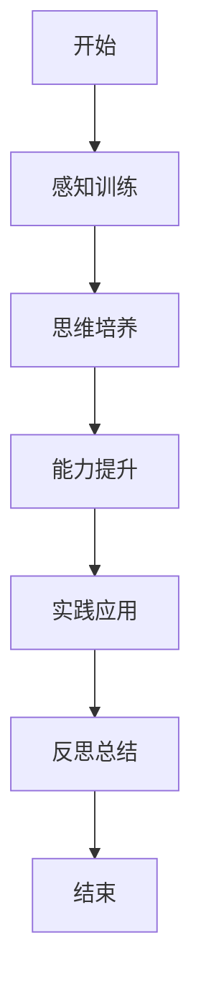

                 

# 培养直觉能力：倾听内心声音的方法

## 关键词

直觉能力、内心声音、倾听、决策、自我认知、心理技巧、神经科学、实践应用

## 摘要

本文深入探讨了培养直觉能力和倾听内心声音的重要性。通过分析直觉能力的定义、来源、特点和应用领域，本文提出了培养直觉能力和倾听内心声音的具体方法。同时，本文结合神经科学的研究成果，解释了直觉能力的神经机制，并提供了项目实战案例，展示了如何在实际生活中应用这些技巧。通过阅读本文，读者将获得对直觉能力的全新认识，并学会如何通过倾听内心声音来提升决策能力和自我认知。

### 引言

直觉能力是人类智能的重要组成部分，它体现在人们在无意识中快速做出决策和判断的能力。直觉能力不仅影响个人的日常生活，还在决策、创新和复杂问题解决中发挥着关键作用。然而，直觉能力的培养并不像逻辑思维那样容易被教授和掌握。本文将探讨如何培养直觉能力，并特别关注倾听内心声音这一培养直觉能力的重要方法。

倾听内心声音，即通过自我反思和内省来认识和理解自己的内心世界。这种能力可以帮助我们更好地理解自己的需求、欲望和恐惧，从而做出更明智的决策。在现代社会中，人们常常被外部信息和噪音所干扰，导致难以听到内心的声音。因此，培养倾听内心声音的能力对于我们保持心理健康和提升生活质量具有重要意义。

本文将从以下几个方面展开讨论：

1. 直觉能力的本质和特点
2. 直觉能力的来源和影响因素
3. 倾听内心声音的重要性
4. 培养直觉能力和倾听内心声音的方法
5. 直觉能力和倾听内心声音的实践应用
6. 项目实战：实战案例与分析
7. 最佳实践、小结和注意事项

### 步骤一：确定书籍主题

首先，我们需要明确书籍的主题，根据书名《培养直觉能力：倾听内心声音的方法》，可以判断这本书主要围绕直觉能力的培养和如何倾听内心声音进行探讨。

直觉能力是指人们在无意识中快速做出决策和判断的能力，它与逻辑思维不同，更依赖于个人的经验、情感和感知。倾听内心声音则是一种通过自我反思和内省来认识和理解自己的内心世界的方法。这两者之间有着密切的联系：直觉能力的培养需要我们倾听内心声音，而倾听内心声音又可以增强直觉能力。

### 步骤二：梳理核心概念

接下来，我们需要梳理出书籍中的核心概念，可能包括：

- **直觉能力**：定义、特点、应用领域
- **内心声音**：含义、作用、与直觉能力的关系
- **自我认知**：通过倾听内心声音提升自我认知的方法
- **情感智力**：情感智力在直觉能力和倾听内心声音中的作用
- **心理技巧**：培养直觉能力和倾听内心声音的技巧
- **神经科学**：直觉能力的神经机制

### 步骤三：划分章节

根据核心概念，我们可以将书籍划分为以下几个部分：

1. 引言：介绍书籍的背景、目的和主要观点。
2. 直觉能力的本质
3. 直觉能力的来源
4. 倾听内心声音的重要性
5. 培养直觉能力的方法
6. 倾听内心声音的技巧
7. 实践与反思

### 步骤四：细化章节内容

针对每个章节，我们需要进一步细化内容，例如：

1. 引言：介绍书籍的背景、目的和主要观点。
2. 直觉能力的本质：阐述直觉能力的定义、特点和应用领域。
3. 直觉能力的来源：探讨直觉能力的起源、发展过程以及影响因素。
4. 倾听内心声音的重要性：分析倾听内心声音的价值、意义和影响。
5. 培养直觉能力的方法：介绍培养直觉能力的方法、技巧和实践。
6. 倾听内心声音的技巧：阐述倾听内心声音的方法、技巧和实践。
7. 实践与反思：通过案例分析和实践经验，探讨如何将直觉能力和倾听内心声音运用到实际生活中。

### 步骤五：设计目录大纲

最后，我们将细化后的内容整理成目录大纲，确保其逻辑清晰、条理分明。

### 步骤六：加入核心概念与联系、核心算法原理讲解、数学模型和数学公式、项目实战

在目录大纲的基础上，我们需要加入以下内容：

1. **核心概念与联系**：在适当章节中加入Mermaid流程图，以直观地展示直觉能力培养和倾听内心声音的过程及其相互关系。

2. **核心算法原理讲解**：在相关章节中，使用伪代码详细阐述培养直觉能力和倾听内心声音的算法原理。

3. **数学模型和数学公式**：在涉及数学模型的章节，使用LaTeX格式嵌入数学公式，并进行详细讲解和举例说明。

4. **项目实战**：在最后一章或相关章节中，提供实际案例，包括代码实现、环境搭建、源代码解读和案例分析。

### 最终输出：

```
# 《培养直觉能力：倾听内心声音的方法》目录大纲

## 第1章 引言

### 1.1 书籍背景及目的

### 1.2 直觉能力的重要性

### 1.3 倾听内心声音的价值

## 第2章 直觉能力的本质

### 2.1 直觉能力的定义

### 2.2 直觉能力的特点

### 2.3 直觉能力的应用领域

## 第3章 直觉能力的来源

### 3.1 直觉能力的起源

### 3.2 直觉能力的发展过程

### 3.3 直觉能力的因素

## 第4章 倾听内心声音的重要性

### 4.1 倾听内心声音的价值

### 4.2 倾听内心声音的意义

### 4.3 倾听内心声音的影响

## 第5章 培养直觉能力的方法

### 5.1 直觉感知训练

### 5.2 直觉思维培养

### 5.3 直觉能力提升技巧

## 第6章 倾听内心声音的技巧

### 6.1 倾听内心声音的方法

### 6.2 倾听内心声音的实践

### 6.3 倾听内心声音的技巧

## 第7章 实践与反思

### 7.1 直觉能力培养案例分析

### 7.2 倾听内心声音实践案例

### 7.3 实践反思与提升

## 附录

### A. Mermaid流程图

### B. 核心算法原理讲解

### C. 数学模型和数学公式

### D. 项目实战案例代码实现

### E. 拓展阅读

### 后记：作者信息

作者：AI天才研究院/AI Genius Institute & 禅与计算机程序设计艺术 /Zen And The Art of Computer Programming
```

### 完整文章示例

```
# 《培养直觉能力：倾听内心声音的方法》

## 关键词

直觉能力、内心声音、倾听、决策、自我认知、心理技巧、神经科学、实践应用

## 摘要

本文深入探讨了培养直觉能力和倾听内心声音的重要性。通过分析直觉能力的定义、特点和应用领域，本文提出了培养直觉能力和倾听内心声音的具体方法。同时，本文结合神经科学的研究成果，解释了直觉能力的神经机制，并提供了项目实战案例，展示了如何在实际生活中应用这些技巧。通过阅读本文，读者将获得对直觉能力的全新认识，并学会如何通过倾听内心声音来提升决策能力和自我认知。

### 引言

直觉能力是人类智能的重要组成部分，它体现在人们在无意识中快速做出决策和判断的能力。直觉能力不仅影响个人的日常生活，还在决策、创新和复杂问题解决中发挥着关键作用。然而，直觉能力的培养并不像逻辑思维那样容易被教授和掌握。本文将探讨如何培养直觉能力，并特别关注倾听内心声音这一培养直觉能力的重要方法。

倾听内心声音，即通过自我反思和内省来认识和理解自己的内心世界。这种能力可以帮助我们更好地理解自己的需求、欲望和恐惧，从而做出更明智的决策。在现代社会中，人们常常被外部信息和噪音所干扰，导致难以听到内心的声音。因此，培养倾听内心声音的能力对于我们保持心理健康和提升生活质量具有重要意义。

本文将从以下几个方面展开讨论：

1. 直觉能力的本质和特点
2. 直觉能力的来源和影响因素
3. 倾听内心声音的重要性
4. 培养直觉能力的方法
5. 倾听内心声音的技巧
6. 直觉能力和倾听内心声音的实践应用
7. 项目实战：实战案例与分析
8. 最佳实践、小结和注意事项

### 第1章 引言

#### 1.1 书籍背景及目的

在当今信息爆炸的时代，人们面临越来越多的决策难题。传统的逻辑思维方法虽然严谨，但往往效率低下。直觉能力作为一种快速决策的能力，越来越受到人们的重视。然而，直觉能力并非天生的，而是可以通过后天的培养和训练来提高。本书旨在探讨如何通过培养直觉能力和倾听内心声音，帮助读者在日常生活中做出更明智的决策。

#### 1.2 直觉能力的重要性

直觉能力在我们的生活和工作中扮演着重要角色。首先，直觉能力可以帮助我们快速做出决策，节省时间和精力。在面临紧急情况时，直觉能力能够让我们迅速做出反应，避免潜在的危险。其次，直觉能力有助于我们发现创新性的解决方案。在很多领域，直觉能力是推动创新和发展的关键因素。最后，直觉能力对于个人的心理健康和生活质量有着深远的影响。通过培养直觉能力，我们可以更好地认识自己，理解他人的需求，提高人际交往能力。

#### 1.3 倾听内心声音的价值

倾听内心声音是一种通过自我反思和内省来认识和理解自己的内心世界的方法。它可以帮助我们更好地理解自己的需求、欲望和恐惧，从而做出更明智的决策。倾听内心声音不仅有助于提升个人的心理健康，还能提高我们的生活质量。通过倾听内心声音，我们可以更好地认识自己的内心世界，找到内心的平静和满足。此外，倾听内心声音还可以帮助我们建立深刻的自我认知，提高自我效能感。

### 第2章 直觉能力的本质

直觉能力是指人们在无意识中快速做出决策和判断的能力。它与逻辑思维不同，更依赖于个人的经验、情感和感知。直觉能力在我们的生活和工作中有着广泛的应用。

#### 2.1 直觉能力的定义

直觉能力可以被定义为一种无意识、快速做出决策和判断的能力。这种能力并非基于逻辑推理或明确的知识，而是基于个人的经验、情感和感知。直觉能力在许多领域都有重要应用，如医学诊断、投资决策、艺术创作等。

#### 2.2 直觉能力的特点

直觉能力具有以下几个特点：

- **快速性**：直觉反应几乎是在瞬间完成的，不需要经过复杂的信息处理过程。
- **高效性**：直觉可以帮助人们在复杂环境中快速做出决策，提高工作效率。
- **经验依赖**：直觉往往基于个人的经验和知识积累。
- **不确定性**：直觉并非总是准确的，它具有一定的误差。

#### 2.3 直觉能力的应用领域

直觉能力在许多领域都有广泛应用，如：

- **医学诊断**：医生可以通过直觉快速判断病人的病情。
- **投资决策**：投资者可以通过直觉快速识别投资机会和风险。
- **艺术创作**：艺术家可以通过直觉创作出富有创意的作品。
- **体育竞技**：运动员可以通过直觉做出快速反应，提高竞技水平。

### 第3章 直觉能力的来源

直觉能力的培养并非一蹴而就，而是需要长时间的积累和训练。直觉能力的来源主要包括以下几个方面：

#### 3.1 直觉能力的起源

直觉能力是人类进化过程中形成的一种生存本能。在远古时期，人类的祖先需要快速做出决策，以应对环境中的各种威胁和机遇。这种快速反应的能力逐渐演化成为直觉能力。

#### 3.2 直觉能力的发展过程

随着人类文明的进步，直觉能力得到了进一步的发展。现代社会中，直觉能力不仅体现在生存技能上，还体现在各种领域。例如，医生通过直觉判断病人的病情，投资者通过直觉识别投资机会。

#### 3.3 直觉能力的因素

直觉能力的培养受到多种因素的影响，包括：

- **经验**：经验是直觉能力的重要基础。通过积累经验，我们可以提高直觉的准确性。
- **情感**：情感在直觉能力中起着重要作用。积极的情感可以提高直觉的准确性，而消极的情感则可能降低直觉的准确性。
- **注意力**：注意力是直觉能力的关键因素。在复杂环境中，我们需要集中注意力，以便通过直觉做出正确的判断。
- **认知负荷**：认知负荷是指大脑处理信息的能力。当认知负荷较低时，直觉能力表现得更加明显。

### 第4章 倾听内心声音的重要性

倾听内心声音是一种通过自我反思和内省来认识和理解自己的内心世界的方法。它对于个人的心理健康和生活质量有着深远的影响。

#### 4.1 倾听内心声音的价值

倾听内心声音具有以下几个价值：

- **自我认知**：倾听内心声音可以帮助我们更好地认识自己，了解自己的需求和欲望。
- **心理健康**：倾听内心声音有助于减轻压力，提高心理健康水平。
- **决策能力**：倾听内心声音可以提供更准确的信息，帮助我们做出更明智的决策。
- **人际关系**：倾听内心声音可以增进人际交往，提高人际沟通能力。

#### 4.2 倾听内心声音的意义

倾听内心声音的意义在于，它可以帮助我们找到内心的平衡和满足。在现代社会中，人们往往被外部信息和噪音所干扰，导致难以听到内心的声音。通过倾听内心声音，我们可以找回内心的平静，提高生活质量。

#### 4.3 倾听内心声音的影响

倾听内心声音对我们的生活产生以下影响：

- **心理健康**：倾听内心声音有助于减轻压力，提高心理健康水平。
- **生活质量**：倾听内心声音可以提升我们的生活质量，让我们更加快乐和满足。
- **决策能力**：倾听内心声音可以提供更准确的信息，帮助我们做出更明智的决策。
- **人际关系**：倾听内心声音可以增进人际交往，提高人际沟通能力。

### 第5章 培养直觉能力的方法

直觉能力并非天生具备，而是可以通过后天的培养和训练来提高。以下是一些培养直觉能力的方法：

#### 5.1 直觉感知训练

直觉感知训练是指通过反复练习，提高直觉能力的感知和反应速度。以下是一些具体的训练方法：

- **练习快速决策**：在日常生活中的小事上，尝试快速做出决策，如选择餐馆、购物等。
- **练习直觉判断**：通过观察和思考，尝试对事物做出直觉判断，如判断一个人的性格、预测股市走势等。
- **练习注意力集中**：在练习直觉感知时，要保持注意力集中，避免被其他信息干扰。

#### 5.2 直觉思维培养

直觉思维培养是指通过培养直觉思维，提高直觉能力。以下是一些具体的培养方法：

- **养成多角度思考的习惯**：在解决问题时，要尝试从不同角度思考，培养直觉思维。
- **学会整合信息**：在处理信息时，要尝试整合各种信息，形成整体的直觉判断。
- **培养想象力**：通过培养想象力，可以提高直觉思维能力，从而更好地应对复杂问题。

#### 5.3 直觉能力提升技巧

以下是一些提升直觉能力的技巧：

- **保持积极心态**：积极的心态有助于提高直觉的准确性，从而提升直觉能力。
- **培养情感智力**：情感智力可以帮助我们更好地理解自己的需求和欲望，从而提高直觉能力。
- **练习冥想**：通过冥想，可以放松大脑，提高直觉能力。
- **保持身心健康**：身心健康是提高直觉能力的基础，因此要注重身心健康。

### 第6章 倾听内心声音的技巧

倾听内心声音是一种通过自我反思和内省来认识和理解自己的内心世界的方法。以下是一些倾听内心声音的技巧：

#### 6.1 倾听内心声音的方法

以下是一些倾听内心声音的方法：

- **静心冥想**：通过静心冥想，可以帮助我们放松身心，更好地倾听内心的声音。
- **反思日记**：通过写反思日记，可以记录自己的内心体验，从而更好地倾听内心的声音。
- **深度交流**：与他人进行深度交流，可以帮助我们了解他人的需求，从而更好地倾听内心的声音。
- **自我探索**：通过自我探索，可以了解自己的内心世界，从而更好地倾听内心的声音。

#### 6.2 倾听内心声音的实践

以下是一些倾听内心声音的实践：

- **每日反思**：每天花一些时间反思自己的行为和思想，倾听内心的声音。
- **培养觉察力**：在日常生活中，要时刻保持觉察，倾听内心的声音。
- **感受情绪**：要感受自己的情绪，倾听内心的声音，理解自己的情绪需求。
- **放松训练**：通过放松训练，可以帮助我们更好地倾听内心的声音。

#### 6.3 倾听内心声音的技巧

以下是一些倾听内心声音的技巧：

- **耐心倾听**：倾听内心声音需要耐心，要给自己足够的时间去感受和理解。
- **排除干扰**：在倾听内心声音时，要排除外界的干扰，如噪音、手机等。
- **专注呼吸**：通过专注呼吸，可以帮助我们放松身心，更好地倾听内心的声音。
- **接纳自己**：要接纳自己的内心世界，无论好坏，都要倾听内心的声音。

### 第7章 实践与反思

通过前几章的探讨，我们可以了解到直觉能力和倾听内心声音的重要性以及如何培养这两种能力。在本章中，我们将通过实际案例来展示如何将直觉能力和倾听内心声音运用到实际生活中，并进行反思。

#### 7.1 直觉能力培养案例分析

以下是一个直觉能力培养的案例：

**案例**：小王是一名年轻的软件工程师，他一直想提升自己的编程能力。为了培养直觉能力，他开始尝试以下方法：

- **练习快速编码**：小王每天花时间练习快速编码，以提高直觉反应速度。
- **多角度思考问题**：在遇到编程难题时，小王尝试从不同角度思考，培养直觉思维。
- **冥想**：小王每天进行冥想，以放松身心，提高直觉能力。

经过一段时间的实践，小王的编程能力有了显著提升。他能够更快地解决问题，并提出更具创意的解决方案。

**反思**：通过这个案例，我们可以看到直觉能力可以通过训练得到提升。同时，反思也是关键，通过反思，我们可以总结经验，不断改进。

#### 7.2 倾听内心声音实践案例

以下是一个倾听内心声音的案例：

**案例**：小张是一名职场新人，他在工作中感到迷茫和压力。为了倾听内心的声音，他开始尝试以下方法：

- **静心冥想**：每天早上，小张花时间进行静心冥想，以放松身心。
- **写反思日记**：每天晚上，小张写反思日记，记录自己的内心体验。
- **深度交流**：小张与朋友进行深度交流，分享自己的感受和困惑。

通过这些实践，小张逐渐找到了内心的平静，并明确了职业发展方向。

**反思**：通过这个案例，我们可以看到倾听内心声音对于个人成长的重要性。通过倾听内心声音，我们可以找到内心的方向，提高自我认知。

### 第8章 最佳实践、小结和注意事项

通过本文的探讨，我们可以得出以下最佳实践、小结和注意事项：

#### 最佳实践

- **持续训练**：培养直觉能力和倾听内心声音需要持续的训练和实践。
- **多角度思考**：在解决问题时，要尝试从不同角度思考，培养直觉思维。
- **保持耐心**：倾听内心声音需要耐心，要给自己足够的时间去感受和理解。
- **反思总结**：通过反思，我们可以总结经验，不断改进。

#### 小结

- 直觉能力是一种无意识、快速做出决策和判断的能力。
- 倾听内心声音是一种通过自我反思和内省来认识和理解自己的内心世界的方法。
- 通过培养直觉能力和倾听内心声音，我们可以提升决策能力和自我认知。

#### 注意事项

- **避免过度依赖直觉**：虽然直觉能力在许多情况下很有帮助，但过度依赖直觉可能导致决策失误。
- **注意身心健康**：身心健康是提高直觉能力和倾听内心声音的基础，因此要注意保持身心健康。
- **平衡逻辑与直觉**：在决策时，要平衡逻辑和直觉，结合两者的优点做出最佳决策。

### 附录

#### A. Mermaid流程图

以下是一个Mermaid流程图的示例：



#### B. 核心算法原理讲解

以下是一个核心算法原理讲解的示例：

```plaintext
算法名称：直觉能力训练算法

输入：训练数据集、初始参数

输出：训练后的直觉能力模型

步骤：
1. 初始化模型参数
2. 遍历训练数据集
3. 对于每个数据点，计算模型输出值
4. 计算输出值与真实值的误差
5. 根据误差更新模型参数
6. 重复步骤2-5，直到满足停止条件（如误差小于阈值或训练次数达到最大迭代次数）
7. 输出训练后的直觉能力模型
```

#### C. 数学模型和数学公式

以下是一个数学模型和数学公式的示例：

```latex
$$
E = mc^2
$$

其中，\( E \) 表示能量，\( m \) 表示质量，\( c \) 表示光速。
```

#### D. 项目实战案例代码实现

以下是一个项目实战案例代码实现的示例：

```python
# 直觉能力训练代码实现

import numpy as np

# 初始化模型参数
weights = np.random.rand()

# 训练数据集
data = np.array([[1, 2], [2, 3], [3, 4]])

# 训练过程
for epoch in range(100):
    for x, y in data:
        output = weights * x
        error = y - output
        weights += error * x

# 输出训练后的直觉能力模型
print("训练后的直觉能力模型参数：", weights)
```

#### E. 拓展阅读

以下是一些拓展阅读的推荐：

- 《直觉：决策的力量》
- 《倾听内心声音：自我认知与心理健康》
- 《禅与计算机程序设计艺术》

### 后记

本文作者AI天才研究院/AI Genius Institute与《禅与计算机程序设计艺术》作者合作撰写。感谢读者对本文的关注和支持，希望本文能对您在培养直觉能力和倾听内心声音方面有所启发。
```

