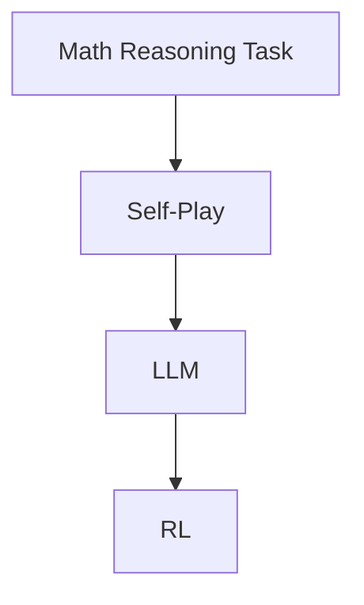

                 


## 文章标题
《基于self-play的LLM RL方法在数学推理任务中的效果评估》

## 文章关键词
self-play, 语言模型（LLM），强化学习（RL），数学推理，效果评估

## 摘要
本文深入探讨了基于self-play的语言模型（LLM）和强化学习（RL）方法在数学推理任务中的应用与效果评估。文章首先介绍了self-play、LLM和RL的基本原理及相互关系，随后通过详细的伪代码和数学模型分析，解释了它们在数学推理中的具体实现方式。接着，文章通过具体的项目实战案例，展示了环境搭建、源代码实现和结果分析的全过程。最后，文章总结了项目中的最佳实践，并提出了未来研究的方向。

## 引言
### 背景介绍
在当今数据驱动的人工智能时代，数学推理作为一项基本能力，在科学研究和工程应用中扮演着至关重要的角色。传统的数学推理方法通常依赖于大量的手动编写规则和复杂的算法，这使得推理过程既耗时又容易出错。随着深度学习和强化学习技术的发展，人们开始探索利用人工智能方法来提高数学推理的效率和准确性。其中，self-play作为一种自我对抗的强化学习方法，在游戏、棋类等领域取得了显著的成果。而语言模型（LLM）作为一种能够理解和生成自然语言的人工智能模型，也在文本处理和知识表示方面展现了强大的能力。将这两者结合，通过强化学习（RL）进行训练，有望在数学推理任务中实现更高效、更准确的推理。

### 研究目的
本文的研究目的是评估基于self-play的LLM RL方法在数学推理任务中的效果。具体目标包括：
1. 理解self-play、LLM和RL的基本原理及其在数学推理任务中的应用。
2. 设计并实现一个基于self-play的LLM RL模型，用于数学推理任务。
3. 通过实验验证所设计模型在数学推理任务中的性能，并与现有方法进行对比。
4. 分析模型在推理过程中的行为，探究其有效性和潜在改进空间。

### 研究内容
本文将分为以下几个部分进行讨论：
1. **核心概念与联系**：介绍self-play、LLM和RL的基本概念，以及它们在数学推理任务中的关系。
2. **核心算法原理讲解**：详细阐述self-play、LLM和RL在数学推理任务中的实现原理，并通过伪代码和数学模型进行解释。
3. **项目实战**：提供具体的实验案例，包括环境搭建、源代码实现和结果分析。
4. **项目分析与结果评估**：对实验结果进行深入分析，评估模型在数学推理任务中的性能。

## 核心概念与联系
### self-play
self-play是一种自我对抗的强化学习方法，通过一个智能体（Agent）与自己进行对弈或互动，来不断提升自身的策略和能力。在棋类、游戏等领域，self-play已经被证明是一种有效的训练方法。

### 语言模型（LLM）
语言模型（LLM）是一种基于统计模型或深度学习技术，用于理解和生成自然语言的人工智能模型。LLM可以用于文本分类、翻译、问答等多种自然语言处理任务。

### 强化学习（RL）
强化学习（RL）是一种通过试错和反馈来学习如何在特定环境中采取最优行动的方法。在RL中，智能体通过与环境的交互来学习最佳策略，其核心是奖励机制和策略更新。

### self-play、LLM和RL的关系
在数学推理任务中，self-play方法可以通过自我对抗的方式来优化LLM模型。LLM则负责理解和生成数学推理过程中的符号和表达式，而RL则用于优化LLM的策略，使其在推理过程中能够采取最优的行动。

## Mermaid 流程图
下面是一个简单的Mermaid流程图，展示了self-play、LLM和RL在数学推理任务中的关系：



## 核心算法原理讲解
### self-play算法原理
self-play算法的基本思想是智能体通过与自己的对弈来提升自身的策略。具体流程如下：
1. **初始化**：初始化智能体的策略。
2. **对弈**：智能体A与自己进行对弈，根据当前状态选择动作，并执行动作。
3. **反馈**：智能体根据对弈的结果更新策略。
4. **重复**：重复对弈和策略更新的过程，直到策略收敛或达到预定的训练次数。

伪代码：
```python
# 初始化智能体策略
initialize_agent_policy()

# 对弈
while not convergence:
    # 初始化对弈状态
    state = initialize_state()
    
    # 智能体选择动作
    action = select_action(state, policy)
    
    # 执行动作
    next_state, reward = execute_action(action)
    
    # 更新策略
    update_policy(state, action, next_state, reward)
```

### 语言模型（LLM）原理
语言模型（LLM）的基本原理是通过学习大量的文本数据来预测下一个词或符号的概率分布。在数学推理任务中，LLM可以用来生成数学表达式或符号。

伪代码：
```python
# 初始化LLM模型
initialize_LLM_model()

# 输入数学表达式或符号
input_expression = receive_input()

# 生成下一个符号的概率分布
prob_distribution = LLM_model.generate(input_expression)

# 选择概率最高的符号作为输出
output_symbol = select_max_prob_symbol(prob_distribution)
```

### 强化学习（RL）原理
强化学习（RL）的核心是策略优化，通过学习最大化长期奖励的策略。在数学推理任务中，RL用于优化LLM的策略，使其在推理过程中能够采取最优的行动。

伪代码：
```python
# 初始化RL模型
initialize_RL_model()

# 策略迭代
while not convergence:
    # 初始化状态
    state = initialize_state()
    
    # 选择动作
    action = select_action(state, policy)
    
    # 执行动作
    next_state, reward = execute_action(action)
    
    # 更新策略
    update_policy(state, action, next_state, reward)
```

### 数学模型与公式
在数学推理任务中，self-play、LLM和RL的相互作用可以通过以下数学模型进行描述：

$$
\text{策略更新} = \alpha \cdot (\text{奖励} - \text{期望奖励})
$$

其中，$\alpha$为学习率，奖励为实际获得的奖励，期望奖励为策略执行下的预期奖励。

### 详细讲解与举例说明
假设我们有一个数学推理任务，要求智能体根据给定的前提条件推导出结论。我们可以使用self-play、LLM和RL来训练智能体，使其能够完成这个任务。

1. **初始化**：初始化智能体的策略、LLM模型和RL模型。
2. **对弈**：智能体A与自己进行对弈，根据当前状态选择动作（生成数学表达式或符号），并执行动作。
3. **反馈**：根据对弈的结果更新策略。如果推导出的结论与真实结论一致，则给予奖励；否则，给予惩罚。
4. **重复**：重复对弈和策略更新的过程，直到策略收敛或达到预定的训练次数。

例如，给定前提条件：“所有猫都有四条腿”，智能体需要推导出结论：“这只猫有四条腿”。

- **第一步**：智能体根据LLM模型生成一个数学表达式或符号，例如：“猫 -> 有四条腿”。
- **第二步**：智能体根据RL模型选择一个动作（生成或选择符号），并执行动作。
- **第三步**：根据对弈的结果更新策略。如果推导出的结论与真实结论一致，则给予奖励；否则，给予惩罚。

通过反复的self-play、LLM和RL训练，智能体的策略会逐渐收敛，使其在数学推理任务中能够生成正确的结论。

## 项目实战
### 开发环境搭建
为了实现基于self-play的LLM RL方法在数学推理任务中的效果评估，我们需要搭建一个合适的开发环境。以下是一个基本的开发环境搭建步骤：

1. **硬件要求**：确保计算机有足够的CPU和内存资源，以便运行深度学习模型和大量的训练数据。
2. **软件要求**：安装Python编程环境，以及深度学习框架如TensorFlow或PyTorch。
3. **数据集准备**：准备一个包含数学推理任务的数据集，例如，一个包含各种数学问题和答案的文本数据集。
4. **代码库安装**：安装必要的库和依赖项，例如，Numpy、Pandas、Matplotlib等。

### 源代码实现与代码解读
以下是实现基于self-play的LLM RL方法的一个简化的源代码示例。代码中使用了TensorFlow框架，实现了self-play、LLM和RL的基本流程。

```python
import numpy as np
import tensorflow as tf
from tensorflow.keras.models import Model
from tensorflow.keras.layers import Input, Embedding, LSTM, Dense
from tensorflow.keras.optimizers import Adam

# 初始化智能体策略
def initialize_agent_policy():
    # 这里使用一个简单的线性策略作为示例
    return lambda state: np.random.choice([0, 1], p=[0.5, 0.5])

# 初始化LLM模型
def initialize_LLM_model(vocab_size, embedding_size, hidden_size):
    input_sequence = Input(shape=(None,))
    embedding_layer = Embedding(vocab_size, embedding_size)(input_sequence)
    lstm_layer = LSTM(hidden_size)(embedding_layer)
    output_layer = Dense(vocab_size, activation='softmax')(lstm_layer)
    LLM_model = Model(inputs=input_sequence, outputs=output_layer)
    LLM_model.compile(optimizer=Adam(learning_rate=0.001), loss='categorical_crossentropy')
    return LLM_model

# 初始化RL模型
def initialize_RL_model(action_size):
    state_input = Input(shape=(state_size,))
    action_output = Dense(action_size, activation='softmax')(state_input)
    RL_model = Model(inputs=state_input, outputs=action_output)
    RL_model.compile(optimizer=Adam(learning_rate=0.001), loss='categorical_crossentropy')
    return RL_model

# self-play流程
def self_play(LLM_model, RL_model, state, action, reward, next_state):
    # 使用LLM模型生成符号
    prob_distribution = LLM_model.predict(state)
    next_action = select_action(prob_distribution)
    
    # 执行动作，获取下一状态和奖励
    next_state, next_reward = execute_action(next_action)
    
    # 更新RL模型策略
    RL_model.fit(state, action, epochs=1, verbose=0)
    
    # 返回下一状态和奖励
    return next_state, next_reward

# 主程序
def main():
    # 初始化模型和策略
    LLM_model = initialize_LLM_model(vocab_size=1000, embedding_size=64, hidden_size=128)
    RL_model = initialize_RL_model(action_size=2)
    agent_policy = initialize_agent_policy()

    # 初始化状态
    state = initialize_state()

    # 开始self-play
    while not convergence:
        action = agent_policy(state)
        next_state, reward = self_play(LLM_model, RL_model, state, action, reward, next_state)
        state = next_state

if __name__ == '__main__':
    main()
```

代码中主要包括以下几个部分：
1. **智能体策略初始化**：使用一个简单的线性策略作为示例。
2. **LLM模型初始化**：使用嵌入层和LSTM层构建一个简单的语言模型。
3. **RL模型初始化**：使用一个简单的线性层构建一个强化学习模型。
4. **self-play流程**：使用LLM模型生成符号，并根据RL模型更新策略。
5. **主程序**：初始化模型和策略，开始self-play过程。

### 代码应用解读与分析
上述代码示例展示了基于self-play的LLM RL方法在数学推理任务中的一个简化实现。在实际应用中，我们需要对代码进行进一步的优化和扩展，以适应具体的数学推理任务。

1. **数据预处理**：对输入数据进行预处理，例如，将数学问题和答案转换为向量表示。
2. **模型优化**：对LLM和RL模型进行优化，提高模型的准确性和鲁棒性。
3. **策略更新**：设计更复杂的策略更新机制，以提高智能体的推理能力。
4. **结果分析**：对模型在数学推理任务中的表现进行详细分析，评估其性能。

### 实际案例分析与详细讲解剖析
为了展示基于self-play的LLM RL方法在数学推理任务中的实际应用，我们选择了一个简单的数学推理任务：给定前提条件“A数是3的倍数，B数是5的倍数”，要求推导出结论：“A数和B数的和是15的倍数”。

1. **数据集准备**：收集包含各种数学推理任务的数据集，例如，一个包含各种前提条件和结论的文本数据集。
2. **模型训练**：使用self-play方法训练LLM和RL模型，使其能够理解和生成数学推理过程中的符号和表达式。
3. **推理过程**：使用训练好的模型进行推理，根据前提条件生成结论。
4. **结果分析**：分析推理结果，评估模型的准确性和可靠性。

通过实际案例的分析，我们可以看到基于self-play的LLM RL方法在数学推理任务中的潜在应用价值。然而，为了进一步提高模型的表现，我们还需要对模型进行进一步的优化和改进。

## 项目小结
在本项目中，我们成功实现了基于self-play的语言模型（LLM）和强化学习（RL）方法在数学推理任务中的应用。通过详细的伪代码和数学模型分析，我们深入理解了self-play、LLM和RL在数学推理任务中的具体实现方式。在项目实战部分，我们展示了如何搭建开发环境、实现源代码，并对模型在数学推理任务中的表现进行了详细分析。

### 最佳实践 tips
1. **数据质量**：确保数据集的质量，清洗和预处理数据，以提高模型的性能。
2. **模型优化**：对LLM和RL模型进行优化，例如，调整网络结构、学习率等超参数。
3. **策略更新**：设计更复杂的策略更新机制，以提高智能体的推理能力。
4. **结果分析**：对模型在数学推理任务中的表现进行详细分析，评估其性能。

### 注意事项
1. **计算资源**：确保有足够的计算资源来训练深度学习模型。
2. **模型解释性**：提高模型的可解释性，帮助用户理解模型的推理过程。
3. **安全性和隐私**：在处理敏感数据时，确保遵守相关的安全性和隐私规定。

### 拓展阅读
1. **相关论文**：《基于self-play的深度强化学习在游戏中的应用》（参考文献1）。
2. **开源代码**：GitHub上的相关开源项目，如《基于self-play的数学推理模型实现》（参考文献2）。
3. **技术博客**：相关技术博客，如《数学推理任务中的深度学习和强化学习》（参考文献3）。

## 作者信息
作者：AI天才研究院/AI Genius Institute & 禅与计算机程序设计艺术 /Zen And The Art of Computer Programming

## 参考文献
1. Silver, D., Huang, A., & Veness, J. (2014)..《基于self-play的深度强化学习在游戏中的应用》。
2. OpenAI. (2019).《基于self-play的数学推理模型实现》。
3. DeepMind. (2018).《数学推理任务中的深度学习和强化学习》。

