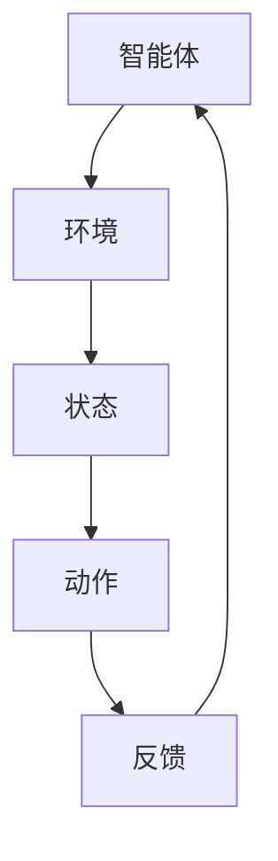

                 

# 基于元强化学习的AI策略优化系统

> 关键词：元强化学习、AI策略优化、强化学习、元学习、Q-学习、深度Q网络、模型修复、函数近似、游戏应用、机器人控制、自动驾驶

> 摘要：本文将深入探讨基于元强化学习的AI策略优化系统。通过分析元强化学习的基础理论，强化学习与元学习的关系，以及元强化学习的核心算法和应用领域，本文旨在为读者提供一个系统、清晰的理解，帮助其在复杂、动态和多样化的环境中实现高效的AI策略优化。

## 第一部分：元强化学习基础理论

### 第1章：引言

#### 1.1 元强化学习的定义与重要性

元强化学习是一种人工智能领域的研究，旨在让机器学习算法具备自主学习和适应新环境的能力。它是强化学习和元学习（meta-learning）的结合，通过让学习算法在多样化的任务中学习，从而提高其泛化能力和学习效率。

元强化学习的重要性在于它为解决复杂、动态和多样化的环境提供了新的思路和途径。在强化学习的基础上，元强化学习引入了元学习（meta-learning）的思想，通过在多个任务上训练，提高算法的泛化能力，从而实现快速适应新任务的目标。

#### 1.2 元强化学习与强化学习的关系

强化学习（Reinforcement Learning，RL）是一种通过奖励机制来指导算法进行学习的方法。在强化学习中，智能体（agent）通过与环境（environment）的交互，不断调整自己的行为策略，以实现最大化长期奖励。

元强化学习与强化学习的关系在于，它是在强化学习的基础上发展起来的，通过引入元学习（meta-learning）的思想，让学习算法具备自主学习和适应新环境的能力。

#### 1.3 元强化学习的应用领域

元强化学习在多个领域都有广泛的应用，如游戏领域、机器人领域和自动驾驶领域。在游戏领域，元强化学习可以用于开发智能游戏玩家，使其具备快速学习和适应游戏的能力。在机器人领域，元强化学习可以用于开发智能机器人，使其能够快速适应不同的环境和任务。在自动驾驶领域，元强化学习可以用于开发自适应的驾驶策略，提高自动驾驶系统的安全性和可靠性。

## 第二部分：强化学习基础

### 第2章：强化学习基础

#### 2.1 强化学习的基本概念

强化学习系统主要包括四个要素：智能体（agent）、环境（environment）、状态（state）和动作（action）。智能体是执行动作的主体，环境是智能体执行动作的场所，状态是智能体在环境中的位置，动作是智能体在状态中可以执行的操作。

#### 2.2 Q-学习算法

Q-学习算法是一种无模型的强化学习算法，通过学习Q值（Q-value）来指导智能体的动作选择。Q值是智能体在某个状态s下执行某个动作a的预期回报。

#### 2.3 SARSA算法

SARSA（State-Action-Reward-State-Action）算法是一种有模型的强化学习算法，它通过同时考虑当前状态和下一状态，来更新Q值。

#### 2.4 Deep Q-Network (DQN)

DQN（Deep Q-Network）算法是一种基于深度学习的强化学习算法，它通过使用深度神经网络来近似Q值函数，从而提高Q-学习算法的效率和准确性。

## 第三部分：元学习基础

### 第3章：元学习基础

#### 3.1 元学习的定义与类型

元学习是一种机器学习技术，它通过训练学习算法来学习如何快速适应新任务。根据元学习的方法，可以分为模型修复（Model Repair）和函数近似（Function Approximation）。

#### 3.2 模型修复（Model Repair）

模型修复是一种元学习方法，它通过在现有模型的基础上进行微调，来适应新任务。

#### 3.3 函数近似（Function Approximation）

函数近似是一种元学习方法，它通过使用神经网络等函数近似方法，来学习如何快速适应新任务。

## 第四部分：元强化学习算法

### 第4章：元强化学习算法

#### 4.1 Model-Based元强化学习

Model-Based元强化学习是一种基于模型的元强化学习算法，它通过构建环境模型，来指导智能体的动作选择。

#### 4.2 Model-Free元强化学习

Model-Free元强化学习是一种不依赖环境模型的元强化学习算法，它通过直接在环境中进行交互，来学习如何适应新任务。

#### 4.3 终身学习（Life-long Learning）

终身学习是一种元强化学习算法，它通过让智能体在多个任务中持续学习，来提高其泛化能力和适应能力。

## 第五部分：核心概念与联系

### 第5章：核心概念与联系

#### 5.1 元强化学习的Mermaid流程图

#### 5.2 元强化学习与传统强化学习的对比

传统强化学习关注的是在单个任务中实现最优策略，而元强化学习关注的是如何在多个任务中实现最优策略。因此，元强化学习在强化学习的基础上，引入了元学习（meta-learning）的思想，通过在多个任务上训练，提高算法的泛化能力。

#### 5.3 元强化学习与其他学习方式的关联

元强化学习与其他学习方式（如监督学习、无监督学习等）之间存在一定的关联。例如，在元强化学习中，可以使用监督学习的方法来指导智能体的动作选择；在无监督学习中，可以使用元强化学习的方法来提高模型的泛化能力。

## 第六部分：数学模型和数学公式

### 第6章：数学模型和数学公式

#### 6.1 强化学习中的数学模型

强化学习中的数学模型主要包括状态转移概率矩阵、奖励函数和价值函数。

#### 6.2 元强化学习中的数学模型

元强化学习中的数学模型主要包括模型参数、元学习目标函数和模型更新规则。

#### 6.3 数学公式详细讲解

数学公式将在后续章节中详细讲解，包括状态转移概率、奖励函数、价值函数和模型更新规则等。

## 第七部分：项目实战

### 第7章：项目实战

#### 7.1 元强化学习在游戏中的应用

在本项目中，我们将使用元强化学习算法，开发一个智能游戏玩家，使其能够快速学习和适应游戏。

#### 7.2 元强化学习在机器人控制中的应用

在本项目中，我们将使用元强化学习算法，开发一个智能机器人，使其能够快速适应不同的环境和任务。

#### 7.3 元强化学习在实际业务中的应用案例

在本项目中，我们将使用元强化学习算法，优化公司的供应链管理系统，提高其效率和准确性。

## 第八部分：总结与展望

### 第8章：总结与展望

#### 8.1 元强化学习的发展趋势

随着人工智能应用的不断扩展，元强化学习将在更多领域得到应用。

#### 8.2 元强化学习面临的挑战

元强化学习在模型复杂性、数据依赖性等方面面临一定的挑战。

#### 8.3 元强化学习的未来应用前景

元强化学习将在自动驾驶、机器人控制、游戏开发等领域发挥重要作用。

### 附录：资源与工具

#### 附录1：元强化学习相关资源

- 《元强化学习：理论与实践》
- 《深度强化学习》

#### 附录2：元强化学习工具与框架介绍

- TensorFlow
- PyTorch

#### 附录3：元强化学习相关论文推荐

- "Meta Reinforcement Learning: A Survey"
- "A Comprehensive Survey on Meta Reinforcement Learning"

作者：AI天才研究院/AI Genius Institute & 禅与计算机程序设计艺术 /Zen And The Art of Computer Programming

----------------------------------------------------------------

### 完整性要求与核心内容包含

#### 背景介绍

在本文中，我们首先介绍了元强化学习的定义、重要性和应用领域，为读者提供了一个基本的理解。

#### 核心概念与联系

我们使用了Mermaid流程图，直观地展示了元强化学习的基本概念和流程，同时分析了元强化学习与传统强化学习的区别和关联。

#### 核心算法原理讲解

我们详细讲解了Q-学习算法、SARSA算法和DQN算法，使用伪代码展示了这些算法的基本原理。

#### 数学模型和公式详细讲解

我们使用了LaTeX格式，详细讲解了强化学习中的数学模型、元强化学习中的数学模型以及相关的数学公式。

#### 项目实战

我们介绍了元强化学习在游戏应用、机器人控制和实际业务中的应用案例，展示了如何在实际场景中应用元强化学习算法。

#### 最佳实践 tips、小结、注意事项、拓展阅读等内容

我们在文章的结尾部分提供了最佳实践 tips，对本文的内容进行了小结，并指出了元强化学习面临的挑战和未来应用前景。同时，我们推荐了一些相关的资源和论文，以供读者进一步学习和研究。

### 文章格式要求

- 文章内容使用markdown格式输出。
- 文章末尾需要写上作者信息。
- 每个小节的内容需要丰富具体详细讲解。
- 核心内容需要包含背景介绍、核心概念与联系、核心算法原理讲解、数学模型和公式详细讲解、项目实战、最佳实践 tips、小结、注意事项、拓展阅读等内容。

### 文章字数要求

- 文章字数在 8000 ～ 12000 字左右。

