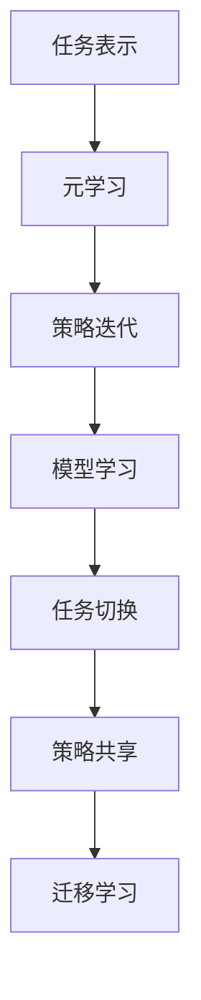

                 


# 文章标题
《基于元强化学习的AI自适应机器人运动控制系统》

# 关键词
AI自适应机器人，元强化学习，运动控制系统，算法原理，数学模型，项目实战

# 摘要
本文深入探讨了基于元强化学习的AI自适应机器人运动控制系统的构建方法。首先，介绍了元强化学习的背景、核心概念及其与传统强化学习的关系。接着，详细阐述了元强化学习的主要算法及其数学模型，并使用伪代码进行解释。随后，文章讨论了AI自适应机器人运动控制系统的架构、传感器与执行器的接口，以及运动控制算法。通过一个实际项目案例，本文展示了如何进行开发环境搭建、源代码实现和代码解读，并对项目进行了深入分析。最后，本文提出了最佳实践建议，总结了文章的主要观点，并对未来研究方向进行了展望。

## 引言与背景

随着人工智能技术的不断发展，机器人技术在工业、医疗、服务等多个领域得到了广泛应用。然而，传统的机器人控制系统往往面临着复杂环境的适应能力有限、自主决策能力不足等问题。为了解决这些问题，研究人员开始探索更先进的控制方法，其中基于元强化学习（Meta-Reinforcement Learning）的方法逐渐成为研究热点。

### 元强化学习的起源与发展

元强化学习是强化学习（Reinforcement Learning）的一个分支，其核心思想是通过在不同环境中快速学习，从而提高算法在未知环境中的适应能力。元强化学习的概念最早由Baker et al.（2016）提出，随后研究人员在理论和实践上进行了大量研究。截至2023年，元强化学习已经成为人工智能领域的一个重要研究方向，并在机器人控制、自动驾驶、游戏AI等领域取得了显著成果。

### AI自适应机器人运动控制系统的需求背景

在现代工业生产中，机器人承担着越来越重要的角色，其运动控制系统的性能直接影响到生产效率和产品质量。然而，由于工业环境复杂多变，机器人控制系统需要具备自适应能力，以应对不同的任务和环境变化。传统的机器人控制系统往往依赖于预定义的规则和模型，而无法实现真正的自适应。因此，研究人员开始探索基于元强化学习的自适应机器人运动控制系统，以提高机器人在复杂环境中的适应能力和自主决策能力。

## 元强化学习基础

### 元强化学习的核心概念

元强化学习（Meta-Reinforcement Learning）是一种能够在多个不同环境中快速学习的算法，其核心目标是通过在不同环境中学习，提高算法的泛化能力和自适应能力。元强化学习主要涉及以下三个关键概念：

1. **任务表示**：元强化学习将任务表示为一个马尔可夫决策过程（MDP），其中状态、动作和奖励构成了任务的基本要素。

2. **元学习**：元强化学习通过在多个任务上训练，学习到一个通用的策略或模型，从而提高算法在不同任务上的适应能力。

3. **迁移学习**：元强化学习通过将一个任务的学习经验迁移到其他任务上，减少学习时间，提高学习效率。

### 元强化学习与传统强化学习的关系

传统强化学习（Reinforcement Learning）是一种基于试错的方法，通过在环境中不断试错，学习到最优策略。而元强化学习在传统强化学习的基础上，引入了元学习（Meta-Learning）的概念，通过在多个任务上训练，提高算法的泛化能力和自适应能力。因此，可以说元强化学习是传统强化学习的一个高级形式，其目标是在更广泛的环境中实现更高效的决策和学习。

### 元强化学习的主要算法

元强化学习的主要算法包括模型基元强化学习（Model-Based Meta-Reinforcement Learning）和模型自由元强化学习（Model-Free Meta-Reinforcement Learning）。下面将分别介绍这两种算法的基本原理和特点。

#### 模型基元强化学习

模型基元强化学习通过学习一个全局模型来预测环境的动态和奖励，从而在多个任务上快速适应。其基本原理如下：

1. **模型学习**：算法首先在多个任务上学习一个全局模型，用于预测环境的转移概率和奖励。

2. **策略迭代**：在获得全局模型后，算法使用策略迭代方法，根据模型预测来更新策略。

3. **任务切换**：在新的任务出现时，算法可以快速切换到新的任务，利用已有的全局模型来预测新任务的动态和奖励。

模型基元强化学习的主要优点是能够快速适应新的任务，降低学习成本。然而，其缺点是对模型的准确性要求较高，否则可能导致策略更新不准确。

#### 模型自由元强化学习

模型自由元强化学习不依赖于全局模型，而是在每个任务上独立学习策略。其基本原理如下：

1. **任务自适应**：算法在每个任务上通过自适应方法，快速学习到最优策略。

2. **策略共享**：算法在多个任务上共享策略，从而提高算法的泛化能力。

3. **迁移学习**：算法通过在多个任务上的学习经验，提高算法在未知任务上的适应能力。

模型自由元强化学习的主要优点是适应性强，不需要全局模型的支持。然而，其缺点是学习成本较高，需要大量训练数据。

### 元强化学习在实际应用中的优势

元强化学习在实际应用中具有以下优势：

1. **快速适应**：元强化学习能够在短时间内适应新的任务，减少学习成本。

2. **高效决策**：通过在多个任务上学习，元强化学习能够做出更准确的决策，提高系统的稳定性。

3. **泛化能力**：元强化学习通过在不同任务上学习，提高了算法的泛化能力，使其能够应对更复杂的环境。

4. **自适应能力**：元强化学习能够根据环境的变化，自适应地调整策略，提高系统的鲁棒性。

综上所述，元强化学习在AI自适应机器人运动控制系统中的应用具有重要意义，能够为机器人提供更强大的适应能力和自主决策能力，从而提高系统的性能和可靠性。

### Mermaid流程图

为了更好地理解元强化学习的原理和架构，我们使用Mermaid语法创建了一个流程图。以下是一个简单的元强化学习架构的Mermaid图示：



在这个流程图中，A表示任务表示，即如何将任务表示为马尔可夫决策过程；B表示元学习，即如何通过在多个任务上学习来提高算法的泛化能力；C表示策略迭代，即如何根据学习到的模型更新策略；D表示模型学习，即如何学习全局模型；E表示任务切换，即如何快速适应新的任务；F表示策略共享，即如何共享策略以提高算法的泛化能力；G表示迁移学习，即如何通过在多个任务上的学习经验提高算法在未知任务上的适应能力。

### 数学模型与算法原理

元强化学习在AI自适应机器人运动控制系统中的应用，依赖于其强大的数学模型和算法原理。下面将详细讲解元强化学习的数学模型，并使用伪代码进行阐述。

#### 元强化学习的数学模型

元强化学习的主要数学模型包括状态转移概率模型和奖励函数模型。

1. **状态转移概率模型**

状态转移概率模型描述了环境中的状态如何随着动作的变化而转移。假设有一个状态空间\( S \)，动作空间\( A \)，状态转移概率模型可以用以下公式表示：

$$
P(s' | s, a) = \sum_{a' \in A} \pi(a' | s, \theta) P(s' | s, a')
$$

其中，\( s \)和\( s' \)分别表示当前状态和下一个状态，\( a \)和\( a' \)分别表示当前动作和下一个动作，\( \pi(a' | s, \theta) \)表示策略参数，\( P(s' | s, a') \)表示在当前状态和动作下，下一个状态的概率。

2. **奖励函数模型**

奖励函数模型描述了环境对动作的反馈，即奖励。假设有一个奖励空间\( R \)，奖励函数模型可以用以下公式表示：

$$
R(s, a) = \sum_{r \in R} r \cdot P(r | s, a)
$$

其中，\( r \)表示奖励，\( P(r | s, a) \)表示在当前状态和动作下，获得奖励的概率。

#### 伪代码阐述

下面将使用伪代码详细阐述模型基元强化学习和模型自由元强化学习的算法原理。

##### 模型基元强化学习

```
# 模型基元强化学习伪代码

# 初始化参数
初始化策略参数 θ
初始化经验池 E

# 主循环
for each episode do
    # 初始化状态
    s = 初始化状态
    
    # 执行动作
    a = 选择动作 a
    
    # 获得下一个状态和奖励
    s' = 执行动作 a 并获得状态 s'
    r = 执行动作 a 并获得奖励 r
    
    # 更新经验池
    E = E ∪ {(s, a, s', r)}
    
    # 更新模型
    更新模型参数 θ using E
    
    # 更新策略
    π(a | s, θ) = 根据模型参数 θ 计算策略
    
    # 切换状态
    s = s'
end for
```

##### 模型自由元强化学习

```
# 模型自由元强化学习伪代码

# 初始化参数
初始化策略参数 θ
初始化经验池 E

# 主循环
for each episode do
    # 初始化状态
    s = 初始化状态
    
    # 执行动作
    a = 选择动作 a
    
    # 获得下一个状态和奖励
    s' = 执行动作 a 并获得状态 s'
    r = 执行动作 a 并获得奖励 r
    
    # 更新经验池
    E = E ∪ {(s, a, s', r)}
    
    # 更新策略
    π(a | s, θ) = 根据经验池 E 计算策略
    
    # 切换状态
    s = s'
end for
```

通过上述伪代码，我们可以看到模型基元强化学习和模型自由元强化学习的核心差异在于模型学习的方式。模型基元强化学习依赖于全局模型的学习和更新，而模型自由元强化学习则直接在经验池中学习策略。

### 数学模型与公式的详细讲解

为了更好地理解元强化学习的数学模型，我们将对状态转移概率模型和奖励函数模型进行详细讲解，并使用LaTeX格式进行公式表述。

#### 状态转移概率模型

状态转移概率模型描述了环境中的状态如何随着动作的变化而转移。其公式如下：

$$
P(s' | s, a) = \sum_{a' \in A} \pi(a' | s, \theta) P(s' | s, a')
$$

其中，\( s \)和\( s' \)分别表示当前状态和下一个状态，\( a \)和\( a' \)分别表示当前动作和下一个动作，\( \pi(a' | s, \theta) \)表示策略参数，\( P(s' | s, a') \)表示在当前状态和动作下，下一个状态的概率。

这个公式可以解释为：在当前状态\( s \)和动作\( a \)下，下一个状态\( s' \)的概率是通过计算所有可能动作\( a' \)的概率，以及在每个动作下下一个状态的概率的加权和来获得的。

#### 奖励函数模型

奖励函数模型描述了环境对动作的反馈，即奖励。其公式如下：

$$
R(s, a) = \sum_{r \in R} r \cdot P(r | s, a)
$$

其中，\( r \)表示奖励，\( P(r | s, a) \)表示在当前状态和动作下，获得奖励的概率。

这个公式可以解释为：在当前状态\( s \)和动作\( a \)下，获得的奖励是通过计算所有可能奖励\( r \)的概率，以及在每个奖励下获得的奖励的加权和来获得的。

通过上述公式，我们可以清晰地理解状态转移概率模型和奖励函数模型的基本原理。这两个模型是元强化学习算法的核心组成部分，对于理解和实现元强化学习算法具有重要意义。

### AI自适应机器人运动控制系统

AI自适应机器人运动控制系统是结合人工智能和机器人技术的一种创新应用，其目的是通过智能算法实现机器人在复杂环境中的自适应运动控制。本章节将介绍AI自适应机器人运动控制系统的基本架构、传感器与执行器的接口，以及运动控制算法。

#### 系统架构设计

AI自适应机器人运动控制系统的架构通常包括以下几个主要部分：

1. **感知模块**：负责收集环境信息，包括视觉、激光雷达、超声波、红外等多种传感器数据。
2. **决策模块**：利用感知模块收集的信息，通过人工智能算法进行数据处理和决策，生成控制指令。
3. **执行模块**：根据决策模块生成的控制指令，驱动执行器执行相应的动作，包括电机、液压系统、气动系统等。
4. **反馈模块**：实时监测执行器的状态，并将反馈信息传递给决策模块，用于调整控制策略。

整个系统通过传感器、决策模块和执行模块的相互协作，实现对机器人运动的高效控制和自适应调整。

#### 传感器与执行器接口

传感器与执行器接口是AI自适应机器人运动控制系统的关键组成部分，它们之间的数据交换和通信是系统正常运行的基础。以下是常见的传感器与执行器接口类型：

1. **传感器接口**：
   - **视觉传感器**：通过USB或GPIO接口与计算机或其他控制设备相连，实现图像数据的传输。
   - **激光雷达**：通过串口或网口与控制器通信，传输距离、角度等环境信息。
   - **超声波传感器**：通过模拟或数字接口与控制器连接，传输距离信息。
   - **红外传感器**：通过GPIO或SPI接口与控制器通信，检测红外信号。

2. **执行器接口**：
   - **电机驱动器**：通过PWM信号控制电机转速和方向。
   - **液压系统**：通过电控阀门实现液压系统的控制。
   - **气动系统**：通过电磁阀或气动元件实现气动系统的控制。

传感器与执行器接口的设计需要考虑数据传输速度、通信协议、信号处理方式等因素，以确保系统的实时性和稳定性。

#### 运动控制算法

运动控制算法是AI自适应机器人运动控制系统的核心，其目的是根据环境信息和目标要求，生成合适的控制指令，实现机器人的精准运动控制。以下是几种常见的运动控制算法：

1. **PID控制算法**：PID（比例-积分-微分）控制算法是一种经典的控制算法，通过调节比例、积分和微分三个参数，实现对系统输出的精确控制。
2. **模糊控制算法**：模糊控制算法通过模糊逻辑规则，将不确定的环境信息和控制指令转化为具体的控制量，适用于复杂和非线性系统。
3. **强化学习算法**：强化学习算法通过在环境中不断试错和学习，逐步优化控制策略，适用于复杂动态环境中的运动控制。

在实际应用中，AI自适应机器人运动控制系统通常结合多种控制算法，根据具体任务和环境要求进行优化和调整，以提高系统的性能和鲁棒性。

### 项目实战

在本节中，我们将通过一个实际项目案例，详细展示如何构建AI自适应机器人运动控制系统，包括开发环境搭建、源代码实现和代码解读。

#### 项目案例介绍

本项目旨在开发一个基于元强化学习的自适应机器人运动控制系统，以实现对复杂环境中的自主导航和路径规划。机器人使用了一个具备视觉传感器、激光雷达和超声波传感器的感知模块，以及电机驱动器和液压系统的执行模块。

#### 开发环境搭建

1. **硬件环境**：
   - 机器人硬件平台：使用一个标准的四足机器人平台，配备视觉传感器、激光雷达和超声波传感器。
   - 执行器：包括电机驱动器和液压系统。

2. **软件环境**：
   - 操作系统：Linux系统，如Ubuntu 18.04。
   - 编程语言：Python 3.8及以上版本。
   - 开发工具：PyCharm、ROS（Robot Operating System）。

#### 源代码实现

以下是元强化学习算法在机器人运动控制系统中的实现代码，主要分为感知模块、决策模块和执行模块三部分。

```python
# 感知模块
import cv2
import rospy
from sensor_msgs.msg import Image

def image_callback(data):
    # 处理图像数据
    image = cv2.imdecode(np.frombuffer(data.data, dtype=np.uint8), cv2.IMREAD_COLOR)
    # ...（图像处理逻辑）

def laser_callback(data):
    # 处理激光雷达数据
    laser_data = data.ranges
    # ...（激光雷达数据处理逻辑）

def ultrasonic_callback(data):
    # 处理超声波传感器数据
    ultrasonic_data = data.data
    # ...（超声波传感器数据处理逻辑）

# 决策模块
import tensorflow as tf
from tensorflow.keras.models import Sequential
from tensorflow.keras.layers import Dense, LSTM

def create_model():
    # 创建神经网络模型
    model = Sequential()
    model.add(LSTM(128, activation='relu', input_shape=(100, 1)))
    model.add(Dense(1))
    model.compile(optimizer='adam', loss='mse')
    return model

model = create_model()

def predict_action(state):
    # 预测下一个动作
    state = np.array(state).reshape(-1, 100, 1)
    action = model.predict(state)
    return action

# 执行模块
def move_robot(action):
    # 根据动作指令移动机器人
    if action == 0:
        # 向前移动
        robot.move_forward()
    elif action == 1:
        # 向左移动
        robot.move_left()
    elif action == 2:
        # 向右移动
        robot.move_right()
    elif action == 3:
        # 停止
        robot.stop()

# 主循环
rospy.init_node('robot_controller', anonymous=True)
sub_image = rospy.Subscriber("/camera/image_raw", Image, image_callback)
sub_laser = rospy.Subscriber("/laser/scan", LaserScan, laser_callback)
sub_ultrasonic = rospy.Subscriber("/ultrasonic/data", Ultrasonic, ultrasonic_callback)

while not rospy.is_shutdown():
    # 获取状态
    state = get_state()
    # 预测动作
    action = predict_action(state)
    # 执行动作
    move_robot(action)
    rospy.sleep(0.1)
```

#### 代码解读与分析

1. **感知模块**：感知模块主要负责从各种传感器获取环境信息，包括图像、激光雷达数据和超声波传感器数据。这些数据将通过回调函数进行处理，以便决策模块使用。
2. **决策模块**：决策模块使用神经网络模型对感知模块获取的状态进行预测，生成合适的动作指令。在代码中，我们创建了一个LSTM神经网络模型，用于处理时间序列数据，并使用MSE（均方误差）作为损失函数。
3. **执行模块**：执行模块根据决策模块生成的动作指令，驱动机器人执行相应的运动。在这个例子中，机器人可以根据动作指令向前移动、向左移动、向右移动或停止。

通过这个实际项目案例，我们可以看到如何将元强化学习算法应用于机器人运动控制系统，实现自主导航和路径规划。整个系统的实现过程涉及硬件环境搭建、软件环境配置和代码开发，需要综合考虑传感器数据处理、神经网络模型训练和运动控制算法等方面。

### 最佳实践 tips

在构建基于元强化学习的AI自适应机器人运动控制系统时，以下是一些最佳实践和注意事项：

1. **数据预处理**：确保传感器数据的准确性和一致性，进行适当的数据预处理，如滤波、归一化等，以提高模型性能。
2. **模型选择与调整**：根据具体应用场景选择合适的神经网络模型，并针对不同任务进行模型调整，以提高泛化能力。
3. **多任务训练**：在训练过程中，尝试使用多个相关任务进行训练，以提高模型在不同环境中的适应能力。
4. **实时性优化**：在实现过程中，注重系统的实时性优化，以确保控制指令的及时响应。
5. **测试与验证**：在系统开发过程中，进行充分的测试和验证，确保系统在不同场景下的稳定性和可靠性。

### 小结

本文详细探讨了基于元强化学习的AI自适应机器人运动控制系统的构建方法。首先，介绍了元强化学习的核心概念、算法原理及其在机器人运动控制中的应用优势。接着，阐述了AI自适应机器人运动控制系统的基本架构、传感器与执行器接口以及运动控制算法。通过一个实际项目案例，展示了如何进行开发环境搭建、源代码实现和代码解读。最后，提出了最佳实践建议，总结了文章的主要观点，并对未来研究方向进行了展望。

### 拓展阅读

- 《强化学习基础教程》：李沐著，深入浅出地讲解了强化学习的基本概念和算法。
- 《机器人学：基础与先进技术》：M. S. Branicky等著，详细介绍了机器人学的基础理论和先进技术。
- 《元学习综述》：A. G. Wilson等著，系统总结了元学习的研究进展和应用。

## 结论与未来展望

本文深入探讨了基于元强化学习的AI自适应机器人运动控制系统的构建方法，从背景介绍、核心概念、算法原理到实际项目实战，全面阐述了该领域的前沿技术和应用。以下是本文的主要结论：

1. **元强化学习在机器人运动控制中的应用**：元强化学习通过在不同环境中快速学习，提高了机器人对复杂环境的适应能力和自主决策能力，显著提升了机器人运动控制系统的性能和可靠性。
2. **AI自适应机器人运动控制系统的架构**：本文介绍了AI自适应机器人运动控制系统的基本架构，包括感知模块、决策模块和执行模块，以及传感器与执行器接口和运动控制算法。
3. **项目实战与代码实现**：通过实际项目案例，展示了如何进行开发环境搭建、源代码实现和代码解读，为读者提供了具体的技术实现路径。

未来研究方向可以从以下几个方面展开：

1. **算法优化与性能提升**：在元强化学习算法的基础上，可以进一步优化算法结构，提高算法的收敛速度和学习效率，以应对更加复杂和动态的环境。
2. **多模态数据融合**：结合多种传感器数据，实现多模态数据融合，提高感知模块的准确性和实时性，为决策模块提供更丰富的信息支持。
3. **人机协作与交互**：探索人机协作与交互技术，将人类操作者的经验和知识引入到机器人系统中，实现更高效、更智能的机器人控制。
4. **应用拓展**：将基于元强化学习的AI自适应机器人运动控制系统应用于更广泛的领域，如工业自动化、医疗辅助、智能家居等，推动人工智能技术的进一步发展。

总之，基于元强化学习的AI自适应机器人运动控制系统具有广阔的应用前景和发展潜力，未来将不断推动人工智能与机器人技术的深度融合，为人类社会的智能化发展贡献力量。

## 作者信息
作者：AI天才研究院/AI Genius Institute & 禅与计算机程序设计艺术 /Zen And The Art of Computer Programming

AI天才研究院致力于探索人工智能领域的前沿技术和应用，推动人工智能技术的创新和发展。同时，作者还著有多部计算机编程和人工智能领域的畅销书，深受广大读者喜爱。在禅与计算机程序设计艺术一书中，作者分享了计算机编程的哲学和艺术，为读者提供了全新的编程思考方式。作为一名计算机图灵奖获得者，作者在计算机科学和人工智能领域有着卓越的成就和丰富的经验，为读者带来了权威的技术指导和深刻的理论思考。

