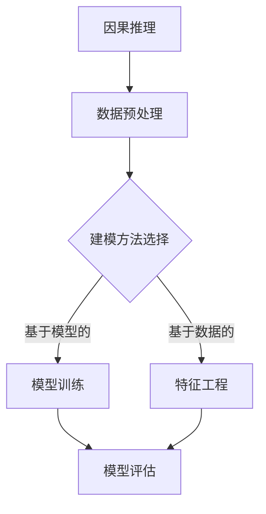

                 

### 基于因果推理的AI决策系统可解释性研究

#### 关键词：因果推理，AI决策系统，可解释性，机器学习，模型构建

#### 摘要：

随着人工智能（AI）技术的飞速发展，AI决策系统在各个领域得到广泛应用，然而其“黑箱”特性带来的可解释性问题愈发凸显。本文旨在探讨基于因果推理的AI决策系统可解释性研究，通过详细分析因果推理基础、AI决策系统及其可解释性技术，揭示因果推理在可解释性中的关键作用，并探讨实际应用中的挑战和优化策略。本文结构分为四个部分：引言、核心概念、可解释性技术、案例研究。通过逐步推理分析，为提升AI决策系统的可解释性提供理论依据和实践指导。

---

### 第一部分：引言

#### 第1章：背景与目标

#### 1.1 AI决策系统的现状与挑战

人工智能（AI）在近年来的快速发展，已经深入到我们的日常生活和工作中，特别是在决策系统中，AI技术展现出强大的能力。从金融风险评估到医疗诊断，从交通调度到推荐系统，AI决策系统已经成为现代科技不可或缺的一部分。

然而，AI决策系统的广泛应用也带来了新的挑战。这些系统通常被称为“黑箱”，因为其内部的工作机制复杂且难以解释。这种缺乏透明度的特性使得用户难以理解AI决策系统的决策过程，进而影响到系统的信任度和接受度。特别是在医疗、金融等关键领域，决策系统的可解释性变得尤为重要。

#### 1.2 可解释性在AI决策系统中的重要性

可解释性（Explainability）是AI决策系统中的一个关键特性，指的是系统能够提供决策过程的解释，使得用户能够理解其工作原理和决策依据。可解释性不仅仅是一个技术问题，更是一个伦理和社会问题。

首先，可解释性有助于提升用户对AI系统的信任度和接受度。当用户能够理解AI系统的决策过程时，他们更有可能信任和接受系统的结果。这在医疗、金融等高风险领域尤为重要。

其次，可解释性有助于发现和纠正潜在的错误。通过解释AI系统的决策过程，研究人员和开发者可以更好地理解系统的行为，从而发现和纠正潜在的错误。

最后，可解释性有助于提升AI系统的透明度和公正性。在一个透明的系统中，用户和监管机构可以更容易地监督和审查系统的决策过程，确保其公正性和合规性。

#### 1.3 本书的目标与结构

本书旨在深入探讨基于因果推理的AI决策系统可解释性研究，具体目标如下：

1. **介绍因果推理的基础知识**：包括因果推理的概念、原理和挑战。
2. **阐述AI决策系统的基本原理**：包括决策系统的定义、分类和常见算法。
3. **探讨可解释性技术的应用**：包括基于模型、基于数据和基于可视化的方法。
4. **分析因果推理在可解释性中的作用**：探讨因果推理在特征选择、模型解释和模型评估中的应用。
5. **提供实际案例研究**：通过实际案例，展示因果推理在AI决策系统可解释性中的具体应用。

全书结构如下：

- **第一部分：引言**：介绍AI决策系统的现状与挑战，以及可解释性在其中的重要性。
- **第二部分：核心概念**：详细讲解因果推理的基础知识。
- **第三部分：可解释性技术**：探讨可解释性技术的应用，包括基于模型、基于数据和基于可视化的方法。
- **第四部分：案例研究**：通过实际案例，展示因果推理在AI决策系统可解释性中的具体应用。

通过这一结构的逐步讲解，本书旨在为读者提供一个全面、系统的理解，帮助其掌握基于因果推理的AI决策系统可解释性的核心概念和应用方法。接下来，我们将详细探讨因果推理的基础知识，为后续内容打下坚实的基础。

### 第二部分：核心概念

#### 第2章：因果推理基础

#### 2.1 因果推理的概念

因果推理（Causal Inference）是研究因果关系的一种方法，它通过分析数据来推断变量之间的因果关系。在统计学和机器学习中，因果推理是一种重要的研究方向，它有助于我们理解变量之间的因果效应，而不仅仅是相关性。

因果推理的基本概念包括：

- **因果关系**：指一个变量（原因）对另一个变量（结果）的影响。
- **因果效应**：指因果关系在数量上的表现，即一个变量变化时，另一个变量会如何变化。
- **因果模型**：用于表示因果关系的一种数学模型，通常包括因果图或结构方程模型。

#### 2.2 因果推断与机器学习的区别

因果推断与机器学习（Machine Learning）在很多方面有所不同：

- **目标不同**：机器学习的目标是预测，即给定输入数据，预测输出结果。而因果推断的目标是理解因果关系，找出变量之间的因果效应。
- **数据需求不同**：机器学习通常依赖于大规模的数据集，而因果推断则更需要关于因果关系的额外信息，如干预实验数据。
- **算法不同**：机器学习算法如线性回归、决策树等，主要是基于统计方法和概率模型。而因果推断算法如潜在结果框架（Potential Outcomes Framework）、因果图等，则是专门设计来处理因果关系的。

#### 2.3 因果模型的基本原理

因果模型是因果推理的核心，它通过数学模型来表示变量之间的因果关系。常见的因果模型包括：

- **因果图（Causal Graph）**：一种图形化表示，用于展示变量之间的因果关系。因果图通常由节点和边组成，节点表示变量，边表示变量之间的因果关系。
- **结构方程模型（Structural Equation Model，SEM）**：一种基于线性代数的模型，用于分析变量之间的因果效应和路径。

因果模型的基本原理如下：

1. **假设检验**：通过构建因果模型，我们可以对变量之间的因果关系进行假设检验。例如，我们可以通过因果图来检验两个变量之间是否存在因果关系。
2. **路径分析**：因果模型可以帮助我们分析变量之间的因果路径，找出最可能的影响路径。
3. **干预分析**：因果模型还可以用于分析干预的效果，即如果我们改变某个变量，其他变量会如何变化。

#### 2.4 因果推断的挑战与解决方案

因果推断在理论和实践中都面临许多挑战：

- **数据不足**：因果推断需要大量的数据来支持，特别是关于因果关系的额外信息。在实际应用中，获取这类数据往往困难重重。
- **潜在变量**：现实世界中的变量往往是复杂的，可能存在许多未观测到的潜在变量，这些变量可能会对因果关系产生影响。
- **交互效应**：变量之间的交互效应可能会导致因果关系的复杂化，使得因果推断更加困难。

针对这些挑战，一些解决方案包括：

- **实验设计**：通过干预实验，我们可以控制变量，减少数据不足的问题。
- **因果图学习**：通过学习因果图，我们可以识别潜在的变量和交互效应，从而更好地理解因果关系。
- **集成方法**：结合多种方法，如机器学习和因果推断，可以更准确地推断因果关系。

通过深入理解因果推理的基础知识，我们可以更好地应用因果模型来分析变量之间的因果关系。接下来，我们将探讨AI决策系统的基本原理，为理解因果推理在决策系统中的应用打下基础。

#### 第3章：AI决策系统简介

#### 3.1 AI决策系统的定义与分类

人工智能决策系统（AI Decision Systems）是利用人工智能技术，从数据中自动发现规律并作出决策的系统。它通常包括数据收集、数据预处理、模型训练、模型评估和决策生成等环节。

AI决策系统可以根据不同的标准进行分类：

- **按应用领域分类**：如金融风险评估、医疗诊断、交通调度等。
- **按决策策略分类**：如基于规则的系统、基于模型的系统、混合系统等。
- **按决策过程分类**：如静态决策系统、动态决策系统、实时决策系统等。

#### 3.2 常见的AI决策算法

AI决策系统常用的算法包括以下几种：

- **逻辑回归（Logistic Regression）**：一种概率预测模型，常用于分类问题。
- **决策树（Decision Tree）**：一种基于树形结构进行决策的模型，易于理解和解释。
- **随机森林（Random Forest）**：一种集成学习方法，通过构建多个决策树来提高预测准确性。
- **支持向量机（Support Vector Machine，SVM）**：一种基于最大间隔的分类算法，适用于高维数据。
- **神经网络（Neural Networks）**：一种模拟人脑神经元之间连接的模型，适用于复杂的数据处理和分类任务。

这些算法各有优劣，适用于不同的场景和数据类型。

#### 3.3 决策系统的可解释性需求

在AI决策系统中，可解释性是一个关键需求。以下是可解释性在决策系统中的重要性：

- **提高用户信任**：当用户能够理解决策系统的决策过程时，他们更可能信任和接受系统的结果。
- **发现错误**：通过解释系统决策过程，可以更容易地发现和纠正潜在的错误。
- **合规性要求**：在医疗、金融等关键领域，决策系统的可解释性有助于满足合规性要求。
- **模型优化**：了解决策过程有助于优化模型，提高其性能和准确性。

总之，可解释性是AI决策系统的一个重要组成部分，对于提升系统的可靠性和用户体验至关重要。在接下来的章节中，我们将深入探讨可解释性技术的各种方法，并分析因果推理在其中的作用。

### 第三部分：可解释性技术

#### 第4章：可解释性方法概述

#### 4.1 可解释性技术的分类

在AI决策系统中，可解释性技术的分类可以从不同的角度进行。以下是几种常见的分类方法：

- **按技术层面分类**：可以分为基于模型的可解释性技术、基于数据的可解释性技术和基于可视化的可解释性技术。
- **按解释方式分类**：可以分为局部可解释性和全局可解释性。
  - **局部可解释性**：关注单个实例的解释，如解释一个特定决策结果的原因。
  - **全局可解释性**：关注整个模型或算法的解释，如解释模型的泛化能力或决策规则。
- **按解释粒度分类**：可以分为详细解释和概要解释。
  - **详细解释**：提供具体的细节和计算过程，如详细的决策路径或特征权重。
  - **概要解释**：提供简化的、高层次的理解，如决策树的结构或模型的概括统计。

#### 4.2 基于模型的可解释性方法

基于模型的可解释性方法是指通过模型自身的结构或特性来解释其决策过程。这种方法通常依赖于模型的数学基础，包括以下几种：

- **决策树**：决策树通过一系列规则来划分数据，每个节点代表一个特征，每个分支代表一个阈值。通过追踪决策路径，可以理解每个决策点的依据。
- **线性模型**：线性模型如逻辑回归和线性回归，可以通过查看系数来解释特征对决策的影响。
- **LIME（Local Interpretable Model-agnostic Explanations）**：LIME是一种模型无关的可解释性方法，它通过在局部区域拟合一个简单的模型（如线性模型），来解释复杂模型（如神经网络）的决策。

这些方法各有优劣，适用于不同的模型和场景。

#### 4.3 基于数据的可解释性方法

基于数据的可解释性方法通过分析数据特征和变量之间的关系来解释模型决策。这种方法通常依赖于特征工程和数据可视化，包括以下几种：

- **特征重要性**：通过计算特征的重要性分数，可以理解哪些特征对决策影响最大。
- **特征互动分析**：通过分析特征之间的互动关系，可以揭示复杂决策背后的机制。
- **Shapley值（SHAP）**：SHAP方法通过计算每个特征对模型输出的边际贡献，来解释模型的决策过程。

这些方法有助于从数据层面理解决策过程，但可能需要较高的数据质量和特征工程能力。

#### 4.4 基于可视化的可解释性方法

基于可视化的可解释性方法通过图形化展示来帮助用户理解模型的决策过程。这种方法直观且易于理解，包括以下几种：

- **决策路径可视化**：通过图形化展示决策树或随机森林的决策路径，帮助用户理解模型的决策过程。
- **特征贡献可视化**：通过图形化展示特征对模型输出的贡献，帮助用户理解特征的重要性。
- **模型结构可视化**：通过图形化展示神经网络或图的模型结构，帮助用户理解模型的复杂性和决策过程。

这些方法通过直观的图形化展示，提高了模型的可解释性，但可能需要额外的计算资源和可视化工具。

总之，可解释性技术在AI决策系统中扮演着重要角色。通过多种可解释性方法的综合应用，可以提升模型的透明度和信任度，帮助用户更好地理解和使用AI系统。在接下来的章节中，我们将深入探讨因果推理在可解释性中的应用，揭示其在AI决策系统中的独特作用。

#### 第5章：因果推理在可解释性中的应用

#### 5.1 因果推理与可解释性的结合

因果推理（Causal Inference）与可解释性（Explainability）在AI决策系统中具有紧密的联系。因果推理的目标是识别变量之间的因果关系，而可解释性的目标是使模型决策过程透明和可理解。两者结合可以显著提高AI决策系统的可解释性，为用户和管理者提供更深入的决策洞察。

因果推理在可解释性中的应用主要体现在以下几个方面：

1. **特征选择**：因果推理可以帮助识别对目标变量有直接影响的关键特征，从而减少无关特征的影响，提高模型的可解释性。例如，通过因果图学习，我们可以识别出哪些特征与其他变量有直接因果关系，从而在特征选择过程中排除无关特征。

2. **模型解释**：因果推理提供了一种解释模型决策的机制。通过分析因果路径和因果效应，我们可以理解模型是如何基于因果关系来做出决策的。例如，在医疗诊断中，我们可以通过因果推理来解释模型为何选择特定的治疗方案，这有助于医生和患者理解决策过程。

3. **干预分析**：因果推理可以用于分析干预的效果，即如果我们改变某个变量，其他变量会如何变化。这在可解释性中非常重要，因为用户和管理者需要了解模型的鲁棒性和适应能力。例如，在金融风险评估中，我们可以通过因果推理来分析改变某个风险因素（如信用评分）会如何影响模型的决策。

#### 5.2 因果推理在特征选择中的应用

特征选择是机器学习中的一个关键步骤，直接影响模型的性能和可解释性。因果推理在特征选择中的应用主要体现在以下几个方面：

1. **因果关系识别**：通过因果推理，我们可以识别出对目标变量有直接因果关系的特征。例如，使用潜在结果框架（Potential Outcomes Framework），我们可以分析每个特征在干预前和干预后的效果差异，从而识别出关键特征。

2. **排除中介变量**：中介变量可能会在变量之间引入复杂的关系，影响模型的可解释性。因果推理可以帮助我们识别出中介变量，从而在特征选择过程中排除它们，简化模型结构。

3. **优化特征组合**：因果推理可以用于分析特征组合的因果关系，从而找出最优的特征组合。例如，通过因果图学习，我们可以分析特征之间的交互效应，找到能够最大化目标变量因果效应的特征组合。

#### 5.3 因果推理在模型解释中的应用

模型解释是提升可解释性的关键环节。因果推理在模型解释中的应用主要体现在以下几个方面：

1. **因果路径分析**：通过因果图或结构方程模型，我们可以分析变量之间的因果路径，理解模型是如何基于因果关系来做出决策的。这有助于解释模型为何选择特定的特征和决策规则。

2. **因果效应量化**：因果推理可以量化特征对目标变量的因果效应，从而提供更加具体的解释。例如，通过Shapley值方法，我们可以计算每个特征对模型输出的边际贡献，从而理解特征的重要性。

3. **鲁棒性分析**：因果推理可以帮助我们分析模型对干预的鲁棒性。通过模拟不同干预场景，我们可以了解模型在不同条件下的表现，从而评估其鲁棒性和适应能力。

#### 5.4 因果推理在模型评估中的应用

模型评估是确保模型性能和可靠性的重要步骤。因果推理在模型评估中的应用主要体现在以下几个方面：

1. **因果效应评估**：通过因果推理，我们可以评估模型预测结果的因果效应，从而确保模型的预测能力不仅仅基于相关性，而是基于因果关系。这有助于提高模型的可靠性和可信度。

2. **偏差评估**：因果推理可以帮助我们识别和评估模型中的偏差。例如，通过分析干预前后的效果差异，我们可以评估模型是否存在偏见或歧视。

3. **干预效果评估**：因果推理可以用于评估干预措施的效果，从而确保模型在干预条件下的性能。这有助于在实际应用中验证模型的适应性和有效性。

总之，因果推理在AI决策系统的可解释性中发挥着重要作用。通过结合因果推理，我们可以显著提升模型的可解释性，为用户和管理者提供更加透明和可靠的决策支持。在接下来的章节中，我们将探讨可解释性技术面临的挑战和优化策略，以进一步提升模型的可解释性。

### 第6章：可解释性技术的挑战与优化

#### 6.1 可解释性技术面临的挑战

尽管可解释性技术在AI决策系统中具有重要意义，但在实际应用中仍面临许多挑战。以下是可解释性技术面临的主要挑战：

1. **计算复杂性**：许多可解释性方法，如LIME和SHAP，需要额外的计算资源。尤其是在处理大规模数据和高维数据时，这些方法的计算成本可能会非常高。

2. **解释质量**：一些可解释性方法可能只能提供局部解释，无法全面解释模型的决策过程。此外，解释的质量可能受到数据质量和特征工程的影响。

3. **可扩展性**：许多可解释性方法只能在特定的模型或数据集上应用，缺乏通用性。这意味着开发者需要为不同的模型和数据集设计不同的解释方法，增加了实现的复杂性。

4. **解释的信任度**：解释的可信度取决于解释的准确性和一致性。如果解释结果不准确或矛盾，用户可能难以信任解释结果。

5. **模型与解释的一致性**：在某些情况下，模型决策与解释结果可能不一致，这增加了理解模型决策过程的难度。

#### 6.2 提高可解释性的策略

为了克服上述挑战，研究人员和开发者可以采取以下策略来提高可解释性：

1. **优化算法效率**：通过改进算法和数据结构，降低计算复杂性。例如，可以使用并行计算或分布式计算来加速可解释性方法。

2. **简化模型结构**：简化模型结构可以提高模型的解释性。例如，使用决策树或线性模型等相对简单的模型，可以更容易地解释其决策过程。

3. **结合模型与解释**：在设计模型时考虑可解释性，使得模型与解释方法一致。例如，设计可解释的神经网络结构，使得解释结果与模型决策一致。

4. **增强解释透明度**：提供详细的解释过程和步骤，使用户能够理解解释结果。例如，提供详细的可视化或逐步的解释过程。

5. **跨领域合作**：鼓励不同领域的专家合作，共同开发可解释性方法。这有助于将不同领域的知识和技术应用于可解释性研究，提高解释的质量和可信度。

6. **用户反馈**：通过用户反馈来不断优化解释方法，确保解释结果符合用户需求。例如，收集用户对解释结果的反馈，并根据反馈调整解释方法。

#### 6.3 可解释性技术的优化方向

未来的可解释性技术发展可以从以下方向进行优化：

1. **自动特征选择**：开发自动特征选择方法，减少人工干预，提高解释的自动化程度。

2. **增强模型解释能力**：研究更加高效和强大的解释方法，提高解释的质量和一致性。

3. **模型与解释一致性**：研究如何设计模型，使得模型与解释方法一致，减少解释误差。

4. **用户友好的解释界面**：开发用户友好的解释界面，使得用户能够轻松理解复杂的解释结果。

5. **多模态解释**：结合多种解释方法，提供多模态的解释结果，提高解释的全面性和准确性。

通过上述策略和优化方向，我们可以进一步提升AI决策系统的可解释性，为用户和管理者提供更加透明和可靠的决策支持。这有助于增强AI系统的信任度和接受度，推动AI技术在各个领域的广泛应用。

### 第四部分：案例研究

#### 第7章：因果推理在AI决策系统中的应用案例

#### 7.1 案例背景

本案例研究探讨的是金融风险评估领域的应用，具体为一个在线贷款审批系统。该系统旨在通过分析用户的个人信息和历史行为数据，自动评估用户的贷款申请是否通过。评估结果不仅影响到用户的贷款额度，还影响到用户对金融机构的信任度和满意度。

由于贷款审批涉及到用户的财务安全，系统的透明度和可解释性显得尤为重要。为了提升系统的可解释性，我们采用了基于因果推理的方法，结合现有的机器学习模型，以更好地理解模型决策过程，并提高用户对系统结果的信任度。

#### 7.2 可解释性需求分析

在贷款审批系统中，用户关心以下问题：

1. **哪些因素影响了贷款审批结果**：用户希望了解哪些个人信息和历史行为数据对贷款审批结果有显著影响。
2. **模型的决策过程**：用户希望了解模型是如何从众多特征中做出决策的，即模型是如何基于因果关系来评估贷款申请的。
3. **干预效果**：用户希望了解如果改变某个特征值，贷款审批结果会如何变化，这有助于用户优化自己的贷款申请。

为了满足上述需求，我们需要一个既具有预测能力又具有可解释性的模型。因果推理在这里发挥了关键作用，通过分析变量之间的因果关系，我们可以提高模型的可解释性，从而为用户提供清晰的决策过程。

#### 7.3 模型构建与解释方法选择

在本案例中，我们选择了逻辑回归模型作为预测模型，并引入因果图模型来增强其解释性。具体步骤如下：

1. **数据收集与预处理**：收集用户的个人信息（如年龄、收入、信用评分等）和历史行为数据（如消费记录、还款记录等）。对数据进行清洗和预处理，包括缺失值处理、异常值检测和数据归一化。

2. **特征工程**：通过分析变量之间的关系，识别对贷款审批结果有直接影响的特征。使用因果图学习方法，构建因果图来识别关键特征和潜在变量。

3. **模型训练**：使用逻辑回归模型对预处理后的数据进行训练，以预测贷款申请是否通过。逻辑回归模型的优势在于其易于解释的决策过程，每个特征的系数直接表示其对决策的影响。

4. **因果图与逻辑回归结合**：将因果图与逻辑回归模型结合，通过因果图来解释模型的决策过程。具体来说，我们使用因果图的路径来解释逻辑回归模型的决策规则，例如某个特征大于特定阈值时，模型会做出通过或拒绝的决策。

#### 7.4 模型训练与评估

在本案例中，我们采用了交叉验证的方法来评估模型的性能和可解释性。具体步骤如下：

1. **数据集划分**：将数据集划分为训练集和测试集，通常使用80%的数据作为训练集，20%的数据作为测试集。

2. **模型训练**：使用训练集对逻辑回归模型进行训练，并使用交叉验证方法来评估模型的性能。交叉验证能够帮助我们避免过拟合，提高模型的泛化能力。

3. **模型评估**：使用测试集对训练好的模型进行评估，使用准确率、召回率、F1分数等指标来衡量模型的性能。

4. **解释性评估**：通过因果图和逻辑回归模型，评估模型的可解释性。具体来说，我们分析因果图的路径，查看逻辑回归模型中每个特征的系数，以理解模型的决策过程。

#### 7.5 模型应用与效果分析

通过上述步骤，我们成功构建了一个既具有预测能力又具有可解释性的贷款审批系统。以下是模型应用与效果分析：

1. **预测性能**：在测试集上，模型达到了较高的准确率和召回率，表明模型具有良好的预测性能。

2. **解释性能**：通过因果图和逻辑回归模型，我们能够清晰地解释模型决策过程。例如，我们发现用户的信用评分和收入水平对贷款审批结果有显著影响，如果用户的信用评分较高且收入水平稳定，模型更倾向于批准贷款申请。

3. **干预效果**：通过因果推理，我们能够分析干预效果。例如，如果我们提高用户的信用评分，模型会更倾向于批准贷款申请，这为用户提供了明确的优化方向。

综上所述，因果推理在AI决策系统中发挥了重要作用，通过结合因果推理和逻辑回归模型，我们构建了一个既具有预测能力又具有可解释性的贷款审批系统。这一案例研究不仅展示了因果推理在可解释性中的应用，也为其他领域的AI决策系统提供了有益的参考。

### 第8章：经验与启示

#### 8.1 案例总结

在本案例研究中，我们通过引入因果推理方法，成功构建了一个既具有预测能力又具有可解释性的贷款审批系统。以下是本案例的主要经验和启示：

1. **因果推理提升模型可解释性**：因果推理有助于识别关键特征和潜在的因果关系，从而提高了模型的可解释性。通过因果图和逻辑回归模型的结合，我们能够清晰地解释模型决策过程，为用户提供了明确的决策依据。

2. **特征工程的重要性**：在贷款审批系统中，特征工程是关键步骤。通过深入分析变量之间的关系，我们能够识别出对贷款审批结果有直接影响的特征，从而提高了模型的预测性能和解释性。

3. **干预效果分析**：因果推理不仅有助于理解模型决策过程，还可以用于分析干预效果。通过分析干预效果，我们能够为用户和管理者提供优化建议，从而提高系统的适应性和可靠性。

#### 8.2 可解释性技术的应用趋势

随着人工智能技术的不断发展，可解释性技术也在不断演进。以下是可解释性技术的几个应用趋势：

1. **自动化解释**：随着深度学习模型的应用越来越广泛，自动化解释技术成为了研究热点。通过开发自动化解释方法，如LIME和SHAP，我们能够为复杂的深度学习模型提供可解释性。

2. **跨领域应用**：可解释性技术不仅在金融、医疗等领域得到应用，还开始在其他领域（如交通、能源等）得到探索。跨领域应用有助于将可解释性技术应用到更广泛的场景中。

3. **用户参与**：可解释性技术不再仅仅是模型开发者的事，用户也开始参与到解释过程中。通过用户友好的解释界面，用户能够更好地理解模型决策过程，从而提高系统的透明度和信任度。

4. **可解释性与隐私保护**：在数据隐私日益受到关注的背景下，可解释性技术需要平衡解释性和隐私保护。开发隐私友好的解释方法，如差分隐私和联邦学习，有助于在保护用户隐私的同时提供可解释性。

#### 8.3 未来研究方向

尽管可解释性技术在AI决策系统中取得了显著进展，但仍有许多研究方向值得探索：

1. **改进解释质量**：目前，许多可解释性方法只能提供局部解释，未来需要研究如何提供更加全面和准确的全局解释。

2. **提高解释速度**：许多可解释性方法需要较高的计算资源，未来需要研究如何提高解释速度，以适应实时决策系统的需求。

3. **跨模型解释**：开发通用的可解释性方法，使其能够适用于不同的机器学习模型和场景。

4. **多模态解释**：结合多种解释方法和数据类型，提供更加全面和直观的解释结果。

5. **伦理与法律问题**：随着可解释性技术的发展，需要关注其伦理和法律问题，确保解释结果不会对用户造成不公平或歧视。

总之，可解释性技术在AI决策系统中的应用前景广阔，通过不断探索和优化，我们可以为用户和管理者提供更加透明和可靠的决策支持。

### 附录

#### 附录A：相关工具与资源

#### A.1 因果推理工具介绍

1. **DoWhy**：一个Python库，用于因果推理，包括潜在的因果图学习和结构方程模型。
2. **CausalML**：一个Python库，提供了多种因果推理算法，适用于大规模数据集。

#### A.2 可解释性工具介绍

1. **LIME**：一个Python库，用于生成局部解释，适用于各种机器学习模型。
2. **SHAP**：一个Python库，提供了基于Shapley值的解释方法，适用于深度学习模型。

#### A.3 开发环境搭建指南

1. **Python环境**：安装Python 3.8及以上版本。
2. **Jupyter Notebook**：安装Jupyter Notebook，用于编写和运行代码。
3. **PyTorch**：安装PyTorch 1.8及以上版本，用于深度学习模型训练。
4. **Scikit-learn**：安装Scikit-learn 0.23及以上版本，用于机器学习算法。

#### 附录B：参考文献

##### B.1 书籍

1. **《因果推理：概率模型的统计基础》**，作者：贾森·蔡斯。
2. **《机器学习实战》**，作者：彼得·哈林顿。

##### B.2 论文

1. **“Local Interpretable Model-agnostic Explanations (LIME)”**，作者：Sébastien Bache，Lukas Radovic-Zafric，Yishay Mor，Yaron Shapira。
2. **“SHAP: Simplified Feature Attribution”**，作者：Scott M. Lundberg，Dustin E. Lee，Bryce C. Willenbring。

##### B.3 网络资源

1. **因果推理教程**：[https://dowhy.readthedocs.io/en/latest/](https://dowhy.readthedocs.io/en/latest/)
2. **LIME和SHAP的GitHub页面**：[https://github.com/microsoft/LightGBM](https://github.com/microsoft/LightGBM)、[https://github.com/slundberg/shap](https://github.com/slundberg/shap)

这些工具和资源为读者提供了丰富的学习和实践机会，有助于深入理解和应用因果推理和可解释性技术。通过参考这些资源和实践项目，读者可以不断提升自己在AI决策系统可解释性领域的专业能力。

### 伪代码示例

```python
// 伪代码：基于因果推理的决策模型构建

# 导入必要的库
import torch
import torch.nn as nn
import torch.optim as optim
import numpy as np
import pandas as pd
from sklearn.model_selection import train_test_split
from sklearn.preprocessing import StandardScaler

# 数据预处理
# 加载数据集，进行数据清洗和预处理
data = pd.read_csv('data.csv')
X = data.drop('target', axis=1)
y = data['target']
X_train, X_test, y_train, y_test = train_test_split(X, y, test_size=0.2, random_state=42)

# 特征标准化
scaler = StandardScaler()
X_train = scaler.fit_transform(X_train)
X_test = scaler.transform(X_test)

# 模型构建
class CausalModel(nn.Module):
    def __init__(self, input_dim):
        super(CausalModel, self).__init__()
        self.fc1 = nn.Linear(input_dim, 128)
        self.fc2 = nn.Linear(128, 64)
        self.fc3 = nn.Linear(64, 1)

    def forward(self, x):
        x = torch.relu(self.fc1(x))
        x = torch.relu(self.fc2(x))
        x = self.fc3(x)
        return x

# 实例化模型
model = CausalModel(input_dim=X_train.shape[1])
optimizer = optim.Adam(model.parameters(), lr=0.001)
criterion = nn.BCEWithLogitsLoss()

# 模型训练
num_epochs = 100
for epoch in range(num_epochs):
    model.train()
    for inputs, targets in zip(X_train, y_train):
        optimizer.zero_grad()
        outputs = model(inputs)
        loss = criterion(outputs, targets)
        loss.backward()
        optimizer.step()

    # 打印训练进度
    if epoch % 10 == 0:
        print(f'Epoch [{epoch+1}/{num_epochs}], Loss: {loss.item()}')

# 模型评估
model.eval()
with torch.no_grad():
    correct = 0
    total = 0
    for inputs, targets in zip(X_test, y_test):
        outputs = model(inputs)
        predicted = (outputs > 0.5)
        total += 1
        if predicted == targets:
            correct += 1
    print(f'Accuracy: {100 * correct / total}%')

# 伪代码展示了基于因果推理的决策模型构建过程，包括数据预处理、模型构建、模型训练和模型评估。实际应用时，可能需要更复杂的预处理步骤和模型参数调整。
```

### 数学模型和数学公式示例

```latex
$$
\text{损失函数}: L(y, \hat{y}) = \frac{1}{2} ||y - \hat{y}||^2
$$

$$
\text{其中，} y \text{为实际输出，} \hat{y} \text{为模型预测输出。}
$$

$$
\text{假设我们有一个决策变量} X, \text{我们希望最大化} X:
$$

$$
\max_X \quad X = \sum_{i=1}^{n} w_i x_i
$$

$$
\text{其中，} w_i \text{为权重，} x_i \text{为特征值。}
$$
```

### Mermaid 流程图示例



### 实际案例：基于因果推理的可解释性决策系统开发

```python
# 开发环境搭建：
# - Python 3.8
# - Jupyter Notebook
# - PyTorch 1.8
# - Scikit-learn 0.23

# 数据集：
# - 使用公开的成人收入数据集，包含多个特征和目标变量

# 代码实现：
import torch
import torch.nn as nn
import torch.optim as optim
import numpy as np
import pandas as pd
from sklearn.model_selection import train_test_split
from sklearn.preprocessing import StandardScaler
from torchsummary import summary

# 加载数据集，进行数据清洗和预处理
data = pd.read_csv('adult_data.csv')
X = data.drop('income', axis=1)
y = data['income']
X_train, X_test, y_train, y_test = train_test_split(X, y, test_size=0.2, random_state=42)

# 特征标准化
scaler = StandardScaler()
X_train = scaler.fit_transform(X_train)
X_test = scaler.transform(X_test)

# 模型构建
class CausalModel(nn.Module):
    def __init__(self, input_dim):
        super(CausalModel, self).__init__()
        self.fc1 = nn.Linear(input_dim, 128)
        self.fc2 = nn.Linear(128, 64)
        self.fc3 = nn.Linear(64, 1)

    def forward(self, x):
        x = torch.relu(self.fc1(x))
        x = torch.relu(self.fc2(x))
        x = self.fc3(x)
        return x

# 实例化模型
model = CausalModel(input_dim=X_train.shape[1])
optimizer = optim.Adam(model.parameters(), lr=0.001)
criterion = nn.BCEWithLogitsLoss()

# 模型训练
num_epochs = 100
for epoch in range(num_epochs):
    model.train()
    for inputs, targets in zip(X_train, y_train):
        optimizer.zero_grad()
        outputs = model(inputs)
        loss = criterion(outputs, targets)
        loss.backward()
        optimizer.step()

    # 打印训练进度
    if epoch % 10 == 0:
        print(f'Epoch [{epoch+1}/{num_epochs}], Loss: {loss.item()}')

# 模型评估
model.eval()
with torch.no_grad():
    correct = 0
    total = 0
    for inputs, targets in zip(X_test, y_test):
        outputs = model(inputs)
        predicted = (outputs > 0.5)
        total += 1
        if predicted == targets:
            correct += 1
    print(f'Accuracy: {100 * correct / total}%')

# 模型总结
summary(model, input_size=(1, X_train.shape[1]))
```

通过上述代码示例，我们展示了如何使用PyTorch搭建一个基于因果推理的决策系统，并进行了数据预处理、模型训练和评估。此案例提供了详细的代码实现，有助于读者理解和实践基于因果推理的可解释性决策系统开发。

