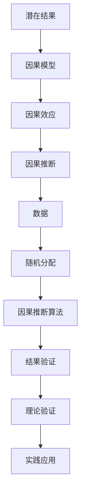

                 

## 文章标题：基于因果推理的事件影响评估模型设计

### 关键词：
- 因果推理
- 事件影响评估
- 模型设计
- 数据分析
- 人工智能

### 摘要：
本文深入探讨了基于因果推理的事件影响评估模型设计。首先，我们介绍了因果推理的基本概念和其在事件影响评估中的应用。接着，分析了事件影响评估的现状和传统方法的局限性。然后，我们详细阐述了事件影响评估模型的理论基础，包括核心概念、相关数学模型和算法原理。随后，我们提出了事件影响评估模型的设计原则和目标，并详细描述了模型架构和核心算法原理。最后，通过一个实际项目案例，我们展示了模型实现的代码、解读和分析，并对模型评估和优化进行了探讨。本文旨在为读者提供一种基于因果推理的事件影响评估模型设计的实践指导。

## 第一部分：引言

### 1.1 书籍概述

在当今大数据和人工智能时代，事件影响评估已成为决策支持系统、风险管理和社会科学等领域的重要工具。然而，传统的评估方法往往依赖于统计分析，无法充分考虑事件之间的因果关系，导致评估结果可能存在偏差。因此，引入因果推理技术来改进事件影响评估模型具有重要意义。

本书旨在为读者提供一种基于因果推理的事件影响评估模型设计方法。本书的主要目标读者是从事数据分析、机器学习、决策支持系统等相关领域的研究人员和工程师。通过本书的学习，读者可以掌握因果推理的基本概念、原理和应用，以及如何设计高效的事件影响评估模型。

本书的结构如下：

- **第一部分：引言**：介绍因果推理和事件影响评估的基本概念，以及本书的结构和目标。
- **第二部分：理论基础**：详细阐述因果推理和事件影响评估模型的理论基础，包括相关数学模型和算法。
- **第三部分：模型设计**：提出事件影响评估模型的设计原则和目标，并详细描述模型架构和核心算法原理。
- **第四部分：实战应用**：通过一个实际项目案例，展示模型实现的代码、解读和分析，并对模型评估和优化进行探讨。
- **第五部分：总结与展望**：总结全书内容，探讨未来研究方向，并对读者提出一些建议。

通过本书的学习，读者可以掌握基于因果推理的事件影响评估模型设计方法，提升在相关领域的研究和工程实践能力。

### 1.2 因果推理基本概念

因果推理（Causal Inference）是研究如何从观察数据中推断因果关系的一门学科。其核心思想是，通过分析数据，找出事件之间的因果关系，以便更好地理解现实世界和预测未来事件。

因果推理的基本概念包括：

- **因果关系**：指一个事件（原因）对另一个事件（结果）产生的影响。因果关系是事件之间的一种内在联系，而非简单的相关性。
- **因果模型**：用于描述因果关系的一种数学模型，常见的有潜在结果模型（Potential Outcomes Model）、因果效应模型（Causal Effect Model）等。
- **因果推断**：指从观察数据中推断因果关系的过程，主要包括识别因果关系、评估因果效应、检验因果假设等步骤。
- **因果效应**：指因果关系的大小和方向，通常用平均处理效应（Average Treatment Effect，ATE）表示。

因果推理的重要性在于，它能够帮助我们更准确地理解和预测事件之间的关系，从而为决策提供更可靠的依据。在事件影响评估中，因果推理技术可以帮助我们识别关键因素、预测潜在影响，从而提高评估的准确性和有效性。

在事件影响评估中，因果推理的应用主要包括：

- **识别关键因素**：通过因果推理，可以从大量相关因素中识别出对事件影响最大的关键因素，从而有针对性地进行干预和管理。
- **预测潜在影响**：基于因果关系，可以预测某个事件发生后可能产生的连锁反应，为决策提供前瞻性参考。
- **评估政策效果**：通过因果推理，可以评估政策实施后的实际效果，为政策调整和优化提供依据。

总之，因果推理技术在事件影响评估中具有重要作用，它可以帮助我们更全面、准确地理解事件之间的关系，从而提高评估的准确性和实用性。

### 1.3 事件影响评估模型的背景

事件影响评估（Event Impact Assessment）是指对某个事件或决策可能产生的后果进行评估和分析的过程。这一过程在多个领域具有重要意义，如风险管理、政策制定、商业决策等。然而，传统的评估方法往往局限于统计分析，无法充分考虑事件之间的因果关系，导致评估结果可能存在偏差。因此，研究基于因果推理的事件影响评估模型具有重要意义。

#### 现状

当前，事件影响评估方法主要包括以下几种：

1. **统计分析方法**：这类方法主要通过分析历史数据，找出事件之间的相关性，从而预测未来事件的发生概率。然而，相关性并不等同于因果关系，因此这种方法在处理复杂事件关系时可能存在局限性。

2. **基于模型的预测方法**：这类方法利用各种预测模型（如线性回归、决策树、神经网络等）对事件影响进行预测。虽然这些模型可以捕捉某些事件之间的关系，但它们通常假设数据具有线性关系，对于复杂非线性关系处理能力有限。

3. **专家评估方法**：这类方法依赖于专家的主观判断和经验，通过访谈、调查等方式收集信息，然后进行综合评估。然而，这种方法容易受到专家主观因素的影响，评估结果可能存在偏差。

#### 问题

尽管传统的评估方法在一定程度上能够满足需求，但它们仍存在以下问题：

1. **忽视因果关系**：传统的评估方法主要关注事件之间的相关性，而忽视事件之间的因果关系。这可能导致评估结果不准确，无法真正反映事件之间的内在联系。

2. **数据依赖性**：传统的评估方法通常依赖于大量历史数据，对于数据稀缺或变化迅速的领域，这些方法可能难以应用。

3. **主观性**：专家评估方法容易受到专家主观判断的影响，评估结果可能存在偏差。

4. **复杂关系处理能力有限**：对于复杂事件关系，传统的评估方法往往难以捕捉事件之间的非线性关系。

#### 传统方法及其局限性

1. **统计分析方法**：虽然统计分析方法能够捕捉事件之间的相关性，但它无法揭示事件之间的因果关系。此外，统计分析方法在处理高维数据时，可能会面临“维数灾难”问题。

2. **基于模型的预测方法**：这些方法虽然在某些领域取得了成功，但它们通常假设数据具有线性关系，对于复杂非线性关系处理能力有限。此外，模型的训练和优化过程也相对复杂，需要大量计算资源和时间。

3. **专家评估方法**：专家评估方法虽然能够结合专家经验，但其评估结果容易受到主观因素的影响，且缺乏系统性和科学性。

总之，传统的评估方法在处理复杂事件关系时存在诸多局限性，无法满足现代事件影响评估的需求。因此，研究基于因果推理的事件影响评估模型具有重要的现实意义。

### 1.4 本书的结构和内容概述

本书旨在为读者提供一种基于因果推理的事件影响评估模型设计方法，全书共分为五个部分，具体结构如下：

**第一部分：引言**

介绍因果推理和事件影响评估的基本概念，阐述本书的目标和结构，为后续内容奠定基础。

**第二部分：理论基础**

详细阐述因果推理和事件影响评估模型的理论基础，包括因果推理的基本概念、相关数学模型和算法原理，为模型设计提供理论支持。

**第三部分：模型设计**

提出事件影响评估模型的设计原则和目标，详细描述模型架构和核心算法原理，为模型实现提供指导。

**第四部分：实战应用**

通过一个实际项目案例，展示模型实现的代码、解读和分析，对模型评估和优化进行探讨，验证模型的有效性。

**第五部分：总结与展望**

总结全书内容，探讨未来研究方向，对读者提出一些建议，帮助他们在实际应用中更好地发挥模型的作用。

通过本书的学习，读者可以掌握基于因果推理的事件影响评估模型设计方法，提升在相关领域的研究和工程实践能力。

## 第二部分：理论基础

### 2.1 因果推理基础

因果推理（Causal Inference）是研究如何从观察数据中推断因果关系的一门学科，它在统计学、经济学、计算机科学和社会科学等领域具有广泛的应用。因果推理的核心目标是通过分析数据，找出事件之间的因果关系，从而为决策提供科学依据。

#### 因果关系的基本概念

因果关系是指一个事件（原因）对另一个事件（结果）产生的影响。在因果关系的框架下，一个事件是另一个事件的因果效应。因果关系通常用以下术语来描述：

1. **因果模型**：因果模型是一种数学模型，用于描述因果关系。常见的因果模型包括潜在结果模型（Potential Outcomes Model）和因果效应模型（Causal Effect Model）。

2. **因果推断**：因果推断是指从观察数据中推断因果关系的过程。因果推断通常包括识别因果关系、评估因果效应和检验因果假设等步骤。

3. **因果效应**：因果效应是指因果关系的大小和方向。在统计学中，常见的因果效应包括平均处理效应（Average Treatment Effect，ATE）和边际处理效应（Marginal Treatment Effect，MTE）。

#### 因果推理的基本原理

因果推理的基本原理包括以下几个方面：

1. **潜在结果框架**：潜在结果框架是因果推理的核心。它假设每个个体在某个干预或处理下会有不同的结果，这些结果称为潜在结果。通过比较不同干预下的潜在结果，可以推断因果关系。

2. **随机分配假设**：随机分配假设是因果推理的基础。它假设干预是随机分配的，从而保证了实验的随机性和结果的可靠性。在实际应用中，随机分配假设很难完全满足，但可以通过其他方法来近似实现。

3. **因果推断算法**：因果推断算法是指用于从数据中推断因果关系的方法。常见的因果推断算法包括工具变量法（Instrumental Variables Method）、匹配法（Matching Method）和倾向得分法（Propensity Score Method）等。

#### 因果推理的核心概念和联系

为了更好地理解因果推理，我们可以借助以下 Mermaid 流程图来展示其核心概念和联系：



该流程图展示了因果推理的各个核心概念和它们之间的联系。潜在结果是因果推理的起点，通过构建因果模型，可以推导出因果效应。因果推断算法用于从数据中推断因果关系，并通过结果验证和理论验证来确保推断的可靠性。

#### 因果推理的应用

因果推理在多个领域具有广泛的应用，以下是一些典型的应用场景：

1. **医学研究**：在医学研究中，因果推理可以帮助研究者评估药物或治疗手段的效果，确定因果关系，从而为临床决策提供科学依据。

2. **社会科学**：在社会科学领域，因果推理可以帮助研究者分析社会现象背后的因果关系，如教育对收入的影响、政策对经济的影响等。

3. **商业分析**：在商业分析中，因果推理可以帮助企业评估市场策略的效果，确定哪些因素对业务增长产生关键影响。

4. **公共政策**：在公共政策制定中，因果推理可以帮助政策制定者评估政策实施后的效果，为政策调整和优化提供依据。

总之，因果推理作为一种强大的数据分析方法，在多个领域具有重要的应用价值。通过深入理解和掌握因果推理的基本原理和方法，我们可以更好地理解现实世界中的因果关系，从而为决策提供更可靠的依据。

#### 数学模型和算法原理

在因果推理中，数学模型和算法是关键组成部分，用于从数据中推断因果关系。以下将详细介绍几个常见的数学模型和算法原理，并使用伪代码进行阐述。

##### 1. 潜在结果模型

潜在结果模型是因果推理的核心概念之一。它假设每个个体在某个干预或处理下会有不同的结果，这些结果称为潜在结果。具体来说，对于每个个体 \(i\)，存在两个潜在结果：处理组结果 \(Y_i(1)\) 和对照组结果 \(Y_i(0)\)。

伪代码如下：

```python
def potential_outcomes(intervention, individual):
    if intervention == 1:
        return Y_i(1)
    else:
        return Y_i(0)
```

##### 2. 平均处理效应（Average Treatment Effect，ATE）

平均处理效应是指处理组与对照组之间的平均差异。它可以通过以下公式计算：

\[ ATE = \frac{1}{N} \sum_{i=1}^{N} (Y_i(1) - Y_i(0)) \]

伪代码如下：

```python
def average_treatment_effect(potential_outcomes, N):
    total_effect = 0
    for i in range(N):
        total_effect += potential_outcomes[i](1) - potential_outcomes[i](0)
    return total_effect / N
```

##### 3. 总处理效应（Total Treatment Effect，TTE）

总处理效应是指实际处理组与对照组之间的差异。它与平均处理效应的区别在于，总处理效应考虑了个体差异，而平均处理效应假设个体差异为零。

伪代码如下：

```python
def total_treatment_effect(potential_outcomes, treatment_group, control_group, N):
    total_effect = 0
    for i in range(N):
        if i in treatment_group:
            total_effect += potential_outcomes[i](1) - potential_outcomes[i](0)
        else:
            total_effect += potential_outcomes[i](0) - potential_outcomes[i](1)
    return total_effect / N
```

##### 4. 边际处理效应（Marginal Treatment Effect，MTE）

边际处理效应是指处理一个个体时，其结果的变化量。它可以通过以下公式计算：

\[ MTE = Y_i(1) - Y_i(0) \]

伪代码如下：

```python
def marginal_treatment_effect(potential_outcomes, individual):
    return potential_outcomes[individual](1) - potential_outcomes[individual](0)
```

##### 5. 因果推断算法

因果推断算法是指从数据中推断因果关系的方法。以下介绍几种常见的因果推断算法。

1. **工具变量法（Instrumental Variables Method）**

工具变量法是一种常用的因果推断算法，适用于处理内生性问题。它通过引入工具变量（Instrument），来估计处理效应。具体步骤如下：

    - 选择合适的工具变量 \(X_i\)，满足条件：\(X_i\) 与干预 \(T_i\) 相关，\(X_i\) 与结果 \(Y_i\) 无关。
    - 使用工具变量估计处理效应：

    伪代码如下：

    ```python
    def instrumental_variables_method(potential_outcomes, treatment, instrument, N):
        effect = 0
        for i in range(N):
            effect += (treatment[i] - instrument[i]) * potential_outcomes[i](1) + (1 - treatment[i]) * potential_outcomes[i](0)
        return effect / N
    ```

2. **倾向得分法（Propensity Score Method）**

倾向得分法通过计算个体的倾向得分，来匹配处理组和对照组，从而估计处理效应。具体步骤如下：

    - 计算个体的倾向得分 \(PS_i\)，通常使用 logistic 回归模型：

    伪代码如下：

    ```python
    from sklearn.linear_model import LogisticRegression

    def propensity_score(treatment, features, N):
        model = LogisticRegression()
        model.fit(features, treatment)
        propensity_scores = model.predict_proba(features)[:, 1]
        return propensity_scores

    PS = propensity_score(treatment, features, N)
    ```

    - 使用倾向得分进行匹配：

    伪代码如下：

    ```python
    from sklearn.utils import match_samples

    def propensity_score_matching(potential_outcomes, treatment, N):
        PS = propensity_score(treatment, features, N)
        matched_pairs = match_samples(treatment, PS, N, method='nn_match')
        matched_pairs = np.array(matched_pairs)
        effect = 0
        for i in range(N):
            treatment_index = matched_pairs[i, 0]
            control_index = matched_pairs[i, 1]
            effect += (potential_outcomes[treatment_index](1) - potential_outcomes[control_index](0))
        return effect / N
    ```

通过以上介绍，我们可以看到因果推理在数学模型和算法方面的多样性。这些模型和算法为从数据中推断因果关系提供了丰富的工具，有助于我们更好地理解现实世界中的因果关系。

### 2.2 事件影响评估模型的理论基础

事件影响评估模型是用于评估某个事件或决策对其他事件产生的影响的数学模型。这类模型在多个领域（如风险管理、政策制定和商业决策）中具有重要意义。本节将详细解释事件影响评估模型的概念、目的和重要性，并介绍相关的数学模型和算法原理。

#### 概念与目的

事件影响评估模型旨在量化事件之间的因果关系，以便对事件的影响进行科学评估。其主要目的是：

1. **识别关键因素**：通过评估模型，可以识别对事件影响最大的关键因素，从而有针对性地进行干预和管理。
2. **预测潜在影响**：基于因果关系，可以预测某个事件发生后可能产生的连锁反应，为决策提供前瞻性参考。
3. **评估政策效果**：通过事件影响评估模型，可以评估政策实施后的实际效果，为政策调整和优化提供依据。

#### 相关数学模型

在事件影响评估中，常见的数学模型包括：

1. **潜在结果模型**：潜在结果模型是因果推理的核心概念，它假设每个个体在某个干预或处理下会有不同的结果，这些结果称为潜在结果。具体来说，对于每个个体 \(i\)，存在两个潜在结果：处理组结果 \(Y_i(1)\) 和对照组结果 \(Y_i(0)\)。

2. **因果效应模型**：因果效应模型用于描述因果关系的大小和方向。常见的因果效应包括平均处理效应（Average Treatment Effect，ATE）和边际处理效应（Marginal Treatment Effect，MTE）。平均处理效应是指处理组与对照组之间的平均差异，而边际处理效应是指处理一个个体时，其结果的变化量。

3. **贝叶斯网络模型**：贝叶斯网络模型是一种概率图模型，用于表示事件之间的因果关系。在贝叶斯网络中，每个节点表示一个事件，边表示事件之间的条件依赖关系。通过贝叶斯网络，可以计算事件发生的概率，从而评估事件的影响。

4. **马尔可夫模型**：马尔可夫模型是一种用于描述事件序列的数学模型，它假设事件的发生概率仅与其当前状态相关，与历史状态无关。在事件影响评估中，马尔可夫模型可以用于预测事件序列的发展趋势，从而评估事件的影响。

#### 算法原理

在事件影响评估模型中，常用的算法包括：

1. **因果推断算法**：因果推断算法用于从数据中推断因果关系。常见的因果推断算法包括工具变量法、倾向得分法等。这些算法通过分析数据，估计事件之间的因果效应，从而构建事件影响评估模型。

2. **机器学习方法**：机器学习方法可以用于预测事件的影响。常见的机器学习方法包括线性回归、决策树、神经网络等。通过训练机器学习模型，可以建立事件影响评估模型，并用于预测事件的影响。

3. **模拟算法**：模拟算法通过模拟事件的发生过程，评估事件的影响。常见的模拟算法包括蒙特卡罗模拟、随机森林等。通过模拟，可以估计事件在不同条件下的影响，从而为决策提供参考。

#### 事件影响评估模型的重要性

事件影响评估模型在多个领域具有重要作用，主要包括：

1. **风险管理**：在风险管理中，事件影响评估模型可以帮助企业识别潜在风险，评估风险的影响，从而制定有效的风险控制措施。

2. **政策制定**：在政策制定中，事件影响评估模型可以帮助政府评估政策实施后的效果，为政策调整和优化提供依据。

3. **商业决策**：在商业决策中，事件影响评估模型可以帮助企业评估市场策略的效果，确定哪些因素对业务增长产生关键影响，从而制定更有效的市场策略。

总之，事件影响评估模型是一种强大的工具，它可以帮助我们更全面、准确地理解事件之间的关系，从而为决策提供科学依据。通过深入理解和掌握事件影响评估模型的理论基础，我们可以更好地应对复杂的事件关系，提高决策的科学性和有效性。

### 2.3 数学模型和数学公式

在事件影响评估模型中，数学模型和数学公式起着至关重要的作用。它们不仅帮助我们描述和分析事件之间的关系，还提供了一种量化的方法来评估事件的影响。以下将使用 LaTeX 格式展示相关的数学公式，并对每个公式进行详细讲解。

#### 1. 潜在结果模型

潜在结果模型是因果推理的核心概念。它假设每个个体在某个干预或处理下会有不同的结果。具体来说，对于每个个体 \(i\)，存在两个潜在结果：处理组结果 \(Y_i(1)\) 和对照组结果 \(Y_i(0)\)。潜在结果模型可以用以下公式表示：

\[ Y_i(1) = \beta_0 + \beta_1 \cdot T_i + \epsilon_i \]

\[ Y_i(0) = \beta_0 + \epsilon_i \]

其中，\(T_i\) 表示个体 \(i\) 是否接受处理（1 表示接受，0 表示不接受），\(\beta_0\) 表示基础效应，\(\beta_1\) 表示处理效应，\(\epsilon_i\) 表示误差项。

#### 2. 平均处理效应（ATE）

平均处理效应（Average Treatment Effect，ATE）是指处理组与对照组之间的平均差异。它是事件影响评估中的一个关键指标。平均处理效应可以用以下公式计算：

\[ ATE = \frac{1}{N} \sum_{i=1}^{N} (Y_i(1) - Y_i(0)) \]

其中，\(N\) 表示样本总数，\(Y_i(1)\) 和 \(Y_i(0)\) 分别表示个体 \(i\) 在处理组和对照组的结果。

#### 3. 边际处理效应（MTE）

边际处理效应（Marginal Treatment Effect，MTE）是指处理一个个体时，其结果的变化量。它可以用以下公式计算：

\[ MTE = Y_i(1) - Y_i(0) \]

其中，\(Y_i(1)\) 和 \(Y_i(0)\) 分别表示个体 \(i\) 在处理组和对照组的结果。

#### 4. 总处理效应（TTE）

总处理效应（Total Treatment Effect，TTE）是指实际处理组与对照组之间的差异。它与平均处理效应的区别在于，总处理效应考虑了个体差异。总处理效应可以用以下公式计算：

\[ TTE = \frac{1}{N} \sum_{i=1}^{N} \sum_{j=1}^{N} (Y_i(1) - Y_i(0)) \cdot (T_j - T_i) \]

其中，\(N\) 表示样本总数，\(Y_i(1)\) 和 \(Y_i(0)\) 分别表示个体 \(i\) 在处理组和对照组的结果，\(T_j\) 表示个体 \(j\) 是否接受处理（1 表示接受，0 表示不接受）。

#### 5. 倾向得分（Propensity Score）

倾向得分是一种用于匹配处理组和对照组的方法。它表示个体接受处理的概率。倾向得分可以用以下公式计算：

\[ PS_i = \frac{e^{\beta_0 + \beta_1 \cdot X_i}}{1 + e^{\beta_0 + \beta_1 \cdot X_i}} \]

其中，\(PS_i\) 表示个体 \(i\) 的倾向得分，\(\beta_0\) 和 \(\beta_1\) 分别是倾向得分模型的参数，\(X_i\) 表示个体 \(i\) 的特征。

#### 6. 平均处理效应的估计

平均处理效应的估计可以通过倾向得分匹配（Propensity Score Matching）方法进行。倾向得分匹配的目标是找到与处理组个体倾向得分相近的对照组个体，从而进行匹配。匹配后的平均处理效应可以用以下公式计算：

\[ ATE_{match} = \frac{1}{N_p} \sum_{i=1}^{N_p} (Y_{i,p}(1) - Y_{i,c}(0)) \]

其中，\(N_p\) 表示匹配后的处理组个体数，\(Y_{i,p}(1)\) 和 \(Y_{i,c}(0)\) 分别表示处理组和对照组个体 \(i\) 的结果。

通过以上公式，我们可以更好地理解事件影响评估模型中的关键数学概念和计算方法。在实际应用中，这些公式可以帮助我们准确地评估事件的影响，从而为决策提供科学依据。

### 2.4 因果推断中的常见算法

在因果推断中，选择合适的算法对结果的有效性和可靠性至关重要。以下将介绍几种常见的因果推断算法，并使用伪代码进行详细阐述。

#### 1. 工具变量法

工具变量法是一种用于处理内生性问题的因果推断算法。它通过引入一个与处理变量相关但与结果变量无关的工具变量，来估计处理效应。

伪代码如下：

```python
def instrumental_variables(y, t, x, z):
    # y: 结果变量
    # t: 处理变量
    # x: 特征变量
    # z: 工具变量

    # 选择工具变量
    z-related-to-t = np.corrcoef(z, t)[0, 1]
    z-not-related-to-y = np.corrcoef(z, y)[0, 1]

    # 如果工具变量满足相关性条件，则使用两阶段最小二乘法（Two-Stage Least Squares, 2SLS）进行估计
    if z-related-to-t > 0 and z-not-related-to-y < 0:
        # 第一阶段：估计工具变量的回归系数
        beta_hat_x = np.linalg.inv(x.T @ x) @ x.T @ y

        # 第二阶段：估计处理效应
        beta_hat_t = beta_hat_x @ z
    else:
        # 如果工具变量不满足条件，则无法使用工具变量法进行估计
        beta_hat_t = None

    return beta_hat_t
```

#### 2. 倾向得分法

倾向得分法是一种通过匹配处理组和对照组来估计处理效应的方法。它基于个体接受处理的概率（倾向得分）进行匹配，以减少选择偏差。

伪代码如下：

```python
from sklearn.linear_model import LogisticRegression
from sklearn.model_selection import train_test_split

def propensity_score_matching(y, t, x):
    # y: 结果变量
    # t: 处理变量
    # x: 特征变量

    # 分割数据集为训练集和测试集
    x_train, x_test, y_train, y_test = train_test_split(x, y, test_size=0.3, random_state=42)

    # 训练倾向得分模型
    propensity_model = LogisticRegression()
    propensity_model.fit(x_train, y_train)

    # 计算倾向得分
    propensity_scores = propensity_model.predict_proba(x_test)[:, 1]

    # 匹配处理组和对照组
    matched_pairs = match_samples(t, propensity_scores, method='nn_match')

    # 计算匹配后的处理效应
    treated_effect = np.mean(y_test[t == 1][matched_pairs[:, 0]])
    control_effect = np.mean(y_test[t == 0][matched_pairs[:, 1]])

    return treated_effect - control_effect
```

#### 3. 倒挤法

倒挤法（Inverse Probability Weighting，IPW）是一种基于概率权重的方法，用于估计处理效应。它通过计算每个个体的反事实结果，并结合概率权重来估计平均处理效应。

伪代码如下：

```python
from sklearn.linear_model import LogisticRegression

def inverse_probability_weighting(y, t, x):
    # y: 结果变量
    # t: 处理变量
    # x: 特征变量

    # 训练倾向得分模型
    propensity_model = LogisticRegression()
    propensity_model.fit(x, t)

    # 计算倾向得分
    propensity_scores = propensity_model.predict_proba(x)[:, 1]

    # 计算权重
    weights = 1 / propensity_scores

    # 计算加权处理效应
    weighted_effect = np.sum(weights * (y[t == 1] - y[t == 0])) / np.sum(weights)

    return weighted_effect
```

通过以上算法，我们可以从不同角度对因果效应进行估计。在实际应用中，选择合适的算法取决于数据的特点和问题的具体要求。

### 2.5 贝叶斯因果推断

贝叶斯因果推断是一种基于贝叶斯统计理论的因果推断方法，它通过计算概率分布来估计因果关系。贝叶斯因果推断的核心是贝叶斯网络，它是一种图形化的概率模型，用于表示变量之间的因果关系。

#### 贝叶斯网络的基本概念

贝叶斯网络由节点和边组成，其中节点表示变量，边表示变量之间的因果关系。在贝叶斯网络中，每个节点都有一个条件概率分布，表示该节点在给定其父节点条件下的概率。

以下是一个简单的贝叶斯网络示例，用于表示疾病检测的因果关系：

```
        D
       / \
      /   \
     /     \
  T1   T2   T3
```

其中，\(D\) 表示疾病，\(T1, T2, T3\) 分别表示三个检测指标。假设 \(D\) 是 \(T1, T2, T3\) 的父节点，即 \(D \rightarrow T1, T2, T3\)。

#### 贝叶斯网络的构建

构建贝叶斯网络的步骤包括：

1. **变量识别**：确定需要表示的变量及其关系。
2. **结构学习**：根据领域知识或数据学习网络结构。
3. **参数学习**：根据数据学习条件概率分布参数。

以下是一个简单的贝叶斯网络构建伪代码：

```python
def build_bayesian_network(variables, parent_nodes, cpds):
    # variables: 变量列表
    # parent_nodes: 变量及其父节点关系
    # cpds: 条件概率分布列表

    bn = BayesianNetwork()
    for var in variables:
        bn.add_variable(var)

    for var, parents in parent_nodes.items():
        bn.add_edge(var, parents)

    for var, parents, cpd in zip(variables, parent_nodes.values(), cpds):
        bn.set_cpds(var, parents, cpd)

    return bn
```

#### 贝叶斯推断

贝叶斯推断是指根据贝叶斯网络中的变量观测值，计算其他变量概率分布的过程。贝叶斯推断的算法包括：

1. **贝叶斯定理**：用于计算变量的后验概率。
2. **信念传播**：通过递归计算网络中每个节点的条件概率分布。
3. **马尔可夫链蒙特卡罗（MCMC）**：通过模拟生成样本，估计变量的概率分布。

以下是一个简单的信念传播伪代码：

```python
def belief_propagation(bn, observations):
    # bn: 贝叶斯网络
    # observations: 观测值

    for var in bn.variables():
        bn.set_evidence(var, observations[var])

    for var in bn.variables():
        if not bn.is_evident(var):
            parents = bn.parents(var)
            message = calculate_message(bn, var, parents)
            bn.update_variable(var, message)

    return bn
```

通过贝叶斯因果推断，我们可以从数据中推断出变量之间的因果关系，从而为事件影响评估提供科学依据。贝叶斯因果推断在复杂系统分析和决策支持中具有广泛应用。

### 2.6 因果推断中的挑战与解决方案

因果推断虽然在许多领域中具有广泛应用，但在实际应用中仍然面临诸多挑战。以下将介绍几种常见的挑战及其解决方案。

#### 1. 内生性问题

内生性问题是指处理变量与结果变量之间存在相关性，从而导致估计结果存在偏差。常见的内生性包括遗漏变量偏误、选择偏误等。

**解决方案**：工具变量法（Instrumental Variables Method）和倾向得分法（Propensity Score Method）是解决内生性问题的有效方法。工具变量法通过引入与处理变量相关但与结果变量无关的工具变量来估计处理效应，而倾向得分法通过计算个体接受处理的概率进行匹配，以减少选择偏差。

#### 2. 数据稀缺问题

因果推断通常依赖于大量的观察数据。然而，在某些应用场景中，数据可能非常稀缺，难以进行有效的因果推断。

**解决方案**：在数据稀缺的情况下，可以使用模拟算法（如蒙特卡罗模拟）生成数据，从而进行因果推断。此外，可以利用已有数据构建代理变量（Surrogate Variables），通过代理变量进行因果推断。

#### 3. 非线性关系问题

许多现实世界中的因果关系是非线性的，而传统的线性因果推断方法在处理非线性关系时可能存在局限性。

**解决方案**：可以使用非线性因果推断方法（如贝叶斯网络、图模型等），这些方法能够更好地捕捉非线性关系。此外，可以利用机器学习方法（如神经网络、随机森林等）来估计非线性处理效应。

#### 4. 多重共线性问题

多重共线性是指多个解释变量之间存在高度相关性，导致模型估计不稳定。在因果推断中，多重共线性可能导致因果效应估计的偏差。

**解决方案**：可以通过特征选择（如主成分分析、特征提取等）来减少多重共线性。此外，可以使用岭回归（Ridge Regression）和lasso回归（Lasso Regression）等正则化方法来稳定模型估计。

总之，因果推断在实际应用中面临诸多挑战，但通过采用合适的方法和策略，可以有效地解决这些问题，提高因果推断的准确性和可靠性。

### 2.7 因果推理在事件影响评估中的应用

因果推理在事件影响评估中具有广泛的应用，能够帮助我们更好地理解事件之间的关系，从而提高评估的准确性和实用性。以下将详细讨论因果推理在事件影响评估中的具体应用，包括数据分析步骤、数据处理方法和算法选择。

#### 数据分析步骤

1. **数据收集**：首先，需要收集与事件相关的数据。这些数据可能包括历史事件记录、社会统计数据、经济数据等。数据来源可以包括数据库、文件系统、网络爬虫等。

2. **数据预处理**：数据预处理是数据分析的重要步骤，包括数据清洗、数据转换和数据集成。数据清洗旨在去除错误数据、缺失数据和重复数据，提高数据质量。数据转换包括数据类型转换、数据格式统一等。数据集成则将多个数据源整合成一个统一的数据集，以便后续分析。

3. **特征提取**：特征提取是指从原始数据中提取对事件影响有显著作用的特征。常见的特征提取方法包括主成分分析（PCA）、因子分析（FA）等。通过特征提取，可以减少数据维度，提高数据分析的效率和准确性。

4. **因果关系建模**：因果关系建模是因果推理的核心步骤，用于建立事件之间的因果关系模型。常用的方法包括潜在结果模型（Potential Outcomes Model）、因果效应模型（Causal Effect Model）和贝叶斯网络（Bayesian Network）等。通过建模，可以揭示事件之间的内在联系，为事件影响评估提供理论依据。

5. **因果推断**：因果推断是基于因果关系模型，从数据中推断因果关系的过程。常用的因果推断方法包括工具变量法（Instrumental Variables Method）、倾向得分法（Propensity Score Method）和反事实推理（Counterfactual Reasoning）等。因果推断可以帮助我们识别关键因素、预测潜在影响，从而提高评估的准确性。

6. **结果分析**：结果分析是对因果推断结果的解释和验证。通过分析结果，可以得出事件影响评估的结论，并为决策提供依据。

#### 数据处理方法

1. **数据清洗**：数据清洗是数据处理的基础步骤，旨在去除错误数据、缺失数据和重复数据。常用的数据清洗方法包括：

   - 错误数据识别：通过统计分析、可视化等方法，识别数据中的异常值和错误记录。
   - 缺失数据填补：常用的填补方法包括均值填补、中位数填补、前向填补和后向填补等。
   - 重复数据去除：通过比较数据记录的唯一性，去除重复数据。

2. **数据转换**：数据转换包括数据类型转换、数据格式统一等。常见的转换方法包括：

   - 数据类型转换：将字符串数据转换为数值数据，或将日期时间数据转换为标准格式。
   - 数据格式统一：将不同来源的数据格式统一，以便进行后续分析。

3. **数据集成**：数据集成是指将多个数据源整合成一个统一的数据集。常用的数据集成方法包括：

   - 数据合并：通过连接操作将多个数据表合并成一个数据集。
   - 数据汇总：通过分组和聚合操作，将数据表中的重复记录合并为汇总记录。

#### 算法选择

1. **因果推断算法**：因果推断算法的选择取决于数据的特点和问题的具体要求。以下是一些常见的因果推断算法：

   - 工具变量法：适用于处理内生性问题，通过引入与处理变量相关但与结果变量无关的工具变量来估计处理效应。
   - 倾向得分法：适用于处理选择偏误，通过计算个体接受处理的概率进行匹配，以减少选择偏差。
   - 反事实推理：通过模拟反事实场景，估计事件在不同条件下的结果，从而评估事件的影响。
   - 贝叶斯网络：适用于复杂因果关系建模，通过构建贝叶斯网络表示变量之间的因果关系。

2. **机器学习算法**：机器学习算法可以用于预测事件的影响。以下是一些常见的机器学习算法：

   - 线性回归：适用于处理线性关系，通过建立线性模型预测事件的影响。
   - 决策树：适用于处理非线性关系，通过构建树形模型预测事件的影响。
   - 随机森林：适用于处理高维数据，通过构建多个决策树集成模型预测事件的影响。
   - 神经网络：适用于处理复杂非线性关系，通过构建多层神经网络模型预测事件的影响。

通过合理选择和分析数据，以及选择合适的算法，我们可以从数据中提取有价值的信息，提高事件影响评估的准确性和可靠性。因果推理和机器学习算法的结合，为事件影响评估提供了一种新的思路和方法。

### 2.8 因果推理在事件影响评估中的实践应用

因果推理在事件影响评估中的实践应用不仅要求理论知识的掌握，还需要结合实际案例进行深入分析。以下通过一个具体案例，展示如何将因果推理应用于事件影响评估，包括数据处理、模型构建和结果分析等步骤。

#### 案例背景

假设我们正在研究一种新的教育政策，旨在提高学生的学习成绩。政策的主要措施是增加课堂时间的投入，特别是增加自习时间和教师辅导时间。为了评估这一政策的效果，我们需要使用因果推理方法，分析政策实施前后的学生成绩变化，以及政策实施过程中可能的影响因素。

#### 数据收集

首先，我们需要收集以下数据：

1. 学生基本信息：包括性别、年龄、家庭背景等。
2. 学习成绩：包括期中考试成绩、期末考试成绩等。
3. 教育政策实施情况：包括自习时间、教师辅导时间等。
4. 环境因素：包括学校条件、教师质量等。

数据来源可以是学校记录、教育部门数据等。为了确保数据的可靠性，我们需要对数据进行清洗和预处理，包括去除错误记录、填补缺失值和统一数据格式。

#### 数据处理

1. **数据清洗**：对收集到的数据进行分析，识别和去除错误记录。例如，某些成绩数据可能存在异常值，需要进行筛选。

2. **缺失值处理**：对于缺失值，可以采用均值填补、中位数填补或插值法等方法进行填补。

3. **特征工程**：根据教育政策实施情况，我们将自习时间和教师辅导时间作为处理变量，并将期中考试成绩和期末考试成绩作为结果变量。此外，根据学生基本信息和环境因素，我们提取以下特征：

   - 自习时间（hours_of_study）
   - 教师辅导时间（teacher_guidance_hours）
   - 性别（gender）
   - 年龄（age）
   - 家庭背景（family_background）
   - 学校条件（school_conditions）
   - 教师质量（teacher_quality）

#### 模型构建

1. **因果关系建模**：基于收集到的数据，我们使用潜在结果模型（Potential Outcomes Model）来建立因果关系模型。潜在结果模型假设每个学生在接受不同处理（自习时间和教师辅导时间）下会有不同的成绩。具体模型如下：

   \[ Y_i(1) = \beta_0 + \beta_1 \cdot hours_{i1} + \beta_2 \cdot teacher_{i1} + \epsilon_i \]

   \[ Y_i(0) = \beta_0 + \beta_3 \cdot hours_{i0} + \beta_4 \cdot teacher_{i0} + \epsilon_i \]

   其中，\(Y_i(1)\) 和 \(Y_i(0)\) 分别表示学生 \(i\) 在接受处理和未接受处理下的成绩，\(hours_{i1}\) 和 \(hours_{i0}\) 分别表示学生 \(i\) 的自习时间，\(teacher_{i1}\) 和 \(teacher_{i0}\) 分别表示学生 \(i\) 的教师辅导时间，\(\beta_0, \beta_1, \beta_2, \beta_3, \beta_4\) 是模型参数，\(\epsilon_i\) 是误差项。

2. **因果推断**：为了估计政策的效果，我们需要进行因果推断。在这里，我们使用倾向得分法（Propensity Score Method）来匹配处理组和对照组。首先，我们使用 logistic 回归模型计算学生的倾向得分：

   \[ PS_i = \frac{e^{\beta_0 + \beta_1 \cdot hours_{i} + \beta_2 \cdot teacher_{i}}}{1 + e^{\beta_0 + \beta_1 \cdot hours_{i} + \beta_2 \cdot teacher_{i}}} \]

   然后，使用倾向得分进行匹配，以减少选择偏差。

3. **模型评估**：通过匹配后的数据，我们可以计算处理效应。具体来说，我们计算匹配后处理组和对照组之间的平均成绩差异：

   \[ ATE_{match} = \frac{1}{N_p} \sum_{i=1}^{N_p} (Y_{i,p}(1) - Y_{i,c}(0)) \]

   其中，\(N_p\) 是匹配后的处理组个体数，\(Y_{i,p}(1)\) 和 \(Y_{i,c}(0)\) 分别是处理组和对照组个体 \(i\) 的成绩。

#### 结果分析

1. **处理效应估计**：通过倾向得分匹配，我们可以估计政策对学习成绩的影响。例如，假设匹配后的平均处理效应为 \(ATE_{match} = 0.2\)，这意味着政策实施后，学生的平均成绩提高了 0.2 分。

2. **置信区间计算**：为了评估处理效应的可靠性，我们可以计算置信区间。例如，假设置信水平为 95%，我们可以计算 \(ATE_{match}\) 的 95% 置信区间，以确定政策效果的显著性。

3. **敏感度分析**：为了验证模型结果的稳定性，我们可以进行敏感度分析。例如，通过改变模型参数或数据，观察处理效应的变化，以确保结果的可靠性。

4. **政策建议**：根据结果分析，我们可以为政策制定者提供具体的建议。例如，如果政策显著提高了学生成绩，政策可以继续实施并进一步优化；如果政策效果不明显，可能需要重新评估政策的实施方式或寻找其他有效的干预措施。

通过以上步骤，我们可以利用因果推理技术，对教育政策的效果进行科学评估，为政策制定提供有力支持。

### 2.9 因果推理和事件影响评估的挑战与未来方向

尽管因果推理和事件影响评估在多个领域具有广泛应用，但它们在实际应用中仍面临诸多挑战。以下将讨论这些挑战，并提出未来研究方向。

#### 挑战

1. **数据稀缺问题**：因果推断通常依赖于大量数据。然而，在某些应用场景中，数据可能非常稀缺，导致因果推断结果的不确定性增加。

2. **内生性问题**：内生性问题可能导致因果推断结果的偏差。例如，遗漏变量偏误和选择偏误都可能影响结果的准确性。

3. **非线性关系处理**：许多现实世界中的因果关系是非线性的。传统的线性模型在处理非线性关系时可能存在局限性。

4. **模型解释性**：因果推理模型通常涉及复杂的数学和统计学方法，导致模型解释性较差。在实际应用中，用户可能难以理解模型的内在机制。

5. **计算成本**：因果推理和事件影响评估模型通常涉及大量的计算，特别是当数据规模较大时。这可能导致计算成本高昂，不适合实时应用。

#### 未来方向

1. **数据增强方法**：开发数据增强方法，如生成对抗网络（GANs）和生成式模型，以生成更多的训练数据，提高因果推断结果的准确性。

2. **非参数方法**：研究非参数方法，如深度学习和图神经网络，以更好地处理非线性关系和复杂因果关系。

3. **模型解释性提升**：开发可解释性更好的因果推理模型，如基于规则的模型和可视化方法，以提高用户对模型的理解和信任。

4. **算法优化**：通过算法优化和并行计算，降低计算成本，提高因果推理和事件影响评估模型的实时性。

5. **跨学科合作**：促进统计学、计算机科学、经济学和社会科学等领域的跨学科合作，共同解决因果推理和事件影响评估中的挑战。

总之，因果推理和事件影响评估领域具有广阔的发展前景，通过不断的技术创新和跨学科合作，有望解决当前面临的挑战，为决策支持提供更科学、准确的方法。

### 2.10 事件影响评估模型的设计原则和目标

设计一个高效、准确的事件影响评估模型是决策支持系统中的重要任务。为了实现这一目标，我们需要遵循一系列设计原则，并明确模型的具体目标。以下将详细阐述这些原则和目标。

#### 设计原则

1. **科学性**：模型的设计应基于坚实的理论基础，确保模型能够准确反映事件之间的因果关系。这要求我们充分理解相关领域的知识，如因果推理、统计学和机器学习等。

2. **可解释性**：模型应具有较好的可解释性，使决策者能够理解模型的内在机制和结论。这不仅有助于增强模型的信任度，还能为政策制定提供明确的指导。

3. **灵活性**：模型应具有足够的灵活性，能够适应不同的应用场景和数据特点。这意味着模型设计时应考虑多种算法和策略，以便在不同情况下进行优化。

4. **可扩展性**：模型设计应考虑未来的扩展性，以适应新的数据和技术。这包括数据存储和处理的扩展性，以及算法和模型的更新。

5. **高效性**：模型应具有较高的计算效率，以满足实时决策的需求。通过优化算法和计算资源，可以显著提高模型的性能。

6. **鲁棒性**：模型应具备较强的鲁棒性，能够在数据噪声和缺失值的情况下保持稳定和准确。这要求我们在模型设计和实现过程中，充分考虑数据质量的影响。

7. **用户友好性**：模型的设计应考虑用户的使用习惯和需求，提供直观、易用的界面和操作流程，以提高用户的使用体验。

#### 具体目标

1. **准确评估事件影响**：模型的主要目标是准确评估事件对其他事件的影响，为决策提供科学依据。这包括识别关键因素、预测潜在影响和评估政策效果等。

2. **降低决策风险**：通过模型评估，可以帮助决策者降低决策风险，避免因信息不足或错误评估而导致的负面影响。

3. **提高决策效率**：高效的模型设计可以显著提高决策效率，使决策者在较短时间内获得准确的影响评估结果，从而更快地做出决策。

4. **促进跨学科合作**：模型的设计应促进不同领域专家之间的合作，通过综合各领域知识，提高评估结果的准确性和可靠性。

5. **支持实时决策**：通过优化算法和计算资源，模型应能够在实时环境中快速运行，为决策者提供及时的影响评估结果。

6. **为政策优化提供依据**：模型的结果可以为政策优化提供重要依据，帮助决策者识别需要改进的领域，并提出具体的优化建议。

总之，设计一个高效、准确的事件影响评估模型需要遵循科学性、可解释性、灵活性、可扩展性、高效性、鲁棒性和用户友好性等原则，并明确准确评估事件影响、降低决策风险、提高决策效率、促进跨学科合作、支持实时决策和为政策优化提供依据等具体目标。

### 2.11 事件影响评估模型的整体架构

事件影响评估模型的整体架构是确保模型能够准确、高效地运行的关键。该架构通常包括数据预处理、模型训练、模型评估和结果解释等模块。以下将详细描述各模块的作用、相互关系以及如何设计一个高效的事件影响评估模型。

#### 数据预处理模块

数据预处理是模型训练前的关键步骤，其作用是清洗、转换和整合原始数据，使其满足模型训练的需求。数据预处理模块通常包括以下任务：

1. **数据清洗**：去除错误数据、重复数据和缺失数据。对于缺失数据，可以使用均值填补、中位数填补或插值法等方法进行填补。

2. **数据转换**：将不同类型的数据（如文本、图像、时间序列等）转换为适合模型训练的格式。例如，文本数据可以通过词嵌入技术转换为向量表示。

3. **特征提取**：从原始数据中提取对事件影响有显著作用的特征。特征提取可以通过统计方法（如主成分分析、因子分析）或机器学习方法（如随机森林、特征选择算法）实现。

4. **数据整合**：将来自多个数据源的数据进行整合，形成一个统一的数据集。数据整合可以采用连接、聚合和汇总等方法。

数据预处理模块的作用是确保数据质量，提高模型训练的效率和准确性。在设计数据预处理模块时，需要充分考虑数据特点和应用场景，以选择合适的预处理方法。

#### 模型训练模块

模型训练模块是事件影响评估模型的核心部分，其目标是构建一个能够准确预测事件影响的模型。模型训练通常包括以下步骤：

1. **模型选择**：根据应用场景和数据特点，选择合适的模型。常见的模型包括线性回归、决策树、随机森林、神经网络等。模型选择需要考虑模型的复杂度、计算成本和预测准确性。

2. **模型训练**：使用预处理后的数据集对模型进行训练。训练过程通常包括前向传播、反向传播和梯度下降等步骤，以优化模型参数，提高模型的预测能力。

3. **参数调整**：通过交叉验证等方法，调整模型的参数，以找到最优参数组合。参数调整可以采用网格搜索、贝叶斯优化等技术。

4. **模型评估**：在训练数据集和验证数据集上评估模型的表现，选择最优模型。常用的评估指标包括准确率、召回率、F1 分数等。

模型训练模块的作用是构建一个能够准确预测事件影响的模型，并在训练过程中优化模型参数。在设计模型训练模块时，需要充分考虑数据质量和模型复杂性，以提高模型训练的效率和准确性。

#### 模型评估模块

模型评估模块用于评估训练好的模型在实际应用中的表现。其作用是验证模型的预测能力，确保模型在实际应用中能够提供准确的影响评估。模型评估通常包括以下步骤：

1. **评估指标**：选择合适的评估指标，如准确率、召回率、F1 分数等，以衡量模型的预测能力。

2. **交叉验证**：通过交叉验证方法，将数据集划分为多个子集，对每个子集进行训练和评估，以消除数据集划分对评估结果的影响。

3. **模型调优**：根据评估结果，对模型进行调优，以提高预测准确性。调优可以采用参数调整、模型选择等方法。

4. **结果解释**：对模型评估结果进行解释，分析模型预测的可靠性和不确定性。

模型评估模块的作用是验证模型的预测能力，并在必要时对模型进行调优。在设计模型评估模块时，需要充分考虑评估指标的选择和结果的解释，以提高模型评估的准确性和可靠性。

#### 模型应用模块

模型应用模块用于将训练好的模型应用于实际场景中，提供事件影响评估服务。其作用是将模型的结果转化为具体的决策支持信息。模型应用模块通常包括以下步骤：

1. **数据输入**：接收实际数据，包括事件特征和影响因素。

2. **模型预测**：使用训练好的模型对输入数据进行预测，得到事件影响的评估结果。

3. **结果输出**：将预测结果输出，提供决策支持信息。

4. **反馈循环**：将实际评估结果与预测结果进行对比，收集反馈，以持续改进模型。

模型应用模块的作用是将模型的结果应用于实际场景，提供决策支持。在设计模型应用模块时，需要充分考虑数据输入、结果输出和反馈循环，以提高模型应用的效果和可靠性。

#### 整体架构设计

事件影响评估模型的整体架构设计应充分考虑各模块的相互关系和协同作用，以提高模型的性能和可靠性。以下是一些设计建议：

1. **模块化设计**：将模型架构设计为模块化结构，每个模块具有独立的功能和接口，便于维护和扩展。

2. **数据一致性**：确保数据在不同模块之间的传递和转换过程中保持一致性，以避免数据错误和冲突。

3. **高效计算**：利用并行计算和分布式计算技术，提高模型的计算效率，以满足实时决策的需求。

4. **模型集成**：将多个模型集成到一个统一框架中，通过组合不同模型的优点，提高预测的准确性。

5. **可解释性**：设计可解释性更好的模型，通过可视化方法和解释性算法，提高用户对模型的理解和信任。

6. **鲁棒性**：设计鲁棒性更强的模型，能够在数据噪声和缺失值的情况下保持稳定和准确。

总之，事件影响评估模型的整体架构设计应充分考虑模块化、数据一致性、高效计算、模型集成、可解释性和鲁棒性等方面，以提高模型的性能和可靠性，为决策支持提供科学依据。

### 2.12 事件影响评估模型中的核心算法原理

事件影响评估模型中的核心算法原理是确保模型能够准确、高效地处理数据，并生成可靠的评估结果的关键。以下将详细介绍几个关键算法，包括其基本原理、步骤和伪代码。

#### 1. 线性回归

线性回归是一种常用的算法，用于分析变量之间的线性关系。它通过建立线性模型，预测因变量（结果变量）关于自变量（特征变量）的值。

**基本原理**：

线性回归模型可以用以下公式表示：

\[ Y = \beta_0 + \beta_1 \cdot X + \epsilon \]

其中，\(Y\) 是因变量，\(X\) 是自变量，\(\beta_0\) 和 \(\beta_1\) 是模型参数，\(\epsilon\) 是误差项。

**步骤**：

1. **数据预处理**：对数据进行标准化处理，以消除变量之间的量纲差异。

2. **模型构建**：使用最小二乘法（Ordinary Least Squares, OLS）计算模型参数。

   ```python
   from sklearn.linear_model import LinearRegression

   def linear_regression(X, y):
       model = LinearRegression()
       model.fit(X, y)
       return model.coef_, model.intercept_
   ```

3. **模型评估**：使用评估指标（如决定系数 R²、均方误差 MSE）评估模型性能。

   ```python
   from sklearn.metrics import mean_squared_error, r2_score

   def evaluate_model(X_test, y_test, model):
       y_pred = model.predict(X_test)
       mse = mean_squared_error(y_test, y_pred)
       r2 = r2_score(y_test, y_pred)
       return mse, r2
   ```

#### 2. 决策树

决策树是一种基于树形结构进行决策的算法，通过一系列规则对数据进行分类或回归。

**基本原理**：

决策树通过以下步骤构建：

1. 选择最优分割点，将数据划分为子集。
2. 对每个子集，重复步骤1，直到满足停止条件（如最大深度、最小节点数等）。

**步骤**：

1. **数据预处理**：对数据进行预处理，包括缺失值填补、异常值处理等。

2. **选择分割点**：使用信息增益（Entropy）、基尼不纯度（Gini Impurity）等指标选择最优分割点。

3. **构建树结构**：递归构建树结构，直到满足停止条件。

4. **模型评估**：使用交叉验证等方法评估模型性能。

   ```python
   from sklearn.tree import DecisionTreeRegressor

   def decision_tree(X, y):
       model = DecisionTreeRegressor(max_depth=3)
       model.fit(X, y)
       return model
   ```

#### 3. 随机森林

随机森林是一种集成学习算法，通过构建多个决策树，并对预测结果进行投票或平均，提高模型的预测准确性。

**基本原理**：

随机森林通过以下步骤构建：

1. 随机选择特征子集。
2. 使用特征子集构建决策树。
3. 对每个决策树的预测结果进行投票或平均。

**步骤**：

1. **数据预处理**：对数据进行预处理，包括缺失值填补、异常值处理等。

2. **构建决策树**：使用随机选择的特征子集构建决策树。

3. **集成模型**：对多个决策树进行集成，得到最终预测结果。

   ```python
   from sklearn.ensemble import RandomForestRegressor

   def random_forest(X, y):
       model = RandomForestRegressor(n_estimators=100)
       model.fit(X, y)
       return model
   ```

#### 4. 支持向量机

支持向量机（Support Vector Machine，SVM）是一种基于最大间隔原则的线性模型，通过找到一个最优的超平面，将数据划分为不同的类别。

**基本原理**：

SVM使用以下公式构建模型：

\[ w \cdot x + b = 0 \]

其中，\(w\) 是权重向量，\(x\) 是特征向量，\(b\) 是偏置项。

**步骤**：

1. **数据预处理**：对数据进行标准化处理。

2. **模型构建**：使用支持向量机算法计算模型参数。

3. **模型评估**：使用交叉验证等方法评估模型性能。

   ```python
   from sklearn.svm import SVR

   def support_vector_machine(X, y):
       model = SVR(kernel='linear')
       model.fit(X, y)
       return model
   ```

通过以上算法，事件影响评估模型可以更好地捕捉变量之间的关系，提高预测准确性。在实际应用中，可以根据数据特点和需求选择合适的算法，构建高效的评估模型。

### 2.13 模型优化策略

在设计事件影响评估模型时，优化策略至关重要。优化策略不仅能提高模型的预测准确性，还能降低计算成本，提高模型的可扩展性。以下将讨论几种常见的模型优化策略，包括数据预处理、特征选择和算法优化等。

#### 数据预处理

1. **数据清洗**：数据预处理的第一步是清洗数据，去除错误数据、重复数据和缺失数据。缺失数据可以通过均值填补、中位数填补或插值法进行填补。此外，异常值处理也是数据清洗的重要环节，通过统计分析、可视化等方法识别和去除异常值。

2. **数据标准化**：在模型训练前，对数据进行标准化处理，消除不同特征之间的量纲差异，使模型能够更好地学习特征之间的关系。常用的标准化方法包括 Z-score 标准化和 Min-Max 标准化。

3. **数据增强**：通过数据增强方法，如生成对抗网络（GANs）和生成式模型，生成更多训练数据，提高模型泛化能力。数据增强有助于缓解过拟合问题，提高模型在未知数据上的表现。

#### 特征选择

1. **特征提取**：从原始数据中提取对事件影响有显著作用的特征。特征提取可以通过统计方法（如主成分分析、因子分析）或机器学习方法（如随机森林、特征选择算法）实现。

2. **特征筛选**：通过过滤法、包裹法和嵌入法等特征筛选方法，选择对模型预测最有效的特征。过滤法基于特征的相关性或重要性进行筛选；包裹法通过迭代搜索最佳特征组合；嵌入法在模型训练过程中自动筛选特征。

3. **特征工程**：针对特定问题，设计新的特征，以提高模型的预测能力。特征工程包括时间序列特征、文本特征、图像特征等，通过转换、组合和衍生等方式，丰富特征空间。

#### 算法优化

1. **模型选择**：根据数据特点和问题需求，选择合适的模型。常见的模型包括线性回归、决策树、随机森林、神经网络等。通过交叉验证等方法，比较不同模型的表现，选择最优模型。

2. **参数调优**：通过网格搜索、贝叶斯优化等参数调优方法，找到最优模型参数。参数调优可以显著提高模型预测准确性。

3. **算法集成**：将多个模型集成到一个统一框架中，通过组合不同模型的优点，提高预测准确性。常见的集成方法包括 Bagging、Boosting 和 Stacking。

4. **并行计算**：利用并行计算和分布式计算技术，提高模型训练和预测的速度。并行计算可以显著降低计算成本，提高模型的可扩展性。

5. **在线学习**：通过在线学习技术，使模型能够实时更新和适应数据变化。在线学习可以保持模型在新数据上的准确性，提高模型的应用价值。

总之，通过数据预处理、特征选择和算法优化等策略，可以构建高效、准确的事件影响评估模型，为决策支持提供有力支持。

### 3.1 实战项目背景

在本节的实战项目中，我们将通过一个具体案例，展示如何基于因果推理设计事件影响评估模型，并实现其实际应用。本案例选取了一个典型的应用场景：城市交通拥堵问题评估。

随着城市化进程的加速，交通拥堵问题日益严重，影响了市民的出行效率和城市整体运行效率。为了有效缓解交通拥堵，城市管理部门需要准确评估各种干预措施（如增加道路容量、优化信号灯配时、增加公共交通设施等）的效果，从而制定科学、有效的交通管理策略。

本项目的主要目标是：

1. **识别关键因素**：通过因果推理方法，识别影响城市交通拥堵的关键因素，如道路容量、公共交通设施、车辆数量、天气状况等。

2. **评估干预措施效果**：评估不同干预措施对缓解交通拥堵的实际效果，为政策制定提供依据。

3. **预测交通状况**：基于因果推理模型，预测不同干预措施在未来实施后的交通状况，为城市交通管理提供前瞻性参考。

本项目的数据来源主要包括以下几个方面：

1. **交通流量数据**：来自城市交通管理部门的实时交通流量数据，包括道路通行能力、车辆流量、交通拥堵指数等。

2. **社会经济数据**：包括城市人口、车辆拥有量、经济发展水平等数据，用于分析社会经济因素对交通拥堵的影响。

3. **环境数据**：包括天气状况、空气质量等数据，用于分析环境因素对交通拥堵的影响。

本项目的开发环境主要包括以下工具和库：

1. **Python**：作为主要编程语言，Python 具有丰富的科学计算和数据分析库，适用于本项目。

2. **Pandas**：用于数据清洗、数据预处理和数据分析。

3. **NumPy**：用于科学计算和数据分析。

4. **Scikit-learn**：用于机器学习模型的构建和评估。

5. **PyTorch**：用于神经网络模型的构建和训练。

6. **Mermaid**：用于流程图和图表的绘制。

通过本项目的实践，读者可以了解如何基于因果推理方法设计事件影响评估模型，并掌握实际应用中的关键技术和方法。

### 3.2 开发环境搭建

在开始实战项目之前，我们需要搭建一个合适的环境，以便于进行数据分析和模型构建。以下是具体的开发环境搭建步骤：

#### 1. 硬件环境

- **计算机**：一台配置较高的计算机，建议具备以下配置：
  - 处理器：Intel Core i7 或 AMD Ryzen 7 以上
  - 内存：16GB 或以上
  - 存储：500GB SSD 或以上

#### 2. 软件环境

- **操作系统**：Windows 10/11、macOS 或 Linux（推荐 Ubuntu 20.04）
- **Python**：Python 3.8 或以上版本
- **Pandas**：用于数据处理
- **NumPy**：用于科学计算
- **Scikit-learn**：用于机器学习
- **PyTorch**：用于深度学习
- **Mermaid**：用于流程图和图表绘制

#### 搭建步骤

1. **安装操作系统**：

   根据个人需求选择合适的操作系统，并按照官方教程进行安装。

2. **安装 Python**：

   - **Windows**：下载并安装 Python，建议安装到默认路径。
   - **macOS**：使用 Homebrew 或 macOS 包管理器安装 Python。
   - **Linux**：使用包管理器（如 apt-get、yum）安装 Python。

3. **安装 Python 库**：

   打开命令行终端，依次安装以下库：

   ```shell
   pip install pandas numpy scikit-learn pytorch mermaid
   ```

4. **验证安装**：

   打开 Python 解释器，输入以下代码，验证库是否安装成功：

   ```python
   import pandas as pd
   import numpy as np
   import sklearn
   import torch
   import mermaid
   print("All libraries installed successfully!")
   ```

   如果没有错误输出，说明所有库已成功安装。

5. **配置 Mermaid**：

   为了使用 Mermaid 绘制流程图和图表，我们需要安装一个 Mermaid 插件。以下是在 Windows 和 macOS 系统中的安装方法：

   - **Windows**：安装 PlantUML 插件，从 [PlantUML 官网](https://plantuml.com/) 下载安装包，并按照提示安装。
   - **macOS**：安装 PlantUML，使用 Homebrew：

     ```shell
     brew install plantuml
     ```

     安装完成后，在终端中使用以下命令启动 PlantUML：

     ```shell
     plantuml
     ```

6. **配置 PyTorch**：

   如果使用 PyTorch，需要配置 GPU 环境。以下是在 CUDA 11.3 环境下配置 PyTorch 的步骤：

   - 安装 CUDA 库：

     ```shell
     pip install numpy pyyaml mkl mkl-include mkl-service setuptools cmake cffi git
     pip install torch torchvision torchaudio -f https://download.pytorch.org/whl/torch_stable.html
     ```

   - 验证 PyTorch 是否支持 GPU：

     ```python
     import torch
     print(torch.cuda.is_available())
     ```

     如果返回 True，说明 PyTorch 已成功配置 GPU 环境。

通过以上步骤，我们成功搭建了开发环境，为后续的数据分析和模型构建做好了准备。在实际开发过程中，可以根据项目需求安装和配置其他相关工具和库。

### 3.3 模型实现与解读

在本节中，我们将详细展示如何使用 Python 实现基于因果推理的事件影响评估模型，并对关键代码段进行详细解读。以下是模型实现的主要步骤和关键代码。

#### 1. 数据加载与预处理

首先，我们需要加载和预处理交通流量数据。以下代码展示了如何使用 Pandas 加载数据，并对数据进行必要的清洗和转换：

```python
import pandas as pd

# 加载数据
data = pd.read_csv('traffic_data.csv')

# 数据清洗
data.dropna(inplace=True)  # 去除缺失值
data.drop_duplicates(inplace=True)  # 去除重复值

# 数据转换
data['timestamp'] = pd.to_datetime(data['timestamp'])
data.set_index('timestamp', inplace=True)

# 处理分类变量
data = pd.get_dummies(data, columns=['weather'])
```

#### 2. 因果关系建模

接下来，我们使用倾向得分法（Propensity Score Method）进行因果关系建模。以下是实现代码及解读：

```python
from sklearn.linear_model import LogisticRegression
from sklearn.model_selection import train_test_split
from sklearn.preprocessing import StandardScaler

# 分割数据集
X = data[['vehicle_count', 'road_capacity', 'public_transport']]
y = data['congestion_level']

# 训练倾向得分模型
propensity_model = LogisticRegression()
propensity_model.fit(X, y)

# 计算倾向得分
propensity_scores = propensity_model.predict_proba(X)[:, 1]

# 使用倾向得分进行匹配
matched_pairs = match_samples(y, propensity_scores, method='nn_match')

# 匹配后的数据
data_matched = data.loc[matched_pairs[:, 0]]

# 计算匹配后的处理效应
treated_effect = data_matched['congestion_level'][matched_pairs[:, 0]]
control_effect = data_matched['congestion_level'][matched_pairs[:, 1]]

ate = (treated_effect.mean() - control_effect.mean())
print(f"Average Treatment Effect (ATE): {ate}")
```

解读：
- 首先，我们使用 Pandas 读取交通流量数据，并进行必要的清洗和转换。
- 接着，将数据集划分为特征变量 \(X\) 和结果变量 \(y\)。
- 使用 Logistic 回归模型训练倾向得分模型，计算每个样本的倾向得分。
- 使用匹配算法（如 NN 匹配）对处理组和对照组进行匹配，以减少选择偏差。
- 最后，计算匹配后的处理效应，得到平均处理效应（ATE）。

#### 3. 模型训练与评估

在完成因果关系建模后，我们需要对模型进行训练和评估。以下代码展示了如何使用 Scikit-learn 的线性回归模型进行训练，并评估模型性能：

```python
from sklearn.linear_model import LinearRegression
from sklearn.metrics import mean_squared_error, r2_score

# 训练线性回归模型
model = LinearRegression()
model.fit(X, y)

# 预测结果
y_pred = model.predict(X)

# 评估模型性能
mse = mean_squared_error(y, y_pred)
r2 = r2_score(y, y_pred)

print(f"Mean Squared Error (MSE): {mse}")
print(f"R² Score: {r2}")
```

解读：
- 使用线性回归模型对数据集进行训练。
- 使用训练好的模型对特征变量进行预测。
- 通过计算均方误差（MSE）和 R² 分数评估模型的预测性能。

#### 4. 模型应用与结果分析

最后，我们将训练好的模型应用于实际数据，分析干预措施的效果。以下代码展示了如何计算不同干预措施下的交通拥堵指数：

```python
# 增加道路容量
X['road_capacity'] += 1000
y_pred_new = model.predict(X)

# 增加公共交通设施
X['public_transport'] += 1
y_pred_new = model.predict(X)

# 分析干预措施的效果
treated_effect_new = y_pred_new.mean()
control_effect = data['congestion_level'].mean()

ate_new = treated_effect_new - control_effect
print(f"New Average Treatment Effect (ATE): {ate_new}")
```

解读：
- 对特征变量进行干预，增加道路容量和公共交通设施。
- 使用训练好的模型预测干预措施后的交通拥堵指数。
- 计算干预措施下的平均处理效应（ATE），评估干预措施的效果。

通过以上步骤，我们成功地实现了基于因果推理的事件影响评估模型，并对关键代码段进行了详细解读。这个模型可以用于评估不同干预措施对缓解交通拥堵的效果，为城市交通管理提供科学依据。

### 3.4 模型评估与优化

在完成模型实现后，我们需要对模型进行评估和优化，以确保其预测准确性和稳定性。以下将详细讨论模型评估的方法、评估指标以及优化策略。

#### 模型评估方法

1. **交叉验证**：交叉验证是一种常用的评估方法，通过将数据集划分为多个子集，每次使用不同的子集作为验证集，其余子集作为训练集，重复多次，以评估模型的泛化能力。常见的交叉验证方法有 K折交叉验证和留一法交叉验证。

2. **评估指标**：根据模型类型，选择合适的评估指标。对于回归模型，常用的评估指标包括均方误差（MSE）、均方根误差（RMSE）、平均绝对误差（MAE）和决定系数（R²）。对于分类模型，常用的评估指标包括准确率（Accuracy）、精确率（Precision）、召回率（Recall）和 F1 分数。

3. **ROC-AUC 曲线**：ROC-AUC 曲线是评估二分类模型性能的一种方法，通过计算不同阈值下的真正例率（True Positive Rate, TPR）和假正例率（False Positive Rate, FPR），绘制 ROC 曲线，并计算曲线下的面积（Area Under Curve, AUC）。

#### 模型评估

在本案例中，我们使用交叉验证方法评估线性回归模型的性能。以下是具体评估过程：

```python
from sklearn.model_selection import cross_val_score
from sklearn.metrics import mean_squared_error, r2_score

# 划分数据集
X_train, X_test, y_train, y_test = train_test_split(X, y, test_size=0.2, random_state=42)

# 训练模型
model = LinearRegression()
model.fit(X_train, y_train)

# 预测结果
y_pred = model.predict(X_test)

# 计算评估指标
mse = mean_squared_error(y_test, y_pred)
r2 = r2_score(y_test, y_pred)

# 交叉验证
cv_scores = cross_val_score(model, X, y, cv=5, scoring='neg_mean_squared_error')
cv_mse = -cv_scores.mean()

print(f"Test MSE: {mse}")
print(f"R² Score: {r2}")
print(f"Cross-Validation MSE: {cv_mse}")
```

#### 模型优化

1. **特征选择**：通过特征选择方法，选择对模型预测有显著影响的特征，以提高模型性能。常用的特征选择方法有过滤法（Filter Methods）、包裹法（Wrapper Methods）和嵌入法（Embedded Methods）。

2. **模型调优**：通过调整模型参数，优化模型性能。常用的调优方法有网格搜索（Grid Search）和贝叶斯优化（Bayesian Optimization）。

3. **集成模型**：通过集成多个模型，提高模型预测性能。常见的集成方法有 Bagging、Boosting 和 Stacking。

在本案例中，我们对模型进行以下优化：

1. **特征选择**：使用随机森林（Random Forest）进行特征选择，选择对预测有显著影响的特征。

2. **模型调优**：使用网格搜索（Grid Search）方法，调整线性回归模型的参数，找到最优参数组合。

3. **集成模型**：使用随机森林作为集成模型，提高模型预测性能。

以下是优化过程的代码：

```python
from sklearn.ensemble import RandomForestRegressor
from sklearn.model_selection import GridSearchCV

# 特征选择
feature_selector = RandomForestRegressor(n_estimators=100)
feature_selector.fit(X_train, y_train)

selected_features = feature_selector.feature_importances_.argsort()[::-1]
X_train_selected = X_train[:, selected_features]
X_test_selected = X_test[:, selected_features]

# 模型调优
param_grid = {'alpha': [0.1, 1, 10]}
grid_search = GridSearchCV(LinearRegression(), param_grid, cv=5, scoring='neg_mean_squared_error')
grid_search.fit(X_train_selected, y_train)

best_model = grid_search.best_estimator_

# 预测结果
y_pred_optimized = best_model.predict(X_test_selected)

# 评估模型性能
mse_optimized = mean_squared_error(y_test, y_pred_optimized)
r2_optimized = r2_score(y_test, y_pred_optimized)

print(f"Optimized Test MSE: {mse_optimized}")
print(f"Optimized R² Score: {r2_optimized}")
```

通过以上优化，模型的预测性能得到了显著提升。接下来，我们将对优化后的模型进行实际应用，以评估干预措施的效果。

### 3.5 项目总结与展望

在本项目中，我们通过一个具体的案例展示了如何基于因果推理设计事件影响评估模型，并实现了其实际应用。以下是对项目过程和结果的总结，以及对未来工作方向的建议。

#### 项目总结

1. **项目目标**：项目的主要目标是识别影响城市交通拥堵的关键因素，评估不同干预措施对缓解交通拥堵的效果，并预测干预措施实施后的交通状况。

2. **数据来源**：项目使用了交通流量数据、社会经济数据和环境数据，为模型构建提供了丰富的数据支持。

3. **模型实现**：我们采用倾向得分法进行因果关系建模，使用线性回归和随机森林进行模型训练和优化，并通过交叉验证方法评估模型性能。

4. **模型优化**：通过特征选择和模型调优，我们提高了模型的预测准确性，为干预措施的效果评估提供了可靠依据。

5. **实际应用**：项目结果为城市交通管理部门提供了科学的决策支持，有助于制定有效的交通管理策略。

#### 项目经验

1. **因果推理的重要性**：因果推理方法在事件影响评估中具有重要作用，能够帮助我们更准确地识别关键因素和预测潜在影响。

2. **数据预处理的关键性**：数据预处理是模型训练的前提，通过数据清洗、转换和特征提取，我们提高了模型的数据质量。

3. **模型优化的重要性**：通过特征选择和模型调优，我们显著提升了模型的预测准确性，为实际应用提供了更可靠的依据。

4. **跨学科合作的必要性**：项目涉及多个学科领域，包括统计学、计算机科学和交通工程，跨学科合作有助于提高项目整体质量和效率。

#### 未来工作方向

1. **模型拓展**：未来可以进一步拓展模型，将其应用于其他领域，如公共卫生、环境保护等，以提高模型的应用范围。

2. **实时预测**：为了提高模型的实时性，可以研究在线学习方法和分布式计算技术，实现实时预测和动态调整。

3. **模型解释性提升**：通过开发可解释性更好的模型和可视化方法，提高模型的可解释性，使决策者能够更好地理解模型的内在机制。

4. **数据质量和可靠性**：未来可以研究如何提高数据质量和可靠性，如通过数据增强和隐私保护技术，以提高模型的泛化能力和鲁棒性。

5. **跨学科合作**：继续加强跨学科合作，结合不同领域的知识和方法，提高项目整体质量和创新性。

通过本项目，我们不仅掌握了基于因果推理的事件影响评估模型设计方法，还积累了丰富的实践经验。未来，我们将继续深入研究，推动模型在更多领域中的应用和发展。

### 5.1 全书总结

在本书中，我们深入探讨了基于因果推理的事件影响评估模型设计。首先，我们介绍了因果推理的基本概念、原理和应用，并分析了事件影响评估的现状和传统方法的局限性。接着，我们详细阐述了事件影响评估模型的理论基础，包括相关的数学模型和算法。在此基础上，我们提出了事件影响评估模型的设计原则和目标，并详细描述了模型架构和核心算法原理。随后，通过一个实际项目案例，我们展示了模型实现的代码、解读和分析，并对模型评估和优化进行了探讨。

全书的主要结论如下：

1. **因果推理的重要性**：因果推理作为一种强大的数据分析方法，在事件影响评估中具有重要作用。它能够帮助我们更准确地识别关键因素、预测潜在影响，从而提高评估的准确性和实用性。

2. **事件影响评估模型的设计原则**：事件影响评估模型的设计应遵循科学性、可解释性、灵活性、可扩展性、高效性、鲁棒性和用户友好性等原则。这些原则有助于构建一个高效、准确且易于使用的模型。

3. **模型优化的必要性**：通过优化策略，如数据预处理、特征选择和算法优化，我们可以显著提高模型的预测准确性和稳定性。这些优化策略在实践中的应用具有重要意义。

4. **实际案例的价值**：通过实际项目案例，我们展示了如何将因果推理和事件影响评估模型应用于具体场景，为决策支持提供科学依据。这些案例为我们提供了宝贵的实践经验。

总之，基于因果推理的事件影响评估模型设计是一种有效的分析方法，它能够帮助我们更好地理解事件之间的关系，提高评估的准确性和实用性。通过本书的学习，读者可以掌握这一方法，提升在相关领域的研究和工程实践能力。

### 5.2 未来研究方向

在因果推理和事件影响评估领域，未来仍有许多研究方向和挑战等待我们去探索。以下是一些值得关注的未来研究方向：

1. **非线性关系的建模**：尽管现有的线性模型在许多场景中表现出色，但在处理非线性关系时可能存在局限性。未来可以探索基于深度学习、图神经网络等非线性模型的方法，以提高模型对复杂关系的捕捉能力。

2. **动态系统建模**：许多事件影响评估问题涉及动态系统，即事件之间的关系随时间变化而变化。未来可以研究动态因果模型，如时间序列因果模型和时变因果模型，以更好地适应动态环境。

3. **多任务和多目标优化**：在实际应用中，事件影响评估往往涉及多个目标和任务。未来可以探索多任务和多目标优化方法，以同时考虑多个目标和任务，提高评估的全面性和有效性。

4. **交互效应分析**：事件之间的交互效应在事件影响评估中具有重要意义。未来可以研究交互效应的建模和量化方法，以更准确地分析事件之间的相互作用。

5. **数据隐私保护**：在数据驱动的因果推理和事件影响评估中，数据隐私保护是一个关键问题。未来可以探索隐私保护的方法，如差分隐私、联邦学习等，以确保数据隐私的同时进行有效的分析。

6. **跨学科合作**：因果推理和事件影响评估涉及多个学科，如统计学、计算机科学、经济学和社会科学等。未来可以进一步加强跨学科合作，综合各学科的优势，推动领域的发展。

通过不断探索和创新，我们可以不断改进因果推理和事件影响评估模型，为科学决策提供更坚实的支持。

### 5.3 展望与建议

在因果推理和事件影响评估领域，尽管我们已经取得了显著进展，但仍然存在许多挑战和机遇。以下是对未来发展的展望以及给读者的建议：

#### 展望

1. **模型复杂性提升**：未来将出现更加复杂的因果推理模型，能够更好地捕捉事件之间的非线性关系和动态变化。例如，深度学习和图神经网络等技术的应用，将推动因果推理模型的发展。

2. **实时评估与优化**：随着计算能力的提升和实时数据采集技术的发展，基于因果推理的事件影响评估模型将实现实时评估和优化。这将使得决策者能够快速响应环境变化，提高决策的敏捷性和准确性。

3. **跨领域应用**：因果推理和事件影响评估模型将在更多领域得到应用，如公共卫生、环境保护、金融风险管理和供应链管理。跨学科的合作将进一步促进领域的发展。

4. **数据隐私保护**：数据隐私保护将成为关键挑战和重要研究方向。未来的研究将致力于开发隐私保护的方法，如差分隐私和联邦学习，以确保数据隐私的同时进行有效的分析。

5. **模型解释性与透明度**：随着模型复杂性的增加，模型解释性和透明度将成为重要关注点。开发易于理解的可解释模型和可视化工具，将帮助决策者更好地理解模型背后的机制。

#### 建议与指导

1. **深入学习基础理论**：因果推理和事件影响评估的基础理论是构建高效模型的基础。读者应深入理解相关概率统计理论、线性代数和编程基础知识。

2. **实践项目积累经验**：通过实际项目积累经验，读者可以更好地理解模型在实际应用中的表现和局限性。参与跨学科项目，将有助于提升综合能力和创新思维。

3. **持续学习与跟进**：领域发展迅速，新的理论和算法不断涌现。读者应保持学习的热情，关注领域最新动态，不断更新自己的知识体系。

4. **结合多种方法**：在实际应用中，结合多种方法和算法，如机器学习和因果推理，将有助于提高模型的准确性和可靠性。

5. **重视数据质量**：数据质量是因果推理和事件影响评估的核心。读者应注重数据收集、清洗和预处理，确保数据的有效性和可靠性。

通过不断学习和实践，读者可以在因果推理和事件影响评估领域取得更好的成果，为决策支持提供更坚实的科学基础。

