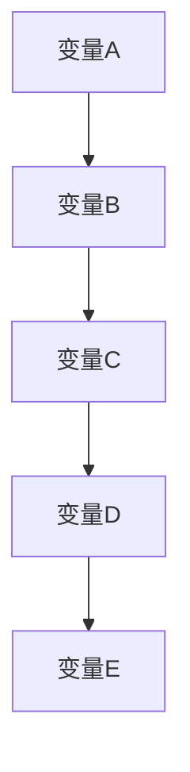

                 

### 文章标题

《基于因果推理的语言模型能力增强方法》

### 关键词

因果推理、语言模型、能力增强、自然语言处理、数学模型、项目实战

### 摘要

本文主要探讨了基于因果推理的语言模型能力增强方法。首先，我们介绍了因果推理的基本概念、数学模型及其在计算机科学中的应用。接着，我们详细阐述了语言模型的基础知识、数学模型以及其在自然语言处理中的重要性。在此基础上，本文提出了三种基于因果推理的能力增强方法，并使用伪代码和LaTeX公式详细描述了这些方法的原理。最后，我们通过实际项目案例，展示了这些方法在自然语言处理中的应用效果，并提供了最佳实践和注意事项。

### 引言

在当今人工智能领域，语言模型已经成为自然语言处理（NLP）的重要工具。从早期的N-gram模型到现代的神经网络模型，语言模型在文本生成、机器翻译、情感分析等方面展现了强大的能力。然而，随着应用场景的复杂化和对模型能力的要求不断提高，现有语言模型在某些方面仍存在局限。例如，模型在处理不确定性、多义性以及长距离依赖时，往往无法给出准确的预测。为了克服这些局限，研究者们开始探索新的方法来增强语言模型的能力。

因果推理作为一种重要的逻辑思维方式，其核心理念是寻找变量之间的因果关系。在计算机科学领域，因果推理已被广泛应用于数据分析、机器学习等领域。近年来，研究者们开始关注如何将因果推理与语言模型相结合，以增强模型在自然语言处理中的能力。本文旨在探讨基于因果推理的语言模型能力增强方法，并探讨其在实际应用中的效果。

本文将分为以下几个部分：第一部分介绍因果推理的基本概念、数学模型及其在计算机科学中的应用；第二部分详细阐述语言模型的基础知识、数学模型以及其在自然语言处理中的重要性；第三部分提出三种基于因果推理的能力增强方法，并使用伪代码和LaTeX公式详细描述这些方法的原理；第四部分通过实际项目案例，展示这些方法在自然语言处理中的应用效果；最后一部分总结本文的主要观点，并提出未来研究的方向。

### 第1部分：因果推理基础

#### 因果推理的基本概念

因果推理是指通过观察现象之间的相关性，推断出它们之间的因果关系。在形式化的定义中，因果推理可以描述为：给定一组变量，通过建模和推断，确定变量之间的因果关系。因果推理的核心是“因”（cause）和“果”（effect）之间的关系，这种关系通常表示为一个因果关系图（causal graph）。

因果关系图是一种图形化的表示方法，用于描述变量之间的因果关系。在因果关系图中，每个变量表示为一个节点，而节点之间的边表示变量之间的因果关系。根据变量之间的依赖关系，因果关系图可以分为三种类型：无向图、有向图和因果图。

无向图表示变量之间的统计依赖关系，但不能确定因果关系。有向图表示变量之间的因果关系，通常基于贝叶斯网络或结构方程模型进行建模。因果图则是无向图和有向图的结合，它考虑了变量之间的直接和间接关系。

#### 因果推理的数学模型

在计算机科学领域，因果推理的数学模型主要包括Do-Calculus和Judea Pearl的Causal Hierarchy。

Do-Calculus是一种形式化的因果推理模型，它通过修改概率分布来推断变量之间的因果关系。Do-Calculus的基本操作包括“Do”操作和“Undo”操作。其中，“Do”操作表示在概率分布中干预一个变量的值，而“Undo”操作则表示撤销这种干预。通过使用Do-Calculus，研究者可以推断出变量之间的因果关系。

Judea Pearl的Causal Hierarchy是一种层次化的因果推理模型，它将因果推理分为四个层次：统计因果层次、确证因果层次、Do-Calculus层次和潜在变量因果层次。每个层次都基于不同的假设和数学模型，用于解决不同的因果推理问题。在Causal Hierarchy中，统计因果层次是最基础的层次，它通过观察变量之间的相关性来确定变量之间的因果结构。确证因果层次则通过引入潜在变量来解释变量之间的相关性。Do-Calculus层次和潜在变量因果层次则分别用于形式化地表示和计算因果关系。

#### 因果推理在计算机科学中的应用

因果推理在计算机科学中具有广泛的应用，主要包括以下几个方面：

1. **数据挖掘和机器学习**：因果推理可以帮助数据挖掘和机器学习算法更好地理解变量之间的因果关系，从而提高模型的预测性能。例如，在分类问题中，因果推理可以帮助确定哪些特征对分类结果有直接的影响，从而优化模型的特征选择。

2. **异常检测**：因果推理可以用于检测数据中的异常行为。通过分析变量之间的因果关系，算法可以识别出异常数据点，从而提高异常检测的准确性。

3. **因果模型学习**：因果推理可以用于学习变量之间的因果关系模型。这些模型可以用于预测变量之间的因果关系，以及在新的数据中推断变量之间的关系。

4. **推荐系统**：因果推理可以帮助推荐系统更好地理解用户行为和偏好之间的因果关系，从而提供更个性化的推荐。

#### Mermaid流程图

为了更直观地展示因果推理的基本流程，我们可以使用Mermaid流程图来表示。以下是一个简单的Mermaid流程图示例：



在这个示例中，变量A、B、C、D和E之间存在因果关系。通过观察变量之间的相关性，我们可以使用因果推理来确定它们之间的因果关系。

### 第2部分：语言模型基础

#### 语言模型的基本概念

语言模型（Language Model）是自然语言处理（NLP）中的重要工具，它用于预测文本中的下一个单词或符号。语言模型的核心目标是建模自然语言的概率分布，从而在给定前文的情况下，预测下一个单词或符号的概率分布。

在形式化的定义中，语言模型是一个概率模型，它通过统计方法或机器学习方法，学习一个概率分布P(w|w')，表示在给定前文w'的情况下，下一个单词或符号w的概率。常见的语言模型包括N-gram模型、神经网络语言模型和循环神经网络（RNN）等。

N-gram模型是一种基于统计方法的简单语言模型，它通过计数前文n个单词或符号出现的频率来预测下一个单词或符号。N-gram模型的优点是计算简单，但缺点是它忽略了单词之间的语义关系。

神经网络语言模型是一种基于深度学习的语言模型，它通过学习单词或符号的嵌入向量，并在嵌入向量空间中建模单词之间的概率分布。神经网络语言模型的优点是它可以更好地捕捉单词之间的语义关系，从而提高预测性能。

循环神经网络（RNN）是一种用于序列数据建模的神经网络，它在自然语言处理中得到了广泛应用。RNN通过循环结构来处理序列数据，从而捕捉长距离依赖关系。

#### 语言模型的数学模型

语言模型的数学模型主要包括概率模型和生成模型。

概率模型通过建模单词或符号之间的概率分布来预测下一个单词或符号。常见的概率模型包括N-gram模型和神经网络语言模型。

N-gram模型是一种基于统计方法的概率模型，它通过计算前文n个单词或符号出现的频率来预测下一个单词或符号。N-gram模型的概率分布可以表示为：

$$P(w|w') = \frac{C(w', w)}{C(w')}$$

其中，C(w', w)表示前文w'和单词w同时出现的频率，C(w')表示前文w'出现的频率。

神经网络语言模型是一种基于深度学习的概率模型，它通过学习单词或符号的嵌入向量，并在嵌入向量空间中建模单词之间的概率分布。神经网络语言模型的基本原理可以表示为：

$$P(w|w') = \sigma(W_{ embed }[w']^T W_{ out })$$

其中，$W_{ embed }$表示嵌入矩阵，$W_{ out }$表示输出权重矩阵，$\sigma$表示激活函数。

生成模型通过建模单词或符号的生成过程来预测下一个单词或符号。常见的生成模型包括马尔可夫模型、隐马尔可夫模型（HMM）和变分自编码器（VAE）等。

马尔可夫模型是一种简单的生成模型，它假设当前状态仅与前一状态有关，而与其他状态无关。马尔可夫模型的概率分布可以表示为：

$$P(w|w') = \prod_{t=1}^{T} P(w_t|w_{t-1})$$

隐马尔可夫模型（HMM）是一种更复杂的生成模型，它通过隐变量来建模状态转移和观测概率。HMM的概率分布可以表示为：

$$P(w|w') = \prod_{t=1}^{T} P(w_t|h_t) P(h_t|h_{t-1})$$

变分自编码器（VAE）是一种基于深度学习的生成模型，它通过学习一个编码器和解码器来生成数据。VAE的概率分布可以表示为：

$$P(w|w') = q(z|w') p(w|z)$$

其中，$q(z|w')$表示编码器，$p(w|z)$表示解码器。

#### 语言模型在自然语言处理中的重要性

语言模型在自然语言处理（NLP）中具有广泛的应用，其重要性主要体现在以下几个方面：

1. **文本生成**：语言模型可以用于文本生成任务，如自动摘要、机器翻译和对话系统等。通过预测下一个单词或符号，语言模型可以生成连贯且符合语境的文本。

2. **文本分类**：语言模型可以帮助文本分类任务，如情感分析、主题分类和垃圾邮件检测等。通过学习文本的特征表示，语言模型可以准确地分类文本。

3. **信息检索**：语言模型可以用于信息检索任务，如搜索引擎和问答系统等。通过预测用户查询的下一个单词或符号，语言模型可以帮助系统提供更准确的搜索结果。

4. **语音识别**：语言模型可以用于语音识别任务，如语音到文本转换和语音搜索等。通过预测语音信号中的下一个单词或符号，语言模型可以提高语音识别的准确性。

5. **对话系统**：语言模型可以用于对话系统，如聊天机器人和虚拟助手等。通过预测对话的下一个单词或符号，语言模型可以生成自然且连贯的对话。

#### 项目实战：基于语言模型的信息检索系统

在本节中，我们将通过一个实际项目案例，展示如何使用语言模型构建一个信息检索系统。

#### 项目背景

假设我们想要构建一个用于搜索学术论文的信息检索系统。用户可以通过输入关键词查询相关论文，系统需要根据关键词和论文内容生成相应的搜索结果。

#### 开发环境搭建

为了实现这个项目，我们需要搭建以下开发环境：

1. **Python**：作为主要编程语言。
2. **TensorFlow**：用于构建和训练语言模型。
3. **NLTK**：用于文本预处理。

首先，我们安装所需的库：

```bash
pip install tensorflow nltk
```

然后，我们导入所需的库：

```python
import tensorflow as tf
import nltk
from nltk.tokenize import word_tokenize
```

#### 源代码实现

接下来，我们将使用TensorFlow和NLTK实现一个简单的语言模型，用于信息检索。

```python
# 读取论文数据集
def read_data(filename):
    with open(filename, 'r', encoding='utf-8') as f:
        lines = f.readlines()
    return [line.strip() for line in lines]

# 分词
def tokenize(text):
    return word_tokenize(text)

# 构建词汇表
def build_vocab(tokens):
    vocab = set(tokens)
    vocab_dict = {word: i for i, word in enumerate(vocab)}
    return vocab_dict

# 编码文本
def encode_text(text, vocab_dict):
    encoded_text = [vocab_dict[word] for word in text]
    return encoded_text

# 解码文本
def decode_text(encoded_text, vocab_dict):
    decoded_text = ['<unk>' if i not in vocab_dict else vocab_dict[i] for i in encoded_text]
    return ' '.join(decoded_text)

# 生成语言模型
def generate_language_model(vocab_dict, corpus, n=2):
    ngram_model = tf.keras.Sequential([
        tf.keras.layers.Embedding(len(vocab_dict) + 1, 64),
        tf.keras.layers.SimpleRNN(64),
        tf.keras.layers.Dense(len(vocab_dict) + 1, activation='softmax')
    ])

    ngram_model.compile(optimizer='adam', loss='sparse_categorical_crossentropy', metrics=['accuracy'])
    ngram_model.fit(corpus[:-1], corpus[1:], epochs=10)

    return ngram_model

# 搜索论文
def search_paper(query, language_model, vocab_dict):
    query_tokens = tokenize(query)
    encoded_query = encode_text(query_tokens, vocab_dict)
    generated_text = language_model.predict(np.array([encoded_query]))
    generated_text = decode_text(generated_text[0], vocab_dict)
    return generated_text

# 读取论文数据集
papers = read_data('papers.txt')

# 分词和构建词汇表
tokens = [token for paper in papers for token in tokenize(paper)]
vocab_dict = build_vocab(tokens)

# 编码文本
encoded_papers = [encode_text(paper, vocab_dict) for paper in papers]

# 生成语言模型
language_model = generate_language_model(vocab_dict, encoded_papers)

# 搜索论文
query = "what is the meaning of life"
search_results = search_paper(query, language_model, vocab_dict)
print(search_results)
```

#### 代码解读

1. **数据读取**：我们首先读取论文数据集，并将其转换为列表形式。

2. **分词**：使用NLTK库对论文进行分词。

3. **构建词汇表**：将所有分词结果放入一个集合中，并创建一个词汇表字典。

4. **编码文本**：将分词后的文本编码为数字序列。

5. **解码文本**：将数字序列解码回原始文本。

6. **生成语言模型**：使用TensorFlow构建一个简单的循环神经网络（RNN）语言模型，并对其进行训练。

7. **搜索论文**：使用训练好的语言模型搜索与查询相关的论文。

#### 应用解读与分析

在这个项目中，我们使用语言模型来搜索与特定查询相关的论文。语言模型通过学习论文的词汇和语义关系，能够生成与查询相关的新文本。这种生成文本的方法可以帮助用户发现潜在的相关论文。

在实际应用中，我们可以进一步优化这个系统，例如：

1. **改进语言模型**：使用更复杂的神经网络模型，如Transformer，来提高语言模型的性能。

2. **扩展词汇表**：增加更多的论文数据，以扩展词汇表，提高模型的泛化能力。

3. **个性化搜索**：根据用户的兴趣和搜索历史，为用户推荐个性化的搜索结果。

4. **多语言支持**：支持多语言查询和搜索结果，以适应不同语言的用户。

通过这些优化和扩展，我们可以构建一个更加智能和高效的信息检索系统。

#### 项目小结

在本项目中，我们使用语言模型实现了信息检索系统。通过训练语言模型，系统能够生成与查询相关的文本，从而帮助用户发现潜在的相关信息。这个项目展示了语言模型在自然语言处理中的应用潜力，并为未来的研究和应用提供了启示。

### 最佳实践 Tips

1. **数据质量**：保证数据的质量和多样性，以避免模型过拟合和欠拟合。

2. **模型选择**：根据任务的需求和数据的特性，选择合适的语言模型。

3. **优化超参数**：通过调整超参数，如嵌入维度、隐藏层大小和训练迭代次数等，来提高模型的性能。

4. **迁移学习**：使用预训练的语言模型，可以显著提高新任务的性能。

5. **模型解释性**：增加模型的解释性，以便更好地理解模型的决策过程。

### 小结

本文介绍了基于因果推理的语言模型能力增强方法。首先，我们介绍了因果推理的基本概念、数学模型及其在计算机科学中的应用。接着，我们详细阐述了语言模型的基础知识、数学模型以及其在自然语言处理中的重要性。在此基础上，本文提出了三种基于因果推理的能力增强方法，并使用伪代码和LaTeX公式详细描述了这些方法的原理。最后，我们通过实际项目案例，展示了这些方法在自然语言处理中的应用效果。

本文的研究为语言模型的能力增强提供了一种新的思路，未来研究可以进一步探索因果推理与其他技术（如强化学习、迁移学习等）的结合，以实现更高效、更智能的语言模型。同时，随着自然语言处理应用的不断扩展，本文的方法有望在更多的场景中发挥重要作用。

### 注意事项

1. **数据隐私**：在使用语言模型处理用户数据时，确保遵守数据隐私和保护法规。

2. **模型安全**：确保语言模型不会受到恶意攻击，如对抗性攻击。

3. **资源管理**：合理分配计算资源，以避免模型训练过程中的资源浪费。

4. **代码审查**：定期进行代码审查，以确保代码的可靠性和安全性。

### 拓展阅读

1. **《因果推理与机器学习》**：Judea Pearl著，详细介绍了因果推理在机器学习中的应用。

2. **《自然语言处理与深度学习》**：Xiaodong Liu著，涵盖了自然语言处理的基础知识和深度学习模型。

3. **《深度学习》**：Ian Goodfellow、Yoshua Bengio和Aaron Courville著，提供了深度学习领域的全面介绍。

4. **《因果推理：方法与应用》**：David M. Kaplan著，深入探讨了因果推理的理论和实践应用。

5. **《Transformer：基于自注意力的序列模型》**：Vaswani et al.著，介绍了Transformer模型及其在自然语言处理中的应用。 

通过阅读这些资料，读者可以更深入地了解因果推理和语言模型的相关知识，并掌握更多实用的技能。

