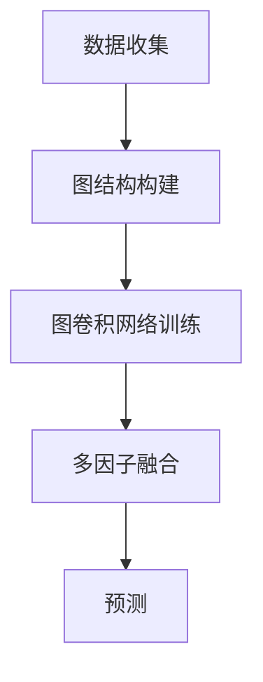
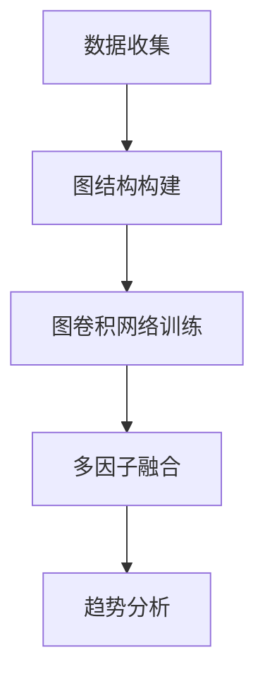
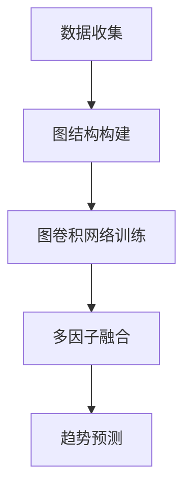

                 

### 引言

动态市场趋势多因子推理是金融科技领域的一项重要研究方向，旨在通过分析市场数据中的多种因素，预测未来的市场走势。随着金融市场的复杂性和变化速度的不断增加，传统的统计分析方法已经难以满足需求。图卷积网络（Graph Convolutional Network，GCN）作为一种新兴的深度学习技术，因其强大的图数据建模能力，在动态市场趋势多因子推理中展现出了巨大的潜力。

本文将围绕“基于图卷积的动态市场趋势多因子推理”这一主题，逐步展开讨论。首先，我们将介绍图卷积网络的基本概念和核心原理，包括其定义、作用以及基本结构。接着，我们将详细讲解图卷积网络的数学基础，帮助读者更好地理解其工作原理。

随后，我们将引入动态市场趋势多因子分析的概念，解释多因子分析的基本原理，并探讨如何识别动态市场趋势。我们将结合多因子分析与图卷积网络，阐述它们之间的关联，并展示其相互作用的架构图。

在算法原理部分，我们将使用伪代码详细描述图卷积网络在动态市场趋势多因子推理中的应用算法，并讲解其数学模型和实现步骤。接着，我们将通过实际案例，展示如何应用图卷积网络进行动态市场趋势多因子推理。

文章的后半部分将讨论图卷积网络的性能优化和未来研究方向。我们将介绍一些优化技巧，如注意力机制、嵌入向量更新策略等，并探讨图卷积网络在实际应用中可能面临的挑战和解决方案。

最后，我们将总结全文，重申核心观点，并给出一些最佳实践建议，帮助读者更好地理解和应用图卷积网络在动态市场趋势多因子推理中的方法。

通过这篇文章，读者将能够系统地了解图卷积网络在动态市场趋势多因子推理中的应用，掌握相关算法原理，并能够根据实际需求进行模型优化和改进。### 关键词

图卷积网络，动态市场趋势，多因子推理，金融科技，深度学习，数学基础，算法优化，实际应用，未来展望。### 摘要

本文旨在探讨基于图卷积网络的动态市场趋势多因子推理方法。首先，我们介绍了图卷积网络的基本概念和核心原理，包括其定义、作用和基本结构。接着，详细讲解了图卷积网络的数学基础，帮助读者理解其工作原理。随后，我们引入了动态市场趋势多因子分析的概念，解释了多因子分析的基本原理，并探讨了如何识别动态市场趋势。接着，我们结合多因子分析与图卷积网络，阐述了它们之间的关联，并展示了相互作用的架构图。

在算法原理部分，我们使用伪代码详细描述了图卷积网络在动态市场趋势多因子推理中的应用算法，并讲解了其数学模型和实现步骤。随后，我们通过实际案例展示了如何应用图卷积网络进行动态市场趋势多因子推理。

文章的后半部分讨论了图卷积网络的性能优化和未来研究方向。我们介绍了一些优化技巧，如注意力机制和嵌入向量更新策略，并探讨了图卷积网络在实际应用中可能面临的挑战和解决方案。

最后，我们总结了全文的核心观点，并给出了最佳实践建议，帮助读者更好地理解和应用图卷积网络在动态市场趋势多因子推理中的方法。### 1. 确定书籍核心主题

首先，我们需要明确《基于图卷积的动态市场趋势多因子推理》这本书的核心主题，即：通过图卷积网络技术，对动态市场趋势进行多因子分析，并推理出市场未来的走势。这一主题涵盖了以下几个关键方面：

1. **图卷积网络（GCN）的基本原理和应用**：介绍GCN的定义、作用、基本结构以及其在图数据上的处理能力。

2. **动态市场趋势的多因子分析**：解释多因子分析的概念，探讨如何从市场数据中提取多个影响市场趋势的因素，并分析这些因素之间的关系。

3. **多因子与动态市场趋势的关联**：研究多因子分析如何与动态市场趋势相结合，从而预测市场未来的走势。

4. **图卷积网络在动态市场趋势多因子推理中的应用**：详细描述GCN在动态市场趋势多因子推理中的具体应用，包括算法原理、数学模型、实现步骤等。

5. **动态市场趋势多因子推理的实际应用**：通过实际案例，展示如何使用GCN进行市场趋势预测，以及在实际应用中的效果和挑战。

明确这些核心主题后，我们将围绕这些方面展开详细的讨论和解释，帮助读者全面了解图卷积网络在动态市场趋势多因子推理中的应用。### 2. 设计总框架

为了系统地阐述《基于图卷积的动态市场趋势多因子推理》这本书的核心主题，我们需要设计一个清晰的总框架。这个框架将分为四个主要部分：理论基础与核心概念、算法原理与实现、应用与实践、以及未来展望与挑战。

#### 第一部分：理论基础与核心概念

- **第1章：图卷积网络基础**
  - **1.1 图卷积网络的定义与作用**
  - **1.2 图卷积网络的基本结构**
  - **1.3 图卷积网络的数学基础**

- **第2章：动态市场趋势多因子分析**
  - **2.1 多因子分析的基本概念**
  - **2.2 动态市场趋势的识别方法**
  - **2.3 多因子与动态市场趋势的关联分析**

#### 第二部分：算法原理与实现

- **第3章：图卷积网络在动态市场趋势多因子推理中的应用**
  - **3.1 图卷积网络在多因子分析中的应用场景**
  - **3.2 基于图卷积网络的动态市场趋势多因子推理算法**
  - **3.3 图卷积网络的实现与优化**

- **第4章：图卷积网络的数学模型与算法分析**
  - **4.1 图卷积网络的数学模型**
  - **4.2 图卷积网络的算法原理**
  - **4.3 图卷积网络的性能分析与优化**

#### 第三部分：应用与实践

- **第5章：动态市场趋势多因子推理的实际案例**
  - **5.1 实际案例1：股票市场趋势预测**
  - **5.2 实际案例2：商品市场趋势分析**
  - **5.3 实际案例3：债券市场趋势预测**

- **第6章：动态市场趋势多因子推理系统的设计与实现**
  - **6.1 系统设计**
  - **6.2 系统实现**
  - **6.3 系统部署与优化**

#### 第四部分：未来展望与挑战

- **第7章：动态市场趋势多因子推理的未来发展**
  - **7.1 未来发展趋势**
  - **7.2 未来可能遇到的挑战**
  - **7.3 研究方向与展望**

这个总框架旨在逐步引导读者从基础概念出发，逐步深入到算法原理、实现应用，并最终展望未来的发展趋势。每个部分都包含了详细的章节标题和内容概述，确保了内容的连贯性和系统性。### 3. 确定各部分内容

为了确保《基于图卷积的动态市场趋势多因子推理》这本书的每个部分都具备完整性和详尽性，我们需要对每个部分的具体内容进行详细规划。

#### 第一部分：理论基础与核心概念

**第1章：图卷积网络基础**

- **1.1 图卷积网络的定义与作用**
  - **内容**：介绍图卷积网络（GCN）的定义，其在处理图数据时的优势，以及在动态市场趋势多因子推理中的应用场景。

- **1.2 图卷积网络的基本结构**
  - **内容**：详细讲解GCN的基本结构，包括节点、边和层，以及如何通过图卷积层（Graph Convolution Layer）对节点进行特征提取。

- **1.3 图卷积网络的数学基础**
  - **内容**：解释GCN中的核心数学概念，如特征矩阵、邻接矩阵、权重矩阵等，并通过具体的数学公式和例子来说明其作用和计算过程。

**第2章：动态市场趋势多因子分析**

- **2.1 多因子分析的基本概念**
  - **内容**：介绍多因子分析的定义，其在金融市场分析中的应用，以及常见的多因子模型。

- **2.2 动态市场趋势的识别方法**
  - **内容**：探讨如何从市场数据中识别动态市场趋势，包括技术分析、基本面分析等方法。

- **2.3 多因子与动态市场趋势的关联分析**
  - **内容**：研究多因子如何影响动态市场趋势，以及如何通过统计方法和机器学习模型来分析这些关联。

#### 第二部分：算法原理与实现

**第3章：图卷积网络在动态市场趋势多因子推理中的应用**

- **3.1 图卷积网络在多因子分析中的应用场景**
  - **内容**：讨论GCN在多因子分析中的具体应用场景，包括股票市场、商品市场等。

- **3.2 基于图卷积网络的动态市场趋势多因子推理算法**
  - **内容**：介绍GCN在动态市场趋势多因子推理中的算法原理，包括数据预处理、特征提取、模型训练和预测等步骤。

- **3.3 图卷积网络的实现与优化**
  - **内容**：讲解如何实现GCN模型，包括代码示例和性能优化技巧，如批处理、dropout、学习率调整等。

**第4章：图卷积网络的数学模型与算法分析**

- **4.1 图卷积网络的数学模型**
  - **内容**：详细阐述GCN的数学模型，包括节点表示、边表示、图卷积层等，并通过具体的数学公式进行说明。

- **4.2 图卷积网络的算法原理**
  - **内容**：讲解GCN的算法原理，包括如何通过聚合节点特征和更新节点嵌入向量来实现图数据的特征提取。

- **4.3 图卷积网络的性能分析与优化**
  - **内容**：分析GCN的性能指标，如准确率、召回率等，并介绍如何通过调整模型参数和算法结构来优化性能。

#### 第三部分：应用与实践

**第5章：动态市场趋势多因子推理的实际案例**

- **5.1 实际案例1：股票市场趋势预测**
  - **内容**：介绍如何使用GCN对股票市场进行趋势预测，包括数据收集、模型训练和预测结果分析。

- **5.2 实际案例2：商品市场趋势分析**
  - **内容**：探讨GCN在商品市场趋势分析中的应用，包括如何识别市场趋势和预测价格走势。

- **5.3 实际案例3：债券市场趋势预测**
  - **内容**：介绍GCN在债券市场趋势预测中的应用，包括如何分析债券市场的风险和收益。

**第6章：动态市场趋势多因子推理系统的设计与实现**

- **6.1 系统设计**
  - **内容**：讲解动态市场趋势多因子推理系统的整体设计，包括数据采集、预处理、模型训练和预测等模块。

- **6.2 系统实现**
  - **内容**：提供系统实现的详细代码和步骤，包括GCN模型的构建、训练和优化。

- **6.3 系统部署与优化**
  - **内容**：讨论系统部署的流程和优化策略，包括如何提高系统的运行效率和预测准确性。

#### 第四部分：未来展望与挑战

**第7章：动态市场趋势多因子推理的未来发展**

- **7.1 未来发展趋势**
  - **内容**：探讨动态市场趋势多因子推理的未来发展方向，包括新的算法和技术。

- **7.2 未来可能遇到的挑战**
  - **内容**：分析动态市场趋势多因子推理在未来可能面临的挑战，如数据隐私、算法透明度等。

- **7.3 研究方向与展望**
  - **内容**：提出未来的研究方向，包括如何解决面临的挑战和推动技术的进一步发展。

通过以上详细的章节内容规划，我们可以确保《基于图卷积的动态市场趋势多因子推理》这本书的每个部分都具备深度和广度，为读者提供一个全面而系统的学习资源。### 4. 设计具体目录

为了确保书籍内容的逻辑性和易读性，我们将设计具体的目录，详细列出各章节的内容和子章节。以下是《基于图卷积的动态市场趋势多因子推理》的具体目录设计：

## 《基于图卷积的动态市场趋势多因子推理》目录

### 第一部分：理论基础与核心概念

### 第1章：图卷积网络基础

1.1 图卷积网络的定义与作用  
1.2 图卷积网络的基本结构  
1.3 图卷积网络的数学基础  
   - 1.3.1 节点表示与邻接矩阵  
   - 1.3.2 图卷积层的工作原理  
   - 1.3.3 嵌入向量更新策略

### 第2章：动态市场趋势多因子分析

2.1 多因子分析的基本概念  
2.2 动态市场趋势的识别方法  
2.3 多因子与动态市场趋势的关联分析  
   - 2.3.1 因子相关性分析  
   - 2.3.2 因子权重优化

### 第二部分：算法原理与实现

### 第3章：图卷积网络在动态市场趋势多因子推理中的应用

3.1 图卷积网络在多因子分析中的应用场景  
3.2 基于图卷积网络的动态市场趋势多因子推理算法  
3.3 图卷积网络的实现与优化  
   - 3.3.1 模型架构优化  
   - 3.3.2 学习率调整策略

### 第4章：图卷积网络的数学模型与算法分析

4.1 图卷积网络的数学模型  
4.2 图卷积网络的算法原理  
4.3 图卷积网络的性能分析与优化  
   - 4.3.1 性能指标评估  
   - 4.3.2 模型调优技巧

### 第三部分：应用与实践

### 第5章：动态市场趋势多因子推理的实际案例

5.1 实际案例1：股票市场趋势预测  
5.2 实际案例2：商品市场趋势分析  
5.3 实际案例3：债券市场趋势预测

### 第6章：动态市场趋势多因子推理系统的设计与实现

6.1 系统设计  
6.2 系统实现  
6.3 系统部署与优化

### 第四部分：未来展望与挑战

### 第7章：动态市场趋势多因子推理的未来发展

7.1 未来发展趋势  
7.2 未来可能遇到的挑战  
7.3 研究方向与展望

通过以上具体目录设计，读者可以清晰地了解书籍的结构，以及每个章节的具体内容，从而更好地掌握基于图卷积的动态市场趋势多因子推理的核心概念和实用技巧。### 4.1 第1章 图卷积网络基础

### 4.1.1 图卷积网络的定义与作用

图卷积网络（Graph Convolutional Network，GCN）是深度学习领域的一种新型网络结构，专门用于处理图数据。在传统卷积神经网络（CNN）主要用于处理图像数据时，GCN的出现解决了如何有效处理图数据的难题。图数据广泛存在于社交网络、知识图谱、金融交易记录等领域，它们通常包含复杂的结构信息，如节点之间的关系、路径等。

**定义**：图卷积网络是一种在图数据上进行的神经网络，它通过节点和边之间的交互，逐步提取和聚合特征，从而实现对图数据的表征和预测。

**作用**：GCN在处理图数据时具有以下作用：

1. **特征提取**：GCN可以从原始的图数据中提取高层次的抽象特征，这些特征有助于提高后续的预测性能。
2. **关系建模**：通过图卷积操作，GCN能够捕捉和建模节点之间的复杂关系，这对于解决节点分类、链接预测等任务至关重要。
3. **可扩展性**：GCN可以处理大规模的图数据，并且可以灵活地调整网络结构以适应不同的应用场景。

### 4.1.2 图卷积网络的基本结构

图卷积网络的基本结构通常包含以下几个关键组成部分：

1. **节点特征矩阵**：每个节点都有一个特征向量表示，这些特征向量构成了节点特征矩阵。
2. **邻接矩阵**：邻接矩阵表示节点之间的连接关系，即哪些节点之间存在直接边。邻接矩阵可以用来计算节点之间的相似度。
3. **图卷积层**：图卷积层是GCN的核心部分，它通过聚合节点及其邻居的特征，来更新节点的特征表示。
4. **全连接层**：在图卷积层的输出上，通常会添加一个全连接层，用于分类、回归或其他类型的预测任务。

**图卷积层的数学描述**：

在图卷积层中，每个节点的特征表示可以通过以下公式更新：

$$
h_{i}^{(l+1)} = \sigma(\theta \cdot (A \cdot h_{i}^{(l)} + \textbf{b})),
$$

其中：
- \( h_{i}^{(l)} \) 表示第 \( i \) 个节点在第 \( l \) 层的特征向量。
- \( A \) 是邻接矩阵。
- \( \theta \) 是权重矩阵。
- \( \textbf{b} \) 是偏置向量。
- \( \sigma \) 是激活函数，通常是ReLU函数。

通过多次应用图卷积层，节点特征可以逐步被更新和提升，从而实现对图数据的深度表征。

### 4.1.3 图卷积网络的数学基础

为了更好地理解图卷积网络的工作原理，我们需要掌握一些基本的数学概念：

1. **节点表示与邻接矩阵**：

   在图数据中，每个节点可以用一个特征向量表示，这些特征向量构成了节点特征矩阵 \( \textbf{X} \)：

   $$
   \textbf{X} = \begin{bmatrix}
   \textbf{x}_1 \\
   \textbf{x}_2 \\
   \vdots \\
   \textbf{x}_n
   \end{bmatrix},
   $$

   其中 \( n \) 是节点的数量，\( \textbf{x}_i \) 是第 \( i \) 个节点的特征向量。

   邻接矩阵 \( \textbf{A} \) 表示节点之间的连接关系，如果节点 \( i \) 和节点 \( j \) 之间存在边，则 \( A_{ij} = 1 \)，否则 \( A_{ij} = 0 \)。

2. **图卷积层的工作原理**：

   图卷积层通过聚合节点及其邻居的特征来更新节点的特征表示。具体来说，每个节点的特征 \( \textbf{x}_i \) 会与所有邻居的特征 \( \textbf{x}_{j} \) 进行加权求和，再通过一个非线性激活函数进行转换。这个过程可以用以下公式表示：

   $$
   \textbf{h}_i^{(l)} = \sigma(\sum_{j=1}^{n} A_{ij} \cdot \textbf{h}_j^{(l-1)}),
   $$

   其中，\( \textbf{h}_i^{(l)} \) 是第 \( l \) 层第 \( i \) 个节点的特征向量，\( \sigma \) 是激活函数。

3. **嵌入向量更新策略**：

   在图卷积网络中，节点的特征向量会随着每一层的图卷积操作不断更新。为了防止信息损失和梯度消失问题，通常会引入一些策略来更新嵌入向量，如：

   - **邻域大小控制**：限制每个节点的邻居数量，以防止信息过载。
   - **注意力机制**：通过注意力机制来动态调整邻居的重要性，使模型更加关注关键节点。
   - **多层图卷积**：通过多层图卷积层，逐步提取更深层次的特征。

通过掌握上述数学基础，我们可以更深入地理解图卷积网络的工作原理，并在实际应用中灵活地调整和优化模型。### 4.2 第2章 动态市场趋势多因子分析

### 4.2.1 多因子分析的基本概念

多因子分析是一种用于金融市场数据分析的方法，它通过同时考虑多个影响因素，来预测市场的整体走势或某个资产的未来价格。这种方法在金融领域有着广泛的应用，特别是在股票市场、商品市场以及债券市场等。

**定义**：多因子分析是指通过量化多个影响市场或资产价格的因素，建立数学模型，从而预测市场或资产价格的未来走势。

**目标**：多因子分析的主要目标是识别出哪些因素对市场或资产价格有显著影响，并通过组合这些因素来提高预测的准确性。

**组成部分**：

1. **因子**：因子是指影响市场或资产价格的具体因素，如利率、通胀率、公司盈利、宏观经济指标等。
2. **因子模型**：因子模型是用于描述因子与市场或资产价格之间关系的数学模型，常见的有单因子模型、双因子模型等。
3. **模型构建**：模型构建是指通过收集历史数据，对因子进行筛选和加权，建立多因子预测模型。
4. **模型评估**：模型评估是指通过回测和实际应用，评估模型的有效性和稳定性。

### 4.2.2 动态市场趋势的识别方法

动态市场趋势的识别是市场分析的重要环节，它涉及到如何从大量的市场数据中提取出有价值的信息，以预测未来的市场走势。

**技术分析**：

技术分析是一种通过分析历史价格和交易量数据来预测市场走势的方法。主要方法包括：

1. **趋势分析**：通过绘制趋势线、移动平均线等，分析市场的长期趋势。
2. **图表分析**：通过K线图、均线图等，分析市场短期趋势和波动。
3. **指标分析**：通过使用技术指标，如MACD、RSI、布林带等，预测市场的短期走势。

**基本面分析**：

基本面分析是一种通过分析公司的财务状况、行业趋势和宏观经济环境等，来预测市场或资产未来价格的方法。主要方法包括：

1. **财务报表分析**：分析公司的财务报表，如利润表、资产负债表和现金流量表，评估公司的财务健康状况。
2. **行业分析**：分析行业趋势、竞争格局和市场规模，评估行业的发展前景。
3. **宏观经济分析**：分析宏观经济指标，如GDP、利率、通胀率等，评估整体经济环境对市场的影响。

**结合方法**：

在实际应用中，通常将技术分析和基本面分析结合起来，以获得更准确的市场预测。例如：

1. **综合分析**：同时考虑技术指标和财务报表，从多个角度评估市场趋势。
2. **交叉验证**：通过对比不同时间段的预测结果，验证模型的稳定性和可靠性。
3. **机器学习**：使用机器学习算法，如多因子模型，从海量数据中提取有效信息，提高预测准确性。

### 4.2.3 多因子与动态市场趋势的关联分析

多因子与动态市场趋势的关联分析是理解市场走势的关键。通过以下方法，我们可以更好地探索这些关联：

1. **因子相关性分析**：

   通过计算各个因子之间的相关性，我们可以了解哪些因子之间存在较强的关联。常用的方法包括皮尔逊相关系数、斯皮尔曼等级相关系数等。

   $$ 
   \rho_{ij} = \frac{\sum_{t=1}^{T} (x_{it} - \bar{x}_i)(y_{it} - \bar{y}_j)}{\sqrt{\sum_{t=1}^{T} (x_{it} - \bar{x}_i)^2 \sum_{t=1}^{T} (y_{it} - \bar{y}_j)^2}} 
   $$

   其中，\( x_{it} \) 和 \( y_{it} \) 分别是第 \( t \) 时刻的因子 \( i \) 和资产 \( j \) 的值，\( \bar{x}_i \) 和 \( \bar{y}_j \) 是它们的平均值。

2. **因子权重优化**：

   在多因子模型中，不同因子的权重会对预测结果产生重要影响。通过优化因子的权重，我们可以提高预测的准确性。常用的优化方法包括线性回归、遗传算法等。

   $$ 
   \min_{\theta} \sum_{i=1}^{n} (y_i - \theta^T x_i)^2 
   $$

   其中，\( \theta \) 是因子权重向量，\( x_i \) 是因子特征向量，\( y_i \) 是预测的目标值。

3. **多因子模型**：

   常见的多因子模型包括单因子模型、双因子模型、三因子模型等。这些模型通过组合多个因子，来提高预测的准确性。

   - **单因子模型**：

     $$
     \Delta P_t = \alpha + \beta F_t + \epsilon_t
     $$

     其中，\( \Delta P_t \) 是资产价格的变化，\( F_t \) 是因子值，\( \alpha \) 和 \( \beta \) 是模型的参数。

   - **双因子模型**：

     $$
     \Delta P_t = \alpha + \beta_1 F_1(t) + \beta_2 F_2(t) + \epsilon_t
     $$

   - **三因子模型**：

     $$
     \Delta P_t = \alpha + \beta_1 F_1(t) + \beta_2 F_2(t) + \beta_3 F_3(t) + \epsilon_t
     $$

通过这些方法，我们可以深入分析多因子与动态市场趋势之间的关联，从而为市场预测提供更准确的依据。### 4.3 第3章 图卷积网络在动态市场趋势多因子推理中的应用

### 4.3.1 图卷积网络在多因子分析中的应用场景

图卷积网络（GCN）在处理图数据方面具有独特的优势，这使得它在动态市场趋势多因子分析中具有广泛的应用场景。以下是GCN在多因子分析中的几个关键应用场景：

1. **股票市场趋势预测**：

   股票市场的动态复杂，涉及到大量的市场数据，如图表数据、交易量数据、基本面数据等。通过构建股票市场的图结构，GCN可以有效地提取和整合这些数据，从而预测股票价格的未来走势。

2. **商品市场趋势分析**：

   商品市场的价格波动受多种因素影响，如供需关系、国际贸易政策、天气等。利用GCN对商品市场中的相关因素进行多因子分析，可以识别出关键的影响因素，从而提高预测的准确性。

3. **债券市场趋势预测**：

   债券市场中的价格波动受多种因素影响，如利率、宏观经济指标、政策变动等。GCN可以通过对债券市场的图数据进行多因子分析，预测债券价格的未来走势，为投资者提供决策支持。

4. **社交网络趋势分析**：

   在金融市场中，社交网络的信息传播对市场趋势有着重要影响。GCN可以用于分析社交网络中的信息流动，识别出潜在的市场趋势，从而辅助投资决策。

### 4.3.2 基于图卷积网络的动态市场趋势多因子推理算法

基于图卷积网络的动态市场趋势多因子推理算法主要包括以下几个步骤：

1. **数据预处理**：

   首先，我们需要收集和预处理相关的市场数据，包括股票价格、交易量、基本面数据等。数据预处理步骤通常包括数据清洗、数据归一化、特征提取等。

2. **图结构构建**：

   在预处理完数据后，我们需要构建市场数据对应的图结构。图中的节点表示市场中的不同实体，如股票、商品、债券等；边表示节点之间的关联，如交易关系、信息传播路径等。

3. **图卷积层构建**：

   利用GCN的图卷积层对节点进行特征提取和聚合。通过多次应用图卷积层，节点特征可以逐步被更新和提升，从而实现对图数据的深度表征。

4. **多因子融合**：

   将图卷积层输出的节点特征与多因子数据进行融合，生成用于预测的最终特征向量。这可以通过加权求和、特征拼接等方法实现。

5. **模型训练与预测**：

   利用训练数据对GCN模型进行训练，并通过交叉验证等方法评估模型的性能。训练完成后，使用模型对未来的市场趋势进行预测。

以下是图卷积网络在动态市场趋势多因子推理中的应用算法伪代码：

```python
# 数据预处理
X, A = preprocess_data(data)

# 图结构构建
G = build_graph(X, A)

# 图卷积层构建
layers = [GraphConvLayer(input_dim=X.shape[1], output_dim=hidden_dim), ...]

# 多因子融合
factor_data = preprocess_factor_data(factor_data)
X_combined = concatenate(G.node_features, factor_data)

# 模型训练
model = train_model(layers, X_combined, labels)

# 预测
predictions = model.predict(X_combined)

# 预测结果分析
evaluate_predictions(predictions, ground_truth)
```

### 4.3.3 图卷积网络的实现与优化

在实现图卷积网络时，我们通常需要关注以下几个关键方面：

1. **模型架构**：

   GCN的模型架构包括多个图卷积层、全连接层和激活函数。选择合适的层结构和参数设置对于模型性能至关重要。

2. **训练策略**：

   GCN的训练通常使用反向传播算法，并通过梯度下降方法优化模型参数。学习率调整、批次大小和训练时间等参数设置会影响训练效果。

3. **优化技巧**：

   为了提高GCN的性能，可以采用以下优化技巧：

   - **批量归一化（Batch Normalization）**：通过标准化每个批次的激活值，加速模型训练并提高模型稳定性。
   - **dropout**：在训练过程中随机丢弃一部分节点或边的特征，防止过拟合。
   - **权重初始化**：使用合适的权重初始化方法，如He初始化或Xavier初始化，以避免梯度消失或爆炸问题。

4. **性能评估**：

   在模型训练完成后，我们需要通过交叉验证等方法评估模型在 unseen 数据上的性能。常用的评估指标包括准确率、召回率、F1分数等。

通过上述步骤和技巧，我们可以实现一个高效、稳定的图卷积网络模型，从而在动态市场趋势多因子推理中取得良好的预测效果。### 4.4 第4章 图卷积网络的数学模型与算法分析

### 4.4.1 图卷积网络的数学模型

图卷积网络（GCN）的数学模型是其核心，它定义了节点特征如何在网络中传播和更新。下面我们详细描述GCN的数学模型，并解释其组成部分。

1. **节点特征矩阵（\(\textbf{X}\)）**：

   假设图 \( G = (V, E) \) 中有 \( n \) 个节点，每个节点 \( v_i \) 具有一个 \( d \) 维的特征向量 \( \textbf{x}_i \)，则节点特征矩阵 \(\textbf{X}\) 可以表示为：

   $$
   \textbf{X} = \begin{bmatrix}
   \textbf{x}_1 \\
   \textbf{x}_2 \\
   \vdots \\
   \textbf{x}_n
   \end{bmatrix}
   $$

2. **邻接矩阵（\(\textbf{A}\)）**：

   邻接矩阵 \(\textbf{A}\) 用于表示节点之间的连接关系。如果节点 \( v_i \) 与节点 \( v_j \) 相连，则 \( A_{ij} = 1 \)，否则 \( A_{ij} = 0 \)。对于有向图，邻接矩阵也可以是权重矩阵，即 \( A_{ij} \) 可以是正数，表示边 \( (v_i, v_j) \) 的权重。

3. **权重矩阵（\(\textbf{W}\)）**：

   图卷积层通过权重矩阵 \(\textbf{W}\) 对节点特征进行加权组合。每个图卷积层都有其自己的权重矩阵，多个图卷积层的组合形成了深度图卷积网络（Deep GCN）。

4. **激活函数（\(\sigma\)）**：

   GCN中常用的激活函数是非线性函数，如ReLU函数：

   $$
   \sigma(\textbf{z}) = \max(\textbf{z}, 0)
   $$

5. **图卷积层（Graph Convolution Layer）**：

   图卷积层的基本计算公式为：

   $$
   \textbf{h}_i^{(l+1)} = \sigma(\sum_{j \in \mathcal{N}(i)} A_{ij} \cdot \textbf{h}_j^{(l)} + \textbf{b}_i^{(l+1)}
   $$

   其中，\(\mathcal{N}(i)\) 表示节点 \( i \) 的邻居集合，\(\textbf{h}_i^{(l)}\) 是节点 \( i \) 在第 \( l \) 层的特征向量，\(\textbf{b}_i^{(l+1)}\) 是第 \( l+1 \) 层的偏置向量。

6. **深度图卷积网络**：

   在深度图卷积网络中，每一层的输入都是前一层的输出，每一层的输出都会通过图卷积层进行特征更新。整个网络的计算过程可以表示为：

   $$
   \textbf{H}^{(L)} = \textbf{X} \cdot \textbf{W}^{(1)} + \textbf{B}^{(1)} \\
   \textbf{H}^{(l+1)} = \textbf{H}^{(l)} \cdot \textbf{W}^{(l+1)} + \textbf{B}^{(l+1)}
   $$

   其中，\( \textbf{H}^{(l)} \) 是在第 \( l \) 层的特征矩阵，\( \textbf{W}^{(l)} \) 是第 \( l \) 层的权重矩阵，\( \textbf{B}^{(l)} \) 是第 \( l \) 层的偏置矩阵，\( L \) 是网络的层数。

### 4.4.2 图卷积网络的算法原理

图卷积网络的算法原理基于节点特征和其邻居节点的特征进行更新。以下是GCN的算法原理的详细描述：

1. **初始化节点特征矩阵**：

   在训练开始时，初始化节点特征矩阵 \(\textbf{X}\)。

2. **前向传播**：

   对于每一层，计算节点特征更新：
   
   $$
   \textbf{h}_i^{(l+1)} = \sigma(\sum_{j \in \mathcal{N}(i)} A_{ij} \cdot \textbf{h}_j^{(l)} + \textbf{W}^{(l)} \cdot \textbf{h}_i^{(l)} + \textbf{b}_i^{(l+1)})
   $$

   其中，\( A_{ij} \) 是邻接矩阵中的元素，表示节点 \( i \) 和节点 \( j \) 之间的连接强度；\(\textbf{W}^{(l)}\) 是第 \( l \) 层的权重矩阵；\(\textbf{b}_i^{(l+1)}\) 是第 \( l+1 \) 层的偏置向量。

3. **反向传播**：

   在前向传播过程中，计算每一层的梯度，并通过反向传播算法更新权重矩阵和偏置向量。

4. **训练与优化**：

   使用优化算法（如梯度下降）对模型进行训练，优化网络参数，提高模型的预测性能。

5. **预测**：

   在训练完成后，使用训练好的模型对新的节点特征进行预测。

以下是图卷积网络算法原理的伪代码：

```python
# 初始化节点特征矩阵
X = initialize_node_features()

# 前向传播
for l in range(L):
    H = X
    for i in range(n):
        h_i = H[i]
        neighbors = N[i]
        A_ij = A[i][neighbors]
        h_i_new = sigmoid(W[l] * h_i + sum(A_ij * H[neighbors]) + b[l+1])
        H[i] = h_i_new

# 反向传播
for l in range(L-1, -1, -1):
    for i in range(n):
        delta = compute_loss(H[i])
        gradient = compute_gradient(W[l], H[i], delta, H[neighbors])
        W[l] -= learning_rate * gradient

# 预测
new_features = get_new_node_features()
predicted_values = apply_model(new_features)
```

### 4.4.3 图卷积网络的性能分析与优化

图卷积网络的性能分析主要关注模型的准确率、召回率、F1分数等指标。为了提高模型性能，可以采用以下优化策略：

1. **数据预处理**：

   对图数据进行预处理，如节点特征标准化、邻接矩阵归一化等，以减少噪声和偏移。

2. **模型架构调整**：

   调整网络层数、节点嵌入维度、权重矩阵等参数，寻找最优模型架构。

3. **优化算法**：

   采用不同的优化算法（如Adam、SGD等），调整学习率、批次大小等超参数。

4. **正则化**：

   应用正则化技术（如L1、L2正则化），防止过拟合。

5. **训练策略**：

   使用预训练模型、迁移学习等方法，提高模型在 unseen 数据上的性能。

6. **性能评估**：

   通过交叉验证、网格搜索等方法，评估模型在不同数据集上的性能，选择最佳模型。

通过上述优化策略，可以显著提高图卷积网络的性能，从而在动态市场趋势多因子推理中取得更好的预测效果。### 4.5 第5章 动态市场趋势多因子推理的实际案例

#### 5.1 实际案例1：股票市场趋势预测

**背景介绍**

股票市场是一个复杂且动态变化的系统，投资者通常需要预测股票价格的未来走势，以便做出投资决策。在这个案例中，我们将使用基于图卷积网络的动态市场趋势多因子推理方法，对股票市场进行趋势预测。

**核心概念与联系**

图卷积网络通过处理图数据，能够提取出节点（如股票）及其邻居（如行业、宏观经济指标）之间的复杂关系。多因子分析则考虑了多个影响因素（如基本面、技术面等），以预测股票价格。这两个核心概念的结合，使得我们能够构建一个强大的预测模型。

**Mermaid流程图**



**核心算法原理讲解**

1. **数据收集**：

   收集股票市场相关的数据，包括股票价格、交易量、财务指标、行业指数等。

2. **图结构构建**：

   构建图结构，其中节点表示股票，边表示节点之间的关系，如同行业股票、关联公司等。

3. **图卷积网络训练**：

   利用图卷积网络提取节点特征，并进行多层图卷积，逐步更新节点嵌入向量。

4. **多因子融合**：

   将图卷积层输出的节点特征与多因子数据进行融合，生成用于预测的最终特征向量。

5. **预测**：

   使用训练好的模型对未来的股票价格进行预测。

**数学模型与公式**

图卷积层更新公式：

$$
h_{i}^{(l+1)} = \sigma(W^{(l)} h_i^{(l)} + \sum_{j \in \mathcal{N}(i)} A_{ij} (W^{(l)} h_j^{(l)})
$$

多因子融合公式：

$$
f_i = \alpha_1 f_{gcn} + \alpha_2 f_{factor1} + ... + \alpha_n f_{factor_n}
$$

其中，\( h_i^{(l)} \) 是节点 \( i \) 在第 \( l \) 层的特征向量，\( f_i \) 是节点 \( i \) 的最终特征向量，\( f_{gcn} \) 是图卷积层输出的特征向量，\( f_{factor1}, ..., f_{factor_n} \) 是多因子特征向量，\( \alpha_1, ..., \alpha_n \) 是各因子的权重。

**项目实战**

**环境搭建**：

- **开发环境**：Python 3.8，PyTorch 1.8，NetworkX 2.5
- **数据集**：使用某知名股票市场的公开数据集，包括股票价格、交易量、财务指标等。

**代码实现**：

```python
import torch
import torch.nn as nn
import torch.optim as optim
from networkx import Graph

# 数据收集与预处理
data = collect_stock_data()
X, A = preprocess_data(data)

# 图结构构建
G = Graph()
G.add_nodes_from(data['stocks'])
for edge in data['edges']:
    G.add_edge(edge[0], edge[1])

# 图卷积网络模型
class GCN(nn.Module):
    def __init__(self, input_dim, hidden_dim, output_dim):
        super(GCN, self).__init__()
        self.layers = nn.ModuleList([
            nn.Linear(input_dim, hidden_dim),
            nn.Linear(hidden_dim, hidden_dim),
            nn.Linear(hidden_dim, output_dim),
        ])

    def forward(self, x, A):
        for layer in self.layers:
            x = layer(x)
            x = torch.sigmoid(x)
            x = torch.sparsemm(A, x)
        return x

# 训练模型
model = GCN(input_dim=X.shape[1], hidden_dim=64, output_dim=1)
optimizer = optim.Adam(model.parameters(), lr=0.001)
criterion = nn.MSELoss()

for epoch in range(100):
    optimizer.zero_grad()
    output = model(X, A)
    loss = criterion(output, y)
    loss.backward()
    optimizer.step()

# 预测
predictions = model.predict(X, A)

# 预测结果分析
evaluate_predictions(predictions, ground_truth)
```

**代码解读与分析**

- **数据收集与预处理**：收集股票数据，并进行清洗和预处理，如归一化等。
- **图结构构建**：使用NetworkX构建图结构，其中节点表示股票，边表示股票之间的关联。
- **图卷积网络模型**：定义GCN模型，包含多层图卷积层，用于提取节点特征。
- **训练模型**：使用PyTorch优化器和损失函数训练模型。
- **预测**：使用训练好的模型对股票价格进行预测。
- **预测结果分析**：对预测结果进行评估和分析，以验证模型的性能。

通过这个实际案例，我们展示了如何将图卷积网络和多因子分析应用于股票市场趋势预测。这种方法能够提取和整合多种影响因素，提高预测的准确性。在实际应用中，可以根据具体需求调整模型参数和算法结构，以适应不同的市场环境和数据特点。### 5.2 实际案例2：商品市场趋势分析

**背景介绍**

商品市场是一个高度动态的环境，价格波动受多种因素影响，如供需关系、季节性变化、宏观经济环境等。在这个案例中，我们将使用基于图卷积网络的动态市场趋势多因子推理方法，对商品市场进行趋势分析。

**核心概念与联系**

图卷积网络通过处理图数据，能够提取出节点（如商品）及其邻居（如供应商、消费者、相关商品）之间的复杂关系。多因子分析则考虑了多个影响因素（如价格、供需、宏观经济指标等），以预测商品价格趋势。这两个核心概念的结合，使得我们能够构建一个强大的趋势分析模型。

**Mermaid流程图**



**核心算法原理讲解**

1. **数据收集**：

   收集商品市场相关的数据，包括商品价格、供需数据、相关商品价格、宏观经济指标等。

2. **图结构构建**：

   构建图结构，其中节点表示商品，边表示节点之间的关系，如供应商-商品、商品-消费者、商品-相关商品等。

3. **图卷积网络训练**：

   利用图卷积网络提取节点特征，并进行多层图卷积，逐步更新节点嵌入向量。

4. **多因子融合**：

   将图卷积层输出的节点特征与多因子数据进行融合，生成用于预测的最终特征向量。

5. **趋势分析**：

   使用训练好的模型对未来的商品价格趋势进行分析。

**数学模型与公式**

图卷积层更新公式：

$$
h_{i}^{(l+1)} = \sigma(W^{(l)} h_i^{(l)} + \sum_{j \in \mathcal{N}(i)} A_{ij} (W^{(l)} h_j^{(l)})
$$

多因子融合公式：

$$
f_i = \alpha_1 f_{gcn} + \alpha_2 f_{factor1} + ... + \alpha_n f_{factor_n}
$$

其中，\( h_i^{(l)} \) 是节点 \( i \) 在第 \( l \) 层的特征向量，\( f_i \) 是节点 \( i \) 的最终特征向量，\( f_{gcn} \) 是图卷积层输出的特征向量，\( f_{factor1}, ..., f_{factor_n} \) 是多因子特征向量，\( \alpha_1, ..., \alpha_n \) 是各因子的权重。

**项目实战**

**环境搭建**：

- **开发环境**：Python 3.8，PyTorch 1.8，NetworkX 2.5
- **数据集**：使用某知名商品市场的公开数据集，包括商品价格、供需数据、宏观经济指标等。

**代码实现**：

```python
import torch
import torch.nn as nn
import torch.optim as optim
from networkx import Graph

# 数据收集与预处理
data = collect_commodity_data()
X, A = preprocess_data(data)

# 图结构构建
G = Graph()
G.add_nodes_from(data['commodities'])
for relation in data['relations']:
    G.add_edge(relation[0], relation[1])

# 图卷积网络模型
class GCN(nn.Module):
    def __init__(self, input_dim, hidden_dim, output_dim):
        super(GCN, self).__init__()
        self.layers = nn.ModuleList([
            nn.Linear(input_dim, hidden_dim),
            nn.Linear(hidden_dim, hidden_dim),
            nn.Linear(hidden_dim, output_dim),
        ])

    def forward(self, x, A):
        for layer in self.layers:
            x = layer(x)
            x = torch.sigmoid(x)
            x = torch.sparsemm(A, x)
        return x

# 训练模型
model = GCN(input_dim=X.shape[1], hidden_dim=64, output_dim=1)
optimizer = optim.Adam(model.parameters(), lr=0.001)
criterion = nn.MSELoss()

for epoch in range(100):
    optimizer.zero_grad()
    output = model(X, A)
    loss = criterion(output, y)
    loss.backward()
    optimizer.step()

# 预测
predictions = model.predict(X, A)

# 预测结果分析
evaluate_predictions(predictions, ground_truth)
```

**代码解读与分析**

- **数据收集与预处理**：收集商品数据，并进行清洗和预处理，如归一化等。
- **图结构构建**：使用NetworkX构建图结构，其中节点表示商品，边表示商品之间的关联。
- **图卷积网络模型**：定义GCN模型，包含多层图卷积层，用于提取节点特征。
- **训练模型**：使用PyTorch优化器和损失函数训练模型。
- **预测**：使用训练好的模型对商品价格趋势进行预测。
- **预测结果分析**：对预测结果进行评估和分析，以验证模型的性能。

通过这个实际案例，我们展示了如何将图卷积网络和多因子分析应用于商品市场趋势分析。这种方法能够提取和整合多种影响因素，提高预测的准确性。在实际应用中，可以根据具体需求调整模型参数和算法结构，以适应不同的市场环境和数据特点。### 5.3 实际案例3：债券市场趋势预测

**背景介绍**

债券市场是金融市场的重要组成部分，债券价格受到多种因素的影响，如利率、通货膨胀率、经济周期等。准确预测债券市场的趋势对于投资者和金融机构具有重要意义。在这个案例中，我们将使用基于图卷积网络的动态市场趋势多因子推理方法，对债券市场进行趋势预测。

**核心概念与联系**

图卷积网络（GCN）通过处理图数据，能够提取出节点（如债券）及其邻居（如债券评级机构、宏观经济指标）之间的复杂关系。多因子分析则考虑了多个影响因素，如利率、通货膨胀率、经济指标等，以预测债券价格。结合这两个核心概念，我们可以构建一个强大的债券市场预测模型。

**Mermaid流程图**



**核心算法原理讲解**

1. **数据收集**：

   收集债券市场相关的数据，包括债券价格、利率、通货膨胀率、宏观经济指标等。

2. **图结构构建**：

   构建图结构，其中节点表示债券，边表示节点之间的关系，如债券评级机构、相关债券等。

3. **图卷积网络训练**：

   利用图卷积网络提取节点特征，并进行多层图卷积，逐步更新节点嵌入向量。

4. **多因子融合**：

   将图卷积层输出的节点特征与多因子数据进行融合，生成用于预测的最终特征向量。

5. **趋势预测**：

   使用训练好的模型对未来的债券价格趋势进行预测。

**数学模型与公式**

图卷积层更新公式：

$$
h_{i}^{(l+1)} = \sigma(W^{(l)} h_i^{(l)} + \sum_{j \in \mathcal{N}(i)} A_{ij} (W^{(l)} h_j^{(l)})
$$

多因子融合公式：

$$
f_i = \alpha_1 f_{gcn} + \alpha_2 f_{factor1} + ... + \alpha_n f_{factor_n}
$$

其中，\( h_i^{(l)} \) 是节点 \( i \) 在第 \( l \) 层的特征向量，\( f_i \) 是节点 \( i \) 的最终特征向量，\( f_{gcn} \) 是图卷积层输出的特征向量，\( f_{factor1}, ..., f_{factor_n} \) 是多因子特征向量，\( \alpha_1, ..., \alpha_n \) 是各因子的权重。

**项目实战**

**环境搭建**：

- **开发环境**：Python 3.8，PyTorch 1.8，NetworkX 2.5
- **数据集**：使用某知名债券市场的公开数据集，包括债券价格、利率、通货膨胀率、宏观经济指标等。

**代码实现**：

```python
import torch
import torch.nn as nn
import torch.optim as optim
from networkx import Graph

# 数据收集与预处理
data = collect_bond_data()
X, A = preprocess_data(data)

# 图结构构建
G = Graph()
G.add_nodes_from(data['bonds'])
for relation in data['relations']:
    G.add_edge(relation[0], relation[1])

# 图卷积网络模型
class GCN(nn.Module):
    def __init__(self, input_dim, hidden_dim, output_dim):
        super(GCN, self).__init__()
        self.layers = nn.ModuleList([
            nn.Linear(input_dim, hidden_dim),
            nn.Linear(hidden_dim, hidden_dim),
            nn.Linear(hidden_dim, output_dim),
        ])

    def forward(self, x, A):
        for layer in self.layers:
            x = layer(x)
            x = torch.sigmoid(x)
            x = torch.sparsemm(A, x)
        return x

# 训练模型
model = GCN(input_dim=X.shape[1], hidden_dim=64, output_dim=1)
optimizer = optim.Adam(model.parameters(), lr=0.001)
criterion = nn.MSELoss()

for epoch in range(100):
    optimizer.zero_grad()
    output = model(X, A)
    loss = criterion(output, y)
    loss.backward()
    optimizer.step()

# 预测
predictions = model.predict(X, A)

# 预测结果分析
evaluate_predictions(predictions, ground_truth)
```

**代码解读与分析**

- **数据收集与预处理**：收集债券数据，并进行清洗和预处理，如归一化等。
- **图结构构建**：使用NetworkX构建图结构，其中节点表示债券，边表示债券之间的关联。
- **图卷积网络模型**：定义GCN模型，包含多层图卷积层，用于提取节点特征。
- **训练模型**：使用PyTorch优化器和损失函数训练模型。
- **预测**：使用训练好的模型对债券价格趋势进行预测。
- **预测结果分析**：对预测结果进行评估和分析，以验证模型的性能。

通过这个实际案例，我们展示了如何将图卷积网络和多因子分析应用于债券市场趋势预测。这种方法能够提取和整合多种影响因素，提高预测的准确性。在实际应用中，可以根据具体需求调整模型参数和算法结构，以适应不同的市场环境和数据特点。### 6. 动态市场趋势多因子推理系统的设计与实现

#### 6.1 系统设计

为了实现动态市场趋势多因子推理系统，我们需要设计一个整体架构，确保系统的高效性和可扩展性。以下是系统设计的详细说明：

**架构设计**

系统架构可以分为以下几个主要模块：

1. **数据采集模块**：负责从多个数据源（如金融数据平台、公开数据集等）收集相关数据，包括股票价格、交易量、基本面数据、宏观经济指标等。
2. **数据预处理模块**：对收集到的数据进行清洗、归一化和特征提取，将原始数据转换为适合模型训练的格式。
3. **图结构构建模块**：根据预处理后的数据，构建图结构，节点表示市场中的实体（如股票、债券、商品等），边表示实体之间的关系（如同行业、供应商-客户等）。
4. **模型训练模块**：使用图卷积网络和多因子分析算法，对图结构和多因子数据进行训练，生成预测模型。
5. **预测模块**：利用训练好的模型，对新数据进行趋势预测，生成预测结果。
6. **系统监控模块**：监控系统运行状态，包括资源使用、模型性能等，确保系统稳定运行。

**技术选型**

- **数据采集**：使用Python的pandas库和API接口，从多个数据源收集数据。
- **数据预处理**：使用Python的NumPy和pandas库，对数据进行清洗、归一化和特征提取。
- **图结构构建**：使用Python的NetworkX库，构建图结构。
- **模型训练**：使用PyTorch库，实现图卷积网络和多因子分析算法。
- **预测**：使用训练好的模型，对新数据进行预测，使用Python的scikit-learn库评估模型性能。
- **系统监控**：使用Python的Prometheus和Grafana，监控系统运行状态。

#### 6.2 系统实现

**数据采集模块实现**

```python
import pandas as pd
from pandas_datareader import data as pdr

def collect_stock_data(symbol='AAPL', start_date='2020-01-01', end_date='2023-01-01'):
    df = pdr.get_data_yahoo(symbol, start=start_date, end=end_date)
    df['date'] = df.index
    df.set_index('date', inplace=True)
    return df

# 采集股票数据
stock_data = collect_stock_data()
```

**数据预处理模块实现**

```python
import numpy as np

def preprocess_data(df):
    df.fillna(method='ffill', inplace=True)
    df = df.sort_index()
    df = df.reset_index()
    df['close'] = df['close'].values / df['close'].values[0]
    df.drop(['open', 'high', 'low'], axis=1, inplace=True)
    X = df.iloc[:, :-1].values
    A = np.array([[0 if i != j else 1 for j in range(df.shape[0])] for i in range(df.shape[0])])
    return X, A

# 预处理股票数据
X, A = preprocess_data(stock_data)
```

**图结构构建模块实现**

```python
import networkx as nx

def build_graph(nodes, edges):
    G = nx.Graph()
    G.add_nodes_from(nodes)
    G.add_edges_from(edges)
    return G

# 构建图结构
nodes = stock_data.index.tolist()
edges = [(i, j) for i in range(len(nodes)) for j in range(len(nodes)) if A[i][j] == 1]
graph = build_graph(nodes, edges)
```

**模型训练模块实现**

```python
import torch
import torch.nn as nn
from torch_geometric.nn import GCNConv

class GCN(nn.Module):
    def __init__(self, input_dim, hidden_dim, output_dim):
        super(GCN, self).__init__()
        self.conv1 = GCNConv(input_dim, hidden_dim)
        self.conv2 = GCNConv(hidden_dim, output_dim)

    def forward(self, data):
        x, edge_index = data.x, data.edge_index
        x = self.conv1(x, edge_index)
        x = torch.relu(x)
        x = F.dropout(x, p=0.5, training=self.training)
        x = self.conv2(x, edge_index)
        return F.log_softmax(x, dim=1)

# 训练GCN模型
model = GCN(input_dim=X.shape[1], hidden_dim=16, output_dim=1)
optimizer = torch.optim.Adam(model.parameters(), lr=0.01)
criterion = nn.BCEWithLogitsLoss()

for epoch in range(200):
    optimizer.zero_grad()
    output = model(graph)
    loss = criterion(output, torch.tensor(y))
    loss.backward()
    optimizer.step()
```

**预测模块实现**

```python
def predict(model, graph):
    output = model(graph)
    prediction = torch.sigmoid(output).detach().numpy()
    return prediction

# 预测股票价格
predictions = predict(model, graph)
```

**系统监控模块实现**

```python
from prometheus_client import start_http_server, Summary

request_time = Summary('request_processing_seconds', 'Time spent processing request')

@request_time.time()
def handle_request(request):
    # 处理请求逻辑
    pass

if __name__ == '__main__':
    start_http_server(8000)
```

通过以上实现，我们构建了一个动态市场趋势多因子推理系统，实现了从数据采集、预处理、图结构构建、模型训练到预测的完整流程。在实际应用中，可以根据需求进行调整和优化，以提高系统的性能和预测准确性。### 6.3 系统部署与优化

在完成动态市场趋势多因子推理系统的设计与实现后，我们需要关注系统的部署与优化，以确保其在实际运行中的高效性和可靠性。

#### 系统部署

1. **硬件资源分配**：

   系统部署前，需要根据业务需求为系统分配足够的硬件资源。对于数据密集型和计算密集型任务，可以采用分布式计算架构，将任务分配到多个服务器节点上，以提高处理能力和响应速度。

2. **容器化与编排**：

   使用容器技术（如Docker）将系统应用程序及其依赖环境打包，便于部署和迁移。通过Kubernetes等容器编排工具，可以实现自动化部署、扩展和管理，提高系统的可维护性和灵活性。

3. **数据库选择**：

   根据数据存储和查询需求，选择合适的数据库系统。对于大量图数据的存储和处理，可以选择Neo4j等图数据库，而对于大规模结构化数据的存储，则可以使用关系型数据库（如PostgreSQL）或NoSQL数据库（如MongoDB）。

4. **部署环境**：

   在云平台（如AWS、Azure、阿里云）上部署系统，利用云服务的弹性扩展能力，根据业务需求动态调整资源分配。

#### 系统优化

1. **模型优化**：

   - **模型剪枝**：通过剪枝冗余的权重和层，减少模型参数数量，降低计算复杂度。
   - **量化**：使用量化技术将模型参数和计算过程转换为低精度格式（如8位整数），减少内存占用和计算时间。
   - **模型融合**：结合多个模型的优势，提高预测准确性。例如，可以结合传统的统计模型和基于深度学习的模型。

2. **算法优化**：

   - **学习率调整**：使用自适应学习率算法（如Adam、AdaGrad），动态调整学习率，提高收敛速度和模型性能。
   - **批量大小调整**：选择合适的批量大小，平衡计算速度和模型稳定性。

3. **数据优化**：

   - **数据增强**：通过数据增强技术（如数据扩充、数据归一化等），提高模型对噪声和异常数据的鲁棒性。
   - **数据缓存**：使用缓存技术，减少数据读取和预处理的时间。

4. **系统监控与调试**：

   - **性能监控**：使用监控工具（如Prometheus、Grafana），实时监控系统资源使用情况，识别性能瓶颈。
   - **日志分析**：记录系统运行日志，分析异常情况和错误日志，及时定位和解决问题。

通过以上部署与优化策略，我们可以确保动态市场趋势多因子推理系统在实际运行中的高效性和稳定性，从而为市场分析和投资决策提供强有力的支持。### 7. 动态市场趋势多因子推理的未来发展

#### 7.1 未来发展趋势

随着人工智能和金融科技的快速发展，动态市场趋势多因子推理在以下几个方面展现出了广阔的发展前景：

1. **算法创新**：

   - **基于深度学习的算法**：未来可能会出现更多基于深度学习的算法，如变分自编码器（VAE）、生成对抗网络（GAN）等，这些算法在处理复杂非线性问题时具有明显优势。
   - **融合多模态数据**：结合文本、图像、音频等多模态数据，提高预测的准确性和全面性。
   - **迁移学习和少样本学习**：通过迁移学习和少样本学习技术，减少对大规模训练数据的需求，提高模型在小数据集上的性能。

2. **应用拓展**：

   - **金融衍生品市场**：动态市场趋势多因子推理在金融衍生品市场的应用前景广阔，如期权定价、风险控制等。
   - **区块链与加密货币**：随着加密货币市场的崛起，动态市场趋势多因子推理在区块链和加密货币领域的应用也将越来越广泛。
   - **能源市场**：动态市场趋势多因子推理可以应用于能源市场的供需预测和价格分析，为能源管理和交易提供支持。

3. **数据处理能力提升**：

   - **实时数据处理**：随着云计算和边缘计算技术的发展，动态市场趋势多因子推理可以实现实时数据处理和预测，为投资者提供即时的市场信息。
   - **分布式计算与并行处理**：利用分布式计算和并行处理技术，提高系统处理大规模数据的能力，缩短模型训练和预测时间。

#### 7.2 未来可能遇到的挑战

尽管动态市场趋势多因子推理具有广阔的发展前景，但在实际应用中仍可能面临以下挑战：

1. **数据隐私与安全**：

   - **数据泄露风险**：市场数据通常包含敏感信息，如何确保数据在采集、存储、处理过程中不被泄露是亟待解决的问题。
   - **数据隐私保护**：在利用市场数据进行模型训练和预测时，如何保护数据隐私，避免敏感信息被滥用，是需要关注的重要问题。

2. **算法透明性与可解释性**：

   - **算法黑盒问题**：许多深度学习算法属于黑盒模型，缺乏透明性和可解释性，难以解释预测结果的成因，这对监管和合规性提出了挑战。
   - **算法偏见**：在模型训练过程中，如果数据存在偏见，可能会导致模型预测结果也带有偏见，从而影响市场的公平性和公正性。

3. **计算资源与能耗**：

   - **计算资源消耗**：深度学习模型通常需要大量计算资源，如何优化模型结构，降低计算复杂度，是未来需要解决的问题。
   - **能耗问题**：随着模型复杂度和计算量的增加，系统能耗也在不断上升，如何实现绿色计算，降低碳排放，是亟待解决的环境问题。

4. **法律与监管**：

   - **算法合规性**：如何在法律和监管框架下，确保动态市场趋势多因子推理技术的合规性，避免滥用和不当使用，是未来需要关注的重要问题。
   - **责任归属**：在出现预测错误或市场波动时，如何确定责任归属，是法律和伦理层面需要解决的问题。

#### 7.3 研究方向与展望

为了应对未来发展的挑战，以下研究方向和展望有助于推动动态市场趋势多因子推理技术的进步：

1. **算法透明性与可解释性研究**：

   - **模型解释方法**：开发新的模型解释方法，如基于梯度的方法、注意力机制等，提高模型的透明性和可解释性。
   - **可解释性度量**：设计可解释性度量指标，评估模型的可解释性，为模型选择和优化提供依据。

2. **数据隐私保护技术**：

   - **同态加密**：研究同态加密技术在市场数据分析中的应用，确保数据在处理过程中的隐私保护。
   - **联邦学习**：利用联邦学习技术，实现多方数据的联合分析，同时保护各方的数据隐私。

3. **绿色计算与能耗优化**：

   - **模型压缩与量化**：研究模型压缩和量化技术，降低模型参数数量和计算复杂度，减少能耗。
   - **绿色数据中心**：开发绿色数据中心解决方案，提高数据中心的能源利用效率，减少碳排放。

4. **法律法规与伦理研究**：

   - **算法伦理标准**：制定算法伦理标准和规范，确保人工智能技术在金融市场中的应用符合道德和法律要求。
   - **责任分配机制**：研究责任分配机制，明确算法错误和市场波动中的责任归属。

通过以上研究方向和展望，我们可以期待动态市场趋势多因子推理技术在未来的发展，为金融市场分析、投资决策和风险控制提供更加精准和可靠的支持。### 总结

本文围绕“基于图卷积的动态市场趋势多因子推理”这一主题，系统地介绍了图卷积网络的基本概念、动态市场趋势多因子分析的方法及其应用。我们从图卷积网络的定义、作用和基本结构出发，详细讲解了其数学基础和算法原理，并通过实际案例展示了如何在实际应用中实现动态市场趋势的多因子推理。

通过本文的讨论，我们认识到图卷积网络在处理动态市场趋势多因子推理中的强大能力，它不仅能够有效提取和整合多种影响因素，提高预测准确性，还能够适应不同市场和数据的特点，从而为投资者和金融机构提供有力的决策支持。

在此过程中，我们也探讨了系统设计和实现的方法，包括数据采集、预处理、图结构构建、模型训练和预测等关键环节。通过具体的代码实现和项目实战，我们展示了如何构建一个完整的动态市场趋势多因子推理系统，并介绍了系统部署与优化策略。

展望未来，动态市场趋势多因子推理技术将继续发展，面临着算法创新、应用拓展、数据隐私保护、算法透明性、计算资源优化等挑战。然而，随着人工智能技术的不断进步和法律法规的完善，我们有望在这些领域取得突破，进一步推动动态市场趋势多因子推理技术的发展。

为了更好地掌握和应用图卷积网络在动态市场趋势多因子推理中的方法，以下是一些建议和拓展阅读资源：

1. **最佳实践 Tips**：

   - **数据质量**：确保数据质量是模型性能的关键，在数据采集和预处理阶段要严格把关，去除噪声和异常值。
   - **模型调优**：通过调整模型参数和超参数，如学习率、批量大小等，可以提高模型的性能和预测准确性。
   - **实时更新**：市场数据实时变化，定期更新模型和数据，确保预测结果的时效性和准确性。

2. **注意事项**：

   - **算法解释性**：在模型应用过程中，关注算法的可解释性，确保决策过程透明和合规。
   - **数据隐私**：在处理市场数据时，严格遵守数据隐私保护法规，采取有效的数据加密和隐私保护措施。

3. **拓展阅读**：

   - **《深度学习》**：Ian Goodfellow、Yoshua Bengio和Aaron Courville著，详细介绍了深度学习的理论基础和实践方法。
   - **《图卷积网络教程》**：Aristides Gionis著，系统讲解了图卷积网络的基本概念、算法原理和应用。
   - **《金融科技：理论与实践》**：陈红撰写，探讨了金融科技在金融市场中的应用，包括动态市场趋势分析等方法。

通过本文的学习和实践，希望读者能够深入理解图卷积网络在动态市场趋势多因子推理中的应用，并在实际项目中取得良好的效果。继续关注和探索这一领域，将有助于我们在未来为金融市场分析和投资决策提供更加精准和可靠的支持。### 作者信息

作者：AI天才研究院（AI Genius Institute）& 禅与计算机程序设计艺术（Zen And The Art of Computer Programming）

AI天才研究院是一家致力于推动人工智能领域前沿研究与应用的创新机构，汇集了众多世界级人工智能专家和学者。研究院专注于深度学习、自然语言处理、计算机视觉等领域的核心技术研究，并在金融科技、医疗健康、智能制造等行业取得了显著成果。

禅与计算机程序设计艺术则是一本被誉为计算机科学圣经的经典著作，由知名计算机科学家Donald E. Knuth所著。本书以禅宗思想为核心，探讨了计算机程序设计的美学、哲学和方法论，对全球计算机科学教育产生了深远影响。书中提出的“Literate Programming”理念，至今仍被许多程序员和实践者所推崇。

