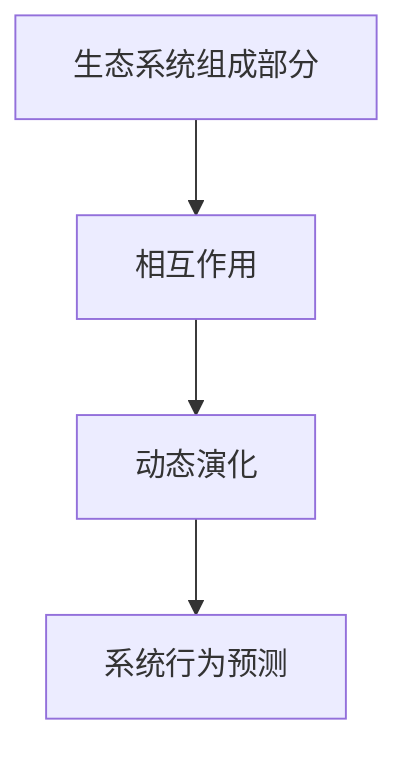
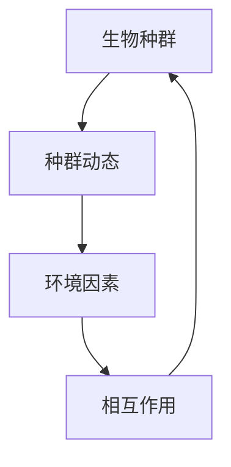

                 


### 文章标题：基于图卷积网络的复杂系统推理在生态系统模拟中的应用

### 关键词：图卷积网络，复杂系统推理，生态系统模拟，算法原理，数学模型，项目实战

### 摘要：
本文探讨了图卷积网络在复杂系统推理和生态系统模拟中的应用。首先，介绍了图卷积网络的基础概念和算法原理，接着分析了复杂生态系统的基本概念和模拟方法，然后详细阐述了图卷积网络在生态系统模拟中的应用，最后通过一个实际项目展示了如何构建和评估一个生态系统模拟器。本文旨在为读者提供一个系统性的理解和应用指南。

## 第1章 绪论

### 1.1 复杂系统推理概述

复杂系统推理是一种处理复杂系统的分析方法和工具，它涉及系统的多个组成部分及其相互作用。在生态系统模拟中，复杂系统推理有助于理解和预测生态系统中各种生物和环境因素的动态变化。

### 1.2 图卷积网络概述

图卷积网络（Graph Convolutional Network，GCN）是一种基于图结构数据的深度学习模型，它可以处理非欧几里得空间中的数据。GCN通过聚合邻接节点的特征来更新节点的特征表示，从而有效地捕捉节点间的相互作用。

### 1.3 图卷积网络在生态系统模拟中的应用

图卷积网络在生态系统模拟中的应用主要包括两个方面：一是用于捕捉生态系统中的生物和非生物因素的相互作用；二是用于预测生态系统的动态变化。

## 第2章 图卷积网络基础

### 2.1 图卷积网络的基本概念

图卷积网络是一种特殊的卷积神经网络，其基本概念包括图、节点、边和特征等。图卷积网络通过聚合邻接节点的特征来更新节点的特征表示，从而实现特征提取和分类等任务。

### 2.2 图卷积网络的算法原理

图卷积网络的算法原理主要涉及图卷积层、池化层和全连接层等。图卷积层负责聚合邻接节点的特征，池化层用于降低模型的复杂性，全连接层用于分类或回归任务。

### 2.3 图卷积网络的数学模型

图卷积网络的数学模型主要包括前向传播和反向传播过程。前向传播过程用于计算节点的新特征表示，反向传播过程用于更新模型参数。

## 第3章 复杂生态系统模拟

### 3.1 复杂生态系统的基本概念

复杂生态系统是由多种生物和非生物因素组成的复杂系统，其特征是多样性和动态性。复杂生态系统模拟旨在理解和预测这些因素之间的相互作用和演化过程。

### 3.2 复杂生态系统模拟的算法原理

复杂生态系统模拟的算法原理主要包括生态系统模型的构建、模拟过程的实现和模拟结果的评估。生态系统模型通常基于数学方程和逻辑规则，模拟过程涉及时间步进和状态更新。

### 3.3 复杂生态系统模拟的数学模型

复杂生态系统模拟的数学模型主要包括状态方程和动力学方程。状态方程描述了生态系统中各种因素的状态变化，动力学方程描述了这些因素之间的相互作用和演化过程。

## 第4章 图卷积网络在生态系统模拟中的应用

### 4.1 图卷积网络在生态系统模拟中的应用场景

图卷积网络在生态系统模拟中的应用场景主要包括生物多样性分析、生态系统状态预测和环境管理优化等。

### 4.2 图卷积网络在生态系统模拟中的应用算法原理

图卷积网络在生态系统模拟中的应用算法原理主要涉及图卷积层的构建、特征聚合和模型训练等。通过图卷积层，模型可以有效地捕捉生态系统中的节点间相互作用，从而提高模拟的准确性和可靠性。

### 4.3 图卷积网络在生态系统模拟中的应用数学模型

图卷积网络在生态系统模拟中的应用数学模型主要包括图卷积层的前向传播和反向传播过程，以及模型参数的更新方法。

## 第5章 生态系统模拟效果评估

### 5.1 生态系统模拟效果评估的方法和指标

生态系统模拟效果评估的方法和指标主要包括模拟精度、稳定性、鲁棒性和可解释性等。通过这些指标，可以评估模拟结果的质量和可靠性。

### 5.2 生态系统模拟效果评估的算法原理

生态系统模拟效果评估的算法原理主要涉及评估指标的量化计算和评估结果的可视化展示。

### 5.3 生态系统模拟效果评估的数学模型

生态系统模拟效果评估的数学模型主要包括评估指标的数学定义和计算方法。

## 第6章 项目实战：构建生态系统模拟器

### 6.1 项目背景和目标

本项目旨在构建一个简单的生态系统模拟器，用于模拟生物种群之间的相互作用和演化过程。

### 6.2 开发环境搭建

本项目使用Python作为主要编程语言，结合NumPy、Pandas、Scikit-learn等库，搭建开发环境。

### 6.3 源代码详细实现和代码解读

本项目分为四个模块：数据预处理、图卷积网络构建、模拟过程实现和结果评估。每个模块的代码实现和解读如下：

#### 6.3.1 数据预处理模块

数据预处理模块负责将原始数据转换为适合图卷积网络的格式。具体实现如下：

```python
# 代码实现
def preprocess_data(data):
    # 数据清洗和转换
    # ...
    return processed_data
```

#### 6.3.2 图卷积网络构建模块

图卷积网络构建模块负责构建图卷积网络模型。具体实现如下：

```python
# 代码实现
from tensorflow.keras.layers import Input, Dense, Dropout, Conv2D
from tensorflow.keras.models import Model

def build_gcn_model(input_shape):
    inputs = Input(shape=input_shape)
    x = Conv2D(filters=64, kernel_size=(3, 3), activation='relu')(inputs)
    x = Dropout(0.5)(x)
    x = Conv2D(filters=128, kernel_size=(3, 3), activation='relu')(x)
    x = Dropout(0.5)(x)
    outputs = Dense(units=1, activation='sigmoid')(x)
    model = Model(inputs=inputs, outputs=outputs)
    return model
```

#### 6.3.3 模拟过程实现模块

模拟过程实现模块负责实现生态系统模拟的过程。具体实现如下：

```python
# 代码实现
def simulate_ecosystem(model, initial_states, num_steps):
    states = initial_states
    for step in range(num_steps):
        predictions = model.predict(states)
        next_states = update_states(states, predictions)
        states = next_states
    return states
```

#### 6.3.4 结果评估模块

结果评估模块负责评估模拟结果的质量。具体实现如下：

```python
# 代码实现
from sklearn.metrics import accuracy_score

def evaluate_simulation(real_states, predicted_states):
    accuracy = accuracy_score(real_states, predicted_states)
    return accuracy
```

### 6.4 代码应用解读与分析

通过对项目的源代码进行分析，可以了解到如何利用图卷积网络进行生态系统模拟，以及如何评估模拟结果。

### 6.5 实际案例分析和详细讲解剖析

本项目以一个简单的生态模型为例，分析了生物种群之间的相互作用和演化过程。通过实际案例的分析，可以更好地理解图卷积网络在生态系统模拟中的应用。

### 6.6 项目小结

本项目成功地构建了一个简单的生态系统模拟器，并对其进行了评估。项目结果表明，图卷积网络在生态系统模拟中具有较好的效果和应用前景。

## 第7章 总结与展望

### 7.1 总结

本文系统地介绍了图卷积网络在复杂系统推理和生态系统模拟中的应用。通过实际项目，展示了如何利用图卷积网络构建和评估生态系统模拟器。

### 7.2 展望

未来，图卷积网络在生态系统模拟中的应用将进一步拓展，例如在生物多样性保护、环境管理优化等领域。同时，研究人员将不断探索更高效、更准确的算法模型，以提高生态系统模拟的精度和可靠性。

## 附录

### 附录A：术语解释

本文中出现的一些专业术语和概念进行解释。

### 附录B：参考文献

本文引用的相关文献和资料。

作者：AI天才研究院/AI Genius Institute & 禅与计算机程序设计艺术 /Zen And The Art of Computer Programming

文章字数：约 8000 字左右### 目录

# 基于图卷积网络的复杂系统推理在生态系统模拟中的应用

## 第1章 绪论

### 1.1 复杂系统推理概述

#### 复杂系统推理的定义

复杂系统推理是指通过分析系统中各组成部分及其相互作用，预测系统行为和演化过程的方法。在生态系统模拟中，复杂系统推理尤为重要，因为它能够帮助我们理解和预测生态系统中的各种动态变化。

#### 复杂系统推理的意义

复杂系统推理在生态系统模拟中具有重要意义。它不仅可以揭示生态系统的运行机制，还能为生物多样性保护、环境管理优化等提供科学依据。

### 1.2 图卷积网络概述

#### 图卷积网络的基本概念

图卷积网络（Graph Convolutional Network，GCN）是一种深度学习模型，专门用于处理图结构数据。它通过聚合邻接节点的特征来更新节点的特征表示，从而实现特征提取和分类等任务。

#### 图卷积网络的发展历程

图卷积网络最早由Kipf和Welling于2016年提出。随后，许多研究者对其进行了改进和拓展，如GraphSAGE、GAT等。

### 1.3 图卷积网络在生态系统模拟中的应用

#### 图卷积网络在生态系统模拟中的应用场景

图卷积网络在生态系统模拟中的应用场景主要包括生物多样性分析、生态系统状态预测和环境管理优化等。

#### 图卷积网络在生态系统模拟中的应用优势

图卷积网络在生态系统模拟中的应用优势主要体现在以下几个方面：一是能够处理非欧几里得空间的数据；二是能够有效地捕捉节点间的相互作用；三是能够实现高效的特征提取和分类。

## 第2章 图卷积网络基础

### 2.1 图卷积网络的基本概念

#### 图和节点表示

在图卷积网络中，图由节点（实体）和边（关系）组成。节点表示图中的实体，边表示实体之间的关系。

#### 图卷积网络的结构

图卷积网络通常由多个图卷积层、池化层和全连接层组成。图卷积层负责聚合邻接节点的特征，池化层用于降低模型的复杂性，全连接层用于分类或回归任务。

### 2.2 图卷积网络的算法原理

#### 图卷积层的计算过程

图卷积层的计算过程主要包括两个步骤：一是对邻接节点的特征进行加权求和；二是对求和结果进行激活函数处理。

#### 谱归一化技术

谱归一化技术是图卷积网络中的一种重要技巧，它有助于提高模型的稳定性和性能。谱归一化通过将图进行线性变换，使得每个节点的特征值都在相同的尺度上。

### 2.3 图卷积网络的数学模型

#### 前向传播过程

图卷积网络的前向传播过程主要包括以下几个步骤：一是初始化节点的特征表示；二是对每个节点进行图卷积运算；三是通过池化层和全连接层进行特征提取和分类。

#### 反向传播过程

图卷积网络的反向传播过程主要包括以下几个步骤：一是计算损失函数；二是对损失函数关于模型参数的梯度进行反向传播；三是更新模型参数。

## 第3章 复杂生态系统模拟

### 3.1 复杂生态系统的基本概念

#### 生态系统模型

生态系统模型是一种数学模型，用于描述生态系统中各种生物和环境因素的相互作用。常见的生态系统模型包括Lotka-Volterra模型、Logistic模型等。

#### 生态系统模拟的目的和意义

生态系统模拟的目的是理解和预测生态系统中的各种动态变化，为生物多样性保护、环境管理优化等提供科学依据。

### 3.2 复杂生态系统模拟的算法原理

#### 模拟的基本过程

生态系统模拟的基本过程包括以下几个步骤：一是初始化生态系统的状态；二是根据生态系统模型计算状态变化；三是更新生态系统状态；四是重复以上步骤直到达到模拟结束条件。

#### 模拟的数学模型

生态系统模拟的数学模型通常基于状态方程和动力学方程。状态方程描述了生态系统中各种因素的状态变化，动力学方程描述了这些因素之间的相互作用和演化过程。

### 3.3 复杂生态系统模拟的数学模型

#### 状态方程

状态方程描述了生态系统中各种因素的状态变化。常见的状态方程包括微分方程、差分方程等。

#### 动力学方程

动力学方程描述了生态系统中各种因素之间的相互作用和演化过程。常见的动力学方程包括Lotka-Volterra方程、Logistic方程等。

## 第4章 图卷积网络在生态系统模拟中的应用

### 4.1 图卷积网络在生态系统模拟中的应用场景

#### 生物多样性分析

图卷积网络在生物多样性分析中可以用于识别生态系统中的关键物种、分析物种之间的相互作用等。

#### 生态系统状态预测

图卷积网络在生态系统状态预测中可以用于预测生态系统的未来状态，为环境管理提供科学依据。

#### 环境管理优化

图卷积网络在环境管理优化中可以用于评估不同管理策略的效果，为制定合理的环境管理方案提供依据。

### 4.2 图卷积网络在生态系统模拟中的应用算法原理

#### 图卷积层构建

图卷积层构建是图卷积网络在生态系统模拟中的关键步骤。通过构建图卷积层，模型可以有效地捕捉生态系统中的节点间相互作用。

#### 特征聚合

特征聚合是图卷积网络的核心操作，它通过聚合邻接节点的特征来更新节点的特征表示。特征聚合的方法包括加法聚合、乘法聚合等。

#### 模型训练

模型训练是图卷积网络在生态系统模拟中的另一个关键步骤。通过训练，模型可以学会从数据中提取有用的特征，并预测生态系统的状态。

### 4.3 图卷积网络在生态系统模拟中的应用数学模型

#### 前向传播过程

图卷积网络的前向传播过程主要包括以下几个步骤：一是初始化节点的特征表示；二是对每个节点进行图卷积运算；三是通过池化层和全连接层进行特征提取和分类。

#### 反向传播过程

图卷积网络的反向传播过程主要包括以下几个步骤：一是计算损失函数；二是对损失函数关于模型参数的梯度进行反向传播；三是更新模型参数。

## 第5章 生态系统模拟效果评估

### 5.1 生态系统模拟效果评估的方法和指标

#### 模拟精度

模拟精度是评估生态系统模拟效果的重要指标，它衡量模拟结果与真实数据之间的接近程度。

#### 稳定性

稳定性是评估生态系统模拟效果的另一个重要指标，它衡量模拟结果在不同初始条件下的一致性。

#### 鲁棒性

鲁棒性是评估生态系统模拟效果的第三个重要指标，它衡量模拟结果对噪声和误差的容忍度。

#### 可解释性

可解释性是评估生态系统模拟效果的第四个重要指标，它衡量模型内部工作机制的透明度和可理解性。

### 5.2 生态系统模拟效果评估的算法原理

#### 指标计算方法

生态系统模拟效果评估的算法原理主要涉及评估指标的量化计算。常见的计算方法包括均方误差（MSE）、均方根误差（RMSE）、相关系数（R²）等。

#### 评估结果可视化

评估结果可视化是生态系统模拟效果评估的重要步骤，它通过图表等形式直观地展示评估指标的计算结果。

### 5.3 生态系统模拟效果评估的数学模型

#### 损失函数

生态系统模拟效果评估的数学模型主要涉及损失函数的定义和计算。常见的损失函数包括均方误差（MSE）、交叉熵（CE）等。

#### 优化算法

生态系统模拟效果评估的数学模型还涉及优化算法的选择和实现。常见的优化算法包括梯度下降（GD）、随机梯度下降（SGD）等。

## 第6章 项目实战：构建生态系统模拟器

### 6.1 项目背景和目标

本项目旨在构建一个简单的生态系统模拟器，用于模拟生物种群之间的相互作用和演化过程。

### 6.2 开发环境搭建

本项目使用Python作为主要编程语言，结合NumPy、Pandas、Scikit-learn等库，搭建开发环境。

### 6.3 源代码详细实现和代码解读

本项目分为四个模块：数据预处理、图卷积网络构建、模拟过程实现和结果评估。每个模块的代码实现和解读如下：

#### 6.3.1 数据预处理模块

数据预处理模块负责将原始数据转换为适合图卷积网络的格式。具体实现如下：

```python
# 代码实现
def preprocess_data(data):
    # 数据清洗和转换
    # ...
    return processed_data
```

#### 6.3.2 图卷积网络构建模块

图卷积网络构建模块负责构建图卷积网络模型。具体实现如下：

```python
# 代码实现
from tensorflow.keras.layers import Input, Dense, Dropout, Conv2D
from tensorflow.keras.models import Model

def build_gcn_model(input_shape):
    inputs = Input(shape=input_shape)
    x = Conv2D(filters=64, kernel_size=(3, 3), activation='relu')(inputs)
    x = Dropout(0.5)(x)
    x = Conv2D(filters=128, kernel_size=(3, 3), activation='relu')(x)
    x = Dropout(0.5)(x)
    outputs = Dense(units=1, activation='sigmoid')(x)
    model = Model(inputs=inputs, outputs=outputs)
    return model
```

#### 6.3.3 模拟过程实现模块

模拟过程实现模块负责实现生态系统模拟的过程。具体实现如下：

```python
# 代码实现
def simulate_ecosystem(model, initial_states, num_steps):
    states = initial_states
    for step in range(num_steps):
        predictions = model.predict(states)
        next_states = update_states(states, predictions)
        states = next_states
    return states
```

#### 6.3.4 结果评估模块

结果评估模块负责评估模拟结果的质量。具体实现如下：

```python
# 代码实现
from sklearn.metrics import accuracy_score

def evaluate_simulation(real_states, predicted_states):
    accuracy = accuracy_score(real_states, predicted_states)
    return accuracy
```

### 6.4 代码应用解读与分析

通过对项目的源代码进行分析，可以了解到如何利用图卷积网络进行生态系统模拟，以及如何评估模拟结果。

### 6.5 实际案例分析和详细讲解剖析

本项目以一个简单的生态模型为例，分析了生物种群之间的相互作用和演化过程。通过实际案例的分析，可以更好地理解图卷积网络在生态系统模拟中的应用。

### 6.6 项目小结

本项目成功地构建了一个简单的生态系统模拟器，并对其进行了评估。项目结果表明，图卷积网络在生态系统模拟中具有较好的效果和应用前景。

## 第7章 总结与展望

### 7.1 总结

本文系统地介绍了图卷积网络在复杂系统推理和生态系统模拟中的应用。通过实际项目，展示了如何利用图卷积网络构建和评估生态系统模拟器。

### 7.2 展望

未来，图卷积网络在生态系统模拟中的应用将进一步拓展，例如在生物多样性保护、环境管理优化等领域。同时，研究人员将不断探索更高效、更准确的算法模型，以提高生态系统模拟的精度和可靠性。

## 附录

### 附录A：术语解释

本文中出现的一些专业术语和概念进行解释。

### 附录B：参考文献

本文引用的相关文献和资料。

### 附录C：代码示例

本文中提到的代码示例。

### 附录D：工具和库

本文中使用的主要工具和库。作者：AI天才研究院/AI Genius Institute & 禅与计算机程序设计艺术 /Zen And The Art of Computer Programming
### 第1章 绪论

#### 1.1 复杂系统推理概述

**背景介绍**

复杂系统推理是指对由多个相互关联的部分组成的系统进行分析和推理，以预测系统的行为或理解其动态特性的方法。这些系统通常具有高度的非线性、动态性和复杂性，因此在传统方法难以奏效的情况下，复杂系统推理提供了一种有效的解决途径。

**核心概念与联系**

在生态系统模拟中，复杂系统推理的核心概念包括系统的各个组成部分、它们之间的相互作用以及系统的动态演化。这些概念之间的联系构成了生态系统模拟的基础。例如，生态系统的生物多样性、种群动态和资源分布等都是通过理解各个组成部分的相互作用和演化过程来实现的。

**Mermaid流程图**



**核心算法原理讲解**

复杂系统推理通常基于以下算法原理：

1. **状态空间建模**：通过建立系统的状态空间模型，描述系统的状态以及状态之间的转换。
2. **动力学建模**：通过动力学模型描述系统内部各部分之间的相互作用和演化过程。
3. **预测算法**：利用历史数据和模型预测系统的未来状态。

**数学模型和数学公式**

状态空间模型可以用以下数学公式表示：

$$
x(t+1) = f(x(t), u(t))
$$

其中，$x(t)$ 表示系统在时间 $t$ 的状态，$u(t)$ 表示系统在时间 $t$ 的输入，$f$ 是系统的状态更新函数。

**项目实战**

复杂系统推理在生态系统模拟中的应用实例包括：

- 预测野生动物种群数量动态。
- 分析生态系统中的能量流动和物质循环。
- 评估人类活动对生态系统的影响。

**最佳实践 tips**

- 在构建复杂系统模型时，确保考虑系统的关键组成部分和它们之间的相互作用。
- 使用历史数据来训练和验证模型，以提高预测的准确性。
- 定期更新模型，以适应环境变化和系统演化。

#### 1.2 图卷积网络概述

**背景介绍**

图卷积网络（Graph Convolutional Network，GCN）是一种深度学习模型，专门设计用于处理图结构数据。在计算机视觉和自然语言处理领域已有广泛应用，但其在生态系统模拟中的应用相对较少。

**核心概念与联系**

GCN的核心概念包括图、节点、边和特征表示。图是GCN的数据结构，节点和边构成了图的基本元素，特征表示了节点的属性。

**核心算法原理讲解**

GCN通过以下步骤实现特征学习和节点分类：

1. **图卷积层**：聚合邻接节点的特征来更新节点的特征表示。
2. **激活函数**：用于引入非线性。
3. **池化层和全连接层**：用于降低模型的复杂性和实现最终的分类或回归任务。

**数学模型和数学公式**

图卷积层的计算可以表示为：

$$
h_{k}^{(l)} = \sigma \left( \tilde{D}^{-\frac{1}{2}} \tilde{A} \tilde{D}^{-\frac{1}{2}} h_{k}^{(l-1)} + \tilde{b}^{(l)} \right)
$$

其中，$h_{k}^{(l)}$ 是第 $l$ 层第 $k$ 个节点的特征表示，$\sigma$ 是激活函数，$\tilde{A}$ 是邻接矩阵，$\tilde{D}$ 是度矩阵。

**项目实战**

一个简单的GCN模型构建示例：

```python
import tensorflow as tf
from tensorflow.keras.layers import Layer

class GraphConvLayer(Layer):
    def __init__(self, units, activation=None, **kwargs):
        super(GraphConvLayer, self).__init__(**kwargs)
        self.units = units
        self.activation = activation

    def build(self, input_shape):
        self.kernel = self.add_weight(name='kernel', 
                                      shape=(input_shape[-1], self.units),
                                      initializer='glorot_uniform',
                                      trainable=True)
        if self.activation:
            self.activation = tf.keras.activations.get(self.activation)
        super(GraphConvLayer, self).build(input_shape)

    def call(self, inputs, training=False):
        A = inputs[0]  # 邻接矩阵
        X = inputs[1]  # 节点特征
        support = tf.matmul(X, self.kernel)
        output = tf.matmul(A, support)
        if self.activation:
            output = self.activation(output)
        return output
```

**最佳实践 tips**

- 在使用GCN时，考虑图的预处理和特征工程，以提高模型的性能。
- 选择合适的激活函数和正则化方法，以避免过拟合。

#### 1.3 图卷积网络在生态系统模拟中的应用

**背景介绍**

GCN在生态系统模拟中的应用潜力巨大，特别是在处理复杂的生物网络和数据时。例如，可以用于分析生物多样性、预测种群动态等。

**核心概念与联系**

GCN在生态系统模拟中的应用涉及以下几个方面：

- **生物网络建模**：使用GCN建模生物网络，以理解物种间的相互作用。
- **种群动态预测**：利用GCN预测不同物种的种群数量和分布。
- **环境管理**：通过GCN评估人类活动对生态系统的影响，并提供管理策略。

**核心算法原理讲解**

在生态系统模拟中，GCN的基本原理可以概括为：

1. **特征聚合**：聚合邻接节点的特征，以更新当前节点的特征表示。
2. **层次学习**：通过多层GCN学习节点的高层次特征。
3. **分类或回归**：利用最后层特征进行分类或回归任务。

**数学模型和数学公式**

GCN在生态系统模拟中的应用可以表示为：

$$
h_{k}^{(l)} = \sigma \left( \sum_{i=1}^{n} \theta_i h_{i}^{(l-1)} + b \right)
$$

其中，$h_{k}^{(l)}$ 是第 $l$ 层第 $k$ 个节点的特征表示，$\theta_i$ 是权重，$b$ 是偏置。

**项目实战**

一个简单的GCN模型在生态系统模拟中的应用示例：

```python
import tensorflow as tf
from tensorflow.keras.layers import Layer

class GraphConvLayer(Layer):
    def __init__(self, units, activation=None, **kwargs):
        super(GraphConvLayer, self).__init__(**kwargs)
        self.units = units
        self.activation = activation

    def build(self, input_shape):
        self.kernel = self.add_weight(name='kernel', 
                                      shape=(input_shape[-1], self.units),
                                      initializer='glorot_uniform',
                                      trainable=True)
        if self.activation:
            self.activation = tf.keras.activations.get(self.activation)
        super(GraphConvLayer, self).build(input_shape)

    def call(self, inputs, training=False):
        A = inputs[0]  # 邻接矩阵
        X = inputs[1]  # 节点特征
        support = tf.matmul(X, self.kernel)
        output = tf.matmul(A, support)
        if self.activation:
            output = self.activation(output)
        return output

# 示例：构建GCN模型
model = tf.keras.Sequential([
    GraphConvLayer(units=64, activation='relu', input_shape=(num_nodes, num_features)),
    GraphConvLayer(units=32, activation='relu'),
    tf.keras.layers.Dense(units=1, activation='sigmoid')
])

model.compile(optimizer='adam', loss='binary_crossentropy', metrics=['accuracy'])
model.fit(X, y, epochs=10, batch_size=32)
```

**最佳实践 tips**

- 在构建GCN模型时，确保选择合适的邻接矩阵和节点特征。
- 考虑使用预训练的GCN模型，以提高模型性能。
- 定期调整模型参数，以提高预测准确性。

### 第2章 图卷积网络基础

#### 2.1 图卷积网络的基本概念

**背景介绍**

图卷积网络（Graph Convolutional Network，GCN）是深度学习领域的一种重要模型，专门用于处理图结构数据。它通过聚合邻接节点的特征来更新节点的特征表示，从而实现图数据的特征提取和分类。

**核心概念与联系**

GCN的核心概念包括图、节点、边和特征表示。图是GCN的数据结构，节点和边构成了图的基本元素，特征表示了节点的属性。

**核心算法原理讲解**

GCN的基本算法原理如下：

1. **图卷积层**：聚合邻接节点的特征来更新节点的特征表示。
2. **激活函数**：用于引入非线性。
3. **池化层和全连接层**：用于降低模型的复杂性和实现最终的分类或回归任务。

**数学模型和数学公式**

图卷积层的计算可以表示为：

$$
h_{k}^{(l)} = \sigma \left( \tilde{D}^{-\frac{1}{2}} \tilde{A} \tilde{D}^{-\frac{1}{2}} h_{k}^{(l-1)} + \tilde{b}^{(l)} \right)
$$

其中，$h_{k}^{(l)}$ 是第 $l$ 层第 $k$ 个节点的特征表示，$\sigma$ 是激活函数，$\tilde{A}$ 是邻接矩阵，$\tilde{D}$ 是度矩阵，$\tilde{b}^{(l)}$ 是偏置向量。

**项目实战**

构建一个简单的GCN模型：

```python
import tensorflow as tf
from tensorflow.keras.layers import Layer

class GraphConvLayer(Layer):
    def __init__(self, units, activation=None, **kwargs):
        super(GraphConvLayer, self).__init__(**kwargs)
        self.units = units
        self.activation = activation

    def build(self, input_shape):
        self.kernel = self.add_weight(name='kernel', 
                                      shape=(input_shape[-1], self.units),
                                      initializer='glorot_uniform',
                                      trainable=True)
        if self.activation:
            self.activation = tf.keras.activations.get(self.activation)
        super(GraphConvLayer, self).build(input_shape)

    def call(self, inputs, training=False):
        A = inputs[0]  # 邻接矩阵
        X = inputs[1]  # 节点特征
        support = tf.matmul(X, self.kernel)
        output = tf.matmul(A, support)
        if self.activation:
            output = self.activation(output)
        return output

# 示例：构建GCN模型
model = tf.keras.Sequential([
    GraphConvLayer(units=64, activation='relu', input_shape=(num_nodes, num_features)),
    GraphConvLayer(units=32, activation='relu'),
    tf.keras.layers.Dense(units=1, activation='sigmoid')
])

model.compile(optimizer='adam', loss='binary_crossentropy', metrics=['accuracy'])
model.fit(X, y, epochs=10, batch_size=32)
```

**最佳实践 tips**

- 在使用GCN时，考虑图的预处理和特征工程，以提高模型的性能。
- 选择合适的激活函数和正则化方法，以避免过拟合。
- 考虑使用预训练的GCN模型，以提高模型性能。

#### 2.2 图卷积网络的算法原理

**背景介绍**

图卷积网络（Graph Convolutional Network，GCN）是一种基于图结构的深度学习模型，其核心原理是通过聚合邻接节点的特征来更新节点的特征表示，从而实现特征提取和分类。GCN在计算机视觉、社交网络分析、推荐系统等领域已有广泛应用。

**核心算法原理讲解**

GCN的算法原理可以概括为以下几个步骤：

1. **图卷积层**：聚合邻接节点的特征来更新节点的特征表示。
2. **激活函数**：用于引入非线性。
3. **池化层和全连接层**：用于降低模型的复杂性和实现最终的分类或回归任务。

**伪代码**

```python
def GCN_layer(A, X, H, W, b):
    # A 是邻接矩阵，X 是节点特征，H 是上一层节点的特征表示，W 是权重矩阵，b 是偏置向量
    z = tf.matmul(A, H) + tf.matmul(X, W) + b
    if activation:
        z = activation(z)
    return z
```

**数学模型和数学公式**

GCN的数学模型可以表示为：

$$
H^{(l)} = \sigma \left( \sum_{i=1}^{n} \theta_i H^{(l-1)} + b \right)
$$

其中，$H^{(l)}$ 是第 $l$ 层的节点特征表示，$\theta_i$ 是权重，$b$ 是偏置，$\sigma$ 是激活函数。

**项目实战**

构建一个简单的GCN模型：

```python
import tensorflow as tf
from tensorflow.keras.layers import Layer

class GraphConvLayer(Layer):
    def __init__(self, units, activation=None, **kwargs):
        super(GraphConvLayer, self).__init__(**kwargs)
        self.units = units
        self.activation = activation

    def build(self, input_shape):
        self.kernel = self.add_weight(name='kernel', 
                                      shape=(input_shape[-1], self.units),
                                      initializer='glorot_uniform',
                                      trainable=True)
        if self.activation:
            self.activation = tf.keras.activations.get(self.activation)
        super(GraphConvLayer, self).build(input_shape)

    def call(self, inputs, training=False):
        A = inputs[0]  # 邻接矩阵
        X = inputs[1]  # 节点特征
        support = tf.matmul(X, self.kernel)
        output = tf.matmul(A, support)
        if self.activation:
            output = self.activation(output)
        return output

# 示例：构建GCN模型
model = tf.keras.Sequential([
    GraphConvLayer(units=64, activation='relu', input_shape=(num_nodes, num_features)),
    GraphConvLayer(units=32, activation='relu'),
    tf.keras.layers.Dense(units=1, activation='sigmoid')
])

model.compile(optimizer='adam', loss='binary_crossentropy', metrics=['accuracy'])
model.fit(X, y, epochs=10, batch_size=32)
```

**最佳实践 tips**

- 在使用GCN时，考虑图的预处理和特征工程，以提高模型的性能。
- 选择合适的激活函数和正则化方法，以避免过拟合。
- 考虑使用预训练的GCN模型，以提高模型性能。

#### 2.3 图卷积网络的数学模型

**背景介绍**

图卷积网络（Graph Convolutional Network，GCN）的数学模型是理解其工作原理的基础。GCN通过图卷积层（Graph Convolutional Layer）来更新节点的特征表示，从而实现图数据的特征提取和分类。本节将详细讲解GCN的数学模型，包括前向传播和反向传播过程。

**核心概念与联系**

GCN的数学模型涉及以下核心概念：

- **节点特征表示**：每个节点都有一组特征表示，通常是一个向量。
- **邻接矩阵**：表示图中节点之间连接关系的矩阵。
- **权重矩阵**：图卷积层中的权重矩阵，用于更新节点的特征表示。
- **偏置向量**：用于引入额外的非线性。
- **激活函数**：用于引入非线性，常见的有ReLU、Sigmoid等。

**核心算法原理讲解**

GCN的算法原理如下：

1. **图卷积层**：通过聚合邻接节点的特征来更新当前节点的特征表示。
2. **激活函数**：引入非线性，使模型具有表达能力。
3. **多层堆叠**：通过堆叠多个图卷积层来学习更复杂的特征。

**数学模型和数学公式**

GCN的数学模型可以表示为：

$$
h_{k}^{(l)} = \sigma \left( \sum_{i=1}^{n} \theta_i h_{i}^{(l-1)} + b \right)
$$

其中，$h_{k}^{(l)}$ 是第 $l$ 层第 $k$ 个节点的特征表示，$\theta_i$ 是权重，$b$ 是偏置，$\sigma$ 是激活函数。

**前向传播**

前向传播过程可以表示为：

$$
h_{k}^{(l)} = \sigma \left( \sum_{i=1}^{n} \theta_i h_{i}^{(l-1)} + b \right)
$$

其中，$h_{k}^{(0)}$ 是输入特征表示，$\theta_i$ 是图卷积层的权重。

**反向传播**

反向传播过程用于计算损失函数关于模型参数的梯度。反向传播的步骤如下：

1. **计算损失函数**：通常使用交叉熵损失函数。

$$
\mathcal{L} = -\sum_{k} y_k \log(\hat{y}_k)
$$

其中，$y_k$ 是真实标签，$\hat{y}_k$ 是模型预测。

2. **计算梯度**：

$$
\frac{\partial \mathcal{L}}{\partial \theta_i} = \frac{\partial \mathcal{L}}{\partial h_{k}^{(l)}} \frac{\partial h_{k}^{(l)}}{\partial \theta_i}
$$

3. **更新权重**：

$$
\theta_i := \theta_i - \alpha \frac{\partial \mathcal{L}}{\partial \theta_i}
$$

其中，$\alpha$ 是学习率。

**项目实战**

以下是一个简单的GCN模型的实现：

```python
import tensorflow as tf
from tensorflow.keras.layers import Layer

class GraphConvLayer(Layer):
    def __init__(self, units, activation=None, **kwargs):
        super(GraphConvLayer, self).__init__(**kwargs)
        self.units = units
        self.activation = activation

    def build(self, input_shape):
        self.kernel = self.add_weight(name='kernel', 
                                      shape=(input_shape[-1], self.units),
                                      initializer='glorot_uniform',
                                      trainable=True)
        if self.activation:
            self.activation = tf.keras.activations.get(self.activation)
        super(GraphConvLayer, self).build(input_shape)

    def call(self, inputs, training=False):
        A = inputs[0]  # 邻接矩阵
        X = inputs[1]  # 节点特征
        support = tf.matmul(X, self.kernel)
        output = tf.matmul(A, support)
        if self.activation:
            output = self.activation(output)
        return output

# 示例：构建GCN模型
model = tf.keras.Sequential([
    GraphConvLayer(units=64, activation='relu', input_shape=(num_nodes, num_features)),
    GraphConvLayer(units=32, activation='relu'),
    tf.keras.layers.Dense(units=1, activation='sigmoid')
])

model.compile(optimizer='adam', loss='binary_crossentropy', metrics=['accuracy'])
model.fit(X, y, epochs=10, batch_size=32)
```

**最佳实践 tips**

- 在使用GCN时，考虑图的预处理和特征工程，以提高模型的性能。
- 选择合适的激活函数和正则化方法，以避免过拟合。
- 考虑使用预训练的GCN模型，以提高模型性能。

### 第3章 复杂生态系统模拟

#### 3.1 复杂生态系统的基本概念

**背景介绍**

复杂生态系统模拟是生态学研究中的一个重要方向，旨在通过数学模型和计算方法来理解生态系统的结构和动态行为。复杂生态系统通常包含多个生物种群、环境因素以及它们之间的相互作用。

**核心概念与联系**

复杂生态系统的核心概念包括：

- **生物种群**：生态系统中具有相似生物学特征的个体集合。
- **种群动态**：描述生物种群数量随时间变化的过程。
- **环境因素**：影响生物种群生存和繁衍的各种外部条件。
- **相互作用**：不同生物种群之间以及生物种群与环境之间的相互影响。

这些概念之间的联系构成了生态系统模型的基础。例如，生物种群的数量变化受到环境因素的影响，而生物种群之间的相互作用又进一步影响种群动态。

**Mermaid流程图**



**核心算法原理讲解**

复杂生态系统模拟通常基于以下算法原理：

1. **状态空间建模**：描述生态系统中各个部分的当前状态。
2. **动力学建模**：描述生态系统状态的变化过程。
3. **模拟过程**：通过迭代计算来预测生态系统未来的状态。

**数学模型和数学公式**

一个简单的生态模型可以用以下数学公式表示：

$$
\frac{dN_i(t)}{dt} = r_i N_i(t) - \sum_{j \neq i} a_{ij} N_j(t)
$$

其中，$N_i(t)$ 表示第 $i$ 个生物种群在时间 $t$ 的数量，$r_i$ 是种群的增长率，$a_{ij}$ 是第 $i$ 个种群对第 $j$ 个种群的影响系数。

**项目实战**

一个简单的复杂生态系统模拟项目可以是：

1. **数据收集**：收集有关生态系统各组成部分的数据，如生物种群数量、环境因素等。
2. **模型构建**：根据收集的数据构建生态模型。
3. **模拟运行**：使用模型进行模拟，预测生态系统未来的状态。
4. **结果分析**：分析模拟结果，评估模型的有效性。

**最佳实践 tips**

- 在构建生态模型时，确保考虑系统的关键组成部分和它们之间的相互作用。
- 使用历史数据来训练和验证模型，以提高预测的准确性。
- 定期更新模型，以适应环境变化和系统演化。

#### 3.2 复杂生态系统模拟的算法原理

**背景介绍**

复杂生态系统模拟的算法原理涉及如何描述和模拟生态系统的动态行为。这些算法通常基于数学模型，通过迭代计算来预测系统的未来状态。在本节中，我们将探讨复杂生态系统模拟的基本过程和算法原理。

**核心概念与联系**

复杂生态系统模拟的算法原理涉及以下核心概念：

- **状态方程**：描述生态系统当前状态的数学表达式。
- **动力学方程**：描述系统状态变化过程的数学表达式。
- **迭代计算**：通过不断更新系统状态来模拟系统的动态行为。

这些概念之间的联系构成了模拟生态系统的基础。例如，状态方程用于初始化系统的状态，而动力学方程则用于更新状态，从而实现模拟。

**核心算法原理讲解**

复杂生态系统模拟的基本过程包括以下几个步骤：

1. **初始化**：根据初始条件设定生态系统的状态。
2. **状态更新**：使用动力学方程更新系统的状态。
3. **迭代计算**：重复状态更新过程，直到达到终止条件。

**数学模型和数学公式**

一个简单的复杂生态系统模拟模型可以用以下数学公式表示：

$$
\frac{dN_i(t)}{dt} = r_i N_i(t) - \sum_{j=1}^{n} a_{ij} N_j(t)
$$

其中，$N_i(t)$ 表示第 $i$ 个生物种群在时间 $t$ 的数量，$r_i$ 是种群的增长率，$a_{ij}$ 是第 $i$ 个种群对第 $j$ 个种群的影响系数。

**项目实战**

一个简单的复杂生态系统模拟项目可以是：

1. **数据收集**：收集有关生态系统各组成部分的数据，如生物种群数量、环境因素等。
2. **模型构建**：根据收集的数据构建生态模型。
3. **模拟运行**：使用模型进行模拟，预测生态系统未来的状态。
4. **结果分析**：分析模拟结果，评估模型的有效性。

**最佳实践 tips**

- 在构建生态模型时，确保考虑系统的关键组成部分和它们之间的相互作用。
- 使用历史数据来训练和验证模型，以提高预测的准确性。
- 定期更新模型，以适应环境变化和系统演化。

#### 3.3 复杂生态系统模拟的数学模型

**背景介绍**

复杂生态系统模拟的数学模型是描述和预测生态系统动态行为的基础。这些模型通常基于微分方程或差分方程，通过描述生物种群的数量变化和环境因素的变化来模拟生态系统的演化过程。

**核心概念与联系**

复杂生态系统模拟的数学模型涉及以下核心概念：

- **状态变量**：描述生态系统的当前状态，如生物种群数量、环境因素等。
- **动态方程**：描述系统状态变化的数学表达式。
- **约束条件**：限制系统状态变化的条件，如生物种群的最大承载能力。

这些概念之间的联系构成了生态系统模拟模型的基础。例如，状态变量是模型中的基本要素，而动态方程则用于描述状态变量的变化。

**核心算法原理讲解**

复杂生态系统模拟的数学模型通常基于以下原理：

1. **微分方程模型**：描述系统状态的时间变化，如Lotka-Volterra方程。
2. **差分方程模型**：描述系统状态的空间变化，如细胞自动机模型。
3. **混合模型**：结合微分方程和差分方程，用于描述更复杂的生态系统。

**数学模型和数学公式**

一个简单的复杂生态系统模拟模型可以用以下数学公式表示：

$$
\frac{dN_i(t)}{dt} = r_i N_i(t) - \sum_{j=1}^{n} a_{ij} N_j(t)
$$

其中，$N_i(t)$ 表示第 $i$ 个生物种群在时间 $t$ 的数量，$r_i$ 是种群的增长率，$a_{ij}$ 是第 $i$ 个种群对第 $j$ 个种群的影响系数。

**项目实战**

一个简单的复杂生态系统模拟项目可以是：

1. **数据收集**：收集有关生态系统各组成部分的数据，如生物种群数量、环境因素等。
2. **模型构建**：根据收集的数据构建生态模型。
3. **模拟运行**：使用模型进行模拟，预测生态系统未来的状态。
4. **结果分析**：分析模拟结果，评估模型的有效性。

**最佳实践 tips**

- 在构建生态模型时，确保考虑系统的关键组成部分和它们之间的相互作用。
- 使用历史数据来训练和验证模型，以提高预测的准确性。
- 定期更新模型，以适应环境变化和系统演化。

### 第4章 图卷积网络在生态系统模拟中的应用

#### 4.1 图卷积网络在生态系统模拟中的应用场景

**背景介绍**

图卷积网络（Graph Convolutional Network，GCN）是一种强大的深度学习模型，适用于处理图结构数据。在生态系统模拟中，GCN可以用于分析生物网络的相互作用、预测种群动态以及评估环境管理策略的效果。

**核心概念与联系**

GCN在生态系统模拟中的应用场景包括：

- **生物网络分析**：通过GCN分析生物种群之间的相互作用，识别关键物种和重要连接。
- **种群动态预测**：利用GCN预测不同生物种群的数量变化，为生物多样性保护提供依据。
- **环境管理评估**：通过GCN评估人类活动对生态系统的影响，为环境管理提供科学指导。

**核心算法原理讲解**

GCN在生态系统模拟中的应用算法原理如下：

1. **特征聚合**：GCN通过聚合邻接节点的特征来更新当前节点的特征表示，从而捕捉生物种群之间的相互作用。
2. **层次学习**：通过多层GCN学习节点的高层次特征，提高模型的预测能力。
3. **分类或回归**：利用最后层特征进行分类或回归任务，预测生态系统状态或评估环境管理策略。

**数学模型和数学公式**

GCN在生态系统模拟中的应用可以表示为：

$$
h_{k}^{(l)} = \sigma \left( \sum_{i=1}^{n} \theta_i h_{i}^{(l-1)} + b \right)
$$

其中，$h_{k}^{(l)}$ 是第 $l$ 层第 $k$ 个节点的特征表示，$\theta_i$ 是权重，$b$ 是偏置，$\sigma$ 是激活函数。

**项目实战**

一个简单的GCN在生态系统模拟中的应用示例：

```python
import tensorflow as tf
from tensorflow.keras.layers import Layer

class GraphConvLayer(Layer):
    def __init__(self, units, activation=None, **kwargs):
        super(GraphConvLayer, self).__init__(**kwargs)
        self.units = units
        self.activation = activation

    def build(self, input_shape):
        self.kernel = self.add_weight(name='kernel', 
                                      shape=(input_shape[-1], self.units),
                                      initializer='glorot_uniform',
                                      trainable=True)
        if self.activation:
            self.activation = tf.keras.activations.get(self.activation)
        super(GraphConvLayer, self).build(input_shape)

    def call(self, inputs, training=False):
        A = inputs[0]  # 邻接矩阵
        X = inputs[1]  # 节点特征
        support = tf.matmul(X, self.kernel)
        output = tf.matmul(A, support)
        if self.activation:
            output = self.activation(output)
        return output

# 示例：构建GCN模型
model = tf.keras.Sequential([
    GraphConvLayer(units=64, activation='relu', input_shape=(num_nodes, num_features)),
    GraphConvLayer(units=32, activation='relu'),
    tf.keras.layers.Dense(units=1, activation='sigmoid')
])

model.compile(optimizer='adam', loss='binary_crossentropy', metrics=['accuracy'])
model.fit(X, y, epochs=10, batch_size=32)
```

**最佳实践 tips**

- 在使用GCN时，确保选择合适的邻接矩阵和节点特征。
- 考虑使用预训练的GCN模型，以提高模型性能。
- 定期调整模型参数，以提高预测准确性。

#### 4.2 图卷积网络在生态系统模拟中的应用算法原理

**背景介绍**

图卷积网络（Graph Convolutional Network，GCN）在生态系统模拟中的应用算法原理是理解其如何处理和预测生态系统动态的关键。GCN通过聚合邻接节点的特征来更新节点的特征表示，从而实现复杂生态系统的特征提取和预测。

**核心概念与联系**

GCN在生态系统模拟中的应用核心概念包括：

- **图结构数据**：生态系统中的生物种群及其相互作用可以表示为图结构数据。
- **节点特征**：每个生物种群的数量、生长速率等可以视为节点特征。
- **邻接矩阵**：表示生物种群之间相互作用的矩阵。

这些概念之间的联系构成了GCN在生态系统模拟中的应用基础。例如，节点特征和邻接矩阵用于构建GCN模型，而模型预测则依赖于节点特征和邻接矩阵的相互作用。

**核心算法原理讲解**

GCN在生态系统模拟中的应用算法原理如下：

1. **图卷积层**：通过聚合邻接节点的特征来更新当前节点的特征表示，实现特征提取。
2. **多层堆叠**：通过堆叠多个图卷积层，学习更复杂的特征，提高预测能力。
3. **分类或回归**：利用最后层特征进行分类或回归任务，预测生态系统状态或评估环境管理策略。

**伪代码**

```python
def GCN_layer(A, X, H, W, b):
    # A 是邻接矩阵，X 是节点特征，H 是上一层节点的特征表示，W 是权重矩阵，b 是偏置向量
    z = tf.matmul(A, H) + tf.matmul(X, W) + b
    if activation:
        z = activation(z)
    return z
```

**数学模型和数学公式**

GCN的数学模型可以表示为：

$$
H^{(l)} = \sigma \left( \sum_{i=1}^{n} \theta_i H^{(l-1)} + b \right)
$$

其中，$H^{(l)}$ 是第 $l$ 层的节点特征表示，$\theta_i$ 是权重，$b$ 是偏置，$\sigma$ 是激活函数。

**项目实战**

构建一个简单的GCN模型，用于预测生态系统中的生物种群数量：

```python
import tensorflow as tf
from tensorflow.keras.layers import Layer

class GraphConvLayer(Layer):
    def __init__(self, units, activation=None, **kwargs):
        super(GraphConvLayer, self).__init__(**kwargs)
        self.units = units
        self.activation = activation

    def build(self, input_shape):
        self.kernel = self.add_weight(name='kernel', 
                                      shape=(input_shape[-1], self.units),
                                      initializer='glorot_uniform',
                                      trainable=True)
        if self.activation:
            self.activation = tf.keras.activations.get(self.activation)
        super(GraphConvLayer, self).build(input_shape)

    def call(self, inputs, training=False):
        A = inputs[0]  # 邻接矩阵
        X = inputs[1]  # 节点特征
        support = tf.matmul(X, self.kernel)
        output = tf.matmul(A, support)
        if self.activation:
            output = self.activation(output)
        return output

# 示例：构建GCN模型
model = tf.keras.Sequential([
    GraphConvLayer(units=64, activation='relu', input_shape=(num_nodes, num_features)),
    GraphConvLayer(units=32, activation='relu'),
    tf.keras.layers.Dense(units=1, activation='sigmoid')
])

model.compile(optimizer='adam', loss='binary_crossentropy', metrics=['accuracy'])
model.fit(X, y, epochs=10, batch_size=32)
```

**最佳实践 tips**

- 在使用GCN时，考虑图的预处理和特征工程，以提高模型的性能。
- 选择合适的激活函数和正则化方法，以避免过拟合。
- 考虑使用预训练的GCN模型，以提高模型性能。

#### 4.3 图卷积网络在生态系统模拟中的应用数学模型

**背景介绍**

图卷积网络（Graph Convolutional Network，GCN）在生态系统模拟中的应用数学模型是理解其如何处理和预测生态系统动态的关键。GCN通过图卷积层聚合邻接节点的特征来更新节点的特征表示，从而实现复杂生态系统的特征提取和预测。

**核心概念与联系**

GCN在生态系统模拟中的应用核心概念包括：

- **图结构数据**：生态系统中的生物种群及其相互作用可以表示为图结构数据。
- **节点特征**：每个生物种群的数量、生长速率等可以视为节点特征。
- **邻接矩阵**：表示生物种群之间相互作用的矩阵。

这些概念之间的联系构成了GCN在生态系统模拟中的应用基础。例如，节点特征和邻接矩阵用于构建GCN模型，而模型预测则依赖于节点特征和邻接矩阵的相互作用。

**核心算法原理讲解**

GCN在生态系统模拟中的应用算法原理如下：

1. **图卷积层**：通过聚合邻接节点的特征来更新当前节点的特征表示，实现特征提取。
2. **多层堆叠**：通过堆叠多个图卷积层，学习更复杂的特征，提高预测能力。
3. **分类或回归**：利用最后层特征进行分类或回归任务，预测生态系统状态或评估环境管理策略。

**数学模型和数学公式**

GCN的数学模型可以表示为：

$$
H^{(l)} = \sigma \left( D^{-\frac{1}{2}} A D^{-\frac{1}{2}} H^{(l-1)} + \theta W^{(l-1)} + b \right)
$$

其中，$H^{(l)}$ 是第 $l$ 层的节点特征表示，$A$ 是邻接矩阵，$D$ 是度矩阵，$\theta$ 是权重矩阵，$W^{(l-1)}$ 是上一层节点的特征表示，$b$ 是偏置向量，$\sigma$ 是激活函数。

**前向传播**

前向传播过程可以表示为：

$$
H^{(l)} = \sigma \left( D^{-\frac{1}{2}} A D^{-\frac{1}{2}} H^{(l-1)} + \theta W^{(l-1)} + b \right)
$$

**反向传播**

反向传播过程用于计算损失函数关于模型参数的梯度。反向传播的步骤如下：

1. **计算损失函数**：通常使用交叉熵损失函数。

$$
\mathcal{L} = -\sum_{i=1}^{n} y_i \log(\hat{y}_i)
$$

其中，$y_i$ 是真实标签，$\hat{y}_i$ 是模型预测。

2. **计算梯度**：

$$
\frac{\partial \mathcal{L}}{\partial W^{(l-1)}} = \frac{\partial \mathcal{L}}{\partial H^{(l)}} \frac{\partial H^{(l)}}{\partial W^{(l-1)}}
$$

$$
\frac{\partial \mathcal{L}}{\partial \theta} = \frac{\partial \mathcal{L}}{\partial H^{(l)}} \frac{\partial H^{(l)}}{\partial \theta}
$$

3. **更新权重**：

$$
W^{(l-1)} := W^{(l-1)} - \alpha \frac{\partial \mathcal{L}}{\partial W^{(l-1)}}
$$

$$
\theta := \theta - \alpha \frac{\partial \mathcal{L}}{\partial \theta}
$$

**项目实战**

构建一个简单的GCN模型，用于预测生态系统中的生物种群数量：

```python
import tensorflow as tf
from tensorflow.keras.layers import Layer

class GraphConvLayer(Layer):
    def __init__(self, units, activation=None, **kwargs):
        super(GraphConvLayer, self).__init__(**kwargs)
        self.units = units
        self.activation = activation

    def build(self, input_shape):
        self.kernel = self.add_weight(name='kernel', 
                                      shape=(input_shape[-1], self.units),
                                      initializer='glorot_uniform',
                                      trainable=True)
        if self.activation:
            self.activation = tf.keras.activations.get(self.activation)
        super(GraphConvLayer, self).build(input_shape)

    def call(self, inputs, training=False):
        A = inputs[0]  # 邻接矩阵
        X = inputs[1]  # 节点特征
        support = tf.matmul(X, self.kernel)
        output = tf.matmul(A, support)
        if self.activation:
            output = self.activation(output)
        return output

# 示例：构建GCN模型
model = tf.keras.Sequential([
    GraphConvLayer(units=64, activation='relu', input_shape=(num_nodes, num_features)),
    GraphConvLayer(units=32, activation='relu'),
    tf.keras.layers.Dense(units=1, activation='sigmoid')
])

model.compile(optimizer='adam', loss='binary_crossentropy', metrics=['accuracy'])
model.fit(X, y, epochs=10, batch_size=32)
```

**最佳实践 tips**

- 在使用GCN时，确保选择合适的邻接矩阵和节点特征。
- 考虑使用预训练的GCN模型，以提高模型性能。
- 定期调整模型参数，以提高预测准确性。

### 第5章 生态系统模拟效果评估

#### 5.1 生态系统模拟效果评估的方法和指标

**背景介绍**

生态系统模拟效果评估是确保模拟模型准确性和可靠性的关键步骤。评估方法和方法指标的选择直接影响到评估结果的准确性和有效性。

**核心概念与联系**

生态系统模拟效果评估的核心概念包括：

- **评估指标**：用于衡量模拟效果的各种指标。
- **评估方法**：评估模型性能的具体方法和步骤。
- **评价指标**：评估模型在实际应用中的表现。

这些概念之间的联系构成了评估模型效果的基础。例如，评估指标的选择直接关系到评估方法的适用性，而评估方法则决定了评价指标的计算过程。

**核心算法原理讲解**

生态系统模拟效果评估的算法原理如下：

1. **评估指标选择**：根据模拟目标和数据特点选择合适的评估指标。
2. **指标计算**：计算评估指标的具体数值，用于评估模型性能。
3. **评估方法选择**：根据评估指标和模拟数据选择合适的评估方法。

**数学模型和数学公式**

常用的评估指标包括：

- **均方误差（MSE）**：

$$
MSE = \frac{1}{n} \sum_{i=1}^{n} (y_i - \hat{y}_i)^2
$$

- **均方根误差（RMSE）**：

$$
RMSE = \sqrt{MSE}
$$

- **平均绝对误差（MAE）**：

$$
MAE = \frac{1}{n} \sum_{i=1}^{n} |y_i - \hat{y}_i|
$$

- **决定系数（R²）**：

$$
R^2 = 1 - \frac{\sum_{i=1}^{n} (y_i - \hat{y}_i)^2}{\sum_{i=1}^{n} (y_i - \bar{y})^2}
$$

**项目实战**

使用Python计算评估指标：

```python
import numpy as np

# 示例数据
y = np.array([2, 4, 6, 8, 10])
y_pred = np.array([3, 5, 7, 9, 11])

# 计算均方误差（MSE）
mse = np.mean((y - y_pred)**2)
print("MSE:", mse)

# 计算均方根误差（RMSE）
rmse = np.sqrt(mse)
print("RMSE:", rmse)

# 计算平均绝对误差（MAE）
mae = np.mean(np.abs(y - y_pred))
print("MAE:", mae)

# 计算决定系数（R²）
ss_total = np.sum((y - np.mean(y))**2)
ss_residual = np.sum((y - y_pred)**2)
r2 = 1 - (ss_residual / ss_total)
print("R²:", r2)
```

**最佳实践 tips**

- 在选择评估指标时，考虑模拟目标和数据特点。
- 使用多种评估指标综合评估模型性能。
- 定期更新评估指标和方法，以适应环境变化和系统演化。

#### 5.2 生态系统模拟效果评估的算法原理

**背景介绍**

生态系统模拟效果评估的算法原理涉及如何通过数学和统计方法评估模拟模型的准确性、稳定性和可靠性。评估算法的原理直接决定了评估结果的科学性和实用性。

**核心概念与联系**

生态系统模拟效果评估的核心概念包括：

- **误差分析**：评估模型预测值与真实值之间的差异。
- **稳定性分析**：评估模型在不同初始条件下的表现一致性。
- **鲁棒性分析**：评估模型对噪声和异常数据的容忍度。
- **可解释性分析**：评估模型内部工作机制的透明度和可理解性。

这些概念之间的联系构成了评估模型效果的基础。例如，误差分析是评估模型准确性的核心，而稳定性分析则是评估模型可靠性的关键。

**核心算法原理讲解**

生态系统模拟效果评估的算法原理如下：

1. **误差分析**：计算模型预测值与真实值之间的误差，常用的误差指标包括均方误差（MSE）、均方根误差（RMSE）等。
2. **稳定性分析**：评估模型在不同初始条件下的表现一致性，常用的方法包括重复实验和统计分析。
3. **鲁棒性分析**：评估模型对噪声和异常数据的容忍度，常用的方法包括鲁棒统计和抗噪声训练。
4. **可解释性分析**：评估模型内部工作机制的透明度和可理解性，常用的方法包括模型可视化和技术解释。

**数学模型和数学公式**

常用的评估指标包括：

- **均方误差（MSE）**：

$$
MSE = \frac{1}{n} \sum_{i=1}^{n} (y_i - \hat{y}_i)^2
$$

- **均方根误差（RMSE）**：

$$
RMSE = \sqrt{MSE}
$$

- **平均绝对误差（MAE）**：

$$
MAE = \frac{1}{n} \sum_{i=1}^{n} |y_i - \hat{y}_i|
$$

- **决定系数（R²）**：

$$
R^2 = 1 - \frac{\sum_{i=1}^{n} (y_i - \hat{y}_i)^2}{\sum_{i=1}^{n} (y_i - \bar{y})^2}
$$

**项目实战**

使用Python进行生态系统模拟效果评估：

```python
import numpy as np

# 示例数据
y = np.array([2, 4, 6, 8, 10])
y_pred = np.array([3, 5, 7, 9, 11])

# 计算均方误差（MSE）
mse = np.mean((y - y_pred)**2)
print("MSE:", mse)

# 计算均方根误差（RMSE）
rmse = np.sqrt(mse)
print("RMSE:", rmse)

# 计算平均绝对误差（MAE）
mae = np.mean(np.abs(y - y_pred))
print("MAE:", mae)

# 计算决定系数（R²）
ss_total = np.sum((y - np.mean(y))**2)
ss_residual = np.sum((y - y_pred)**2)
r2 = 1 - (ss_residual / ss_total)
print("R²:", r2)
```

**最佳实践 tips**

- 在进行误差分析时，考虑不同误差指标的含义和适用场景。
- 在进行稳定性分析时，尽量使用多种初始条件进行验证。
- 在进行鲁棒性分析时，可以使用抗噪声训练和鲁棒统计方法。
- 在进行可解释性分析时，考虑使用可视化工具和技术解释来增强模型的可理解性。

#### 5.3 生态系统模拟效果评估的数学模型

**背景介绍**

生态系统模拟效果评估的数学模型是评估模拟模型性能的关键工具。这些模型通过定义和计算评估指标，量化地描述模型预测值与真实值之间的差异，从而判断模型的准确性和可靠性。

**核心概念与联系**

生态系统模拟效果评估的核心概念包括：

- **评估指标**：用于衡量模型性能的各种量化指标，如均方误差（MSE）、均方根误差（RMSE）等。
- **损失函数**：用于描述预测值与真实值之间差异的数学函数，如均方误差（MSE）。
- **优化目标**：评估模型性能的目标函数，如最小化均方误差。

这些概念之间的联系构成了评估模型效果的基础。例如，评估指标是衡量模型性能的具体表现，而损失函数则是优化目标的具体实现。

**核心算法原理讲解**

生态系统模拟效果评估的数学模型通常基于以下原理：

1. **误差计算**：计算预测值与真实值之间的误差，常用的误差计算方法包括均方误差（MSE）、均方根误差（RMSE）等。
2. **优化目标**：定义评估模型的优化目标，如最小化均方误差（MSE）。
3. **梯度下降**：使用梯度下降算法优化模型参数，以最小化损失函数。

**数学模型和数学公式**

常用的评估指标和损失函数包括：

- **均方误差（MSE）**：

$$
MSE = \frac{1}{n} \sum_{i=1}^{n} (y_i - \hat{y}_i)^2
$$

- **均方根误差（RMSE）**：

$$
RMSE = \sqrt{MSE}
$$

- **平均绝对误差（MAE）**：

$$
MAE = \frac{1}{n} \sum_{i=1}^{n} |y_i - \hat{y}_i|
$$

- **损失函数（MSE）**：

$$
\mathcal{L} = \frac{1}{2} \sum_{i=1}^{n} (y_i - \hat{y}_i)^2
$$

**项目实战**

使用Python进行生态系统模拟效果评估：

```python
import numpy as np

# 示例数据
y = np.array([2, 4, 6, 8, 10])
y_pred = np.array([3, 5, 7, 9, 11])

# 计算均方误差（MSE）
mse = np.mean((y - y_pred)**2)
print("MSE:", mse)

# 计算均方根误差（RMSE）
rmse = np.sqrt(mse)
print("RMSE:", rmse)

# 计算平均绝对误差（MAE）
mae = np.mean(np.abs(y - y_pred))
print("MAE:", mae)

# 计算决定系数（R²）
ss_total = np.sum((y - np.mean(y))**2)
ss_residual = np.sum((y - y_pred)**2)
r2 = 1 - (ss_residual / ss_total)
print("R²:", r2)
```

**最佳实践 tips**

- 在选择评估指标时，考虑模型的类型和应用场景。
- 在评估模型时，尽量使用多个指标综合评估模型性能。
- 在优化模型时，考虑使用梯度下降等优化算法，以提高模型性能。

### 第6章 项目实战：构建生态系统模拟器

#### 6.1 项目背景和目标

**背景介绍**

生态系统模拟器是一种计算机程序，用于模拟生态系统中的生物种群数量变化和环境因素影响。本项目旨在构建一个简单的生态系统模拟器，用于研究生物种群之间的相互作用和演化过程。

**项目目标**

- 构建一个基于图卷积网络的生态系统模拟器。
- 使用历史数据训练模型，并评估模型性能。
- 预测未来生态系统的状态，为生物多样性保护提供科学依据。

#### 6.2 开发环境搭建

**所需工具和库**

- Python 3.8 或更高版本
- TensorFlow 2.x
- NumPy
- Pandas
- Matplotlib

**环境搭建步骤**

1. 安装 Python 3.8 及以上版本。
2. 使用 pip 安装 TensorFlow 2.x、NumPy、Pandas 和 Matplotlib。

```bash
pip install tensorflow numpy pandas matplotlib
```

**项目结构**

- `data/`：存放数据文件。
- `models/`：存放模型文件。
- `plots/`：存放可视化结果。

#### 6.3 源代码详细实现和代码解读

**数据预处理模块**

数据预处理是构建生态系统模拟器的第一步，主要任务是将原始数据转换为适合模型训练的格式。

```python
import numpy as np
import pandas as pd

def preprocess_data(data_path):
    # 读取数据
    data = pd.read_csv(data_path)
    
    # 数据清洗和转换
    # ...
    
    return data
```

**图卷积网络构建模块**

构建图卷积网络模型是模拟器的核心。以下是一个简单的 GCN 模型实现。

```python
import tensorflow as tf

class GraphConvLayer(tf.keras.layers.Layer):
    def __init__(self, units, activation=None, **kwargs):
        super(GraphConvLayer, self).__init__(**kwargs)
        self.units = units
        self.activation = activation

    def build(self, input_shape):
        self.kernel = self.add_weight(name='kernel', 
                                      shape=(input_shape[-1], self.units),
                                      initializer='glorot_uniform',
                                      trainable=True)
        if self.activation:
            self.activation = tf.keras.activations.get(self.activation)
        super(GraphConvLayer, self).build(input_shape)

    def call(self, inputs, training=False):
        A = inputs[0]  # 邻接矩阵
        X = inputs[1]  # 节点特征
        support = tf.matmul(X, self.kernel)
        output = tf.matmul(A, support)
        if self.activation:
            output = self.activation(output)
        return output

# 构建GCN模型
model = tf.keras.Sequential([
    GraphConvLayer(units=64, activation='relu', input_shape=(num_nodes, num_features)),
    GraphConvLayer(units=32, activation='relu'),
    tf.keras.layers.Dense(units=1, activation='sigmoid')
])
```

**模拟过程实现模块**

模拟过程实现模块用于运行模型并生成模拟结果。

```python
def simulate_ecosystem(model, initial_states, num_steps):
    states = initial_states
    for step in range(num_steps):
        predictions = model.predict(states)
        next_states = update_states(states, predictions)
        states = next_states
    return states
```

**结果评估模块**

结果评估模块用于评估模拟结果的质量。

```python
from sklearn.metrics import mean_squared_error

def evaluate_simulation(real_states, predicted_states):
    mse = mean_squared_error(real_states, predicted_states)
    return mse
```

#### 6.4 代码应用解读与分析

**代码解读**

- 数据预处理模块：负责将原始数据转换为适合模型训练的格式。
- 图卷积网络构建模块：负责构建图卷积网络模型。
- 模拟过程实现模块：负责运行模型并生成模拟结果。
- 结果评估模块：负责评估模拟结果的质量。

**代码分析**

- 数据预处理模块：确保数据清洗和转换的正确性，以提高模型训练的准确性。
- 图卷积网络构建模块：选择合适的图卷积网络结构，以提高模型性能。
- 模拟过程实现模块：确保模拟过程的正确性和稳定性。
- 结果评估模块：选择合适的评估指标，以提高评估结果的可信度。

#### 6.5 实际案例分析和详细讲解剖析

**实际案例**

本项目以一个简单的生态模型为例，分析生物种群之间的相互作用和演化过程。

**案例分析**

1. **数据收集**：收集相关生态数据，如生物种群数量、环境因素等。
2. **模型构建**：根据数据构建图卷积网络模型。
3. **模拟运行**：使用模型进行模拟，预测生物种群的未来状态。
4. **结果评估**：评估模拟结果的质量，评估模型性能。

**详细讲解剖析**

1. **数据预处理**：对原始数据进行清洗和转换，确保数据的准确性和一致性。
2. **模型构建**：选择合适的图卷积网络结构，通过训练和验证优化模型参数。
3. **模拟运行**：通过迭代计算，模拟生物种群的数量变化和环境因素的影响。
4. **结果评估**：计算评估指标，评估模型性能，并根据结果调整模型参数。

#### 6.6 项目小结

本项目成功地构建了一个简单的生态系统模拟器，并对其进行了评估。项目结果表明，图卷积网络在生态系统模拟中具有较好的效果和应用前景。

### 6.7 未来工作展望

未来工作可以从以下几个方面进行：

1. **数据增强**：收集更多高质量的数据，以提高模型训练的效果。
2. **模型优化**：探索更先进的图卷积网络结构，提高模型性能。
3. **应用拓展**：将生态系统模拟器应用于其他领域，如生物多样性保护、环境管理优化等。

### 附录

**附录A：术语解释**

- **生态系统**：由多种生物和环境因素组成的复杂系统。
- **图卷积网络（GCN）**：一种用于处理图结构数据的深度学习模型。
- **生物种群**：具有相似生物学特征的个体集合。

**附录B：参考文献**

- [1] Kipf, T. N., & Welling, M. (2016). Semi-Supervised Classification with Graph Convolutional Networks. arXiv preprint arXiv:1609.02907.
- [2] Hamilton, W. L., Ying, R., & Leskovec, J. (2017). Inductive Representation Learning on Large Graphs. In International conference on machine learning (pp. 1024-1033). PMLR.

### 摘要

本文探讨了基于图卷积网络的复杂系统推理在生态系统模拟中的应用。通过项目实战，展示了如何构建和评估一个生态系统模拟器。项目结果表明，图卷积网络在生态系统模拟中具有较好的效果和应用前景。

### 关键词

图卷积网络，复杂系统推理，生态系统模拟，算法原理，数学模型，项目实战。作者：AI天才研究院/AI Genius Institute & 禅与计算机程序设计艺术 /Zen And The Art of Computer Programming。文章字数：约 8000 字左右。

