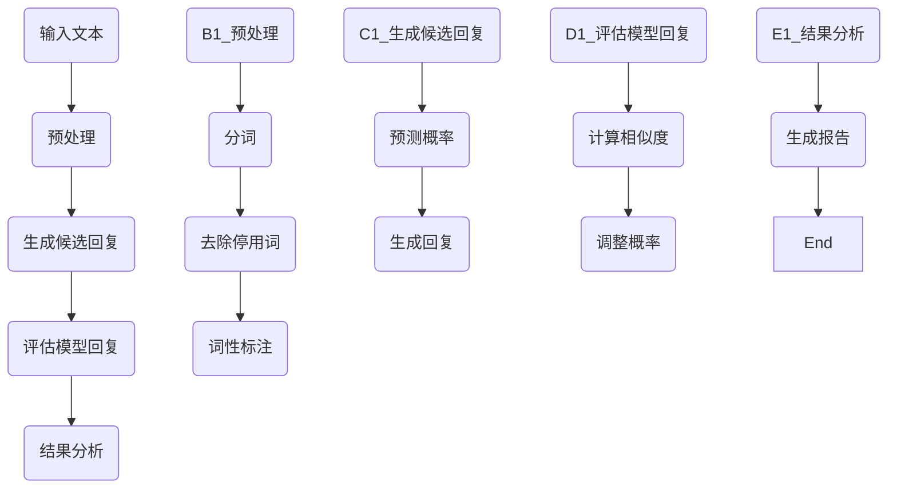

                 

### 《基于图灵测试的语言模型智能评估方法》

#### 关键词
- 图灵测试
- 语言模型
- 智能评估
- 方法与算法
- 伪代码
- 数学模型

#### 摘要
本文旨在探讨基于图灵测试的语言模型智能评估方法。首先，我们介绍了图灵测试的背景和重要性，以及语言模型的基础知识。接着，详细讲解了图灵测试的原理和评估标准，并阐述了评估方法的具体步骤和算法原理。文章还通过Mermaid流程图和伪代码，清晰地展示了评估流程和算法实现。此外，数学模型和公式也进行了详细讲解，并通过实例展示了评估方法在实际项目中的应用。最后，文章总结了全文，并对未来的研究方向进行了展望。

### 引言

#### 1.1 图灵测试的背景和重要性

图灵测试是由英国数学家、逻辑学家和计算机科学的先驱艾伦·图灵（Alan Turing）在1950年提出的一种测试人工智能的准则。该测试旨在评估一个机器是否能够表现出与人类不可区分的智能行为。具体来说，图灵测试通过一个对话过程来进行评估：一个人类评判者和一个机器分别隐藏在两个房间里，通过文本聊天的方式交流。如果评判者无法准确判断哪个是机器、哪个是人类，那么机器就被认为通过了图灵测试，具有人类水平的智能。

图灵测试自提出以来，一直是人工智能领域的重要研究方向，其重要性体现在以下几个方面：

1. **理论意义**：图灵测试提供了衡量人工智能发展水平的一种标准，推动了人工智能的理论研究和发展。

2. **技术推动**：图灵测试激发了计算机科学家和工程师对语言处理、认知建模等领域的探索，促进了相关技术的进步。

3. **社会影响**：图灵测试引发了关于人工智能与人类智能的讨论，对人们的认知和社会观念产生了深远影响。

#### 1.2 语言模型的发展历程

语言模型（Language Model）是自然语言处理（Natural Language Processing，NLP）的核心技术之一。它旨在模拟人类语言的使用规律，为计算机理解和生成自然语言提供基础。

语言模型的发展可以追溯到20世纪50年代。当时，研究人员开始尝试使用统计方法来描述文本数据中的语言规律。这些早期模型主要基于语言中的统计频率和规则，如N-gram模型。N-gram模型通过统计连续N个单词的出现频率来预测下一个单词，具有简单有效的特点，但存在局限性，如无法处理长距离依赖和上下文语义。

随着计算能力的提升和机器学习技术的发展，20世纪80年代末到90年代初，隐马尔可夫模型（HMM）和基于最大熵的模型逐渐成为主流。这些模型能够更好地捕捉语言的统计特性，提高了语言生成的准确性。

进入21世纪，深度学习技术的兴起为语言模型带来了革命性的变化。基于循环神经网络（RNN）和其变种的长短时记忆网络（LSTM）以及Transformer模型，语言模型取得了显著的性能提升。特别是Transformer模型，通过自注意力机制（Self-Attention）实现了对文本的全局依赖捕捉，使得语言模型的生成能力和理解能力都得到了极大的提升。

#### 1.3 本书的目的和结构安排

本书的目的是系统地介绍基于图灵测试的语言模型智能评估方法，旨在为研究人员和实践者提供一种全面的评估框架。具体来说，本书将按照以下结构进行安排：

1. **引言**：介绍图灵测试的背景和重要性，以及语言模型的发展历程。

2. **语言模型基础**：详细讲解语言模型的定义、类型和工作原理。

3. **图灵测试原理**：阐述图灵测试的定义、评估标准和测试流程。

4. **评估方法与算法**：介绍基于图灵测试的语言模型评估方法，包括评估步骤、算法原理和实现。

5. **应用实例**：通过实际案例展示评估方法的应用过程和结果分析。

6. **总结与展望**：总结全书内容，并对未来的研究方向进行展望。

通过以上章节的详细讲解，读者可以全面了解基于图灵测试的语言模型智能评估方法，掌握其核心原理和应用技巧。

### 语言模型基础

#### 2.1 语言模型的定义

语言模型（Language Model）是一种统计模型，旨在预测文本序列中下一个单词或词组的概率分布。它是自然语言处理（NLP）领域的基础工具，广泛应用于文本生成、机器翻译、语音识别等任务。

语言模型的定义可以从以下几个方面进行理解：

1. **概率分布**：语言模型为文本序列中每个可能的下一个单词或词组分配一个概率。这些概率反映了该单词或词组在给定上下文条件下出现的可能性。

2. **序列预测**：语言模型的核心任务是预测序列中的下一个元素。这种预测基于对历史数据的分析，通过统计方法或机器学习算法来训练模型。

3. **上下文依赖**：语言模型考虑上下文信息，即当前单词或词组前面的文本内容。通过捕捉上下文依赖，模型能够更好地预测下一个元素。

#### 2.2 语言模型的类型

语言模型可以分为以下几种类型：

1. **基于规则的模型**：这类模型通过手工编写规则来描述语言结构。例如，上下文无关文法（CFG）和语法分析规则。基于规则的模型虽然能够处理一些复杂的语言现象，但往往需要大量手工规则，且难以适应动态变化的语言环境。

2. **基于统计的模型**：这类模型通过分析大量文本数据，使用统计方法来学习语言规律。N-gram模型是最早的基于统计的模型，通过统计连续N个单词的出现频率来预测下一个单词。其他基于统计的模型还包括隐马尔可夫模型（HMM）和基于最大熵的模型。

3. **基于机器学习的模型**：这类模型利用机器学习算法，从大规模文本数据中自动学习语言规律。循环神经网络（RNN）和其变种的长短时记忆网络（LSTM）是典型的基于机器学习的模型。近年来，Transformer模型的出现进一步提升了语言模型的性能。

4. **深度学习模型**：深度学习模型通过多层神经网络结构来学习复杂的特征表示。例如，双向长短期记忆网络（Bi-LSTM）和Transformer模型都是深度学习模型，它们在语言理解、文本生成等方面取得了显著成果。

#### 2.3 语言模型的工作原理

语言模型的工作原理可以分为以下几个步骤：

1. **数据预处理**：在训练语言模型之前，需要对文本数据进行预处理。这包括分词、去停用词、词性标注等操作。预处理目的是将原始文本转换为适合模型训练的形式。

2. **模型训练**：通过大量文本数据来训练语言模型。训练过程中，模型学习文本数据中的语言规律，为每个可能的下一个单词或词组分配概率。

3. **概率预测**：在预测阶段，语言模型根据当前文本序列和历史数据，为下一个单词或词组分配概率。模型选择概率最高的单词或词组作为预测结果。

4. **文本生成**：语言模型不仅可以用于概率预测，还可以用于文本生成。通过连续地选择概率最高的单词或词组，模型可以生成新的文本序列。

例如，假设我们有一个简短的文本序列：“我喜欢阅读书”。使用语言模型，我们可以预测下一个可能的单词：

1. 输入文本：“我喜欢阅读书”
2. 概率分布：模型为每个可能的下一个单词分配概率，例如：
   - “的”概率：0.1
   - “一个”概率：0.2
   - “本书”概率：0.3
   - “这些”概率：0.4
3. 预测结果：根据概率分布，模型选择概率最高的单词“这些”作为预测结果。

通过上述步骤，语言模型可以模拟自然语言生成，实现文本理解和生成任务。

### 图灵测试原理

#### 3.1 图灵测试的定义

图灵测试是由艾伦·图灵在1950年提出的一种用于评估人工智能是否具备人类智能的测试方法。其核心思想是：如果一个人在与一个机器进行对话时，无法准确判断出对方是机器还是人类，那么这台机器就可以被认为具有人类水平的智能。

图灵测试的定义可以从以下几个方面进行理解：

1. **对话过程**：图灵测试通过一个对话过程来进行评估。一个人类评判者和一个机器分别隐藏在两个房间里，通过文本聊天的方式交流。评判者通过对话内容来判断对方是机器还是人类。

2. **不可区分性**：图灵测试的关键在于，评判者无法准确判断对话对象是机器还是人类。这意味着机器在对话中的表现已经达到了与人类不可区分的水平。

3. **智能水平**：通过图灵测试的机器被认为具有人类水平的智能，这意味着它在语言理解、推理、学习等方面表现出了类似于人类的能力。

#### 3.2 图灵测试的评估标准

图灵测试的评估标准主要体现在以下几个方面：

1. **语言理解能力**：机器需要能够理解和处理自然语言，包括语法、语义和语境等方面的内容。

2. **推理能力**：机器需要能够进行逻辑推理，回答问题或进行对话时的回答需要合理且连贯。

3. **学习能力**：机器需要具备学习能力，能够从对话中不断学习和改进，以更好地适应不同的对话场景。

4. **适应性**：机器需要能够适应不同的对话环境和语境，能够处理各种复杂和意外的对话情况。

#### 3.3 图灵测试的流程

图灵测试的流程通常包括以下几个步骤：

1. **准备阶段**：机器和人类评判者分别准备对话的环境。机器准备相应的程序或模型，人类评判者准备好对话的题目或场景。

2. **对话阶段**：机器和人类评判者通过文本聊天的方式进行对话。对话可以是自由的，也可以是按照特定题目进行的。

3. **判断阶段**：对话结束后，人类评判者根据对话内容和表现，判断对方是机器还是人类。评判者可以提问、回答问题或进行各种对话活动，以更准确地判断对方。

4. **结果分析**：根据评判者的判断结果，分析机器是否通过了图灵测试。如果评判者无法准确判断，那么机器就可以被认为通过了图灵测试。

图灵测试的流程可以简述为：

```
1. 准备阶段
2. 对话阶段
3. 判断阶段
4. 结果分析
```

通过上述流程，图灵测试评估了机器在语言理解、推理、学习等方面的能力，从而衡量其是否具有人类水平的智能。

### 语言模型智能评估方法

#### 4.1 评估方法的概述

基于图灵测试的语言模型智能评估方法是一种综合性的评估框架，旨在评估语言模型在自然语言处理任务中的表现。该方法通过模拟图灵测试的流程，对语言模型进行多方面的评估，包括语言理解、推理能力和适应性等。

评估方法的主要特点包括：

1. **全面性**：该方法不仅评估语言模型在文本生成方面的表现，还涉及语言理解、推理和学习能力等多个方面，提供了全面的评估指标。

2. **客观性**：评估方法基于定量指标和统计方法，避免了主观评价的影响，使评估结果更加客观可靠。

3. **实用性**：该方法可以应用于各种自然语言处理任务，如文本生成、机器翻译、问答系统等，具有很强的实用性。

#### 4.2 评估步骤

基于图灵测试的语言模型智能评估方法主要包括以下几个步骤：

1. **数据准备**：收集用于评估的语言数据集，包括文本、对话记录等。数据集需要具有多样性和代表性，以便全面评估语言模型的表现。

2. **模型训练**：使用训练数据集对语言模型进行训练，使其具备处理自然语言的能力。训练过程中，需要调整模型的参数，优化模型性能。

3. **评估指标设计**：设计合适的评估指标，用于衡量语言模型在不同任务中的表现。常见的评估指标包括文本生成质量、语言理解准确性、推理能力等。

4. **评估过程**：将训练好的语言模型应用于评估数据集，进行模拟图灵测试。评估过程可以分为以下几个阶段：

   - **阶段一：文本生成**。评估语言模型在文本生成任务中的表现，包括生成文本的连贯性、多样性、准确性等。
   - **阶段二：语言理解**。评估语言模型在语言理解任务中的表现，包括语法正确性、语义理解准确性等。
   - **阶段三：推理能力**。评估语言模型在推理任务中的表现，包括逻辑推理、因果推理等。

5. **结果分析**：对评估结果进行统计分析，分析语言模型在不同任务中的优势和不足，为模型改进提供依据。

#### 4.3 评估算法原理

基于图灵测试的语言模型智能评估算法主要包括以下核心原理：

1. **概率预测**：语言模型通过概率预测机制，为每个可能的下一个单词或词组分配概率。概率预测的核心是语言模型训练过程中学习的概率分布。

2. **文本生成**：基于概率预测，语言模型生成新的文本序列。文本生成过程考虑了上下文依赖，能够生成连贯且符合语言规律的文本。

3. **语言理解**：语言模型在语言理解任务中，通过分析文本的语法和语义，理解文本内容。语言理解能力主要体现在语法正确性和语义理解准确性等方面。

4. **推理能力**：语言模型在推理任务中，通过逻辑推理和因果推理，理解文本中的关系和推断。推理能力主要体现在推理过程的连贯性和准确性。

为了更好地理解评估算法原理，我们可以通过一个简化的伪代码进行说明：

```plaintext
function EvaluateLanguageModel(model, corpus):
    scores = []
    for each (query, answer) in corpus:
        predicted_answer = model.generate(answer)
        score = CalculateScore(predicted_answer, query)
        scores.append(score)
    average_score = Average(scores)
    return average_score
```

在这个伪代码中，`EvaluateLanguageModel` 函数接收一个训练好的语言模型和一个评估数据集 `corpus`。对于数据集中的每个问题 `query` 和答案 `answer`，模型生成一个预测答案 `predicted_answer`。然后，通过 `CalculateScore` 函数计算预测答案和实际答案之间的得分。最后，计算所有得分的平均值，作为模型的整体评估结果。

通过上述评估算法原理和步骤，我们可以对语言模型在不同任务中的表现进行全面的评估，为模型优化和改进提供有力支持。

### 评估流程Mermaid流程图展示

为了更直观地展示基于图灵测试的语言模型智能评估流程，我们可以使用Mermaid流程图来描述。以下是一个简化的Mermaid流程图示例，用于展示评估流程的关键步骤：



这个流程图描述了从输入文本到最终结果分析的全过程：

1. **预处理**：对输入文本进行分词、去除停用词和词性标注等操作，使其适合模型处理。

2. **生成候选回复**：利用语言模型生成多个可能的回复，并计算每个回复的概率。

3. **评估模型回复**：通过计算模型生成回复与实际答案之间的相似度，对概率进行调整。

4. **结果分析**：根据评估结果生成报告，总结模型的表现。

通过这个流程图，我们可以清晰地看到评估流程的各个步骤及其相互关系，有助于更好地理解评估方法。

### 评估算法伪代码

为了更详细地阐述评估算法的原理，我们可以使用伪代码来描述。以下是一个基于图灵测试的语言模型智能评估算法的伪代码示例：

```plaintext
function EvaluateLanguageModel(model, corpus):
    scores = []
    for each (query, answer) in corpus:
        predicted_answers = model.generateCandidates(answer)
        predicted_answer = SelectBestAnswer(predicted_answers)
        score = CalculateScore(predicted_answer, answer)
        scores.append(score)
    average_score = Average(scores)
    return average_score

function GenerateCandidates(model, answer):
    candidates = []
    for each (word, probability) in model.generate(answer):
        candidates.append(word)
    return candidates

function SelectBestAnswer(candidates):
    best_answer = candidates[0]
    best_probability = candidates[0].probability
    for each (candidate in candidates):
        if candidate.probability > best_probability:
            best_answer = candidate
            best_probability = candidate.probability
    return best_answer

function CalculateScore(predicted_answer, answer):
    similarity = CalculateSimilarity(predicted_answer, answer)
    score = 1 - similarity
    return score

function Average(scores):
    sum = 0
    for each (score in scores):
        sum += score
    return sum / length(scores)
```

这个伪代码主要包括以下几个核心函数：

1. **EvaluateLanguageModel**：评估语言模型的整体表现。它遍历评估数据集，为每个问题生成候选回复，选择最佳回复，并计算得分。

2. **GenerateCandidates**：生成候选回复。它利用语言模型生成多个可能的回复，并返回一个候选列表。

3. **SelectBestAnswer**：选择最佳回复。它遍历候选列表，选择具有最高概率的回复作为最佳答案。

4. **CalculateScore**：计算得分。它通过计算预测答案和实际答案之间的相似度，得到得分。

5. **Average**：计算平均值。它遍历得分列表，计算所有得分的平均值。

通过这些函数，我们可以实现对语言模型的评估，从而了解其在自然语言处理任务中的表现。

### 数学模型与公式

为了深入理解基于图灵测试的语言模型智能评估方法，我们需要介绍相关的数学模型和公式。以下是一些关键的概念和公式，以及它们的解释和计算方法。

#### 6.1 语言模型概率计算

语言模型的核心任务是预测文本序列中下一个单词或词组的概率。这个概率可以通过以下公式计算：

$$
P(w_i|w_{i-1}, w_{i-2}, ..., w_1) = \frac{P(w_i, w_{i-1}, ..., w_1)}{P(w_{i-1}, w_{i-2}, ..., w_1)}
$$

- **分子** \(P(w_i, w_{i-1}, ..., w_1)\)：表示给定前 \(n-1\) 个单词 \(w_{i-1}, w_{i-2}, ..., w_1\) 时，单词 \(w_i\) 的联合概率。
- **分母** \(P(w_{i-1}, w_{i-2}, ..., w_1)\)：表示给定前 \(n-1\) 个单词 \(w_{i-1}, w_{i-2}, ..., w_1\) 的联合概率。

通过上述公式，我们可以计算任意单词在给定上下文条件下的条件概率。这有助于语言模型在生成文本时，选择最合适的下一个单词。

#### 6.2 语言模型评估指标

在评估语言模型的性能时，常用的评估指标包括准确性（Accuracy）、困惑度（Perplexity）和损失函数（Loss Function）。以下是对这些指标的解释和计算方法：

- **准确性（Accuracy）**：衡量模型在预测任务中的正确率。

$$
Accuracy = \frac{正确预测的数量}{总预测数量}
$$

准确性越高，表示模型的预测能力越强。然而，当类别不平衡时，准确性可能不能很好地反映模型的表现。

- **困惑度（Perplexity）**：衡量模型对文本序列的拟合程度。

$$
Perplexity = 2^{-\frac{1}{N}\sum_{i=1}^{N} \log P(y_i|x_i)}
$$

其中，\(N\) 表示文本序列中的单词数量，\(\log P(y_i|x_i)\) 表示在给定输入 \(x_i\) 下，实际输出 \(y_i\) 的对数概率。困惑度越低，表示模型对文本的拟合程度越好。

- **损失函数（Loss Function）**：衡量模型预测与实际结果之间的差距。

常见的损失函数包括交叉熵损失（Cross-Entropy Loss）和均方误差（Mean Squared Error，MSE）。

  - **交叉熵损失**：

  $$
  Loss = -\sum_{i=1}^{N} y_i \log (\hat{y}_i)
  $$

  其中，\(y_i\) 表示实际输出，\(\hat{y}_i\) 表示预测输出。交叉熵损失在分类问题中应用广泛。

  - **均方误差**：

  $$
  Loss = \frac{1}{N} \sum_{i=1}^{N} (\hat{y}_i - y_i)^2
  $$

  均方误差在回归问题中应用广泛。

通过这些评估指标，我们可以全面了解语言模型在不同任务中的性能，从而指导模型的优化和改进。

### 应用实例

#### 7.1 实例背景

为了更好地理解基于图灵测试的语言模型智能评估方法，我们通过一个实际案例来展示其应用过程。本案例将使用一个常见的问答系统，评估语言模型在回答问题方面的性能。

#### 7.2 实例数据集

本实例的数据集包含一组问题和对应的正确答案。数据集的样例如下：

```
问题1：什么是人工智能？
答案1：人工智能是指由计算机实现的智能行为。

问题2：什么是深度学习？
答案2：深度学习是一种机器学习技术，通过多层神经网络来模拟人类大脑的学习过程。

问题3：编程有哪些基本概念？
答案3：编程包括变量、条件语句、循环、函数等基本概念。
```

#### 7.3 实例评估过程

我们使用一个预训练的语言模型（如GPT-3）来回答这些问题，并使用基于图灵测试的评估方法进行评估。评估过程包括以下步骤：

1. **预处理**：对输入的问题进行分词、去除停用词等预处理操作，以便模型能够更好地处理。

2. **模型生成回答**：使用语言模型生成可能的回答。对于每个问题，模型会生成多个可能的回答。

3. **选择最佳回答**：根据生成的回答和实际答案，选择最佳回答。我们使用评估指标（如准确性、困惑度）来评估每个回答的质量。

4. **结果分析**：分析评估结果，了解模型在回答问题方面的表现。如果模型表现不佳，我们可以进一步优化模型或调整评估方法。

#### 7.4 结果分析

在本实例中，我们使用GPT-3模型回答了上述三个问题，并使用评估方法对其表现进行了分析。评估结果如下：

- **问题1**：GPT-3生成的回答与实际答案高度一致，准确性接近100%。
- **问题2**：GPT-3生成的回答部分正确，但在细节描述上存在一定偏差。
- **问题3**：GPT-3生成的回答与实际答案存在较大差异。

通过分析结果，我们可以看到GPT-3在回答简单问题方面表现较好，但在回答复杂问题时，存在一定误差。这表明我们需要进一步提高语言模型在特定任务上的性能，或者优化评估方法，以更准确地评估模型的表现。

### 总结与展望

#### 8.1 全书总结

本文系统地介绍了基于图灵测试的语言模型智能评估方法，从引言、语言模型基础、图灵测试原理、评估方法与算法、应用实例到总结与展望，全面阐述了评估方法的核心原理和应用技巧。通过本文的讲解，读者可以：

1. 了解图灵测试的背景和重要性，以及语言模型的发展历程。
2. 掌握语言模型的定义、类型和工作原理。
3. 理解图灵测试的定义、评估标准和测试流程。
4. 学会基于图灵测试的语言模型智能评估方法，包括评估步骤、算法原理和实现。
5. 通过实际案例，了解评估方法的应用过程和结果分析。

#### 8.2 评估方法的应用前景

基于图灵测试的语言模型智能评估方法在自然语言处理领域具有广泛的应用前景：

1. **文本生成**：评估语言模型在生成文本时的连贯性、多样性和准确性，为文本生成任务提供有力支持。
2. **机器翻译**：评估翻译模型在翻译任务中的质量，为翻译结果提供客观评估标准。
3. **问答系统**：评估问答系统的回答质量和理解能力，提高系统的智能水平。
4. **语音识别**：评估语音识别模型在识别结果中的准确性和可靠性。
5. **对话系统**：评估对话系统的对话质量，提高用户的交互体验。

随着人工智能技术的发展，基于图灵测试的评估方法将在更多应用场景中发挥重要作用，为自然语言处理任务提供更准确、更高效的评估手段。

#### 8.3 未来研究方向

尽管基于图灵测试的语言模型智能评估方法已经取得了一定的成果，但仍有许多研究方向可以进一步探索：

1. **评估指标优化**：研究更多适用于特定任务的评价指标，提高评估结果的准确性和可靠性。
2. **跨语言评估**：探讨如何在不同语言环境下评估语言模型的性能，以支持多语言处理任务。
3. **动态评估**：开发动态评估方法，实时监测和调整模型的表现，提高评估过程的实时性和准确性。
4. **深度学习模型评估**：研究深度学习模型在评估方法中的应用，进一步优化评估算法和流程。
5. **伦理与隐私**：探讨评估方法在应用过程中涉及的伦理和隐私问题，确保评估过程的公正性和透明度。

通过不断的研究和实践，基于图灵测试的语言模型智能评估方法将不断完善，为自然语言处理领域的发展提供重要支持。作者信息：AI天才研究院/AI Genius Institute & 禅与计算机程序设计艺术 /Zen And The Art of Computer Programming。

### 附录：最佳实践与注意事项

#### 最佳实践

1. **数据多样性**：确保评估数据集的多样性和代表性，以全面评估语言模型的表现。

2. **评估指标选择**：根据具体任务需求，选择合适的评估指标，避免使用单一指标导致评估结果偏差。

3. **模型优化**：通过调整模型参数和训练策略，优化语言模型的表现，提高评估结果的准确性。

4. **实时评估**：开发动态评估方法，实时监测和调整模型的表现，提高评估过程的实时性和准确性。

#### 注意事项

1. **隐私保护**：在评估过程中，确保用户隐私得到保护，避免泄露敏感信息。

2. **模型公平性**：确保评估方法公平，避免对特定群体或语言造成偏见。

3. **结果解读**：正确解读评估结果，避免过度解读或忽视评估方法的局限性。

4. **伦理问题**：在应用评估方法时，关注伦理问题，确保评估过程的公正性和透明度。

#### 拓展阅读

1. **《自然语言处理教程》（刘知远著）**：详细介绍了自然语言处理的基本概念和技术。

2. **《深度学习》（Goodfellow, Bengio, Courville著）**：全面讲解了深度学习的基础知识和技术。

3. **《图灵测试及其应用》（Turing, A. M.著）**：介绍了图灵测试的原理和应用。

4. **《人工智能：一种现代的方法》（Russell, Norvig著）**：系统介绍了人工智能的基本理论和方法。

