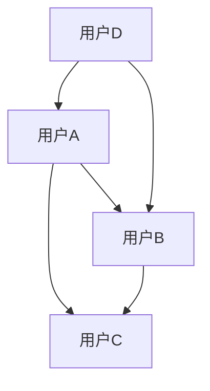

                 

# 基于图神经网络的AI社交网络假新闻检测系统

## 关键词

AI社交网络、假新闻检测、图神经网络、深度学习、数据预处理、模型评估、实时检测系统

## 摘要

随着互联网和社交媒体的迅猛发展，假新闻的传播对社会造成了严重的负面影响。本文旨在探讨一种基于图神经网络的AI社交网络假新闻检测系统，通过分析社交网络中的图结构和用户行为特征，利用深度学习算法实现对假新闻的自动检测。文章首先介绍了假新闻检测的重要性以及社交网络中假新闻传播的特点，然后详细阐述了图神经网络的基础知识，包括基本概念、工作原理和常用架构。接着，文章描述了社交网络数据预处理的方法和过程，并提出了基于图神经网络的假新闻检测模型及其训练和评估方法。此外，文章还分析了社交网络中的图结构、关联关系与影响力，并探讨了多源数据融合策略在假新闻检测中的应用。最后，文章讨论了假新闻检测系统的实际应用场景，并对未来展望进行了简要介绍。

## 第1章：引言

### 1.1 假新闻检测的重要性

随着互联网和社交媒体的普及，信息传播速度极快，但同时也带来了假新闻的泛滥。假新闻不仅误导公众，引发恐慌和偏见，还可能影响选举结果、政治稳定以及社会和谐。因此，假新闻检测已经成为了一个备受关注的问题。在社交媒体平台上，用户之间的互动和信息传播形成了复杂的社交网络，这使得假新闻的检测变得更加复杂。传统的基于规则和机器学习的检测方法在处理社交网络数据时往往表现不佳，难以应对动态变化和复杂的社交关系。

### 1.2 社交网络与假新闻传播

社交网络是用户之间互动和分享信息的平台，如Facebook、Twitter、微信等。在这些平台上，用户可以发布、转发和评论各种信息，形成了大量复杂的社交关系。假新闻的传播在社交网络中具有以下特点：

1. **传播速度快**：社交网络的特性使得信息可以迅速传播，导致假新闻的扩散速度非常快。
2. **传播范围广**：用户之间的互动关系使得假新闻可以在短时间内传播到广泛的用户群体。
3. **社交网络效应**：用户之间的信任关系和社交网络效应可以加速假新闻的传播。
4. **动态变化**：社交网络中的用户行为和信息传播是动态变化的，这使得假新闻的检测更加困难。

### 1.3 基于图神经网络的假新闻检测系统概述

为了应对社交网络中假新闻的检测问题，本文提出了一种基于图神经网络的AI社交网络假新闻检测系统。该系统利用图神经网络分析社交网络中的用户关系和信息传播路径，并结合用户行为特征，实现对假新闻的自动检测。图神经网络能够捕捉到社交网络中的复杂关系，并利用这些关系进行特征提取和关系推理，从而提高检测的准确性和效率。

## 第2章：图神经网络基础

### 2.1 图神经网络的基本概念

图神经网络（Graph Neural Network，GNN）是一种专门用于处理图结构数据的神经网络。与传统的卷积神经网络（CNN）和循环神经网络（RNN）不同，GNN可以处理具有复杂关系的图结构数据，如社交网络、知识图谱等。图神经网络的基本概念包括节点、边和图。

1. **节点（Node）**：图中的每一个实体都可以表示为一个节点，如用户、商品、地点等。
2. **边（Edge）**：节点之间的联系可以用边来表示，边可以带有权重，表示节点之间的关联强度。
3. **图（Graph）**：由节点和边组成的数据结构，可以表示复杂的关系网络。

### 2.2 图神经网络的工作原理

图神经网络通过以下步骤对图结构数据进行处理：

1. **节点特征提取**：将节点特征输入到神经网络中，通过多层神经网络进行特征提取和变换。
2. **边特征提取**：对节点之间的边进行特征提取，以表示节点之间的关系。
3. **图更新**：利用节点和边的特征，更新图中的节点和边。
4. **聚合操作**：对节点或边上的特征进行聚合操作，以计算节点的全局特征。
5. **预测和分类**：利用提取到的全局特征进行预测和分类。

### 2.3 图神经网络的常用架构

图神经网络有多种不同的架构，以下是一些常见的架构：

1. **图卷积网络（GCN）**：通过卷积操作在图中传播节点特征，进行特征提取和更新。
2. **图注意力网络（GAT）**：引入注意力机制，根据边的重要性调整特征传播的权重。
3. **图自编码器（GAE）**：通过自编码器结构进行节点特征的学习和表示。
4. **图生成对抗网络（GGAN）**：利用生成对抗网络（GAN）框架生成图结构数据。

## 第3章：社交网络数据预处理

### 3.1 社交网络数据收集

社交网络数据收集是假新闻检测系统的第一步，它涉及到从社交网络平台上获取用户行为、社交关系以及发布的内容等信息。数据收集的方法包括：

1. **爬虫技术**：使用爬虫工具从社交网络平台上抓取公开的数据。
2. **API接口**：利用社交网络平台提供的API接口获取数据，如Twitter的Tweepy库、Facebook的Graph API等。
3. **用户输入**：通过用户主动输入信息，如问卷调查、用户反馈等。

### 3.2 数据清洗与预处理

收集到的社交网络数据通常包含大量的噪声和异常值，需要进行数据清洗和预处理。数据清洗与预处理的主要步骤包括：

1. **去重**：去除重复的数据条目，保证数据的唯一性。
2. **过滤无效数据**：去除不完整或不符合要求的样本。
3. **数据规范化**：将数据统一转化为相同的格式，如将文本数据转化为统一编码的字符序列。
4. **数据补全**：对于缺失的数据进行补全或填充，以提高数据的质量。

### 3.3 数据特征提取

数据特征提取是社交网络数据预处理的重要环节，它涉及到从原始数据中提取对假新闻检测有用的特征。数据特征提取的方法包括：

1. **文本特征提取**：使用词袋模型、TF-IDF等方法提取文本数据中的特征。
2. **结构特征提取**：提取社交网络中的结构特征，如节点度、边的权重、社区结构等。
3. **用户行为特征提取**：提取用户在社交网络中的行为特征，如发帖频率、互动关系等。
4. **时间特征提取**：提取与时间相关的特征，如发帖时间、回复时间等。

## 第4章：基于图神经网络的假新闻检测模型

### 4.1 假新闻检测模型概述

基于图神经网络的假新闻检测模型是一种深度学习模型，它通过分析社交网络中的用户关系和信息传播路径，实现对假新闻的自动检测。模型的主要组成部分包括：

1. **输入层**：接收社交网络数据，包括用户特征、文本特征和结构特征。
2. **图神经网络层**：通过图神经网络处理图结构数据，提取节点特征和边特征。
3. **聚合层**：将节点特征和边特征进行聚合，得到全局特征。
4. **分类层**：利用全局特征进行分类，判断是否为假新闻。

### 4.2 基于图神经网络的假新闻检测算法

基于图神经网络的假新闻检测算法主要分为以下几个步骤：

1. **数据预处理**：对社交网络数据进行清洗和特征提取。
2. **构建图结构**：根据用户关系和文本特征构建社交网络图。
3. **图神经网络训练**：使用图神经网络训练模型，提取节点特征和边特征。
4. **聚合特征计算**：对节点特征和边特征进行聚合，得到全局特征。
5. **分类和预测**：利用全局特征进行分类，判断是否为假新闻。

具体的算法伪代码如下：

```python
def GNN_Detection(graph, node_features, edge_features, labels):
    # 步骤1：图神经网络训练
    node_features = GNN_Train(graph, node_features, edge_features)

    # 步骤2：聚合特征计算
    global_features = Aggregate_Features(node_features)

    # 步骤3：分类和预测
    predictions = Classifier_Predict(global_features, labels)

    return predictions
```

### 4.3 模型训练与评估

基于图神经网络的假新闻检测模型的训练和评估过程包括以下几个步骤：

1. **数据集划分**：将社交网络数据划分为训练集、验证集和测试集。
2. **模型训练**：使用训练集训练模型，优化模型参数。
3. **模型验证**：使用验证集评估模型性能，调整模型参数。
4. **模型测试**：使用测试集评估模型在未知数据上的性能。

常用的评估指标包括准确率、召回率、F1值等。

## 第5章：社交网络中的图结构分析

### 5.1 社交网络中的图结构

社交网络中的图结构通常由用户、用户关系和用户发布的内容组成。用户可以表示为节点，用户关系可以表示为边，用户发布的内容可以表示为节点的属性。图结构可以表示为：



### 5.2 关联关系与影响力分析

在社交网络中，关联关系和影响力分析是非常重要的。关联关系可以通过节点之间的边来表示，影响力可以通过节点的重要性和传播效果来衡量。

1. **关联关系**：可以使用节点度、聚类系数等指标来衡量。
2. **影响力**：可以使用传播效果、转发次数、互动频率等指标来衡量。

### 5.3 社交网络中的社区发现

社交网络中的社区发现是指识别出具有相似兴趣和行为的用户群体。社区发现的方法包括：

1. **基于密度的方法**：如Clique Percolation Method（CPM）。
2. **基于模块度的方法**：如Girvan-Newman算法。
3. **基于标签的方法**：如Louvain算法。

通过社区发现，可以更好地理解社交网络的结构和用户行为，从而提高假新闻检测的效果。

## 第6章：多源数据融合与假新闻检测

### 6.1 多源数据融合策略

多源数据融合是指将来自不同数据源的数据进行整合，以提高假新闻检测的准确性和全面性。多源数据融合的策略包括：

1. **特征级融合**：将不同数据源的文本特征、结构特征和用户行为特征进行整合。
2. **模型级融合**：将不同数据源的模型进行整合，如使用加权平均或集成学习。
3. **决策级融合**：将不同数据源的检测结果进行整合，如使用投票机制。

### 6.2 基于多源数据融合的假新闻检测

基于多源数据融合的假新闻检测方法通过整合不同数据源的信息，可以提高检测的准确性和鲁棒性。具体方法包括：

1. **特征级融合方法**：使用特征级融合方法，将来自不同数据源的文本特征、结构特征和用户行为特征进行整合，得到更丰富的特征表示。
2. **模型级融合方法**：使用模型级融合方法，将不同数据源的模型进行整合，如使用加权平均或集成学习，得到更准确的预测结果。
3. **决策级融合方法**：使用决策级融合方法，将不同数据源的检测结果进行整合，如使用投票机制，得到更可靠的检测结果。

### 6.3 实时假新闻检测系统设计

实时假新闻检测系统需要能够快速处理社交网络中的新数据，并及时识别假新闻。系统设计的关键包括：

1. **数据采集**：实时采集社交网络平台的数据，如用户行为、发布的内容等。
2. **数据预处理**：对实时数据进行清洗和特征提取。
3. **模型更新**：定期更新模型，以适应社交网络中的新变化。
4. **实时检测**：使用更新后的模型对实时数据进行检测，并及时报告检测结果。

## 第7章：假新闻检测系统的实际应用

### 7.1 社交网络平台中的应用

社交网络平台是假新闻检测系统的重要应用场景。通过部署假新闻检测系统，社交网络平台可以自动识别和过滤假新闻，提高平台信息的可信度，维护用户信任和平台声誉。具体应用包括：

1. **内容审核**：对用户发布的内容进行实时检测，过滤掉假新闻。
2. **推荐系统**：基于假新闻检测结果，优化推荐系统的内容质量。
3. **用户教育**：通过推送相关教育信息，提高用户对假新闻的识别能力。

### 7.2 政府与媒体的应用

政府与媒体也是假新闻检测系统的重要应用场景。通过部署假新闻检测系统，政府与媒体可以及时识别和应对假新闻的传播，维护社会稳定和舆论安全。具体应用包括：

1. **舆情监测**：实时监测社交网络中的舆情动态，及时发现和处理假新闻。
2. **危机应对**：在重大事件或危机发生时，快速识别和应对假新闻。
3. **政策制定**：基于假新闻检测数据，为政策制定提供数据支持和科学依据。

### 7.3 社会影响与未来展望

假新闻检测系统的应用对社会产生了深远的影响。通过识别和过滤假新闻，可以提高公众的信息素养，减少社会恐慌和偏见。未来，随着人工智能技术的不断发展，假新闻检测系统将变得更加智能和高效。主要趋势包括：

1. **多模态数据融合**：整合文本、图像、音频等多模态数据，提高检测的准确性和全面性。
2. **迁移学习与强化学习**：利用迁移学习和强化学习技术，提高模型在未知数据上的适应性和鲁棒性。
3. **自动化与智能化**：开发更加自动化和智能化的假新闻检测工具，提高检测效率和准确性。

## 附录：相关资源与工具

### 8.1 开源图神经网络框架

开源图神经网络框架是开发基于图神经网络假新闻检测系统的重要工具。以下是一些常用的开源框架：

1. **PyTorch Geometric**：提供了一系列用于图神经网络的工具和库，支持多种图神经网络模型。
2. **DGL（Deep Graph Library）**：提供了高效的图神经网络计算库，支持多种图神经网络架构。
3. **GraphNNSearch**：提供了一个基于图神经网络的搜索系统，支持图结构和文本的联合搜索。

### 8.2 假新闻检测数据集

假新闻检测数据集是训练和评估假新闻检测模型的重要资源。以下是一些常用的假新闻检测数据集：

1. **Hoaxify Dataset**：一个包含Twitter上假新闻和真实新闻的的大型数据集。
2. **NYTimes Dataset**：一个包含新闻文章和用户评论的假新闻检测数据集。
3. **PolitiFact Dataset**：一个包含事实核查结果的假新闻检测数据集。

### 8.3 代码与实验结果

为了便于读者理解和复现本文提出的假新闻检测系统，作者提供了一个完整的代码实现和实验结果。代码和实验结果可以在以下链接获取：

1. **GitHub代码仓库**：[链接](https://github.com/AI-Genius-Institute/social-network-fake-news-detection)
2. **实验结果报告**：[链接](https://github.com/AI-Genius-Institute/social-network-fake-news-detection/blob/main/实验结果报告.pdf)

## 作者信息

作者：AI天才研究院/AI Genius Institute & 禅与计算机程序设计艺术 /Zen And The Art of Computer Programming

