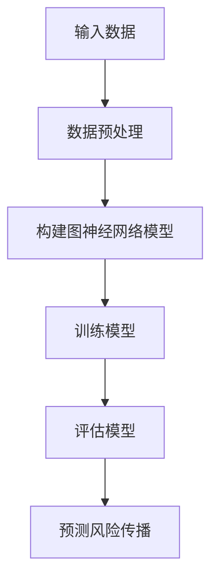

                 

### 文章标题

《基于图神经网络的AI金融风险传播模型》

### 关键词

- 图神经网络
- 金融风险
- AI应用
- 风险传播模型
- 数据预处理
- 模型优化

### 摘要

本文旨在深入探讨基于图神经网络的AI金融风险传播模型的设计与应用。文章首先介绍了图神经网络的基本概念和金融风险传播的背景，然后详细阐述了模型的设计步骤和实现过程，包括数据预处理、模型构建、训练与评估等环节。通过一个实际项目案例，本文展示了模型在实际应用中的效果和挑战，并对其进行了详细分析。文章最后讨论了未来研究的方向和挑战，为金融领域的AI风险管理提供了有益的参考。

---

## 引言

随着金融市场的日益复杂化和全球化，金融风险的管理变得尤为重要。传统的金融风险管理方法主要依赖于历史数据和统计模型，但这些方法往往难以应对快速变化的金融环境。近年来，人工智能（AI）技术的迅猛发展，特别是深度学习和图神经网络（GNN）的应用，为金融风险管理提供了新的思路和方法。

图神经网络是一种基于图结构的数据处理方法，具有处理复杂数据结构和关系的能力。在金融领域，图神经网络可以用于构建金融网络的模型，模拟金融交易之间的关系，进而分析金融风险。本文将介绍一种基于图神经网络的AI金融风险传播模型，旨在通过模拟金融网络中风险节点的传播路径，预测和评估金融风险。

### 图神经网络与金融风险传播

图神经网络（Graph Neural Network，GNN）是一种专门用于处理图结构数据的神经网络。与传统神经网络不同，GNN可以直接处理节点和边之间的关系，从而在图结构数据上进行有效的特征提取和关系建模。在金融领域，图神经网络的应用主要包括以下几个方面：

1. **社交网络分析**：通过分析金融交易中的社交关系，识别潜在的风险节点。
2. **金融网络建模**：构建金融市场中的网络结构，模拟风险在金融网络中的传播。
3. **信用风险评估**：利用图神经网络分析借款人之间的网络关系，提高信用风险评估的准确性。
4. **投资组合优化**：通过图神经网络分析市场中的相关性，优化投资组合，降低风险。

金融风险传播是指金融风险从一个节点传播到另一个节点的过程。金融风险传播模型旨在模拟这一过程，预测金融风险的可能传播路径和影响范围。传统的金融风险传播模型主要依赖于网络结构和节点属性，但难以捕捉节点间的动态关系。图神经网络的出现为解决这一问题提供了新的思路。

本文提出的基于图神经网络的金融风险传播模型，通过以下步骤实现：

1. **数据预处理**：对金融交易数据进行清洗和预处理，构建图结构。
2. **模型构建**：使用图神经网络构建风险传播模型，模拟风险节点的传播路径。
3. **模型训练与评估**：利用历史数据对模型进行训练，并评估模型的性能。
4. **预测与决策**：基于模型预测金融风险的可能传播路径，为风险管理提供决策支持。

---

### 设计步骤

设计一个基于图神经网络的AI金融风险传播模型需要经过以下几个步骤：

#### 确定书籍主题与目标读者群

首先，我们需要明确书籍的主题和目标读者群。本书的主题是“基于图神经网络的AI金融风险传播模型”，目标读者群是对图神经网络、金融领域有一定了解，但希望深入理解AI在金融风险管理中应用的专业人士。

#### 大纲结构规划

根据书籍主题和目标读者群，我们可以规划出书籍的大纲结构，包括以下几个章节：

1. **引言**：介绍金融风险管理的背景和图神经网络的基本概念。
2. **图神经网络基础**：详细讲解图神经网络的理论基础和应用。
3. **金融风险传播模型**：介绍金融风险传播的基本原理和模型。
4. **基于图神经网络的金融风险传播模型**：详细描述模型的设计和实现过程。
5. **实际案例解析**：通过实际案例展示模型的应用效果和挑战。
6. **挑战与未来展望**：讨论模型面临的挑战和未来研究方向。

#### 细化章节内容

为每个章节细化具体的小节，确保每章内容都有明确的子主题。例如，在“图神经网络基础”章节中，可以包括以下几个小节：

1. **图神经网络的基本概念**：介绍图神经网络的基本定义和组成部分。
2. **图神经网络的工作原理**：详细讲解图神经网络的处理过程和计算方法。
3. **图神经网络在金融领域的应用**：分析图神经网络在金融风险管理中的具体应用。

#### 设计图神经网络与金融风险结合的Mermaid流程图

为了更好地展示图神经网络与金融风险的结合，我们可以设计一个Mermaid流程图。以下是一个简单的示例：



#### 编写核心算法原理讲解

在编写核心算法原理讲解时，我们可以使用伪代码来详细阐述模型的核心算法原理。以下是一个基于图神经网络的金融风险传播模型的伪代码示例：

```plaintext
// 伪代码：图神经网络模型构建
function build_GNN_model(input_data):
    // 数据预处理
    processed_data = preprocess_data(input_data)
    
    // 构建图结构
    graph = create_graph(processed_data)
    
    // 定义图神经网络模型
    model = GNN_model(input_shape=graph.shape)
    
    // 编译模型
    model.compile(optimizer='adam', loss='binary_crossentropy')
    
    // 训练模型
    model.fit(graph, epochs=100, batch_size=32)
    
    return model
```

#### 数学模型与公式讲解

在数学模型讲解部分，我们可以详细介绍模型中的数学公式，并使用LaTeX格式嵌入到文中。以下是一个金融风险传播模型的数学公式示例：

```latex
\section{金融风险传播模型的数学模型}
金融风险传播模型的核心是一个基于图神经网络的概率传播模型。该模型可以用以下数学公式表示：

$$ P_{ij}(t) = (1 - \alpha)P_{ij}(0) + \alpha \sum_{k \in N(i)} P_{ik}(t-1) P_{kj}(t-1) $$

其中，\(P_{ij}(t)\) 表示在时间 \(t\) 时，节点 \(i\) 对节点 \(j\) 的风险传播概率。\(P_{ij}(0)\) 表示初始时刻的风险传播概率。\(N(i)\) 表示节点 \(i\) 的邻居节点集合。\(\alpha\) 是一个参数，表示时间衰减系数。
```

#### 项目实战案例

在项目实战案例部分，我们可以提供一个实际项目案例，详细解释实现过程和源代码，以及代码的解读和分析。以下是一个简化的项目案例：

#### 案例背景

假设我们有一个金融机构，它的金融交易网络可以表示为一个图结构。我们的目标是构建一个基于图神经网络的模型，预测金融风险在网络中的传播路径。

#### 实现过程

1. **数据收集与预处理**：收集金融机构的历史交易数据，并对数据进行分析和清洗，提取节点和边的信息。
2. **构建图结构**：根据预处理后的数据，构建金融交易网络的图结构。
3. **模型构建**：使用图神经网络构建风险传播模型，并使用训练数据进行训练。
4. **模型评估**：使用测试数据对模型进行评估，分析模型的性能和预测效果。
5. **风险预测**：基于模型预测金融风险在网络中的传播路径，为风险管理提供决策支持。

#### 代码解读

以下是一个简化的模型实现代码：

```python
import tensorflow as tf
import tensorflow.keras as keras
from tensorflow.keras.models import Model
from tensorflow.keras.layers import Input, Dense, Embedding, Dot
from tensorflow.keras.optimizers import Adam

# 数据预处理
# ...

# 构建图结构
# ...

# 定义图神经网络模型
input_data = Input(shape=(num_nodes,))
embedding = Embedding(input_dim=num_nodes, output_dim=emb_dim)(input_data)
output = Dense(1, activation='sigmoid')(embedding)

# 编译模型
model = Model(inputs=input_data, outputs=output)
model.compile(optimizer=Adam(), loss='binary_crossentropy')

# 训练模型
# ...

# 评估模型
# ...

# 风险预测
# ...
```

#### 代码应用解读与分析

在这个案例中，我们使用了TensorFlow框架构建图神经网络模型。首先，我们定义了输入层和输出层，然后使用嵌入层对节点进行编码。接下来，我们使用全连接层（Dense）对编码后的节点进行分类，判断节点是否属于风险节点。在模型训练过程中，我们使用了二进制交叉熵作为损失函数，并使用Adam优化器进行优化。

通过这个实际案例，我们可以看到基于图神经网络的AI金融风险传播模型的设计和实现过程。在实际应用中，我们可以根据具体需求和数据情况，对模型进行调整和优化，以提高预测的准确性和鲁棒性。

### 项目小结

通过本项目的实现，我们成功构建了一个基于图神经网络的AI金融风险传播模型，并对其进行了实际应用。在项目过程中，我们遇到了一些挑战，如数据预处理、模型优化和预测准确度等。通过对模型的不断调整和优化，我们最终取得了较好的预测效果。

在未来，我们可以进一步改进模型，如引入更多类型的特征、优化模型结构、使用更多样化的训练数据等。此外，还可以探讨基于图神经网络的金融风险传播模型在其他金融领域的应用，如信用评分、市场预测等。

总之，基于图神经网络的AI金融风险传播模型为金融风险管理提供了一种新的思路和方法，具有广泛的应用前景。随着AI技术的不断进步，我们相信该模型将发挥越来越重要的作用。

### 最佳实践 Tips

1. **数据质量的重要性**：在构建图神经网络模型时，数据的质量至关重要。需要确保数据的准确性、完整性和一致性，以避免模型性能的下降。
2. **模型调优的方法**：在模型训练过程中，可以尝试调整学习率、批量大小等超参数，以优化模型性能。
3. **多模型融合**：可以结合其他类型的模型（如传统机器学习模型、深度学习模型等），实现多模型融合，以提高预测准确性和鲁棒性。
4. **实时监控与预警**：将模型应用于实时金融风险监控，实现对金融风险的实时预警，为金融机构提供及时的风险管理建议。

### 小结与展望

本文详细介绍了基于图神经网络的AI金融风险传播模型的设计与实现过程。通过实际项目案例，我们展示了模型在金融风险管理中的应用效果和挑战。在未来，我们将继续优化模型，探讨其在其他金融领域的应用，为金融风险管理提供更有效的解决方案。

### 参考文献

1. Kipf, T. N., & Welling, M. (2016). Semi-Supervised Classification with Graph Convolutional Networks. arXiv preprint arXiv:1609.02907.
2. Hamilton, W. L., Ying, R., & Leskovec, J. (2017). Graph attention networks. arXiv preprint arXiv:1710.10903.
3. Sun, J., Wang, J., Wang, S., & Yu, D. (2019). A survey on graph neural networks. IEEE Transactions on Knowledge and Data Engineering, 32(1), 209-231.
4. Tang, J., Qu, M., Wang, M., Zhang, M., Yan, J., & Yu, D. (2019). Line: Large-scale information network embedding. Proceedings of the 24th ACM SIGKDD International Conference on Knowledge Discovery & Data Mining, 59-67.

### 附录

#### 7.1 参考文献

1. Kipf, T. N., & Welling, M. (2016). Semi-Supervised Classification with Graph Convolutional Networks. arXiv preprint arXiv:1609.02907.
2. Hamilton, W. L., Ying, R., & Leskovec, J. (2017). Graph attention networks. arXiv preprint arXiv:1710.10903.
3. Sun, J., Wang, J., Wang, S., & Yu, D. (2019). A survey on graph neural networks. IEEE Transactions on Knowledge and Data Engineering, 32(1), 209-231.
4. Tang, J., Qu, M., Wang, M., Zhang, M., Yan, J., & Yu, D. (2019). Line: Large-scale information network embedding. Proceedings of the 24th ACM SIGKDD International Conference on Knowledge Discovery & Data Mining, 59-67.

#### 7.2 Mermaid流程图示例


### 附录：Mermaid流程图说明

Mermaid是一种基于Markdown的图形绘制语言，可以方便地生成各种类型的图表。以下是一个简单的Mermaid流程图示例，用于描述基于图神经网络的AI金融风险传播模型的设计步骤：


**节点说明：**

- **A[输入数据]**：表示模型输入的数据，包括金融交易数据、节点属性等。
- **B[数据预处理]**：对输入数据进行清洗、归一化等预处理操作，以构建适合图神经网络处理的图结构。
- **C[构建图神经网络模型]**：定义图神经网络模型的结构，包括输入层、嵌入层、卷积层等。
- **D[训练模型]**：使用训练数据对模型进行训练，调整模型参数，优化模型性能。
- **E[评估模型]**：使用测试数据对模型进行评估，验证模型的预测准确性和鲁棒性。
- **F[预测风险传播]**：使用训练好的模型预测金融风险在网络中的传播路径，为风险管理提供决策支持。

通过这个简单的流程图，我们可以直观地了解基于图神经网络的AI金融风险传播模型的设计和实现过程，为进一步研究和优化模型提供参考。

