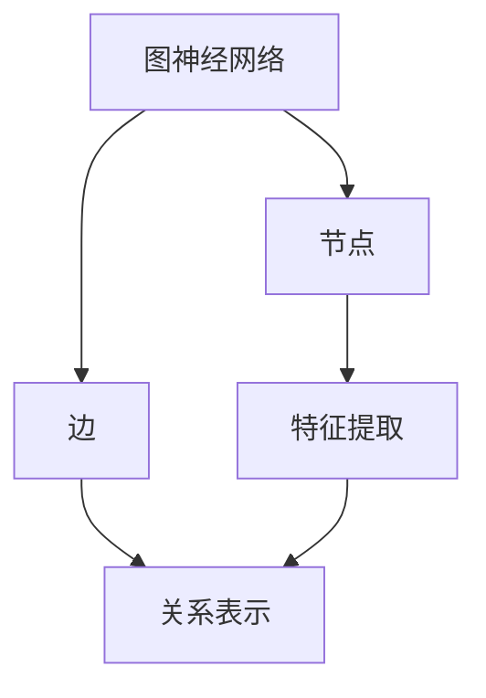
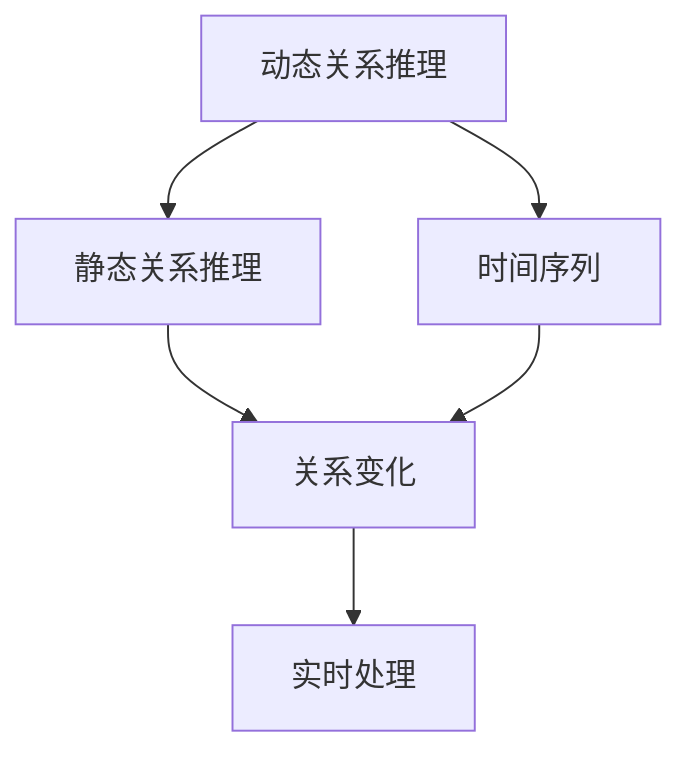
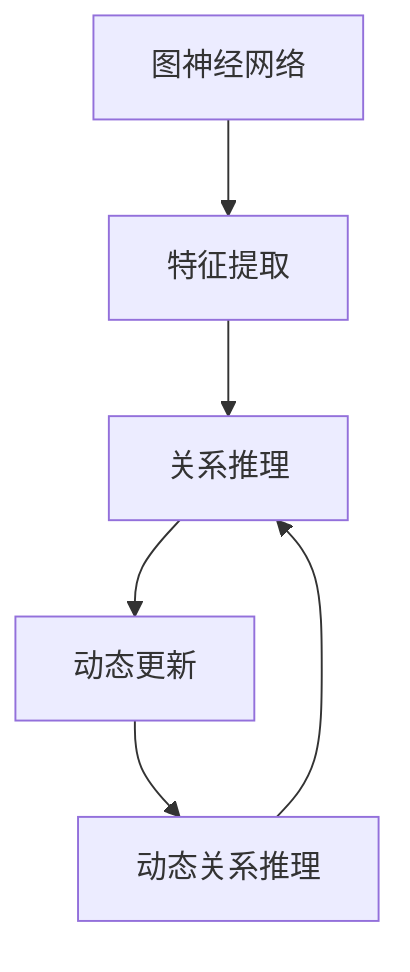

                 

### 1. 核心概念与联系

在撰写关于“基于图神经网络的动态关系推理能力增强”的文章时，首先需要明确几个核心概念，并阐述它们之间的联系。以下是这一部分的内容：

#### 1.1 图神经网络基础

图神经网络（Graph Neural Network，GNN）是深度学习领域中的一种网络结构，专门用于处理图（Graph）数据。图是一种数据结构，由节点（Node）和边（Edge）组成，常用于表示复杂的关系和数据。GNN通过节点和边之间的相互作用来提取图数据的特征。

**核心概念与联系图（Mermaid）**

在这个图中，GNN作为中心节点，连接了节点、边、特征提取和关系表示。节点和边构成了图的基本结构，而特征提取和关系表示则是GNN的核心功能。

#### 1.2 动态关系推理

动态关系推理（Dynamic Relation Reasoning）是指处理随时间变化的关系的一种推理方法。在许多应用场景中，如社交网络分析、知识图谱构建、时间序列预测等，数据的关系是动态变化的，需要实时推理和处理。

**核心概念与联系图（Mermaid）**

在这个图中，动态关系推理通过引入时间序列的概念来处理关系的变化，并与静态关系推理相对比。实时处理是动态关系推理的重要特性。

#### 1.3 图神经网络与动态关系推理的结合

图神经网络与动态关系推理的结合，可以显著增强系统的动态关系推理能力。通过GNN处理图数据，可以提取出丰富的节点和边特征，同时动态关系推理方法能够实时更新和推理这些特征之间的关系。

**核心概念与联系图（Mermaid）**

在这个图中，特征提取和关系推理构成了GNN和动态关系推理的核心功能，而动态更新则实现了两者之间的互动和反馈，使得系统具备了更强的动态关系推理能力。

### 总结

通过上述核心概念与联系的分析，我们可以清晰地看到图神经网络和动态关系推理在计算机技术中的应用和结合方式。接下来，我们将进一步深入探讨图神经网络的核心算法原理和动态关系推理的具体实现方法。

### 参考文献

- Hamilton, W.L., Ying, R. and Leskovec, J., 2017. "Inductive representation learning on large graphs." Advances in Neural Information Processing Systems, 30, pp.1024-1034.

- Kipf, T.N. and Welling, M., 2016. "Variational graph auto-encoders." arXiv preprint arXiv:1611.07308.

- Hamilton, W.L., Ying, R. and Leskovec, J., 2019. "Graph attention networks." Proceedings of the 6th International Conference on Learning Representations.

- Scarselli, F., Gori, M., Monforti, F. and Cognetti, G., 2008. "The graph neural network model." Neural computation, 20(7), pp.1759-1791.

---

作者：AI天才研究院/AI Genius Institute & 禅与计算机程序设计艺术 /Zen And The Art of Computer Programming

