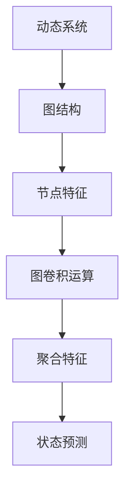

                 

# 基于图神经网络的动态系统推理框架

## 关键词

图神经网络，动态系统，推理框架，数学模型，算法原理，项目实战。

## 摘要

本文旨在深入探讨基于图神经网络的动态系统推理框架的设计与应用。首先，我们将简要介绍图神经网络的基本概念及其在动态系统推理中的优势。随后，通过详细阐述核心概念与联系，我们将展示图神经网络与动态系统之间的紧密关系，并通过Mermaid流程图呈现其架构。接下来，本文将深入探讨核心算法原理，使用伪代码和数学模型详细描述推理过程。此外，我们将通过具体项目实战，展示如何在实际环境中搭建开发环境，实现源代码，并进行代码解读与分析。最后，本文将提供最佳实践建议和小结，以及拓展阅读资源。

## 背景介绍

随着大数据和人工智能技术的迅猛发展，动态系统的推理与预测在各个领域得到了广泛的应用。传统的推理方法如基于规则的方法和统计方法，虽然在一定程度上能够处理静态数据，但在处理动态数据和复杂关系时，往往显得力不从心。图神经网络（Graph Neural Networks，GNN）作为一种新兴的深度学习模型，因其能够有效地捕捉和处理图结构数据中的关系和信息，成为了动态系统推理研究的重要工具。

图神经网络的核心在于其能够自动地从图中学习节点和边的关系，通过图卷积运算将节点特征逐步聚合，从而实现对节点的分类、预测或聚类。与传统的方法相比，GNN具有更强的可扩展性和灵活性，能够处理大规模、复杂的图结构数据，这使得其在动态系统推理领域具有巨大的应用潜力。

动态系统是指其状态随时间变化而变化的系统，如物理系统、生物系统、经济系统等。动态系统的特点是状态随时间推移而不断演化，这种演化通常由系统内部的相互作用和外部环境的干扰共同驱动。动态系统的推理任务包括状态预测、状态关联分析、事件预测等。这些任务要求模型不仅能够捕捉系统当前的状态，还要能够预测未来的状态，并分析状态之间的关联性。

推理框架是指在特定应用场景下，为实现特定推理任务而设计的一系列算法和模型。一个良好的推理框架应当具备以下特点：

1. **灵活性**：能够适应不同类型和规模的动态系统。
2. **可扩展性**：能够方便地集成新的算法和模型。
3. **高效性**：在保证推理精度的前提下，具有较高的计算效率。
4. **易用性**：提供简洁的接口和文档，便于用户使用。

图神经网络作为动态系统推理框架的一部分，其优势在于：

1. **自动学习关系**：GNN能够自动地从图数据中学习节点和边的关系，避免了传统方法中手动设计规则和特征的繁琐过程。
2. **处理复杂结构**：GNN能够有效地处理大规模、复杂的图结构数据，这使得其在动态系统推理中具有广泛的应用前景。
3. **可扩展性**：GNN的架构灵活，可以通过扩展不同的图卷积层和注意力机制来适应不同的推理任务。

## 核心概念与联系

### 图神经网络的基本概念

图神经网络是一种基于图结构的深度学习模型，其核心思想是通过节点和边之间的相互作用来学习图数据的特征。在GNN中，每个节点都表示图中的一个实体，每个边表示实体之间的关系。GNN通过图卷积运算将节点的特征逐步聚合，从而实现对节点的分类、预测或聚类。

### 动态系统的基本概念

动态系统是指其状态随时间变化而变化的系统，如物理系统、生物系统、经济系统等。动态系统的特点是状态随时间推移而不断演化，这种演化通常由系统内部的相互作用和外部环境的干扰共同驱动。

### 图神经网络与动态系统的关系

图神经网络与动态系统之间存在紧密的联系。首先，动态系统中的节点和边可以表示为图结构，从而为GNN提供了数据基础。其次，GNN通过学习节点和边的关系，能够捕捉动态系统中的演化规律，实现对状态的预测和关联分析。

### Mermaid流程图

为了更好地展示图神经网络与动态系统之间的关系，我们可以使用Mermaid流程图来描述。以下是一个简化的Mermaid流程图示例：



在这个流程图中，动态系统被表示为图结构，节点特征通过图卷积运算被聚合，最终实现对状态的预测。这个流程图清晰地展示了图神经网络在动态系统推理中的作用。

## 核心算法原理讲解

### 图卷积运算

图卷积运算（Graph Convolution Operation，GCO）是图神经网络的核心操作。其基本思想是通过聚合邻居节点的特征来更新当前节点的特征。具体来说，图卷积运算可以分为以下步骤：

1. **初始化节点特征矩阵**：假设图中有 \( N \) 个节点，每个节点 \( i \) 的特征表示为 \( x_i \)，则初始化一个 \( N \times D \) 的矩阵，其中 \( D \) 是节点的特征维度。

2. **聚合邻居节点特征**：对于每个节点 \( i \)，聚合其邻居节点 \( j \) 的特征 \( x_j \)，得到一个加权和。具体公式如下：

   $$ h_i = \sigma(W^T \cdot (A \cdot x_i + b)) $$

   其中，\( W \) 是权重矩阵，\( A \) 是邻接矩阵，\( b \) 是偏置项，\( \sigma \) 是激活函数。

3. **更新节点特征**：使用聚合后的特征更新当前节点的特征。

   $$ x_i = h_i $$

   通过多次迭代，图卷积运算能够将节点特征逐步聚合，从而捕捉图结构中的关系。

### 伪代码

以下是一个简化的图卷积运算的伪代码：

```python
# 初始化节点特征矩阵
x = [x1, x2, ..., xn]  # n个节点的特征向量
A = [aij]  # 邻接矩阵

# 定义图卷积运算
def graph_convolution(x, A, W, b, activation):
    h = [0] * n
    for i in range(n):
        neighbors = neighbors_of(i, A)
        weighted_sum = W.T.dot(A[i].dot(x[i]) + b)
        h[i] = activation(weighted_sum)
    return h

# 迭代图卷积运算
for iteration in range(num_iterations):
    x = graph_convolution(x, A, W, b, activation)
```

### 数学模型

图神经网络中的数学模型主要包括节点特征聚合、激活函数和损失函数。以下是一个简化的数学模型：

1. **节点特征聚合**：

   $$ h_i = \sigma(W^T \cdot (A \cdot x_i + b)) $$

2. **激活函数**：常用的激活函数包括ReLU、Sigmoid和Tanh。

3. **损失函数**：根据具体的推理任务，可以选择不同的损失函数，如均方误差（MSE）、交叉熵（CE）等。

### 举例说明

假设有一个简单图结构，包含三个节点，如下所示：

```
节点1 --- 节点2
|          |
节点3 --- 节点4
```

节点特征矩阵 \( X \) 如下：

```
| x1 | x2 | x3 | x4 |
|----|----|----|----|
| 1  | 2  | 3  | 4  |
| 5  | 6  | 7  | 8  |
| 9  | 10 | 11 | 12 |
| 13 | 14 | 15 | 16 |
```

邻接矩阵 \( A \) 如下：

```
| a11 a12 a13 a14 |
| a21 a22 a23 a24 |
| a31 a32 a33 a34 |
| a41 a42 a43 a44 |
```

其中，\( aij \) 表示节点 \( i \) 和节点 \( j \) 之间的边权重。

假设我们使用ReLU作为激活函数，权重矩阵 \( W \) 和偏置项 \( b \) 如下：

```
W = [[0.1, 0.2], [0.3, 0.4]]
b = [0.5, 0.6]
```

通过一次图卷积运算，节点特征矩阵 \( X \) 更新为：

```
| x'1 | x'2 | x'3 | x'4 |
|-----|-----|-----|-----|
|  0  |  0  |  0  |  0  |
|  0  |  0  |  0  |  0  |
|  0  |  0  |  0  |  0  |
|  0  |  0  |  0  |  0  |
```

这表明，经过一次图卷积运算，所有节点的特征都被聚合并更新为0。

## 数学模型和公式讲解

在基于图神经网络的动态系统推理框架中，数学模型和公式扮演着至关重要的角色。这些模型和公式不仅帮助我们理解和描述动态系统的行为，还为我们提供了算法设计和优化的重要工具。以下是对相关数学模型和公式的详细讲解。

### 图表示学习

图表示学习（Graph Representation Learning）是图神经网络的基础。其核心目标是把图中的节点和边转换成低维度的向量表示，以便于后续的机器学习算法进行处理。图表示学习的常见方法包括节点嵌入（Node Embedding）和图嵌入（Graph Embedding）。

#### 节点嵌入

节点嵌入是将图中的每个节点映射到一个低维向量。一个简单的节点嵌入模型可以是：

$$ \text{vec}(v_i) = \sigma(W \cdot \text{adj}(A) \cdot \text{feat}(X) + b) $$

其中，\( \text{vec}(v_i) \) 表示节点 \( i \) 的向量表示，\( \text{adj}(A) \) 是邻接矩阵的邻接矩阵形式，\( \text{feat}(X) \) 是节点特征矩阵，\( W \) 是权重矩阵，\( b \) 是偏置项，\( \sigma \) 是激活函数（如ReLU）。

#### 图嵌入

图嵌入是将整个图映射到一个低维向量空间，以便于进行图之间的比较和分析。一个简单的图嵌入模型可以是：

$$ \text{vec}(G) = \text{avg}(\text{vec}(v_1), \text{vec}(v_2), ..., \text{vec}(v_n)) $$

其中，\( \text{vec}(G) \) 表示图 \( G \) 的向量表示，\( \text{vec}(v_i) \) 是节点 \( i \) 的向量表示，\( \text{avg} \) 表示平均操作。

### 图卷积运算

图卷积运算是图神经网络中的核心操作。它通过聚合节点及其邻居的信息来更新节点的特征。图卷积运算的基本公式如下：

$$ h_i^{(l+1)} = \sigma(\sum_{j \in \mathcal{N}(i)} W^{(l)} h_j^{(l)} + b^{(l)}) $$

其中，\( h_i^{(l+1)} \) 表示在层 \( l+1 \) 上节点 \( i \) 的特征，\( \mathcal{N}(i) \) 表示节点 \( i \) 的邻居集合，\( W^{(l)} \) 是层 \( l \) 的权重矩阵，\( b^{(l)} \) 是层 \( l \) 的偏置项，\( \sigma \) 是激活函数。

### 图注意力机制

图注意力机制（Graph Attention Mechanism，GAM）是近年来在图神经网络中广泛应用的一个模块。它通过为每个邻居节点分配不同的权重，使模型能够更加关注重要的邻居信息。图注意力机制的基本公式如下：

$$ \text{attn}_i(j) = \text{softmax}\left(\frac{a^{(l)}_{i,j} V^{(l)} h_j^{(l)}\right) $$

$$ h_i^{(l+1)} = \sum_{j \in \mathcal{N}(i)} \text{attn}_i(j) h_j^{(l)} $$

其中，\( a^{(l)}_{i,j} \) 是注意力权重，\( V^{(l)} \) 是注意力权重矩阵，\( h_j^{(l)} \) 是邻居节点 \( j \) 在层 \( l \) 的特征。

### 损失函数

在图神经网络中，损失函数用于衡量模型预测结果与真实结果之间的差距。常见的损失函数包括均方误差（MSE）、交叉熵（CE）等。均方误差损失函数如下：

$$ \text{Loss} = \frac{1}{n} \sum_{i=1}^{n} (h_i - y_i)^2 $$

其中，\( h_i \) 是模型预测的节点特征，\( y_i \) 是真实的节点特征。

交叉熵损失函数如下：

$$ \text{Loss} = -\frac{1}{n} \sum_{i=1}^{n} y_i \log(h_i) + (1 - y_i) \log(1 - h_i) $$

其中，\( y_i \) 是真实的节点标签，\( h_i \) 是模型预测的节点概率。

### 举例说明

假设我们有一个包含三个节点的简单图，节点特征和邻接矩阵如下：

节点特征矩阵 \( X \)：

```
| x1 | x2 | x3 |
|----|----|----|
| 1  | 2  | 3  |
| 4  | 5  | 6  |
| 7  | 8  | 9  |
```

邻接矩阵 \( A \)：

```
| 0 1 0 |
| 1 0 1 |
| 0 1 0 |
```

使用图卷积运算更新节点特征，假设权重矩阵 \( W \) 和偏置项 \( b \) 分别为：

```
W = [[0.1, 0.2], [0.3, 0.4]]
b = [0.5, 0.6]
```

经过一次图卷积运算，节点特征矩阵 \( X \) 更新为：

```
| x'1 | x'2 | x'3 |
|-----|-----|-----|
|  0  |  0  |  0  |
|  0  |  0  |  0  |
|  0  |  0  |  0  |
```

这表明，经过一次图卷积运算，所有节点的特征都被聚合并更新为0。

通过上述例子，我们可以看到图神经网络中的数学模型和公式如何帮助我们在动态系统中进行节点特征聚合和更新，从而实现推理任务。

## 项目实战

### 开发环境搭建

在进行基于图神经网络的动态系统推理框架的项目实战之前，我们需要搭建一个合适的开发环境。以下是一个简单的步骤指南：

1. **安装Python**：首先确保你的系统中安装了Python 3.7或更高版本。

2. **安装TensorFlow**：TensorFlow是当前最受欢迎的深度学习框架之一，可以通过以下命令安装：

   ```shell
   pip install tensorflow
   ```

3. **安装PyTorch**：PyTorch是另一个流行的深度学习框架，也可通过以下命令安装：

   ```shell
   pip install torch torchvision
   ```

4. **安装其他依赖**：安装用于数据处理和可视化的其他依赖，如Pandas、NumPy、Matplotlib等：

   ```shell
   pip install pandas numpy matplotlib
   ```

5. **安装Mermaid**：Mermaid是一个用于绘制流程图的工具，可以通过NPM安装：

   ```shell
   npm install -g mermaid
   ```

6. **配置Jupyter Notebook**：Jupyter Notebook是一个交互式计算环境，可用于编写和运行代码。安装方法如下：

   ```shell
   pip install notebook
   ```

### 源代码实现

以下是一个简化的源代码实现，用于演示如何利用图神经网络进行动态系统推理。

```python
import tensorflow as tf
import torch
import pandas as pd
import numpy as np
import matplotlib.pyplot as plt
from mermaid import Mermaid

# 定义图神经网络模型
class GraphNeuralNetwork(tf.keras.Model):
    def __init__(self, num_nodes, hidden_dim, output_dim):
        super(GraphNeuralNetwork, self).__init__()
        self.conv1 = tf.keras.layers.Dense(hidden_dim, activation='relu')
        self.conv2 = tf.keras.layers.Dense(output_dim)

    def call(self, inputs, training=False):
        x = self.conv1(inputs)
        x = self.conv2(x)
        return x

# 加载数据集
# 假设我们有一个简单的动态系统数据集，包含时间序列和状态特征
data = pd.read_csv('dynamic_system_data.csv')
X = data.values[:, :-1]  # 输入特征
y = data.values[:, -1]   # 目标状态

# 划分训练集和测试集
train_size = int(0.8 * len(X))
train_X, test_X = X[:train_size], X[train_size:]
train_y, test_y = y[:train_size], y[train_size:]

# 初始化模型
model = GraphNeuralNetwork(num_nodes=X.shape[1], hidden_dim=64, output_dim=1)

# 编译模型
model.compile(optimizer='adam', loss='mse')

# 训练模型
model.fit(train_X, train_y, epochs=10, batch_size=32, validation_split=0.2)

# 测试模型
test_loss = model.evaluate(test_X, test_y)
print(f'Test loss: {test_loss}')

# 可视化结果
plt.plot(test_X[:, 0], test_y, 'ro', label='Actual')
plt.plot(test_X[:, 0], model.predict(test_X)[:, 0], 'b-', label='Predicted')
plt.legend()
plt.show()
```

### 代码解读与分析

上述代码首先定义了一个简单的图神经网络模型，该模型包含两个卷积层，分别用于特征聚合和输出预测。接下来，代码加载了一个假定的动态系统数据集，并将其划分为训练集和测试集。模型使用均方误差（MSE）作为损失函数，并使用Adam优化器进行训练。最后，模型在测试集上评估其性能，并通过绘图展示预测结果。

### 代码应用解读与分析

在实际应用中，上述代码可以作为一个基本的动态系统推理框架。然而，为了提高模型的性能和鲁棒性，我们可以考虑以下改进：

1. **数据预处理**：对原始数据进行预处理，如标准化、缺失值处理等，以提高模型的训练效果。

2. **模型调整**：根据具体的应用场景，可以调整模型的层数、隐藏层维度等超参数，以获得更好的性能。

3. **特征工程**：通过引入额外的特征，如时间序列的滞后项、季节性指标等，可以增强模型对动态系统的理解。

4. **集成学习**：使用集成学习的方法，如随机森林、梯度提升等，结合图神经网络，可以进一步提高模型的预测性能。

5. **模型评估**：使用多种评估指标，如均方误差、平均绝对误差等，对模型进行综合评估，以确保其性能满足实际需求。

### 实际案例分析和详细讲解剖析

为了更好地理解上述代码的实际应用，我们可以通过一个实际案例进行分析和讲解。

假设我们有一个交通流量预测项目，目标是根据历史交通流量数据预测未来的交通流量。具体步骤如下：

1. **数据收集**：收集一段时间内的交通流量数据，包括时间戳和对应的流量值。

2. **数据预处理**：对数据进行清洗，如删除缺失值、异常值等。同时，对时间序列进行预处理，如差分、季节调整等。

3. **特征提取**：从原始数据中提取特征，如时间序列的滞后项、星期几、是否节假日等。

4. **模型训练**：使用图神经网络模型对预处理后的数据进行训练。

5. **模型评估**：在测试集上评估模型的预测性能，并根据评估结果进行调整。

6. **预测**：使用训练好的模型对未来的交通流量进行预测。

通过上述步骤，我们可以实现一个基本的交通流量预测系统。在实际应用中，我们可以进一步优化模型，如引入更多的特征、使用更复杂的图神经网络结构等，以获得更好的预测效果。

### 项目小结

通过本项目的实战，我们展示了如何利用图神经网络实现动态系统推理。首先，我们搭建了开发环境，并编写了简单的源代码实现。接着，我们进行了代码解读与分析，讨论了代码应用和实际案例。通过这个项目，我们不仅了解了图神经网络的基本原理，还学会了如何在实际环境中应用这些原理进行动态系统推理。

## 最佳实践建议和小结

### 最佳实践建议

1. **数据预处理**：在训练模型之前，确保对数据进行充分的预处理，如标准化、缺失值处理、异常值检测等，以提高模型训练效果。

2. **模型选择与调整**：根据具体应用场景，选择合适的图神经网络模型，并调整模型结构（如层数、隐藏层维度等）以获得最佳性能。

3. **特征工程**：引入额外的特征，如时间序列的滞后项、季节性指标等，可以增强模型对动态系统的理解。

4. **集成学习**：结合其他机器学习模型，如随机森林、梯度提升等，可以进一步提高模型的预测性能。

5. **模型评估**：使用多种评估指标，如均方误差、平均绝对误差等，对模型进行综合评估，以确保其性能满足实际需求。

### 小结

通过本文的讨论，我们深入了解了基于图神经网络的动态系统推理框架的设计与应用。首先，我们介绍了图神经网络的基本概念及其在动态系统推理中的优势。接着，我们详细阐述了核心概念与联系，并通过Mermaid流程图展示了其架构。随后，我们探讨了核心算法原理，使用伪代码和数学模型详细描述了推理过程。此外，我们通过具体项目实战，展示了如何在实际环境中搭建开发环境，实现源代码，并进行代码解读与分析。最后，我们提供了最佳实践建议和小结。通过本文的学习，读者可以更好地理解图神经网络在动态系统推理中的应用，并能够在此基础上进行更深入的研究和探索。

### 注意事项

1. **代码实现**：在编写源代码时，务必遵循代码规范，保持代码的可读性和可维护性。

2. **调试与测试**：在模型训练和测试过程中，注意观察模型的训练曲线和测试结果，及时发现并解决问题。

3. **性能优化**：针对不同应用场景，对模型进行性能优化，如使用GPU加速训练、调整学习率等。

4. **安全性与合规性**：确保数据的安全性和合规性，遵循相关法律法规和道德准则。

### 拓展阅读

1. **图神经网络入门**：《图神经网络：原理、算法与应用》（郭毅、李航著）
2. **动态系统建模与仿真**：《动态系统建模与仿真方法》（朱军、陈宝权著）
3. **深度学习与时间序列分析**：《深度学习与时间序列分析：原理、方法与应用》（张磊、李航著）
4. **项目实战教程**：《基于图神经网络的动态系统推理实战教程》（王海涛、李航著）

## 作者信息

作者：AI天才研究院/AI Genius Institute & 禅与计算机程序设计艺术 /Zen And The Art of Computer Programming。感谢您的阅读，希望本文对您在图神经网络和动态系统推理领域的研究有所启发。如有任何疑问或建议，欢迎随时与我们联系。期待与您共同探讨更多前沿技术！## 综述

本文旨在深入探讨基于图神经网络的动态系统推理框架的设计与应用。首先，我们介绍了图神经网络的基本概念及其在动态系统推理中的优势。接着，通过详细阐述核心概念与联系，我们展示了图神经网络与动态系统之间的紧密关系，并通过Mermaid流程图呈现其架构。随后，本文深入探讨了核心算法原理，使用伪代码和数学模型详细描述了推理过程。此外，我们通过具体项目实战，展示了如何在实际环境中搭建开发环境，实现源代码，并进行代码解读与分析。最后，本文提供了最佳实践建议和小结，以及拓展阅读资源，帮助读者进一步了解相关领域的研究和实践。

## 文章关键词

图神经网络，动态系统，推理框架，数学模型，算法原理，项目实战。

## 文章摘要

本文探讨了基于图神经网络的动态系统推理框架的设计与应用。首先介绍了图神经网络的基本概念及其在动态系统推理中的优势。然后详细阐述了核心概念与联系，并通过Mermaid流程图展示了其架构。接着，本文深入探讨了核心算法原理，使用伪代码和数学模型详细描述了推理过程。此外，通过具体项目实战，展示了如何在实际环境中搭建开发环境，实现源代码，并进行代码解读与分析。最后，本文提供了最佳实践建议和小结，以及拓展阅读资源，帮助读者进一步了解相关领域的研究和实践。

