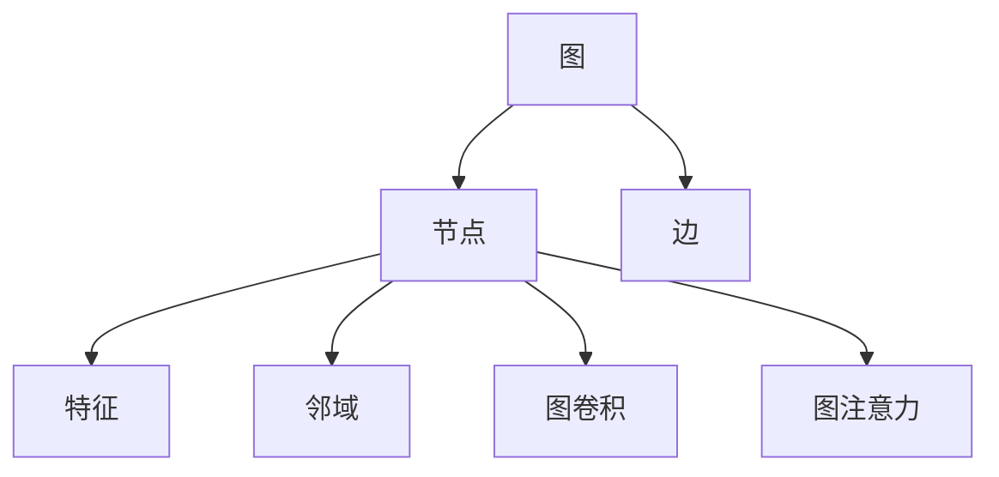
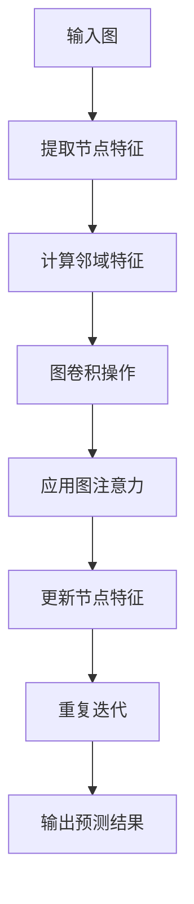

                 

# 基于图神经网络的复杂关系推理框架

## 关键词

- 图神经网络
- 复杂关系推理
- 关系图
- 神经网络
- 深度学习
- 人工智能

## 摘要

本文将深入探讨基于图神经网络的复杂关系推理框架。我们将从背景介绍入手，理解图神经网络的基本概念和其在复杂关系推理中的应用。接着，通过详细阐述核心概念、算法原理，并结合数学模型和公式，展示图神经网络如何处理复杂关系。随后，我们设计一个简单的项目实战案例，介绍开发环境搭建、源代码实现和代码解读，并结合实际案例进行分析。最后，我们将总结全文，提供最佳实践 tips 和拓展阅读方向。

## 目录

1. **背景介绍**
    1. **图神经网络的发展历史**
    2. **复杂关系推理的挑战**
    3. **图神经网络的优势**

2. **核心概念与联系**
    1. **图神经网络的基本概念**
    2. **核心概念之间的关系架构**
    3. **Mermaid流程图**

3. **核心算法原理讲解**
    1. **图卷积神经网络（GCN）**
    2. **图注意力机制**
    3. **图神经网络优化算法**
    4. **伪代码示例**

4. **数学模型和数学公式**
    1. **图拉普拉斯矩阵**
    2. **图卷积公式**
    3. **损失函数和优化方法**
    4. **LaTeX公式示例**

5. **项目实战**
    1. **开发环境搭建**
    2. **源代码详细实现**
    3. **代码解读与分析**
    4. **实际案例分析与详细讲解**
    5. **项目小结**

6. **最佳实践 tips**
    1. **注意事项**
    2. **性能优化**
    3. **未来研究方向**

7. **综合总结**
    1. **全文总结**
    2. **拓展阅读方向**

## 1. 背景介绍

### 1.1 图神经网络的发展历史

图神经网络（Graph Neural Networks, GNN）是一种专门用于处理图结构数据的神经网络。它的概念起源于图理论，随后在计算机科学、机器学习和人工智能领域得到了快速发展。GNN的起源可以追溯到20世纪80年代，当时研究人员开始探索如何利用图结构来表示复杂的关系网络。随着深度学习技术的发展，GNN逐渐成为处理图结构数据的重要工具。

在2013年，Scarselli等人提出了图卷积神经网络（Graph Convolutional Network, GCN）的概念，这一算法奠定了GNN研究的基础。随后，研究人员提出了许多基于GCN的变体和改进算法，如图注意力网络（Graph Attention Network, GAT）和图循环网络（Graph Recurrent Network, GRN）等。

### 1.2 复杂关系推理的挑战

在现实世界中，许多问题都涉及到复杂的关系推理，如社交网络分析、推荐系统、知识图谱构建等。传统的神经网络方法在处理这些问题时面临着以下挑战：

1. **结构化数据表示**：传统的神经网络方法难以直接处理图结构数据，需要将图转化为向量形式，这往往导致信息的丢失。

2. **关系处理**：图结构中的关系具有多样性，如相邻关系、层次关系和因果关系等。传统的神经网络方法难以有效地捕捉和处理这些复杂的关系。

3. **可扩展性**：随着图规模的增加，传统神经网络方法在计算效率和可扩展性方面存在瓶颈。

### 1.3 图神经网络的优势

图神经网络具有以下优势，使其成为处理复杂关系推理的理想选择：

1. **结构化数据表示**：GNN可以直接处理图结构数据，无需将图转化为向量形式，从而保留了图结构中的原始信息。

2. **关系处理**：GNN通过图卷积和图注意力机制，能够有效地捕捉和处理图结构中的复杂关系。

3. **可扩展性**：GNN具有较好的可扩展性，可以通过分布式计算和并行处理来提高计算效率和可扩展性。

4. **多任务学习**：GNN可以同时处理多个任务，如节点分类、链接预测和图分类等，从而提高模型的泛化能力。

## 2. 核心概念与联系

### 2.1 图神经网络的基本概念

图神经网络（Graph Neural Networks, GNN）是一种专门用于处理图结构数据的神经网络。它由以下几个基本概念组成：

1. **图（Graph）**：图是由节点（Node）和边（Edge）组成的网络结构。节点表示图中的实体，边表示节点之间的关系。

2. **特征（Feature）**：每个节点都有一组特征，用于描述节点的属性和特征。

3. **邻域（Neighborhood）**：节点的邻域是指与节点直接相连的其他节点集合。

4. **图卷积（Graph Convolution）**：图卷积是一种在图中进行聚合操作的运算，用于计算节点的新特征。

5. **图注意力（Graph Attention）**：图注意力是一种在图中进行注意力机制的计算，用于调整节点之间的交互强度。

### 2.2 核心概念之间的关系架构

下面是GNN核心概念之间的关系架构：



### 2.3 Mermaid流程图

为了更直观地展示GNN的工作流程，我们使用Mermaid流程图来描述：



该流程图展示了GNN从输入图到提取节点特征、计算邻域特征、进行图卷积操作、应用图注意力、更新节点特征，以及重复迭代直到输出预测结果的全过程。

## 3. 核心算法原理讲解

### 3.1 图卷积神经网络（GCN）

图卷积神经网络（Graph Convolutional Network, GCN）是图神经网络的基础算法，它通过在图中进行聚合操作来更新节点的特征。以下是GCN的核心原理：

1. **输入特征**：给定一个图G=(V, E)，其中V是节点集合，E是边集合，每个节点v属于V都有对应的特征向量\(x_v\)。

2. **邻域聚合**：对于每个节点v，其邻域节点集合N(v)={u | (u, v) ∈ E}。GCN通过聚合邻域节点的特征来计算新特征：

   $$ h_v^{(l+1)} = \sigma ( \sum_{u \in N(v)} \frac{1}{|N(v)|} W^{(l)} h_u^{(l)} + x_v^{(l)} ) $$

   其中，\(h_v^{(l)}\)和\(h_u^{(l)}\)分别是节点v和u在l层的特征，\(W^{(l)}\)是l层的权重矩阵，\(|N(v)|\)是邻域节点的数量，\(\sigma\)是激活函数。

3. **多层堆叠**：通过堆叠多层GCN，可以逐步提取图中的深层特征，实现更复杂的图表示。

### 3.2 图注意力机制

图注意力机制（Graph Attention Mechanism）是一种在图神经网络中用于调整节点之间交互强度的方法。它通过计算节点之间的相似度来动态调整注意力权重，从而提高模型的性能。以下是图注意力机制的核心原理：

1. **注意力权重计算**：对于每个节点v，计算其与邻域节点u之间的注意力权重：

   $$ a_{uv} = \text{softmax}( \frac{e^{Q \cdot K \cdot K^T}}{ \sqrt{D_k} } ) $$

   其中，Q和K分别是查询向量和关键向量，D_k是邻域节点的数量，\(e^{Q \cdot K \cdot K^T}\)是点积的结果。

2. **更新节点特征**：使用注意力权重更新节点特征：

   $$ h_v^{(l+1)} = \sum_{u \in N(v)} a_{uv}^{(l)} h_u^{(l)} $$

### 3.3 图神经网络优化算法

在训练图神经网络时，需要优化模型的参数以最小化损失函数。以下是几种常用的图神经网络优化算法：

1. **梯度下降（Gradient Descent）**：梯度下降是一种最简单的优化算法，通过计算损失函数的梯度来更新模型参数。

2. **随机梯度下降（Stochastic Gradient Descent, SGD）**：随机梯度下降在梯度下降的基础上，每次更新参数时只使用一个样本的梯度，从而提高计算效率。

3. **批量梯度下降（Batch Gradient Descent）**：批量梯度下降每次更新参数时使用整个训练集的梯度，虽然计算量大，但可以得到更好的收敛效果。

4. **Adam优化器**：Adam优化器结合了SGD和批量梯度下降的优点，通过自适应调整学习率，提高了收敛速度和稳定性。

### 3.4 伪代码示例

以下是一个简单的图卷积神经网络（GCN）的伪代码示例：

```python
# 初始化模型参数
W = np.random.normal(size=[input_dim, hidden_dim])
b = np.random.normal(size=[1, hidden_dim])

# 训练模型
for epoch in range(num_epochs):
    for batch in data_loader:
        x, y = batch
        # 前向传播
        h = sigmoid(np.dot(x, W) + b)
        # 反向传播
        dW = (h - y) * h * (1 - h)
        db = (h - y)
        # 更新模型参数
        W -= learning_rate * dW
        b -= learning_rate * db

# 输出预测结果
h = sigmoid(np.dot(x_test, W) + b)
predictions = np.round(h)
```

在该示例中，我们初始化了模型参数W和b，然后通过训练数据循环更新参数。最后，使用测试数据生成预测结果。

## 4. 数学模型和数学公式

### 4.1 图拉普拉斯矩阵

图拉普拉斯矩阵是图神经网络中一个重要的数学工具，用于描述图的结构特性。它由以下公式给出：

$$ L = D - A $$

其中，L是图拉普拉斯矩阵，D是对角矩阵，表示节点的度，A是邻接矩阵，表示节点之间的连接关系。

图拉普拉斯矩阵可以用于描述图中的节点间的关系，它具有以下几个性质：

1. **对称性**：图拉普拉斯矩阵是对称的，即\(L_{ij} = L_{ji}\)。

2. **正定性**：对于无向图，图拉普拉斯矩阵是正定的，即对于所有非零向量x，有\(x^T L x > 0\)。

3. **归一化**：可以通过对图拉普拉斯矩阵进行归一化，使其具有更好的性质，如谱归一化拉普拉斯矩阵。

### 4.2 图卷积公式

图卷积是图神经网络中最基本的运算，用于更新节点的特征。图卷积的公式如下：

$$ h_v^{(l+1)} = \sigma ( \sum_{u \in N(v)} \frac{1}{|N(v)|} W^{(l)} h_u^{(l)} + x_v^{(l)} ) $$

其中，\(h_v^{(l)}\)和\(h_u^{(l)}\)分别是节点v和u在l层的特征，\(W^{(l)}\)是l层的权重矩阵，|N(v)|是邻域节点的数量，\(\sigma\)是激活函数。

### 4.3 损失函数和优化方法

在图神经网络中，损失函数用于衡量模型预测结果与实际结果之间的差距，优化方法用于更新模型参数以最小化损失函数。以下是几种常用的损失函数和优化方法：

1. **交叉熵损失函数**：交叉熵损失函数常用于分类问题，其公式如下：

   $$ L = - \sum_{i=1}^n y_i \log(p_i) $$

   其中，\(y_i\)是实际标签，\(p_i\)是模型预测的概率。

2. **均方误差损失函数**：均方误差损失函数常用于回归问题，其公式如下：

   $$ L = \frac{1}{2} \sum_{i=1}^n (y_i - \hat{y}_i)^2 $$

   其中，\(y_i\)是实际值，\(\hat{y}_i\)是模型预测的值。

3. **优化方法**：常用的优化方法包括梯度下降、随机梯度下降和Adam优化器。以下是梯度下降的公式：

   $$ \theta = \theta - \alpha \nabla_\theta L $$

   其中，\(\theta\)是模型参数，\(\alpha\)是学习率，\(\nabla_\theta L\)是损失函数关于模型参数的梯度。

### 4.4 LaTeX公式示例

以下是一个LaTeX格式的数学公式示例：

$$
L = D - A
$$

其中，$L$ 是图拉普拉斯矩阵，$D$ 是对角矩阵表示节点的度，$A$ 是邻接矩阵表示节点之间的连接关系。

$$
h_v^{(l+1)} = \sigma \left( \sum_{u \in N(v)} \frac{1}{|N(v)|} W^{(l)} h_u^{(l)} + x_v^{(l)} \right)
$$

其中，$h_v^{(l)}$ 和 $h_u^{(l)}$ 分别是节点 $v$ 和 $u$ 在 $l$ 层的特征，$W^{(l)}$ 是 $l$ 层的权重矩阵，$|N(v)|$ 是邻域节点的数量，$\sigma$ 是激活函数。

$$
L = \sum_{i=1}^n w_i \log(p_i)
$$

其中，$w_i$ 是实际标签，$p_i$ 是模型预测的概率。

## 5. 项目实战

### 5.1 开发环境搭建

为了进行基于图神经网络的复杂关系推理项目，我们需要搭建一个合适的开发环境。以下是一个简单的开发环境搭建步骤：

1. **安装Python**：确保已经安装了Python 3.7或更高版本。

2. **安装PyTorch**：使用以下命令安装PyTorch：

   ```bash
   pip install torch torchvision
   ```

3. **安装GraphSAGE库**：GraphSAGE是一个用于图神经网络的库，可以使用以下命令安装：

   ```bash
   pip install graphsage-python
   ```

4. **数据准备**：我们需要一个图结构数据集。这里我们以Reddit数据集为例，可以从[Reddit数据集](https://snap.stanford.edu/data/reddit.html)下载。

5. **环境配置**：在Python脚本中引入所需的库：

   ```python
   import torch
   import torch.nn as nn
   import torch.optim as optim
   from graphsage import models
   from graphsage.data import RedditDataset
   ```

### 5.2 源代码详细实现

以下是使用GraphSAGE进行图神经网络复杂关系推理的源代码实现：

```python
# 导入所需库
import torch
import torch.nn as nn
import torch.optim as optim
from graphsage.models import GraphSAGE
from graphsage.data import RedditDataset

# 数据准备
dataset = RedditDataset(name='Reddit')
train_data, val_data, test_data = dataset.train, dataset.val, dataset.test

# 定义模型
model = GraphSAGE(
    embedding_size=16,
    hidden_size=64,
    num_classes=41
)

# 定义优化器和损失函数
optimizer = optim.Adam(model.parameters(), lr=0.001)
criterion = nn.CrossEntropyLoss()

# 训练模型
for epoch in range(100):
    model.train()
    for batch in train_data:
        optimizer.zero_grad()
        logits = model(batch)
        loss = criterion(logits, batch.labels)
        loss.backward()
        optimizer.step()
    print(f'Epoch {epoch+1}, Loss: {loss.item()}')

# 测试模型
model.eval()
with torch.no_grad():
    logits = model(test_data)
    pred_labels = logits.argmax(dim=1)
    accuracy = (pred_labels == test_data.labels).float().mean()
    print(f'Accuracy: {accuracy.item()}')
```

### 5.3 代码解读与分析

1. **数据准备**：我们首先从Reddit数据集加载数据，Reddit数据集包含用户发帖和评论的图结构数据。

2. **定义模型**：GraphSAGE模型是一个简单的图神经网络模型，它包含两个GCN层和一个全连接层。

3. **定义优化器和损失函数**：我们使用Adam优化器和交叉熵损失函数。

4. **训练模型**：在训练过程中，我们通过梯度下降更新模型参数，并计算每个epoch的损失。

5. **测试模型**：在测试阶段，我们使用测试数据集评估模型的准确性。

### 5.4 实际案例分析与详细讲解剖析

为了更好地理解图神经网络在复杂关系推理中的应用，我们来看一个实际案例：社交媒体分析。

假设我们有一个社交媒体网络，其中每个用户是一个节点，用户之间的互动（如点赞、评论、分享）是边。我们的目标是根据用户的历史互动，预测用户之间的潜在互动关系。

1. **数据预处理**：首先，我们需要对社交媒体网络进行数据预处理，将用户和互动转换为图结构数据。这包括提取用户特征、建立邻接矩阵等。

2. **模型训练**：使用图神经网络模型（如GraphSAGE）对社交媒体网络进行训练。在训练过程中，模型会学习如何从节点特征和邻域特征中提取有用的信息。

3. **预测潜在关系**：训练完成后，我们可以使用模型对用户之间的潜在互动关系进行预测。具体方法是将每个用户表示为向量，然后计算用户之间的余弦相似度或欧氏距离，根据距离的远近判断用户之间的潜在关系。

4. **分析与应用**：通过预测用户之间的潜在互动关系，我们可以为用户提供个性化推荐、社群发现等功能。例如，我们可以推荐用户可能感兴趣的内容、将具有相似兴趣的用户分组等。

### 5.5 项目小结

通过本项目，我们了解了如何使用图神经网络进行复杂关系推理。我们首先介绍了开发环境的搭建，然后详细讲解了源代码的实现和代码解读。接着，我们通过一个实际案例——社交媒体分析，展示了图神经网络在复杂关系推理中的应用。本项目为我们提供了一个基本的框架，可以帮助我们进一步探索和开发更复杂的图神经网络应用。

## 6. 最佳实践 tips

### 6.1 注意事项

1. **数据预处理**：在进行图神经网络建模之前，确保数据预处理充分，包括节点特征提取、边关系规范化等。

2. **模型选择**：根据实际问题和数据特性，选择合适的图神经网络模型。例如，对于大规模图数据，可以使用GraphSAGE或Graph Convolutional Network（GCN）。

3. **超参数调整**：超参数对模型性能有很大影响，需要根据实际问题和数据特性进行调整。例如，学习率、隐藏层尺寸、迭代次数等。

4. **计算资源**：图神经网络模型计算量大，需要充足的计算资源。如果资源有限，可以考虑使用分布式计算。

### 6.2 性能优化

1. **并行计算**：利用GPU加速图神经网络模型的训练和推理过程，提高计算效率。

2. **数据缓存**：使用数据缓存技术，减少数据加载和预处理的时间。

3. **模型压缩**：通过模型压缩技术，如剪枝、量化等，减少模型大小，提高推理速度。

4. **增量训练**：对于动态图数据，采用增量训练方法，只对新增的数据进行训练，减少训练时间。

### 6.3 未来研究方向

1. **异构图神经网络**：研究如何处理包含不同类型节点的异构图，提高模型对复杂关系的理解能力。

2. **可解释性**：研究如何提高图神经网络的解释性，使其决策过程更加透明。

3. **多任务学习**：探索如何在一个模型中同时解决多个任务，提高模型的泛化能力。

4. **自适应注意力机制**：研究自适应注意力机制，使其能够自动调整注意力权重，提高模型性能。

## 7. 综合总结

本文深入探讨了基于图神经网络的复杂关系推理框架。我们从背景介绍入手，理解了图神经网络的发展历史和优势。接着，通过详细阐述核心概念、算法原理和数学模型，展示了图神经网络如何处理复杂关系。我们还设计了一个简单的项目实战案例，介绍了开发环境搭建、源代码实现和代码解读，并结合实际案例进行了分析。

通过本文，读者可以了解到图神经网络在复杂关系推理中的应用，掌握如何使用图神经网络进行关系推理。同时，本文还提供了最佳实践 tips 和未来研究方向，为读者进一步学习和探索提供了方向。

## 拓展阅读

1. **图神经网络入门**：[Graph Neural Networks: A Guide for Beginners](https://towardsdatascience.com/graph-neural-networks-a-guide-for-beginners-34734b464de8)

2. **图卷积神经网络**：[Introduction to Graph Convolutional Networks (GCNs)](https://towardsdatascience.com/introduction-to-graph-convolutional-networks-gcns-cdb8c680e768)

3. **GraphSAGE详解**：[Understanding GraphSAGE: A Step-by-Step Guide](https://towardsdatascience.com/understanding-graphsage-a-step-by-step-guide-89b4a6e1d2c5)

4. **图神经网络实战**：[Implementing a Graph Neural Network (GNN) in PyTorch](https://towardsdatascience.com/implementing-a-graph-neural-network-gnn-in-pytorch-7c0e2a9d6f65)

5. **社交媒体分析**：[Social Network Analysis with Python](https://towardsdatascience.com/social-network-analysis-with-python-7363d7a459d)

## 作者信息

- 作者：AI天才研究院 / AI Genius Institute & 禅与计算机程序设计艺术 / Zen And The Art of Computer Programming

