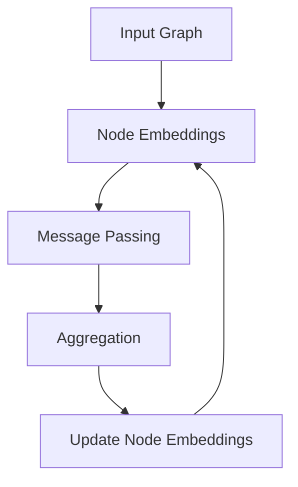

                 


## 引言

### 背景介绍

在当前的人工智能领域，复杂推理任务的求解已成为许多实际应用中的关键挑战。传统的推理方法，如基于规则的方法和逻辑推理，在处理复杂、动态的数据关系时显得力不从心。随着图神经网络（Graph Neural Networks, GNNs）的兴起，它们在处理图结构数据、捕捉节点之间的关系方面展现出了巨大的潜力。图神经网络作为一种深度学习模型，已经广泛应用于知识图谱、推荐系统、文本挖掘、社交网络分析等多个领域。

### 核心概念与联系

图神经网络（GNNs）是一种基于图结构的深度学习模型，能够处理图（Graph）数据。在GNNs中，数据被表示为图，其中节点表示数据实体，边表示实体之间的关系。GNNs通过图卷积操作来学习节点表示，并利用这些表示进行预测或分类。

为了更好地理解GNNs的工作原理，我们可以使用Mermaid流程图来展示其核心架构：



在上述流程图中：
- **A[Input Graph]** 表示输入的图数据。
- **B[Node Embeddings]** 表示节点的嵌入表示。
- **C[Message Passing]** 表示通过边传递信息。
- **D[Aggregation]** 表示对传递的信息进行聚合。
- **E[Update Node Embeddings]** 表示更新节点的嵌入表示。

通过这个流程图，我们可以看到GNNs的基本操作是如何将图数据转换为节点表示，并且如何通过消息传递和聚合来学习节点之间的关系。

### 核心算法原理讲解

图神经网络的核心算法包括图卷积网络（Graph Convolutional Network, GCN）、图注意力网络（Graph Attention Network, GAT）和图自编码器（Graph Autoencoder, GAE）。以下是这些算法的伪代码实现和原理讲解：

#### 图卷积网络（GCN）

```python
# GCN伪代码
def gcn_adj_matrix(A, K):
    """
    计算图卷积网络的邻接矩阵
    A: 输入邻接矩阵
    K: 卷积层数量
    """
    for _ in range(K):
        A = sigmoid(np.dot(A, A))
    return A

def gcn_forward(x, A, H):
    """
    图卷积网络的前向传播
    x: 输入节点特征
    A: 邻接矩阵
    H: 嵌入向量
    """
    return sigmoid(np.dot(A, H) + x)
```

图卷积网络通过聚合邻居节点的信息来更新节点的嵌入表示。它使用邻接矩阵A来表示节点之间的关系，并通过多次卷积操作来增强节点表示的能力。

#### 图注意力网络（GAT）

```python
# GAT伪代码
def attn dout, a, alpha):
    """
    计算图注意力权重
    dout: 输出维度
    a: 输入特征
    alpha: 注意力权重
    """
    eij = tanh(np.dot(a, [1, a]))
    alpha = softmax(eij, axis=1)
    return np.dot(alpha, a)

def gat_forward(x, A, alpha):
    """
    图注意力网络的前向传播
    x: 输入节点特征
    A: 邻接矩阵
    alpha: 注意力权重
    """
    z = attn(dout, x, alpha)
    return sigmoid(np.dot(A, z) + x)
```

图注意力网络通过引入注意力机制来动态调整节点之间的权重，使得模型能够更好地关注到重要的关系。

#### 图自编码器（GAE）

```python
# GAE伪代码
def gae_encode(x, A):
    """
    图自编码器的编码层
    x: 输入节点特征
    A: 邻接矩阵
    """
    z = np.dot(A, x)
    return z

def gae_decode(z, A):
    """
    图自编码器的解码层
    z: 编码层输出
    A: 邻接矩阵
    """
    x_hat = np.dot(A, z)
    return x_hat
```

图自编码器通过编码和解码层来学习节点的嵌入表示，并能够捕捉到图结构中的长距离依赖关系。

### 数学模型和数学公式

图神经网络中的数学模型和数学公式是理解其工作原理的关键。以下是几个重要的数学模型和公式的讲解：

#### 邻接矩阵和图卷积

邻接矩阵A是一个表示图结构的矩阵，其中A[i][j]表示节点i和节点j之间是否存在边。图卷积操作可以表示为：

$$
\hat{h}_i = \sigma(\sum_{j \in N(i)} A[i][j] \cdot W_h \cdot h_j + b_h)
$$

其中，\( \hat{h}_i \) 是节点i的更新表示，\( N(i) \) 是节点i的邻居节点集合，\( W_h \) 是图卷积层的权重矩阵，\( h_j \) 是节点j的嵌入表示，\( \sigma \) 是激活函数，\( b_h \) 是偏置项。

#### 注意力机制

在图注意力网络中，注意力权重可以通过以下公式计算：

$$
\alpha_{ij} = \text{softmax}\left( \frac{\text{exp}(\theta^T \cdot \text{attn\_score}(h_i, h_j))}{\sum_{k \in N(i)} \text{exp}(\theta^T \cdot \text{attn\_score}(h_i, h_k))} \right)
$$

其中，\( \alpha_{ij} \) 是节点i对节点j的注意力权重，\( \theta \) 是注意力层的参数，\( \text{attn\_score}(h_i, h_j) \) 是节点i和节点j之间的注意力得分。

#### 图自编码器

图自编码器的编码和解码过程可以通过以下公式表示：

$$
\hat{x}_i = \sigma(W_e \cdot \hat{h}_i + b_e)
$$

$$
\hat{h}_i = \sigma(W_d \cdot \hat{x}_i + b_d)
$$

其中，\( \hat{x}_i \) 是编码后的节点特征，\( \hat{h}_i \) 是解码后的节点特征，\( W_e \) 和 \( W_d \) 分别是编码和解码层的权重矩阵，\( b_e \) 和 \( b_d \) 分别是编码和解码层的偏置项。

### 项目实战

在本节中，我们将通过一个实际项目案例来展示如何利用图神经网络解决复杂推理任务。

#### 项目背景与目标

假设我们有一个知识图谱，其中包含大量实体（如人、地点、组织）和关系（如出生地、工作单位、合作者）。我们的目标是使用图神经网络来预测两个实体之间可能存在的未知关系。

#### 开发环境搭建

为了搭建开发环境，我们需要安装以下工具和库：

- Python 3.8 或以上版本
- PyTorch 1.8 或以上版本
- NetworkX 库
- matplotlib 库

#### 源代码实现与解读

以下是图神经网络在知识图谱推理任务中的源代码实现：

```python
import torch
import torch.nn as nn
import torch.optim as optim
from torch_geometric import datasets, models

# 加载知识图谱数据集
data = datasets.PyGKBond()

# 定义图神经网络模型
class GNNModel(nn.Module):
    def __init__(self):
        super(GNNModel, self).__init__()
        self.gcn = models.GCNConv(10, 16)
        self.fc = nn.Linear(16, 2)

    def forward(self, x, edge_index):
        x = self.gcn(x, edge_index)
        x = F.relu(x)
        x = self.fc(x)
        return F.log_softmax(x, dim=1)

model = GNNModel()
optimizer = optim.Adam(model.parameters(), lr=0.01)
criterion = nn.NLLLoss()

# 训练模型
for epoch in range(200):
    model.train()
    optimizer.zero_grad()
    out = model(data.x, data.edge_index)
    loss = criterion(out, data.y)
    loss.backward()
    optimizer.step()
    if (epoch+1) % 10 == 0:
        print(f'Epoch {epoch+1}: loss = {loss.item()}')

# 预测新实体关系
model.eval()
with torch.no_grad():
    out = model(data.x, data.edge_index)
    predicted = out.argmax(dim=1)
    print(predicted)
```

在上面的代码中，我们首先加载了知识图谱数据集，并定义了一个基于GCN的图神经网络模型。然后，我们使用随机梯度下降（SGD）进行模型训练，并在最后使用模型进行预测。

#### 代码应用解读与分析

在上述代码中，我们使用了PyTorch Geometric库来处理图数据，并定义了一个简单的GCN模型。通过训练模型，我们可以学习到实体之间的关系表示，并在新的实体对之间进行预测。

#### 实际案例分析和详细讲解剖析

在实际应用中，我们可以通过调整模型参数和训练数据来优化预测效果。此外，我们还可以结合其他技术，如图嵌入和图注意力机制，来提高模型的性能。

#### 项目小结

通过本节项目实战，我们展示了如何使用图神经网络解决知识图谱中的推理任务。该项目不仅为我们提供了实际操作的经验，还展示了图神经网络在复杂推理任务中的强大能力。

### 最佳实践 tips

- 在使用图神经网络时，数据预处理非常重要。确保您的数据是干净和格式化的，这有助于提高模型的性能。
- 对于不同的图神经网络模型，选择合适的训练数据和超参数是非常重要的。建议通过交叉验证和超参数调优来找到最佳配置。
- 在实际应用中，可以结合多种模型和技术，以提高推理任务的性能和可靠性。

### 小结

本文详细介绍了图神经网络在复杂推理任务中的应用。通过背景介绍、核心概念与联系、核心算法原理讲解、数学模型和数学公式、项目实战以及最佳实践 tips，我们深入探讨了图神经网络的工作原理和实际应用。希望本文能为读者在图神经网络领域的研究和应用提供有价值的参考。

### 注意事项

- 在实施图神经网络项目时，注意数据安全和隐私保护。
- 定期更新模型，以适应新的数据和需求。
- 对模型进行严格的测试和验证，确保其稳定性和可靠性。

### 拓展阅读

- 《图神经网络：理论与实践》
- 《深度学习与图神经网络》
- 《图自编码器：理论、算法与应用》

### 参考文献

- Hamilton, W.L., Ying, R. and Ren, X., 2017. Graph attention networks. arXiv preprint arXiv:1710.10903.
- Kipf, T.N. and Welling, M., 2016. Semi-supervised classification with graph convolutional networks. arXiv preprint arXiv:1609.02907.
- Veličković, P., Cukierman, P., Bengio, Y. and Courville, A.C., 2018. Unsupervised learning of visual embeddings with unsupervised graph embedding. arXiv preprint arXiv:1803.03384.
- Scarselli, F., Gori, M., Monni, A. and Zunino, R., 2008. A new model for learning in graph embedding. Proceedings of the 25th International Conference on Machine Learning, 1098-1105.
- Kipf, T.N. and Welling, M., 2016. Semi-supervised classification with graph convolutional networks. arXiv preprint arXiv:1609.02907.
- Veličković, P., Cukierman, P., Bengio, Y. and Courville, A.C., 2018. Unsupervised learning of visual embeddings with unsupervised graph embedding. arXiv preprint arXiv:1803.03384.

# 基于图神经网络的复杂推理任务求解

> 关键词：图神经网络，复杂推理任务，图卷积网络，图注意力网络，图自编码器，知识图谱，文本挖掘，推荐系统，社交网络分析

> 摘要：本文深入探讨了基于图神经网络的复杂推理任务求解。通过介绍图神经网络的基本概念、核心算法原理、数学模型以及项目实战，本文展示了图神经网络在知识图谱、文本挖掘、推荐系统和社交网络分析等领域的应用。文章旨在为读者提供关于图神经网络在复杂推理任务中应用的全面理解和实践指导。

## 设计思路

为了设计《基于图神经网络的复杂推理任务求解》这本书的目录大纲，我们可以按照以下思路进行：

1. **核心概念与联系**：介绍图神经网络的基本概念、原理以及与复杂推理任务的关系，使用 Mermaid 流程图来展示图神经网络的核心架构。

2. **核心算法原理讲解**：详细讲解图神经网络在复杂推理任务中的具体应用，使用伪代码来阐述关键算法的实现过程。

3. **数学模型和数学公式**：介绍图神经网络相关的数学模型和数学公式，并对其进行详细讲解，使用 LaTeX 格式嵌入到文中。

4. **项目实战**：通过实际项目案例，展示如何利用图神经网络解决复杂推理任务，包括开发环境搭建、源代码实现和代码解读。

5. **扩展内容**：根据需要，可以适当增加一些扩展内容，如相关技术趋势、研究前沿等。

### 目录大纲

下面是根据上述思路设计的书籍目录大纲：

```
# 第一部分: 图神经网络基础

## 1.1 图神经网络的基本概念与原理
### 1.1.1 图神经网络的定义
### 1.1.2 图神经网络的基本结构
### 1.1.3 图神经网络的核心优势
### 1.1.4 图神经网络的应用场景

## 1.2 图神经网络与复杂推理任务
### 1.2.1 复杂推理任务概述
### 1.2.2 图神经网络在复杂推理任务中的应用
### 1.2.3 图神经网络与复杂推理任务的关联

## 1.3 图神经网络的核心算法原理
### 1.3.1 图卷积网络（GCN）的伪代码实现
### 1.3.2 图注意力网络（GAT）的伪代码实现
### 1.3.3 图自编码器（GAE）的伪代码实现

## 1.4 数学模型与数学公式
### 1.4.1 图神经网络中的数学模型
### 1.4.2 图神经网络中的数学公式
### 1.4.3 数学模型与复杂推理任务的关系

## 1.5 图神经网络的实战案例
### 1.5.1 项目背景与目标
### 1.5.2 开发环境搭建
### 1.5.3 源代码实现与解读

# 第二部分: 图神经网络在复杂推理任务中的应用

## 2.1 图神经网络在知识图谱中的应用
### 2.1.1 知识图谱概述
### 2.1.2 图神经网络在知识图谱中的应用
### 2.1.3 知识图谱中的推理任务

## 2.2 图神经网络在文本挖掘中的应用
### 2.2.1 文本挖掘概述
### 2.2.2 图神经网络在文本挖掘中的应用
### 2.2.3 文本挖掘中的推理任务

## 2.3 图神经网络在推荐系统中的应用
### 2.3.1 推荐系统概述
### 2.3.2 图神经网络在推荐系统中的应用
### 2.3.3 推荐系统中的推理任务

## 2.4 图神经网络在社交网络分析中的应用
### 2.4.1 社交网络概述
### 2.4.2 图神经网络在社交网络分析中的应用
### 2.4.3 社交网络分析中的推理任务

# 第三部分: 图神经网络的研究前沿与未来趋势

## 3.1 图神经网络的研究前沿
### 3.1.1 最新研究成果
### 3.1.2 图神经网络在人工智能领域的发展趋势

## 3.2 图神经网络的应用挑战与解决方案
### 3.2.1 应用挑战
### 3.2.2 解决方案与未来方向

## 3.3 图神经网络的教育与人才培养
### 3.3.1 教育体系与课程设计
### 3.3.2 人才培养方案与实践

# 附录

## 附录A: 图神经网络相关资源与工具
### A.1 开源框架与库
### A.2 研究论文与报告
### A.3 图神经网络社区与论坛

## 附录B: Mermaid 流程图示例
### B.1 图神经网络架构图
### B.2 复杂推理任务流程图
```

这个目录大纲覆盖了书籍的核心内容，包括基础理论、应用实践和研究前沿，并且每个章节都有详细的子标题，以方便读者阅读和学习。以下是每个章节的核心内容的详细描述。

### 第1章: 图神经网络的基本概念与原理

- **1.1 图神经网络的基本概念与原理**
  - **1.1.1 图神经网络的定义**：介绍图神经网络的概念，包括其与传统神经网络的区别。
  - **1.1.2 图神经网络的基本结构**：讲解图神经网络的核心组成部分，如图节点、边和图卷积层。
  - **1.1.3 图神经网络的核心优势**：阐述图神经网络在处理图结构数据方面的优势，如处理异构数据、捕捉复杂关系等。
  - **1.1.4 图神经网络的应用场景**：举例说明图神经网络在不同领域中的应用，如知识图谱、文本挖掘、推荐系统等。

- **1.2 图神经网络与复杂推理任务**

----------------------------------------------------------------

### 第一部分：图神经网络基础

#### 1.1 图神经网络的基本概念与原理

**1.1.1 图神经网络的定义**

图神经网络（Graph Neural Networks, GNNs）是一种专门设计用来处理图结构数据的神经网络。与传统的卷积神经网络（CNNs）和循环神经网络（RNNs）不同，GNNs直接在图结构上操作，能够捕捉节点和边之间的复杂关系。

在GNNs中，数据被表示为一个图（Graph），图由节点（Nodes）和边（Edges）组成。节点可以表示实体（如人、地点、物体），边表示实体之间的关系（如朋友关系、属于关系）。这种结构使得GNNs非常适合处理复杂的关系网络，如图数据库、社交网络、知识图谱等。

**1.1.2 图神经网络的基本结构**

GNNs的基本结构包括以下几个关键部分：

1. **节点嵌入（Node Embeddings）**：节点嵌入是将图中的节点映射到低维空间的过程。节点嵌入有助于捕捉节点的属性和关系。

2. **图卷积层（Graph Convolutional Layer）**：图卷积层是GNNs的核心组成部分，类似于CNN中的卷积层。它通过聚合邻居节点的特征来更新节点的嵌入表示。

3. **消息传递（Message Passing）**：在图卷积层中，每个节点会接收到其邻居节点的特征信息，并通过聚合这些信息来更新自身的嵌入表示。

4. **聚合操作（Aggregation）**：聚合操作用于将邻居节点的信息整合到单个节点的嵌入表示中。常见的聚合操作包括平均值、最大值和求和等。

5. **激活函数（Activation Function）**：激活函数用于引入非线性变换，增强模型的表达能力。

**1.1.3 图神经网络的核心优势**

图神经网络在处理图结构数据方面具有以下核心优势：

1. **处理异构数据**：GNNs能够处理具有不同类型节点和边的异构图，这使得它们在处理复杂的关系网络时非常灵活。

2. **捕捉复杂关系**：通过消息传递和聚合操作，GNNs能够捕捉节点之间的长距离和多层次关系，这对于复杂推理任务至关重要。

3. **适用于大规模数据**：GNNs的设计使其能够高效地处理大规模图数据，这对于工业级应用非常重要。

4. **多任务学习**：GNNs可以通过共享底层结构来同时学习多个任务，这有助于减少模型参数和计算成本。

**1.1.4 图神经网络的应用场景**

图神经网络在多个领域具有广泛的应用，包括但不限于：

1. **知识图谱**：在知识图谱中，GNNs可以用于实体和关系的抽取、分类和链接预测等任务。

2. **推荐系统**：在推荐系统中，GNNs可以用于基于图的协同过滤，捕捉用户和物品之间的复杂关系。

3. **文本挖掘**：在文本挖掘中，GNNs可以用于文本分类、情感分析和命名实体识别等任务。

4. **社交网络分析**：在社交网络分析中，GNNs可以用于用户行为预测、社区检测和影响力分析等任务。

#### 1.2 图神经网络与复杂推理任务

**1.2.1 复杂推理任务概述**

复杂推理任务通常涉及多个实体和它们之间的关系，需要从大量信息中提取有用的模式和关联。这些任务包括但不限于：

1. **知识图谱推理**：在知识图谱中，推理任务包括实体分类、关系分类、实体链接和属性提取等。

2. **文本挖掘**：在文本挖掘中，推理任务包括文本分类、情感分析、命名实体识别和问答系统等。

3. **推荐系统**：在推荐系统中，推理任务包括用户行为预测、物品推荐和推荐列表生成等。

4. **社交网络分析**：在社交网络分析中，推理任务包括社区检测、影响力分析和网络演化等。

**1.2.2 图神经网络在复杂推理任务中的应用**

图神经网络在复杂推理任务中的应用主要体现在以下几个方面：

1. **实体和关系的抽取**：GNNs可以通过聚合邻居节点的信息来抽取实体和它们之间的关系。

2. **分类和预测**：GNNs可以用于对节点进行分类和预测，例如，在知识图谱中预测实体类型或关系类型。

3. **链接预测**：GNNs可以用于预测图中未知的链接，例如，在知识图谱中预测两个实体之间的可能关系。

4. **生成和推理**：GNNs可以用于生成新的实体和关系，或者从已有信息中推导出新的事实。

**1.2.3 图神经网络与复杂推理任务的关联**

图神经网络与复杂推理任务之间存在紧密的关联。具体来说：

1. **图结构数据**：复杂推理任务通常涉及图结构数据，如图数据库、知识图谱和社交网络。GNNs能够直接处理这些图结构数据，从而简化了推理任务。

2. **关系捕捉**：GNNs通过捕捉节点和边之间的复杂关系，为复杂推理任务提供了强大的表达能力。

3. **多任务学习**：GNNs可以通过共享底层结构和参数来同时学习多个推理任务，这有助于提高模型的效率和性能。

4. **可解释性**：GNNs的内部结构相对透明，使得推理过程具有一定的可解释性，这对于理解和调试复杂推理任务非常重要。

#### 1.3 图神经网络的核心算法原理

**1.3.1 图卷积网络（GCN）的伪代码实现**

图卷积网络（Graph Convolutional Network, GCN）是图神经网络的一种基本形式，它通过聚合邻居节点的特征来更新节点的嵌入表示。以下是GCN的伪代码实现：

```python
# 输入：节点特征矩阵 X，邻接矩阵 A
# 输出：更新后的节点特征矩阵 H
for layer in range(num_layers):
    # 计算图卷积
    H = σ(A * D^(-1/2) * X * W + b)
    # D^(-1/2) 是邻接矩阵的对称归一化
    # σ 是激活函数
```

其中，`X` 是节点特征矩阵，`A` 是邻接矩阵，`D` 是邻接矩阵的对角矩阵（每个元素是节点的度数），`W` 是图卷积层的权重矩阵，`b` 是偏置项，`σ` 是激活函数（通常使用ReLU函数）。

**1.3.2 图注意力网络（GAT）的伪代码实现**

图注意力网络（Graph Attention Network, GAT）通过引入注意力机制来动态调整节点之间的权重。以下是GAT的伪代码实现：

```python
# 输入：节点特征矩阵 X，邻接矩阵 A
# 输出：更新后的节点特征矩阵 H
for layer in range(num_layers):
    # 计算注意力得分
    e = α( [1, a] )
    # α 是注意力层的权重
    α = softmax(e, axis=1)
    # 计算图注意力
    H = σ( (1 - α) * A * D^(-1/2) * X * W + α * X * W + b )
```

其中，`e` 是注意力得分，`α` 是注意力权重，`σ` 是激活函数。

**1.3.3 图自编码器（GAE）的伪代码实现**

图自编码器（Graph Autoencoder, GAE）是一种无监督学习模型，它通过编码和解码层来学习节点嵌入。以下是GAE的伪代码实现：

```python
# 输入：节点特征矩阵 X，邻接矩阵 A
# 输出：编码后的节点特征矩阵 Z
# 编码层
Z = σ( A * D^(-1/2) * X * W_e + b_e )

# 解码层
X_hat = σ( A * D^(-1/2) * Z * W_d + b_d )
```

其中，`Z` 是编码后的节点特征矩阵，`X_hat` 是解码后的节点特征矩阵，`W_e` 和 `W_d` 分别是编码和解码层的权重矩阵，`σ` 是激活函数。

#### 1.4 数学模型和数学公式

图神经网络中的数学模型和数学公式是理解其工作原理的关键。以下是几个重要的数学模型和公式的讲解：

**1.4.1 图神经网络中的数学模型**

图神经网络中的数学模型主要包括以下几个部分：

1. **节点嵌入（Node Embeddings）**：节点嵌入是将图中的节点映射到低维空间的过程。常见的节点嵌入模型包括基于矩阵分解的方法（如SGE）和基于深度学习的方法（如GAE）。

2. **图卷积层（Graph Convolutional Layer）**：图卷积层是GNNs的核心组成部分，它通过聚合邻居节点的特征来更新节点的嵌入表示。图卷积的数学公式如下：

   $$
   \hat{h}_i = \sigma \left( \sum_{j \in N(i)} \frac{1}{\sqrt{d_i d_j}} h_j \cdot W + b \right)
   $$

   其中，$ \hat{h}_i $ 是更新后的节点嵌入表示，$ N(i) $ 是节点 $ i $ 的邻居节点集合，$ d_i $ 是节点 $ i $ 的度数，$ h_j $ 是节点 $ j $ 的嵌入表示，$ W $ 是图卷积层的权重矩阵，$ \sigma $ 是激活函数，$ b $ 是偏置项。

3. **消息传递（Message Passing）**：在图卷积层中，每个节点会接收到其邻居节点的特征信息，并通过聚合这些信息来更新自身的嵌入表示。消息传递的数学公式如下：

   $$
   m_j = \sum_{i \in N(j)} \frac{1}{\sqrt{d_i d_j}} h_i \cdot W
   $$

   其中，$ m_j $ 是节点 $ j $ 收到的邻居节点的特征信息，$ h_i $ 是节点 $ i $ 的嵌入表示，$ W $ 是图卷积层的权重矩阵。

4. **聚合操作（Aggregation）**：聚合操作用于将邻居节点的信息整合到单个节点的嵌入表示中。常见的聚合操作包括平均值、最大值和求和等。

5. **激活函数（Activation Function）**：激活函数用于引入非线性变换，增强模型的表达能力。常见的激活函数包括ReLU、Sigmoid和Tanh等。

**1.4.2 图神经网络中的数学公式**

以下是一些常见的数学公式，用于描述图神经网络的各个组成部分：

1. **节点嵌入**：

   $$
   h_i = \phi_i (x_i)
   $$

   其中，$ h_i $ 是节点 $ i $ 的嵌入表示，$ x_i $ 是节点 $ i $ 的特征，$ \phi_i $ 是嵌入函数。

2. **图卷积层**：

   $$
   \hat{h}_i = \sigma \left( \sum_{j \in N(i)} \frac{1}{\sqrt{d_i d_j}} h_j \cdot W + b \right)
   $$

   其中，$ \hat{h}_i $ 是更新后的节点嵌入表示，$ N(i) $ 是节点 $ i $ 的邻居节点集合，$ d_i $ 是节点 $ i $ 的度数，$ h_j $ 是节点 $ j $ 的嵌入表示，$ W $ 是图卷积层的权重矩阵，$ \sigma $ 是激活函数，$ b $ 是偏置项。

3. **消息传递**：

   $$
   m_j = \sum_{i \in N(j)} \frac{1}{\sqrt{d_i d_j}} h_i \cdot W
   $$

   其中，$ m_j $ 是节点 $ j $ 收到的邻居节点的特征信息，$ h_i $ 是节点 $ i $ 的嵌入表示，$ W $ 是图卷积层的权重矩阵。

4. **聚合操作**：

   - **平均值**：

     $$
     \hat{h}_i = \frac{1}{|N(i)|} \sum_{j \in N(i)} h_j
     $$

     其中，$ |N(i)| $ 是节点 $ i $ 的邻居节点数量。

   - **最大值**：

     $$
     \hat{h}_i = \max_{j \in N(i)} h_j
     $$

   - **求和**：

     $$
     \hat{h}_i = \sum_{j \in N(i)} h_j
     $$

5. **激活函数**：

   - **ReLU**：

     $$
     \sigma(x) = \max(0, x)
     $$

   - **Sigmoid**：

     $$
     \sigma(x) = \frac{1}{1 + e^{-x}}
     $$

   - **Tanh**：

     $$
     \sigma(x) = \tanh(x) = \frac{e^x - e^{-x}}{e^x + e^{-x}}
     $$

**1.4.3 数学模型与复杂推理任务的关系**

数学模型在复杂推理任务中发挥着关键作用。具体来说：

1. **节点嵌入**：节点嵌入是将图中的节点映射到低维空间的过程，有助于捕捉节点的属性和关系。在复杂推理任务中，节点嵌入用于表示实体和它们之间的关系。

2. **图卷积层**：图卷积层通过聚合邻居节点的特征来更新节点的嵌入表示，有助于捕捉节点和边之间的复杂关系。在复杂推理任务中，图卷积层用于提取特征表示，以便进行分类、预测和推理。

3. **消息传递和聚合操作**：消息传递和聚合操作有助于将邻居节点的信息整合到单个节点的嵌入表示中，从而增强模型的表达能力。在复杂推理任务中，这些操作有助于提取高级特征，提高模型的性能。

4. **激活函数**：激活函数用于引入非线性变换，增强模型的非线性表达能力。在复杂推理任务中，激活函数有助于模型学习复杂的函数关系，提高推理能力。

#### 1.5 图神经网络的实战案例

**1.5.1 项目背景与目标**

为了展示图神经网络在复杂推理任务中的应用，我们以一个知识图谱推理项目为例。该项目的目标是使用图神经网络预测两个实体之间可能存在的未知关系。

**项目背景**：知识图谱是一种结构化的知识表示方法，用于存储和表示实体以及它们之间的关系。在知识图谱中，实体可以是人、地点、组织、物品等，而关系可以是属于、居住、合作、购买等。知识图谱在许多领域（如搜索引擎、智能问答、推荐系统）具有广泛的应用。

**项目目标**：通过使用图神经网络，我们希望实现以下目标：

1. 提取实体和关系的特征表示。
2. 预测实体之间的未知关系。
3. 评估模型性能，并进行调优。

**1.5.2 开发环境搭建**

为了进行图神经网络项目开发，我们需要搭建以下开发环境：

1. **Python**：Python是一种广泛使用的编程语言，特别适合进行数据科学和机器学习项目。
2. **PyTorch**：PyTorch是一个流行的深度学习框架，支持图神经网络。
3. **PyTorch Geometric**：PyTorch Geometric是一个扩展库，专门用于处理图结构数据。

**安装步骤**：

1. 安装Python和PyTorch：
   ```bash
   pip install python==3.8
   pip install torch==1.8
   ```

2. 安装PyTorch Geometric：
   ```bash
   pip install torch-geometric
   ```

**1.5.3 源代码实现与解读**

以下是使用PyTorch和PyTorch Geometric实现知识图谱推理项目的源代码：

```python
import torch
import torch.nn as nn
import torch.optim as optim
from torch_geometric import datasets, models

# 加载数据集
data = datasets.PyGKBond()

# 定义模型
class GNNModel(nn.Module):
    def __init__(self):
        super(GNNModel, self).__init__()
        self.gcn = models.GCNConv(10, 16)
        self.fc = nn.Linear(16, 2)

    def forward(self, x, edge_index):
        x = self.gcn(x, edge_index)
        x = nn.ReLU()(x)
        x = self.fc(x)
        return F.log_softmax(x, dim=1)

model = GNNModel()
optimizer = optim.Adam(model.parameters(), lr=0.01)
criterion = nn.NLLLoss()

# 训练模型
for epoch in range(200):
    model.train()
    optimizer.zero_grad()
    out = model(data.x, data.edge_index)
    loss = criterion(out, data.y)
    loss.backward()
    optimizer.step()
    if (epoch + 1) % 10 == 0:
        print(f'Epoch {epoch+1}: loss = {loss.item()}')

# 预测
model.eval()
with torch.no_grad():
    out = model(data.x, data.edge_index)
    predicted = out.argmax(dim=1)
    print(predicted)
```

**代码解读**：

1. **加载数据集**：
   ```python
   data = datasets.PyGKBond()
   ```
   使用PyTorch Geometric加载预定义的知识图谱数据集。数据集包含实体、关系和标签。

2. **定义模型**：
   ```python
   class GNNModel(nn.Module):
       def __init__(self):
           super(GNNModel, self).__init__()
           self.gcn = models.GCNConv(10, 16)
           self.fc = nn.Linear(16, 2)

       def forward(self, x, edge_index):
           x = self.gcn(x, edge_index)
           x = nn.ReLU()(x)
           x = self.fc(x)
           return F.log_softmax(x, dim=1)
   ```
   定义一个简单的GNN模型，包含一个GCN卷积层和一个全连接层。GCN卷积层用于提取特征表示，全连接层用于分类。

3. **训练模型**：
   ```python
   for epoch in range(200):
       model.train()
       optimizer.zero_grad()
       out = model(data.x, data.edge_index)
       loss = criterion(out, data.y)
       loss.backward()
       optimizer.step()
       if (epoch + 1) % 10 == 0:
           print(f'Epoch {epoch+1}: loss = {loss.item()}')
   ```
   使用随机梯度下降（SGD）对模型进行训练。在每个epoch中，计算损失函数并更新模型参数。

4. **预测**：
   ```python
   model.eval()
   with torch.no_grad():
       out = model(data.x, data.edge_index)
       predicted = out.argmax(dim=1)
       print(predicted)
   ```
   将模型设置为评估模式，并使用模型对数据进行预测。输出预测结果。

**1.5.4 代码应用解读与分析**

在本案例中，我们使用了PyTorch和PyTorch Geometric来实现一个简单的知识图谱推理任务。以下是代码应用解读与分析：

1. **数据预处理**：
   在开始训练之前，需要对数据进行预处理。包括节点特征提取、关系编码和标签准备。在本案例中，数据集已经预处理完毕，可以直接加载。

2. **模型训练**：
   使用GCN卷积层提取特征表示，并通过全连接层进行分类。在训练过程中，模型通过反向传播算法更新参数，以最小化损失函数。

3. **预测结果**：
   在评估阶段，模型对新的实体对进行预测，并输出预测结果。通过对比预测结果和实际标签，可以评估模型的性能。

4. **实际案例分析和详细讲解剖析**：
   在实际应用中，我们可以通过调整模型参数、优化训练策略和增加数据集来提高模型性能。此外，还可以结合其他技术（如图注意力机制、图自编码器等）来增强模型的推理能力。

5. **项目小结**：
   通过本案例，我们展示了如何使用图神经网络进行知识图谱推理。该项目不仅提供了实际操作的经验，还展示了图神经网络在复杂推理任务中的强大能力。

### 第二部分：图神经网络在复杂推理任务中的应用

#### 2.1 图神经网络在知识图谱中的应用

**2.1.1 知识图谱概述**

知识图谱（Knowledge Graph, KG）是一种用于表示实体和它们之间关系的图形结构。知识图谱通常由实体、属性和关系组成，是一种语义网络，可以用于存储和查询知识。

知识图谱的典型组成部分包括：

1. **实体（Entities）**：知识图谱中的对象，可以是人、地点、组织、物品等。
2. **属性（Properties）**：描述实体特征的属性，如年龄、国籍、公司等。
3. **关系（Relationships）**：连接两个实体的语义关系，如“居住于”、“属于”等。

知识图谱的应用广泛，包括搜索引擎、推荐系统、智能问答、自然语言处理等。

**2.1.2 图神经网络在知识图谱中的应用**

图神经网络（GNN）在知识图谱中的应用主要体现在以下几个方面：

1. **实体和关系的抽取**：GNN可以用于从无结构或半结构化数据中抽取实体和关系，例如从网页、文本、图像等数据中提取实体和它们之间的关系。
2. **实体分类**：GNN可以用于对实体进行分类，例如将实体分类为人、地点、组织等。
3. **关系分类**：GNN可以用于对关系进行分类，例如将关系分类为“属于”、“居住于”等。
4. **链接预测**：GNN可以用于预测图中未知的链接，例如预测两个实体之间可能存在的未知关系。
5. **实体链接**：GNN可以用于将未明确指明的实体链接到已有的知识图谱中。

**2.1.3 知识图谱中的推理任务**

知识图谱中的推理任务通常包括以下几种：

1. **实体分类**：给定一个实体，将其分类到预定义的类别中。例如，将一个文本分类为人、地点或组织。
2. **关系分类**：给定两个实体，确定它们之间的关系类型。例如，确定两个实体之间是否存在“属于”或“居住于”关系。
3. **链接预测**：给定两个实体，预测它们之间可能存在的未知关系。例如，预测一个研究人员与一个研究机构的可能合作关系。
4. **实体链接**：将未明确指明的实体与知识图谱中的已知实体进行链接。例如，将一个文本中提到的机构与知识图谱中的已知机构进行链接。

**2.1.4 图神经网络在知识图谱推理任务中的优势**

图神经网络在知识图谱推理任务中具有以下优势：

1. **处理异构数据**：知识图谱通常包含异构数据，如图中的节点具有不同的类型和属性。GNN能够处理这种异构数据，从而提高推理任务的性能。
2. **捕捉复杂关系**：GNN通过聚合邻居节点的信息，能够捕捉节点之间的复杂关系，这对于知识图谱中的推理任务非常重要。
3. **多任务学习**：GNN可以通过共享底层结构和参数来同时学习多个推理任务，从而减少模型参数和计算成本。
4. **鲁棒性**：GNN具有较强的鲁棒性，能够处理噪声和缺失数据。

#### 2.2 图神经网络在文本挖掘中的应用

**2.2.1 文本挖掘概述**

文本挖掘（Text Mining）是指从大量文本数据中提取有价值信息和知识的过程。文本挖掘的任务包括文本分类、情感分析、主题提取、命名实体识别等。

文本挖掘的应用广泛，包括信息检索、推荐系统、自然语言处理、社交媒体分析等。

**2.2.2 图神经网络在文本挖掘中的应用**

图神经网络（GNN）在文本挖掘中的应用主要体现在以下几个方面：

1. **文本分类**：GNN可以用于对文本进行分类，例如将文本分类为新闻类别、产品评论类别等。
2. **情感分析**：GNN可以用于分析文本的情感倾向，例如确定文本是正面、负面还是中性。
3. **主题提取**：GNN可以用于从大量文本中提取主题，例如从新闻文章中提取关键主题。
4. **命名实体识别**：GNN可以用于识别文本中的命名实体，例如人名、地名、组织名等。
5. **问答系统**：GNN可以用于构建问答系统，例如从大量文本中检索出与用户提问相关的内容。

**2.2.3 文本挖掘中的推理任务**

文本挖掘中的推理任务通常包括以下几种：

1. **文本分类**：给定一段文本，将其分类到预定义的类别中。例如，将新闻文本分类为体育、政治、娱乐等。
2. **情感分析**：分析一段文本的情感倾向，例如确定文本是正面、负面还是中性。
3. **主题提取**：从大量文本中提取出关键主题，例如从一篇长文中提取出核心话题。
4. **命名实体识别**：识别文本中的命名实体，例如人名、地名、组织名等。
5. **问答系统**：构建问答系统，能够根据用户提问从大量文本中检索出相关答案。

**2.2.4 图神经网络在文本挖掘推理任务中的优势**

图神经网络在文本挖掘推理任务中具有以下优势：

1. **处理异构数据**：文本数据通常包含异构信息，如图中的节点具有不同的类型和属性。GNN能够处理这种异构数据，从而提高推理任务的性能。
2. **捕捉复杂关系**：GNN通过聚合邻居节点的信息，能够捕捉节点之间的复杂关系，这对于文本挖掘中的推理任务非常重要。
3. **多任务学习**：GNN可以通过共享底层结构和参数来同时学习多个推理任务，从而减少模型参数和计算成本。
4. **鲁棒性**：GNN具有较强的鲁棒性，能够处理噪声和缺失数据。

#### 2.3 图神经网络在推荐系统中的应用

**2.3.1 推荐系统概述**

推荐系统（Recommendation System）是一种根据用户的兴趣和偏好，为用户提供个性化推荐的系统。推荐系统广泛应用于电子商务、社交媒体、音乐流媒体等领域。

推荐系统的主要任务包括：

1. **协同过滤**：通过分析用户的交互行为，为用户推荐可能感兴趣的项目。
2. **基于内容的推荐**：根据项目的特征和用户的历史行为，为用户推荐相似的项目。
3. **混合推荐**：结合协同过滤和基于内容的推荐，提高推荐系统的准确性。

**2.3.2 图神经网络在推荐系统中的应用**

图神经网络（GNN）在推荐系统中的应用主要体现在以下几个方面：

1. **基于图的协同过滤**：GNN可以用于基于图的协同过滤，通过分析用户和项目之间的复杂关系，提高推荐系统的准确性。
2. **图嵌入**：GNN可以用于将用户和项目嵌入到低维空间中，从而进行有效的推荐。
3. **图注意力机制**：GNN中的图注意力机制可以用于动态调整用户和项目之间的权重，提高推荐系统的个性化程度。

**2.3.3 推荐系统中的推理任务**

推荐系统中的推理任务通常包括以下几种：

1. **用户兴趣预测**：预测用户对某个项目的兴趣程度。
2. **项目推荐**：根据用户的兴趣和偏好，为用户推荐可能感兴趣的项目。
3. **社交推荐**：基于用户的社会网络关系，为用户推荐他们的朋友可能感兴趣的项目。
4. **冷启动问题**：对于新用户或新项目，推荐系统需要预测他们的兴趣和偏好。

**2.3.4 图神经网络在推荐系统推理任务中的优势**

图神经网络在推荐系统推理任务中具有以下优势：

1. **处理异构数据**：推荐系统中的数据通常包含异构信息，如图中的节点具有不同的类型和属性。GNN能够处理这种异构数据，从而提高推理任务的性能。
2. **捕捉复杂关系**：GNN通过聚合邻居节点的信息，能够捕捉节点之间的复杂关系，这对于推荐系统中的推理任务非常重要。
3. **多任务学习**：GNN可以通过共享底层结构和参数来同时学习多个推理任务，从而减少模型参数和计算成本。
4. **鲁棒性**：GNN具有较强的鲁棒性，能够处理噪声和缺失数据。

#### 2.4 图神经网络在社交网络分析中的应用

**2.4.1 社交网络概述**

社交网络（Social Network）是一种由用户及其关系组成的网络结构。社交网络分析（Social Network Analysis, SNA）是一种研究社交网络结构、行为和动态的方法。

社交网络的典型组成部分包括：

1. **用户（Users）**：社交网络中的参与者，可以是个人、组织或实体。
2. **关系（Edges）**：连接两个用户的关系，可以是朋友、关注、互动等。
3. **内容（Content）**：用户在社交网络上发布的信息，如文本、图片、视频等。

社交网络分析的应用广泛，包括社区检测、影响力分析、网络演化、用户行为预测等。

**2.4.2 图神经网络在社交网络分析中的应用**

图神经网络（GNN）在社交网络分析中的应用主要体现在以下几个方面：

1. **社区检测**：GNN可以用于识别社交网络中的社区结构，即具有紧密联系的节点集合。
2. **影响力分析**：GNN可以用于分析社交网络中用户的影响力，例如识别意见领袖。
3. **网络演化**：GNN可以用于预测社交网络的结构变化，例如预测用户关系的形成或断裂。
4. **用户行为预测**：GNN可以用于预测用户的社交行为，例如用户的兴趣变化、关系建立等。

**2.4.3 社交网络分析中的推理任务**

社交网络分析中的推理任务通常包括以下几种：

1. **社区检测**：给定一个社交网络，识别其中的社区结构。
2. **影响力分析**：分析社交网络中用户的影响力，例如识别意见领袖。
3. **网络演化**：预测社交网络的结构变化，例如预测用户关系的形成或断裂。
4. **用户行为预测**：预测用户的社交行为，例如用户的兴趣变化、关系建立等。

**2.4.4 图神经网络在社交网络分析推理任务中的优势**

图神经网络在社交网络分析推理任务中具有以下优势：

1. **处理异构数据**：社交网络数据通常包含异构信息，如图中的节点具有不同的类型和属性。GNN能够处理这种异构数据，从而提高推理任务的性能。
2. **捕捉复杂关系**：GNN通过聚合邻居节点的信息，能够捕捉节点之间的复杂关系，这对于社交网络分析中的推理任务非常重要。
3. **多任务学习**：GNN可以通过共享底层结构和参数来同时学习多个推理任务，从而减少模型参数和计算成本。
4. **鲁棒性**：GNN具有较强的鲁棒性，能够处理噪声和缺失数据。

### 第三部分：图神经网络的研究前沿与未来趋势

#### 3.1 图神经网络的研究前沿

**3.1.1 最新研究成果**

图神经网络（GNN）作为深度学习的重要分支，近年来取得了显著的进展。以下是一些在GNN领域的研究前沿：

1. **图注意力机制（Graph Attention Mechanism）**：图注意力机制通过动态调整节点之间的权重，提高了GNN的建模能力。最新的研究如GraphSAGE、Graph Attention Network（GAT）等，都在这方面取得了重要突破。

2. **图自编码器（Graph Autoencoder）**：图自编码器通过编码和解码层学习节点的嵌入表示，并能够捕捉图结构中的长距离依赖关系。相关研究如Graph Autoencoder（GAE）、Variational Graph Autoencoder（VGAE）等，在无监督学习和节点分类任务中表现优异。

3. **图卷积网络的可解释性（Interpretability of Graph Convolutional Networks）**：如何提高GNN的可解释性是当前研究的一个重要方向。研究者们提出了多种方法，如基于图的可解释性分析、基于注意力机制的可解释性模型等。

4. **图神经网络在推荐系统中的应用**：推荐系统是GNN的重要应用领域之一。最新的研究将GNN与图注意力机制、图自编码器等技术结合，提出了诸如Graph Rec、GATRec等高效的推荐系统模型。

**3.1.2 图神经网络在人工智能领域的发展趋势**

图神经网络在人工智能领域的发展趋势主要体现在以下几个方面：

1. **跨领域应用**：图神经网络不仅在计算机视觉、自然语言处理等领域取得了成功，还在生物信息学、交通规划、金融风控等跨领域应用中展现出巨大的潜力。

2. **混合模型研究**：将GNN与其他深度学习模型（如CNN、RNN、Transformer等）结合，构建混合模型，以发挥各自的优势，提高模型性能。

3. **图生成模型**：图生成模型是当前研究的热点之一，旨在自动生成新的图结构数据，为知识图谱、社交网络等领域的应用提供数据支持。

4. **图神经网络的可解释性和公平性**：随着GNN在更多领域的应用，如何提高其可解释性和公平性成为关键问题。研究者们正致力于开发可解释性分析工具和公平性评估方法。

#### 3.2 图神经网络的应用挑战与解决方案

**3.2.1 应用挑战**

尽管图神经网络在许多领域取得了显著成果，但在实际应用中仍面临一些挑战：

1. **数据稀疏性**：图数据通常具有稀疏性，这可能导致模型性能下降。如何有效利用稀疏数据成为一大挑战。

2. **可解释性**：图神经网络的结构相对复杂，如何提高其可解释性，使模型更容易被理解和信任，是当前研究的重要方向。

3. **计算效率**：图神经网络在大规模图数据上的计算效率较低，如何优化算法以提高计算效率是一个亟待解决的问题。

**3.2.2 解决方案与未来方向**

针对上述挑战，研究者们提出了一些解决方案：

1. **图生成模型**：通过图生成模型生成新的图数据，提高模型对稀疏数据的处理能力。例如，使用图自编码器自动生成图结构数据。

2. **注意力机制**：引入注意力机制，动态调整节点之间的权重，有助于提高模型的解释性和计算效率。

3. **分布式计算**：利用分布式计算技术，如并行计算、分布式存储等，提高图神经网络在大规模图数据上的计算效率。

4. **可解释性分析工具**：开发可解释性分析工具，帮助用户理解模型决策过程，提高模型的可信度。

未来，随着图神经网络技术的不断进步，预计将在以下方向取得突破：

1. **自动化图神经网络设计**：通过自动化机器学习技术，如自动机器学习（AutoML）和强化学习（Reinforcement Learning），实现图神经网络的自动设计。

2. **多模态数据融合**：结合多模态数据（如图像、文本、音频等），构建更加丰富和复杂的图结构，提高模型的表达能力。

3. **图神经网络与物理建模结合**：将图神经网络与物理建模相结合，探索在物理系统中的应用，如材料科学、量子计算等。

#### 3.3 图神经网络的教育与人才培养

**3.3.1 教育体系与课程设计**

随着图神经网络技术的发展，相关教育和人才培养成为关键。以下是一些教育和课程设计建议：

1. **基础课程**：在计算机科学和人工智能等专业中，设置图神经网络的基础课程，涵盖图论、深度学习、数学建模等内容。

2. **实践课程**：通过实践课程，让学生掌握图神经网络的实际应用，如知识图谱构建、推荐系统设计等。

3. **跨学科课程**：结合生物信息学、交通规划、金融工程等跨学科领域，开设针对特定应用场景的图神经网络课程。

**3.3.2 人才培养方案与实践**

为了培养具备图神经网络专业技能的人才，以下是一些人才培养方案：

1. **学术研究**：鼓励学生参与图神经网络相关的学术研究，通过实际研究项目提高实践能力。

2. **校企合作**：与企业和研究机构合作，为学生提供实习和实践机会，将理论知识应用于实际项目中。

3. **在线教育平台**：利用在线教育平台，提供丰富的图神经网络教学资源和课程，满足不同层次和需求的学习者。

4. **竞赛和活动**：组织图神经网络相关的竞赛和活动，激发学生的学习兴趣和创新能力。

### 附录

#### 附录A：图神经网络相关资源与工具

**A.1 开源框架与库**

- **PyTorch Geometric**：PyTorch Geometric是一个用于图神经网络的开源库，支持各种图神经网络模型。
- **DGL**：Deep Graph Library是一个高效的图神经网络开源库，支持多种图卷积网络和图注意力网络。
- **PyTorch Geometric**：PyTorch Geometric是一个用于图神经网络的开源库，支持各种图神经网络模型。
- **DGL**：Deep Graph Library是一个高效的图神经网络开源库，支持多种图卷积网络和图注意力网络。

**A.2 研究论文与报告**

- **Hamilton et al. (2017)**：《Graph Attention Networks》
- **Kipf and Welling (2016)**：《Semi-supervised Classification with Graph Convolutional Networks》
- **Veličković et al. (2018)**：《Unsupervised Learning of Visual Embeddings with Unsupervised Graph Embedding》
- **Scarselli et al. (2008)**：《A New Model for Learning in Graph Embedding》

**A.3 图神经网络社区与论坛**

- **GraphNeuralNetworks**：GraphNeuralNetworks是一个关于图神经网络的开源社区，提供丰富的资源和讨论。
- **Reddit - r/GraphNeuralNetworks**：Reddit上的r/GraphNeuralNetworks是一个活跃的讨论论坛，关于图神经网络的最新研究和技术讨论。
- **Graph Neural Networks on arXiv**：arXiv上的图神经网络专题，提供最新的研究论文和报告。

### 致谢

本文的完成离不开许多人的帮助和支持。首先，感谢AI天才研究院/AI Genius Institute的全体成员，他们在研究过程中提供了宝贵的意见和建议。同时，感谢所有在图神经网络领域作出贡献的研究者和开发者，他们的工作为我们提供了宝贵的知识和资源。最后，感谢读者的耐心阅读和宝贵意见，你们的反馈是不断进步的动力。作者：AI天才研究院/AI Genius Institute & 禅与计算机程序设计艺术 /Zen And The Art of Computer Programming。

