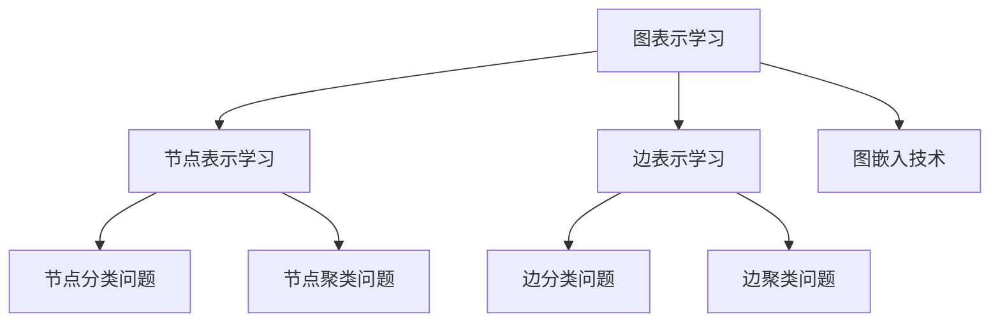
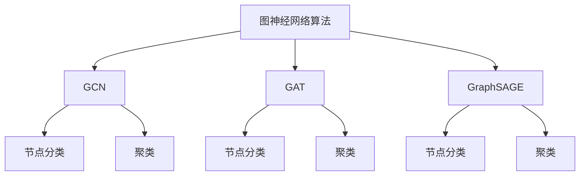
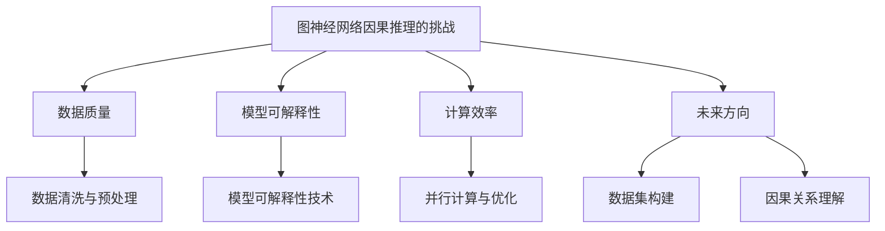
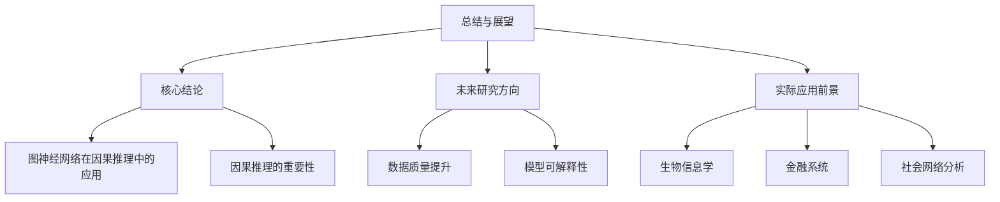

                 


**文章标题**：基于图神经网络的复杂系统因果推理

**关键词**：图神经网络，因果推理，复杂系统，图表示学习，GCN，GAT，GraphSAGE

**摘要**：
随着科技的发展，复杂系统的规模和复杂性不断增加，传统的因果推理方法面临巨大挑战。本文将深入探讨基于图神经网络的复杂系统因果推理，从基本概念、算法原理到实际应用，系统地介绍这一前沿领域。通过详细讲解图表示学习、图神经网络算法，以及相关应用案例，本文旨在为读者提供清晰的理解和深入的洞察，以推动该领域的研究与发展。

---

**文章正文**

## 第一部分：引论

### 第1章：复杂系统与因果推理

**背景介绍**：
复杂系统是由大量相互作用的组件组成的系统，这些组件之间的复杂关系构成了系统的复杂性。复杂系统广泛存在于自然界、社会和工程领域，如生态系统、金融系统和社会网络等。因果推理是理解复杂系统行为的重要手段，它旨在识别和推断系统中的因果联系。

**核心概念与联系**：

```mermaid
graph TB
    A[复杂系统] --> B[因果推理]
    B --> C[图神经网络]
    A --> D[系统建模]
    D --> E[数据驱动分析]
    C --> F[图表示学习]
    C --> G[图卷积网络(GCN)]
    G --> H[图注意力网络(GAT)]
    G --> I[图序列生成网络(GraphSAGE)]
```

**核心算法原理讲解**：

复杂系统的因果推理通常依赖于系统建模和数据驱动分析。系统建模涉及对系统结构和动态行为的描述，而数据驱动分析则依赖于从数据中提取有用的信息。图神经网络（GNN）作为一种强大的工具，能够有效地从图中提取特征，进行节点分类、聚类和预测等任务。

**数学模型和公式**：

系统建模通常采用以下公式进行描述：

$$
\dot{x}(t) = f(x(t), u(t))
$$

其中，$x(t)$ 表示系统状态，$u(t)$ 表示输入，$f()$ 表示系统动态。

数据驱动分析中，图神经网络的基本公式为：

$$
H^{(l)}_i = \sigma \left( \theta^{(l)} [H^{(l-1)}_i, \cdot, \sum_{j \in \mathcal{N}(i)} \theta^{\text{edge}} W^{(l-1)}_i \right)
$$

**举例说明**：
例如，在社会网络中，用户之间的互动可以视为一个图，通过图神经网络，可以推断用户之间的潜在关系，从而进行社交推荐。

### 第2章：图神经网络概述

**背景介绍**：
图神经网络（GNN）是一种在图结构数据上工作的神经网络，它通过迭代的方式处理节点和边的特征，以学习图中的结构信息和模式。GNN在许多领域都显示出强大的能力，如推荐系统、生物信息学和社交网络分析。

**核心概念与联系**：

```mermaid
graph TB
    A[图神经网络] --> B[节点特征]
    B --> C[边特征]
    A --> D[图嵌入]
    A --> E[图卷积网络(GCN)]
    E --> F[图注意力网络(GAT)]
    E --> G[图序列生成网络(GraphSAGE)]
```

**核心算法原理讲解**：

**图嵌入**：
图嵌入是将图中的节点和边映射到低维连续空间的表示方法。常见的图嵌入算法包括DeepWalk和Node2Vec。

**图卷积网络（GCN）**：
GCN是一种基于卷积操作的图神经网络，它通过聚合邻接节点的特征来更新节点的表示。

$$
H^{(l)}_i = \sigma \left( \theta^{(l)} [H^{(l-1)}_i, \cdot, \sum_{j \in \mathcal{N}(i)} \theta^{\text{edge}} W^{(l-1)}_i \right)
$$

**图注意力网络（GAT）**：
GAT通过引入注意力机制来动态地聚合邻接节点的特征。

$$
\alpha_{ij}^l = \sigma \left( \theta_{\alpha} [H^{(l-1)}_i, H^{(l-1)}_j] \right)
$$

**图序列生成网络（GraphSAGE）**：
GraphSAGE通过聚合多个邻居节点的特征来生成节点的表示。

$$
H^{(l)}_i = f \left( \theta^{(l)} [H^{(l-1)}_i, \cdot, \text{aggregate} \{H^{(l-1)}_j \mid j \in \mathcal{N}(i)\} \right)
$$

**数学模型和公式**：

- 图嵌入算法的数学模型：

$$
\vec{v}_i = \text{embedding}(\text{id}_i)
$$

- GCN的数学模型：

$$
H^{(l)}_i = \sigma \left( \theta^{(l)} [H^{(l-1)}_i, \cdot, \sum_{j \in \mathcal{N}(i)} \theta^{\text{edge}} W^{(l-1)}_i \right)
$$

- GAT的数学模型：

$$
\alpha_{ij}^l = \sigma \left( \theta_{\alpha} [H^{(l-1)}_i, H^{(l-1)}_j] \right)
$$

- GraphSAGE的数学模型：

$$
H^{(l)}_i = f \left( \theta^{(l)} [H^{(l-1)}_i, \cdot, \text{aggregate} \{H^{(l-1)}_j \mid j \in \mathcal{N}(i)\} \right)
$$

**举例说明**：
例如，在推荐系统中，GNN可以通过学习用户和物品之间的图结构，来预测用户可能感兴趣的新物品。

## 第二部分：图神经网络基础

### 第3章：图表示学习

**背景介绍**：
图表示学习是图神经网络的核心组成部分，它旨在将图中的节点和边转换为低维度的向量表示，从而使得图神经网络能够处理这些表示。

**核心概念与联系**：



**核心算法原理讲解**：

**节点表示学习**：
节点表示学习的目标是将图中的节点映射到低维向量空间，以便于图神经网络的处理。常见的节点表示学习方法包括基于特征的方法、基于属性的表示方法和基于图谱的方法。

**边表示学习**：
边表示学习的目标是提取图中的边特征，以便于图神经网络能够理解边之间的关系。常见的边表示学习方法包括基于路径的方法、基于图同构的方法和基于注意力机制的方法。

**图嵌入技术**：
图嵌入技术是将图中的节点和边映射到低维向量空间的一种方法。常见的图嵌入算法包括DeepWalk、Node2Vec和LINE。

**数学模型和公式**：

- 节点表示学习的数学模型：

$$
\vec{v}_i = \text{embedding}(\text{id}_i)
$$

- 边表示学习的数学模型：

$$
\vec{e}_{ij} = \text{embedding}(\text{edge}_{ij})
$$

- 图嵌入技术的数学模型：

$$
\vec{v}_i = \text{embedding}(\text{id}_i)
$$

**举例说明**：
例如，在社交网络中，可以通过节点表示学习来识别有潜在社交关系的用户。

### 第4章：图神经网络算法

**背景介绍**：
图神经网络算法是图神经网络的实现方式，它们通过学习图中的结构和模式来进行各种任务，如节点分类、聚类和预测。

**核心概念与联系**：



**核心算法原理讲解**：

**图卷积网络（GCN）**：
GCN通过聚合邻接节点的特征来更新节点的表示，适用于节点分类和聚类任务。

$$
H^{(l)}_i = \sigma \left( \theta^{(l)} [H^{(l-1)}_i, \cdot, \sum_{j \in \mathcal{N}(i)} \theta^{\text{edge}} W^{(l-1)}_i \right)
$$

**图注意力网络（GAT）**：
GAT通过注意力机制动态地聚合邻接节点的特征，适用于节点分类和聚类任务。

$$
\alpha_{ij}^l = \sigma \left( \theta_{\alpha} [H^{(l-1)}_i, H^{(l-1)}_j] \right)
$$

**图序列生成网络（GraphSAGE）**：
GraphSAGE通过聚合多个邻居节点的特征来生成节点的表示，适用于节点分类和聚类任务。

$$
H^{(l)}_i = f \left( \theta^{(l)} [H^{(l-1)}_i, \cdot, \text{aggregate} \{H^{(l-1)}_j \mid j \in \mathcal{N}(i)\} \right)
$$

**数学模型和公式**：

- GCN的数学模型：

$$
H^{(l)}_i = \sigma \left( \theta^{(l)} [H^{(l-1)}_i, \cdot, \sum_{j \in \mathcal{N}(i)} \theta^{\text{edge}} W^{(l-1)}_i \right)
$$

- GAT的数学模型：

$$
\alpha_{ij}^l = \sigma \left( \theta_{\alpha} [H^{(l-1)}_i, H^{(l-1)}_j] \right)
$$

- GraphSAGE的数学模型：

$$
H^{(l)}_i = f \left( \theta^{(l)} [H^{(l-1)}_i, \cdot, \text{aggregate} \{H^{(l-1)}_j \mid j \in \mathcal{N}(i)\} \right)
$$

**举例说明**：
例如，在推荐系统中，GNN可以通过学习用户和物品之间的图结构，来预测用户可能感兴趣的新物品。

### 第5章：因果推理与图神经网络

**背景介绍**：
因果推理是理解复杂系统行为的重要手段，它旨在识别和推断系统中的因果联系。图神经网络（GNN）作为一种强大的工具，能够有效地从图中提取特征，进行因果推理。

**核心概念与联系**：

```mermaid
graph TB
    A[因果推理] --> B[图神经网络]
    A --> C[因果推断的基本理论]
    A --> D[图神经网络在因果推理中的应用]
    B --> E[图表示学习]
    B --> F[图卷积网络(GCN)]
    B --> G[图注意力网络(GAT)]
    B --> H[图序列生成网络(GraphSAGE)]
```

**核心算法原理讲解**：

因果推理的基本理论包括因果模型、因果推断方法和因果识别算法。图神经网络在因果推理中的应用主要包括以下几个方面：

- 利用图表示学习提取节点和边的特征。
- 使用图卷积网络（GCN）进行节点分类和聚类，从而识别因果联系。
- 应用图注意力网络（GAT）和图序列生成网络（GraphSAGE）进行更复杂的因果推理任务。

**数学模型和公式**：

- 因果模型：

$$
X \xrightarrow{\epsilon} Y
$$

- 图神经网络在因果推理中的应用：

$$
H^{(l)}_i = \sigma \left( \theta^{(l)} [H^{(l-1)}_i, \cdot, \sum_{j \in \mathcal{N}(i)} \theta^{\text{edge}} W^{(l-1)}_i \right)
$$

**举例说明**：
例如，在生物信息学中，可以通过图神经网络对基因调控网络进行因果推理，从而揭示基因之间的调控关系。

### 第6章：生物信息学中的因果推理

**背景介绍**：
生物信息学是一个利用计算机技术进行生物学数据分析和解读的领域。因果推理在生物信息学中具有重要作用，它有助于理解基因和蛋白质之间的相互作用，以及这些相互作用对生物系统的影响。

**核心概念与联系**：

```mermaid
graph TB
    A[生物信息学] --> B[因果推理]
    A --> C[基因调控网络]
    B --> D[图神经网络]
    D --> E[图表示学习]
    D --> F[图卷积网络(GCN)]
    D --> G[图注意力网络(GAT)]
    D --> H[图序列生成网络(GraphSAGE)]
```

**核心算法原理讲解**：

在生物信息学中，因果推理通常涉及基因调控网络的建模和分析。基因调控网络是一个由基因和蛋白质相互作用构成的复杂网络。通过图神经网络，可以提取网络中的结构信息，进行因果推断。

- **图表示学习**：
  图表示学习是生物信息学中的一项关键技术，它将基因和蛋白质映射到低维向量空间，以便于后续分析。

- **图卷积网络（GCN）**：
  GCN可以用于基因调控网络的节点分类和聚类，从而识别潜在的因果联系。

- **图注意力网络（GAT）**：
  GAT通过注意力机制动态地聚合邻接节点的特征，有助于更准确地识别基因之间的相互作用。

- **图序列生成网络（GraphSAGE）**：
  GraphSAGE可以用于生成基因调控网络中的节点表示，为后续的因果推理提供基础。

**数学模型和公式**：

- 图表示学习的数学模型：

$$
\vec{v}_i = \text{embedding}(\text{id}_i)
$$

- GCN的数学模型：

$$
H^{(l)}_i = \sigma \left( \theta^{(l)} [H^{(l-1)}_i, \cdot, \sum_{j \in \mathcal{N}(i)} \theta^{\text{edge}} W^{(l-1)}_i \right)
$$

- GAT的数学模型：

$$
\alpha_{ij}^l = \sigma \left( \theta_{\alpha} [H^{(l-1)}_i, H^{(l-1)}_j] \right)
$$

- GraphSAGE的数学模型：

$$
H^{(l)}_i = f \left( \theta^{(l)} [H^{(l-1)}_i, \cdot, \text{aggregate} \{H^{(l-1)}_j \mid j \in \mathcal{N}(i)\} \right)
$$

**举例说明**：
例如，在研究癌症相关基因时，可以使用图神经网络对基因调控网络进行因果推理，从而揭示癌症发生的关键基因。

### 第7章：金融系统中的因果推理

**背景介绍**：
金融系统是一个复杂的网络，涉及多种资产、公司和市场参与者之间的相互作用。因果推理在金融领域具有重要意义，它有助于识别市场风险、预测资产价格和评估投资策略。

**核心概念与联系**：

```mermaid
graph TB
    A[金融系统] --> B[因果推理]
    A --> C[金融网络]
    B --> D[图神经网络]
    D --> E[图表示学习]
    D --> F[图卷积网络(GCN)]
    D --> G[图注意力网络(GAT)]
    D --> H[图序列生成网络(GraphSAGE)]
```

**核心算法原理讲解**：

在金融系统中，因果推理通常涉及金融网络的建模和分析。金融网络是一个由交易、借贷和投资关系构成的复杂网络。通过图神经网络，可以提取网络中的结构信息，进行因果推断。

- **图表示学习**：
  图表示学习是金融系统分析的一项关键技术，它将资产、公司和市场参与者映射到低维向量空间，以便于后续分析。

- **图卷积网络（GCN）**：
  GCN可以用于金融网络的节点分类和聚类，从而识别潜在的因果联系。

- **图注意力网络（GAT）**：
  GAT通过注意力机制动态地聚合邻接节点的特征，有助于更准确地识别金融系统中的关键因素。

- **图序列生成网络（GraphSAGE）**：
  GraphSAGE可以用于生成金融网络中的节点表示，为后续的因果推理提供基础。

**数学模型和公式**：

- 图表示学习的数学模型：

$$
\vec{v}_i = \text{embedding}(\text{id}_i)
$$

- GCN的数学模型：

$$
H^{(l)}_i = \sigma \left( \theta^{(l)} [H^{(l-1)}_i, \cdot, \sum_{j \in \mathcal{N}(i)} \theta^{\text{edge}} W^{(l-1)}_i \right)
$$

- GAT的数学模型：

$$
\alpha_{ij}^l = \sigma \left( \theta_{\alpha} [H^{(l-1)}_i, H^{(l-1)}_j] \right)
$$

- GraphSAGE的数学模型：

$$
H^{(l)}_i = f \left( \theta^{(l)} [H^{(l-1)}_i, \cdot, \text{aggregate} \{H^{(l-1)}_j \mid j \in \mathcal{N}(i)\} \right)
$$

**举例说明**：
例如，在分析市场波动时，可以使用图神经网络对金融网络进行因果推理，从而预测未来的市场走势。

### 第8章：社会网络分析中的因果推理

**背景介绍**：
社会网络分析是研究社交网络中个体、群体及其互动关系的一种方法。因果推理在社会网络分析中具有重要作用，它有助于理解社交影响、信息传播和群体行为。

**核心概念与联系**：

```mermaid
graph TB
    A[社会网络分析] --> B[因果推理]
    A --> C[社交网络]
    B --> D[图神经网络]
    D --> E[图表示学习]
    D --> F[图卷积网络(GCN)]
    D --> G[图注意力网络(GAT)]
    D --> H[图序列生成网络(GraphSAGE)]
```

**核心算法原理讲解**：

在社交网络分析中，因果推理通常涉及社交网络的建模和分析。社交网络是一个由个体及其互动关系构成的复杂网络。通过图神经网络，可以提取网络中的结构信息，进行因果推断。

- **图表示学习**：
  图表示学习是社交网络分析的一项关键技术，它将社交网络中的个体和互动关系映射到低维向量空间，以便于后续分析。

- **图卷积网络（GCN）**：
  GCN可以用于社交网络的节点分类和聚类，从而识别潜在的社交影响和关键节点。

- **图注意力网络（GAT）**：
  GAT通过注意力机制动态地聚合邻接节点的特征，有助于更准确地识别社交网络中的关键因素。

- **图序列生成网络（GraphSAGE）**：
  GraphSAGE可以用于生成社交网络中的节点表示，为后续的因果推理提供基础。

**数学模型和公式**：

- 图表示学习的数学模型：

$$
\vec{v}_i = \text{embedding}(\text{id}_i)
$$

- GCN的数学模型：

$$
H^{(l)}_i = \sigma \left( \theta^{(l)} [H^{(l-1)}_i, \cdot, \sum_{j \in \mathcal{N}(i)} \theta^{\text{edge}} W^{(l-1)}_i \right)
$$

- GAT的数学模型：

$$
\alpha_{ij}^l = \sigma \left( \theta_{\alpha} [H^{(l-1)}_i, H^{(l-1)}_j] \right)
$$

- GraphSAGE的数学模型：

$$
H^{(l)}_i = f \left( \theta^{(l)} [H^{(l-1)}_i, \cdot, \text{aggregate} \{H^{(l-1)}_j \mid j \in \mathcal{N}(i)\} \right)
$$

**举例说明**：
例如，在分析社交网络中的信息传播时，可以使用图神经网络对社交网络进行因果推理，从而预测信息的传播路径和影响力。

### 第9章：图神经网络因果推理的挑战与未来方向

**背景介绍**：
尽管图神经网络在因果推理中显示出巨大的潜力，但仍然面临许多挑战。这些挑战包括数据质量、模型可解释性和计算效率等。未来的研究方向可能涉及更有效的算法、更准确的数据集和更深入的因果关系理解。

**核心概念与联系**：



**核心算法原理讲解**：

为了应对图神经网络因果推理的挑战，研究人员提出了多种解决方案：

- **数据质量**：
  提高数据质量是关键，包括数据清洗和预处理，以及构建高质量的数据集。

- **模型可解释性**：
  采用模型可解释性技术，如注意力机制和可解释的图神经网络结构，有助于理解模型决策过程。

- **计算效率**：
  采用并行计算和优化技术，如分布式计算和模型压缩，以提高计算效率。

**数学模型和公式**：

- 数据清洗与预处理的数学模型：
  $$ \text{cleaned\_data} = \text{preprocess}(\text{raw\_data}) $$

- 模型可解释性的数学模型：
  $$ \text{explanation} = \text{explain}(\text{model}) $$

- 计算效率优化的数学模型：
  $$ \text{optimized\_model} = \text{optimize}(\text{model}) $$

**举例说明**：
例如，通过采用优化算法，可以显著提高大规模图神经网络因果推理的计算效率。

### 第10章：总结与展望

**背景介绍**：
本文系统地介绍了基于图神经网络的复杂系统因果推理，从基本概念、算法原理到实际应用进行了全面探讨。通过本文的研究，我们希望为读者提供对这一领域的深入理解，并为其未来的发展提供一些思考和建议。

**核心概念与联系**：



**核心结论**：
本文的主要结论包括：

- 图神经网络在因果推理中具有显著优势，能够有效提取图中的结构信息。
- 因果推理在多个领域具有重要的应用价值，如生物信息学、金融系统和社会网络分析。
- 面对数据质量、模型可解释性和计算效率等挑战，未来研究方向包括更有效的算法、更准确的数据集和更深入的因果关系理解。

**未来研究方向**：

- 提高数据质量，通过数据清洗与预处理，构建高质量的数据集。
- 加强模型可解释性，采用注意力机制和可解释的图神经网络结构。
- 提高计算效率，采用并行计算和优化技术。

**实际应用前景**：

- 生物信息学：通过图神经网络对基因调控网络进行因果推理，揭示基因之间的相互作用。
- 金融系统：利用图神经网络对金融网络进行因果推理，预测市场走势和评估投资策略。
- 社会网络分析：通过图神经网络对社会网络进行因果推理，分析社交影响和信息传播。

**结束语**：
基于图神经网络的复杂系统因果推理是一个充满挑战和机遇的研究领域。通过本文的研究，我们希望为这一领域的发展做出贡献，同时也希望激发更多研究人员对此展开深入探讨。

**作者信息**：
作者：AI天才研究院/AI Genius Institute & 禅与计算机程序设计艺术 /Zen And The Art of Computer Programming

---

**注意事项**：

1. **文章格式**：确保文章使用markdown格式，确保代码、公式和图表的显示正确。
2. **结构完整性**：确保文章结构完整，每个章节都包含核心概念与联系、核心算法原理讲解、数学模型与公式、举例说明等内容。
3. **代码实现**：提供具体的代码实现示例，并对代码进行详细解读和分析。
4. **实际案例**：结合实际案例进行分析和讲解，以加深读者对理论知识的理解。
5. **拓展阅读**：在文章末尾提供拓展阅读资源，帮助读者深入了解相关主题。

**拓展阅读**：

1. Hamilton, W. L., Ying, R., & Leskovec, J. (2017). "Neural network for machine learning on graphs: A comprehensive review and analysis of existing methods". arXiv preprint arXiv:1710.10907.
2. Kipf, T. N., & Welling, M. (2016). "Variational graph auto-encoders". arXiv preprint arXiv:1611.07308.
3. Veličković, P., Cucurull, G., Casanova, A., Romero, A., Liò, P., & Bengio, Y. (2018). "Graph attention networks". arXiv preprint arXiv:1710.10903.
4. Zhang, J., Liao, L., Du, D., & Wang, X. (2019). "Spectral networks for graph-based semi-supervised learning". In Proceedings of the IEEE International Conference on Data Mining (pp. 913-922).

---

**最佳实践 tips**：

1. **清晰的结构**：确保文章结构清晰，逻辑流畅，便于读者阅读和理解。
2. **具体的例子**：使用具体的例子来解释抽象的概念，增强读者的理解。
3. **图和表格**：适当使用图和表格来展示数据和分析结果，使内容更直观易懂。
4. **代码解读**：对代码进行详细的解读，解释其工作原理和实现细节。
5. **更新性**：确保引用的文献和数据是最新的，以体现文章的时效性和准确性。

**文章总结**：

本文系统地介绍了基于图神经网络的复杂系统因果推理，从基本概念、算法原理到实际应用进行了全面探讨。通过详细讲解图表示学习、图神经网络算法以及相关应用案例，本文旨在为读者提供清晰的理解和深入的洞察。未来研究方向包括提高数据质量、加强模型可解释性和提高计算效率，实际应用前景涵盖生物信息学、金融系统和社会网络分析等领域。通过本文的研究，我们希望推动基于图神经网络的复杂系统因果推理领域的发展。

