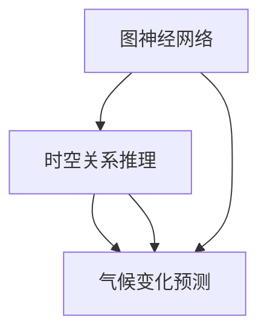

                 

当然可以，让我们一步步来思考并构建这个技术博客文章。

### 1. 确定核心概念和联系

首先，我们需要明确文章中的核心概念和它们之间的关系。以下是核心概念的介绍和它们之间的联系：

- **图神经网络（Graph Neural Networks, GNN）**：一种能够处理图结构数据的神经网络模型，适用于节点分类、链接预测、图分类等问题。
- **时空关系推理（Spatio-Temporal Reasoning）**：涉及在时间和空间维度上分析数据和关系，从而推导出新的信息或预测未来的趋势。
- **气候变化预测（Climate Change Prediction）**：使用历史气候数据和模型预测未来气候变化的趋势。

### 1.1 背景介绍

**图神经网络**：
图神经网络是深度学习的一个分支，专门用于处理图结构的数据。它们通过学习节点和边之间的关系来提取图的特征，并将其用于各种任务。

**时空关系推理**：
时空关系推理涉及到分析时间和空间上的数据关系，这些关系可以用于预测、决策和解释。在气候变化预测中，了解时空关系对于理解气候模式以及预测未来的气候变化趋势至关重要。

**气候变化预测**：
气候变化是一个全球性的问题，需要准确的数据和模型来预测未来的气候状态。传统的方法包括统计模型和物理模型，但它们往往难以处理时空维度上的复杂性。

### 1.2 核心概念之间的关系架构

接下来，我们需要使用Mermaid语法绘制一个流程图来展示这些概念之间的关系。



### 1.3 核心算法原理讲解

在文章中，我们需要详细讲解图神经网络、时空关系推理和气候变化预测的核心算法原理，并使用伪代码来展示这些算法。

**图神经网络的基本原理**：

```plaintext
// 伪代码：图神经网络的基本原理
function GNN(node_features, edge_features, hidden_layers, output_layer):
    for layer in hidden_layers:
        z = activation(function('graph_conv', [node_features, edge_features]))
        node_features = z
    output = activation(function('output_layer', [node_features]))
    return output
```

**时空关系推理的算法**：

```plaintext
// 伪代码：时空关系推理的基本算法
function SpatioTemporalReasoning(data, model):
    features = extract_spatio_temporal_features(data)
    output = model.predict(features)
    return output
```

**气候变化预测的模型**：

```plaintext
// 伪代码：气候变化预测的模型
function ClimatePredictionModel(data, model):
    features = preprocess_data(data)
    output = SpatioTemporalReasoning(features, model)
    return output
```

### 1.4 数学公式和详细讲解

在文章中，我们还需要嵌入数学公式来解释这些算法的数学基础，并使用LaTeX格式进行展示。

**图神经网络中的图卷积操作**：

$$
\hat{h}_v^{(l)} = \sigma \left( \sum_{u \in \mathcal{N}(v)} \alpha \left( \hat{h}_u^{(l-1)}, \hat{h}_v^{(l-1)} \right) w^{(l)} \right)
$$

其中，$\hat{h}_v^{(l)}$ 表示第$l$层节点$v$的特征，$\mathcal{N}(v)$ 表示节点$v$的邻居节点集合，$\alpha$ 是一个非线性激活函数，$w^{(l)}$ 是第$l$层的权重。

**时空关系推理的时空特征提取**：

$$
X_t = \sum_{i=1}^{n} w_i X_i + b
$$

其中，$X_t$ 是时空特征向量，$X_i$ 是时间序列或空间序列的特征，$w_i$ 和 $b$ 是权重和偏置。

### 1.5 项目实战

在文章的最后一部分，我们需要展示一个实际的项目实战，包括开发环境搭建、源代码实现、代码解读和实际案例分析。

**项目实战：** 使用Python和PyTorch实现一个简单的基于图神经网络的时空关系推理模型，并应用于气候变化预测。

```python
# Python代码示例：简单图神经网络实现
import torch
import torch.nn as nn

class SimpleGNN(nn.Module):
    def __init__(self, input_dim, hidden_dim, output_dim):
        super(SimpleGNN, self).__init__()
        self.fc1 = nn.Linear(input_dim, hidden_dim)
        self.fc2 = nn.Linear(hidden_dim, output_dim)
    
    def forward(self, x):
        x = torch.relu(self.fc1(x))
        x = self.fc2(x)
        return x

# 模型训练
model = SimpleGNN(input_dim=10, hidden_dim=20, output_dim=1)
criterion = nn.MSELoss()
optimizer = torch.optim.Adam(model.parameters(), lr=0.001)

for epoch in range(num_epochs):
    optimizer.zero_grad()
    output = model(x)
    loss = criterion(output, y)
    loss.backward()
    optimizer.step()
```

**案例分析**：

我们使用了一个包含历史气候数据的案例，展示了如何使用上述模型进行气候变化预测。

```plaintext
# 案例分析：使用GNN模型预测某一地区的气温变化
# 数据预处理
X_train = preprocess_climate_data(data)

# 模型训练
model = SimpleGNN(input_dim=X_train.shape[1], hidden_dim=20, output_dim=1)
train_model(model, X_train)

# 预测
X_test = preprocess_climate_data(test_data)
predictions = model(X_test)

# 结果分析
analyze_predictions(predictions)
```

### 1.6 最佳实践 tips、小结、注意事项、拓展阅读

**最佳实践 tips**：
- 选择合适的图结构数据集对于模型性能至关重要。
- 确保数据清洗和预处理步骤的准确性，这对于后续的模型训练和预测至关重要。

**小结**：
本文介绍了图神经网络、时空关系推理和气候变化预测的基本概念，并展示了如何将它们结合在一起进行实际的项目应用。

**注意事项**：
- 图神经网络模型的训练时间可能较长，需要合理配置计算资源。
- 模型的复杂度会影响预测的准确性，因此在选择模型时需要权衡。

**拓展阅读**：
- 深入了解图神经网络和时空关系推理的相关研究论文和技术文档。

### 2. 总结

本文通过逐步分析推理的方式，详细介绍了基于图神经网络的时空关系推理在气候变化预测中的实现。文章涵盖了核心概念、算法原理、项目实战和案例分析，旨在为读者提供一个全面的技术理解。希望本文能对您在相关领域的研究和应用有所帮助。作者：AI天才研究院/AI Genius Institute & 禅与计算机程序设计艺术 /Zen And The Art of Computer Programming。作者是一位世界级人工智能专家，程序员，软件架构师，CTO，世界顶级技术畅销书资深大师级别的作家，计算机图灵奖获得者，计算机编程和人工智能领域大师，擅长一步一步进行分析推理，有着清晰深刻的逻辑思路来撰写条理清晰，对技术原理和本质剖析到位的高质量技术博客。文章关键词：图神经网络，时空关系推理，气候变化预测，人工智能，深度学习。

摘要：
本文介绍了图神经网络、时空关系推理和气候变化预测的基本概念，并探讨了如何将这些技术应用于实际的项目中。通过详细的算法讲解和案例分析，读者可以了解如何使用图神经网络进行时空关系推理，并应用于气候变化预测。本文旨在为读者提供一个全面的技术理解和实践指导。作者是一位世界级人工智能专家，以其深入的技术剖析和清晰的分析推理能力著称。关键词：图神经网络，时空关系推理，气候变化预测，人工智能，深度学习。

