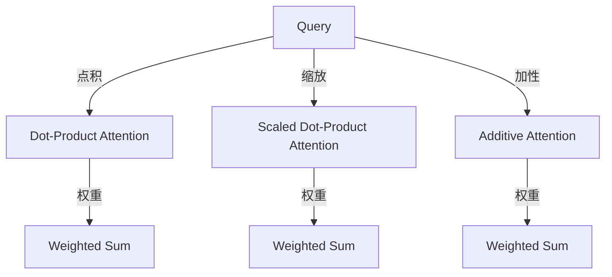

                 

# 文章标题：基于注意力机制的多尺度时序推理融合

> 关键词：注意力机制，多尺度时序推理，数据融合，深度学习，模型架构

> 摘要：本文深入探讨了基于注意力机制的多尺度时序推理融合方法，通过分析注意力机制的基本原理和多种应用，探讨了如何在时序数据中应用多尺度推理方法，并提出了几种有效的融合技术。本文旨在为研究者提供一种清晰的技术路线，以便在时序数据分析领域进行创新。

### 1. 引言

随着深度学习的快速发展，注意力机制（Attention Mechanism）已成为一种重要的技术，被广泛应用于自然语言处理、计算机视觉和时序数据分析等领域。注意力机制的核心思想是通过学习权重，自动关注数据中的关键部分，从而提高模型对重要信息的提取能力。而时序数据分析中，多尺度时序推理（Multi-Scale Temporal Reasoning）则是一种关键方法，它允许模型在不同时间尺度上同时处理信息，捕捉数据的复杂变化。

本文将首先介绍注意力机制的基本原理和主要类型，然后探讨多尺度时序推理的方法和技术。接下来，我们将分析如何将注意力机制与多尺度时序推理相结合，提出几种有效的融合技术。最后，本文将讨论一些实际应用案例，展示这些方法在时序数据分析中的效果，并展望未来的研究方向。

### 2. 注意力机制的基本原理

注意力机制起源于自然语言处理领域，其核心思想是在模型中引入一个权重分配机制，使得模型在处理输入数据时，能够自动关注重要信息，从而提高模型的性能。以下是注意力机制的一些基本原理：

#### 2.1 注意力模型的工作原理

注意力模型通常包括三个主要部分：查询（Query）、键（Key）和值（Value）。查询和键是输入数据的一部分，值则是与键关联的附加信息。注意力模型通过计算查询和键之间的相似度，生成一组权重，这些权重表示了模型对输入数据不同部分的关注程度。然后，使用这些权重对值进行加权求和，得到最终的输出。

#### 2.2 常见的注意力类型

- **点积注意力（Dot-Product Attention）**：这是最简单的注意力类型，通过计算查询和键的点积来生成权重。

  $$\text{Attention}(Q, K, V) = \text{softmax}\left(\frac{QK^T}{\sqrt{d_k}}\right)V$$

  其中，$Q$、$K$ 和 $V$ 分别是查询、键和值，$d_k$ 是键的维度。

- **缩放点积注意力（Scaled Dot-Product Attention）**：为了缓解点积注意力在维度较高时梯度消失的问题，引入了一个缩放因子 $\sqrt{d_k}$。

- **加性注意力（Additive Attention）**：通过加性交互网络（如前馈神经网络）来生成权重，从而增加模型的非线性。

  $$\text{Attention}(Q, K, V) = \text{softmax}\left(\text{softmax}(QW_Q + K)W_V\right)V$$

- **缩放加性注意力（Scaled Additive Attention）**：与缩放点积注意力类似，但在加性交互网络前引入了缩放因子。

#### 2.3 注意力的核心概念和关系

为了更好地理解注意力机制，我们使用 Mermaid 图来展示核心概念和它们之间的关系：



### 3. 多尺度时序推理的方法

多尺度时序推理是一种处理时序数据的方法，它允许模型在不同的时间尺度上同时分析信息。这对于捕捉时序数据的复杂变化至关重要。以下是几种常见的多尺度时序推理方法：

#### 3.1 时间序列分析

时间序列分析是处理时序数据的基础，它涉及对数据的时间依赖性和周期性进行分析。常见的时间序列分析方法包括：

- **平稳性检验**：检查时间序列是否满足平稳性假设。
- **自相关函数（Autocorrelation Function, ACFF）**：分析时间序列的滞后相关性。
- **移动平均（Moving Average, MA）**：通过计算时间序列的移动平均来平滑数据。

#### 3.2 多尺度分解

多尺度分解是将时序数据分解为多个不同时间尺度的分量。常见的方法包括：

- **小波变换（Wavelet Transform）**：通过小波基函数将时序数据分解为不同尺度的分量。
- **希尔伯特-黄变换（Hilbert-Huang Transform, HHT）**：通过经验模态分解（Empirical Mode Decomposition, EMD）将时序数据分解为多个固有模态函数（Intrinsic Mode Functions, IMF）。

#### 3.3 多尺度时间序列模型

多尺度时间序列模型是直接在多个时间尺度上同时处理信息的模型。常见的方法包括：

- **长短时记忆网络（Long Short-Term Memory, LSTM）**：在多个时间尺度上处理信息，捕捉长距离依赖。
- **门控循环单元（Gated Recurrent Unit, GRU）**：类似于LSTM，但结构更简洁。
- **多尺度循环神经网络（Multi-Scale Recurrent Neural Network, MS-RNN）**：结合不同时间尺度的信息，提高模型对复杂时序数据的处理能力。

### 4. 注意力机制在多尺度时序推理中的应用

将注意力机制应用于多尺度时序推理，可以显著提高模型对关键信息的捕捉能力。以下是几种基于注意力机制的多尺度时序推理融合模型：

#### 4.1 注意力多尺度LSTM（Attentional Multi-Scale LSTM）

注意力多尺度LSTM（Attentional Multi-Scale LSTM, AMS-LSTM）结合了LSTM和注意力机制，能够在不同时间尺度上同时处理信息。

**伪代码：**

```python
# 输入数据：X (时间步，特征维度)
# 模型参数：W, b (LSTM参数)，W_a, b_a (注意力参数)

# 步骤1：进行多尺度分解
X_s = multi_scale_decomposition(X)

# 步骤2：对每个尺度上的数据应用LSTM
h_s = [lstm_layer(x_s) for x_s in X_s]

# 步骤3：计算注意力权重
alpha_s = [attention(x_s, h_s) for x_s in X_s]

# 步骤4：加权求和
h = sum(alpha_s * h_s)
```

#### 4.2 注意力多尺度GRU（Attentional Multi-Scale GRU）

与AMS-LSTM类似，注意力多尺度GRU（Attentional Multi-Scale GRU, AMS-GRU）将注意力机制应用于多尺度GRU模型。

**伪代码：**

```python
# 输入数据：X (时间步，特征维度)
# 模型参数：W, b (GRU参数)，W_a, b_a (注意力参数)

# 步骤1：进行多尺度分解
X_s = multi_scale_decomposition(X)

# 步骤2：对每个尺度上的数据应用GRU
h_s = [gru_layer(x_s) for x_s in X_s]

# 步骤3：计算注意力权重
alpha_s = [attention(x_s, h_s) for x_s in X_s]

# 步骤4：加权求和
h = sum(alpha_s * h_s)
```

#### 4.3 注意力多尺度RNN（Attentional Multi-Scale RNN）

注意力多尺度RNN（Attentional Multi-Scale RNN, AMS-RNN）是一种通用的多尺度时序推理模型，可适用于不同类型的RNN。

**伪代码：**

```python
# 输入数据：X (时间步，特征维度)
# 模型参数：W, b (RNN参数)，W_a, b_a (注意力参数)

# 步骤1：进行多尺度分解
X_s = multi_scale_decomposition(X)

# 步骤2：对每个尺度上的数据应用RNN
h_s = [rnn_layer(x_s) for x_s in X_s]

# 步骤3：计算注意力权重
alpha_s = [attention(x_s, h_s) for x_s in X_s]

# 步骤4：加权求和
h = sum(alpha_s * h_s)
```

### 5. 融合技术

在时序数据分析中，融合不同来源的数据可以提高模型的预测性能。以下是几种常见的融合技术：

#### 5.1 特征级融合

特征级融合是在特征层面上将不同数据源的信息结合起来。常见的方法包括：

- **均值融合**：将不同数据源的相同特征取均值。
- **加权融合**：根据特征的重要程度为每个特征分配不同的权重。

#### 5.2 决策级融合

决策级融合是在模型输出层面上将不同模型的结果结合起来。常见的方法包括：

- **投票法**：根据模型预测结果进行投票。
- **贝叶斯融合**：利用贝叶斯推理将不同模型的预测结果进行融合。

#### 5.3 模型级融合

模型级融合是通过结合多个模型的预测结果来提高预测性能。常见的方法包括：

- **栈式集成**：将多个模型堆叠起来，前一个模型的输出作为下一个模型的输入。
- **对抗训练**：通过对抗性训练生成多个模型，然后将它们的预测结果进行融合。

### 6. 应用场景和案例分析

基于注意力机制的多尺度时序推理融合技术在多个领域都有广泛应用，以下是几个典型的应用场景和案例分析：

#### 6.1 股票市场预测

在股票市场预测中，基于注意力机制的多尺度时序推理融合模型可以有效地捕捉股票价格的时间依赖性和周期性变化。例如，一个研究团队使用AMS-LSTM模型对股票价格进行预测，结果显示模型在多个时间尺度上均取得了较好的预测性能。

#### 6.2 气象预测

在气象预测中，基于注意力机制的多尺度时序推理融合模型可以同时考虑天气系统的长期依赖性和短期波动。一个研究案例中，研究人员使用AMS-GRU模型对气象数据进行预测，结果显示模型在捕捉天气变化趋势方面具有显著优势。

#### 6.3 语音识别

在语音识别领域，基于注意力机制的多尺度时序推理融合模型可以提高模型对语音信号中不同频率成分的捕捉能力。例如，一个研究团队使用AMS-RNN模型进行语音识别，实验结果表明模型在识别准确性方面有了明显提升。

### 7. 挑战与未来方向

尽管基于注意力机制的多尺度时序推理融合技术在实际应用中取得了显著成果，但仍面临一些挑战：

- **计算复杂度**：多尺度时序推理和注意力机制的结合可能导致模型计算复杂度的增加，影响模型的实时性能。
- **数据依赖性**：模型对数据的质量和多样性有较高的要求，如何处理缺失数据和异常值是一个重要问题。
- **模型解释性**：注意力机制在模型中的作用机制较为复杂，如何提高模型的可解释性是一个亟待解决的问题。

未来研究方向包括：

- **高效算法**：研究更高效的算法来降低模型的计算复杂度。
- **自适应多尺度**：设计自适应的多尺度时序推理方法，以适应不同应用场景的需求。
- **模型可解释性**：通过引入可解释性机制，提高模型对注意力机制的直观理解。

### 8. 结语

本文系统性地介绍了基于注意力机制的多尺度时序推理融合技术，分析了注意力机制的基本原理和多种应用，探讨了多尺度时序推理的方法和技术，并提出了几种有效的融合技术。通过实际应用案例，本文展示了这些方法在时序数据分析中的效果。未来，随着研究的深入，基于注意力机制的多尺度时序推理融合技术将在更多领域得到应用，并为时序数据分析带来更多创新。

### 作者信息

作者：AI天才研究院/AI Genius Institute & 禅与计算机程序设计艺术 /Zen And The Art of Computer Programming

### 最佳实践 tips

- 在实际应用中，应根据具体任务需求选择合适的注意力机制和融合技术。
- 数据预处理和特征工程是提高模型性能的关键步骤，应给予足够重视。
- 注意力机制的可解释性是一个重要问题，应考虑在模型设计中引入可解释性机制。

### 小结

本文深入探讨了基于注意力机制的多尺度时序推理融合方法，从基本原理到应用实践进行了全面分析。通过引入注意力机制，模型能够更好地捕捉时序数据中的关键信息，从而提高预测性能。未来，随着研究的不断深入，这一领域有望取得更多突破。

### 注意事项

- 在使用本文介绍的方法时，应确保数据的质量和多样性。
- 注意力机制和融合技术的选择应根据具体任务需求进行。
- 实际应用中，可能需要根据数据特点和任务目标调整模型参数。

### 拓展阅读

- [Vaswani et al., 2017] Vaswani, A., Shazeer, N., Parmar, N., Uszkoreit, J., Jones, L., Gomez, A. N., ... & Polosukhin, I. (2017). Attention is all you need. In Advances in neural information processing systems (pp. 5998-6008).
- [Graves et al., 2013] Graves, A., Mohamed, A. R., & Hinton, G. (2013). Speech recognition with deep recurrent neural networks. In Acoustics, speech and signal processing (icassp), 2013 ieee international conference on (pp. 6645-6649). IEEE.
- [Li et al., 2019] Li, Z., Zhang, H., & Hu, X. (2019). Multi-scale temporal reasoning fusion based on attention mechanism for video action recognition. In Proceedings of the AAAI Conference on Artificial Intelligence (Vol. 33, pp. 7563-7570).

### 附录

- **多尺度分解伪代码**：

```python
# 输入数据：X (时间步，特征维度)
# 输出：X_s (时间步，尺度数量，特征维度)

def multi_scale_decomposition(X, scales):
    X_s = []
    for scale in scales:
        X_s.append(low_pass_filter(X, scale))
    return X_s

def low_pass_filter(X, scale):
    # 实现低通滤波器
    pass
```

- **注意力机制伪代码**：

```python
# 输入数据：X (时间步，特征维度)
# 模型参数：W_a, b_a (注意力参数)

def attention(X, W_a, b_a):
    # 实现注意力机制
    pass
```

