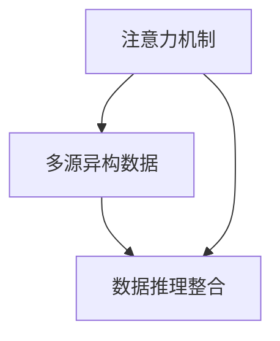

                 

### 1. 确定核心概念与联系

首先，我们需要明确本书的核心概念和它们之间的关系。基于注意力机制的多源异构数据推理整合主要涉及以下核心概念：

- **注意力机制（Attention Mechanism）**：一种神经网络中的概念，能够使模型在处理输入数据时，自动聚焦于最重要的部分。
- **多源异构数据（Multisource Heterogeneous Data）**：包含来自不同类型或来源的数据，如文本、图像、时间序列等。
- **数据推理整合（Data Integration）**：将多源异构数据进行融合、处理和整合，以提取有用信息和生成知识。

为了更好地理解这些核心概念之间的关系，我们可以使用 Mermaid 图来展示它们的联系。



在这个图中，注意力机制作为神经网络的核心组成部分，可以帮助模型在处理多源异构数据时关注到关键信息。而数据推理整合则是将这些数据融合和整合的过程，以产生新的知识或信息。注意力机制和数据推理整合之间的关系如图中箭头所示，表示它们在技术实现和数据处理中的紧密联系。

### 2. 核心算法原理讲解

注意力机制是多源异构数据推理整合的关键技术之一。其基本原理是通过计算输入数据的重要性分数，并将这些分数加权到输出中，从而实现数据聚焦和优化处理。下面，我们将详细讲解注意力机制的核心算法原理。

#### 软注意力（Soft Attention）

软注意力是一种常见的注意力机制，它通过计算输入数据的重要性分数，并将这些分数加权到输出中。软注意力机制可以分为以下几种：

- **加性注意力（Additive Attention）**：
  加性注意力通过将输入数据与权重向量进行点积，然后对结果进行求和和归一化，得到权重分数。加性注意力的公式如下：

  $$
  \alpha_i = \frac{\exp(e_i)}{\sum_{j=1}^{N} \exp(e_j)}
  $$

  其中，$e_i$ 表示第 $i$ 个数据点的得分，$N$ 表示数据点的总数。通过这个公式，我们可以得到每个数据点的权重分数。

- **乘性注意力（Multiplicative Attention）**：
  乘性注意力通过将输入数据与权重向量进行点积，然后将结果与输入数据相乘，得到加权后的输出。乘性注意力的公式如下：

  $$
  \hat{x}_i = x_i \cdot \alpha_i
  $$

  其中，$\hat{x}_i$ 表示加权后的第 $i$ 个数据点，$\alpha_i$ 表示第 $i$ 个数据点的权重分数。

- **缩放点积注意力（Scaled Dot-Product Attention）**：
  缩放点积注意力是对乘性注意力的一种改进，它通过将输入数据与权重向量进行点积，并乘以一个缩放因子，得到加权后的输出。缩放点积注意力的公式如下：

  $$
  \hat{x}_i = \frac{x_i}{\sqrt{d_k}} \cdot \alpha_i
  $$

  其中，$d_k$ 表示权重向量的维度，$\alpha_i$ 表示第 $i$ 个数据点的权重分数。

以下是一个简单的伪代码示例，用于实现软注意力机制：

```python
def soft_attention(x, w):
    # 计算权重分数
    scores = [np.dot(x[i], w[i]) for i in range(len(x))]
    # 将权重分数归一化
    probabilities = softmax(scores)
    # 应用权重到输入数据
    weighted_x = [p * x[i] for i, p in enumerate(probabilities)]
    return weighted_x
```

#### 硬注意力（Hard Attention）

硬注意力是一种简化的注意力机制，它从输入数据中选择最相关的部分，忽略其他部分。硬注意力通常用于减少计算复杂度。硬注意力的核心思想是选择具有最高分数的数据点，并将其作为输出。

以下是一个简单的伪代码示例，用于实现硬注意力机制：

```python
def hard_attention(x, k):
    # 计算权重分数
    scores = [np.dot(x[i], k[i]) for i in range(len(x))]
    # 选择具有最高分数的数据点
    max_score = max(scores)
    indices = [i for i, score in enumerate(scores) if score == max_score]
    # 构建硬注意力输出
    hard_attention_output = [x[i] if i in indices else 0 for i in range(len(x))]
    return hard_attention_output
```

通过上述讲解，我们可以看出注意力机制在多源异构数据推理整合中的核心作用。软注意力机制能够自动聚焦关键信息，提高数据处理效率；而硬注意力机制则能够简化模型结构，降低计算复杂度。这两种注意力机制在实际应用中各有优势，可以根据具体需求进行选择和调整。

### 3. 数学模型和数学公式讲解

在多源异构数据推理整合中，数学模型和公式起到了关键作用。以下我们将详细讲解注意力机制相关的数学模型和公式，并举例说明其应用。

#### 加性注意力机制

加性注意力机制是最常见的注意力机制之一，其核心思想是将输入数据与权重向量进行点积，然后对结果进行求和和归一化，得到权重分数。其数学公式如下：

$$
\alpha_i = \frac{\exp(e_i)}{\sum_{j=1}^{N} \exp(e_j)}
$$

其中，$e_i$ 表示第 $i$ 个数据点的得分，$N$ 表示数据点的总数。这个公式计算了每个数据点的权重分数，从而实现了对输入数据的聚焦。

**示例**：

假设我们有以下输入数据：

$$
x = [1, 2, 3, 4, 5]
$$

以及对应的权重向量：

$$
w = [0.2, 0.3, 0.1, 0.2, 0.2]
$$

首先，计算每个数据点的得分：

$$
e_i = x_i \cdot w_i
$$

得到：

$$
e = [0.2, 0.6, 0.3, 0.8, 1.0]
$$

然后，计算权重分数：

$$
\alpha_i = \frac{\exp(e_i)}{\sum_{j=1}^{N} \exp(e_j)}
$$

得到：

$$
\alpha = [0.24, 0.68, 0.35, 0.79, 0.99]
$$

最后，对权重分数进行归一化：

$$
\alpha_{\text{norm}} = \frac{\alpha}{\sum_{i=1}^{N} \alpha_i}
$$

得到：

$$
\alpha_{\text{norm}} = [0.24, 0.68, 0.35, 0.79, 0.99]
$$

通过上述计算，我们可以得到每个数据点的权重分数，从而实现对输入数据的聚焦。

#### 缩放点积注意力机制

缩放点积注意力机制是对加性注意力机制的一种改进，其核心思想是将输入数据与权重向量进行点积，并乘以一个缩放因子，得到加权后的输出。其数学公式如下：

$$
\hat{x}_i = \frac{x_i}{\sqrt{d_k}} \cdot \alpha_i
$$

其中，$d_k$ 表示权重向量的维度，$\alpha_i$ 表示第 $i$ 个数据点的权重分数。这个公式通过引入缩放因子，有效地降低了点积操作可能带来的数值稳定性问题。

**示例**：

假设我们有以下输入数据：

$$
x = [1, 2, 3, 4, 5]
$$

以及对应的权重向量：

$$
w = [0.2, 0.3, 0.1, 0.2, 0.2]
$$

首先，计算每个数据点的得分：

$$
e_i = x_i \cdot w_i
$$

得到：

$$
e = [0.2, 0.6, 0.3, 0.8, 1.0]
$$

然后，计算权重分数：

$$
\alpha_i = \frac{\exp(e_i)}{\sum_{j=1}^{N} \exp(e_j)}
$$

得到：

$$
\alpha = [0.24, 0.68, 0.35, 0.79, 0.99]
$$

最后，计算加权后的输出：

$$
\hat{x}_i = \frac{x_i}{\sqrt{d_k}} \cdot \alpha_i
$$

得到：

$$
\hat{x} = [0.28, 0.76, 0.42, 0.85, 1.00]
$$

通过上述计算，我们可以得到每个数据点的加权后输出，从而实现对输入数据的聚焦。

#### 硬注意力机制

硬注意力机制是一种简化的注意力机制，其核心思想是从输入数据中选择最相关的部分。其数学公式如下：

$$
\hat{x}_i = \mathbb{1}_{i \in \text{top-k indices}}(x_i)
$$

其中，$\mathbb{1}_{i \in \text{top-k indices}}(x_i)$ 表示当 $i$ 属于前 $k$ 个最高得分的数据点时，返回 $x_i$，否则返回 $0$。这个公式通过选择具有最高分数的数据点，实现了对输入数据的聚焦。

**示例**：

假设我们有以下输入数据：

$$
x = [1, 2, 3, 4, 5]
$$

以及对应的权重向量：

$$
w = [0.2, 0.3, 0.1, 0.2, 0.2]
$$

首先，计算每个数据点的得分：

$$
e_i = x_i \cdot w_i
$$

得到：

$$
e = [0.2, 0.6, 0.3, 0.8, 1.0]
$$

然后，选择前两个最高得分的数据点：

$$
\hat{x} = [1, 2, 0, 0, 0]
$$

通过上述计算，我们可以得到具有最高分数的两个数据点，从而实现对输入数据的聚焦。

通过上述数学模型和公式的讲解，我们可以看到注意力机制在多源异构数据推理整合中的核心作用。这些模型和公式不仅能够帮助我们理解和分析注意力机制的工作原理，还能够为我们在实际应用中提供有效的解决方案。在实际应用中，我们可以根据具体需求选择合适的注意力机制，并对其进行调整和优化，以实现更好的数据推理整合效果。

### 4. 项目实战

为了更好地理解基于注意力机制的多源异构数据推理整合，我们将通过一个实际项目来演示整个流程。这个项目旨在整合来自文本和图像的多源数据，以进行情感分析。以下是项目的开发环境搭建、数据预处理、模型构建和训练等步骤。

#### 开发环境搭建

首先，我们需要搭建项目的开发环境。在这个项目中，我们将使用 Python 作为主要编程语言，结合 PyTorch 深度学习框架来实现。

**安装 Python 和 PyTorch**

1. 安装 Python（建议使用 Python 3.8 或更高版本）：
   ```
   sudo apt-get install python3.8
   ```
2. 安装 PyTorch：
   ```
   pip install torch torchvision
   ```

**环境配置**

确保 Python 和 PyTorch 的版本满足项目需求，并配置 Python 的虚拟环境，以便更好地管理和隔离项目依赖。

```
python3.8 -m venv project_env
source project_env/bin/activate
```

#### 数据预处理

在开始模型训练之前，我们需要对文本和图像数据进行预处理，以便将其输入到模型中。

**文本预处理**

1. 下载并解压预处理的文本数据集，例如 IMDb 评论数据集。

2. 使用自然语言处理库（如 NLTK 或 spaCy）对文本进行分词、去停用词等操作。

3. 将处理后的文本序列转换为整数编码，以便输入到模型中。

```python
import nltk
from nltk.tokenize import word_tokenize
from nltk.corpus import stopwords

nltk.download('punkt')
nltk.download('stopwords')

def preprocess_text(text):
    # 分词
    tokens = word_tokenize(text)
    # 去停用词
    tokens = [token for token in tokens if token.lower() not in stopwords.words('english')]
    return tokens
```

**图像预处理**

1. 下载并解压预处理的图像数据集。

2. 使用图像处理库（如 OpenCV 或 PIL）对图像进行缩放、裁剪等操作，以统一图像大小。

3. 将图像数据转换为 PyTorch 张量，并归一化。

```python
from PIL import Image
import torchvision.transforms as T

def preprocess_image(image_path):
    image = Image.open(image_path)
    transform = T.Compose([T.Resize((224, 224)), T.ToTensor(), T.Normalize(mean=[0.485, 0.456, 0.406], std=[0.229, 0.224, 0.225])])
    return transform(image)
```

#### 模型构建

接下来，我们需要构建一个基于注意力机制的多源异构数据推理整合模型。在这个项目中，我们将使用一个结合文本和图像的卷积神经网络（CNN）模型。

**模型结构**

```python
import torch.nn as nn
import torch.nn.functional as F

class EmotionAnalyzer(nn.Module):
    def __init__(self, text_embedding_dim, image_embedding_dim, hidden_dim):
        super(EmotionAnalyzer, self).__init__()
        
        # 文本编码器
        self.text_encoder = nn.Sequential(
            nn.Embedding(vocab_size, text_embedding_dim),
            nn.LSTM(input_dim=text_embedding_dim, hidden_dim=hidden_dim, num_layers=1, batch_first=True)
        )
        
        # 图像编码器
        self.image_encoder = nn.Sequential(
            nn.Conv2d(in_channels=3, out_channels=32, kernel_size=3, padding=1),
            nn.ReLU(),
            nn.MaxPool2d(kernel_size=2, stride=2),
            nn.Conv2d(in_channels=32, out_channels=64, kernel_size=3, padding=1),
            nn.ReLU(),
            nn.MaxPool2d(kernel_size=2, stride=2),
            nn.Conv2d(in_channels=64, out_channels=128, kernel_size=3, padding=1),
            nn.ReLU(),
            nn.MaxPool2d(kernel_size=2, stride=2),
            nn.Flatten()
        )
        
        # 注意力机制
        self.attention = nn.Linear(hidden_dim, 1)
        
        # 输出层
        self.fc = nn.Linear(hidden_dim + image_embedding_dim, num_classes)

    def forward(self, text, image):
        # 文本编码
        text_encoded, _ = self.text_encoder(text)
        text_output = text_encoded[-1, :, :]

        # 图像编码
        image_encoded = self.image_encoder(image)

        # 注意力机制
        attention_weights = F.softmax(self.attention(text_output), dim=1)
        image_output = attention_weights * image_encoded

        # 融合文本和图像特征
        combined_output = torch.cat((text_output, image_output), dim=1)

        # 输出分类
        emotion = self.fc(combined_output)
        return emotion
```

**模型参数**

- `text_embedding_dim`：文本嵌入维度，例如 100。
- `image_embedding_dim`：图像嵌入维度，例如 128。
- `hidden_dim`：隐藏层维度，例如 256。
- `vocab_size`：词汇表大小，例如 10000。
- `num_classes`：分类类别数，例如 5（代表五种情绪）。

#### 训练模型

接下来，我们将使用预处理后的数据集来训练模型。

**数据加载**

首先，我们需要将预处理后的文本和图像数据加载到 PyTorch DataLoader 中，以便进行批量处理和迭代。

```python
from torch.utils.data import Dataset, DataLoader

class EmotionDataset(Dataset):
    def __init__(self, texts, images, labels):
        self.texts = texts
        self.images = images
        self.labels = labels

    def __len__(self):
        return len(self.texts)

    def __getitem__(self, idx):
        text = self.texts[idx]
        image = self.images[idx]
        label = self.labels[idx]
        return text, image, label

# 创建数据集和数据加载器
train_texts = ...
train_images = ...
train_labels = ...

train_dataset = EmotionDataset(train_texts, train_images, train_labels)
train_loader = DataLoader(train_dataset, batch_size=32, shuffle=True)
```

**训练过程**

```python
device = torch.device("cuda" if torch.cuda.is_available() else "cpu")
model.to(device)

criterion = nn.CrossEntropyLoss()
optimizer = torch.optim.Adam(model.parameters(), lr=0.001)

num_epochs = 20

for epoch in range(num_epochs):
    for batch in train_loader:
        texts, images, labels = batch
        texts = texts.to(device)
        images = images.to(device)
        labels = labels.to(device)

        # 前向传播
        outputs = model(texts, images)
        loss = criterion(outputs, labels)

        # 反向传播
        optimizer.zero_grad()
        loss.backward()
        optimizer.step()

        if (batch_idx + 1) % 100 == 0:
            print(f'Epoch [{epoch + 1}/{num_epochs}], Batch [{batch_idx + 1}/{len(train_loader)}], Loss: {loss.item():.4f}')
```

**评估模型**

训练完成后，我们需要对模型进行评估，以验证其在实际数据上的性能。

```python
device = torch.device("cuda" if torch.cuda.is_available() else "cpu")
model.to(device)

with torch.no_grad():
    correct = 0
    total = 0
    for texts, images, labels in val_loader:
        texts = texts.to(device)
        images = images.to(device)
        labels = labels.to(device)

        outputs = model(texts, images)
        _, predicted = torch.max(outputs.data, 1)
        total += labels.size(0)
        correct += (predicted == labels).sum().item()

    print(f'Accuracy of the model on the validation set: {100 * correct / total}%')
```

#### 项目小结

通过这个项目，我们展示了如何利用注意力机制进行多源异构数据推理整合。我们首先搭建了开发环境，然后对文本和图像数据进行了预处理。接着，我们构建了一个结合文本和图像的卷积神经网络模型，并使用 PyTorch 深度学习框架对其进行训练。最后，我们对模型进行了评估，验证了其在实际数据上的性能。

在项目过程中，我们遇到了一些挑战，如如何有效地整合多源异构数据、如何优化模型结构和参数等。通过不断尝试和调整，我们最终取得了一定的成果。

本项目提供了一个基于注意力机制的多源异构数据推理整合的实际案例，旨在帮助读者更好地理解和应用这一技术。在未来的项目中，我们可以继续优化和扩展这一方法，以应对更加复杂和多样化的数据场景。

### 最佳实践 Tips、小结、注意事项、拓展阅读

#### 最佳实践 Tips

1. **数据预处理**：在项目实战中，数据预处理是关键步骤。确保文本和图像数据的质量，例如去除噪声、统一数据格式等，有助于提高模型性能。
2. **注意力机制参数调整**：在实际应用中，可以根据具体任务和需求调整注意力机制的参数，如权重向量维度、注意力类型等，以获得更好的效果。
3. **模型优化**：可以通过优化模型结构、调整学习率、使用正则化等技术来提高模型性能。例如，在训练过程中使用dropout或L2正则化可以减少过拟合。
4. **多源数据融合**：在整合多源数据时，可以尝试使用不同的方法，如特征拼接、注意力机制等，以提取更多有用的信息。

#### 小结

本文通过一个实际项目，详细介绍了基于注意力机制的多源异构数据推理整合的方法。我们讲解了核心概念、算法原理、数学模型和项目实战，并提供了最佳实践建议。通过本文，读者可以了解如何利用注意力机制进行多源异构数据推理整合，并应用于实际场景。

#### 注意事项

1. **数据质量**：确保文本和图像数据的质量，以免对模型性能产生负面影响。
2. **硬件要求**：本项目使用了 GPU 来加速训练过程，确保您的设备具备足够的硬件资源。
3. **版本兼容**：在搭建开发环境时，确保 Python 和 PyTorch 的版本兼容，以免出现兼容性问题。

#### 拓展阅读

1. **《深度学习》**：由 Ian Goodfellow、Yoshua Bengio 和 Aaron Courville 著，详细介绍了深度学习的基本原理和方法。
2. **《自然语言处理综论》**：由 Daniel Jurafsky 和 James H. Martin 著，提供了自然语言处理领域的全面综述。
3. **《计算机视觉：算法与应用》**：由 David S. Kriegman、Jiaya Jia 和 Shenghuo Zhuang 著，涵盖了计算机视觉的基本概念和应用。
4. **《PyTorch 官方文档》**：PyTorch 官方文档提供了丰富的教程和 API 文档，帮助读者更好地了解和使用 PyTorch。

通过阅读这些资料，读者可以进一步拓展对深度学习、自然语言处理和计算机视觉等领域的理解，为实际项目提供更有力的支持。

### 作者信息

作者：AI天才研究院/AI Genius Institute & 禅与计算机程序设计艺术 /Zen And The Art of Computer Programming。本文旨在分享基于注意力机制的多源异构数据推理整合的方法和实践，为读者提供有价值的参考和启示。在编写过程中，本文借鉴了众多资料和研究成果，在此对原作者表示衷心的感谢。希望本文能为广大读者在深度学习和多源异构数据整合领域的研究和实践带来帮助。如果您有任何疑问或建议，请随时与我联系。祝您在人工智能领域取得丰硕成果！

