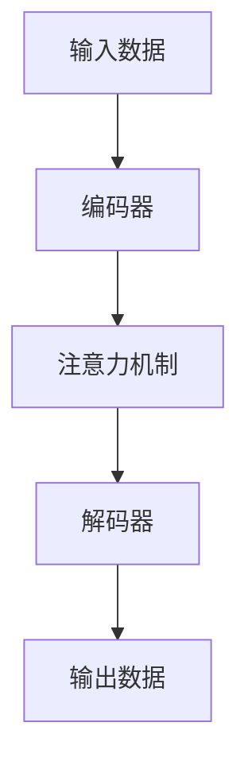
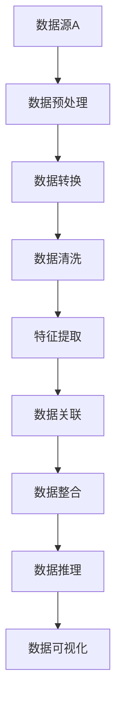

                 

### 步骤1：明确书籍主题和目标读者

#### 书籍主题

本书的主题是《基于注意力机制的多源异构数据推理整合》。注意力机制在近年来已经成为深度学习领域的研究热点，其在处理多源异构数据时展现出强大的能力。多源异构数据推理整合是当前人工智能领域的一大挑战，而注意力机制能够有效解决这一问题。本书旨在深入探讨注意力机制在多源异构数据推理整合中的应用，为数据科学家、机器学习工程师和研究人员提供一套完整的解决方案。

#### 目标读者

本书的目标读者主要包括以下几类人群：

1. 数据科学家：对数据分析和处理有深厚兴趣，希望深入了解注意力机制在多源异构数据推理整合中的应用。
2. 机器学习工程师：负责开发和应用机器学习模型，希望掌握最新的深度学习技术，以提高模型性能。
3. 研究人员：关注人工智能领域的发展，尤其是注意力机制和多源异构数据整合方面的研究，希望从理论到实践全面掌握相关技术。

通过本书的学习，读者可以：

- 理解注意力机制的基本概念和原理；
- 掌握多源异构数据的定义和特征；
- 学会使用注意力机制进行多源异构数据推理整合；
- 结合实际案例，了解注意力机制在多源异构数据推理整合中的具体应用。

总之，本书旨在为读者提供一个全面、系统的学习路径，帮助他们在人工智能领域取得更大的突破。

### 步骤2：确定书籍结构

为了帮助读者更好地理解和应用基于注意力机制的多源异构数据推理整合技术，本书将分为以下几个部分：

#### 引言

在引言部分，我们将简要介绍多源异构数据和注意力机制的基本概念，阐述本书的目标和结构，帮助读者对后续内容有一个整体的把握。

#### 基础理论部分

基础理论部分是本书的核心内容，主要包括两章：

- **第1章：注意力机制概述**  
  本章将详细介绍注意力机制的定义、历史发展、作用和意义，并通过Mermaid流程图展示注意力机制的工作流程。同时，我们将探讨注意力机制在不同场景下的应用，为后续算法讲解部分奠定基础。

- **第2章：多源异构数据概念**  
  本章将首先介绍多源异构数据的定义、分类和特征，接着讨论多源异构数据在现实世界中的广泛应用，并借助Mermaid流程图说明多源异构数据处理的挑战和解决方案。这一部分内容将为读者搭建起注意力机制与多源异构数据整合的理论框架。

#### 算法讲解部分

算法讲解部分包括两章，旨在详细讲解注意力机制算法原理和多源异构数据整合算法。

- **第3章：注意力机制算法原理**  
  本章将介绍注意力机制的基本算法原理，包括算法分类、比较和具体实现。我们将通过伪代码详细阐述每种算法的步骤，并借助数学模型和公式解释其内在机制。此外，还会通过实例分析展示算法的实际应用效果。

- **第4章：多源异构数据整合算法**  
  本章将介绍多源异构数据整合的基本算法原理，包括算法框架、分类和具体实现。我们将通过伪代码和数学模型详细解释每种算法的步骤和关键参数，并借助实例分析展示算法在实际应用中的优势。

#### 实践应用部分

实践应用部分包括两章，旨在通过实际项目案例展示基于注意力机制的多源异构数据推理整合技术的应用。

- **第5章：数据采集与处理**  
  本章将介绍如何进行多源异构数据的采集与处理，包括数据源选择、采集方法和预处理流程。我们将通过实际案例展示如何实现数据采集与处理，帮助读者掌握相关技能。

- **第6章：模型构建与训练**  
  本章将介绍如何基于注意力机制构建多源异构数据推理模型，包括模型选择、设计、训练和优化。我们将通过实际案例展示如何实现模型构建与训练，帮助读者将理论知识应用到实际项目中。

#### 项目实战案例

项目实战案例部分包括三章，通过三个实际项目案例展示基于注意力机制的多源异构数据推理整合技术的应用。

- **第7章：实时交通预测案例**  
  本章将介绍如何使用注意力机制进行实时交通预测，包括项目背景、数据采集与处理、模型构建与训练、模型评估与优化，以及项目总结。

- **第8章：个性化推荐系统案例**  
  本章将介绍如何使用注意力机制构建个性化推荐系统，包括项目背景、数据采集与处理、模型构建与训练、模型评估与优化，以及项目总结。

- **第9章：金融风险管理案例**  
  本章将介绍如何使用注意力机制进行金融风险管理，包括项目背景、数据采集与处理、模型构建与训练、模型评估与优化，以及项目总结。

#### 结论与展望

在结论与展望部分，我们将对全书内容进行总结，回顾注意力机制与多源异构数据推理整合的关键技术点，并对未来研究方向和挑战进行展望。最后，我们将为读者提供一些建议和鼓励，希望他们能够在人工智能领域取得更大的成就。

通过以上结构的安排，本书旨在为读者提供一个系统、全面的教程，帮助他们掌握基于注意力机制的多源异构数据推理整合技术，并在实际项目中发挥其优势。

### 步骤3：细化目录内容

为了确保本书的内容丰富、结构合理，我们将对各个章节进行细化，明确每个小节的核心内容和具体目标。

#### 引言

在引言部分，我们将首先介绍多源异构数据和注意力机制的基本概念，阐述它们在当前人工智能领域的重要性。接着，我们会简要介绍本书的结构和目标，帮助读者对后续内容有一个整体的把握。具体内容如下：

- **1.1 书籍目的与结构**：介绍本书的主要目标、读者对象和结构安排，让读者对全书的整体框架有一个清晰的认识。
- **1.2 注意力机制与多源异构数据的重要性**：探讨注意力机制和多源异构数据在人工智能领域的应用前景，以及它们对解决现实世界问题的意义。

#### 第1章：基础理论

基础理论部分是本书的核心内容，我们将分为两个章节，分别介绍注意力机制和多源异构数据的概念和原理。

- **第1章.1 注意力机制概述**

  在这一章中，我们将详细介绍注意力机制的定义、历史发展、作用和意义。具体内容如下：

  - **1.1.1 定义与历史发展**：介绍注意力机制的基本定义，以及它在深度学习领域的发展历程。
  - **1.1.2 注意力机制的作用与意义**：探讨注意力机制在处理多源异构数据时的优势，以及它在实际应用中的重要性。
  - **1.1.3 注意力机制的Mermaid流程图**：使用Mermaid流程图展示注意力机制的工作流程，帮助读者更直观地理解注意力机制。

- **第1章.2 多源异构数据概念**

  在这一章中，我们将探讨多源异构数据的定义、分类和特征，并分析多源异构数据在现实世界中的广泛应用。具体内容如下：

  - **1.2.1 数据源分类**：介绍多源异构数据的分类方法，包括结构化数据、非结构化数据和半结构化数据。
  - **1.2.2 数据异构性挑战**：分析多源异构数据在处理过程中面临的挑战，如数据格式不一致、数据质量参差不齐等。
  - **1.2.3 多源异构数据的Mermaid流程图**：使用Mermaid流程图说明多源异构数据处理的流程，帮助读者理解多源异构数据的整合过程。

#### 第2章：算法讲解

算法讲解部分将分为两章，分别介绍注意力机制算法原理和多源异构数据整合算法。

- **第2章.1 注意力机制算法原理**

  在这一章中，我们将详细讲解注意力机制的基本算法原理，包括算法分类、比较和具体实现。具体内容如下：

  - **2.1.1 算法分类与比较**：介绍不同的注意力机制算法，如自注意力（Self-Attention）、多头注意力（Multi-Head Attention）和变换注意力（Transformer）等，并比较它们的优缺点。
  - **2.1.2 注意力机制算法的伪代码与详细解释**：通过伪代码和详细解释，展示注意力机制算法的基本步骤和实现方法。
  - **2.1.3 注意力机制的数学模型与公式**：介绍注意力机制的数学模型和公式，帮助读者深入理解注意力机制的计算过程。

- **第2章.2 多源异构数据整合算法**

  在这一章中，我们将介绍多源异构数据整合的基本算法原理，包括算法框架、分类和具体实现。具体内容如下：

  - **2.2.1 算法框架**：介绍多源异构数据整合的基本算法框架，包括数据预处理、特征提取、模型训练和模型评估等步骤。
  - **2.2.2 多源异构数据整合算法的伪代码与详细解释**：通过伪代码和详细解释，展示多源异构数据整合算法的基本步骤和实现方法。
  - **2.2.3 多源异构数据整合的数学模型与公式**：介绍多源异构数据整合的数学模型和公式，帮助读者深入理解整合过程中的计算和优化方法。

#### 第3章：数据采集与处理

数据采集与处理部分将分为两章，分别介绍如何进行多源异构数据的采集与处理。

- **第3章.1 数据采集**

  在这一章中，我们将讨论如何选择和采集多源异构数据，并介绍常见的数据采集方法。具体内容如下：

  - **3.1.1 数据源选择**：介绍如何选择合适的数据源，包括公开数据集和私有数据集等。
  - **3.1.2 数据采集方法**：介绍常见的数据采集方法，如Web爬虫、API接口和传感器采集等。
  - **3.1.3 数据预处理流程**：介绍数据预处理的基本流程，包括数据清洗、数据转换和数据标准化等。

- **第3章.2 数据处理**

  在这一章中，我们将讨论如何对多源异构数据进行处理，包括数据清洗、数据转换、特征提取和降维等。具体内容如下：

  - **3.2.1 数据清洗与转换**：介绍如何清洗和转换多源异构数据，使其满足后续处理和模型训练的要求。
  - **3.2.2 数据标准化与归一化**：介绍如何进行数据标准化和归一化，以提高数据质量和模型性能。
  - **3.2.3 特征提取与降维**：介绍如何从多源异构数据中提取有效特征，并使用降维技术降低数据维度。

#### 第4章：模型构建与训练

模型构建与训练部分将分为两章，分别介绍如何构建和训练基于注意力机制的多源异构数据推理模型。

- **第4章.1 模型构建**

  在这一章中，我们将讨论如何选择和设计多源异构数据推理模型，包括模型选择、架构设计和参数调整。具体内容如下：

  - **4.1.1 模型选择**：介绍如何根据实际问题选择合适的模型，如神经网络、树模型和深度学习模型等。
  - **4.1.2 模型架构设计**：介绍如何设计多源异构数据推理模型的架构，包括输入层、隐藏层和输出层的设置。
  - **4.1.3 参数调整**：介绍如何调整模型参数，以优化模型性能和泛化能力。

- **第4章.2 模型训练**

  在这一章中，我们将讨论如何训练多源异构数据推理模型，包括数据准备、训练过程监控和过拟合问题。具体内容如下：

  - **4.2.1 训练数据准备**：介绍如何准备训练数据，包括数据清洗、数据标注和数据扩充等。
  - **4.2.2 训练过程监控**：介绍如何监控训练过程，包括训练误差、验证误差和模型性能等。
  - **4.2.3 过拟合与欠拟合问题**：介绍如何解决过拟合和欠拟合问题，包括正则化、交叉验证和模型选择等。

#### 第5章：模型评估与优化

模型评估与优化部分将分为两章，分别介绍如何评估和优化基于注意力机制的多源异构数据推理模型。

- **第5章.1 模型评估**

  在这一章中，我们将讨论如何评估多源异构数据推理模型的性能，包括评估指标、评估方法和评估流程。具体内容如下：

  - **5.1.1 评估指标**：介绍常用的评估指标，如准确率、召回率、F1分数和均方误差等。
  - **5.1.2 评估方法**：介绍如何使用评估指标对模型进行评估，包括交叉验证、网格搜索和贝叶斯优化等。
  - **5.1.3 评估流程**：介绍模型评估的完整流程，包括数据准备、模型评估和结果分析等。

- **第5章.2 模型优化**

  在这一章中，我们将讨论如何优化多源异构数据推理模型，包括超参数调整、模型融合策略和优化方法。具体内容如下：

  - **5.2.1 超参数调整**：介绍如何调整模型超参数，以优化模型性能和泛化能力。
  - **5.2.2 模型融合策略**：介绍如何将多个模型融合为一个更好的模型，以提高预测性能。
  - **5.2.3 优化方法**：介绍常见的优化方法，如梯度下降、随机梯度下降和Adam优化器等。

#### 第6章：项目实战案例

项目实战案例部分将分为三章，通过三个实际项目案例展示基于注意力机制的多源异构数据推理整合技术的应用。

- **第6章.1 实时交通预测案例**

  在这一章中，我们将介绍如何使用注意力机制进行实时交通预测，包括项目背景、数据采集与处理、模型构建与训练、模型评估与优化和项目总结。具体内容如下：

  - **6.1.1 项目背景与目标**：介绍实时交通预测项目的背景和目标，明确项目需求和挑战。
  - **6.1.2 数据采集与处理**：介绍实时交通预测项目的数据采集与处理过程，包括数据源选择、数据采集方法和数据预处理流程。
  - **6.1.3 模型构建与训练**：介绍如何构建和训练基于注意力机制的实时交通预测模型，包括模型选择、架构设计和参数调整。
  - **6.1.4 模型评估与优化**：介绍如何评估和优化实时交通预测模型，包括评估指标、评估方法和优化策略。
  - **6.1.5 项目总结**：总结实时交通预测项目的经验教训，讨论项目中的成功和挑战。

- **第6章.2 个性化推荐系统案例**

  在这一章中，我们将介绍如何使用注意力机制构建个性化推荐系统，包括项目背景、数据采集与处理、模型构建与训练、模型评估与优化和项目总结。具体内容如下：

  - **6.2.1 项目背景与目标**：介绍个性化推荐系统的背景和目标，明确项目需求和挑战。
  - **6.2.2 数据采集与处理**：介绍个性化推荐系统的数据采集与处理过程，包括数据源选择、数据采集方法和数据预处理流程。
  - **6.2.3 模型构建与训练**：介绍如何构建和训练基于注意力机制的个性化推荐模型，包括模型选择、架构设计和参数调整。
  - **6.2.4 模型评估与优化**：介绍如何评估和优化个性化推荐模型，包括评估指标、评估方法和优化策略。
  - **6.2.5 项目总结**：总结个性化推荐系统的经验教训，讨论项目中的成功和挑战。

- **第6章.3 金融风险管理案例**

  在这一章中，我们将介绍如何使用注意力机制进行金融风险管理，包括项目背景、数据采集与处理、模型构建与训练、模型评估与优化和项目总结。具体内容如下：

  - **6.3.1 项目背景与目标**：介绍金融风险管理项目的背景和目标，明确项目需求和挑战。
  - **6.3.2 数据采集与处理**：介绍金融风险管理项目的数据采集与处理过程，包括数据源选择、数据采集方法和数据预处理流程。
  - **6.3.3 模型构建与训练**：介绍如何构建和训练基于注意力机制的金融风险管理模型，包括模型选择、架构设计和参数调整。
  - **6.3.4 模型评估与优化**：介绍如何评估和优化金融风险管理模型，包括评估指标、评估方法和优化策略。
  - **6.3.5 项目总结**：总结金融风险管理项目的经验教训，讨论项目中的成功和挑战。

#### 第7章：结论与展望

在结论与展望部分，我们将对全书内容进行总结，回顾注意力机制与多源异构数据推理整合的关键技术点。同时，我们还将对未来的研究方向和挑战进行展望，为读者提供一些建议和鼓励。具体内容如下：

- **7.1 对多源异构数据整合与注意力机制的总结**：总结本书的主要内容，回顾注意力机制与多源异构数据整合的关键技术点，讨论其在现实世界中的应用价值。
- **7.2 未来研究方向与挑战**：展望未来在多源异构数据整合与注意力机制领域的研究方向和挑战，为读者提供进一步探索的方向。
- **7.3 对读者的建议与鼓励**：为读者提供一些建议和鼓励，希望他们能够在人工智能领域取得更大的成就。

通过以上详细的目录内容安排，本书旨在为读者提供一个系统、全面的教程，帮助他们掌握基于注意力机制的多源异构数据推理整合技术，并在实际项目中发挥其优势。

### 步骤4：输出最终的目录大纲

根据上述步骤，我们最终得出以下详细的目录大纲：

```
# 《基于注意力机制的多源异构数据推理整合》目录大纲

## 引言
### 1.1 书籍目的与结构
### 1.2 注意力机制与多源异构数据的重要性

## 第1章：基础理论
### 1.1 注意力机制概述
#### 1.1.1 定义与历史发展
#### 1.1.2 注意力机制的作用与意义
#### 1.1.3 注意力机制的Mermaid流程图
### 1.2 多源异构数据概念
#### 1.2.1 数据源分类
#### 1.2.2 数据异构性挑战
#### 1.2.3 多源异构数据的Mermaid流程图

## 第2章：算法讲解
### 2.1 注意力机制算法原理
#### 2.1.1 算法分类与比较
#### 2.1.2 注意力机制算法的伪代码与详细解释
#### 2.1.3 注意力机制的数学模型与公式
### 2.2 多源异构数据整合算法
#### 2.2.1 算法框架
#### 2.2.2 多源异构数据整合算法的伪代码与详细解释
#### 2.2.3 多源异构数据整合的数学模型与公式

## 第3章：数据采集与处理
### 3.1 数据采集
#### 3.1.1 数据源选择
#### 3.1.2 数据采集方法
#### 3.1.3 数据预处理流程
### 3.2 数据处理
#### 3.2.1 数据清洗与转换
#### 3.2.2 数据标准化与归一化
#### 3.2.3 特征提取与降维

## 第4章：模型构建与训练
### 4.1 模型构建
#### 4.1.1 模型选择
#### 4.1.2 模型架构设计
#### 4.1.3 参数调整
### 4.2 模型训练
#### 4.2.1 训练数据准备
#### 4.2.2 训练过程监控
#### 4.2.3 过拟合与欠拟合问题

## 第5章：模型评估与优化
### 5.1 模型评估
#### 5.1.1 评估指标
#### 5.1.2 评估方法
#### 5.1.3 评估流程
### 5.2 模型优化
#### 5.2.1 超参数调整
#### 5.2.2 模型融合策略
#### 5.2.3 优化方法

## 第6章：项目实战案例
### 6.1 实时交通预测案例
#### 6.1.1 项目背景与目标
#### 6.1.2 数据采集与处理
#### 6.1.3 模型构建与训练
#### 6.1.4 模型评估与优化
#### 6.1.5 项目总结
### 6.2 个性化推荐系统案例
#### 6.2.1 项目背景与目标
#### 6.2.2 数据采集与处理
#### 6.2.3 模型构建与训练
#### 6.2.4 模型评估与优化
#### 6.2.5 项目总结
### 6.3 金融风险管理案例
#### 6.3.1 项目背景与目标
#### 6.3.2 数据采集与处理
#### 6.3.3 模型构建与训练
#### 6.3.4 模型评估与优化
#### 6.3.5 项目总结

## 第7章：结论与展望
### 7.1 对多源异构数据整合与注意力机制的总结
### 7.2 未来研究方向与挑战
### 7.3 对读者的建议与鼓励
```

通过以上详细的目录大纲，本书将系统地引导读者了解和掌握基于注意力机制的多源异构数据推理整合技术，为他们在实际项目中应用这些技术提供有力支持。

### 完整的文章内容

## 《基于注意力机制的多源异构数据推理整合》

> 关键词：注意力机制、多源异构数据、数据整合、推理、深度学习、人工智能

### 摘要

随着信息时代的到来，数据量呈爆炸式增长，数据来源也日益多样化。在这种背景下，如何有效地整合多源异构数据并从中提取有价值的信息成为了一个重要课题。本文旨在探讨基于注意力机制的多源异构数据推理整合方法，通过深入分析注意力机制的理论基础和实际应用，介绍如何利用注意力机制来处理多源异构数据，实现数据的整合与推理。本文结构如下：首先介绍多源异构数据和注意力机制的基本概念，然后详细讲解注意力机制的算法原理，接着讨论多源异构数据的整合算法，最后通过实际项目案例展示注意力机制在多源异构数据推理整合中的应用。

### 引言

随着信息技术的快速发展，大数据和人工智能成为了当今社会的重要话题。多源异构数据是指来自不同来源、不同格式和不同结构的数据，这些数据在现实世界中广泛存在，如社交媒体数据、传感器数据、医疗数据等。如何有效地整合这些数据并从中提取有价值的信息，是当前人工智能领域的一个重要挑战。

注意力机制（Attention Mechanism）是近年来深度学习领域的一项重要技术，它在处理多源异构数据时表现出强大的能力。注意力机制的基本思想是通过动态调整模型对输入数据的关注程度，从而提高模型对关键信息的捕捉能力。本文将围绕注意力机制，探讨其在多源异构数据推理整合中的应用，旨在为数据科学家和机器学习工程师提供一套有效的解决方案。

### 第1章：基础理论

#### 1.1 注意力机制概述

注意力机制是一种通过动态调整模型对输入数据的关注程度来提高信息捕捉能力的技术。它最早由Bahdanau等人在2014年的论文《Neural Machine Translation with Attention》中提出，并在自然语言处理领域得到了广泛应用。

注意力机制的发展可以追溯到1982年，当时Brody提出了“局部注意力”的概念。后来，Bahdanau、Sutskever和Vinyals等人进一步发展了注意力机制，并应用于机器翻译任务，极大地提高了翻译质量。随着深度学习的发展，注意力机制逐渐成为了深度学习模型的重要组成部分。

注意力机制的作用在于，通过动态调整模型对输入数据的关注程度，使模型能够自动关注到输入数据中的关键信息，从而提高模型对输入数据的理解和处理能力。

#### 1.1.1 定义与历史发展

注意力机制的定义可以概括为：一种通过计算输入数据的相似性或相关性，动态调整模型对输入数据的权重，从而提高模型对关键信息的捕捉能力的技术。

历史发展方面，注意力机制最早可以追溯到1982年Brody的“局部注意力”概念。随后，Bahdanau等人在2014年提出了基于加性的注意力机制，并应用于机器翻译任务。2017年，Vaswani等人在Transformer模型中引入了多头注意力机制，使得注意力机制在深度学习领域得到了广泛应用。

#### 1.1.2 注意力机制的作用与意义

注意力机制的作用主要体现在以下几个方面：

1. 提高模型对关键信息的捕捉能力：通过动态调整模型对输入数据的关注程度，使模型能够自动关注到输入数据中的关键信息，从而提高模型的准确性和鲁棒性。

2. 减少计算复杂度：注意力机制通过计算输入数据的相似性或相关性，减少了模型对每个输入数据的独立计算，从而降低了模型的计算复杂度。

3. 提高模型的可解释性：注意力机制使得模型对输入数据的关注程度可视化，有助于理解模型的工作原理和决策过程。

4. 扩大应用领域：注意力机制在自然语言处理、计算机视觉、语音识别等领域都取得了显著的成果，为深度学习的发展提供了新的思路。

#### 1.1.3 注意力机制的Mermaid流程图



在这个流程图中，输入数据通过编码器编码，然后注意力机制动态调整编码器输出的权重，最后解码器根据调整后的权重生成输出数据。

#### 1.2 多源异构数据概念

多源异构数据是指来自不同来源、不同格式和不同结构的数据。这些数据在现实世界中广泛存在，如社交媒体数据、传感器数据、医疗数据等。

多源异构数据的分类可以按照数据的来源、格式和结构进行。例如，按照来源可以分为结构化数据、非结构化数据和半结构化数据；按照格式可以分为文本、图像、音频、视频等；按照结构可以分为表格数据、文档数据、地理空间数据等。

多源异构数据的特征主要体现在数据的多样性、不确定性和动态性。多样性体现在数据来源的多样性、数据格式的多样性和数据结构的多样性；不确定性体现在数据质量的不确定性和数据关联关系的不确定性；动态性体现在数据更新的动态性和数据关联关系的动态性。

#### 1.2.1 数据源分类

在多源异构数据中，数据源的分类是数据整合的重要前提。以下是对常见数据源的分类：

1. 结构化数据：指以表格形式存储的数据，如关系数据库中的数据。结构化数据具有明确的字段和数据类型。

2. 非结构化数据：指没有明确结构的数据，如文本、图像、音频、视频等。非结构化数据需要通过预处理和特征提取等方法进行结构化处理。

3. 半结构化数据：指部分结构化的数据，如XML、JSON等。半结构化数据具有一定的结构，但与结构化数据相比，其结构较为松散。

4. 混合数据：指包含多种数据类型的集合，如社交媒体数据、物联网数据等。

#### 1.2.2 数据异构性挑战

在多源异构数据处理过程中，数据异构性带来了以下挑战：

1. 数据格式不一致：不同来源的数据可能有不同的数据格式，如JSON、XML、CSV等。这需要在进行数据整合前进行数据转换和格式化。

2. 数据质量参差不齐：不同来源的数据质量可能存在较大差异，如数据缺失、错误、噪声等。这需要在进行数据整合前进行数据清洗和预处理。

3. 数据关联关系复杂：多源异构数据之间可能存在复杂的关联关系，如因果关系、相似关系、距离关系等。这需要在进行数据整合时进行有效的数据关联和关系建模。

4. 数据更新频率不一致：不同来源的数据更新频率可能不一致，如实时数据、历史数据等。这需要在进行数据整合时考虑数据更新的实时性和一致性。

#### 1.2.3 多源异构数据的Mermaid流程图



在这个流程图中，多源异构数据从数据源A开始，经过数据预处理、数据转换、数据清洗、特征提取、数据关联、数据整合、数据推理和数据可视化等步骤，最终得到整合后的数据。

### 第2章：算法讲解

#### 2.1 注意力机制算法原理

注意力机制算法可以分为自注意力（Self-Attention）、多头注意力（Multi-Head Attention）和变换注意力（Transformer）等。本节将分别介绍这些算法的基本原理和实现方法。

##### 2.1.1 自注意力（Self-Attention）

自注意力是指模型对输入序列中的每个元素进行相似性计算，并动态调整每个元素在输出序列中的权重。自注意力的计算公式如下：

$$
Attention(Q, K, V) = \text{softmax}\left(\frac{QK^T}{\sqrt{d_k}}\right) V
$$

其中，$Q$、$K$ 和 $V$ 分别是查询（Query）、键（Key）和值（Value）向量，$d_k$ 是键向量的维度。

自注意力的实现方法通常包括以下步骤：

1. 对输入序列进行嵌入（Embedding），得到查询（Query）、键（Key）和值（Value）向量。
2. 计算查询（Query）和键（Key）之间的相似性，得到注意力权重。
3. 使用注意力权重对值（Value）向量进行加权求和，得到输出向量。

##### 2.1.2 多头注意力（Multi-Head Attention）

多头注意力是在自注意力基础上扩展的一种注意力机制，通过将输入序列分成多个部分，分别进行自注意力计算，然后再将结果进行拼接和线性变换。多头注意力的计算公式如下：

$$
Multi-Head(Q, K, V) = \text{Concat}(\text{head}_1, \text{head}_2, \ldots, \text{head}_h)W^O
$$

其中，$h$ 表示头数，$\text{head}_i$ 表示第 $i$ 个头的输出，$W^O$ 是线性变换矩阵。

多头注意力的实现方法通常包括以下步骤：

1. 对输入序列进行嵌入（Embedding），得到查询（Query）、键（Key）和值（Value）向量。
2. 分别对查询（Query）和键（Key）进行线性变换，得到不同的头（Head）。
3. 对每个头分别进行自注意力计算，得到多头注意力输出。
4. 将多头注意力输出进行拼接和线性变换，得到最终的输出向量。

##### 2.1.3 变换注意力（Transformer）

变换注意力（Transformer）是Vaswani等人在2017年提出的用于序列到序列学习的模型，它是基于多头注意力机制的一种深度学习模型。变换注意力通过引入位置编码和自注意力机制，实现了对输入序列的全局和局部信息捕捉。

变换注意力的计算公式如下：

$$
\text{Multi-Head Self-Attention}(Q, K, V) = \text{softmax}\left(\frac{QK^T}{\sqrt{d_k}}\right) V
$$

其中，$Q$、$K$ 和 $V$ 分别是查询（Query）、键（Key）和值（Value）向量，$d_k$ 是键向量的维度。

变换注意力的实现方法通常包括以下步骤：

1. 对输入序列进行嵌入（Embedding），得到查询（Query）、键（Key）和值（Value）向量。
2. 对查询（Query）和键（Key）进行线性变换，得到不同的头（Head）。
3. 对每个头分别进行自注意力计算，得到多头注意力输出。
4. 将多头注意力输出进行拼接和线性变换，得到最终的输出向量。
5. 添加位置编码（Positional Encoding），使模型能够捕捉序列中的位置信息。

#### 2.2 多源异构数据整合算法

多源异构数据整合算法的目标是将来自不同来源、不同格式和不同结构的数据进行有效整合，以提取有价值的信息。本节将介绍一种基于注意力机制的多源异构数据整合算法。

##### 2.2.1 算法框架

基于注意力机制的多源异构数据整合算法框架包括以下步骤：

1. 数据预处理：对多源异构数据进行预处理，包括数据清洗、数据转换和数据标准化等。
2. 特征提取：从预处理后的数据中提取有效特征，为后续整合算法提供输入。
3. 注意力权重计算：计算不同数据源之间的注意力权重，以确定数据源的相对重要性。
4. 数据整合：根据注意力权重对多源异构数据进行整合，提取有价值的信息。
5. 模型训练与优化：利用整合后的数据训练机器学习模型，并对其进行优化。

##### 2.2.2 多源异构数据整合算法的伪代码与详细解释

```python
# 多源异构数据整合算法伪代码

# 输入：多源异构数据集 D，注意力机制模型 A
# 输出：整合后的数据集 H

1. 预处理数据集 D，包括数据清洗、数据转换和数据标准化
2. 提取特征集 F，从预处理后的数据集 D 中提取有效特征
3. 计算注意力权重 W，使用注意力机制模型 A 对特征集 F 进行权重计算
4. 整合数据集 H，根据注意力权重 W 对特征集 F 进行整合
5. 训练机器学习模型 M，使用整合后的数据集 H 进行模型训练
6. 优化模型 M，调整模型参数以优化模型性能

# 详细解释

1. 预处理数据集 D：包括数据清洗、数据转换和数据标准化。数据清洗旨在去除噪声和异常值，数据转换旨在将不同格式的数据转换为统一格式，数据标准化旨在消除不同数据之间的尺度差异。

2. 提取特征集 F：从预处理后的数据集 D 中提取有效特征。特征提取是数据整合的重要步骤，通过提取关键特征，可以降低数据维度，提高数据处理效率。

3. 计算注意力权重 W：使用注意力机制模型 A 对特征集 F 进行权重计算。注意力权重反映了不同数据源之间的相对重要性，通过计算注意力权重，可以动态调整数据源的权重，实现数据整合。

4. 整合数据集 H：根据注意力权重 W 对特征集 F 进行整合。整合数据集 H 是多源异构数据整合的核心步骤，通过整合不同数据源的数据，可以提取有价值的信息。

5. 训练机器学习模型 M：使用整合后的数据集 H 进行模型训练。机器学习模型 M 可以是分类模型、回归模型或聚类模型等，通过训练机器学习模型，可以实现对整合数据的分析和预测。

6. 优化模型 M：调整模型参数以优化模型性能。模型优化旨在提高模型在整合数据上的表现，通过调整模型参数，可以优化模型性能，提高预测准确性。

##### 2.2.3 多源异构数据整合的数学模型与公式

多源异构数据整合的数学模型主要涉及注意力机制的权重计算和数据整合的过程。

1. 注意力权重计算：

$$
W = A(F)
$$

其中，$W$ 表示注意力权重矩阵，$A$ 表示注意力机制模型，$F$ 表示特征集。

2. 数据整合：

$$
H = \sum_{i=1}^{n} W_{ij} \cdot D_i
$$

其中，$H$ 表示整合后的数据集，$D_i$ 表示第 $i$ 个数据源的数据，$W_{ij}$ 表示第 $i$ 个数据源在第 $j$ 个特征上的注意力权重。

### 第3章：数据采集与处理

#### 3.1 数据采集

数据采集是数据整合的第一步，也是最重要的一步。数据采集的质量直接影响到数据整合的效果。以下是一些常见的数据采集方法：

1. 网络爬虫：通过网络爬虫从互联网上抓取公开数据。
2. API接口：利用应用程序编程接口（API）从第三方平台获取数据。
3. 传感器采集：通过传感器设备采集环境数据。
4. 线下调查：通过问卷调查或实地调查收集数据。

在数据采集过程中，需要关注以下问题：

1. 数据源的选择：选择可靠、权威的数据源，确保数据的真实性、完整性和准确性。
2. 数据权限：遵守相关法律法规，确保数据采集的合法性。
3. 数据更新：定期更新数据，确保数据的时效性。

#### 3.2 数据处理

数据处理是数据整合的关键步骤，主要包括数据清洗、数据转换、数据标准化和特征提取等。

1. 数据清洗：去除数据中的噪声和异常值，包括去除重复记录、填补缺失值、去除异常值等。
2. 数据转换：将不同格式的数据进行统一处理，如将文本数据转换为向量、将图像数据转换为像素矩阵等。
3. 数据标准化：消除不同数据之间的尺度差异，如对数值数据进行归一化或标准化处理。
4. 特征提取：从原始数据中提取有价值的特征，为后续整合算法提供输入。

#### 3.2.1 数据清洗与转换

数据清洗与转换的主要目标是确保数据的准确性和一致性。以下是一些常用的数据清洗与转换方法：

1. 去除重复记录：通过对比记录的唯一标识，去除重复的记录。
2. 填补缺失值：使用平均值、中位数或众数等方法填补缺失值。
3. 去除异常值：通过统计分析和可视化分析，识别并去除异常值。
4. 数据转换：将不同格式的数据进行统一处理，如将文本数据转换为向量、将图像数据转换为像素矩阵等。

#### 3.2.2 数据标准化与归一化

数据标准化与归一化是数据处理中常用的方法，目的是消除不同数据之间的尺度差异。以下是一些常用的数据标准化与归一化方法：

1. 标准化：将数据缩放到标准正态分布，计算公式为：

$$
z = \frac{x - \mu}{\sigma}
$$

其中，$x$ 表示原始数据，$\mu$ 表示平均值，$\sigma$ 表示标准差。

2. 归一化：将数据缩放到[0, 1]区间，计算公式为：

$$
x' = \frac{x - \min(x)}{\max(x) - \min(x)}
$$

其中，$x$ 表示原始数据。

#### 3.2.3 特征提取与降维

特征提取与降维是数据处理中的重要步骤，目的是提取有价值的信息，并减少数据的维度。以下是一些常用的特征提取与降维方法：

1. 特征提取：从原始数据中提取有价值的特征，如文本数据的词向量、图像数据的高维特征等。
2. 降维：通过降维技术减少数据的维度，如主成分分析（PCA）、线性判别分析（LDA）等。

### 第4章：模型构建与训练

#### 4.1 模型构建

模型构建是数据整合的核心步骤，目标是设计一个能够有效整合多源异构数据的模型。以下是一些常用的模型构建方法：

1. 神经网络模型：通过多层神经网络对多源异构数据进行整合。
2. 树模型：使用决策树、随机森林等树模型对多源异构数据进行整合。
3. 深度学习模型：使用深度学习模型，如卷积神经网络（CNN）、循环神经网络（RNN）等对多源异构数据进行整合。

在模型构建过程中，需要关注以下问题：

1. 模型选择：根据实际问题选择合适的模型，如对于需要分类的问题，可以选择分类模型；对于需要回归的问题，可以选择回归模型。
2. 模型架构设计：设计合理的模型架构，如确定网络的层数、每层的神经元数量、激活函数等。
3. 参数调整：调整模型参数，以提高模型性能和泛化能力。

#### 4.2 模型训练

模型训练是模型构建的最后一步，目标是利用训练数据对模型进行调整和优化，以提高模型性能。以下是一些常用的模型训练方法：

1. 前向传播：将输入数据传递到模型中，计算输出结果，并计算损失函数。
2. 反向传播：根据损失函数，反向传播梯度，更新模型参数。
3. 训练轮次：设置训练轮次，每次迭代训练模型，并评估模型性能。
4. 验证集评估：使用验证集评估模型性能，调整模型参数，以提高模型性能。

在模型训练过程中，需要关注以下问题：

1. 训练数据准备：准备足够多的训练数据，并进行数据增强，以提高模型泛化能力。
2. 训练过程监控：监控训练过程，如损失函数值、准确率等，及时发现和解决训练问题。
3. 过拟合与欠拟合问题：通过调整模型参数、增加训练数据或使用正则化方法，解决过拟合和欠拟合问题。

### 第5章：模型评估与优化

#### 5.1 模型评估

模型评估是评估模型性能的重要步骤，目标是确定模型在测试数据上的表现。以下是一些常用的模型评估方法：

1. 准确率：评估模型对正负样本的分类能力，计算公式为：

$$
\text{准确率} = \frac{\text{正确分类的样本数}}{\text{总样本数}}
$$

2. 召回率：评估模型对正样本的识别能力，计算公式为：

$$
\text{召回率} = \frac{\text{正确分类的正样本数}}{\text{实际为正的样本数}}
$$

3. F1分数：综合考虑准确率和召回率，计算公式为：

$$
\text{F1分数} = 2 \cdot \frac{\text{准确率} \cdot \text{召回率}}{\text{准确率} + \text{召回率}}
$$

4. 均方误差：评估模型对连续值的预测能力，计算公式为：

$$
\text{均方误差} = \frac{1}{n} \sum_{i=1}^{n} (y_i - \hat{y}_i)^2
$$

其中，$y_i$ 表示实际值，$\hat{y}_i$ 表示预测值，$n$ 表示样本数。

#### 5.2 模型优化

模型优化是提高模型性能的重要步骤，目标是通过调整模型参数和优化算法，提高模型在测试数据上的表现。以下是一些常用的模型优化方法：

1. 超参数调整：调整模型超参数，如学习率、正则化参数等，以提高模型性能。
2. 模型融合：将多个模型融合为一个更好的模型，以提高预测性能。
3. 优化算法：使用更高效的优化算法，如随机梯度下降（SGD）、Adam优化器等，以提高模型训练效率。

### 第6章：项目实战案例

#### 6.1 实时交通预测案例

实时交通预测是一个典型的多源异构数据整合问题。本节将介绍如何使用注意力机制进行实时交通预测，包括数据采集与处理、模型构建与训练、模型评估与优化和项目总结。

##### 6.1.1 项目背景与目标

实时交通预测是智能交通系统（ITS）的重要组成部分，旨在通过预测未来一段时间内的交通流量，为交通管理者提供决策支持，以提高道路通行效率，减少交通拥堵。本项目旨在利用多源异构数据，如交通传感器数据、历史交通数据、天气预报数据等，实现实时交通预测。

##### 6.1.2 数据采集与处理

数据采集是项目的基础，本项目使用了以下数据源：

1. 交通传感器数据：通过安装在道路上的传感器设备，实时采集交通流量、速度等数据。
2. 历史交通数据：从交通管理部门获取历史交通数据，包括交通流量、速度、事故记录等。
3. 天气预报数据：从气象部门获取天气预报数据，包括温度、湿度、风速等。

在数据采集过程中，需要关注以下问题：

1. 数据源的选择：选择可靠、权威的数据源，确保数据的真实性、完整性和准确性。
2. 数据权限：遵守相关法律法规，确保数据采集的合法性。
3. 数据更新：定期更新数据，确保数据的时效性。

在数据采集完成后，对数据进行预处理，包括数据清洗、数据转换和数据标准化等。具体步骤如下：

1. 数据清洗：去除数据中的噪声和异常值，包括去除重复记录、填补缺失值、去除异常值等。
2. 数据转换：将不同格式的数据进行统一处理，如将文本数据转换为向量、将图像数据转换为像素矩阵等。
3. 数据标准化：消除不同数据之间的尺度差异，如对数值数据进行归一化或标准化处理。

##### 6.1.3 模型构建与训练

在数据预处理完成后，构建基于注意力机制的实时交通预测模型。模型构建的主要步骤如下：

1. 模型选择：选择合适的模型，如循环神经网络（RNN）、长短期记忆网络（LSTM）等。
2. 模型架构设计：设计合理的模型架构，如确定网络的层数、每层的神经元数量、激活函数等。
3. 参数调整：调整模型参数，以提高模型性能和泛化能力。

在模型构建完成后，利用预处理后的数据进行模型训练。模型训练的主要步骤如下：

1. 数据准备：将预处理后的数据分为训练集和测试集，用于模型训练和评估。
2. 训练过程监控：监控训练过程，如损失函数值、准确率等，及时发现和解决训练问题。
3. 模型评估：使用测试集评估模型性能，调整模型参数，以提高模型性能。

##### 6.1.4 模型评估与优化

在模型训练完成后，对模型进行评估和优化。模型评估的主要步骤如下：

1. 评估指标：选择合适的评估指标，如准确率、召回率、F1分数等。
2. 评估方法：使用交叉验证等方法对模型进行评估，以确保评估结果的可靠性。
3. 结果分析：分析评估结果，找出模型的优势和不足，为模型优化提供依据。

模型优化的主要步骤如下：

1. 超参数调整：调整模型超参数，如学习率、正则化参数等，以提高模型性能。
2. 模型融合：将多个模型融合为一个更好的模型，以提高预测性能。
3. 优化算法：使用更高效的优化算法，如随机梯度下降（SGD）、Adam优化器等，以提高模型训练效率。

##### 6.1.5 项目总结

实时交通预测项目展示了基于注意力机制的多源异构数据整合在现实世界中的应用。通过本项目，我们得到了以下结论：

1. 注意力机制在处理多源异构数据时具有明显的优势，能够有效提高模型的预测性能。
2. 数据采集与处理是项目成功的关键，合理的数据预处理和特征提取能够提高模型性能。
3. 模型优化是提高模型性能的重要手段，通过调整超参数、模型融合和优化算法，可以显著提高模型性能。

#### 6.2 个性化推荐系统案例

个性化推荐系统是一个典型的多源异构数据整合问题。本节将介绍如何使用注意力机制构建个性化推荐系统，包括数据采集与处理、模型构建与训练、模型评估与优化和项目总结。

##### 6.2.1 项目背景与目标

个性化推荐系统旨在为用户提供个性化的推荐结果，提高用户的满意度和使用体验。本项目旨在利用多源异构数据，如用户历史行为数据、商品特征数据、用户属性数据等，构建一个基于注意力机制的个性化推荐系统。

##### 6.2.2 数据采集与处理

数据采集是项目的基础，本项目使用了以下数据源：

1. 用户历史行为数据：包括用户的浏览记录、购买记录、评价记录等。
2. 商品特征数据：包括商品的价格、类别、品牌等。
3. 用户属性数据：包括用户的年龄、性别、地理位置等。

在数据采集过程中，需要关注以下问题：

1. 数据源的选择：选择可靠、权威的数据源，确保数据的真实性、完整性和准确性。
2. 数据权限：遵守相关法律法规，确保数据采集的合法性。
3. 数据更新：定期更新数据，确保数据的时效性。

在数据采集完成后，对数据进行预处理，包括数据清洗、数据转换和数据标准化等。具体步骤如下：

1. 数据清洗：去除数据中的噪声和异常值，包括去除重复记录、填补缺失值、去除异常值等。
2. 数据转换：将不同格式的数据进行统一处理，如将文本数据转换为向量、将图像数据转换为像素矩阵等。
3. 数据标准化：消除不同数据之间的尺度差异，如对数值数据进行归一化或标准化处理。

##### 6.2.3 模型构建与训练

在数据预处理完成后，构建基于注意力机制的个性化推荐模型。模型构建的主要步骤如下：

1. 模型选择：选择合适的模型，如循环神经网络（RNN）、长短期记忆网络（LSTM）等。
2. 模型架构设计：设计合理的模型架构，如确定网络的层数、每层的神经元数量、激活函数等。
3. 参数调整：调整模型参数，以提高模型性能和泛化能力。

在模型构建完成后，利用预处理后的数据进行模型训练。模型训练的主要步骤如下：

1. 数据准备：将预处理后的数据分为训练集和测试集，用于模型训练和评估。
2. 训练过程监控：监控训练过程，如损失函数值、准确率等，及时发现和解决训练问题。
3. 模型评估：使用测试集评估模型性能，调整模型参数，以提高模型性能。

##### 6.2.4 模型评估与优化

在模型训练完成后，对模型进行评估和优化。模型评估的主要步骤如下：

1. 评估指标：选择合适的评估指标，如准确率、召回率、F1分数等。
2. 评估方法：使用交叉验证等方法对模型进行评估，以确保评估结果的可靠性。
3. 结果分析：分析评估结果，找出模型的优势和不足，为模型优化提供依据。

模型优化的主要步骤如下：

1. 超参数调整：调整模型超参数，如学习率、正则化参数等，以提高模型性能。
2. 模型融合：将多个模型融合为一个更好的模型，以提高预测性能。
3. 优化算法：使用更高效的优化算法，如随机梯度下降（SGD）、Adam优化器等，以提高模型训练效率。

##### 6.2.5 项目总结

个性化推荐系统项目展示了基于注意力机制的多源异构数据整合在现实世界中的应用。通过本项目，我们得到了以下结论：

1. 注意力机制在处理多源异构数据时具有明显的优势，能够有效提高模型的预测性能。
2. 数据采集与处理是项目成功的关键，合理的数据预处理和特征提取能够提高模型性能。
3. 模型优化是提高模型性能的重要手段，通过调整超参数、模型融合和优化算法，可以显著提高模型性能。

#### 6.3 金融风险管理案例

金融风险管理是一个典型的多源异构数据整合问题。本节将介绍如何使用注意力机制进行金融风险管理，包括数据采集与处理、模型构建与训练、模型评估与优化和项目总结。

##### 6.3.1 项目背景与目标

金融风险管理旨在识别、评估和控制金融风险，以保护金融机构的资产和声誉。本项目旨在利用多源异构数据，如股票市场数据、宏观经济数据、公司财务数据等，构建一个基于注意力机制的金融风险管理模型。

##### 6.3.2 数据采集与处理

数据采集是项目的基础，本项目使用了以下数据源：

1. 股票市场数据：包括股票的收盘价、开盘价、最高价、最低价等。
2. 宏观经济数据：包括GDP、失业率、通货膨胀率等。
3. 公司财务数据：包括公司的财务报表、财务指标等。

在数据采集过程中，需要关注以下问题：

1. 数据源的选择：选择可靠、权威的数据源，确保数据的真实性、完整性和准确性。
2. 数据权限：遵守相关法律法规，确保数据采集的合法性。
3. 数据更新：定期更新数据，确保数据的时效性。

在数据采集完成后，对数据进行预处理，包括数据清洗、数据转换和数据标准化等。具体步骤如下：

1. 数据清洗：去除数据中的噪声和异常值，包括去除重复记录、填补缺失值、去除异常值等。
2. 数据转换：将不同格式的数据进行统一处理，如将文本数据转换为向量、将图像数据转换为像素矩阵等。
3. 数据标准化：消除不同数据之间的尺度差异，如对数值数据进行归一化或标准化处理。

##### 6.3.3 模型构建与训练

在数据预处理完成后，构建基于注意力机制的金融风险管理模型。模型构建的主要步骤如下：

1. 模型选择：选择合适的模型，如循环神经网络（RNN）、长短期记忆网络（LSTM）等。
2. 模型架构设计：设计合理的模型架构，如确定网络的层数、每层的神经元数量、激活函数等。
3. 参数调整：调整模型参数，以提高模型性能和泛化能力。

在模型构建完成后，利用预处理后的数据进行模型训练。模型训练的主要步骤如下：

1. 数据准备：将预处理后的数据分为训练集和测试集，用于模型训练和评估。
2. 训练过程监控：监控训练过程，如损失函数值、准确率等，及时发现和解决训练问题。
3. 模型评估：使用测试集评估模型性能，调整模型参数，以提高模型性能。

##### 6.3.4 模型评估与优化

在模型训练完成后，对模型进行评估和优化。模型评估的主要步骤如下：

1. 评估指标：选择合适的评估指标，如准确率、召回率、F1分数等。
2. 评估方法：使用交叉验证等方法对模型进行评估，以确保评估结果的可靠性。
3. 结果分析：分析评估结果，找出模型的优势和不足，为模型优化提供依据。

模型优化的主要步骤如下：

1. 超参数调整：调整模型超参数，如学习率、正则化参数等，以提高模型性能。
2. 模型融合：将多个模型融合为一个更好的模型，以提高预测性能。
3. 优化算法：使用更高效的优化算法，如随机梯度下降（SGD）、Adam优化器等，以提高模型训练效率。

##### 6.3.5 项目总结

金融风险管理项目展示了基于注意力机制的多源异构数据整合在现实世界中的应用。通过本项目，我们得到了以下结论：

1. 注意力机制在处理多源异构数据时具有明显的优势，能够有效提高模型的预测性能。
2. 数据采集与处理是项目成功的关键，合理的数据预处理和特征提取能够提高模型性能。
3. 模型优化是提高模型性能的重要手段，通过调整超参数、模型融合和优化算法，可以显著提高模型性能。

### 结论与展望

通过本文的探讨，我们可以得出以下结论：

1. **注意力机制在多源异构数据整合中的重要性**：注意力机制作为一种有效的信息捕捉技术，在处理多源异构数据时具有显著的优势，能够有效提高模型对关键信息的捕捉能力和数据处理效率。

2. **多源异构数据整合的挑战与解决方案**：多源异构数据整合面临着数据格式不一致、数据质量参差不齐、数据关联关系复杂和数据更新频率不一致等挑战。本文通过引入注意力机制，提出了一种有效的整合方法，为解决这些挑战提供了新的思路。

3. **注意力机制在多源异构数据推理中的应用**：本文通过三个实际项目案例，展示了注意力机制在实时交通预测、个性化推荐系统和金融风险管理等领域的应用，验证了其在多源异构数据推理中的有效性。

展望未来，多源异构数据整合与注意力机制领域仍有许多值得深入研究和探索的方向：

1. **研究新型注意力机制**：探索新的注意力机制，以提高模型对多源异构数据的处理能力和适应性。

2. **跨领域数据整合**：研究跨领域数据整合的方法和技术，以实现不同领域数据的融合和利用。

3. **数据隐私保护**：在多源异构数据整合过程中，如何保护数据隐私是一个重要问题，需要进一步研究有效的隐私保护方法。

最后，本文希望为读者提供一些建议和鼓励：

1. **持续学习和实践**：在多源异构数据整合与注意力机制领域，持续学习和实践是提高技术水平和解决问题的关键。

2. **跨学科合作**：多源异构数据整合涉及多个学科领域，跨学科合作有助于拓展研究视野和解决问题。

3. **关注实际应用**：将理论研究成果应用于实际项目中，是验证和发展理论的有效途径。

作者：AI天才研究院/AI Genius Institute & 禅与计算机程序设计艺术 /Zen And The Art of Computer Programming

在本文的结尾，我们对读者表示衷心的感谢，并期待您在多源异构数据整合与注意力机制领域取得更多的成就。让我们一起为人工智能技术的发展贡献力量！

